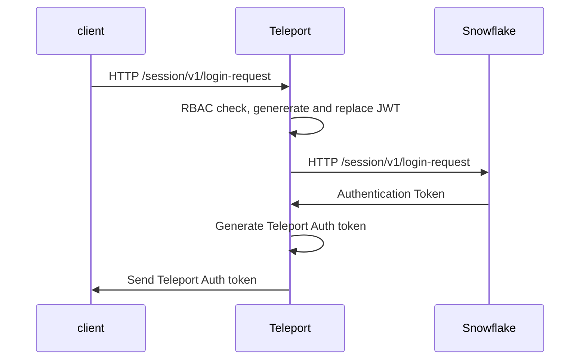
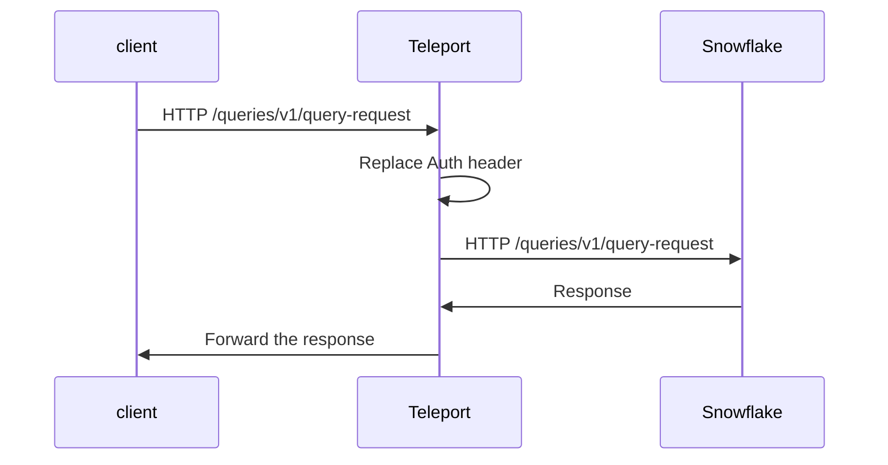

# RFD XX - Snowflake Database support

## What

[Snowflake](https://www.snowflake.com/) integration in Teleport Database Access. 

## Why

We want to increase the number of databases supported by Teleport. 

## Details

The Snowflake support can be split into 4 parts:

1. Database access support - changes inside Teleport Data Access.
2. CLI support - `snowsql` the official Snowflake client.
3. GUI clients support - DataGrip by JetBrains, DBeaver and similar.
4. WebUI integration https://app.snowflake.com/.

### Snowflake architecture

* Snowflake uses REST API for communication. 
* Payload is a regular JSON. Some queries can also carry payload in [Arrow format](https://arrow.apache.org/). 
* Snowflake uses a slightly modify JWT token flow for authentication (details below).

### Teleport configuration

Like in case of other databases, a user will have to add an entry to the teleport configuration file. Example:

```yaml
db_service:
  enabled: "yes"
  databases:
      - name: "snowflake"
      description: "Snowflake database"
      protocol: "snowflake"
      uri: "im12345.us-east-2.aws.snowflakecomputing.com"
```

The next step would be to add teleport CA to users account. `tctl` could learn to export the required keys in the same way
as it does today for different databases. The exported key must then be added to Snowflake by an administrator.
The procedure of adding the key to Snowflake is described [here](https://docs.snowflake.com/en/user-guide/key-pair-auth.html#step-4-assign-the-public-key-to-a-snowflake-user).

### Database access support

On `tsh db login` `tsh` should export a private key in PCKS8 format. That key should be used to sign a "Teleport JWT".
Client then should send the request with generated JWT to authenticate with Snowflake.
Teleport can intercept HTTP communication between a client and the Snowflake. Client should send the first request to 
`/session/v1/login-request` endpoint. JWT token prepared by the client can be then read and replaces by Snowflake JWT
generated by Teleport DB service. In this way the real token is not accessible by a user and 
Teleport can still validate if the request comes from a trusted source.



Then on each request Teleport can replace the "Teleport Auth token" with Snowflake Auth token:



With this approach the real session token never leaves the Teleport and any client is not able to bypass Teleport
by extracting the session token.
Snowflake session token needs to be refreshed every X minutes. For that purpose Teleport would have to internally refresh
the token as client doesn't have access to the token.

#### Query logging

Queries can be extracted from requests sent to `/queries/v1/query-request` endpoint, field `data.sqltext`.

#### User authentication

Username can be extracted from `/session/v1/login-request` requests, field `data.LOGIN_NAME`. The extracted username
can be then use to authenticate the user against the Teleport RBAC.

### CLI support 

`snowcli` doesn't support TLS terminated proxies as described in https://docs.snowflake.com/en/user-guide/snowsql-start.html#using-a-proxy-server
nor uses TLS on a different port that 443. `snowsql` requires to use one of the available authentication method. 
By default, it asks for password unless other authentication option is specified. Other alternatives are SSO and JWT/Private key (https://docs.snowflake.com/en/user-guide/snowsql-start.html).
Teleport could use JWT/Private key for authentication. In this flow `tsh` would export user's private in PKCS8 format (at that's the only one supported by `snowsql`),
and `snowsql` could use it to sign the JWT token.

`snowcli` can connect to a custom host **without** TLS on any port different that 443. Because we cannot start `tsh proxy db` on port 443
we could just start `tsh` proxy on a different port as `tsh` can encrypt the transmission to the Teleport proxy. This approach of course
has one big drawback; the connection is not end-to-end encrypted as communication between `tsh` and `snowsql` uses plain text.

I was able to use TLS terminated proxy with `tsh` by using HTTP proxy. `snowsql` sends the traffic to Teleport and this one
can terminate the TLS connection to read the traffic. 
Below example shows how to start `snowsql` in that mode:

```shell
export https_proxy=localhost:2000
export http_proxy=localhost:2000
export CURL_CA_BUNDLE=/opt/homebrew/etc/ca-certificates/cert.pem
export REQUESTS_CA_BUNDLE=/opt/homebrew/etc/ca-certificates/cert.pem

snowsql --noup -a im56867.us-east-2.aws -u teleport-user --private-key-path ${HOME}/.tsh/keys/example.com/bob.pkcs8 -h me.localhost
```

* environment variable `https_proxy` - sets the address of `tsh proxy db` tunnel address. Traffic will be sent there.
* environment variable `CURL_CA_BUNDLE` - passes Teleport's CA bundle, so we can terminate TLS connection with our certificate.
* `--private-key-path` - sets the path to PCKS8 private key that will be used to sign JWT.
* `-h me.localhost` - is the name of destination server, in our case this name has to match the name on the certificate that we will use for TLS termination.

`tsh` would have to learn how to export the user private key in PKCS8 format as this is the only format that `snowsql` understands.

### UX

Snowflake will integrate with teleport in the same way as other databases. 

* `tsh db connect` - would start `snowsql`.
* `tsh proxy db` - would start proxy for 3rd party GUI clients.

### 3rd party GUI clients

All clients that I was able to find require username and password (DBeaver also supports SSO, but I don't see 
how that would help us). Currently, I don't see any workaround to that except asking user to leave the password empty
(if client supports it) or providing a dummy password.

### Web UI access

Web UI would be a nice thing to have, but Snowflake WebUI doesn't use JWT, so it cannot be easily integrated with
the Application Access. For the initial implementation Web UI will be excluded from the scope.

## Security

* Snowflake access token should not be forwarded to connected clients to minimize the changes of leaking it.
* If we decide to use unencrypted connection between a client and the `tsh` then the traffic can be potentially sniffed
by a malicious actor.

### Notes

* JWT tokens used by Snowflake are not compatible with the tokens generated by our JWT generator implemented in Application Access.
Database Access will be responsible for generating the tokens currently doesn't have permission to generate them.
To make it work we can either add permission for Database Access to access JWT generation and extend its functionality or reimplement 
some logic in Database Access.
* Teleport could in the future automatically rotate Snowflake access keys when Database CA is rotated. Snowflake provides an API
for that.
