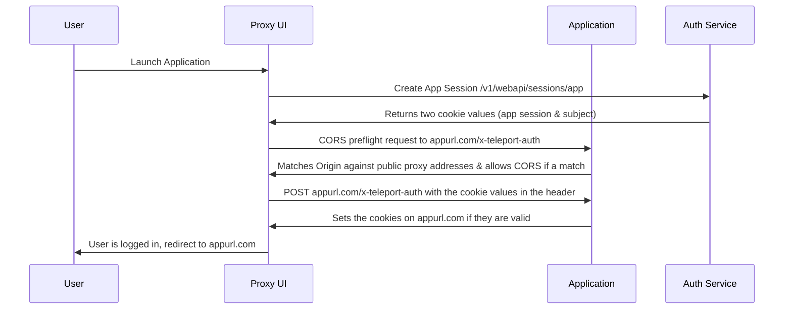

# RFD 103 - Application Access Web UI Auth Flow

## What

This is an overview of the flow used for setting the relevant cookies when a user logs in to an
application through Teleport Web UI.

## Why

The method used to set cookies on a different domain requires a few changes to Teleport's default security
mechanisms. It's important these changes are documented and understood for future reference.

## Details

When a user wants to login to an application, a new application session is created in
the auth service. This application session has two values (a name and a bearer token) that need to be provided
as cookies when the user navigates to the application's URL.

The flow to be able to set the needed cookies from the application session across different domains is
as follows:

### CORS

As we need to enable cross-origin requests from the proxy URL to the application URL, we add middleware
before `/x-teleport-auth` to check the `Origin` header (this cannot be changed via a `fetch` request).

We check the origin against the public addresses of the proxy, and if one is a match, we allow a cross-origin
request.

The rules around the cross-origin request are strict and the absolute minimum needed:

- Must be a `POST` request
- Only allowed for the `/x-teleport-auth` endpoint
- Only allows the headers `X-Cookie-Value` and `X-Subject-Cookie-Value` to be set
- Only allowed from one of the public proxy addresses

### Content Security Policy

Teleport's default content security policy disallows cross-origin requests by setting `connect-src` to `'self' wss:`.

To allow for the request to the application's domain, we modify the content security policy for `/web/launch` URLs
only. This changes `connect-src` to `'self' https://applicationfqdn:*`, which allows requests to both proxy as
normal, and the application's FQDN.

### Cookie Validity Checking

In the handler for `/x-teleport-auth`, we take the cookie values from the headers and use `X-Cookie-Value` to
look-up the application session created by the auth service.

If this application session exists, we then check the value of the `X-Subject-Cookie-Value` header against the
bearer token stored in the application session.

If these both match, we set the relevant cookies to log the user in once they're redirected to the application.
