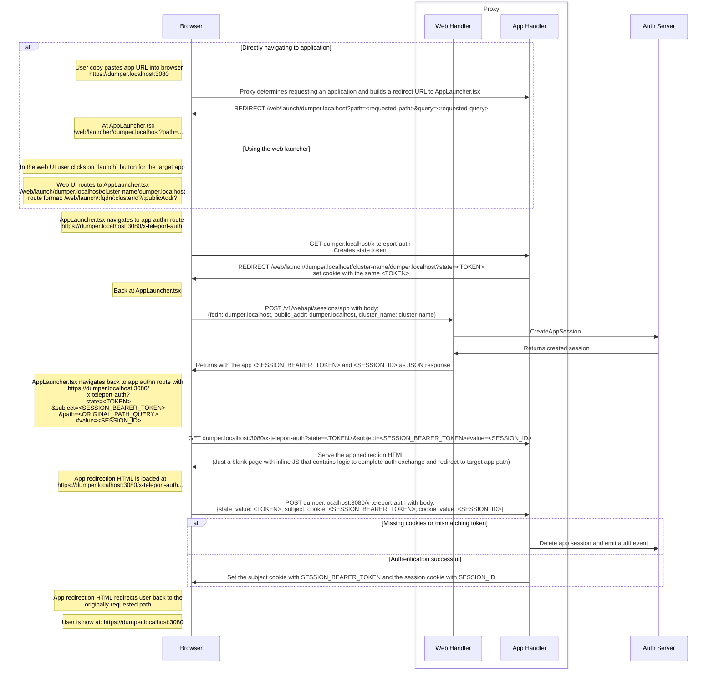

# RFD 103 - Application Access Web UI Authn Flow

## What

This is an overview of the authn flow used through the Teleport Web UI for setting the relevant cookies for when a user accesses an
application.

## Why

To document and understand the HTTP application access authn flow for future reference.

### Document

- Original [AAP document](https://docs.google.com/document/d/1CIFURGOSy-qQccRH7rPTzw_TscD3iHMswkv6qzTv6_E/edit#heading=h.7pympy0nya4) about session

## Details

When a user wants to access an application, the authn flow to this application involves a series of redirects to ultimately set the two cookies required to authenticate requests to the target application:

1. Application session cookie `__Host-grv_app_session`: Stores the application web session's id.
2. Application session subject cookie `__Host-grv_app_session_subject`: Stores the application web session's bearer token. This was required to use as a secret to prevent an auditor from [hijacking user sessions](https://github.com/gravitational/teleport-private/pull/216), since we log the session id in our audit log.

If authenticating requests to the target application fails (missing/invalid cookies), Teleport will redirect the user to the Teleport webapp's [AppLauncher.tsx](https://github.com/gravitational/teleport/blob/860623e72a97825ff4c943055e7d91a00da7700a/web/packages/teleport/src/AppLauncher/AppLauncher.tsx).

The Teleport webapp, may redirect the user to the login screen first before loading the `AppLauncher.tsx`. The handler that [creates application web session](https://github.com/gravitational/teleport/blob/07abd2277e17639a4a505158f2d1cb5104db7d32/lib/web/apiserver.go#L639) requires that the user is authenticated and has a valid web session. After logging in, the webapp will redirect user back to the `AppLauncher.tsx`.

The `AppLauncher.tsx` conducts the initial app authn flow and does the following:

1. `AppLauncher.tsx` navigates to app route `/x-teleport-auth` that initiates the Oauth like `state` exchange
2. `/x-teleport-auth` responds by redirecting user back to `AppLauncher.tsx` with a query param `state` (a query param that preserves the originally requested URL path & query) and with a short lived `state` cookie
3. `AppLauncher.tsx` makes a request to create an application web session
4. Lastly, `AppLauncher.tsx` navigates back to app route `/x-teleport-auth` passing the `state`, the originally requested URL path & query, and the application web session response via URL params

OAuth like `state` exchange pattern is used to protect the app route `/x-teleport-auth` from CSRF. The authn flow uses two HTTP methods:

- GET: `begins` the authn flow. Performs two different actions:
  1. If the request URL does not contain `state` query param, it creates a random token and redirects the user back to the `AppLauncher.tsx` with both a `state` query param and a `state` cookie set with the random token value
  2. If the `state` query param is present, it serves a `app redirection HTML` (contains inline JS that runs after page is loaded)
- POST: `completes` the authn flow. This method is called within the inline JS served by the GET method and does the following:
  - checks that the `state` value passed via request body matches the value found in `state` cookie (double submit cookie method)
  - validates the app session values passed via request body (session ID and bearer token)
  - sets the required app cookies with the validated app session values
  - upon any error encountered related to missing cookies, tokens, and mismatching expected values, an audit event will be emitted as [auth attempt failure](https://github.com/gravitational/teleport/blob/0161397479e88dfcf97951cbc9ea6b7ebf02a497/lib/events/codes.go#L274), and delete's app session if a session ID was provided.

The `app redirection HTML` is just a blank HTML page with an inline JS that runs upon loading. The JS makes a fetch-based POST request to `/x-teleport-auth` with a JSON body containing the `state` value, the session id, and the session bearer token. After successful validation of these values in the backend, the handler completes the authn flow by setting the required app cookies. After returning from the request, the JS will redirect the user to the originally requested URL.

It's important to note that browser's will now block `3rd party cookies` by default. But all the cookies we set during this authn flow are considered `first party cookies`. That's because we first navigate to the app's domain (by app route `/x-teleport-auth`), and then we set the cookie while we are still at the app domain.

A visual flow below using the debug dumper app as an example `dumper.localhost:3080`. Note that there is two ways to begin the flow:

1. Directly navigating to the application eg: copy paste URL or clicking on a app link
2. User clicks on the app `launch` button in the Teleport Web UI

