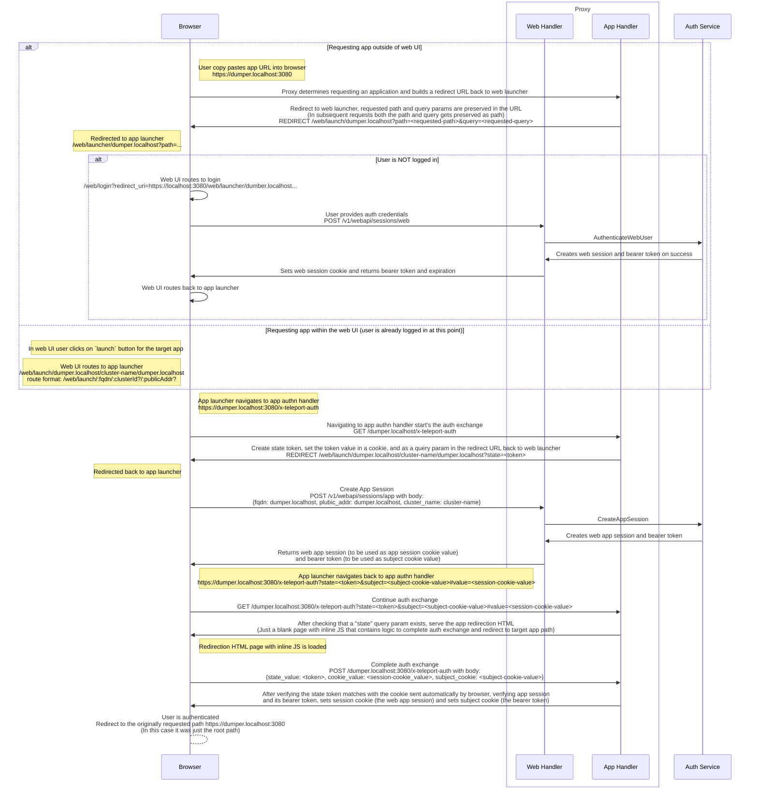

# RFD 103 - Application Access Web UI Auth Flow

## What

This is an overview of the flow used for setting the relevant cookies when a user logs in to an
application through Teleport Web UI.

## Why

To document and understand the HTTP application access authn flow for future reference.

## Details

When a user wants to login to an application, a new application session has to be created in
the auth service. This application session has two values (a session name and a bearer token) that need to be provided
as cookies when the user navigates to the application's URL.

The flow to be able to set the needed cookies from the application session across different domains is
as follows (using debug dumper app as example):

### CSRF Protection

We use the double submit cookie technique to protect against CSRF for the endpoint `POST /target-app/x-teleport-auth` which grants the cookies that is required by the target app (session cookie and subject cookie).

When initiating auth exchange, the backend will create a crypto safe random token and send back this token value as part of a query param called `state` and as a cookie (set on the target app domain).

Call to `POST /target-app/x-teleport-auth` will check that the `state` query param matches with the value of the cookie sent automatically by the browser.
