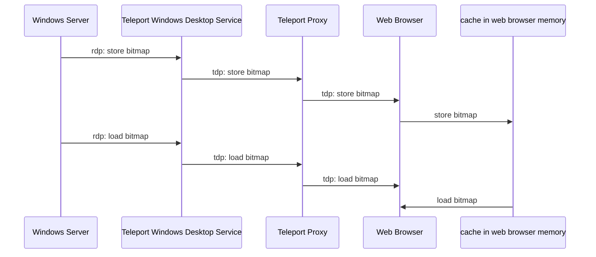

# RFD 104 - Desktop Access Performance

## What

[TODO]

## Details

### Goals

### Overview

### RDP Bitmap caching

One of the ways to improve performance of the Desktop Access is to reduce the amount of data that we have to send between the proxy and the web browser and the number of bitmap messages that we need to process.

We can achieve this by utilising an extension to the RDP protocol:

[[MS-RDPEGDI] Remote Desktop Protocol: Graphics Device Interface (GDI) Acceleration Extensions](https://learn.microsoft.com/en-us/openspecs/windows_protocols/ms-rdpegdi/745f2eee-d110-464c-8aca-06fc1814f6ad)

This extension specifies usage of bitmap caches that can be used to reduce the bandwith associated with graphics operations. It contains definitions of messages to save and load bitmaps from client cache instead of transmiting bitmap data every time. 

[Bitmap caches](https://learn.microsoft.com/en-us/openspecs/windows_protocols/ms-rdpegdi/2bf92588-42bd-4527-8b3e-b90c56e292d2)
are used by the client and all are managed by the server. The server determines which bitmap to cache and what cache index to use to store that bitmap in client's local cache.
The server sends a message that contains cache index and bitmap data to the client and the client must store that bitmap in local cache.
Only after the server sent a message to store bitmap in the cache it may send the message to inform client to load the bitmap from the cache and use it to render on the screen.

There is different types of bitmap caches in the specification, but we'll only the one that allows to store the most cache items: `Cache Bitmap – Revision 2`. 

Desktop Access Protocol would need to be extended with following messages:

#### 29 - bitmap cache save

This message is sent from the server to the client to store a bitmap in the bitmap cache

```
| message type (29) | cache_id uint32 | cache_index uint32 | data_length uint32 | data []byte |
```

#### 30 - bitmap cache load

This message is sent from the server to the client to render a bitmap stored in the bitmap cache

```
| message type (30) | cache_id uint32 | cache_index uint32 | top uint32 | left uint32 | right uint32 | bottom uint32 |
```



The sequence diagram above shows the flow of messages between all components.
- server sends [message](https://learn.microsoft.com/en-us/openspecs/windows_protocols/ms-rdpegdi/3c76f8fb-fcaa-4ca6-9d2e-3f449bdbed40) to inform client to store bitmap in the cache
- windows destkop service translates rdp message into tdp message to store bitmap and sends it to the proxy
- proxy forwards message to web browser
- web browser stores bitmap in the in-memory cache
- server sends [message](https://learn.microsoft.com/en-us/openspecs/windows_protocols/ms-rdpegdi/84c2ec2f-f776-405b-9b48-6894a28b1b14) to inform client to load bitmap from the cache
- windows destkop service translates rdp message into tdp message to load bitmap and sends it to the proxy
- proxy forwards message to web browser
- web browser loads bitmap from the in-memory cache

The browser's in-memory-cache is an array of hash tables where cache_id equals to the index of the array, and the cache_index is a key in the hash table.