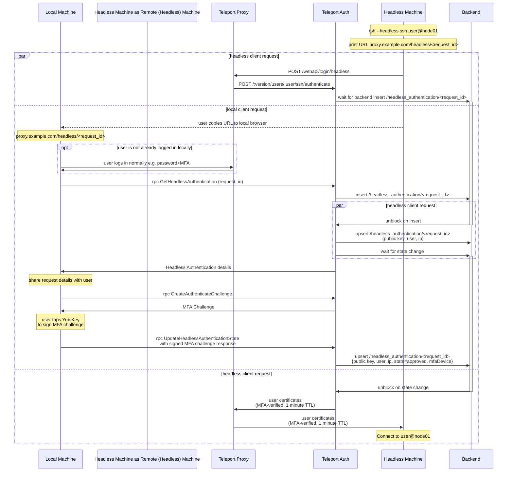

# RFD 105 - Headless Authentication

## Required Approvers

* Engineering: @r0mant && @jakule
* Security: @reed || @jentfoo
* Product: @xinding33 || @klizhentas

## What

Support headless authentication for Teleport clients.

Headless authentication is a non-interactive form of authentication that relies on a secondary party to authenticate a user. In our case, headless authentication will be used to authenticate a user on a remote machine using their credentials and MFA device on their local machine.

## Why

Some users have valid use cases for making `tsh` requests on a remote, sometimes shared, machine.

For example:

 1. Connecting to Teleport Nodes.
 1. Performing `tsh scp` from one Teleport Node to another Teleport Node.

However, `tsh` does not currently work well on remote machines for two reasons:

 1. Client credentials are usually saved to disk, where they may be overwritten, used, or stolen by anyone with access to the remote machine.
 1. Teleport widely uses MFA to authenticate client logins and actions, which may require direct access to a WebAuthn device. For example, with Per-session MFA, each SSH connection to a Teleport Node may require MFA verification.

Headless authentication will provide a secure way to support these types of remote use cases.

## Details

### Security

#### Headless authentication design principles

Headless authentication should fulfill the following design principles to ensure that the system can not be easily exploited by attackers, including attackers with elevated privileges who are able to read from the authenticated user's files or sockets.

1. **The Client does not write any keys, certificates, or session data to disk on the remote machine**

When using headless authentication, Teleport clients will generate a new private key in memory for the lifetime of the client. This private key will not be exported anywhere. Only its public key counterpart will be shared externally to get user certificates. Likewise, the user certificates will be held in memory for the lifetime of the client.

This solves two problems: 1) multiple users on the same remote machine will not have overlapping credentials on disk in `~/.tsh` and 2) attackers will not be able to steal a user's credentials from disk.

We will also lock the process memory using [`unix.Mlockall`](https://pkg.go.dev/golang.org/x/sys/unix#Mlockall) to ensure that an attacker can not swap out process memory to disk, in order to extract the client's certificates.

2. **Issued certificates through headless authentication are short lived (1 minute TTL)**

Since the user certificates are only meant to last for a single client lifetime, the Auth server should issue the certificates with a 1 minute TTL. This limits the damage potential if an attacker manages to compromise the user's certificate, whether through a faulty client or a clever attack.

Note: SSH sessions started with these certs will also be subject to the `max_session_ttl` role option.

3. **User must complete WebAuthn authentication for each individual headless `tsh` request (`tsh ls`, `tsh ssh`, etc.)**

Headless authentication, like any login mechanism, can be started by any unauthenticated user. To prevent phishing attacks, we must prompt the user to acknowledge and approve each headless authentication request with WebAuthn, since WebAuthn provides strong protection against phishing attacks. Legacy OTP MFA methods will not be supported.

4. **The Server must verify that the client requesting certificates is the only client that can receive/use the certificates**

To ensure the requesting client is the only client that can use resulting headless certificates, we will use the PKCE-like flow common to all Teleport login flows. The client provides their public key in the login request, and the server issues certificates for the client's public key. If the client does not have access to the corresponding client private key, they cannot use the certificates.

##### Conclusion

The design principles above go a long way in ensuring the security of headless authentication. There should be no way for an attacker to make a straightforward attack, like exfiltrating the user's key/certificates. Since WebAuthn verification is required, it should also be impossible for an attacker to hack the user's local machine to approve a fraudulent headless authentication. The headless authentication API flow is secured so it cannot be intercepted by an attacker.

Despite this, there are still two possible of attacks which we need to be aware of.

1. Since headless authentication can be started by anyone with access to the Teleport Proxy and a Teleport User name, users may be phished into approving headless authentication attempts that they did not start themselves. This phishing attack would require the user to 1) go to the SSO url provided by the attacker and 2) approve the attempt with MFA. Since headless authentication is only meant for users to approve themselves, the user would need to be negligent and willing to approve random requests. Through documentation and warnings during the authentication flow, users should be notified that they should never authorize a request that they did not start, similar to how many platforms warn that they will never ask a user for their password.

2. If an attacker has elevated privileges on the remote machine, they could replace the user's `tsh` binary with a modified binary. When the user unsuspectingly uses this binary and performs headless authentication, the binary could write the certificates and key to disk for the attacker to exploit.

In both cases, the attacker manages to steal headless authenticated certificates. However, these certificates will only have a 1 minute TTL, so the blast radius can be kept relatively small, assuming the attack is not recurring. We can reduce the feasibility of these attacks further by:

1. Providing sufficient information for the user to verify the request before approving. Before the user can approve a headless authentication, they should be notified of relevant request details (ip address, request id, public key), as well as a warning that they should NEVER approve a request that they did not initiate themselves. For example, a user should never approve a headless authentication request made by a system admin. This is similar to how many platforms tell users that their support team will never ask for a user's password, and should be expressed with similar importance.

2. Limiting the permissions of the resulting headless certificates. In theory, the client knows exactly what permissions it needs to fulfill the request, it can request a subset of the user's normal RBAC permissions to complete the request. For example, `tsh --headless ssh dave@server01` can request a certificate that provides just enough to connect to `server01` as `dave`. This approach gives the server adequate certainty that the command requested is the command that will be performed, so a modified client cannot misuse the certificates. Now we can safely provide the user with the requested command so that they can more confidently verify their headless authentication request is not coming from a modified client or phishing attack.

**Important Note**: limiting the certificate permissions is out of scope for this RFD, as it will likely require a completely separate subsystem design. Headless Authentication will be released in preview mode without certificate permission limitations, and we will assess the scope of certificate permission limitations before officially release headless authentication.

#### Unauthenticated headless login endpoint

The new new `POST /webapi/login/headless` endpoint will be unauthenticated like other login endpoints, meaning anyone with access to the Teleport Proxy address can attempt to perform headless login for a Teleport user. We will rate limit the endpoint in the same way we do with the other login endpoints to prevent DoS attacks.

Unlike other login endpoints, `POST /webapi/login/headless` needs to write the `HeadlessAuthentication` resource to the backend before the user is authenticated, so that the user can view and approve login details. A malicious actor could potentially use this endpoint to overload the backend to catastrophic effect, even with standard rate limiting in place.

To circumvent this attack vector, we will use an on-demand approach. Rather than inserting the `HeadlessAuthentication` resource immediately, the request will wait until an authenticated user calls `rpc GetHeadlessAuthentication`, the first step of headless login approval. This will be accomplished by having `GetHeadlessAuthentication` insert an empty resource to the backend, if it doesn't already exist. The Auth server will detect this insertion and update the resource with the actual request details. Finally, `GetHeadlessAuthentication` will detect the resource update and return the details to the user.

### Headless authentication overview

The headless authentication flow will be modeled after our existing SSO authentication flows, where the user issues an `AuthRequest`, directs the client to approve the request via SSO, and then completes authentication with the approved auth request. Unlike with SSO authentication, we have control over the headless authentication flow through our Proxy/Auth APIs.

#### Diagram

The headless authentication flow is shown below:



This flow can be broken down into three parts: headless login initiation, local authentication, and certificate retrieval.

#### Headless login initiation

First, the client initiates headless login through the web proxy endpoint `POST /webapi/login/headless`. The client provides normal login parameters (client public key, proxy address, etc.). The Proxy sends these headless login details to the Auth server through `POST /:version/users/:user/ssh/authenticate`, the standard SSH authentication endpoint.

A request id will be derived from the client's public key so that an attacker cannot intercept the headless login. If we used a random UUID, an attacker could attempt to mimic the user's request with the random UUID and their own public key. From the Auth server's perspective, it would have no way to tell which login attempt is valid.

Note: We could also use the public key directly (base64 encoded), but we choose to use a UUID to shorten the URL and improve its readability.

As [explained above](#unauthenticated-headless-login-endpoint), the Auth server will write the request details to the backend under `/headless_authentication/<request_id>` on demand. It will have a short TTL, matching the callback timeout of the request. The request will begin in the pending state. The Auth server then waits for the user to approve the authentication request using a resource watcher.

#### Local authentication

In parallel to headless login initiation, the client will generate a Teleport web Proxy URL for the client to complete headless authentication: `https://proxy.example.com/headless/<request_id>`. The URL is shared with the user so they can locally authenticate the auth request from their local browser.

When the user opens the URL locally, their local login session will be used to connect to the Teleport Auth server. If the user is not yet logged in, they will be prompted to login with MFA as usual.

Once connected, the user can view the request details and either approve or deny the request:

* If the user approves the request, they will need to pass an MFA challenge to update the request to the approved state.
* If the user denies the request, the request will be updated to the denied state.

If the headless authentication is approved with a valid MFA challenge, the backend will be updated to reflect the approved state and the MFA device used.

#### Certificate retrieval

If the headless authentication is approved/denied, the Auth server's resource watcher will unblock to complete/deny the authentication attempt. If approved, the auth server will generate certificates for the user. These certs will have a 1 minute TTL and MFA-verified by the MFA device saved in the headless authentication resource.

The resulting user certificates will then be returned to the Proxy and then to the client. Now the client can complete the `tsh` request initially requested, e.g. `tsh ssh user@node01`.

### `HeadlessAuthentication` resource watcher

Both `POST /webapi/login/headless` and `rpc GetHeadlessAuthentication` make use of resource watchers to accomplish their respective goals. Creating resource watchers for every headless login request will put unwanted strain on the Auth Server. Instead, we will introduce a new basic resource watcher built for simplicity and efficiency. Many of the more complex, and expensive, watcher features will not be implemented (staleness detection, custom filters, etc.). The Auth service will be initiated with a single headless authentication watcher.

### Audit log

The following actions will be tracked with audit events:

* User initiates headless login
* User approves/denies headless login request

### Protobuf Definitions

```proto
package teleport.headlessauthn.v1;

// HeadlessAuthenticationService provides methods to view and update headless authentication requests.
service HeadlessAuthenticationService {
  // GetHeadlessAuthentication is a request to retrieve a headless authentication from the backend.
  rpc GetHeadlessAuthentication(GetHeadlessAuthenticationRequest) returns (HeadlessAuthentication);

  // UpdateHeadlessAuthenticationState is a request to update a headless authentication's state.
  rpc UpdateHeadlessAuthenticationState(UpdateHeadlessAuthenticationStateRequest) returns (google.protobuf.Empty);
}

// Request for GetHeadlessAuthentication.
message GetHeadlessAuthenticationRequest {
  // Name is the headless authentication id.
  string name = 1;
}

// Request for UpdateHeadlessAuthenticationState.
message UpdateHeadlessAuthenticationStateRequest {
  // Name is the headless authentication id.
  string name = 1;

  // NewState is the state that the request will be updated to.
  // MFA verification is required if NewState=APPROVED.
  State new_state = 2;

  // MFAResponse is an mfa challenge response used to verify the user.
  // MFA Auth Challenges can be created for a user with the
  // authservice.GenerateAuthenticateChallenge rpc.
  proto.MFAAuthenticateResponse mfa_response = 3;
}

// HeadlessAuthentication holds data for a headless authentication request.
message HeadlessAuthentication {
  // Metadata is resource metadata.
  types.Metadata metadata = 1;

  // Version is the resource version.
  string version = 2;

  // User is a teleport user name.
  string user = 3;

  // State is the headless authentication request state.
  State state = 4;

  // MFADevice is the mfa device used to approve the request in case of successful auth.
  types.MFADevice mfa_device = 5;

  // PublicKey is a public key to sign in case of successful auth.
  bytes public_key = 6;
}

// HeadlessAuthenticationState is a headless authentication state.
enum HeadlessAuthenticationState {
  HEADLESS_AUTHENTICATION_STATE_UNSPECIFIED = 0;

  // authentication pending.
  HEADLESS_AUTHENTICATION_STATE_PENDING = 1;

  // authentication denied.
  HEADLESS_AUTHENTICATION_STATE_DENIED = 2;

  // authentication approved.
  HEADLESS_AUTHENTICATION_STATE_APPROVED = 3;
}
```

### Server changes

#### `POST /webapi/certs/ssh`

This is an existing endpoint used by a user to login with `tsh` or Teleport Connect. We will add the `HeadlessAuthenticationID` field to switch to headless authentication instead of password/otp.

Like other login endpoints, this endpoint is not authenticated and can be called by anyone with access to the Teleport Proxy address.

```go
type CreateSSHCertReq struct {
  // User is a teleport username
  User string `json:"user"`
  // Password is user's pass
  Password string `json:"password"`
  // OTPToken is second factor token
  OTPToken string `json:"otp_token"`
  // HeadlessAuthenticationID is a headless authentication resource id.
  HeadlessAuthenticationID string `json:"headless_id"`
  // PubKey is a public key user wishes to sign
  PubKey []byte `json:"pub_key"`
  // TTL is a desired TTL for the cert (max is still capped by server,
  // however user can shorten the time)
  TTL time.Duration `json:"ttl"`
  // Compatibility specifies OpenSSH compatibility flags.
  Compatibility string `json:"compatibility,omitempty"`
  // RouteToCluster is an optional cluster name to route the response
  // credentials to.
  RouteToCluster string
  // KubernetesCluster is an optional k8s cluster name to route the response
  // credentials to.
  KubernetesCluster string
  // AttestationStatement is an attestation statement associated with the given public key.
  AttestationStatement *keys.AttestationStatement `json:"attestation_statement,omitempty"`
}

// SSHLoginResponse is a user login response
type SSHLoginResponse struct {
  // Username contains the username for the login certificates
  Username string `json:"username"`
  // Cert is a PEM encoded SSH certificate signed by SSH certificate authority
  Cert []byte `json:"cert"`
  // TLSCertPEM is a PEM encoded TLS certificate signed by TLS certificate authority
  TLSCert []byte `json:"tls_cert"`
  // HostSigners is a list of signing host public keys trusted by proxy
  HostSigners []TrustedCerts `json:"host_signers"`
}
```

#### `rpc GetHeadlessAuthentication`

This endpoint is used by Teleport clients to retrieve headless login request details before prompting the user for approval/denial.

It is authorized for roles with `read` permissions on the `headless_authentication` resource kind, or for the user who requested headless authentication.

#### `rpc UpdateHeadlessAuthenticationState`

This endpoint is used by Teleport clients to update headless login request state to approved or denied.

It is only authorized for the user who requested headless authentication. Additionally, when updating the state to `APPROVED`, the client must provide a valid MFA challenge response for the user. An MFA challenge can be requested from the existing rpc `CreateAuthenticateChallenge`.

#### `POST /:version/users/:user/ssh/authenticate`

This is an existing endpoint used to authenticate a user and receive user certs. We will add the `headless` field to switch to headless authentication instead of password/WebAuthn/etc.

```go
// AuthenticateUserRequest is a request to authenticate interactive user
type AuthenticateUserRequest struct {
  // Username is a username
  Username string `json:"username"`
  // Pass is a password used in local authentication schemes
  Pass *PassCreds `json:"pass,omitempty"`
  // Webauthn is a signed credential assertion, used in MFA authentication
  Webauthn *wanlib.CredentialAssertionResponse `json:"webauthn,omitempty"`
  // OTP is a password and second factor, used for MFA authentication
  OTP *OTPCreds `json:"otp,omitempty"`
  // Session is a web session credential used to authenticate web sessions
  Session *SessionCreds `json:"session,omitempty"`
  // ClientMetadata includes forwarded information about a client
  ClientMetadata *ForwardedClientMetadata `json:"client_metadata,omitempty"`
  // HeadlessAuthenticationID is the ID for a headless authentication resource.
  HeadlessAuthenticationID string `json:"headless_authentication_id"`
}
```

### UX

#### `tsh --headless`

We will add a new `--headless` flag to `tsh` which can be used to authenticate for a single `tsh` request. When this flag is provided, `tsh` will prompt the user to complete headless authentication on their local machine from the URL `https://proxy.example.com/headless/<id>`. Once the user completes local authentication, `tsh` will receive credentials to complete the request.

```console
$ tsh --headless --proxy=proxy --user=user ssh user@node01
Complete headless authentication in your local web browser:
https://proxy.example.com/headless/<id>
// Wait for user to complete local authentication with MFA
<user@node01> $
```

#### Headless authentication URL

When the user goes to the headless authentication URL, the user will be prompted to login with MFA, if they are not logged in already. The user will then be notified of additional request details. Finally, the user is asked to verify with MFA to approve the request.

Example (Exact UI/UX TBD):

```
Headless login attempt requires approval. Contact your administrator if you didn't initiate this login attempt.
Additional details:
  - request id: <id>
  - public key: <ssh_public_key>
  - ip address: <ip_address>
Tap your YubiKey to approve
```

Note: When the user has to log in for the first time, we do not reuse their MFA verification to skip the second MFA check. Although this would be better UX, we cannot retrieve additional request details to share with the user until they log in. For security reasons, we should provide an MFA check after sharing the headless request details.

#### Environment variables

In the `tsh --headless` flow, users never run `tsh login` on their remote machine. Instead, we expect the `--proxy`, `--user`, and `--headless` flags to be supplied to each command. To reduce UX friction, users can set the environment variables `TELEPORT_PROXY=<proxy_addr>`, `TELEPORT_USER=<user>`, and `TELEPORT_HEADLESS=true` instead.

We prefer setting environment variables rather than saving config to disk (`~/.tsh/proxy.example.com.yaml` and `~/.tsh/current-profile`) so that the headless flow remains stateless, preventing conflicts on shared machines.

#### Supported commands

Initially, we will only add support headless authentication for `tsh ls`, `tsh ssh`, and `tsh scp`. This way, when we the certificate permission limitations noted in the security section, we only need to support these three commands. Otherwise, we may end up regressing support for other `tsh` commands that are not covered by the certificate permission limitation changes. We may add support for more commands once certificate permission limitations are implemented.

#### Teleport Connect

Teleport Connect will also be updated to handle the approval link `https://proxy.example.com/headless/<request_id>` with MFA verification included.

### Additional comments

#### Utilizing the access request subsystem

Headless authentication could be implemented by expanding the access request subsystem. `/webapi/login/headless` could submit a special headless authentication access request that can only be approved by the user with MFA, and could be used to assume the user's roles. I thoroughly investigated designs around this idea, but found they add too much complexity to the already heavily utilized access request subsystem.
