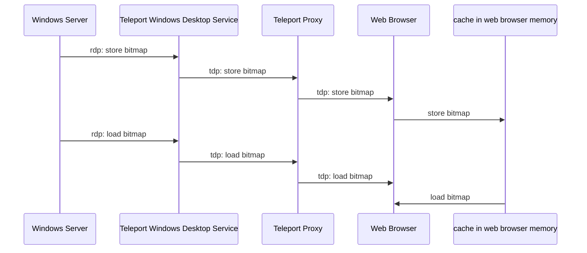

# RFD 107 - Desktop Access Performance

## Required Approvers

Engineering: @zmb3 && @ibeckermayer

## What

This RFD explores possible solutions to the current performance problems in the destkop
access module.

## Why

We want to improve user experience when using the desktop access module. Currently the main issue
is insufficient performance of the video rendering which results in choppier experience or noticeable stuttering. Each frame in the RDP protocol as we're currently using it consists of (in most cases) 64x64 pixel bitmaps that are assembled into the full screen image. All of these bitmaps needs to be sent by the server, and received and processed by the client. There are different settings we can apply to RDP, which can be classified into two general ways in which we can reduce the time needed to render a frame.
One of the ways is to reduce the amount of data that we need to send over the wire. The other way is to reduce the time required to process that data. In this document we'll discuss some solutions that achieve these goals.

### RDP Bitmap caching

One of the ways to reduce the amount of data sent between the proxy and the web browser is to reduce the number of messages with bitmap data that need processing. The RDP protocol extension [[MS-RDPEGDI] Remote Desktop Protocol: Graphics Device Interface (GDI) Acceleration Extensions](https://learn.microsoft.com/en-us/openspecs/windows_protocols/ms-rdpegdi/745f2eee-d110-464c-8aca-06fc1814f6ad) achieves this end by encoding the drawing operations that produce an image instead of always sending the actual bitmap data. Multiple drawing operations are introduced in this extension, but this document focuses on only two operations that interact with the bitmap caches.

The way it works is both the server and the client has a bitmap cache, and it's the server responsibility to control the contents of both bitmap caches. The server can either instruct the client to store bitmap data in the cache, or to load stored data from the cache and render in on the screen. This means that the bitmaps in the cache can be rendered multiple times without the need to send the same (bulky) data over the wire each time. On top of that, a single message from the RDP server can contain tens or even hundreds of drawing operations. Together, this system can significantly reduce the latency and bandwidth usage of the RDP connection.

There are two types of caches specified in the extension. The first one, called `Revision 1`, only supports memory-based caching and defaults to 6MB of cache storage for 32bpp bitmaps. The other one, called `Revision 2`, supports persistent disk caching in addition to memory caching and defaults to 40MB of cache storage for 32bpp bitmaps.
Given that our clients can afford a 40MB cache, the obvious choice is to support `Revision 2` cache since it allows to store more data inside its cache, and thus lower bandwidth overall.

Depending on the number of bits per pixel in bitmaps, the cache limits vary. Here's a full breakdown of the cache types and their sizes:

| bpp | revision 1 | revision 2 |
| --- | :--------: | ---------: |
| 8   |   1.5 MB   |       10MB |
| 16  |   3.0 MB   |       20MB |
| 24  |   4.5 MB   |       30MB |
| 32  |   6.0 MB   |       40MB |

#### How it works on the protocol level?

Two new types of messages need to be handled by our RDP library in order to enable support for bitmap caching. One that stores bitmap data inside a bitmap cache, called `Cache Bitmap - Revision 2`, and another that renders a previously stored bitmap, called `MemBlt`.
`Cache Bitmap - Revision 2` contains the bitmap's data and a cache index generated by the server. On the other hand, `MemBlt` contains only the cache index and the position on the screen where the bitmap should be rendered.

#### What changes are required to support caching?

Teleport Desktop Protocol (TDP) needs to be extended with two messages:

##### 29 - bitmap cache store

This message is sent from the server to the client to store a bitmap in the bitmap cache

```
| message type (29) | cache_id uint32 | cache_index uint32 | data_length uint32 | data []byte |
```

##### 30 - bitmap cache load

This message is sent from the server to the client to render a bitmap stored in the bitmap cache

```
| message type (30) | cache_id uint32 | cache_index uint32 | top uint32 | left uint32 | right uint32 | bottom uint32 |
```

Update to the UI is also required. The browser memory and javascript's array of hash tables, where cache id is the index of the array, and the cache index is a key in the hash table, will be used to store bitmap data.

There's a sequence diagram which shows the flow of the messages between all components:



- server sends [message](https://learn.microsoft.com/en-us/openspecs/windows_protocols/ms-rdpegdi/3c76f8fb-fcaa-4ca6-9d2e-3f449bdbed40) to inform client to store bitmap in the cache
- windows destkop service translates rdp message into tdp message to store bitmap and sends it to the proxy
- proxy forwards message to web browser
- web browser stores bitmap in the in-memory cache
- server sends [message](https://learn.microsoft.com/en-us/openspecs/windows_protocols/ms-rdpegdi/84c2ec2f-f776-405b-9b48-6894a28b1b14) to inform client to load bitmap from the cache
- windows destkop service translates rdp message into tdp message to load bitmap and sends it to the proxy
- proxy forwards message to web browser
- web browser loads bitmap from the in-memory cache

#### session recordings

Since we no longer send every bitmap over the wire and to keep session recordings to work we'll also need to keep the cache of the bitmaps at the proxy. When we encounter the `save bitmap message` we'll need to store that bitmap at the proxy and then whenver `load bitmap message` will be sent we'll need to load bitmap from the cache and generate appropriate event with the bitmap data.

### Process bitmaps in Rust library

While interacting with the remote desktop using the RDP protocol, most of the protocol messages exchanged between the server and a client are related to rendering bitmaps. Messages almost always contain compressed data to reduce bandwidth usage and latency. Rendering compressed bitmaps on the screen requires uncompressing data first using decompress algorithm and encoding bitmaps into PNG.
While decompression is already done in the Rust library, the encoding of bitmaps is done in the Go client.

The best performance can be achieved by moving the PNG encoding procedure from the Go client to the Rust library. It'll also simplify the way we encode and decode PNG TDP messages.
During the tests, the average time it took to process messages (read, process, decompress, and encode) when the encoding took place in the Go side was around 500μs. After moving the encoding of bitmaps into PNGs to the Rust library, the time it took to process a message went down to 50μs.

### IronRDP

#### Background

Over the course of this feature's development, we've become aware of a RDP client written in Rust called [IronRDP](https://github.com/Devolutions/IronRDP/) which
is actively built and maintained by [Devolutions](https://devolutions.net/), who are experts in Windows and RDP.

Presuming IronRDP provides better performance and can be hooked into our existing system without too much trouble, it's an attractive option because it's built
in a language we're already using, and is actively maintained by a team of engineers at Devolutions, including at least one serious domain expert. This is in
contrast to our current RDP client, [rdp-rs](https://github.com/gravitational/rdp-rs), which is no longer actively maintained.

#### RDP 7: Bitmaps with RemoteFX encoding

According to the Devolutions team's best judgement, the best bang for one's buck in terms of performance vs complexity of implementation is to go with RDP 7, which added bitmaps encoded by the RemoteFX codec
(`rdp-rs` does not currently support the RemoteFX codec, and only supports RDP's original, less performant bitmap codec).

It can oftentimes be difficult to decipher precisely what RDP version does what, and what that means, just by looking at the protocol specification itself. In
practice what "using bitmaps encoded by the RemoteFX codec" means is that your client sends the
[`CODEC_GUID_REMOTEFX`](https://learn.microsoft.com/en-us/openspecs/windows_protocols/ms-rdpbcgr/86507fed-a0ee-4242-b802-237534a8f65e) value when exchanging
capability sets with the server, which tells the server to relay the screen back to the client in the form of RemoteFX encoded bitmaps, which are communicated
via the [Set Surface Bits](https://learn.microsoft.com/en-us/openspecs/windows_protocols/ms-rdpbcgr/776dbdaf-7619-45fd-9a90-ebfd07802b24) and
[Stream Surface Bits](https://learn.microsoft.com/en-us/openspecs/windows_protocols/ms-rdpbcgr/b2218638-3cf9-4f2f-be61-b096ec3c8dc5) commands. The bitmaps encoded
in these commands will be encoded with the [RemoteFX Codec](https://learn.microsoft.com/en-us/openspecs/windows_protocols/ms-rdprfx/62495a4a-a495-46ea-b459-5cde04c44549), which the client must decode and display.

##### Performance comparison

The performance improvement between Teleport's current client to IronRDP is unmistakable. The first video below shows the first few seconds of a YouTube video being played over a Teleport
connection, and the second shows the same clip over IronRDP.

Teleport (unwatchable):

https://user-images.githubusercontent.com/13578537/221960403-ab7ae7a2-7fe9-4391-9e5e-e34047098bf8.mov

</br>

IronRDP (uploaded to Google Drive because it exceeded GitHub's limit, probably because it wasn't dropping a sizeable chunk of the frames like the above):

https://drive.google.com/file/d/1xyzkAWPyKu-zLQpx168zHH_i7DoqnacC/view?usp=sharing

Clearly it appears that RemoteFX encoding is a sizeable improvement on the RDP default.
I say "appears" because it's important to keep in mind that Teleport's client is a TDP client, which speaks in PNGs that have been translated from RDP bitmaps. In other words, Teleport does not speak RDP directly, there is an extra bitmap-to-PNG translation and network
communication step as compared to IronRDP.
Therefore, to confirm that it really is IronRDP's RemoteFX codec that's making up the majority of the performance improvement, and not the architectural differences, I tried playing the same video in a session using `FreeRDP`, with `FreeRDP` set to have the same RDP settings
as does `rdp-rs` (bitmaps with default codec) in Teleport's system. Performance is similar to the naked eye to the unwatchable Teleport example above, suggesting that RemoteFX is indeed the critical variable for the visible improvements:

https://drive.google.com/file/d/1XHHIdsSRyUw2lrftjOYrVSXTK-8URuf0/view?usp=sharing

#### Technical Considerations

##### Option 1

Recall that Teleport's Windows desktop architecture currently looks like the following, with the `rdp-rs` RDP client and bitmap-to-PNG translation residing on the Teleport Windows Desktop Service.

```
                        Teleport Desktop Protocol                         RDP
               ------------------------------------------        ---------------------
               |                                        |        |                   |
+----------------------+     +------------------+  +------------------+     +------------------+
|                      |     |                  |  | (rdp-rs & b-2-p) |     |                  |
|  (TDP client)        |     |                  |  |    Teleport      |     |                  |
|  User's Web Browser  ------|  Teleport Proxy -----  Windows Desktop ------|  Windows Desktop |
|                      |     |                  |  |     Service      |     |                  |
+----------------------+     +------------------+  +------------------+     +------------------+
```

Meanwhile, IronRDP's default setup looks like this

```
                                     RDP
               ------------------------------------------
               |                                        |
+----------------------+     +------------------+  +------------------+
|                      |     |                  |  |                  |
|  (IronRDP)           |     |                  |  |                  |
|  User's Web Browser  -------  Devolutions     ----  Windows Desktop |
|                      |     |  Gateway         |  |                  |
+----------------------+     +------------------+  +------------------+
```

Given that `IronRDP` and `rdp-rs` are both RDP clients written in Rust, the most obvious option is to simply swap one out for the other.
As ever, this is easier said than done for a variety of reasons including primarily that `IronRDP` is written to connect specifically to [Devolutions Gateway](https://github.com/Devolutions/devolutions-gateway),
which means that it connects over a websocket and the connection sequence includes a [custom Devolutions PDU](https://github.com/Devolutions/IronRDP/blob/e2ee180f7ea20dc51530be4d77c7275d12121f02/ironrdp-devolutions-gateway/src/lib.rs#L24).
Given that `IronRDP` is otherwise a general RDP client, this is not an insurmountable obstacle, but will take an open-ended amount of R&D effort to solve.

Also of note is the fact that `IronRDP` doesn't yet have features like clipboard sharing and device redirection implemented, and so it will require some non-trivial amount of effort to add those to the codebase.

##### Option 2

Another option worth considering is throwing out TDP entirely, and just using IronRDP as an RDP client in the browser directly. Making this option especially enticing is the fact that IronRDP is being developed specifically with an eye
towards running it in the browser, and it already has a WASM compilation target (to allow Rust to run in browser) and Svelte proof-of-concept client as part of the repository. In that case, our system diagram would look like

```
                                                 RDP
               -----------------------------------------------------------------------
               |                                                                     |
+----------------------+     +------------------+  +------------------+     +------------------+
|                      |     |                  |  |                  |     |                  |
|  (IronRDP)           |     |                  |  |    Teleport      |     |                  |
|  User's Web Browser  ------|  Teleport Proxy -----  Windows Desktop ------|  Windows Desktop |
|                      |     |                  |  |     Service      |     |                  |
+----------------------+     +------------------+  +------------------+     +------------------+
```

The primary problem with this option is that there's no obvious way for us to log audit events and do session recording. Currently this is all being done at the Teleport Windows Desktop Service, where the RDP client is translated to TDP
and sent to the browser. In the proposed setup, however, the Windows Desktop Service is acting as merely another proxy, meaning that the RDP connection is not terminated there. This means that it's a non-trivial task to "unmask" the RDP
messages at that point in the system, [particularly if we ever want to enable NLA](https://github.com/Devolutions/devolutions-gateway/issues/290).
