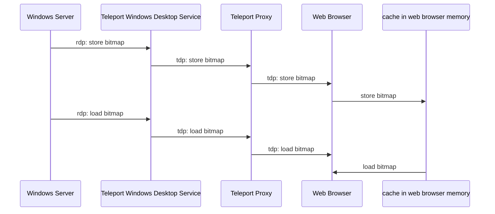

# RFD 107 - Desktop Access Performance

## Required Approvers
Engineering: @zmb3 && @ibeckermayer

## What

This RFD explores possible solutions to the current performance problems in the destkop
access module.

## Why

We want to improve user experience when using the desktop access module. Currently the main issue
is insufficient performance of the video rendering which results in choppier experience or noticeable stuttering. Each frame in the RDP protocol as we're currently using it consists of (in most cases) 64x64 pixel bitmaps that are assembled into the full screen image. All of these bitmaps needs to be sent by the server, and received and processed by the client. There are different settings we can apply to RDP, which can be classified into two general ways in which we can reduce the time needed to render a frame.
One of the ways is to reduce the amount of data that we need to send over the wire. The other way is to reduce the time required to process that data. In this document we'll discuss some solutions that achieve these goals.


### RDP Bitmap caching

One of the ways to reduce the amount of data sent between the proxy and the web browser is to reduce the number of messages with bitmap data that need processing. The RDP protocol extension [[MS-RDPEGDI] Remote Desktop Protocol: Graphics Device Interface (GDI) Acceleration Extensions](https://learn.microsoft.com/en-us/openspecs/windows_protocols/ms-rdpegdi/745f2eee-d110-464c-8aca-06fc1814f6ad) achieves this end by encoding the drawing operations that produce an image instead of always sending the actual bitmap data. Multiple drawing operations are introduced in this extension, but this document focuses on only two operations that interact with the bitmap caches.

The way it works is both the server and the client has a bitmap cache, and it's the server responsibility to control the contents of both bitmap caches. The server can either instruct the client to store bitmap data in the cache, or to load stored data from the cache and render in on the screen. This means that the bitmaps in the cache can be rendered multiple times without the need to send the same (bulky) data over the wire each time. On top of that, a single message from the RDP server can contain tens or even hundreds of drawing operations. Together, this system can significantly reduce the latency and bandwidth usage of the RDP connection.

There are two types of caches specified in the extension. The first one, called `Revision 1`, only supports memory-based caching and defaults to 6MB of cache storage for 32bpp bitmaps. The other one, called `Revision 2`, supports persistent disk caching in addition to memory caching and defaults to 40MB of cache storage for 32bpp bitmaps.
Given that our clients can afford a 40MB cache, the obvious choice is to support `Revision 2` cache since it allows to store more data inside its cache, and thus lower bandwidth overall.

#### How it works on the protocol level?

Two new types of messages need to be handled by our RDP library in order to enable support for bitmap caching. One that stores bitmap data inside a bitmap cache, called `Cache Bitmap - Revision 2`, and another that renders a previously stored bitmap, called `MemBlt`.
`Cache Bitmap - Revision 2` contains the bitmap's data and a cache index generated by the server. On the other hand, `MemBlt` contains only the cache index and the position on the screen where the bitmap should be rendered.

#### What changes are required to support caching?

Teleport Desktop Protocol (TDP) needs to be extended with two messages: 

##### 29 - bitmap cache store

This message is sent from the server to the client to store a bitmap in the bitmap cache

```
| message type (29) | cache_id uint32 | cache_index uint32 | data_length uint32 | data []byte |
```

##### 30 - bitmap cache load

This message is sent from the server to the client to render a bitmap stored in the bitmap cache

```
| message type (30) | cache_id uint32 | cache_index uint32 | top uint32 | left uint32 | right uint32 | bottom uint32 |
```

Update to the UI is also required. The browser memory and javascript's array of hash tables, where cache id is the index of the array, and the cache index is a key in the hash table, will be used to store bitmap data.


There's a sequence diagram which shows the flow of the messages between all components:



- server sends [message](https://learn.microsoft.com/en-us/openspecs/windows_protocols/ms-rdpegdi/3c76f8fb-fcaa-4ca6-9d2e-3f449bdbed40) to inform client to store bitmap in the cache
- windows destkop service translates rdp message into tdp message to store bitmap and sends it to the proxy
- proxy forwards message to web browser
- web browser stores bitmap in the in-memory cache
- server sends [message](https://learn.microsoft.com/en-us/openspecs/windows_protocols/ms-rdpegdi/84c2ec2f-f776-405b-9b48-6894a28b1b14) to inform client to load bitmap from the cache
- windows destkop service translates rdp message into tdp message to load bitmap and sends it to the proxy
- proxy forwards message to web browser
- web browser loads bitmap from the in-memory cache

#### session recordings
Since we no longer send every bitmap over the wire and to keep session recordings to work we'll also need to keep the cache of the bitmaps at the proxy. When we encounter the `save bitmap message` we'll need to store that bitmap at the proxy and then whenver `load bitmap message` will be sent we'll need to load bitmap from the cache and generate appropriate event with the bitmap data. 


### Process bitmaps in Rust library

While interacting with the remote desktop using the RDP protocol, most of the protocol messages exchanged between the server and a client are related to rendering bitmaps. Messages almost always contain compressed data to reduce bandwidth usage and latency. Rendering compressed bitmaps on the screen requires uncompressing data first using decompress algorithm.
 It is the most common operation while using the protocol, so it must execute extermaly fast to provide good user experience.
The best performance can be achived be moving the bitmap decompression procdure from the Go client to the faster compiled library written in the Rust language. It'll also allow to simplyfy the way we encode and decode PNG tdp messages.
During the tests average time it took to process message (read, process and decompress) when the decompression took place in Go side was around 500μs. After moving decompression alogirhm to the Rust library, time it took process message went down to 50μs.
