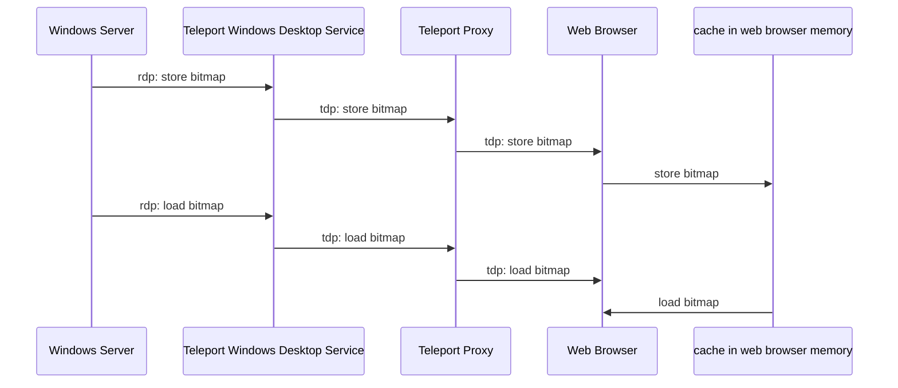

# RFD 107 - Desktop Access Performance

## Required Approvers

Engineering: @zmb3 && @ibeckermayer

## What

This RFD explores possible solutions to the current performance problems in the destkop
access module.

## Why

We want to improve user experience when using the desktop access module. Currently the main issue
is insufficient performance of the video rendering which results in choppier experience or noticeable stuttering. Each frame in the RDP protocol as we're currently using it consists of (in most cases) 64x64 pixel bitmaps that are assembled into the full screen image. All of these bitmaps needs to be sent by the server, and received and processed by the client. There are different settings we can apply to RDP, which can be classified into two general ways in which we can reduce the time needed to render a frame.
One of the ways is to reduce the amount of data that we need to send over the wire. The other way is to reduce the time required to process that data. In this document we'll discuss some solutions that achieve these goals.

## Solutions

### 1) RDP Bitmap caching

One of the ways to reduce the amount of data sent between the proxy and the web browser is to reduce the number of messages with bitmap data that need processing. The RDP protocol extension [[MS-RDPEGDI] Remote Desktop Protocol: Graphics Device Interface (GDI) Acceleration Extensions](https://learn.microsoft.com/en-us/openspecs/windows_protocols/ms-rdpegdi/745f2eee-d110-464c-8aca-06fc1814f6ad) achieves this end by encoding the drawing operations that produce an image instead of always sending the actual bitmap data. Multiple drawing operations are introduced in this extension, but this document focuses on only two operations that interact with the bitmap caches.

The way it works is both the server and the client has a bitmap cache, and it's the server responsibility to control the contents of both bitmap caches. The server can either instruct the client to store bitmap data in the cache, or to load stored data from the cache and render in on the screen. This means that the bitmaps in the cache can be rendered multiple times without the need to send the same (bulky) data over the wire each time. On top of that, a single message from the RDP server can contain tens or even hundreds of drawing operations. Together, this system can significantly reduce the latency and bandwidth usage of the RDP connection.

There are two types of caches specified in the extension. The first one, called `Revision 1`, only supports memory-based caching and defaults to 6MB of cache storage for 32bpp bitmaps. The other one, called `Revision 2`, supports persistent disk caching in addition to memory caching and defaults to 40MB of cache storage for 32bpp bitmaps.
Given that our clients can afford a 40MB cache, the obvious choice is to support `Revision 2` cache since it allows to store more data inside its cache, and thus lower bandwidth overall.

Depending on the number of bits per pixel in bitmaps, the cache limits vary. Here's a full breakdown of the cache types and their sizes:

| bpp | revision 1 | revision 2 |
| --- | :--------: | ---------: |
| 8   |   1.5 MB   |       10MB |
| 16  |   3.0 MB   |       20MB |
| 24  |   4.5 MB   |       30MB |
| 32  |   6.0 MB   |       40MB |

#### How it works on the protocol level

Two new types of messages need to be handled by our RDP library in order to enable support for bitmap caching. One that stores bitmap data inside a bitmap cache, called `Cache Bitmap - Revision 2`, and another that renders a previously stored bitmap, called `MemBlt`.
`Cache Bitmap - Revision 2` contains the bitmap's data and a cache index generated by the server. On the other hand, `MemBlt` contains only the cache index and the position on the screen where the bitmap should be rendered.

#### TDP extension

To make bitmap caching work, the Teleport Desktop Protocol (TDP) needs to be extended with two messages:

##### 29 - bitmap cache store

This message is sent from the server to the client to store a bitmap in the bitmap cache

```
| message type (29) | cache_id uint32 | cache_index uint32 | data_length uint32 | data []byte |
```

##### 30 - bitmap cache load

This message is sent from the server to the client to render a bitmap stored in the bitmap cache

```
| message type (30) | cache_id uint32 | cache_index uint32 | top uint32 | left uint32 | right uint32 | bottom uint32 |
```

Update to the UI is also required. The browser memory and javascript's array of hash tables, where cache id is the index of the array, and the cache index is a key in the hash table, will be used to store bitmap data.

There's a sequence diagram which shows the flow of the messages between all components:



- server sends [message](https://learn.microsoft.com/en-us/openspecs/windows_protocols/ms-rdpegdi/3c76f8fb-fcaa-4ca6-9d2e-3f449bdbed40) to inform client to store bitmap in the cache
- windows destkop service translates rdp message into tdp message to store bitmap and sends it to the proxy
- proxy forwards message to web browser
- web browser stores bitmap in the in-memory cache
- server sends [message](https://learn.microsoft.com/en-us/openspecs/windows_protocols/ms-rdpegdi/84c2ec2f-f776-405b-9b48-6894a28b1b14) to inform client to load bitmap from the cache
- windows destkop service translates rdp message into tdp message to load bitmap and sends it to the proxy
- proxy forwards message to web browser
- web browser loads bitmap from the in-memory cache

##### UX

From a user experience perspective implementing this solution will reduce data usage by re-using cached bitmaps. It might also improve latency and screen responsiveness over a slow connection as the data requirements will be lower.
A proof of concept was created, with underwhelming results when using it over a fast connection. While it reduced the usage of data, the responsiveness of the screen hasn't changed much.

##### Security

This solution won't change anything from the security point of view.

### 2) Process bitmaps in Rust library

While interacting with the remote desktop using the RDP protocol, most of the protocol messages exchanged between the server and a client are related to rendering bitmaps. Messages almost always contain compressed data to reduce bandwidth usage and latency. Rendering compressed bitmaps on the screen requires uncompressing data first using decompress algorithm and encoding bitmaps into PNG.
While decompression is already done in the Rust library, the encoding of bitmaps is done in the Go client.

The best performance can be achieved by moving the PNG encoding procedure from the Go client to the Rust library. It'll also simplify the way we encode and decode PNG TDP messages.

##### UX

From a user experience perspective implementing this solution will improve the overall experience of using Desktop Access by reducing the time it takes to process each frame when rendering display data by minimalizing the latency of processing each bitmap. It is purely a server-side change. It won't change anything in the client or in a way we already display bitmaps.
During the tests, the average time it took to process messages (read, process, decompress, and encode) when the encoding took place in the Go side was around 500μs. After moving the encoding of bitmaps into PNGs to the Rust library, the time it took to process a message went down to 50μs.

##### Security

This solution won't change anything from the security point of view.


### 3) Remote Desktop Protocol: Graphics Pipeline Extension [MS-RDPEGFX](https://learn.microsoft.com/en-us/openspecs/windows_protocols/ms-rdpegfx/da5c75f9-cd99-450c-98c4-014a496942b0)

The [MS-RDPEGFX] extension introduces a new way of drawing graphic data compared which is very similar to graphics APIs like OpenGL. Instead of just rendering bitmaps on the screen it defines surfaces, graphic contexts and graphics output buffer. Each surface is mapped to the part of the graphics output buffer which is a part visible for the end-user. Then graphic data is encoded using one of several codecs and transfered to specific surface. The protocol defines start and end frame messages which controll rendering process. There is also support for bitmap caches. It is embedded in a dynamic virtual channel transport, as specified in [MS-RDPEDYC](https://learn.microsoft.com/en-us/openspecs/windows_protocols/ms-rdpedyc/3bd53020-9b64-4c9a-97fc-90a79e7e1e06).

Here is an overview of commands defined in the protocol:


- `WireToSurface` transfers encoded bitmap data to destination surface
- `SurfaceToSurface` instruct the client to copy bitmap data from a source surface to a destination surface or to replicate bitmap data within the same surface
- `SolidFill` instruct the client to fill a collection of rectangles on a destination surface with a solid color
- `SurfaceToCache` instruct the client to copy bitmap data from a source surface to the bitmap cache
- `CacheToSurface` instruct the client to copy bitmap data from the bitmap cache to a destination surface

All these operations and usage of efficient codecs make this extension efficient in rendering and transporting graphic data.


##### Codecs
This extension is only available starting in RDP 8.0, then updated in 8.1 and 10.0. The updates mainly brought support for new codecs. Here's a comparison of supported codecs between RDP versions:

| codec | RDP 8.0 | RDP 8.1| RDP 10.0|
| --- | :--------: | ---------: | ---: |
|[RemoteFX Codec](https://learn.microsoft.com/en-us/openspecs/windows_protocols/ms-rdprfx/e5afdc95-00bf-46f9-adea-6c641b54af26)|✓|✓|✓|
|[ClearCodec Codec](https://learn.microsoft.com/en-us/openspecs/windows_protocols/ms-rdpegfx/6fa49bae-192f-4e25-888a-7cacfae303cf)|✓|✓|✓|
| [NSCodec](https://learn.microsoft.com/en-us/openspecs/windows_protocols/ms-rdpnsc/) |✓|✓|✓|
|[Planar Codec](https://learn.microsoft.com/en-us/openspecs/windows_protocols/ms-rdpegdi/0d2e1a03-e123-46b2-b2b8-ed730a794ae4)|✓|✓|✓|
|[MPEG-4 AVC/H.264 Codec in YUV420p mode](https://learn.microsoft.com/en-us/openspecs/windows_protocols/ms-rdpegfx/5f12c20e-2ea1-4ad1-a2a0-019ee3893731)|X|✓|✓|
|[MPEG-4 AVC/H.264 Codec in YUV444 mode](https://learn.microsoft.com/en-us/openspecs/windows_protocols/ms-rdpegfx/844018a5-d717-4bc9-bddb-8b4d6be5dd3f)|X|X|✓|
|[MPEG-4 AVC/H.264 Codec in YUV444v2 mode](https://learn.microsoft.com/en-us/openspecs/windows_protocols/ms-rdpegfx/3b337b87-f478-4786-a63b-97794aa72075)|X|X|✓|


The extension is already implemented in the Rust language in the IronRDP library with a reference client [ironrdp-gui-client](https://github.com/Devolutions/IronRDP/tree/master/ironrdp-gui-client) which uses native gui and OpenGL for rendering data.

##### Requirements

This extension requires at least RDP 8.0, but for the best possible results it needs RDP 10.0 and hadware support for encoding H.264/AVC444 codec on the server.


##### RDP Host Group Policy Changes

`Computer Configuration > Policies > Administrative Template > Windows Components > Remote Desktop Services > Remote Desktop Session Host > Remote Session Enviorment`

- Use hardware graphics adapters for all Remote Desktop Services Sessions - Enable
- Configure H.264/AVC Hardware encoding for Remote Desktop Connections - Enable
- Prioritize H.264/AVC 444 graphics mode for Remote Desktop Connections - Enable
- Configure compression for Remote FX data - Enable
- RDP compression algorithm: "Do not use an RDP compression algorithm"
- RemoteFX encoding for RemoteFX clients designed for Windows Server 2008R2 SP1 - Enable

#####  Performance metrics

There are two protocol messages:
- `RDPGFX_START_FRAME_PDU` which is message sent by the server to specify the start of a logical frame
- `RDPGFX_END_FRAME_PDU` which is message sent by the server to specify the end of the logical frame.

By capturing these messages, it would be possible to calculate time it takes to process one frame and calculate the number of frames per second (FPS).

##### Technical Considerations
There are three main features in this extension that the implementation needs to take care of:
- decoding bitmap data using one of the codecs
- creating and maintaining surfaces and rendering bitmap data on the surfaces 
- storing and loading bitmap data in the cache


###### Option 1
To make it a simple change, we could implement every aspect of the protocol and built it into existing Desktop Access module. In this case, we would create and maintain caches, create virtual mapping of the surfaces to the place on the display screen, and decode bitmap data in the backend using one of the codecs. This solution wouldn't change much in a way we currently send data to the browser. After decoding bitmap data and encoding it to PNG, we would utilise existing TDP PNG messages to send data to the browser. 
It is not the best solution in terms of performance as the usage of the cache would only reduce data transfer between Desktop Access module and Windows server. Also, some protocol commands, like coping data from one surface to the other surface, would even decrease protocol performance as we would need to copy data from the Desktop Access module to the client rather than locally copy data from one surface to other. The biggest adventage of this solution is that it requires the least effort to implement it, and it is a good starting point for bringing support for this extension to our current implementation.


###### Option 2
To improve solution#1 we could implement caching similarly as in `1) RDP Bitmap caching` and add it to the browser. That would require adding new messages to the TDP to support storing and loading data in the caches. On top of that, we could add TDP messages to create and maintain surfaces in the browser as well. The surface objects aren't responsible for much as it is just a way to divide a whole screen into different areas. This would leave only decoding bitmap data and encoding it as PNGs in the Desktop Access module. 

##### UX changes

From a user experience perspective implementing this solution will significantly improve rendering performance and overall experience using the Desktop Access module. A combination of the newest codecs and a different way of processing graphic data allows updating a screen with a high framerate.

##### Security

This solution won't change anything from the security point of view.

### 4) IronRDP

#### Background

Over the course of this feature's development, we've become aware of a RDP client written in Rust called [IronRDP](https://github.com/Devolutions/IronRDP/) which
is actively built and maintained by [Devolutions](https://devolutions.net/), who are experts in Windows and RDP.

Presuming IronRDP provides better performance and can be hooked into our existing system without too much trouble, it's an attractive option because it's built
in a language we're already using, and is actively maintained. This is in
contrast to our current RDP client, [rdp-rs](https://github.com/gravitational/rdp-rs), which is no longer actively maintained.

#### RDP 7: Bitmaps with RemoteFX encoding

According to our best judgement, the best bang for one's buck in terms of performance vs complexity of implementation is to go with RDP 7, which added bitmaps encoded by the RemoteFX codec
(`rdp-rs` does not currently support the RemoteFX codec, and only supports RDP's original, less performant bitmap codec).

It can oftentimes be difficult to decipher precisely what RDP version does what, and what that means, just by looking at the protocol specification itself. In
practice what "using bitmaps encoded by the RemoteFX codec" means is that your client sends the
[`CODEC_GUID_REMOTEFX`](https://learn.microsoft.com/en-us/openspecs/windows_protocols/ms-rdpbcgr/86507fed-a0ee-4242-b802-237534a8f65e) value when exchanging
capability sets with the server, which tells the server to relay the screen back to the client in the form of RemoteFX encoded bitmaps, which are communicated
via the [Set Surface Bits](https://learn.microsoft.com/en-us/openspecs/windows_protocols/ms-rdpbcgr/776dbdaf-7619-45fd-9a90-ebfd07802b24) and
[Stream Surface Bits](https://learn.microsoft.com/en-us/openspecs/windows_protocols/ms-rdpbcgr/b2218638-3cf9-4f2f-be61-b096ec3c8dc5) commands. The bitmaps encoded
in these commands will be encoded with the [RemoteFX Codec](https://learn.microsoft.com/en-us/openspecs/windows_protocols/ms-rdprfx/62495a4a-a495-46ea-b459-5cde04c44549), which the client must decode and display.

##### Performance comparison

The performance improvement between Teleport's current client to IronRDP is unmistakable. The first video below shows the first few seconds of a YouTube video being played over a Teleport
connection, and the second shows the same clip over IronRDP.

Teleport (unwatchable):

https://user-images.githubusercontent.com/13578537/221960403-ab7ae7a2-7fe9-4391-9e5e-e34047098bf8.mov

</br>

IronRDP (uploaded to Google Drive because it exceeded GitHub's limit, probably because it wasn't dropping a sizeable chunk of the frames like the above):

https://drive.google.com/file/d/1xyzkAWPyKu-zLQpx168zHH_i7DoqnacC/view?usp=sharing

Clearly it appears that RemoteFX encoding is a sizeable improvement on the RDP default.
I say "appears" because it's important to keep in mind that Teleport's client is a TDP client, which speaks in PNGs that have been translated from RDP bitmaps. In other words, Teleport does not speak RDP directly, there is an extra bitmap-to-PNG translation and network
communication step as compared to IronRDP.
Therefore, to confirm that it really is IronRDP's RemoteFX codec that's making up the majority of the performance improvement, and not the extra steps in Teleport's architecture, I tried playing the same video in a session using `FreeRDP`, with `FreeRDP` set to have the same RDP settings
as does `rdp-rs` (bitmaps with default codec) in Teleport's system. Performance is similar to the naked eye to the unwatchable Teleport example above, suggesting that RemoteFX is indeed the critical variable for the visible improvements:

https://drive.google.com/file/d/1XHHIdsSRyUw2lrftjOYrVSXTK-8URuf0/view?usp=sharing

#### Technical Considerations

##### Option 1: IronRDP in WDS

Recall that Teleport's Windows desktop architecture currently looks like the following, with the `rdp-rs` RDP client and bitmap-to-PNG translation residing on the Teleport Windows Desktop Service (WDS).

```
                        Teleport Desktop Protocol                         RDP
               ------------------------------------------        ---------------------
               |                                        |        |                   |
+----------------------+     +------------------+  +------------------+     +------------------+
|                      |     |                  |  | (rdp-rs & b-2-p) |     |                  |
|  (TDP client)        |     |                  |  |    Teleport      |     |                  |
|  User's Web Browser  ------|  Teleport Proxy -----  Windows Desktop ------|  Windows Desktop |
|                      |     |                  |  |     Service      |     |                  |
+----------------------+     +------------------+  +------------------+     +------------------+
```

Meanwhile, IronRDP's default setup looks like this when built for a native target (MacOS/linux/Windows):

```
                                RDP
               ------------------------------------------
               |                                        |
+----------------------+                           +------------------+
|                      |                           |                  |
|  (IronRDP)           |                           |                  |
|  User's Web Browser  -----------------------------  Windows Desktop |
|                      |                           |                  |
+----------------------+                           +------------------+
```

Or like like this when the browser is targeted (using WASM):

```
                                     RDP
               -----------------------------------------------
               |                                             |
+----------------------+     +------------------+     +------------------+
|                      |     |                  |     |                  |
|  (IronRDP)           |     |                  |     |                  |
|  User's Web Browser  -------  Devolutions     -------  Windows Desktop |
|                      |     |  Gateway         |     |                  |
+----------------------+     +------------------+     +------------------+
```

Given that `IronRDP` and `rdp-rs` are both RDP clients written in Rust, the most obvious option is to simply swap one out for the other.
This will require that `IronRDP` be built out to support device redirection (in order to
support smartcard authentication and directory sharing), and clipboard sharing.

The simplest version of this option keeps TDP as-is, and letting `IronRDP` take care of decoding the RemoteFX encoded bitmaps it receives, and then
converting those to PNGs in the WDS to be sent over TDP. This is as opposed to the version of this option where we modify TDP to
send the RemoteFX encoded bitmaps themselves, and doing the RemoteFX decoding on the client. This latter version may be more performant overall, but
is considerably more difficult to implement. Thus the former, simpler PNG version should be considered preferable to start, with the latter idea being
held in the backpocket as a means of squeezing out even more performance in the future.

##### Option 2: IronRDP in browser

Another option worth considering is throwing out TDP entirely, and just using IronRDP as an RDP client in the browser directly. Making this option especially enticing is the fact that IronRDP is being developed specifically with an eye
towards running it in the browser, and it already has a WASM compilation target (to allow Rust to run in browser) and Svelte proof-of-concept client as part of the repository. In that case, our system diagram would look like

```
                                                 RDP
               -----------------------------------------------------------------------
               |                                                                     |
+----------------------+     +------------------+  +------------------+     +------------------+
|                      |     |                  |  |                  |     |                  |
|  (IronRDP)           |     |                  |  |    Teleport      |     |                  |
|  User's Web Browser  ------|  Teleport Proxy -----  Windows Desktop ------|  Windows Desktop |
|                      |     |                  |  |     Service      |     |                  |
+----------------------+     +------------------+  +------------------+     +------------------+
```

The primary problem with this option is that there's no obvious way for us to log audit events and do session recording. Currently this is all being done at the Teleport WDS, where the RDP client is translated to TDP
and sent to the browser. In the proposed setup, however, the WDS is acting as merely another proxy, meaning that the RDP connection is not terminated there. This means that it's a non-trivial task to "unmask" the RDP
messages at that point in the system, [particularly if we ever want to enable NLA](https://github.com/Devolutions/devolutions-gateway/issues/290).

##### UX changes
From a user experience perspective implementing this solution will improve rendering performance and overall experience using the Desktop Access module. A combination of changing RDP library to the well written and maintained library with a new codec will improve the time it takes to process single bitmap.

##### Security

This solution won't change anything from the security point of view.


## Alternatives considered

### [MS-RDPEUDP] Remote Desktop Protocol: UDP Transport Extension 

This extension has been designed to improve the performance of the network connectivity compared to a corresponding TCP connection, especially on wide area networks or wireless networks.
Due to the current architecture of Teleport, we can't use this extension as we heavily rely on TCP connections and TLS. Also, our client program is in the browser, and browsers don't support direct UDP connections.

### WebTransport

#### What is WebTransport?
WebTransport is a web API that uses the HTTP/3 protocol as a transport layer. It can be used like WebSockets but also supports multiple streams and out-of-order delivery of messages. It can send data reliably as well as unreliably with low latency. Its datagram API is very similar to the UDP messages but can be encrypted and is congestion-controlled. There are a lot of valid use cases for this protocol, but for us, it would allow us to unreliably receive media data with low latency. When using it via datagram API we don't have to worry about the [head-of-line blocking](https://en.wikipedia.org/wiki/Head-of-line_blocking) which in networking is a performance issue that occurs when packets in the single queue are blocked and waiting to be transmitted by a first packet in a queue that has been lost, dropped or is waiting to be retransmitted. We could also pair it with the [MS-RDPEUDP](https://learn.microsoft.com/en-us/openspecs/windows_protocols/ms-rdpeudp/2744a3ee-04fb-407b-a9e3-b3b2ded422b1) to achieve even more performance and lower latency.


#### Key features

- reliable streams, like WebSockets
- unreliable datagrams with minimal latency, like UDP messages
- encryption and congestion control
- uses HTTP3/3 protocol as transport layer

#### It is not ready yet

While there would be a lot of benefits to implementing WebTransport as a transport layer for our TDP packets between browser and proxy, it is not ready yet to be considered for production usage, and here is why:
- specification is still in draft and there still might be some changes to it
- there is not yet implementation of libraries or server for WebTransport in either Go or Rust. There are a few implementations, but nothing looks production grade.
- high quality libraries are only for QUIC protocol, like [quiche](https://github.com/cloudflare/quiche)
- lack of support in web browsers, support enabled in Chrome 97 (01/2022), and it is missing support from Firefox and Safari

However, we should track progress of the WebTransport specification and the evolution of the ecosystem around it. Once it is mature enough, it will provide great benefit for our low latency media streaming use case.

#### Documents:
- [Editor's Draft Specificiaiton](https://w3c.github.io/webtransport/)
- [WebTransport Explainer](https://github.com/w3c/webtransport/blob/main/explainer.md)
- [MDN's WebTransport](https://developer.mozilla.org/en-US/docs/Web/API/WebTransport)


## Conclusions

Processing bitmaps in the Rust library is a no-brainer per it being simple to build and offering a measureable 10x improvement. (In fact it is already impelemented at the time of this writing.)

A proof of concept for bitmap caching was created, with underwhelming results. While there may be some overall improvement, it wasn't immediately obvious to the naked eye, which is the primary standard that's relevant
to improving UX at this point in the feature's maturity.

Contrast that with the clear improvements demonstrated in the performance comparison videos using `IronRDP` above. As such, we've decided to move forward with swapping out `rdp-rs` with `IronRDP`.
Given the relative technical difficulty and related security risks of attempting to unmask RDP at the WDS were we to run IronRDP in browser, we are going to use architecture Option 1.
