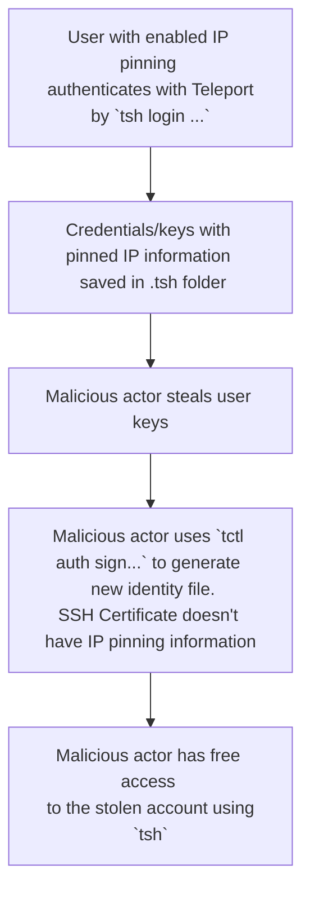

# RFD 0110 - TLS IP pinning and IP propagation.

## Required Approvers

- Engineering: `@r0mant` && `@strideynet` && `@codingllama`
- Product: `@klizhentas || @xinding33`
- Security: `@reedloden`


## What

We want to extend recently added SSH IP pinning functionality to TLS as well. It means having information about client's pinned IP stored on the TLS certificate and enforcing this check.

## Why

Current situation with only SSH certificates having IP pinning leaves the whole feature unfinished and easy to circumvent. Adding support for IP pinning to TLS certificates will add another layer of security which protects clients from their certificates being stolen by a malicious actor and used from another machine.

## Details

### Current situation
Currently, IP pinning only works for SSH certificates, through generally supported critical option `source-address`. To complete IP pinning we'll need to implement similar functionality for TLS certificates.

At the present, we have fields `clientIP` and `sourceIP` defined on `auth.certRequest`.
```go
type certRequest struct {
	//...

	// clientIP is an IP of the client requesting the certificate.
	clientIP string
	// sourceIP is an IP this certificate should be pinned to
	sourceIP string
}
```

For SSH certificates it in the end translates to extension field `ClientIP` and critical options `source-address` accordingly.
But for TLS identity we currently only have field `ClientIP`, identity doesn't have analogue of `sourceIP`, related to specifically IP pinning functionality.

### Fields changes

For encoding pinning information, new TLS subject extension field will be added - `PinnedIP`, which will hold the client's pinned IP on certificate creation. Also, for consistency, field `SourceIP`, which exists on certificate requests (and currently does not exist on TLS identity), should be renamed to `PinnedIP` as well (name of the final SSH critical option `source-address` will remain the same, since it's a public established name). It will make intention of this field much more clear. Also, currently existing field `ClientIP` will be renamed to `LoginIP`.

New struct will look like this:

```go
// Identity is an identity of the user or service, e.g. Proxy or Node
type Identity struct {
	//...

	// LoginIP is an observed IP of the client on the moment of user certificate creation.
	LoginIP string

	// PinnedIP is an IP from which client is allowed to communicate with Teleport
	PinnedIP string
}

// LoginIPASN1ExtensionOID is an extension ID used when encoding/decoding
// the client login IP into certificates.
LoginIPASN1ExtensionOID = asn1.ObjectIdentifier{1, 3, 9999, 1, 9}

// PinnedIPASN1ExtensionOID is an extension ID used when encoding/decoding
// the pinned IP into certificates.
PinnedIPASN1ExtensionOID = asn1.ObjectIdentifier{1, 3, 9999, 2, 15}
```

In summary:
- new field `PinnedIP` on `tlsca.Identity`
- renaming field `SourceIP` -> `PinnedIP` on `services.UserCertParams` and `auth.certRequest`
- renaming field `ClientIP` -> `LoginIP` on `services.UserCertParams` , `auth.certRequest` and `tlsca.Identity`

These changes won't break backward compatibility, since we only add new field to TLS certificates and renaming of fields `SourceIP` amd `ClientIP` only touches source code, extensions IDs and SSH certificates themselves will stay the same.

### Client IP
Client IP is the remote address of the incoming end user connection to proxy. This IP address can be either from direct connection of the user or, if proxy is located behind load balancer, it can be passed through PROXY header and processed by our current multiplexer listener. Next part of RFD explains how this IP is propagated to target server in a secure manner.

### IP pinning approach
IP pinning will be implemented by inspecting client's certificates, which contain IP address the certificate is pinned to, and comparing it to the observed client IP. Currently, the main obstacle to correctly supporting IP pinning is reliable propagation of client IP address. For example, when client connects to auth server through proxy, proxy obscures observed client IP and auth server sees IP of the proxy as an IP of incoming connection. To solve propagation of client IP information two mechanisms will be used:
- Propagating IP information through reverse tunnel when possible, adding new fields to `reversetunnel.DialParams` and `sshutils.DialReq`
- When it's a direct connection (to auth server or node) PROXY protocol v2 will be used to pass this information along the secure signature, so the receiving side can trust this information.

### Signed PROXY headers IP propagation

Transmitting of the signature will be done using PROXYv2 extensions called TLV (Type-Length-Value), this is part of PROXY spec([end of section 2.2](https://www.haproxy.org/download/2.6/doc/proxy-protocol.txt)) and are very simple in implementation.

```go
// PP2Type is the proxy protocol v2 TLV type
type PP2Type byte

PP2_TYPE_JWT     PP2Type = 0xE4
PP2_TYPE_TLSCERT PP2Type = 0xE5

type TLV struct {
	Type 	PP2Type
	Value	[]byte
}
```

TLVs can be used to send arbitrary information through PROXYv2 within the PROXYv2 header. We will use 2 TLVs, one to send JWT signed with the proxy's own certificate's private key and another TLV with certificate itself. JWT will be limited to a short time window (~1 minute) to counter replay attacks and will contain claims with the client source and destination addresses, the same ones that are transmitted in the main PROXYv2 header for this connection. We will partly reuse existing JWT infrastructure in Teleport, but will add dedicated functions for signing/verifying proxy signature, similar to how it was done for `Snowflake` JWT handling.

```go
type PROXYSignParams struct {
	SourceAddress      string
	DestinationAddress string
	ClusterName        string
}

func (k *Key) SignPROXY(p PROXYSignParams) (string, error) {
	claims := Claims{
		Claims: jwt.Claims{
			Subject:   fmt.Sprintf("%s/%s", p.SourceAddress, p.DestinationAddress),
			Issuer:    p.ClusterName,
			NotBefore: jwt.NewNumericDate(k.config.Clock.Now().Add(-10 * time.Second)),
			Expiry:    jwt.NewNumericDate(k.config.Clock.Now().Add(60 * time.Second)),
			IssuedAt:  jwt.NewNumericDate(k.config.Clock.Now()),
		},
	}

	return k.sign(claims)
}

type PROXYVerifyParams struct {
	SourceAddress      string
	DestinationAddress string
	ClusterName        string
	RawToken           string
}

func (k *Key) VerifyPROXY(p PROXYVerifyParams) (*Claims, error) {
	if err := p.Check(); err != nil {
		return nil, trace.Wrap(err)
	}

	expectedClaims := jwt.Expected{
		Issuer:  p.ClusterName,
		Subject: fmt.Sprintf("%s/%s", p.SourceAddress, p.DestinationAddress),
		Time:    k.config.Clock.Now(),
	}

	return k.verify(p.RawToken, expectedClaims)
}
```

Receiving side will use HostCA to verify the transferred TLS certificate and after that will use certificate's public key to verify the JWT. That way receiving side can be sure, that it is indeed our internal proxy who is telling us what client's observed IP is. Algorithm for this will include:

1. Verifying transmitted proxy certificate using HostCA
2. Making sure proxy certificate has system role `Proxy` on it
3. Verifying JWT using proxy certificate's public key.
4. Making sure PROXY header addresses correspond to signed JWT claims.

Verification process function can look like this:
```go
func (p *ProxyLine) VerifyPROXYSignature(HostCACert []byte) (bool, error) {
	var proxyCert []byte
	var token string

	for _, tlv := range p.TLVs {
		if tlv.Type == PP2_TYPE_PROXYCERT {
			proxyCert = tlv.Value
		}

		if tlv.Type == PP2_TYPE_JWT {
			token = string(tlv.Value)
		}
	}

	// Not verifiable without these
	if len(token) == 0 || proxyCert == nil {
		return false, nil
	}

	// Make sure that transmitted proxy cert is legit, using HostCA
	cert, err := tlsca.ParseCertificatePEM(proxyCert)
	if err != nil {
		return false, err
	}
	roots := x509.NewCertPool()
	ok := roots.AppendCertsFromPEM(HostCACert)
	if !ok {
		return false, nil
	}
	chains, err := cert.Verify(x509.VerifyOptions{Roots: roots})
	if err != nil {
		return false, err
	}
	if chains == nil {
		return false, nil
	}

	// Check that transmitted cert has proxy system role on it
	identity, err := tlsca.FromSubject(cert.Subject, cert.NotAfter)
	if err != nil {
		return false, err
	}
	systemRole := findPrimarySystemRole(identity.Groups)
	if systemRole == nil || *systemRole != types.RoleProxy {
		return false, nil
	}

	// Verify JWT using proxy cert's public key and make sure
	// that signed claims in JWT correspond to PROXY header addresses
	clock := clockwork.NewRealClock()
	jwtVerifier, err := jwt.New(&jwt.Config{
		Clock:       clock,
		PublicKey:   cert.PublicKey,
		Algorithm:   defaults.ApplicationTokenAlgorithm,
		ClusterName: identity.TeleportCluster,
	})
	if err != nil {
		return false, trace.Wrap(err)
	}
	_, err := jwtVerifier.VerifyPROXY(jwt.ProxyVerifyParams{
		ClusterName:        identity.TeleportCluster,
		SourceAddress:      p.Source.String(),
		DestinationAddress: p.Destination.String(),
		RawToken:           token,
	})
		if err != nil {
		return false, trace.Wrap(err)
	}

	return true, nil
}
```

This approach allows us to keep additionally introduced latency to a minimum and doesn't require drastic changes in how Teleport networking is set up. We already support PROXY protocol, and it's an industry established standard.

In original IP pinning [RFD66](https://github.com/gravitational/teleport/blob/master/rfd/0066-ip-based-validation.md) it was proposed to validate IP in the `authorizer.Authorize()` method of `lib/auth/permissions.go`. Here we can enforce it, by comparing observed client IP with the IP pinned in the certificate, if it's present. `authorizer.Authorize()` is one of the central places that are called to verify user's identity, and to use it for enforcing IP pinning, we just need to reliably provide it with correct client IP information - that is handled by the PROXYv2 header described above. It will also handle the case when client's certificate was issued before IP pinning was enabled for their role.
Also, we can add IP pinning enforcement checks in any place that is terminating TLS connection, since at this moment observed IP information should be always correct, either because of PROXYv2 header or because it's a direct connection from a client. That way we can drop unwanted connection early (on a proxy), without creating unnecessary load for the auth server. It also means that if IP pinning was disabled for a role, if the user will wants to use teleport from different IP, they will need to relogin to receive new certificates that don't contain IP pinning information.

Propagation of our internal PROXY header with the signature will be accepted regardless of `EnableProxyProtocol` config parameter, which controls our acceptance of external PROXY headers. To accommodate possibility of receiving more than one PROXY header (one from external source and one from our internal proxy server), we'll need to be able to do one more pass in the `detect()` function in the `lib/multiplexer/multiplexer.go`, though we will not allow more than one unsigned and one signed PROXY header to be accepted. If connection receives 2 PROXY headers, our signed PROXY header will take precedence over unsigned ones and we'll use source IP information from our signed header.

### Reverse tunnel IP propagation

Similar to transferring IP through PROXY protocol, two new fields with client IP information will be added to `sshutils.DialReq` - client source address and destination address. Additionally we also need to add Teleport version field, that shows version of the target host, to correctly work with older versions.

```go
type DialReq struct {
	// ...

	// TeleportVersion shows what teleport version is the node that we're trying to dial
	TeleportVersion string `json:"teleport_version,omitempty"`

	// ClientSrcAddr is the original observed client address, it is used to propagate
	// correct client IP through indirect connections inside teleport
	ClientSrcAddr string `json:"client_src_addr,omitempty"`

	// ClientDstAddr is the original client's destination address, it is used to propagate
	// correct client point of contact through indirect connections inside teleport
	ClientDstAddr string `json:"client_dst_addr,omitempty"`
}
```
Two fields will also be added to `reversetunnel.DialParams` - client destination IP and teleport version, since `From` field is already present and gives us client source address.

Reverse tunnel system doesn't require signed PROXY headers, because communication happens over already established secure SSH connection. `DialReq` is sent over the SSH channel as a json payload to request new connection to the wanted node. Receiving side will construct connection using `DialReq.ClientSrcAddr` directly as connection's client remote address.

This will allow us to have correct client IP address to compare with the address pinned address on client's certificate in any service that is connected through reverse tunnel.

### Trusted clusters
IP pinning will cover not just root cluster but leaf clusters as well, client IP in that case will be propagated through the reverse tunnel system, since  connection between clusters is always done through reverse tunnel. It means that signed PROXY headers will only be used for direct connection within one cluster. If user needs to get access to a node in remote cluster, and that node requires direct connection, remote cluster is responsible for making this final direct connection and sending signed PROXY headers with the client IP information it received through the reverse tunnel. So remote proxy will use its own certificate to sign the PROXY header, meaning that receiving server will only ever need to verify signatures using its local cluster host CA.

If user's role on one cluster doesn't have IP pinning enabled, but is enabled on the mapped role (or vice versa) of a leaf cluster, connection will still be subject to IP pinning, so strictest option wins - connection will not be allowed if any intermediate point fails IP pinning check.

### CA rotation
JWT used to propagate client IP information is signed using HostCA. During CA rotation that CA's keys will change. That means that when verifying JWT we need to use not just CA's active keys but also AdditionalTrustedKeys. This should be enough to always be able to verify JWT of any cluster at any stage of the CA rotation, as long as CA cache used is up to date. Teleport CA rotation process is designed with multiple phases and periods when both old and new CA can be trusted, so it is possible to keep list of HostCAs up to date at any time and there shouldn't be any interruption in the ability to verify JWT during any CA rotation phase.

### Alternative

Alternative solution was discussed, where we would terminate all connections on proxy and would reissue client certificate, embedding `ClientIP` information in it. But this solution was decided against, because it would introduce too large additional latency.

### Future development

In the future we can introduce a way for the users to specify allowed list of external sources (proxies, load balancers) of PROXY information. Currently, if `EnableProxyProtocol` is set in the config, we'll accept PROXY information from any source. Allowing a user to specify trusted IPs for those sources can increase security. But this is not directly related to IP pinning, since our own PROXY headers will be signed and accepted regardless of `EnableProxyProtocol` setting, so this extended functionality is out of scope of the RFD.

## Current issues

During discussion about  IP pinning functionality to TLS it came to light that current pinning system has significant shortcomings. These should be resolved when TLS IP pinning is implemented.

### Simple circumvention
One of the main issues is that current pinning system can be very easily circumvented. As described in the [issue](https://github.com/gravitational/teleport-private/issues/164), there's a problem - malicious actor who stole certificates from the computer of the user, can reissue certificates and remove IP pinning from them. Their flow is like this:



Currently, SSH IP Pinning is controlled in the `func (s *Server) AuthenticateSSHUser()`, we will move this functionality to the lower level, to the function `func (a *Server) generateUserCert()` itself, we'll always provide it with the client IP and let it decide if IP pinning should be applied to both SSH and TLS certificates. This is required to overcome aforementioned flow with malicious actor stealing certificates from the user's machine.

<details>
    <summary>Example of changes for the IP pinning code inside `func (a *Server) generateUserCert()`</summary>

```diff
@@ -1229,6 +1229,18 @@ func (a *Server) generateUserCert(req certRequest) (*proto.Certs, error) {
                return nil, trace.Wrap(err)
        }

+       pinnedIP := ""
+       if req.checker.PinSourceIP() {
+               if req.clientIP == "" && req.sourceIP == "" {
+                       log.Warnf("IP pinning is enabled for user %q but there is no client ip information", req.user.GetName())
+               }
+
+               pinnedIP = req.clientIP
+               if req.sourceIP != "" {
+                       pinnedIP = req.sourceIP
+               }
+       }
+
        params := services.UserCertParams{
                CASigner:               caSigner,
                PublicUserKey:          req.publicKey,
@@ -1251,7 +1263,7 @@ func (a *Server) generateUserCert(req certRequest) (*proto.Certs, error) {
                Generation:             req.generation,
                CertificateExtensions:  req.checker.CertificateExtensions(),
                AllowedResourceIDs:     requestedResourcesStr,
-               SourceIP:               req.sourceIP,
+               SourceIP:               pinnedIP,
                ConnectionDiagnosticID: req.connectionDiagnosticID,
        }
        sshCert, err := a.Authority.GenerateUserCert(params)

@@ -477,18 +477,16 @@ func (s *Server) AuthenticateSSHUser(ctx context.Context, req AuthenticateSSHReq
                authority,
        }

-       sourceIP := ""
-       if checker.PinSourceIP() {
-               md := req.ClientMetadata
-               if md == nil {
-                       return nil, trace.Errorf("source IP pinning is enabled but client metadata is nil")
-               }
-               host, err := utils.Host(md.RemoteAddr)
+       clientIP := ""
+
+       if req.ClientMetadata != nil && req.ClientMetadata.RemoteAddr != "" {
+               host, err := utils.Host(req.ClientMetadata.RemoteAddr)
                if err != nil {
                        return nil, trace.Wrap(err)
                }
-               sourceIP = host
+               clientIP = host
        }
+

	certs, err := s.generateUserCert(certRequest{
		user:              user,
		ttl:               req.TTL,
		publicKey:         req.PublicKey,
		compatibility:     req.CompatibilityMode,
		checker:           checker,
		traits:            user.GetTraits(),
		routeToCluster:    req.RouteToCluster,
		kubernetesCluster: req.KubernetesCluster,
-               sourceIP:          sourceIP,
+               clientIP:          clientIP,
	})
```
</details>


### Proxy obscures IP address from the auth server
Another problem - currently proxy is obscuring IP address from the auth server, described in this [issue](https://github.com/gravitational/teleport/issues/15521). This can prevent us from doing correct IP pinning enforcement, since we'll be erroneously denying access to client based on the wrong information about their IP, which will not match `PinnedIP` in the TLS certificate.

Our approach of reliably providing observed client IP information through PROXYv2 should resolve this issue.

### IP Pinning on per-session MFA certificates
MFA session certificates are supposed to be pinned to IP, but because of how it's implemented, don't effectively use IP pinning (since it's currently implemented only in `func (s *Server) AuthenticateSSHUser()`), but if they would, they probably wouldn't work in some situations because of wrong client IP information. Consistent client IP information provided through PROXYv2 should resolve this issue.

### SSH server vulnerable to Client IP spoofing
As described in this [issue](https://github.com/gravitational/teleport-private/issues/156) - `lib/sshutils.Server` is vulnerable to a client spoofing its IP leveraging the Teleport-Proxy ProxyHelloSignature, since there's no protection from malicious actor providing spoofed information in there. Signed PROXY header can be used to pass client IP information to the SSH node in a secure way. After switching to new way of providing client IP, ProxyHelloSignature can be retired (though we'll also need to move propagation of tracing context out of it)
### Audit log changes

Propagation of client IP information is not tied only to IP pinning, we generally want to have this information for audit, rate limiting, etc. We need to record correct client IP information during existing audit events and there's also need to have this information in more events, such as "Password reset", "Recovery code usage", "Changing MFA device configuration" as the described in [issue](https://github.com/gravitational/teleport/issues/12523). And for example audit event "App session start", as described in [issue](https://github.com/gravitational/teleport/issues/9536), where moving event emittion to auth server is problematic, since proxy obscures client ip from the auth server. With the proposed approach to pass correct observed client IP information through PROXYv2, this problem goes away.

## Summary
Here are implementation steps of enabling of TLS IP pinning:

1. Move logic deciding on IP pinning from `func (s *Server) AuthenticateSSHUser()` to`func (a *Server) generateUserCert()`, to remove simple IP pinning circumvention method described above.
2. Adjust fields related to IP pinning (add `PinnedIP` to TLS identity, rename `ClientIP` to `LoginIP`)
3. Add correct client IP propagation with PROXYv2 + signature.
4. Add correct client IP propagation through reverse tunnel.
5. Add IP pinning enforcement checks to both proxy and auth server (`authorizer.authorize()` + observed IP vs `PinnedIP` on TLS termination points)

Which should be handled in that order, since we can't have global IP pinning enforcement until we have correct client IP information.

## UX
This should be transparent for end users. Backward compatibility should be generally not affected, although some users who had ip pinning enabled, but not really enforced on TLS side might see their workflows broken.

## Security
There's are few things to consider. We really can only reliably use this feature based on the IP information provided on the edge of our systems, where we ourselves observe client IP. This comes in clash with situation when client's setup for example includes load balancer that sits in front of Teleport. If this load balancer is opaque and hides real client IP, functionality of IP pinning will probably be not as useful for the client. If this load balancer provides client IP through PROXY protocol and so `EnableProxyProtocol` is set in Teleport config, clients should be careful with their networking setup, making sure that teleport can't be accessed directly, but only through those load balancers. Otherwise, malicious user can spoof their IP address if contacting Teleport servers directly. Creating configuration for allowed list of external sources of PROXY information might help in this case.

Security of our internal PROXYv2 + signature approach relies on the fact that receiving side can verify source/destination address information contained in JWT, which in turn can be trust because it's singed by the proxy credentials that are linked to the HostCA.
