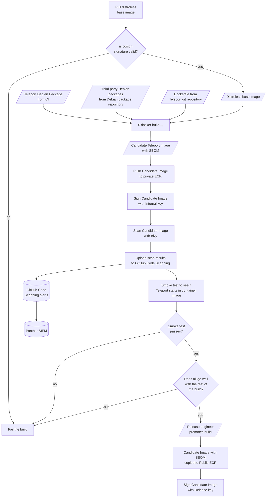

# RFD 0112 - Delivering secure Teleport OCI Images

# Required Approvers
* Engineering: @r0mant
* Security: (@reedloden && @jentfoo)
* Product: (@xinding33 || @klizhentas)

## What

This RFD discusses structures and processes to increase the security of the OCI 
images we use to deliver Teleport to our customers.

## Why

One of our shipping artifacts is are a collection of OCI images. As the
provider of those OCI images we are (at least partially) responsible for
everything in it, not just Teleport. 

We should not ship vulnerabilities to our clients, even if those 
vulnerabilities are not directly in our software.

## Details

### Goals

For the sake of this RFD, I will define _delivering a secure image_ as

> Reliably producing an OCI image that _a priori_ is unlikely to contain 
> vulnerabilities in and of itself, in that it:
>
>  1. has the smallest footprint reasonably possible,
>  2. contains software of reasonably known provenance,
>  3. has no fixable, high-risk warnings or vulnerabilities flagged when run
>     through a reputable scanner at the time of creation,
>  4. flags vulnerabilities even after creation, either in Teleport itself or 
>     a dependency, and
>  5. is updated to resolve any discovered vulnerabilities in a timely fashion.

Where

 * **reasonably known provenance** means that the software comes from
   either ourselves or a known, reputable source.
 * **a timely fashion** for updates is as per the Teleport Vulnerability 
   Management Policy:

   | Severity | Resolution time |
   |----------|-----------------|
   | Critical | 7 days          |
   | High     | 30 days         |
   | Moderate | 90 days         |
   | Low      | ~180 days       |

### Non-goals

This RFD will not discuss building images for and/or running Teleport on
platforms other than Linux.

### Approach

This RFD describes a 2-pronged approach for meeting the above goals:

   1. Switching to distroless base images, and 
   2. Automated, ongoing monitoring of images using a scanning service

### 1. Distroless Images

Distroless images contain only an application and the minimal set of
dependencies for it. Google offers several base images that contain minimal 
Linux distribution that we can use as a starting point.

Switching to distroless images drastically reduces the number of software components 
we ship as part of a Teleport distribution. This both reduces the size of the potential
attack surface, and reduces the potential for high-noise reports from automated
scanners. 

The Google-supplied distroless base images also [provide a mechanism for verifying the
provenance of a given image](https://github.com/GoogleContainerTools/distroless#how-do-i-verify-distroless-images) 
using `cosign` and a public key. Stronger, SLSA-2 level guarantees [can be verified with additional
tooling](https://security.googleblog.com/2021/09/distroless-builds-are-now-slsa-2.html). 

> **NOTE:** We are _already_ using Distroless images to distribute some Teleport 
> plugins. This would extend their use to Teleport proper.

### 2. Ongoing scanning

Using an _ongoing_ automated scanner means that we do not just check for 
vulnerabilities at image creation time, instead we proactively & _continually_ scan
for any vulnerabilities  that may be discovered until the image is either replaced 
with a newer version of the image, or the support lifetime for the version of Teleport 
on that image expires (i.e. falls out of our 3-version support window)

## Implementation Details

**NOTE:** This section assumes an understanding of [RFD 73 "Public Image Registry"](./0073-public-image-registry.md).
## 1. Distroless Images

### Teleport Image Requirements

What is the minimal set of requirements to run Teleport on Linux in a container?

Most Teleport dependencies are statically compiled into the `teleport` binary, 
giving us a smaller set of runtime dependencies than you might imagine:

   1. Teleport
   2. C Runtime libraries (e.g. `GLIBC` >= 2.17, `libgcc`, etc)
   3. `dumb-init` is required for correct signal and child processes handling
      inside a container.
   4. `libpam` (and its transitive dependencies) for PAM support 
   5. CA certificates

Requirement (1) (i.e. Teleport itself) is provided by our CI process. 

Requirements (2) and (5) are satisfied automatically by using the google-
provided base image [`gcr.io/distroless/cc-debian11`](https://github.com/GoogleContainerTools/distroless#what-images-are-available),
which is configured for "mostly statically compiled" languages that require libc.

Requirements (3) and (4) can be sourced either from the upstream Debian repository, or
downloaded directly from their project's source repository. Sourcing `dumb-init`, 
`libpam` and so on from the Ubuntu or Debian package repositories implies some minimal 
curation and provenance checking by the debian packaging tools, so we will prefer that to
sourcing them elsewhere.

### Base image verification

The distroless base image will be pulled and verified prior to constructing the
Teleport image, using the `cosign` tool as described [here](https://github.com/GoogleContainerTools/distroless#how-do-i-verify-distroless-images).

Verifying the image signature will allow us to specify a floating tag for the
base image (and thus automatically include the latest version of every package 
in the base image, with any security fixes, etc. included) while still 
validating the provenance of the base image itself.

> **NOTE:** This approach sacrifices repeatability for convenience. That is, by
> always grabbing the latest revision of the image we are at the mercy of the 
> the `distroless` team regarding changes to our base layer.
>
> Why choose this over a stable repeatable build? Because the `distroless` build
> system automatically follows updates to the underlying debian packages and 
> automatically rebuilds the base image every time a PR is merged on a package 
> in Debian. Following the floating tag means we automatically get upstream 
> security updates. 

It is technically possible for the image to be poisoned post-validation (e.g.
in a shared build environment, where a malicious peer could re-tag a malicious
image as the base). We can avoid this poisoning scenario because `cosign` returns
the hash of an image after verifying its signature. If we only refer to the 
base image by the returned hash once it has been verified, any tag poisoning
attack will not be effective.
### Building the image for a Release

The image will be built from a multi-stage docker file, using build stages to download
and unpack the required debian packages and copy them into place on the distroless 
image. 

An example Dockerfile, assuming the Teleport Debian package is supplied by the 
CI system, might look like something like:

```Docker
FROM debian:11 as dumb-init
RUN apt update && apt-get download dumb-init && dpkg-deb -R dumb-init*.deb /opt/dumb-init

FROM debian:11 as teleport
COPY teleport*.deb
RUN dpkg-deb -R teleport*.deb /opt/teleport

# NOTE: the CC image supplies libc, libgcc and a few basic runtime libraries for us
FROM gcr.io/distroless/cc-debian11
COPY --from=dumb-init /opt/dumb-init/bin/dumb-init /bin
COPY --from=teleport /opt/teleport/bin/* /bin
ENTRYPOINT ["/bin/dumb-init", "teleport", "start", "-c", "/etc/teleport/teleport.yaml"]
```
> **NOTE:** This unpack-and-copy installation method is only appropriate for
> packages with no complex installation requirements, like post-install hooks. 
>
> Also note that for the sake of clarity I'm only including one dependency package. 
> In the real distribution there would be multiple packages required.

### A digression: Alternative builders

As part of researching this RFD, I examined a couple of alternative ways to construct 
the Teleport image. 

 * **bazel, [distroless](https://github.com/GoogleContainerTools/distroless) and [rules_docker](https://github.com/bazelbuild/rules_docker)**: 
   Given that the underlying distroless images are built using `bazel`, it should be 
   possible to construct a custom image for Teleport in the same way. After some 
   experimentation, I found that

   1. the Debian package installation technique used by `rules_docker` is essentially 
      a tweaked version of the extract-and-copy approach used by the `Dockerfile` 
      above, and

   2. There is a major [chicken-or-egg problem](https://github.com/GoogleContainerTools/distroless/issues/542)
      in the build process when `distroless` is used as an external dependency in 
      an enclosing `bazel` workspace, requiring manual intervention in the build to
      solve.

   Using `bazel` does not resolve a major limitation of using a basic 
   `Dockerfile` (i.e. the `xcopy` style install) and introduces more complexity, in 
   terms of both build process and tooling, so was rejected in favour of the 
   `Dockerfile` approach.

 * **[apko](https://github.com/chainguard-dev/apko)**: Apko is a tool for quickly 
   building minimalist, reproducible Alpine linux images, using a declarative 
   format. While I found the tool to be very neat, the images it generates are 
   still closer to a "debug" Distroless image. 

   Using `apko` would also require us to build an Alpine linux package for Teleport 
   to integrate it nto the build.

   I seriously considered recommending `apko`, as it has some neat features (e.g.
   automatically producting a SBOM as part of the construction process), but in the 
   end I rejected it because of the extra software included in the resulting images.

### Smoke testing

A smoke test is a simple, quick test to assert basic functionality. We simply want to 
find out if Teleport will even start in the environment contained by our container 
image. While this is not _per se_ a security matter, using a distroless base image 
means we have very little padding if an unexpected dependency finds its way into
Teleport. 

We want to stop ourselves shipping garbage to our customers if at all possible.

### Image signing

In order to allow our customers to validate our published Teleport images, 
our images will be signed using the `cosign` tool, similarly to the Distroless 
base images.

The `cosign` tool [integrates well with GHA](https://github.blog/2021-12-06-safeguard-container-signing-capability-actions/), 
and is even included in the template "how to publish a docker image" example 
workflow. It also provides "keyless" signing via OIDC, meaning that our build
process can use its GitHub identity to sign the image, obviating the need for
extra keys for us to manage.

After some experimentation it seems that the OIDC Keyless Signing doesn't work
with our GitHub Organisation. For this reason, at least for the first iteration
of image signing, we will be using the keyed option. This also resolves any 
question of how much using OIDC-based signing ties us to GitHub for identity.

More information on image signing:
 * https://docs.sigstore.dev/cosign/sign/#keyless-signing
 * https://docs.google.com/document/d/1461lQUoVqbhCve7PuKNf-2_NfpjrzBG5tFohuMVTuK4/edit
 * https://www.appvia.io/blog/tutorial-keyless-sign-and-verify-your-container-images/#oidc-flow-with-interaction-free-with-github-actions

The distroless images will be signed at creation time with an internal key,
allowing us to ensure that any images we promote have not been tampered with
between creation and promotion. Unfortunately, the image signature leaks the 
registry and repository names used for the temporary image storage between build
and promotion. For this reason, once candidate image's internal signature has 
been verified, the _internal_ signature will not be copied to the release 
repository; it will be re-signed with a separate production key.

### Build-time scanning

All Teleport images shall be scanned with [trivy](https://github.com/aquasecurity/trivy-action#using-trivy-with-github-code-scanning) immediately after build, and the 
results will by uploaded to the GitHub Code Scanning service. From there, our Panther 
SIEM can observe any alerts and instigate corrective action.

### Software Bill-of-Materials

We can use the Docker `buildx` tools to automatically generate and include a
SBOM at build time. Internally, docker buildx uses the `syft` to generate a 
SBOM and attach it to the resulting image. This means that any software 
components added to the image must be automatically discoverable by `syft` (for 
example, making sure the package control file is included in `/var/lib/dpkg/status.d` 
for Debian packages).

### Release Build process summary

This process describes how an image is built during a full Teleport release. 



### Debug Images

Troubleshooting a distroless image is hard, as there are no tools baked into
the image to aid in debugging a deployment.

In addition to the main distroless image sets, the `distroless` team also supplies 
a `debug`-tagged image that includes `busybox` (that is, a basic shell and some
utilities). In order to provide tooling for troubleshooting a Teleport installation,
we will create a parallel `teleport-debug` image, based on a distroless `debug` image.

While we should take as much care as possible when constructing and 
monitoring this image, use of the debug image should probably be
considered "at your own risk".

### Compatibility Guarantees

We have clients relying on the existing behaviour (and contents) of our images. We
should treat releasing these distroless images as a compatibility break, and make 
our customers aware of our intentions well in advance so that they can prepare.

## 2. Maintenance

### Collecting data 

We are already using the scanning tools built-in to AWS ECR, which periodically scans our 
images and results of the scan into our Panther SIEM instance.

To increase the size and quality of the vulnerability database we scan with, we should 
also use `trivy` for ongoing scans of our published (i.e. public) images, in addition
to the build-time scans described above. 

Trivy's in a GHA integration should make it straightforward to run 
workflow to repeatedly scan our published images on a regular schedule.

The output of the scan will be injected into the GitHub code scanning system. From there 
the alerts can be picked up buy our Panther SIEM, which already integrates into our 
GitHub account. 

### Reacting to alerts

Once the alert data is aggregated into Panther, we can configure events to lodge 
GitHub issues and/or alert the development team via Slack or e-mail. The development 
team will be expected to resolve the issues as per the Teleport Vulnerability Management 
Policy.

### Periodic rebuilding

Our current process rebuilds the docker images for the latest release of in a 
major version series once a day, using the same sources and build artifacts used
in the original published release. This is to ensure that any updates to the 
underlying base image are quickly and automatically integrated into the released
image. 

We should continue rebuilding these images daily, but incorporate the same 
supply chain checks as with the release builds described above (e.g. verifying
`cosign` signatures, generating SBOMs, etc)
