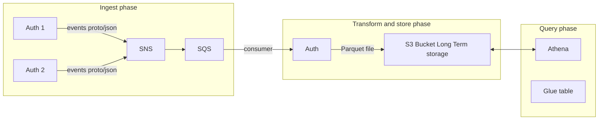

# RFD 0118 - Scalable audit logs

## Required Approvers

* Engineering: @rosstimothy && @zmb3
* Security: @reed
* Product: (@xinding33 || @klizhentas)

## What

Allow Teleport to use combination of SNS, SQS, Athena and S3 to provide scalable
and searchable audit log mechanism.

In this RFD we focus on integrating scalable datastore to existing interfaces.
There will be separate RFD which will focus and UI changes and focus on advanced
search capabilities.

## Why

Why is explained in [Cloud RFD](https://github.com/gravitational/cloud/pull/3062)

## Solution

* Ingestion phase - Auth instances send events to AWS SNS + SQS queue in
  proto format
* Transform and store phase - Single auth consumes events from queue in batches
  and produces Parquet file stored in s3 bucket for long term storage
* Query phase - Athena queries S3 bucket with parquet files partitioned by date
  (partition info is stored in Glue Table)



SNS + SQS components are used because it allow us buffering events and extending
solution with Export API over queue or Lambda for alerting on certain events.

### Ingestion phase

New `EmitAuditEvent` implementation will consist of following steps:

1. Check message size and trim or upload via s3
2. Marshal event to proto
3. Send message to SNS

Currently dynamo supports payloads of max 400 KB. SNS + SQS supports max
message size of 256 KB. Events in rare cases can be larger than 256 KB. We will
use similar mechanism as in [extended SNS library for
java](https://docs.aws.amazon.com/sns/latest/dg/large-message-payloads.html)
works. It allows to specify s3 bucket where messages larger then max limit are
sent. On SNS/SQS client only sends s3 link to payload.

SNS/SQS message consists of `payload` and `messageAttributes`. `Payload` can be
only valid UTF-8 string.

`messageAttributes` will be used to determine on SQS which type is payload.
It allow us to extend it later, for example by adding compression before base64.

We will use two different kinds of payloads for now:

1. Base64 encoded proto event marshaled as OneOf type from apievents.
  It will be send with attribute `raw_proto_event`.
2. Base64 encoded proto of new message with s3 location of payload.
  It will be send with attribute `s3_event`.

`s3_event` will use following proto message:

```proto
message S3EventPayload {
  string path = 1;
  // Custom KMS key for server-side encryption.
  string ckms = 2;
}
```

#### Proto vs JSON

We could use either JSON or proto as format for passing data over SNS/SQS.
Proto should be at least 2x smaller and faster to marshal/unmarshal.
JSON advantage is that we don't need to know message struct at all.
Since auth is both emitting events and processing it, it should always contain
newest version of proto and be able to decode it. There are rare cases during
update where there could be 2 different auth instances (although we recommend
rolling update), but simple NACK on not know messages and retrying it with
updated instance should solve the issue.

We decided go with proto.

### Transform and store phase

Consumer will be implemented in one of auth instances. We will use locking
mechanism which can be acquired on backend, so that only single instance does the
job. There is already mechanism for that called
[RunWhileLocked](https://github.com/gravitational/teleport/blob/11eaf9657dcdd9f4c8b73a3880c5648db0139aec/lib/backend/helpers.go#L137-L171).
It's checking backend with 250ms interval if lock can be acquired. I think it
makes sense to make that interval configurable in `RunWhileLocked` function
and set it to 10s. Lock TTL should be set to 30s. It will be automatically
refreshed if job is still running. So TTL will be only used is Auth died and
other instance should take a lead.

Consumer will fetch events from queue  and write them to S3 in batches every
`INTERVAL` or `MAX_BUFFER_ITEMS`, which ever comes first.

Flow of actions:

1. Fetch events from queue
2. Group events by date (there could be events from different date, for example
  from migration) in format `YYYY-MM-DD` based on UTC time.
3. Write Parquet files to s3
4. Delete messages from queue (aka ack)

Delete message from queue accepts only 10 items. It means that could happen that
some messages won't be ack (due to failure) even though s3 files are written.
Duplicate issue will be solved during query phase.

If writing parquet file will fail, whole batch should be NACK.

We will store basic information like (`event_time`, `event_type`,
`session_id`, `audit_id(uid)`, `user`) as top
level columns in Parquet files. Additionally there will be `event_data` column
which will store string which contains marshaled data from whole audit
event.

Data in s3 will be stored in following path:
`$S3_EVENTS_LOCATION/year-month-day/<suffix-generated-by-worker+timestamp>.parquet`
Object locking must be used to prevent tampering of events. It must be set
during creation bucket. It should be different bucket then session recordings
one.

Parquet files will use Snappy compression mode.
Data retention should be defined on bucket level during creation of bucket.

### Query phase

Athena during query first checks Glue table and its schema. AWS Glue table is
used to store and retrieve table metadata for the Amazon S3 data. This schema
is used by Athena during querying data. The table metadata lets the Athena query
engine know how to find, read, and process the data that you want to query. We
will use dynamic projections to avoid manually creating partitions.

Creating table and database should be done in tenant operator. It's added here
just to bring more context.

```sql
CREATE EXTERNAL TABLE auditevents_tenantid (
  `uid` string,
  `session_id` string,
  `event_type` string,
  `user` string,
  `event_time` timestamp,
  `event_data` string
)
PARTITIONED BY (
 event_date DATE
)
ROW FORMAT SERDE 'org.apache.hadoop.hive.ql.io.parquet.serde.ParquetHiveSerDe'
STORED AS INPUTFORMAT 'org.apache.hadoop.hive.ql.io.parquet.MapredParquetInputFormat'
OUTPUTFORMAT 'org.apache.hadoop.hive.ql.io.parquet.MapredParquetOutputFormat'
LOCATION "s3://teleport-cloud-tenants-audit-logs/tenantid/"
TBLPROPERTIES (
 "projection.enabled" = "true",
 "projection.event_date.type" = "date",
 "projection.event_date.format" = "yyyy-MM-dd",
 "projection.event_date.range" = "NOW-4YEARS,NOW",
 "projection.event_date.interval" = "1",
 "projection.event_date.interval.unit" = "DAYS",
 "storage.location.template" = "s3://teleport-cloud-tenants-audit-logs/tenantid/${event_date}/",
 "classification" = "parquet",
 "parquet.compression" = "SNAPPY"
)
```

Example queries:

```sql
/* get events for given date */
SELECT DISTINCT event_data, event_time, uid FROM auditevents_tenantid 
WHERE event_date=date('2023-02-14') ORDER BY event_time DESC, uid DESC
/* get events for specific db instance */
SELECT DISTINCT event_data FROM auditevents_tenantid WHERE event_date>=date('2023-02-14')
AND event_type = 'db.session.query' AND json_extract_scalar(event_data, '$.db_instance')='production.postgres'
```

Querying data from Athena is a combination of 3 operations:

1. `startQueryExecution` (starts new query)
2. `getQueryExecution` (check execution status)
3. `getQueryResults` (download query results)

Results from query execution are stored in s3 bucket (either default for
workspace or one you specify during StartQueryExecution). `getQueryResults`
download results from s3 bucket.

`ExecutionParameters` field from StartQueryExecution endpoint must be used to
pass query parameters. Using that approach protect us from SQL injection.

`getQueryExecution` will be check at defined interval, passed from config.
(default to 100ms).

#### Pagination support

Both `SearchEvents` and `SearchSessionEvents` supports pagination of results by
providing `startKey` and `limit` and part of their signature.

It is recommended in Athena when querying over large number of data, to query
without limit only once, and use `getQueryExecution` to iterate over results.
Because athena stores query results on s3, you can download it by specifying
`queryID` and optional `offsetKey`.

We have decided to not follow that pattern because it opens us with risk of
other results stealing. If malicious user can guess queryID and offsetKey, it
can get other data. Guessing queryID (uuid) and offsetKey is unlikely but it
can result in RBAC bypass, because SearchSessionEvents RBAC is non trivial. If
user has `session.list` permission with specific where condition
`contains(session.participants, user.metadata.name)`, user by guessing queryID
and offsetKey bypass RBAC because we would try to download results instead of
executing query.

Workaround that is using standard SQL pagination support, using limit and
always reexecuting query instead of downloading it.

```sql
SELECT event_time, uid, event_data
FROM athena_table
WHERE ...
AND (event_time, uid < event_time_from_start_key, uid_from_start_key)
ORDER BY event_time DESC, uid DESC LIMIT 5000
```

### Configuration

Configuration of audit logger could be done in similar manner like dynamo or
firestore - by using query parameters.

Example configuration can look like:

```
athena://db.table?topicArn=arn:aws:sns:region:account_id:topic_name&largeEventsS3=s3://transient/large_payloads&locationS3=s3://long-term/events&workgroup=workgroup&queueURL=https://sqs.region.amazonaws.com/account_id/queue_name&queryResultsS3=s3://transient/query_results
```

Configuration using url query params seems a bit hacky but we decided to keep
using it with MVP.

The following parameters are required:

| Parameter name   | Example value                                            | Description                                            |
|------------------|----------------------------------------------------------|--------------------------------------------------------|
| `topicArn`       | `arn:aws:sns:region:account_id:topic_name`               | ARN of SNS topic where events are published            |
| `locationS3`     | `s3://long-term/events`                                  | S3 bucket used for long-term storage                   |
| `largeEventsS3`  | `s3://transient/large_payloads`                          | S3 bucket used for transient storage for large events  |
| `queueURL`       | `https://sqs.region.amazonaws.com/account_id/queue_name` | SQS URL used for a subscription to an SNS topic        |
| `workgroup`      | `workgroup_name`                                         | Athena workgroup used for queries                      |
| `queryResultsS3` | `s3://transient/results`                                 | S3 bucket used for transient storage for query results |

The following parameters are optional:

| Parameter name        | Example value | Description                                                                                                        |
|-----------------------|---------------|--------------------------------------------------------------------------------------------------------------------|
| `region`              | `us-east-1`   | AWS region. If empty, defaults to one from the AuditConfig or ambient AWS credentials                              |
| `batchMaxItems`       | `20000`       | defines the maximum number of events allowed for a single Parquet file (default 20000)                             |
| `batchMaxInterval`    | `1m`          | defines the maximum interval used to buffer incoming data before creating a Parquet file (default 1m)              |
| `limiterRefillAmount` | `100`         | number of tokens that are added to the bucket during interval specified by limiterRefillTime                       |
| `limiterRefillTime`   | `1s`          | defines the duration of time between the addition of tokens to the bucket                                          |
| `limiterBurst`        | `10`          | defines number of available tokens, initially full and refilled based on limiterRefillAmount and limiterRefillTime |

Limiter parameters are used to rate limit `searchEvents` method in Athena logger.

### Infrastructure setup

In MVP Teleport won't set up any infrastructure. In cloud version, tenant
operator will handle it. For self-hosted customers, we will provide docs how
to set up infrastructure manually before using athena based search. In future
bootstraping of infra could be added into teleport codebase.

Terraform script for bootstraping infrastructure can be found in
[examples](../examples/athena/athena.tf).

### Rate limiting of search events

Athena Service Quotas can be tight in certain cases (for example Teleport Cloud
with tenants sharing quota pool). To address that issue we decided to introduce
new rate limiting mechanism which will work per auth instance for all users,
not per IP.

There seems no need so far for that kind of rate limiting mechanism in other
places of Teleport codebase, so I suggest passing it as additional parameter to
`athena` and implementing rate limit just inside `athena`.

Alternatively we can extend `ClusterAuditConfigSpecV2` with new type which will
define `ServiceLevelRateLimit`. So far it will contain just one field `QPS`
which defines number of queries per second and affects only read operations. It
may turned out that we need more granularity for other services, that's why I
think we should start just with query param to `athenasearch` and rework it
later if we have other usecases.

### Security

We will leverage encryption mechanism provided by S3 (either SSE-S3 or
SSE-KMS), which works with Athena. Events tampering is protected using object
lock mechanism on S3. Athena itself does not store data (only metadata in glue
table). All data is stored on S3.

SQS and SNS should also be configured with encryption.

### UX

It's worth to mention that proposed solution will result in slight slower
rendering of audit logs page (up to 1,5s).

Moreover due to buffer interval (1-15min, recommended 1min), last events viewed
in UI can be delayed up to value of buffer interval.

In this RFD we focus on integrating scalable datastore to existing interfaces.
There will be separate RFD which will focus and UI changes and focus on advanced
search capabilities.
