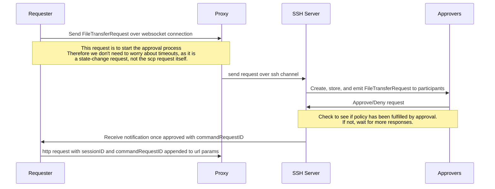

# RFD 122 - Web Moderated Session File Transfer

## Required approvers

Engineering: @zmb3 @xacrimon @jakule

## What

Extend web file transfers to work during moderated web sessions using an approval process

## Why

Users have no ability to transfer files if their role requires a moderated session for the specified server, even if they are in an active and launched session currently.
Originally, we would allow file transfers regardless of moderated sessions which, while good for UX, goes against the purpose of moderated sessions in the first place. 
We have disabled the functionality but would like to reintroduce it in a secure, moderated, and auditable way. 

## Scope

This RFD will cover how to implement an approval process for moderated session file transfer in the web UI. For now, any file transfer request made by `tsh scp` that requires moderator approval will be given an error and directed to the web UI to complete.

## The current issue

When a user initiates a file transfer request (HTTP request and `tcp scp`), the system establishes a new non-interactive session to run the "exec" command.
When we attempt to [open the session](https://github.com/gravitational/teleport/blob/master/lib/srv/regular/sshserver.go#L2062) we have a check named `CheckSFTPAllowed` which will pull any policies that require moderation from the current identity, and return if they've been fulfilled or not. 
This will always fail as this is a "new" session, created just a few lines before the check itself. 
Therefore, we need a way to let the server know that this request has been approved in a moderated session.

## Details

The proposed flow would look like this (simplified).


### The FileTransferRequest 

The general idea of the solution is to provide a way for users to "request-a-request" that can be approved in a moderated session. 
When a file transfer is made via the web UI, the ui will determine if the file transfer will require an approval process. 
Only moderated sessions will require this process. If the launched session is not a moderated session, we can pass the file transfer http request as normal. 
Once the approval process is completed, the file transfer http request will be sent with our new extra parameters. More details [below](#updated-file-transfer-api-handler).

```go
type fileTransferRequest struct {
	id string
	// requester is the Teleport User that requested the file transfer
	requester string
	// download is true if the request is a download, false if its an upload
	download bool
	// filename the name of the file to upload.
	filename string
	// location of the requested download or where a file will be uploaded
	location string
	// approvers is a list of participants of moderator or peer type that have approved the request
	approvers map[string]*party
}
```

We can add any relevant information otherwise needed. 
File-size was considered, but imagine a user trying to download a log file that could have changed size by the time the request flow has completed. 


This struct would be stored in the active session:

```go
type session struct {
    // ...
    fileTransferRequests map[string]*fileTransferRequest
}
```

The benefit of storing it on the session, and not in an access-request-like object, is that once the session is gone, so is the approved request. 
Keeping these approvals as ephemeral as possible is ideal. 

### Transfer request communication

"How do we we send a FileTransferRequest anyway?". 
We will add two new channels in `web/terminal.go` named `fileTransferRequestC` and `fileTransferDecisionC`. Similar to `resizeC`, we can send an event+payload envelope with the current websocket implementation. 
The client will implement new  `MessageTypeEnum` that can be matched in the backend.

```diff
export const MessageTypeEnum = {
  RAW: 'r',
+ FILE_TRANSFER_REQUEST: 'f',
+ FILE_TRANSFER_DECISION: 't',
  AUDIT: 'a',
  SESSION_DATA: 's',
  SESSION_END: 'c',
  RESIZE: 'w',
  WEBAUTHN_CHALLENGE: 'n',
};
```

`terminal.go` can then listen specifically for `FILE_TRANSFER_REQUEST` and handle accordingly.
1. Create a new `FileTransferRequest` struct
3. Broadcast a message to alert users (`"Teleport > michael has requested to download ~/myfile.txt"`)
4. Similar to how we send a `"window-change"` event, we would send a new event 
	1. `_, err := s.ch.SendRequest("file-transfer-request@goteleport.com", false, Marshal(&req))`
5. Handle the request on the sshserver:
	1. send an audit event similar to the broadcast above
	2. store the request in the session
	3. Notify all members of the party (besides originator) of the request via the session connection. 

The reason we notify _all_ party members (originator excluded) is that a session might not necessarily require a moderator but just a second-party such as a peer. 
This would allow those types of sessions to still be audited and go through the file request approval process.

After the steps above we are in the `PENDING` state. 
This isn't a real "state" that exists in any struct, just the part of the flow that is waiting for responses. 
This is not a blocking state and essentially just creates the request, and updates the relevant UI (more on the UI below). 

### The Approval process

Similar to sending the `FileTransferRequest` event, another event will be listened to, the `FileTranferDecision`.  

OnDeny:
	1. Remove request from the session struct. No need to keep it around in a "Denied" state, just delete.
	2. Emit audit event "XUser has denied ~/myfile.txt download request from michael".
	3. Broadcast message same as audit event above so the rest of the session can see
	4. Notify all members of the denial so the UI can be removed.

OnApprove:
	1. Add approver to the `approvers` slice
	2. Broadcast/audit event
	3. We can then use a policy checker to see if the approvers fulfill any moderation policy on the original requester. We can treat this check the same as the `checkIfStart` conditional for opening a session. If this comes back true, we notify the original requester with an event containing the ID of the `FileTransferRequest`

Once the client receives this final "approved" message, we can automatically send a "normal" SFTP request (over HTTP) with two new optional params, `sessionID` and `commandRequestId` (similar to the new optional `webauthn` param in this same request). The benefits of using the normal SFTP request is that we can conditionally choose to skip this entire approval process flow for non-moderated sessions. 
If the session is not moderated, just send the SFTP request as usual. If it is, do the song and dance prescribed  above.

### Updated file transfer api handler

Not much will change here. The only difference is adding the `moderatedSessionID` and `fileTransferRequestID` as env vars, `TELEPORT_MODERATED_SESSION_ID` and `TELEPORT_FILE_TRANSFER_REQUEST_ID` respectively,  in the `serverContext`. This will allow us to extend our `CheckSFTPAllowed` method with a new check like `isApprovedFileTransfer`

```go
func (s *SessionRegistry) isApprovedFileTransfer(scx *ServerContext) (bool error) {
	// fetch session from registry with moderatedSessionID

	// find file transfer request in the session by fileTransferRequestID

	// validate incoming request (user/file/direction/etc) against the stored request

	// if all is good, TRUE
}
```

Then our `CheckSFTPAllowed` can be updated:

```go
func (s *SessionRegistry) OpenExecSession(ctx context.Context, channel ssh.Channel, scx *ServerContext) error {
	// ...
	if canStart {
		return nil
	}
	if registry == nil {
		return trace.Wrap(errCannotStartUnattendedSession)
	}

	approved, err := registry.isApprovedFileTransfer(c)
	if err != nil {
		return trace.Wrap(err)
	}
	// ...
}
```

### UX/UI

The request-a-request flow would be: the request -> the approval -> the file transfer

The `FileTransferRequest` will be stored in-memory and not need to be persisted as it's own entity anywhere else.

We can extend our current File Transfer UI for almost every aspect of moderated file transfers with just a few additions.

A user will follow the normal file transfer dialog and, if in a moderated session, show a "waiting for approval state"


If a request is approved, the user view will continue to look/function the same way as a regular request currently. 

If a request is made via the cli with `tsh scp`, they will be given an error stating this process must be completed in the web UI.

### Per-session-MFA

Once a file has been approved, it will go through the same process as file transfers now, so the "requester" gets all the MFA functionality for free and nothing will need to be done on that side.

We will have to add an MFA tap for approve/deny if MFA is required, but our sessions already have precence checks that require MFA so we can just reuse what already exists here.


## Security Considerations

Originally, an idea was thrown around to create a "signed" url with all the `FileTransferRequest` information encoded in it but this seemed unnecessary. 
Because the current flow stores the original request in the session, we aren't giving them full access to open any exec session, just one that matches the exact request that was asked for. 
Also, having the request stored in the session means that once the session is gone, there isn't a way to "re-request" it. 

I didn't speak above removing the request once it's been completed but that is a possibility. We can either
1. Remove the request once it's been approved and executed
2. Let the request live until the session is gone. This is less secure as it allows the user to download the file as many times as they want but would improve UX to not have to constantly ask for approval for the same file. 

I prefer option 1 and just take the UX hit in favor of security.
