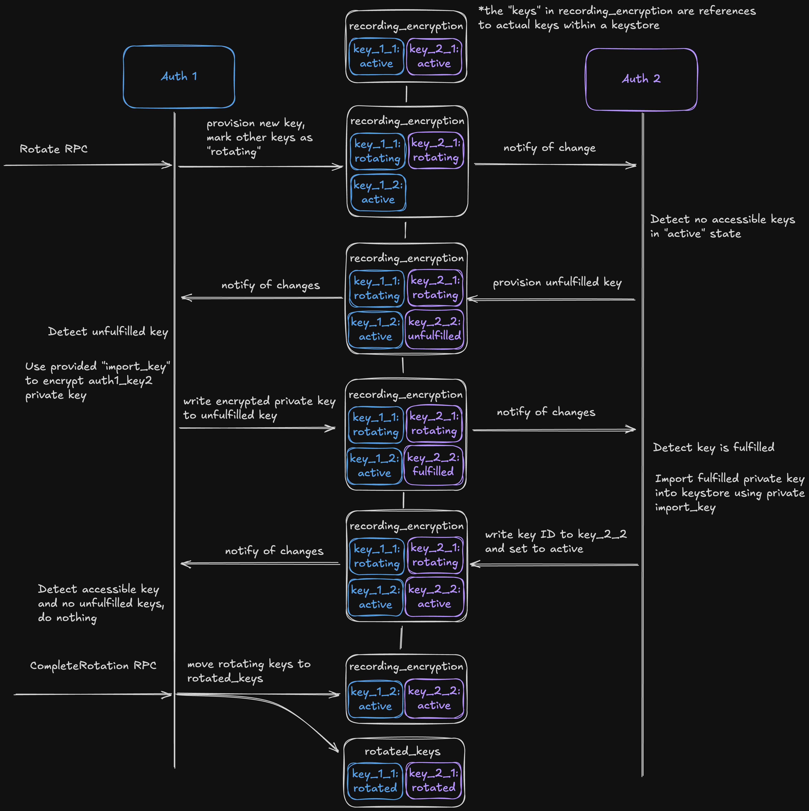

# RFD 127 - Encrypted Session Recordings

## Required Approvers

- Engineering: @rosstimothy, @zmb3, @espadolini, @nklaassen
- Security: doyensec

## What

This document proposes an approach to encrypting session recording data before
writing to disk or any long term storage.

## Why

Recordings temporarily stored to disk can be easily tampered with by users with
enough access. This could even occur within the session being recorded if the
host user has root access.

Encrypting session recordings at rest can help prevent exposure of credentials
or other secrets that might be visible within the recording.

## Details

This document should fulfill the following requirements:

- Encrypting session recording data at rest in long term storage and during any
  intermediate disk writes.
- Replay of encrypted sessions using the web UI and `tsh`.
- Support sourcing key material directly from an HSM or other supported
  keystore.
- All auth servers in a cluster should be able to replay session recordings
  even if they did not encrypt them.
- An encryption algorithm suitable for this workload.

### Encryption Algorithm

This document proposes [age](https://github.com/FiloSottile/age) as the
encryption format for session recordings. It was chosen for its provenance,
simplicity, and focus on strong cryptography defaults without requiring
customization. The formal spec can be found
[here](https://age-encryption.org/v1). Officially supported key wrapping
algorithms are limited to X25519, Ed25519, and RSA. Support for other
algorithms requires implementing a custom plugin or requesting modifications
from the upstream. The algorithms employed by `age` are not currently
compatible with FIPS, which means configuring encrypted sessions while in FIPS
mode will result in failed startup.

Below is a high level diagram showing how `age` encryption and decryption work:


### Config Changes

Encrypted session recording is a feature of the auth service and can be enabled
using a new `encryption` section in the `session_recording_config` resource.

```yaml
# session_recording_config.yml
kind: session_recording_config
version: v2
spec:
  encryption:
    # whether or not encryption should be enabled
    enabled: true
    # whether or not Teleport should manage the keys or simply consume them
    key_manager: 'keystore|teleport'
    # key labels Teleport will use to find active encryption keys when mode is
    # set to "keystore-managed"
    active_key_labels: []
    # key labels Teleport will use to find rotated encryption keys when mode is
    # set to "keystore-managed"
    rotated_key_labels: []
```

HSM integration is facilitated through the existing configuration
options for setting up an HSM backed CA keystore through pkcs#11. Example
configuration found [here](https://goteleport.com/docs/admin-guides/deploy-a-cluster/hsm/#step-25-configure-teleport).

The `key_manager` configuration controls whether or not the wrapping key used
by `age` should be provisioned and managed by Teleport or by the configured
keystore. When set to `teleport`, Teleport will provision, share,
and rotate keys as necessary. When set to `keystore`, Teleport expects to
have access to keys queryable using the configured `active_key_labels` and
`rotated_key_labels`. Any keys found will be used during encryption and
decryption and Teleport will not attempt to provision new keys or facilitate
rotation.

These configuration options are also accessible in the `teleport.yml` file
configuration under the `auth_service` section:

```yaml
# teleport.yml
auth_service:
  session_recording_config: node
  session_recording_config_encryption: on
  session_recording_config_key_manager: keystore
  session_recording_config_active_key_labels: []
  session_recording_config_rotated_key_labels: []
```

### Protobuf Changes

```proto
// api/proto/teleport/legacy/types/types.proto

// EncryptionKeyPair is a keypair used for encrypting and decrypting data.
message EncryptionKeyPair {
  // public_key is the public encryption key.
  bytes public_key = 1 [(gogoproto.jsontag) = "public_key"];
  // PrivateKey is the private decryption key.
  bytes private_key = 2 [(gogoproto.jsontag) = "private_key"];
  // PrivateKeyType is the type of the private_key.
  PrivateKeyType private_key_type = 3 [(gogoproto.jsontag) = "private_key_type"];
  // Hash is the hash function to use during encryption/decryption operations.
  // It maps directly to the possible values of crypto.Hash in the go crypto
  // package.
  uint32 hash = 4 [(gogoproto.jsontag) = "hash"];
}

// AgeEncryptionKey is a PEM encoded RSA4096 public key used for encrypting
// session recordings.
message AgeEncryptionKey {
  bytes public_key = 1 [(gogoproto.jsontag) = "public_key"];
}

// SessionRecordingConfigStatusV2 contains the encryption_keys that should be
// used during any recording encryption operation.
message SessionRecordingConfigStatusV2 {
  repeated AgeEncryptionKey encryption_keys  = 1 [
    (gogoproto.jsontag) = "encryption_keys"
  ];
}


// SessionRecordingEncryptionConfig configures if and how session recordings
// should be encrypted.
message SessionRecordingEncryptionConfig {
  bool enabled = 1 [(gogoproto.jsontag) = "enabled"];
}

// SessionRecordingConfigSpecV2 is the actual data we care about
// for SessionRecordingConfig.
message SessionRecordingConfigSpecV2 {
  // existing fields omitted

  SessionRecordingEncryptionConfig encryption = 3 [
    (gogoproto.jsontag) = "encryption"],
    (gogoproto.nullable) = true
  ];
}

// SessionRecordingConfigV2 contains session recording configuration.
message SessionRecordingConfigV2 {
  // existing fields omitted

  // Status contains all of the current and rotated keys used for encrypted
  // session recording
  SessionRecordingConfigStatusV2 status = 6 [
    (gogoproto.jsontag) = "status",
    (gogoproto.nullable) = true
  ];
}
```

```proto
// api/proto/teleport/recording_encryption/v1/recording_encryption.proto

import "teleport/header/v1/metadata.proto";
import "teleport/legacy/types/types.proto";

// KeyState represents that possible states a RecordingEncryptionKey can be in.
enum KeyState {
  // Default KeyState
  KEY_STATE_UNSPECIFIED = 0;
  // KEY_STATE_ACTIVE marks a key in good standing.
  KEY_STATE_ACTIVE = 1;
  // KEY_STATE_ROTATING marks a key as waiting for its owning auth server to
  // rotate it.
  KEY_STATE_ROTATING = 2;
  // KEY_STATE_ROTATED marks a key as fully rotated.
  KEY_STATE_ROTATED = 3;
}

// RecordingEncryptionKey represents an asymmetric encryption key pair usable
// during recording encryption and decryption.
message RecordingEncryptionKey {
  // The asymmetric keypair used to wrap the age file key. Expected to be RSA.
  types.EncryptionKeyPair key_pair = 1;
  // The public RSA key used for encrypting private key material to be imported
  // by a keystore backend.
  bytes import_key = 2;
  // Represents whether the RecordingEncryptionKey is rotating or not
  KeyState state = 3;
}

// RecordingEncryptionSpec contains the active key set for encrypted
// session recording.
message RecordingEncryptionSpec {
  // The list of active recording encryption keys currently configured for the
  // cluster.
  repeated RecordingEncryptionKey active_keys = 1;
}

// RecordingEncryptionStatus contains the status of the RecordingEncryption
// resource.
message RecordingEncryptionStatus {}

// RecordingEncryption contains cluster state for encrypted session recordings.
message RecordingEncryption {
  string kind = 1;
  string sub_kind = 2;
  string version = 3;
  teleport.header.v1.Metadata metadata = 4;
  RecordingEncryptionSpec spec = 5;
  RecordingEncryptionStatus status = 6;
}

// RotatedKeysSpec contains the previously rotated recording encryption keys
// related to a given public key.
message RotatedKeysSpec {
  string public_key = 1;
  repeated RecordingEncryptionSpec keys = 2;
}

// RotatedKeysStatus contains the status of RotatedKeys.
message RotatedKeysStatus {}

// RotatedKeys contains a set of rotated recording encryption keys related to a
// specific public key.
message RotatedKeys {
  string kind = 1;
  string sub_kind = 2;
  string version = 3;
  teleport.header.v1.Metadata metadata = 4;
  RotatedKeysSpec spec = 5;
  RotatedKeysStatus status = 6;
}
```

```proto
// api/proto/teleport/recording_encryption/v1/recording_encryption_service.proto
syntax = "proto3";

package teleport.recordingencryption.v1;

import "teleport/recordingencryption/v1/recording_encryption.proto";

option go_package = "github.com/gravitational/teleport/api/gen/proto/go/teleport/recordingencryption/v1;recordingencryptionv1";

// RecordingEncryption provides methods for rotating key pairs associated with
// encrypting session recordings and uploading encrypted recordings captures in an
// async recording mode.
service RecordingEncryptionService {
  // RotateRecordingEncryptionKey rotates the key pair used for encrypting session
  // recording data.
  rpc RotateRecordingEncryptionKey(RotateRecordingEncryptionKeyRequest) returns (RotateRecordingEncryptionKeyResponse);
  // GetRotationState returns whether or not a key rotation is in progress.
  rpc GetRotationState(GetRotationStateRequest) returns (GetRotationStateResponse);
  // CompleteRotation moves rotated keys out of the active set.
  rpc CompleteRotation(CompleteRotationRequest) returns (CompleteRotationResponse);
  // RollbackRotation removes active keys and reverts rotating keys back to
  // being active.
  rpc RollbackRotation(RollbackRotationRequest) returns (RollbackRotationResponse);

  // CreateUpload begins a multipart upload for an encrypted recording. The
  // returned upload ID should be used while uploading parts.
  rpc CreateUpload(CreateUploadRequest) returns (CreateUploadResponse);
  // UploadPart uploads a part to the given upload ID.
  rpc UploadPart(UploadPartRequest) returns (UploadPartResponse);
  // CompleteUploadRequest marks a multipart upload as complete.
  rpc CompleteUpload(CompleteUploadRequest) returns (CompleteUploadResponse);
}

// RotateRecordingEncryptionKeyRequest
message RotateRecordingEncryptionKeyRequest {}

// RotateRecordingEncryptionKeyResponse
message RotateRecordingEncryptionKeyResponse {}

// GetRotationStateRequest
message GetRotationStateRequest {}

// AgeEncryptionKeyWithState reports the KeyState for a given public key.
message AgeEncryptionKeyWithState {
  // PublicKey is PEM encoded RSA4096 public key associated with the KeyState.
  bytes public_key = 1;
  // KeyState is the state PublicKey is currently in.
  teleport.recordingencryption.v1.KeyState key_state = 2;
}

// GetRotationStateResponse returns whether or not a key rotation is in
// progress.
message GetRotationStateResponse {
  // State represents whether or not a recording key rotation is in progress.
  teleport.recordingencryption.v1.KeyState state = 1;
}

// CompleteRotationRequest
message CompleteRotationRequest {}

// CompleteRotationResponse
message CompleteRotationResponse {}

// RollbackRotationRequest
message CompleteRotationRequest {}

// RollbackRotationResponse
message CompleteRotationResponse {}

// An Upload represents a multipart upload for an encrypted session.
message Upload {
  // UploadID identifies an upload for a given encrypted session.
  string upload_id = 1;
  // SessionID of the associated session.
  string session_id = 2;
  // InitiatedAt captures the time that the multipart upload was initiated.
  google.protobuf.Timestamp initiated_at = 3;
}

// CreateUploadRequest contains the session ID to be used while initializing the upload.
message CreateUploadRequest {
  // SessionID associated with the recording being uploaded.
  string session_id = 1;
}

// CreateUploadResponse contains the upload ID to be used when uploading parts.
message CreateUploadResponse {
  // Upload represents an encrypted session upload.
  Upload upload = 1;
}

// UploadPartRequest is an indivdual part to be uploaded.
message UploadPartRequest {
  // Upload represents the encrypted session to upload the part to.
  Upload upload = 1;
  // PartNumber is the ordered index applied to the part.
  int64 part_number = 2;
  // Part is the encrypted part of session recording data being uploaded.
  bytes part = 3;
}

// UploadPartResponse contains the part index that was uploaded with its
// associated e-tag.
message UploadPartResponse {
  // PartIndex is the ordered index applied to the part.
  int64 part_number = 1;
  // ETag is a part e-tag.
  string e_tag = 2;
  // LastModified captures the timestamp of the most recent modification of this part (if available)
  google.protobuf.Timestamp last_modified = 3;
}

// CompleteUploadRequest marks a multipart upload as complete.
message CompleteUploadRequest {
  // Upload identifies the upload that should be completed.
  Upload upload = 1;
  // Parts are the part indices and resulting e-tags of uploaded parts.
  repeated UploadPartResponse parts = 3;
}

// CompleteUploadResponse
message CompleteUploadResponse {}
```

### Session Recording Modes

There are four session recording modes that describe where the recordings are
captured and how they're shipped to long term storage.

- `proxy-sync`
- `proxy`
- `node-sync`
- `node`

Where the recordings are collected is largely unimportant to the encryption
strategy, but whether or not they are handled async or sync has different
requirements.

In sync modes the session recording data is written immediately to the auth
service without intermediate disk writes. The auth service then handles
batching and multipart upload of events to long term storage. In order to
ensure resilience to partial uploads of parts, each batch will need to be
encrypted individually on the auth service. This will likely mean wrapping the
`gzipWriter` [used by slices](https://github.com/gravitational/teleport/blob/master/lib/events/stream.go#L669)
with an `age` encryption writer.

In async modes the session recording data is written to intermediate `.part`
files. These files are collected until they're ready for upload and are then
combined into a single `.tar` file. In order to prevent all session recording
data from being lost in the event of an agent crashing, each part will be
encrypted individually much like the encrypted batches in `sync` modes. Because
the data is already encrypted, exploding the final `.tar` file back into events
to be uploaded to the auth service is not possible. Instead the auth service
will accept a binary upload of the `.tar` file which it can then proxy to long
term storage. This will be done using the multipart upload RPCs described in
the `recording_encryption_service.proto` above. Each part will then be written
to long term storage using the auth servers existing multipart upload
functionality.

### Protocols

We record sessions for multiple protocols, including ssh, windows desktop,
database sessions and more. Because this approach encrypts at the point of
writing without modifying the recording structure, no per-protocol special
handling is expected.

### Key Types

This design relies on two different types of keys.

- File keys generated by `age`. These are per-file data keys used during
  symmetric encryption and decryption of recording data.
- Recording encryption key pairs (REK) generated by keystores. These are used
  by `age` during encryption to wrap file keys so they can be included in the
  `age` header and are also referred to as `Identity` (private) and `Recipient`
  (public) keys. This document proposes `RSA4096` as the algorithm used for
  generating recording encryption key pairs due to its availability for
  encryption use cases across Teleport's supported keystores.

The relationships between key types is shown in the diagram below and further
explained throughout the rest of the document.

```
symmetric data
encryption key                          enveloped key included
(age generated)                        in ciphertext as a stanza
 -------         ------------------        ---------------
|filekey| ----> |RSA4096 public key| ----> |wrapped filekey|
 -------         ------------------        ---------------
               keystore generated key
               for wrapping filekeys
                  (age Recipient)

symmetric data
decryption key                          enveloped key included
(age generated)                        in ciphertext as a stanza
 -------         -------------------        ---------------
|filekey| <---- |RSA4096 private key| <---- |wrapped filekey|
 -------         -------------------        ---------------
               keystore generated key
               for unwrapping filekeys
                  (age Identity)
```

### Key Generation

#### Teleport Managed

Initial key generation will be handled by the first auth server to acquire a
lock on on the `recording_encryption` resource. It will generate an initial
`RSA4096` pair using the configured CA keystore which will be used as the
active REK. The REK will then be saved to the
`recording_encryption.active_keys` list as a `RecordingEncryptionKey`.

`RSA` key generation is already supported for signing use-cases across AWS
KMS, GCP CKM, and PKCS#11. However we will need to add support for calling into
their native decryption functions in order to unwrap `age` file keys:

- AWS KMS supports setting an algorithm of `RSAES_OAEP_SHA_256` when using the
  `Decrypt` action of the KMS API.
- GCP CKM supports generating keys of type `RSAES_OAEP_2048_SHA256` which can
  be used when calling the `AsymmetricDecrypt` API from their go SDK. Worth
  noting that keys generated for signing can not be used for decryption, so key
  generation with a GCP backend will need to be modified slightly.
- This should be supported by most HSMs through the `CKM_RSA_PKCS_OAEP` and
  `CKM_SHA256` mechanisms which are usable when calling the `C_DecryptInit`
  function exposed by PKCS#11.

In order to collaboratively generate and share the REK pair, all auth servers
must create a watcher for `Put` events against the `recording_encryption`
resource. Modifications to this resource will signal existing auth servers to
investigate whether or not there is work that needs to be done. For example,
when adding a new auth server to an environment, it will find that there is
already a REK pair configured. It will check if any active keys are accessible
(detailed below) and, in the case that there are none, add an unfulfilled key
to the active key list. An unfulfilled key consists of an empty key pair with a
keystore generated RSA public key meant for key exchange. Any other auth server
with access to a valid `RecordingEncryptionKey` can inspect the unfulfilled
key, use it to wrap their own copy of the REK private key, and write it to the
unfulfilled private key. The new auth server will be notified of the change,
see that their key has been fulfilled, and finish the import process using
their configured keystore.

Some keystores support this sort of wrapped key exchange without ever exposing
the secret key to software which should be preferred whenever avaialble. In
cases where a more secure key exchange is not supported, the private key will
be decrypted by the Teleport auth service to be software OAEP encrypted using
the import key. Parameters for encryption are dependent on the importing
keystore, but should prefer using `RSA4096` with `SHA256`.

Each time there is a change to the active keys, the set of public keys will
also be assigned to `session_recording_config.status.encryption_keys` to be
used by nodes throughout the cluster.

When using centralized keystores, such as AWS KMS, auth servers may share
access to the same key. In that case no additional recording encryption key
will be provisioned.

In order to avoid unintended automatic deletion, keys provisioned for encrypted
session recording will be tagged with a different label where applicable. This
will prevent older auth servers from deleting this new keytype and allow new
auth servers to identify which keys are no longer in use before deletion.

#### Keystore Managed

When key management is left to the keystore, Teleport makes no attempt at
generating encryption keys. Instead it will use the labels defined in
`session_recording_config.encryption.active_key_labels` and
`session_recording_config.encryption.rotated_key_labels` to query keys from the
configured keystore. The key IDs are cached by a fingerprint of their public
keys and and the active public keys are written to the
`session_recording_config.status.encryption_keys` list. The auth server will
refresh its keys whenever it's notified of `session_recording_config` change
and also periodically to capture any new keys created with the same labels.

It's important to note that historical recordings will only be accessible if
all auth servers have access to the correct keys. It is the responsibility of
the keystore and Teleport admins to ensure that keys are not lost and that new
auth servers entering the cluster have access to the appropriate key material
to decrypt historical recordings.

It is expected that all recording encryption key pairs are `RSA4096` regardless
of whether they are Teleport managed or keystore managed.

### Key Sharing

For keys not managed by Teleport, key sharing is left to the administrator to
facilitate.

In order for all auth servers in a cluster to replay all recordings, they will
need access to the same keys. There are common cases where keys are easily
shared, such as a software key or an AWS KMS key that all auth servers have
access to. This RFD proposes that recording encryption should assume that
keystores and keys are available to all auth servers in a cluster. This would
require either adjusting HSM key IDs to remove the `host_uuid` or ignoring the
`host_uuid` altogether during recording encryption.

If there is a need to support multi-keystore clusters, we have a couple of
options laid out below.

For sharing between HSMs, Teleport could facilitate a process similar to
the one defined in [pkcs11-tools](https://github.com/Mastercard/pkcs11-tools/blob/master/docs/MANUAL.md#exchanging-a-keys-between-tokens---the-long-way).
This allows sharing of key material between HSMs without exposing it to a
Teleport process.

For AWS KMS and GCP KMS things are a bit trickier. They both prevent exporting
private key material and importing bare public keys. In order to circumvent
this, we can create share-able KMS keys by:

- Generating a new KMS key.
- Using that key to generate an asymmetric data key, exporting the encrypted
  private key and saving it for future sharing.
- Import the generated asymmetric key back into KMS. This requires reencrypting
  in software and exposes the private key to the Teleport process.
- Decrypting file keys for replay would happen entirely within KMS.
- When a new key is published with an import key, we will again reencrypt in
  software by using the original KMS key generated in the first step and the
  encrypted private key.

One final alternative would be to fallback to the intermediate software key
originally proposed in this RFD. However, it exposes private key material to
memory on every replay rather than just during key exchange.

### Encryption

At a high level, `age` encryption works by generating a per-file symmetric key
used for data encryption. That key is wrapped using an asymmetric keypair and
included in the header section of the encrypted file as a stanza. Plugins
implementing different key algorithms only affect the crypto involved with
wrapping and unwrapping data encryption keys.

In order to ensure the public keys are identifiable and the file keys can be
decrypted by the keystore directly, we will write a custom `age` plugin. All
nodes (proxies, ssh nodes, windows desktop nodes, etc.) will have access to
the public `RSA4096` keys stored at
`session_recording_config.status.encryption_keys`. Each unique public key will
result in a custom `Recipient` implementation responsible for wrapping the file
key using `OAEP-SHA256`. They will include the fingerprinted public key in the
stanza to make lookup during replay easier. The `Identity` implementation will
integrate directly with the configured keystore and handle searching for a
compatible key and requesting decryption of the file key.


### Decryption and Replay


Because decryption will happen in the auth service before streaming to the
client, the UX of replaying encrypted recordings is nearly identical to
unencrypted recordings. The auth server will search for an accessible key
related to at least one of the recipient stanzas present in the `age` header.
It will use that key with the keystore to unwrap any filekeys and decrypt the
recording on the fly as it's streamed back to the client. This should be
compatible with all replay clients, including web. The only change to the
client UX is that encrypted recording files can not be passed directly to
`tsh play` because decryption is only possible within the auth service.

It's important to note that encrypted sessions are a series of concatenated
`age` output files, one for each batch of messages encrypted for a given
session. Both `sync` and `async` modes try and avoid situations where an
encrypted batch of messages would be split between parts of a multipart upload,
but the auth service should also try and recover in situations where this might
not be the case by splitting on `age` headers. If we mistakenly concatenate
output that was not continuous or part of the same batch, decryption will fail
and we would then be forced to return an error.

#### Teleport Managed

When Teleport manages encryption keys, an "accessible active key" is any key
present in the `recording_encryption.active_keys` list or the `rotated_keys`
resource that the auth server has access to use. Rotated keys can be looked up
by the public key fingerprint used during encryption.

#### Keystore Managed

When keys are managed by the keystore, an "accessible active key" is any key
present in the auth server's local cache populated by the keys found for the
configured labels. Note that the "keys" cached for KMS and HSM backends are
just references to real keys stored in the keystore.

### Key Rotation

#### Keystore Managed

How keys are rotated as well as execution of the rotation are both
responsibilities of the Teleport and keystore admins. One example of what a
rotation might look like is:

##### [1/5] Config before rotation

```yml
encryption:
  active_key_labels: ['recording_2024']
  rotated_keys: []
```

##### [2/5] Provision keys with new label

Provision new, labeled keyparis in all configured keystores. This example
assumes `recording_2025`.

##### [3/5] Add new label to active keys

```yml
encryption:
  active_key_labels: ['recording_2025', 'recording_2024']
  rotated_keys: []
```

All recordings are now being encrypted using keys from both labels. This gives
a chance to confirm the new keys are working without potentially losing data.

##### [4/5] Move old label to rotated keys

```yml
encryption:
  active_key_labels: ['recording_2025']
  rotated_keys: ['recording_2024']
```

New recordings will only be encrypted using `recording_2025` keys, but old
recordings will still be replayable with `recording_2024` keys.

##### [5/5] Remove old label and keys

```yml
encryption:
  active_key_labels: ['recording_2025']
  rotated_keys: []
```

Historical recordings requiring `recording_2024` keys will no longer be
replayable. Keys can now be removed from the keystore.

This process could look different if your keystore allows for modifying labels
of existing keys. You might have `active_recording` and `rotated_recording` as
long lived labels and simply add/move/remove keys appropriately to achieve a
similar rotation.

#### Teleport Managed

In order to prevent a single recording encryption key (REK) from decrypting all
session recordings ever recorded, we will need to provide a rotation process.
This will require exposing a new set of RPCs as previously defined in the
recording encryption service protobuf. The steps here include a proposed path
for facilitating key sharing. If Teleport assumes shared access to keys by all
auth servers in the cluster, rotation would include the same handling of RPCs
described without any intermediate notification round trips.



When an auth server receives a `RotateRecordingEncryptionKey` RPC call, it
will:

- Fetch all active keys from `recording_encryption.spec.active_keys`.
- Generate a new `RSA4096` REK within its keystore and add it to the list of
  active keys.
- Change the `state` of each active `RecordingEncryptionKey` to `rotating`.
- Apply all writes described in a single, atomic write to the backend.

Other auth servers in the cluster will be notified through a watch of the
`recording_encryption` resource and will:

- Detect they have no keys that are accessible and active.
- Provision an import key from their keystore.
- Publish an unfulfilled `RecordingEncryptionKey` to the active keys list.
- Wait for their key to be fulfilled.

The original auth server, or any auth server that has completed their rotation,
will then be notified when an unfulfilled key is published. It will:

- Find the unfulfilled keys
- Use their import keys to wrap the new recording encryption private key.
- Fulfill all keys with their encrypted copy of the private key.

The unfulfilled auth servers will then be notified, import the key into their
key store, and mark their new key as `active`.

Rotation is completed manually by issuing a `CompleteRotation` RPC which will
move all `rotating` keys into their own `rotated_keys` resource queryable by
the public key that should be shared between them. Similarly the
`RollbackRotation` RPC will remove all newly `active` keys and revert
`rotating` keys back to `active`.

It's worth noting that `rotating` keys will continue to be included as `age`
recipients during encryption. This should ensure no data loss in the event of
a bad rotation or rollback.

#### `tctl` Changes

Recording encryption key rotations will be handled through `tctl` using the
following commands.

```bash
tctl recordings encryption rotate
```

Issue a request to the `RotateRecordingEncryption` RPC to rotate the recording
encryption key. This command will output a status message conveying whether or
not rotation was successful or not.

```bash
tctl recordings encryption rotate complete
```

A successful rotation can be completed using the `complete` subcommand. It will
call the `CompleteRotation` RPC and move all keys marked as `rotated` to a new
`RotatedKeys` resource keyed on the REK public key they relate to.

```bash
tctl recordings encryption rotate rollback
```

A rotation can be cancelled and rolled back using the `rollback` sub command.
It will call the `RollbackRecordingEncryptionRotation` RPC which removes all
new keys and marks all `rotated` keys as `active`.

```bash
tctl recordings encryption rotate --status
```

Including the `--status` flag issues a request to the `GetRotationState` RPC to
return whether or not a key rotation is in progress.

### Security

Protection of key material invovled with encrypting session recordings is
largely managed by our existing keystore features. The one exception being key
exchange between keystores unable to share keys directly (e.g. AWS KMS). In
these cases the private key used to decrypt recording file keys is exposed to
memory owned by auth server processes. This key should never be saved or cached
and should only be exposed long enough to encrypt it to complete key exchange.

One of the primary concerns outside of key management is ensuring that session
recording data is always encrypted before landing on disk or in long term
storage. In order to help enforce this, all session recording interactions
should be gated behind a standard interface that can be implemented as either
plaintext or encrypted. This will help ensure that once the encrypted writer
has been selected, any interactions with session recordings are encrypted by
default.

## UX Examples

For the most part, the user experience of encrypted session recordings is
identical to non-encrypted session recordings. The only notable change is the
addition of the `tctl recordings encryption rotate` subcommand for rotating keys
related to encrypted session recording.

### Teleport admin rotating session recording encryption keys

```bash
tctl recordings encryption rotate
```

### Teleport admin querying status of ongoing rotation

```bash
tctl recordings encryption rotate --status

"Rotation waiting for completion"
```

### Teleport admin cancelling an ongoing rotation

```bash
tctl recordings encryption rotate rollback
```

### Teleport admin completing a finished rotation

```bash
tctl recordings encryption rotate complete

"Rotation complete"
```

### Teleport admin replaying encrypted session recording using `tsh`

```bash
tsh play 49608fad-7fe3-44a7-b3b5-fab0e0bd34d1
```

### Teleport admin replaying encrypted session recording file using `tsh`

```bash
tsh play 49608fad-7fe3-44a7-b3b5-fab0e0bd34d1.tar

"Replaying encrypted recording files is not supported by tsh, try replaying the with the session ID instead"
```

### Test Plan

- Sessions are recorded when `auth_service.session_recording.encryption.enabled: on`.
- Encrypted sessions can be played back in both web and `tsh`.
- Encrypted sessions can be recorded and played back with or without a backing
- Key rotations for both key types don't break new recordings or remove the
  ability to decrypt old recordings.
- Repeat all test plan steps with software, HSM, and KMS key backends.
