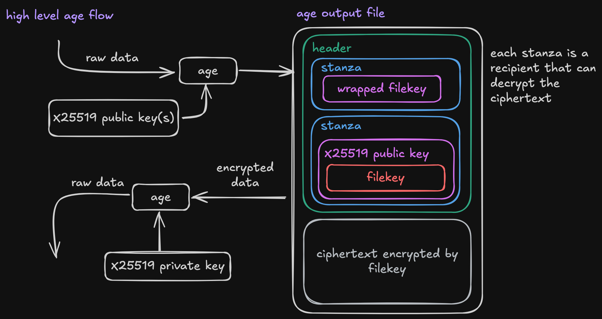
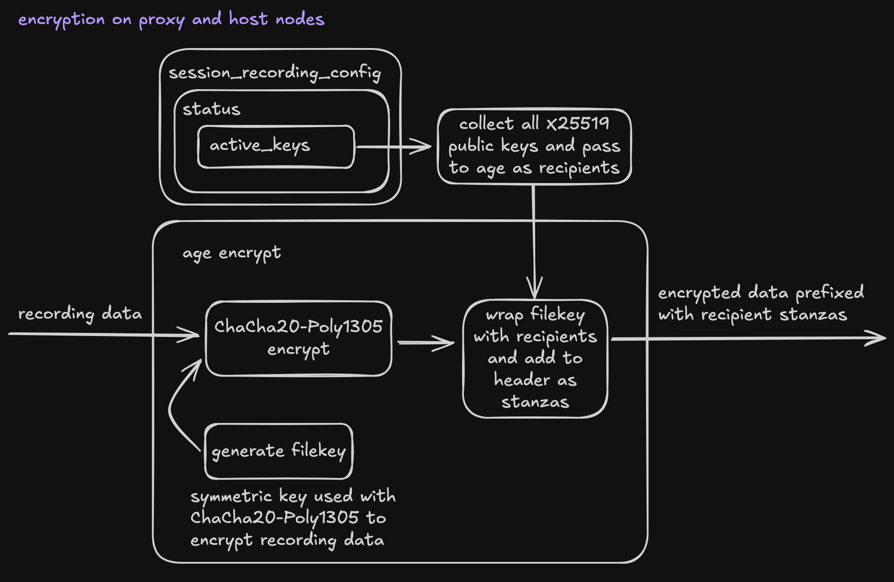
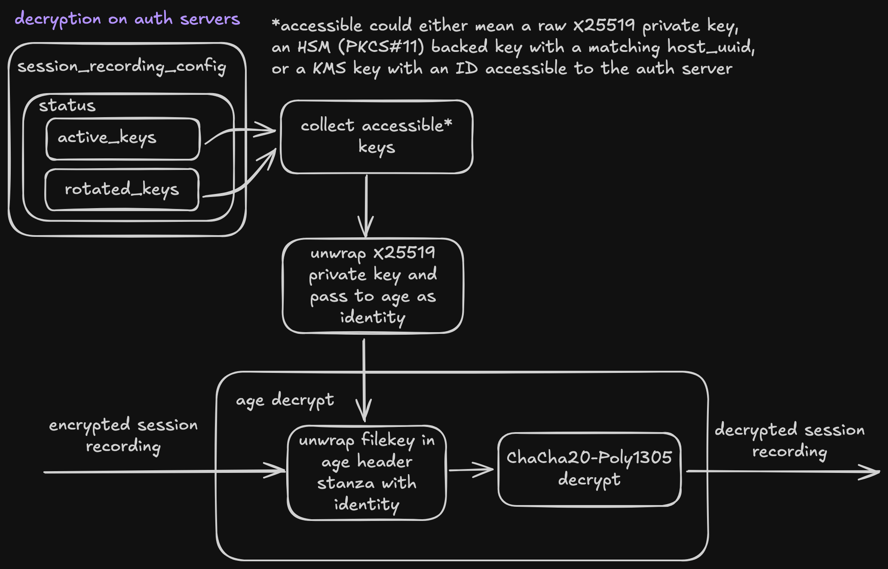

# RFD 127 - Encrypted Session Recordings

## Required Approvers

- Engineering: @rosstimothy, @zmb3, @espadolini, @nklaassen
- Security: doyensec

## What

This document proposes an approach to encrypting session recording data before
writing to disk or any long term storage.

## Why

Recordings temporarily stored to disk can be easily tampered with by users with
enough access. This could even occur within the session being recorded if the
host user has root access.

Encrypting session recordings at rest can help prevent exposure of credentials
or other secrets that might be visible within the recording.

## Details

This document should fulfill the following requirements:

- Ability to encrypt session recording data at rest in long term storage and
  during any intermediate disk writes.
- Ability to replay encrypted sessions using the web UI.
- Ability to guard decryption using key material from an HSM or other supported
  keystore.
- Support for multiple auth servers using different HSM/KMS backends.
- An encryption algorithm suitable for this workload.

### Encryption Algorithm

This RFD assumes the usage of [age](https://github.com/FiloSottile/age), which
was chosen for its provenance, simplicity, and focus on strong cryptography
defaults without requiring customization. The formal spec can be found
[here](https://age-encryption.org/v1). Officially supported key algorithms are
limited to X25519 (recommended by the spec), Ed25519, and RSA. Support for
other algorithms would either have to be requested from the upstream or
manually implemented as a custom plugin. The algorithms employed by `age` are
not currently compatible with FIPS, which means configuring encrypted sessions
while in FIPS mode will result in failed startup.

Below is a high level diagram showing how `age` encryption and decryption work:


### Config Changes

Encrypted session recording is a feature of the auth service and can be enabled
through the `session_recording_config` resource.

```yaml
# session_recording_config.yml
kind: session_recording_config
version: v2
spec:
  encryption:
    enabled: true
```

HSM integration is facilitated through the existing configuration
options for setting up an HSM backed CA keystore through pkcs#11. Example
configuration found [here](https://goteleport.com/docs/admin-guides/deploy-a-cluster/hsm/#step-25-configure-teleport).

### Protobuf Changes

```proto
// api/proto/teleport/legacy/types/types.proto

// EncryptionKeyPair is a keypair used for encrypting and decrypting data.
message EncryptionKeyPair {
  // public_key is the public encryption key.
  bytes public_key = 1 [(gogoproto.jsontag) = "public_key"];
  // PrivateKey is the private decryption key.
  bytes private_key = 2 [(gogoproto.jsontag) = "private_key"];
  // PrivateKeyType is the type of the private_key.
  PrivateKeyType private_key_type = 3 [(gogoproto.jsontag) = "private_key_type"];
  // Hash is the hash function to use during encryption/decryption operations.
  // It maps directly to the possible values of crypto.Hash in the go crypto
  // package.
  uint32 hash = 4 [(gogoproto.jsontag) = "hash"];
}

// AgeEncryptionKey is a Bech32 encoded age X25519 public key used for
// encrypting session recordings.
message AgeEncryptionKey {
  bytes public_key = 1 [(gogoproto.jsontag) = "public_key"];
}

// SessionRecordingConfigStatusV2 contains the encryption_keys that should be
// used during any recording encryption operation.
message SessionRecordingConfigStatusV2 {
  repeated AgeEncryptionKey encryption_keys  = 1 [
    (gogoproto.jsontag) = "encryption_keys"
  ];
}


// SessionRecordingEncryptionConfig configures if and how session recordings
// should be encrypted.
message SessionRecordingEncryptionConfig {
  bool enabled = 1 [(gogoproto.jsontag) = "enabled"];
}

// SessionRecordingConfigSpecV2 is the actual data we care about
// for SessionRecordingConfig.
message SessionRecordingConfigSpecV2 {
  // existing fields omitted

  SessionRecordingEncryptionConfig encryption = 3 [
    (gogoproto.jsontag) = "encryption"],
    (gogoproto.nullable) = true
  ];
}

// SessionRecordingConfigV2 contains session recording configuration.
message SessionRecordingConfigV2 {
  // existing fields omitted

  // Status contains all of the current and rotated keys used for encrypted
  // session recording
  SessionRecordingConfigStatusV2 status = 6 [
    (gogoproto.jsontag) = "status",
    (gogoproto.nullable) = true
  ];
}
```

```proto
// api/proto/teleport/recording_encryption/v1/recording_encryption.proto

import "teleport/header/v1/metadata.proto";
import "teleport/legacy/types/types.proto";

// KeyState represents that possible states a WrappedKey can be in.
enum KeyState {
  // Default KeyState
  KEY_STATE_UNSPECIFIED = 0;
  // KEY_STATE_ACTIVE marks a key in good standing.
  KEY_STATE_ACTIVE = 1;
  // KEY_STATE_ROTATING marks a key as waiting for its owning auth server to
  // rotate it.
  KEY_STATE_ROTATING = 2;
  // KEY_STATE_ROTATED marks a key as fully rotated.
  KEY_STATE_ROTATED = 3;
}

// WrappedKey wraps a PrivateKey using an asymmetric keypair.
message WrappedKey {
  // RecordingEncryptionPair is the asymmetric keypair used to wrap the
  // private key. Expected to be RSA.
  types.EncryptionKeyPair recording_encryption_pair = 1;
  // KeyEncryptionPair is the asymmetric keypair used with age to encrypt
  // and decrypt filekeys.
  types.EncryptionKeyPair key_encryption_pair = 2;
  // State represents whether the WrappedKey is rotating or not
  KeyState state = 3;
}

// KeySet contains the list of active and rotated WrappedKeys for a
// given usage.
message KeySet {
  // AciveKeys is a list of active, wrapped X25519 private keys. There should
  // be at most one wrapped key per auth server using the
  // SessionRecordingConfigV2 resource unless keys are being rotated.
  repeated WrappedKey active_keys = 1;
}

// RecordingEncryptionSpec contains the active key set for encrypted
// session recording.
message RecordingEncryptionSpec {
  KeySet key_set = 1;
}

// RecordingEncryptionStatus contains the status of the RecordingEncryption resource.
message RecordingEncryptionStatus {}

// RecordingEncryption contains cluster state for encrypted session recordings.
message RecordingEncryption {
  string kind = 1;
  string sub_kind = 2;
  string version = 3;
  teleport.header.v1.Metadata metadata = 4;
  RecordingEncryptionSpec spec = 5;
  RecordingEncryptionStatus status = 6;
}

// RotatedKeysSpec contains the wrapped keys related to a given public key.
message RotatedKeysSpec {
  string public_key = 1;
  repeated WrappedKey keys = 2;
}

// RotatedKeysStatus contains the status of RotatedKeys.
message RotatedKeysStatus {}

// RotatedKeys contains a set of rotated, wrapped keys related to a specific
// public key.
message RotatedKeys {
  string kind = 1;
  string sub_kind = 2;
  string version = 3;
  teleport.header.v1.Metadata metadata = 4;
  RotatedKeysSpec spec = 5;
  RotatedKeysStatus status = 6;
}
```

```proto
// api/proto/teleport/recording_encryption/v1/recording_encryption_service.proto
syntax = "proto3";

package teleport.recordingencryption.v1;

import "teleport/recordingencryption/v1/recording_encryption.proto";

option go_package = "github.com/gravitational/teleport/api/gen/proto/go/teleport/recordingencryption/v1;recordingencryptionv1";

// RecordingEncryption provides methods for rotating key pairs associated with
// encrypting session recordings and uploading encrypted recordings captures in an
// async recording mode.
service RecordingEncryptionService {
  // RotateRecordingEncryptionKey rotates the key pair used for encrypting session
  // recording data.
  rpc RotateRecordingEncryptionKey(RotateRecordingEncryptionKeyRequest) returns (RotateRecordingEncryptionKeyResponse);
  // GetRotationState returns whether or not a key rotation is in progress.
  rpc GetRotationState(GetRotationStateRequest) returns (GetRotationStateResponse);
  // CompleteRotation moves rotated keys out of the active set.
  rpc CompleteRotation(CompleteRotationRequest) returns (CompleteRotationResponse);

  // CreateUpload begins a multipart upload for an encrypted recording. The
  // returned upload ID should be used while uploading parts.
  rpc CreateUpload(CreateUploadRequest) returns (CreateUploadResponse);
  // UploadPart uploads a part to the given upload ID.
  rpc UploadPart(UploadPartRequest) returns (UploadPartResponse);
  // CompleteUploadRequest marks a multipart upload as complete.
  rpc CompleteUpload(CompleteUploadRequest) returns (CompleteUploadResponse);
}

// RotateRecordingEncryptionKeyRequest
message RotateRecordingEncryptionKeyRequest {}

// RotateRecordingEncryptionKeyResponse
message RotateRecordingEncryptionKeyResponse {}

// GetRotationStateRequest
message GetRotationStateRequest {}

// AgeEncryptionKeyWithState reports the KeyState for a given public key.
message AgeEncryptionKeyWithState {
  // PublicKey is the Bech32 encoded age X25519 public key associated with the KeyState.
  bytes public_key = 1;
  // KeyState is the state PublicKey is currently in.
  teleport.recordingencryption.v1.KeyState key_state = 2;
}

// GetRotationStateResponse returns whether or not a key rotation is in
// progress.
message GetRotationStateResponse {
  // State represents whether or not a recording key rotation is in progress.
  teleport.recordingencryption.v1.KeyState state = 1;
}

// CompleteRotationRequest
message CompleteRotationRequest {}

// CompleteRotationResponse
message CompleteRotationResponse {}

// An Upload represents a multipart upload for an encrypted session.
message Upload {
  // UploadID identifies an upload for a given encrypted session.
  string upload_id = 1;
  // SessionID of the associated session.
  string session_id = 2;
  // InitiatedAt captures the time that the multipart upload was initiated.
  google.protobuf.Timestamp initiated_at = 3;
}

// CreateUploadRequest contains the session ID to be used while initializing the upload.
message CreateUploadRequest {
  // SessionID associated with the recording being uploaded.
  string session_id = 1;
}

// CreateUploadResponse contains the upload ID to be used when uploading parts.
message CreateUploadResponse {
  // Upload represents an encrypted session upload.
  Upload upload = 1;
}

// UploadPartRequest is an indivdual part to be uploaded.
message UploadPartRequest {
  // Upload represents the encrypted session to upload the part to.
  Upload upload = 1;
  // PartNumber is the ordered index applied to the part.
  int64 part_number = 2;
  // Part is the encrypted part of session recording data being uploaded.
  bytes part = 3;
}

// UploadPartResponse contains the part index that was uploaded with its
// associated e-tag.
message UploadPartResponse {
  // PartIndex is the ordered index applied to the part.
  int64 part_number = 1;
  // ETag is a part e-tag.
  string e_tag = 2;
  // LastModified captures the timestamp of the most recent modification of this part (if available)
  google.protobuf.Timestamp last_modified = 3;
}

// CompleteUploadRequest marks a multipart upload as complete.
message CompleteUploadRequest {
  // Upload identifies the upload that should be completed.
  Upload upload = 1;
  // Parts are the part indices and resulting e-tags of uploaded parts.
  repeated UploadPartResponse parts = 3;
}

// CompleteUploadResponse
message CompleteUploadResponse {}
```

### Session Recording Modes

There are four session recording modes that describe where the recordings are
captured and how they're shipped to long term storage.

- `proxy-sync`
- `proxy`
- `node-sync`
- `node`
  Where the recordings are collected is largely unimportant to the encryption
  strategy, but whether or not they are handled async or sync has different
  requirements.

In sync modes the session recording data is written immediately to the auth
service without intermediate disk writes. The auth service then handles
batching and multipart upload of events to long term storage. In order to
ensure resilience to partial uploads of parts, each batch will need to be
encrypted individually on the auth service. This will likely mean wrapping the
`gzipWriter` [used by slices](https://github.com/gravitational/teleport/blob/master/lib/events/stream.go#L669)
with an `age` encryption writer.

In async modes the session recording data is written to intermediate `.part`
files. These files are collected until they're ready for upload and are then
combined into a single `.tar` file. In order to prevent all session recording
data from being lost in the event of an agent crashing, each part will be
encrypted individually much like the encrypted batches in `sync` modes. Because
the data is already encrypted, exploding the final `.tar` file back into events
to be uploaded to the auth service is not possible. Instead the auth service
must accept a binary upload of the `.tar` file which it can then proxy to long
term storage. This will be done using the `UploadEncryptedSessionRecording`
streaming RPC. Each part will then be written to long term storage using ourt
existing multipart upload functionality.

### Protocols

We record sessions for multiple protocols, including ssh, k8s, database
sessions and more. Because this approach encrypts at the point of writing
without modifying the recording structure, the strategy for encryption is
expected to be the same across all protocols.

### Key Types

This design relies on a few different types of keys.

- File keys generated by `age`. These are per-file data keys used during
  symmetric encryption and decryption of recording data.
- Recording encryption key pairs (REK) used by `age` while encrypting recording
  data. These are software `X25519` key pairs as generated by `age` and are
  also referred to as `Identity` (private) and `Recipient` (public) keys.
- Key encryption key pairs (KEK) used for OAEP encrypting (wrapping) a
  recording encryption key pair. This document proposes using `RSA2048` key
  pairs with `SHA256` hash for all wrapping and unwrapping operations.

This allows supported HSM/KMS keystore backends to control private key material
as long as they can generate an OAEP compatible key pair. It also makes it
possible for new key store configurations to join the cluster by re-encrypting
the historical key encryption pairs rather than all of the recording data
itself.

The relationships between key types is shown in the diagram below and further
explained throughout the rest of the document.

```
symmetric data
encryption key                          enveloped key included
(age generated)                        in ciphertext as a stanza
 -------         -----------------         ---------------
|filekey| ----> |X25519 public key| ----> |wrapped filekey|
 -------         -----------------         ---------------
               software generated key
               for wrapping filekeys
                  (age Recipient)

symmetric data
decryption key                          enveloped key included
(age generated)                        in ciphertext as a stanza
 -------         ------------------         ---------------
|filekey| <---- |X25519 private key| <---- |wrapped filekey|
 -------         ------------------         ---------------
               software generated key
               for unwrapping filekeys
                  (age Identity)

software generated key
for unwrapping filekeys                      Encrypted identity stored in
(age Identity)                              session_recording_config.status
 ------------------         --------------         ----------------
|X25519 private key| ----> |RSA public key| ----> |wrapped identity|
 ------------------         --------------         ----------------
                      HSM/KMS generated key for
                      wrapping age Identities

software generated key
for unwrapping filekeys                     Encrypted identity retrievable
(age Identity)                                       with HSM/KMS
 ------------------         ---------------         ----------------
|X25519 private key| <---- |RSA private key| <---- |wrapped identity|
 ------------------         ---------------         ----------------
                      HSM/KMS generated key for
                      unwrapping age Identities
```

### Key Generation

Initial key generation will be handled by the first auth server to acquire a
lock on on the `recording_encryption` resource. It will first generate a REK
using `age` as described above. It will then use the configured CA keystore to
generate an `RSA` KEK which will be used to wrap the REK private key. The KEK
pair, REK public key, and wrapped REK private key are then added as a new entry
to the `recording_encryption.spec.active_keys` list as a `WrappedKey`.

`RSA2048` key generation is already supported for signing use-cases across AWS
KMS, GCP CKM, and PKCS#11. However we will need to add support for calling into
their native decryption functions in order to unwrap REK private keys:

- AWS KMS supports setting an algorithm of `RSAES_OAEP_SHA_256` when using the
  `Decrypt` action of the KMS API.
- GCP CKM supports generating keys of type `RSAES_OAEP_2048_SHA256` which can
  be used when calling the `AsymmetricDecrypt` API from their go SDK. Worth
  noting that keys generated for signing can not be used for decryption, so key
  generation with a GCP backend will need to be modified slightly.
- This should be supported by most HSMs through the `CKM_RSA_PKCS_OAEP` and
  `CKM_SHA256` mechanisms which can be passed to the `C_DecryptInit` function
  exposed by PKCS#11.

In order to collaboratively generate and share the REK pair, all auth servers
must create a watcher for `Put` events against the `recording_encryption`
resource. Modifications to this resource will signal existing auth servers to
investigate whether or not there is work that needs to be done. For example,
when adding a new auth server to an environment, it will find that there is
already a REK pair configured. It will check if any active keys are accessible
(detailed below) and, in the case that there are none, and add an unfulfilled
key to the active key list. An unfulfilled key is a keystore generated KEK
without an associated REK. Any other auth server with an active wrapped key can
inspect the unfulfilled key, unwrap their own copy of the REK private key, and
software OAEP encrypt it using the REK public key provided by the unfulfilled
key. The wrapped REK pair is then saved to the unfulfilled key and the auth
server will be able to decrypt session recordings.

Each time there is a change to the active keys, the set of public keys will
also be assigned to `session_recording_config.status.encryption_keys` to be
used by nodes throughout the cluster.

When using KMS keystores, auth servers may share access to the same key. In
that case, they will also share the same wrapped key which can be identified by
the key ID. For HSMs integrated over PKCS#11, the auth server's host UUID is
attached to the key ID and will be used to determine access.

In order to avoid unintended automatic deletion, keys provisioned for encrypted
session recording will be tagged with a different label where applicable. This
will prevent older auth servers from deleting this new keytype and allow new
auth servers to identify which keys are no longer in use before deletion.

### Encryption

At a high level, `age` encryption works by generating a per-file symmetric key
used for data encryption. That key is wrapped using an asymmetric keypair and
included in the header section of the encrypted file as a stanza. Plugins
implementing different key algorithms only affect the crypto involved with
wrapping and unwrapping data encryption keys.

In both proxy and node recording modes, the public `X25519` key used for
wrapping `age` data keys will come from
`session_recording_config.status.encryption_keys`. All unique public keys
present will be added as recipients.



### Decryption and Replay

Because decryption will happen in the auth service before streaming to the
client, the UX of replaying encrypted recordings is nearly identical to
unencrypted recordings. The auth server will find and unwrap its active key in
the `recording_encryption` resource using either the key's identifier within
the KMS or the `host_uuid` attached to HSM derived keys. It will use that key
to decrypt the data on the fly as it's streamed back to the client. This should
be compatible with all replay clients, including web. The only change to the
client UX is that encrypted recording files can not be passed directly to
`tsh play` because decryption is only possible within the auth service.

If a recording was encrypted with a rotated key, the auth server will also need
to search the list of rotated keys for the given public key. This list will be
found bylooking up the `rotated_keys` resource keyed by the `age` public key
they relate to.

It's important to note that encrypted sessions are a series of concatenated
`age` output files, one for each batch of messages encrypted for a given
session. Both `sync` and `async` modes try and avoid situations where an
encrypted batch of messages would be split between parts of a multipart upload,
but the auth service should also try and recover in situations where this might
not be the case by splitting on `age` headers. If we mistakenly concatenate
output that was not continuous or part of the same batch, decryption will fail
and we would then be forced to return an error.



### Key Rotation

In order to prevent a single recording encryption key (REK) from decrypting all
session recordings ever recorded, we will need to provide a rotation process.
This will require exposing a new set of RPCs as previously defined in the
recording encryption service protobuf.

When an auth server receives a `RotateRecordingEncryptionKey` request, it will:

- Fetch all current keys from `recording_encryption.spec.active_keys`.
- Generate a new REK (software `X25519` keypair).
- For each currently active `WrappedKey`
  - Use their KEK public key to sofware OAEP encrypt the newly generated REK
    private key.
  - Add a new `WrappedKey` to the active keys list made up of the original KEK
    and the newly wrapped REK.
- Mark all previous active keys as rotated by setting their `State` field to
  `rotating`.
- Apply all writes described in a single, atomic write to the backend.

Rotated keys will remain as active keys and included as recipients during `age`
encryption until the rotation is completed or rolled back. The completion RPC
will shift all active keys marked as rotated into a `rotated_keys` resource
keyed on the REK public key they're associated with. The rollback RPC will
remove all new keys and revert the `State` of rotated keys back to `active`.

Rotating key encryption keys is a much more complex problem to solve. Below is
a list of considerations that make it challenging to design a solution that
solves more problems than it creates.

- All rotated REK keys associated with a rotating KEK must also be rotated, not
  just the active keys.
- Should rotations happen per REK? Or should all REKs be rotated at the same
  time?
- Due to the possibility of shared keys and keystore changes, a given KEK being
  rotated may have to be replaced with multiple KEKs. In cases like this, how
  do we know when the rotation is complete?
- What happens when a REK is orphaned due to an auth server losing access or
  being removed from the cluster? Should we allow manual deletion of keys
  without rotation?
- How do we make the difference between rotating different key types easy to
  understand?

Given these complications and the fact that similar applications, such as S3,
avoid rotating KEKs altogether, this RFD does not propose a design for this
process at this time.

It may be possible to implement a solution

#### `tctl` Changes

Recording encryption key rotations will be handled through `tctl` using the
following commands.

```bash
tctl recordings encryption rotate
```

Issue a request to the `RotateRecordingEncryption` RPC to rotate the recording
encryption key. This command will output a status message conveying whether or
not rotation was successful or not.

```bash
tctl recordings encryption rotate complete
```

A successful rotation can be completed using the `complete` subcommand. It will
call the `CompleteRotation` RPC and move all keys marked as `rotated` to a new
`RotatedKeys` resource keyed on the REK public key they relate to.

```bash
tctl recordings encryption rotate rollback
```

A rotation can be cancelled and rolled back using the `rollback` sub command.
It will call the `RollbackRecordingEncryptionRotation` RPC which removes all
new keys and marks all `rotated` keys as `active`.

```bash
tctl recordings encryption rotate --status
```

Including the `--status` flag issues a request to the `GetRotationState` RPC to
return whether or not a key rotation is in progress.

### Security

Protection of key material invovled with encrypting session recordings is
largely managed by our existing keystore features. The one exception being the
private keys used by `age` to decrypt files during playback. Whenever possible,
those keys will be wrapped by the backing keystore such that decryption related
secrets are never directly accessible.

One of the primary concerns outside of key management is ensuring that session
recording data is always encrypted before landing on disk or in long term
storage. In order to help enforce this, all session recording interactions
should be gated behind a standard interface that can be implemented as either
plaintext or encrypted. This will help ensure that once the encrypted writer
has been selected, any interactions with session recordings are encrypted by
default.

## UX Examples

For the most part, the user experience of encrypted session recordings is
identical to non-encrypted session recordings. The only notable change is the
addition of the `tctl recordings encryption rotate` subcommand for rotating keys
related to encrypted session recording.

### Teleport admin rotating session recording encryption keys

```bash
tctl recordings encryption rotate
```

### Teleport admin querying status of ongoing rotation

```bash
tctl recordings encryption rotate --status

"Rotation waiting for completion"
```

### Teleport admin cancelling an ongoing rotation

```bash
tctl recordings encryption rotate rollback
```

### Teleport admin completing a finished rotation

```bash
tctl recordings encryption rotate complete

"Rotation complete"
```

### Teleport admin replaying encrypted session recording using `tsh`

```bash
tsh play 49608fad-7fe3-44a7-b3b5-fab0e0bd34d1
```

### Teleport admin replaying encrypted session recording file using `tsh`

```bash
tsh play 49608fad-7fe3-44a7-b3b5-fab0e0bd34d1.tar

"Replaying encrypted recording files is not supported by tsh, try replaying the with the session ID instead"
```

### Test Plan

- Sessions are recorded when `auth_service.session_recording.encryption.enabled: on`.
- Encrypted sessions can be played back in both web and `tsh`.
- Encrypted sessions can be recorded and played back with or without a backing
- Key rotations for both key types don't break new recordings or remove the
  ability to decrypt old recordings.
- Repeat all test plan steps with software, HSM, and KMS key backends.
