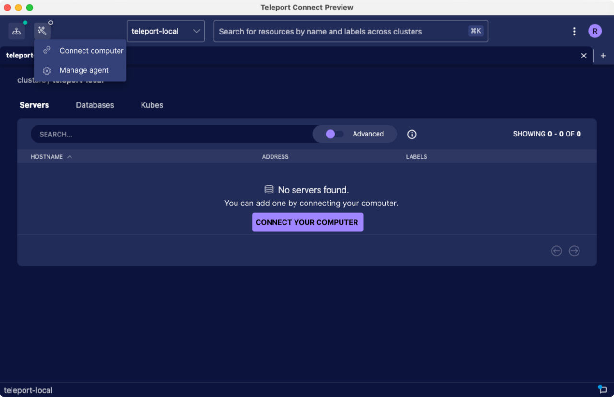
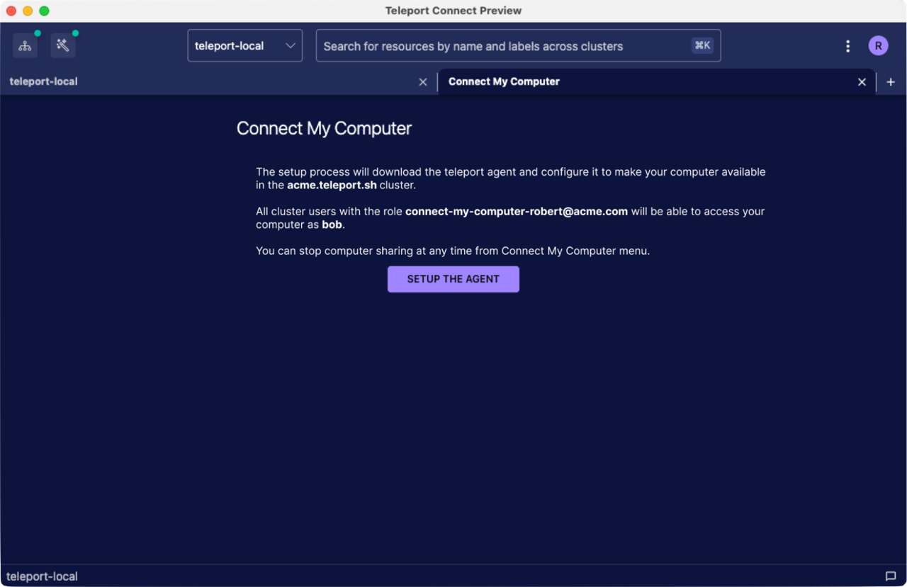
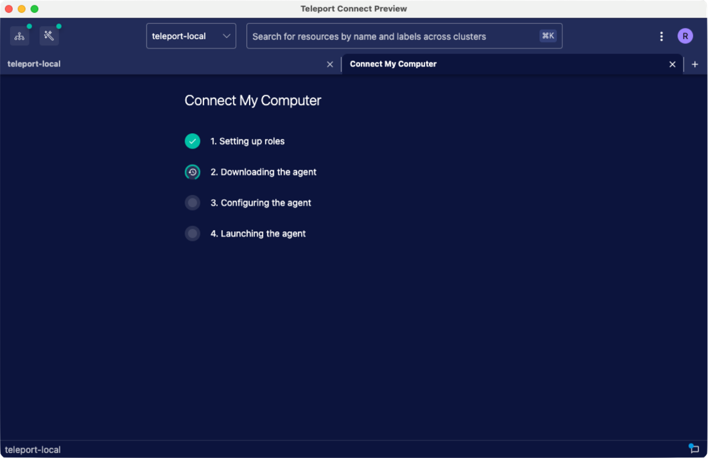
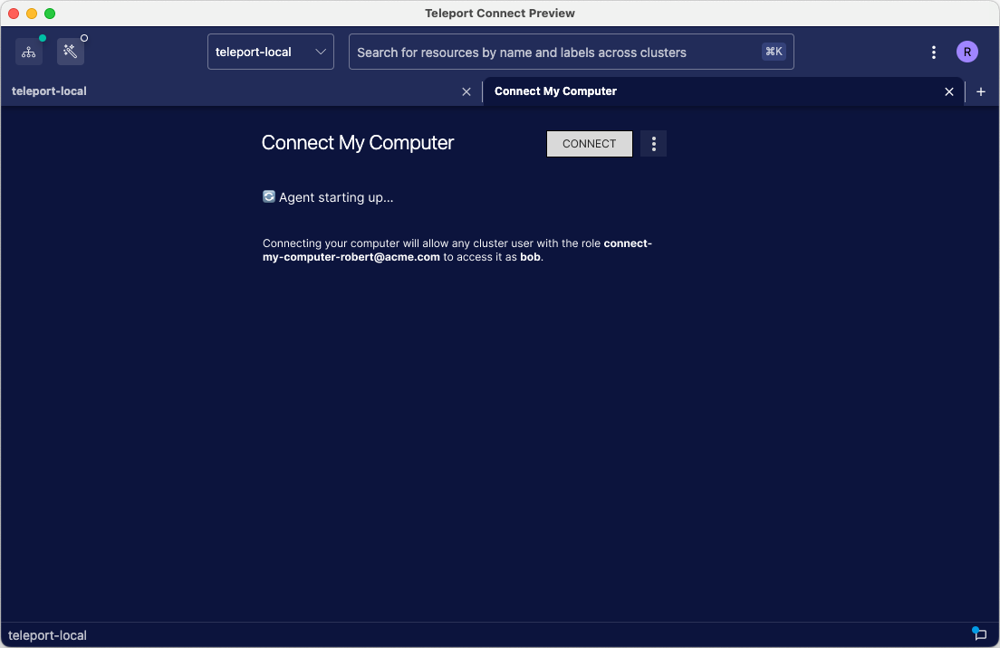

# RFD 133 - Connect My Computer

## Required Approvers

* Engineering: @zmb3
* Product: (@xinding33 || @klizhentas )
* Security: @jentfoo

## What

Connect My Computer (further abbreviated as CMC) enables the user of Teleport Connect to add the
device running Teleport Connect to the cluster as an SSH node.

The MVP achieves that by downloading the teleport binary, creating the relevant role and the join
token and then starting the agent from within the Electron app. Since the device is added as a
regular node, this poses a security concern of enabling any cluster user with sufficient permissions
to log into the device running Connect My Computer. This and other concerns are addressed in [the
Security section](#security).

The goal of this RFD is to gather feedback on the core of Connect My Computer, that is managing the
node agent running on the same device as Connect. Decisions on how to drive the users toward this
feature, such as adding a Discover tile or deep linking from the Web UI to Connect, are not covered
in this RFD and will be covered in future RFDs.

The wireframes included in the RFD are supposed to convey the general idea behind the UI. The setup
tab and the status tab are likely to stay in the same format. The top bar UI and the CTAs are likely
to change, although they are likely to receive no extra new features. If you have feedback on the UI
which goes beyond the general flow and towards the specifics, please leave it directly on [the
document in Figma](https://www.figma.com/file/jeKtOZrFsIVOtKH7yd8Xiy/Connect-My-Computer-UI?type=design).

## Why

The idea behind Connect My Computer is to reduce [the time to
magic](https://beneinstein.medium.com/min-time-to-magic-c938d9ea3473). By enabling the user to add a
new node to the cluster with just a few clicks, we hope to get them to the wow moment as quickly as
possible. We want to show that configuring and accessing the infrastructure with Teleport is fast
and easy. This will be further amplified by adding new features further down the line, such as
sharing sessions.

## Details

After signing into a cluster, which currently has no connected nodes, the user sees a
prompt in the server resource table encouraging them to use CMC (screenshot 1 below). Interacting
with the CTA opens a new tab which explains what happens during the setup and lets the user start
the setup (screenshot 2 below).





The setup requires no extra configuration. It sets up relevant roles, reissues the user cert to
refresh the roles, downloads the teleport binary, creates a join token, calls `teleport node
configure`, and then launches the agent by calling `teleport start`.




The setup steps are displayed in a similar fashion to Cloud account setup steps when the cluster is
being spun up for the first time. Once the setup is done, the setup tab automatically transitions to
showing the status of the agent.

Outside of the setup, the user is able to manage CMC through a dedicated top bar UI and a status
tab, similar to the gateway tab. The top bar UI allows the user to quickly start or stop the agent
and to open the status tab. The status tab displays errors related to starting or stopping the
agent. It also lets the user remove the agent completely.

### Initial setup

Let’s assume that we have a cluster at acme.teleport.sh with a user robert@acme.com.
robert@acme.com uses bob as the system username on their computer.

Once the user begins the setup, Connect performs all steps without further user interaction. Each
step can independently fail with an error message explaining what happened. The setup process can be
retried on error.

#### Setting up roles


The setup starts with the creation of the relevant role. If the user does not have permissions to
create and set roles, this step fails with an error message explaining which permissions are needed.

The role provides the necessary system login and access privileges. This way we have a single role
providing both rather than a role which provides just the login and then CMC having to depend on
another role, such as the built-in access, to provide access privileges.

The role is scoped per cluster user. Its name follows the format of
`connect-my-computer-<cluster-username>`. This is to accommodate multiple cluster users with the
same system username wanting to use CMC – their CMC roles will not conflict with each other.

For our example user, the YAML representation of the role looks like this:

```yaml
kind: role
version: v6
metadata:
  name: connect-my-computer-robert@acme.com
spec:
  allow:
  node_labels:
    teleport.dev/connect-my-computer/owner: robert@acme.com
  logins: [bob]
```

Connect creates this role and adds it to the current user. Since the user cert in Connect at the
time does not contain the new role, Connect has to refresh the roles to enable the user to connect
to the new node later on. This is done by calling `TeleportClient.ReissueUserCerts` with
`client.CertCacheDrop` as the second argument since [we expect the roles to change during the reissue](https://github.com/gravitational/teleport/blob/60830b0d8a7d5e253bd00b0967929ddb913b9b4a/lib/client/client.go#L290-L293).

#### Downloading the agent


To download the teleport binary, Connect needs to construct a URL of the tar.gz file with binaries.
The URL contains the OS, the architecture and the agent version. The OS and the architecture are
already kept in `RuntimeSettings`.

For Linux, the downloaded file is one of:
* `teleport-v<version>-linux-arm64-bin.tar.gz`
   * We don’t have Connect arm64 releases, but it will be useful for testing on VMs.
* `teleport-v<version>-linux-amd64-bin.tar.gz`

For macOS:
* `teleport-v<version>-darwin-arm64-bin.tar.gz`
* `teleport-v<version>-darwin-amd64-bin.tar.gz`

The MVP will not verify the checksum of the downloaded archive.

##### Agent versioning

The version of the agent that Connect uses always matches the version of Connect. If Connect detects
that the combination of the agent version and the cluster version breaks [the compatibility promise](https://goteleport.com/docs/faq/#version-compatibility),
it shows an error on the setup page and the status page informing about lack of support,
recommends an upgrade or a downgrade and prohibits the user from starting the agent.

As such, CMC is considered to be supported only when Connect is on the same major version or one
major version behind the cluster.

To check if the versions are compatible, Connect compares its version with the cluster version from
the `Ping` response.

This is how the UI behaves depending on the version differences:

* If the agent is on the same version as the cluster, everything's okay and Connect doesn't show any
  extra information.
* If the agent is two major versions or more _behind_ the cluster, Connect shows an error on the
  setup page and the status page explaining that servers do not support clients that are more than
  one major version behind, links to `https://goteleport.com/docs/faq/#version-compatibility`,
  recommends _an upgrade_ of Connect and prohibits the user from starting the agent.
   * Examples: Connect v11.0.0 & cluster v13.1.1, Connect v10.3.16 & cluster v12.0.1.
* If the agent is one major version or more _ahead of_ the cluster, Connect shows an error on the
  setup page and the status page explaining that servers do not support clients that are on a newer
  major version, links to `https://goteleport.com/docs/faq/#version-compatibility`, recommends _a
  downgrade_ of Connect and prohibits the user from starting the agent.
   * Examples: Connect v14.0.0 & cluster v13.1.1, Connect v10.3.16 & cluster v9.3.26.
* If the agent is on a supported client version that is older than the cluster version, Connect
  shows an informational message (on the status page only) recommending an upgrade, similar to [how
  the Web UI does it](https://github.com/gravitational/teleport/blob/12204708e71704a8073a6ee5d2b2358db23071c1/lib/auth/auth.go#L1101-L1103),
  and links to the download page.
   * Examples: Connect v13.1.0 & cluster v13.1.1, Connect v12.0.0 & cluster v13.1.0.

<details>
<summary>A matrix of Connect & cluster version considerations</summary>

|  | A. Newest cluster (V) | B. Cluster one major version behind (V-1) | C. Cluster two major versions behind (V-2) |
|---|---|---|---|
| 1. Newest Connect (V) | Same Connect and cluster version. | Servers do not support clients that are on a newer major version.<br>Technically Connect could use agent version V-1 and maintain backwards compatibility for that agent version. As in, Connect V would know how to run agent version V and V-1. However, it’s probably not worth doing that as technically cluster V-1 might not support Connect V at all. | Servers do not support clients that are on a newer major version. |
| 2. Connect one major version behind (V-1) | Servers support clients that are 1 major version behind. Connect could use agent version V-1 and expect the APIs of the teleport bin to remain the same and that the agent will be able to Connect to the cluster.<br>Connect cannot use agent version V because the API of the agent might have changed and Connect V-1 is not aware of the changes. | Same Connect and cluster version. | Servers do not support clients that are on a newer major version. |
| 3. Connect two major versions behind (V-2) | The cluster V might not accept an agent V-2. Connect V-2 cannot use agent V as there might be API changes that Connect V-2 is not aware of. | Same as A2 (cluster V, Connect V-1) | Same Connect and cluster version. |

</details>

##### Starting the download

The archive with the binaries is downloaded to a temporary directory. After a successful download,
[the agent is extracted](https://stackoverflow.com/questions/19978452/how-to-extract-single-file-from-tar-gz-archive-using-node-js)
with [tar-stream](https://www.npmjs.com/package/tar-stream) and moved to a more permanent location
described in the next section.

The download is done by using built-in Electron APIs:

* [`contents.downloadURL`](https://www.electronjs.org/docs/latest/api/web-contents#contentsdownloadurlurl) triggers a file download for the given URL without navigating to the page.
* [`DownloadItem`](https://www.electronjs.org/docs/latest/api/download-item) enables us to automatically set the download path and register progress callbacks. 
* [Progress bars](https://www.electronjs.org/docs/latest/tutorial/progress-bar) show the download progress on the app icon.

`contents.downloadURL` merely triggers the download. To access `DownloadItem`, we have to listen to
the `will-download` event of `webContents.session`. We should encapsulate those APIs within a single
function to avoid the downloading logic being spread across files and listeners.

We have to be mindful about keeping the preload APIs as constrained as possible. The renderer should
not get the ability to download an arbitrary file to an arbitrary path. If possible, the download
process should be totally encapsulated from the renderer, with the renderer merely signaling the
intent to start the agent and the main process handling everything else.

##### Storing the node agent

The binary is stored in `~/Library/Caches/Teleport Connect` on macOS and `~/.cache/Teleport Connect`
on Linux. It is extracted to `teleport/teleport` in that directory. Since the agent version is bound
to the Connect version, we can always store just a single version of the agent.

As the parent directory can be cleared by the OS or the user, before each launch Connect is going to
check if the agent exists and download it automatically if not.

So far we’ve been storing all data in Electron’s `userData` which is `~/Library/Application Support`
on macOS. [That directory is not suited for storing large files](https://www.electronjs.org/docs/latest/api/app#appgetpathname) as it might be backed up to
cloud storage.

On top of that, the agent binary is something that can be easily recreated if needed by downloading
it again. After reading Apple Developer docs ([Optimizing Your App’s Data for iCloud Backup](https://developer.apple.com/documentation/foundation/optimizing_your_app_s_data_for_icloud_backup/#3928528)
and archived [File System Programming Guide](https://developer.apple.com/library/archive/documentation/FileManagement/Conceptual/FileSystemProgrammingGuide/FileSystemOverview/FileSystemOverview.html#//apple_ref/doc/uid/TP40010672-CH2-SW4)),
we’ve decided that `~/Library/Caches` is a suitable directory for storing the agent.

Out of the box, Electron doesn’t expose `~/Library/Caches` through its `app.getPath` function,
unlike `~/Library/Application Support` which is retrievable by calling `app.getPath('userData')`.

A good candidate for that would be `sessionData` which the docs describe as “the directory for
storing data generated by Session, such as localStorage, cookies, disk cache, downloaded
dictionaries, network state, devtools files.” Unfortunately, for legacy reasons `sessionData` points
to the same directory as `userData`. [The docs recommend changing the location](https://www.electronjs.org/docs/latest/api/app#appgetpathname) of this directory to
another location.

There’s [an outstanding issue about Electron storing its caches in the wrong location](https://github.com/electron/electron/issues/8124). Based on the Apple Developer docs and
the discussion under that issue, changing the location of `sessionData` to `~/Library/Caches` on
macOS and `~/.cache` on Linux seems like a reasonable thing to do. As we have not been using cookies
or localStorage thus far it should be safe to do so with no risk of losing any user-generated state.

On Linux, the exact path to the cache should be resolved by first looking up `$XDG_CACHE_HOME`. If
the env var doesn't exist, we should default to `$HOME/.cache`.

#### Generating the config file

##### Join token

With the binary ready, Connect needs a join token before it can execute `teleport node configure`.
Since the MVP supports only our Cloud, we can use the `CreateToken` RPC of `ProvisioningService`,
similar to [how the Web UI does it for the join script](https://github.com/gravitational/teleport/blob/55190d0a1cde31c813c4ea17f7e9335c77af210c/lib/web/join_tokens.go#L161-L187).
In theory, tctl could be used to generate the token. However, sending an RPC is easier than spawning
tctl. Even more importantly, using the RPC guarantees that we will get compile-time errors when the
API changes.

The token is created with a TTL of 5 minutes. In the absence of [single-use tokens](https://github.com/gravitational/teleport/issues/7133), Connect will attempt to remove the
token with the `DeleteToken` RPC after a successful join. As the permission to remove tokens is not
necessarily tied to the ability to create tokens, we will log and ignore any errors from this call
and depend on the short TTL in that scenario.


##### Config file and data directory location

There’s three things Connect needs to supply to `teleport node configure` that we haven’t talked
about yet. The first one is the node label which needs to match the label from the role. As shown in
the YAML example in the “Setting up roles” section, the node label follows the format of

```
teleport.dev/connect-my-computer/owner = <cluster-username>
```

The other two things are the output path for the config file and the data directory of the agent.
Both will be stored under the directory `<userData>/agents/<profile></code>`, e.g.
`~/Library/Application Support/Teleport Connect/agents/acme.teleport.sh`.

We will not provide the CA pin in the config file. In the MVP, agent connections to the auth server
will be tunneled through the proxy, so the CA pin is not absolutely necessary. Not using the CA pin
is also more convenient as we will not have to handle updating the pin after a CA rotation.

The full `teleport node configure` call is:

```
teleport node configure --output=<userData>/agents/<profile>/config.yaml
--data-dir=<userData>/agents/<profile>/data
--proxy=<proxy>
--token=<join-token>
```


##### Alternatives

In the future, we could consider adding a flag for `teleport start` which makes it read the config
from standard input, [as suggested by Noah Stride](https://gravitational.slack.com/archives/C0DF0TPMY/p1686663198979029?thread_ts=1686646362.307949&cid=C0DF0TPMY).
This approach has a number of benefits:


* It completely eliminates the need to call `teleport node configure`.
* It minimizes the API surface of `teleport start` used by Connect, making the interaction between
  Connect and the agent binary less brittle.
* It avoids storing the join token on disk.
* It allows us to easily change the location of the log directory (as noted in the “Log rotation”
  section).
* It makes it easier to avoid breaking changes.
    * If a new agent version requires additional config fields, it’s no issue because the config is
      recreated from scratch at each launch.

#### Joining the cluster

Once the config file is ready, Connect launches the agent for the first time. The success and
failure criteria of this step are the same as those of subsequent launches. Both are described in
the “Launching the agent” section below.


#### Ensuring that the setup can be restarted

The user must be able to restart the setup process as each step can independently fail. All steps
should be prepared to run more than once.

* Setting up the role
    * Connect must not overwrite the role if it already exists.
       * This is in order to avoid overwriting any changes to the role that the user could have made
         manually.
    * Connect must add the current system username if the role already exists but the current system
      username is not included in allowed logins.
       * This is to accommodate the same cluster user using Connect My Computer on two different
         devices using different system usernames. Since there's only one role per cluster user,
         both usernames needs to be added to the role.
    * Connect must skip calling `UpdateUser` if the user already has the role.
* Downloading the agent
    * Connect must skip redownloading the binary if it exists in the sessionData directory.
* Generating the config file
    * The join token can be just created again since it will have a short TTL.
    * `teleport node configure` will fail if the config file already exists, so Connect has to make
      sure the config file doesn’t exist before calling the command.
* Joining the cluster
    * This step doesn’t require any extra accommodations.

### Launching the agent

After the setup is done, Connect launches the agent process with the following command:

```
teleport start --config=<userData>/agents/<profile>/config.yaml
```

At this point, all four steps from the setup are done. Connect waits for half a second before
navigating the user away from the setup tab to the status tab pictured below. If this was done
immediately after completing the last step, the user would have no time to notice that all four
steps have completed.

The status tab and the top bar UI show loading states until we determine that the agent has
successfully launched, as described in the subsection below.




#### Determining a successful launch

To ensure that the agent has successfully connected to the cluster after starting the process,
Connect polls the cluster for the existence of the node:

1. After starting the process, the Electron app sends an RPC to tshd, pointing at the location of
   the data dir of the agent.
2. tshd then waits for the host_uuid file to be created in that location.
3. After obtaining the UUID, it begins polling the cluster every 5 seconds for a node with the
   specific UUID.

The RPC ends as soon as tshd finds the node on the cluster, if the host_uuid file is not found
within 15 seconds, or if the node is not found on the cluster within 15 seconds after obtaining the
UUID from the file.

The timeouts have to account for the fact that after upgrading Connect with CMC already set up,
macOS is likely to scan the teleport binary which means that the agent will not start immediately
after spawning the process.

The advantage of doing this on the tshd side is that Go APIs for orchestrating such operations are
much more convenient than what Node.js offers.


##### Alternatives to polling

We considered using [a resource watcher](https://github.com/gravitational/teleport/blob/53b0118cff73fd5e9788a397d3b8a0aadc75d63a/lib/services/fanout.go#L76-L77)
instead of polling. However, lack of documentation on the semantics of the watcher coupled with no
existing `WatchKind` filter for nodes made polling more appealing for the MVP.


### Agent lifecycle

After the setup is done, the user can stop and start the agent from the top bar UI and the status
tab. Unless the user manually stops the agent before closing the app, Connect will automatically
start CMC on the next launch.

The subsequent launches of the agent follow a similar logic to that of the agent launch during the
setup. The only difference is that on subsequent launches Connect doesn’t have to generate the
config file and the join token. Instead, it can verify that the agent binary exists, verify the
versions and then attempt to launch the agent.

After launching the agent, Connect flips a per-workspace flag `autoStart` to `true`. This means that
if the user closes the app while the agent is running, on the next app launch Connect is going to
automatically start the agent on a successful login to the cluster. The flag is flipped to `false`
if the user explicitly stops the agent through the UI – just closing the app will not change the
flag state.

#### Ensuring the agent is killed together with the Electron app

It might happen that for whatever reason, the Electron app is killed. Without any further
modifications, this would make the agent continue to run and breach one of the principles described
in the Security section of this RFD – the lifecycle of the agent should be tied to the lifecycle of
the app.

To avoid that, we are going to extend the teleport binary so that the agent accepts the PID of the
parent process through a hidden flag. The agent then periodically checks if its parent PID matches
the parent PID passed through the flag.

When the Electron app exits without stopping the agent first, [the OS re-parents the agent](https://en.wikipedia.org/wiki/Orphan_process)
and thus the parent PID of the agent changes. The agent detects this change and shuts itself down.

Here's [the general idea behind the implementation](https://stackoverflow.com/a/23587108/742872)
along with a suggestion on how to make this work on Windows if we ever decide to bring Connect My
Computer there.

### Agent maintenance

#### Keeping the agent up to date

Upgrading the agent is done by upgrading Connect. On the first agent launch after a Connect upgrade,
Connect sees that the agent matching its version is missing and downloads a matching version of the
agent. This follows from the behavior described in the “Downloading the agent” section.

#### Log rotation

The MVP is not going to perform any extra log rotation beyond what the Teleport agent offers out of
the box which is creating a new log file every 24 hours. The logs are thus stored in the same
directory as the data directory of the agent and are removed together with the agent.

In the future we might consider adjusting `teleport node configure` so that `teleport.log.output`
can be set from the CLI.

### Removing the agent

The agent can be removed completely by clicking on the “Remove agent” button on the status tab or
partially by logging out.

#### By clicking “Remove agent” on the status tab

This removes the config and the data dir together with any CMC-related app state and an attempt is
made to remove the CMC role from the cluster. The agent binary is kept in the sessionData folder to
enable a scenario where the user wants to remove the agent from one cluster but wants to keep using
it in another cluster.

Removing the agent performs the following actions:

1. Stop the agent process for the given cluster.
2. Capture the UUID of the node for use in subsequent steps.
3. Remove the agent data at `<userData>/agents/<profile>`.
4. Call [`DeleteNode`](https://github.com/gravitational/teleport/blob/7e174f9aaf17d0f3ea08740aac42da49eb7ec8da/api/client/client.go#L2044)
   with the node UUID to remove the node from the cluster.

    The request may fail if the user does not have permission to remove nodes. This will not be
    considered a fatal error. Instead, at the end of the agent removal process Connect will explain
    to the user that the node can still be visible for a few minutes until it is purged from the
    cluster cache. This should help prevent user confusion regarding the continued visibility of the
    CMC node, as they may not be fully aware of how the cluster cache works.

5. Remove CMC-related app state.

    If the user made a connection to the CMC node, in the top left in the connections list they are
    going to see a connection for that node. Since the node will no longer be accessible, it doesn’t
    make sense to keep it around.

    Connect also has to remove the `autoStart` flag.


#### By logging out

On logout, we have to remove the config file and the data dir. Imagine a situation where the user
logs in as the cluster user foo, sets up CMC, then logs out and logs in as bar. If we kept the
config file and the data dir on logout, the user would now be logged in as bar with CMC configured
for foo.

To avoid conflicts and keep things simple, the config file and the data dir will be treated as any
other piece of local state that is bound to a specific profile and thus will be removed on logout.

Any workspace-specific app state related to CMC (such as the `autoStart` flag) will be wiped out on
logout as well.

The downside of not doing any extra cleanup on logout is that if the user runs CMC, then logs out
and immediately logs back in, the cache will still contain the now gone node. This is a rough edge
we’re willing to accept in the MVP over adding more complexity to handle this specific scenario.

### Availability of the feature

The feature is supported only on macOS and Linux because the Teleport SSH agent does not work on
Windows.

### Security

#### Access to the node

The biggest concern is of course that Connect My Computer enables the user to grant access to their
own machine as the system user that they regularly use, potentially exposing sensitive data. Since
the device is treated as a regular node, any cluster user with sufficient permissions (editing roles
and role lists) is able to gain access to the node, unbeknowst to the user running Connect My
Computer.

This is not a concern when connecting a regular SSH server to the cluster, as usually those server
nodes are understood as shared computers.

Connect My Computer is targeted at hobbyists, people who just set up their Cloud cluster. The UI for
Connect My Computer will not be accessible if the user doesn't have permission to create join
tokens. As long as the administrators of more populated clusters follow the principle of least
privilege, Connect My Computer won't be available to users who are not able to add new nodes to the
cluster. The UI of Connect My Computer should also make it absolutely clear as to what is going to
happen. It won't be a single button that the user can click by mistake.

Accordingly, we assume that the MVP of Connect My Computer is going to be used in highly trusted
environments. Most further developments of this feature will require reinforcing the security of it.
[Mike Jensen composed a list of potential ideas](https://github.com/gravitational/teleport/pull/27815#discussion_r1238756710) as to how this could be achieved.

We did consider using some kind of an ephemeral user account for the agent. However, eventually we
want to allow the user to share a link to a shell session on their device, ala
[Teleconsole](https://github.com/gravitational/teleconsole). Think of a dev inviting a teammate to
debug an issue with their dev setup. This feature would be substantially less useful if instead of
sharing a session of your regular system user, you had to share a session from some ephemeral or
otherwise restricted user account.

From the point of view of the cluster, a node connected through Connect My Computer is just a
regular node. There's no way to enforce that only a certain cluster user can access it. By
default, [the role](#setting-up-roles) is added only to the user running Connect My Computer.
However, anyone with the ability to change user roles will be able to add the role to any other
cluster user, enabling that user to connect to the node made available through Connect My Computer.

#### Access to UI and autostart

We already mentioned how the UI of Connect My Computer is accessible only if the user has permission
to create join tokens. There's another principle we want to enforce: if the agent is running, the
user must be able to stop the agent without being forced to close the app.

Imagine a scenario where:

1) The UI controls of CMC are gated behind being logged in to a cluster.
2) The agent is automatically started on app launch.

With this in place, it'd be possible for the user to lose access to the cluster (e.g. losing their
MFA device) while the agent is still sharing their computer with the cluster.

As such, tying the autostart of the agent to being logged in to the cluster gives the user more
control while also being easier to solve on the UI level – if the user can't access the UI to
control the agent, the agent should not be running.

##### systemd and similar tools

The third principle is that since the feature allows access to _your_ device as _your_ system user,
the agent should not run unattended. The moment you close Connect, the agent should stop.

This is the reason why we don't use a tool like systemd to manage the lifecycle of the agent.
Instead, the lifecycle of the agent is strictly tied to the lifecycle of the Electron app.

### Detecting breaking changes

Many different parts of our infrastructure and codebase are involved in making CMC work. As such, we
want to minimize the risk of devs inadvertently breaking CMC without getting quick feedback about
it.

When possible, CMC should use RPCs that call Go code directly. Any values that can be read from
constants in Go code should be provided from tshd to the Electron app rather than being hardcoded in
the Electron app. This will allow us to catch breaking changes at the compile time.

There are places where using hardcoded values or commands is unavoidable:

* Names of the artifacts that Connect downloads.
* `teleport node configure` command.
* `teleport start` command.

Connect always launches an agent which matches Connect’s own version. Still, there’s a chance that a
new major version will change some of the above items. To make sure that the entire flow still
works, we will add new items to the test plan.

On top of that, we are going to add tests in `tool/teleport` to detect breaking changes made to the
CLI APIs used by Connect.

#### Alternatives

Instead of adding tests to check if the teleport binary correctly parses args passed by Connect to
`teleport node configure` and `teleport start`, we could add hidden commands [as suggested by Krzysztof Skrzętnicki](https://gravitational.slack.com/archives/C0DF0TPMY/p1686649107027769?thread_ts=1686646362.307949&cid=C0DF0TPMY).
This would make the API of those commands independent of the API of commands meant for general use
and mark them as special cases not to be tampered with.

However, the API of `teleport start` and `teleport configure` is already partitioned enough with
special cases for certain types of agents that adding another version of them just for Connect
doesn’t seem enticing enough.

Noah’s suggestion from the “Generating the config file” section of having a flag for `teleport
start` which makes it read the config from the standard input would significantly reduce the API
surface and make the interaction between Connect and the agent binary less brittle.

Another alternative to basic kingpin parser tests would be end to end tests for the whole feature.
At the moment, the biggest hurdle is that we don’t have an infrastructure for this. We might
consider adding those in the future after covering some basic flows in the app with e2e tests,
especially since CMC e2e tests would be potentially even more flaky than regular e2e because they
would involve not only the Electron app and the cluster under tests, but also the infrastructure
behind our downloads for example.

### Implementation remarks

tshd RPCs should be oriented towards CMC instead of encapsulating very narrow actions. For example:

* Instead of a generic `CreateToken` RPC, tshd service should have an RPC which creates a token
  suited specifically for the needs of CMC.
* Instead of a generic `CreateRole` RPC, tshd service should have an RPC which receives the cluster
  user running CMC along with the system user and creates a CMC-specific role.

The more concrete the API is, the less exploitable it is.

### Telemetry

Connect sends two events:

* `connect.connectMyComputer.setup`
   * Emitted when the setup flow is finished. It tells us whether the configuration was successful,
     and if not, which step failed.
   * Event properties:
      * `tp.cluster_name: string` (anonymized)
      * `tp.user_name: string` (anonymized)
      * `connect.setup.success: boolean`
      * `connect.setup.failed_step: string  `
* `connect.connectMyComputer.agentStart`
   * Emitted when the agent is started. It tells us if the feature is actually being used.
   * Event properties:
      * `tp.cluster_name: string (anonymized`)
      * `tp.user_name: string (anonymized)`
