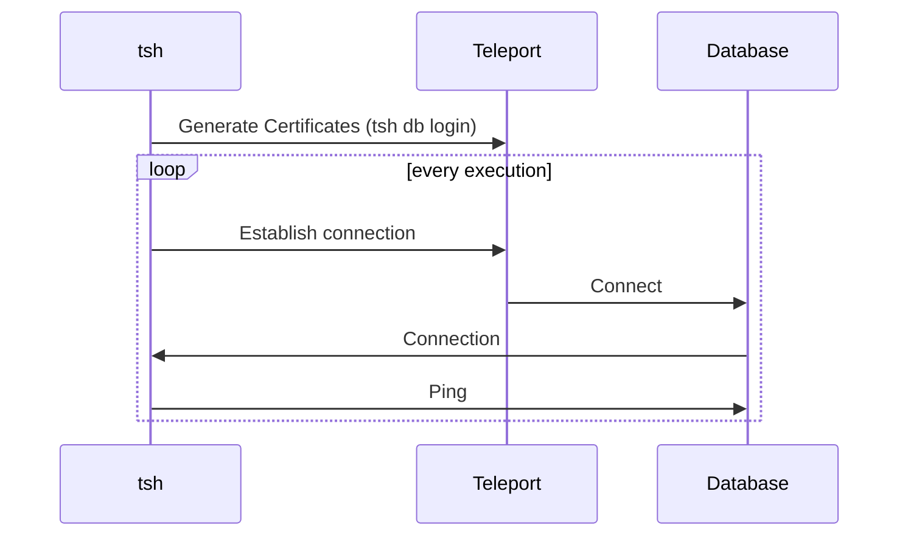

# RFD 0141 - `tsh bench` subcommands for databases

## Required Approvals

* Engineering: @smallinsky && @r0mant
* Product: @xinding33 || @klizhentas
* Security: @reedloden

## What
Introduce new subcommands, for benchmarking database access, which will work
similarly to `tsh bench` for SSH and Kubernetes benchmarking.

This RFD initial focus is on covering PostgreSQL and MySQL protocols.

## Why
The team is working towards understanding performance issues with database
access. This built-in tool will be used to generate database access load and
produce some client-side metrics that will be used to understand overall
performance better.

In addition, the command will also have a mode of direct running the load to the
databases (without Teleport proxying them). The team can use this to compare
Teleport performance with direct database access.

## Prior art

### `tsh bench` subcommands
The `tsh` already has commands for performing benchmarks. Those rely on the
structure defined at `lib/benchmark/benchmark.go`. It defines a small framework
to define benchmarks. By following it, we can rely on the tools already used on
the SSH and Kubernetes benchmarks, such as reports.

To help readers better understand how the database benchmark will be organized,
here is a summary of it:
* Benchmark suites: Implements a function that generates workload functions.
  The suite is called before the benchmark starts and returns a workload function.
  It has access to the Teleport Client.
* Workload function: Functions that will be repeatedly executed to grab data.
  Since the suite generates it, it can use information from the suite function.
  For example, on the SSH benchmark, the servers list used to select the server
  where the command will be executed is fetched on the suite function, and the
  workload function only connects to it.

#### Common options
The benchmark structure already supports common flags to parametrize the test
execution:
- `--rate`: Control how many workload functions are executed per second. For
  example, it can control how many connections will be sent to the target
  database per second.
- `--duration`: Defines for how long the test will be executed.

#### Results
The benchmark commands follow a standardized result output. There is also an
option to export the test results to a more detailed version using the `--export`
flag.

```code
$ tsh bench ...
* Requests originated: 9
* Requests failed: 0

Histogram

Percentile Response Duration
---------- -----------------
25         123 ms
50         125 ms
75         129 ms
90         130 ms
95         130 ms
99         130 ms
100        130 ms
```

### [`mysqlslap`](https://dev.mysql.com/doc/refman/5.7/en/mysqlslap.html)

> `mysqlslap` is a diagnostic program designed to emulate client load for a
MySQL server and to report the timing of each stage. It works as if multiple
clients are accessing the server.

It has to working formats:
* Auto-generates database tables and queries. When used like this, it has flags
  to customize table columns (set how many columns there will be) and choose the
  type of queries it will execute during the benchmark (for example, `read` will
  only execute SELECT queries).
* Custom queries. It has a parameter to setup a table and insert necessary data.
  And executes the custom query provided by the user.

## Details
The database subcommands will be divided per protocol. This gives more
flexibility for each protocol to require their arguments and flags.

The "root" command for each protocol will execute the following:
* Starts a connection with the database (using local proxy);
* Issue a ping-like query to ensure the connection is working. This also covers
  drivers that connect only when queries are executed.
* Closes the connection.

User certificate generation and local proxy start will not affect the final
results. The connections will be issued to a single local proxy, reducing the
resources used locally.

The metrics generated by those subcommands will be restricted to raw end-to-end
timings (without any breakdown). It must be used alongside backend metrics to
have full detailed information on the service behavior.



### Commands
Both PostgreSQL and MySQL will have the same command arguments and flags.

```code
tsh bench postgres [--db-user=] [--db-name=] [--uri] [database]
```

```code
tsh bench mysql [--db-user=] [--db-name=] [--uri] [database]
```

| Flag        | Description |
| ----------- | ----------- |
| `--db-user` | Database user used to connect to the target database. The user must have enough permissions on the database to execute all the benchmark queries. |
| `--db-name` | Database name where benchmark queries will be executed. Depending on the database protocol, this isn't required. |
| `--uri`     | Direct database access URI. When provided, the benchmark will issue connections directly to this database, and no Teleport is involved in the testing. It must contain all the connection information, including authentication credentials. The contents from --db-user and --db-name will be ignored when provided. |
| `database`  | Teleport target database name. Available databases can be retrieved by running `tsh db ls`. If not provided, the `--uri` flag (for direct database connection) must be present. | 

Note: The `--rate` common flag will indicate how many connections per second will be
established.

**Examples:**
```bash
# Executes 25 connections per second during 10 seconds without errors but also
# without meeting the target requests.
$ tsh bench postgres --rate=25 --duration=10s --db-user=postgres --db-name=postgres postgres-dev

* Requests originated: 88
* Requests failed: 0

Histogram

Percentile Response Duration
---------- -----------------
25         1346 ms
50         3535 ms
75         5259 ms
90         5847 ms
95         6663 ms
99         7271 ms
100        7311 ms

# Executes 100 connections per second during 30 seconds with errors (only the
# last error is shown).
$ tsh bench postgres --rate 100 --duration 30s --db-user=postgres --db-name=postgres postgres-dev

* Requests originated: 1586
* Requests failed: 30
* Last error: failed to connect to `host=localhost user=postgres database=`: dial error (dial tcp [::1]:5433: connect: connection refused)

Histogram

Percentile Response Duration
---------- -----------------
25         3773 ms
50         4639 ms
75         5263 ms
90         6243 ms
95         6775 ms
99         10567 ms
100        22783 ms
```

### Direct database connections
Directly targeting databases (not through Teleport) can be used by developers
quickly to generate baseline measures that can be used to determine how much
overhead Teleport adds compared to raw database connections.

To avoid adding multiple flags to cover the scenarios, there will be a single
`--uri` flag, which will receive the database URI with all options included.
This way, users can choose the authentication method that will be used.

By providing this flag, the `tsh` will connect directly to the database without
using any Teleport certificate.

**Example:**
```code
$ tsh bench postgres --uri "postgres://hello@localhost:5432"
```

### Implementation
The suite will use an interface (`DatabaseClient`) to interact with databases.
Decoupling it from the suites will increase reusability and also make it quicker
to enable more database protocols to the benchmark tests.

This interface is returned after connecting to the database. Each protocol will
define its connection flow respecting the `ConnectFunc`.

```go
// DatabaseConnectionConfig contains all information necessary to establish a
// new database connection.
type DatabaseConnectionConfig struct {
	// URI direct database connection URI.
	URI string
	// Username database username the connection should use.
	Username string
	// Database database name where the connection should point to.
	Database string
	// ProxyAddress Teleport database proxy address.
	ProxyAddress string
	// TLSConfig TLS configuration containing Teleport CA and database
	// certificates.
	TLSConfig *tls.Config
}

// ConnectFunc is a function that establishes a database connection and returns
// the DatabaseClient.
type ConnectFunc func(ctx context.Context, config *DatabaseConnectionConfig) (DatabaseClient, error)

// DatabaseClient represents a database connection.
type DatabaseClient interface {
	// Ping runs a command on the database to ensure the connection is alive.
	Ping(ctx context.Context) error
	// Close closes the connection.
	Close(ctx context.Context) error
}
```

The logic to generate certificates and start the local proxy will be shared
across the database subcommands.

## Security

### Bypass MFA or access checker
The command will use the same flow used by `tsh db login` to issue certificates,
including support to MFA. The main difference is that the issue credentials
won't be persisted on disk.

### Malicious URI on the direct database connection
Users may try to send malicious URI when connecting directly to databases.
Teleport doesn't validate the input provided; it is passed directly to the
database client responsible for validating it. Client execution is entirely
done locally. Nothing is sent to the Teleport server.

## Future work

### Run benchmark on multiple databases
As in the first versions, benchmarks are executed in the specified database.
Providing a predicate query enables users to select databases to execute
the benchmarks.

```code
$ tsh bench postgres --query 'labels["env"] == "prod"'
```

### Custom query execution
It will work similarly to the connection suite. The only difference is that
instead of executing a ping-like query, `tsh` will execute a user-provided query.
This allows benchmarking of more scenarios affected by what is performed on the
connection. For example, developers can benchmark how database access with large
queries, generating workload for packet parsing and audit logging (for databases
that support it).