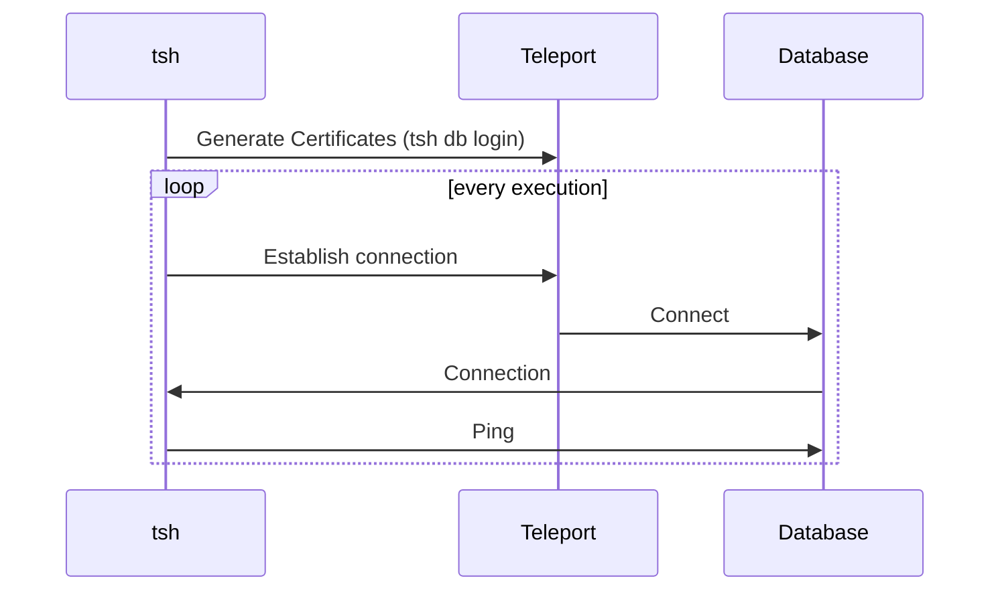
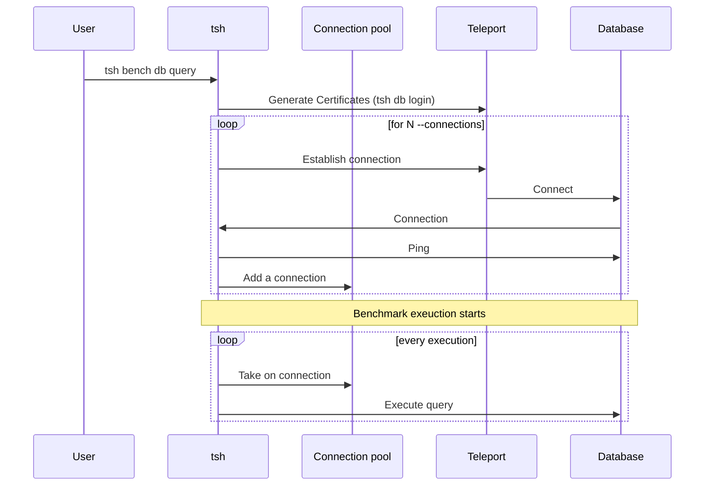
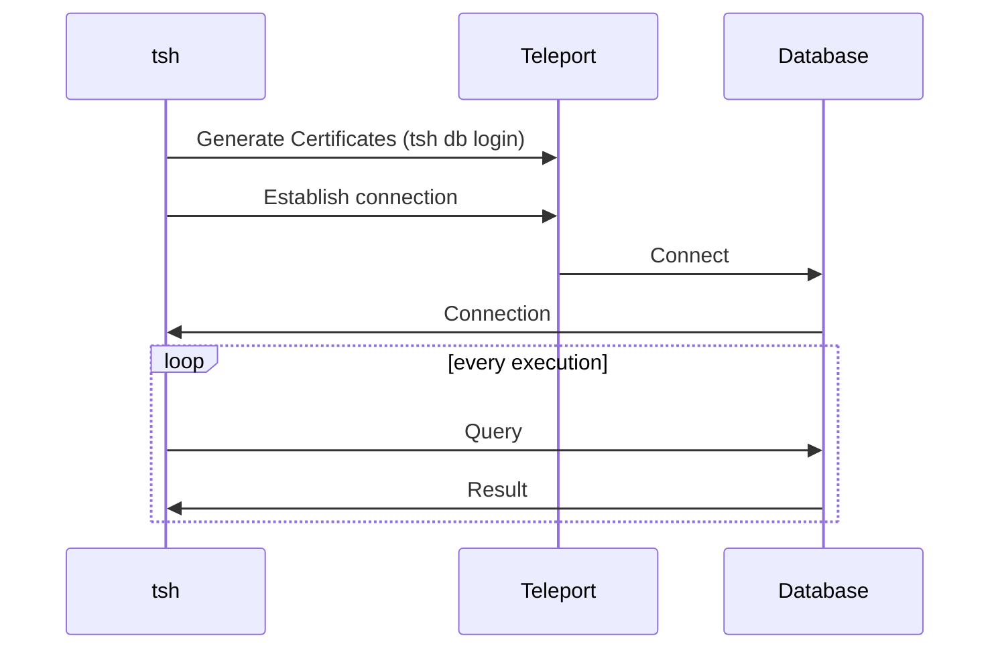

# RFD xxxx - tsh bench db

## Required Approvals

* Engineering: @smallinsky && @r0mant
* Product: @xinding33 || @klizhentas
* Security: @reedloden

## What
Introduce a new subcommand, `tsh bench db`, which will work similarly to
`tsh bench` for SSH and Kubernetes benchmarking but for database access.

## Why
The team is working towards understanding performance issues with database
access. This built-in tool will be used to generate database access load and
produce some client-side metrics that will be used to understand overall
performance better.

In addition, the command will also have a mode of direct running the load to the
databases (without Teleport proxying them). The team can use this to compare
Teleport performance with direct database access.

## Prior art

### `tsh bench` subcommands
The `tsh` already has commands for performing benchmarks. Those rely on the
structure defined at `lib/benchmark/benchmark.go`. It defines a small framework
to define benchmarks. By following it, we can rely on the tools already used on
the SSH and Kubernetes benchmarks, such as reports.

To help readers better understand how the database benchmark will be organized,
here is a summary of it:
* Benchmark suites: Implements a function that generates workload functions.
  The suite is called before the benchmark starts and returns a workload function. It has access to the Teleport Client.
* Workload function: Functions that will be repeatedly executed to grab data.
  Since the suite generates it, it can use information from the suite function.
  For example, on the SSH benchmark, the servers list used to select the server
  where the command will be executed is fetched on the suite function, and the
  workload function only connects to it.

#### Common options
The benchmark structure already supports common flags to parametrize the test
execution:
- `--rate`: Control how many workload functions are executed per second. For
  example, it can control how many connections will be sent to the target
  database per second.
- `--duration`: Defines for how long the test will be executed.

#### Results
The benchmark commands follow a standardized result output. There is also an
option to export the test results to a more detailed version using the `--export`
flag.

```code
$ tsh bench ...
* Requests originated: 9
* Requests failed: 0

Histogram

Percentile Response Duration
---------- -----------------
25         123 ms
50         125 ms
75         129 ms
90         130 ms
95         130 ms
99         130 ms
100        130 ms
```

### [`mysqlslap`](https://dev.mysql.com/doc/refman/5.7/en/mysqlslap.html)

> `mysqlslap` is a diagnostic program designed to emulate client load for a
MySQL server and to report the timing of each stage. It works as if multiple
clients are accessing the server.

It has to working formats:
* Auto-generates database tables and queries. When used like this, it has flags
  to customize table columns (set how many columns there will be) and choose the
  type of queries it will execute during the benchmark (for example, `read` will
  only execute SELECT queries).
* Custom queries. It has a parameter to setup a table and insert necessary data.
  And executes the custom query provided by the user.

## Details
The database flow areas will be split into isolated suites, allowing developers
to test and validate them individually.

The suites will use an interface (`DatabaseClient`) to interact with databases.
Decoupling it from the suites will increase reusability and also make it quicker
to enable more database protocols to the benchmark tests.

This interface is returned after connecting to the database. Each protocol will
define its connection flow respecting the `ConnectFunc`.

```go
// DatabaseConnectionConfig contains all information necessary to establish a
// new database connection.
type DatabaseConnectionConfig struct {
	// Protocol database protocol.
	Protocol string
	// URI direct database connection URI.
	URI string
	// Username database username the connection should use.
	Username string
	// Database database name where the connection should point to.
	Database string
	// ProxyAddress Teleport database proxy address.
	ProxyAddress string
	// TLSConfig TLS configuration containing Teleport CA and database
	// certificates.
	TLSConfig *tls.Config
}

// ConnectFunc is a function that establishes a database connection and returns
// the DatabaseClient.
type ConnectFunc func(ctx context.Context, config *DatabaseConnectionConfig) (DatabaseClient, error)

// DatabaseClient represents a database connection.
type DatabaseClient interface {
	// Ping runs a command on the database to ensure the connection is alive.
	Ping(ctx context.Context) error
	// Close closes the connection.
	Close(ctx context.Context) error
	// Query runs a query on the database.
	Query(ctx context.Context, query string) error
}
```

#### Connection establishment
The suite will test and measure the connect flow. To ensure the connection is
established, it will also perform a "ping query" (for example, on the PostgreSQL
database, it will be a `SELECT 1;` query). No other queries or data load will be
performed, meaning there are no prerequisites to execute it.

For databases that perform access checking on the connection flow, this suite
can also be used to test and validate them.

```code
tsh bench db connect [--db-user=] [--db-name=] [--uri] [database]
```

| Flag        | Description |
| ----------- | ----------- |
| `--db-user` | Database user used to connect to the target database. The user must have enough permissions on the database to execute all the benchmark queries. |
| `--db-name` | Database name where benchmark queries will be executed. Depending on the database protocol, this isn't required. |
| `--uri`     | Direct database access URI. When provided, the benchmark will issue connections directly to this database, and no Teleport is involved in the testing. It must contain all the connection information, including authentication credentials. The contents from --db-user and --db-name will be ignored when provided. |
| `database`  | Teleport target database name. Available databases can be retrieved by running `tsh db ls`. If not provided, the `--uri` flag (for direct database connection) must be present. | 

Note: The `--rate` common flag will indicate how many connections per second will be
established.

**Example:**
```code
$ tsh bench db connect --db-user=postgres --db-name=postgres postgres-dev
```



#### Query
This suite will test and measure query executions only. Internally it will use a
connection pool that will be initialized before it starts, meaning that the
connection time will not be counted on the benchmark results. Users can provide
setup instructions to create the necessary database structure and load data,
which won't be counted towards the final results.

Having a flexible command like this enables developers to experiment with
different scenarios besides relying on adding benchmark subcommands. For
example, the same command can be used to measure multiple large amounts of
connections constantly sending queries that return data (such as `SELECT 1;),
but also can have a very complex query that returns a large chunk of data.

After a general use, we can asses if more subcommands should be added to cover
the most common use cases, making running benchmarks more convenient and less
error-prone.

```code
tsh bench db query [--schema] [--db-user] [--uri=] [--connections=] [--create-sql=] [--query-sql=] [database]
```

| Flag            | Description |
| --------------- | ----------- |
| `--schema`      | If not provided the queries will be executed on the database's default schema. |
| `--db-user`     | Database user used to connect to the target database. The user must have enough permissions on the database to execute all the benchmark queries. |
| `--uri`         | Direct database access URI. When provided, the benchmark will issue connections directly to this database, and no Teleport is involved in the testing. It must contain all the connection information, including authentication credentials. The contents from --db-user will be ignored when provided. |
| `--connections` | The number of connections used to run the benchmark queries. If not provided, the value will be the same as `--rate`. |
| `--create-sql`  | Specifies literal contents or a path to a SQL file to create database tables and load them with data. |
| `--query-sql`   | Specifies literal contents or a path to a SQL file that contains query statements to benchmark against the database. |
| `database`      | Teleport target database name. Available databases can be retrieved by running `tsh db ls`. If not provided, the `--uri` flag (for direct database connection) must be present. | 

The `--rate` common flag will indicate how many queries per second will be
established. For example, if you provide the flags `--connections=1 --rate=25`,
the benchmark will send 25 queries per second using the same connection.

Note: `--create-sql` and `--query-sql` are followed by `-sql` suffixes because
receiving custom queries in plain text format will only be supported on SQL
databases initially. Other database protocols, such as MongoDB, won’t support
this format as their query DSL is not plain text.

### Direct database connections
To directly connect to the databases, the suites must accept the credentials
that will be used. To avoid adding multiple flags to cover the scenarios, we're
heading into having a single `--uri` flag, which will receive the database URI
with all options included. This way, users can choose the authentication method
that will be used.

### TLS routing support
The benchmark commands will support TLS routing Teleport deployments by running
a local proxy (same flow as `tsh db connect`). Before the benchmark starts it
will start the local proxy if necessary.

```code
$ tsh bench db connect --uri postgres://hello@localhost:5432
```



By providing this flag, the `tsh` will connect directly to the database without
using any Teleport certificate.

## Security

### Bypass MFA or access checker
The command will use the same flow used by `tsh db login` to issue certificates,
including support to MFA. The main difference is that the issue credentials
won't be persisted on disk.

### Malicious URI on the direct database connection
Users may try to send malicious URI when connecting directly to databases.
Teleport doesn't validate the input provided; it is passed directly to the
database client responsible for validating it. Client execution is entirely
done locally. Nothing is sent to the Teleport server.

## Future work

### Run benchmark on multiple databases
As in the first versions, benchmarks are executed in the specified database.
Providing a predicate query enables users to use different databases similar
to the `all` host that can be used on the SSH benchmark.

```code
$ tsh bench db connect --query 'resource.spec.protocol == "postgres"'
```

### Database-specific
Database-specific tests would allow users to test isolated features from
databases. For example, users might want to try PostgreSQL queries using
geometric types (such as boxes). For that cases, there will be necessary to have
PostgreSQL-specific logic.


### Import/Export data suite
It is a typical flow for users to import data to their databases. This suite is
focused on running multiple queries within the same database connection (much
like what an import tool would do). To do so, some databases will require an
additional step executed before the suite starts. For example, on PostgreSQL,
the necessary tables must be created. This setup won't be performed inside the
workload function.

The exporting suite will load data outside the workload function. This way, the
measuring will only include read queries.

```code
$ tsh bench db import --db-user=postgres --db-name=postgres postgres-dev
```



##### Data generation
The database clients will have access to a set of functions that can be used to
generate random data. Those functions will cover the following types: `[]byte`,
`string`,  `bool`, `int64`, and `float64`. Some of those functions, such as
generating `[]byte` and `string`, will make it possible to define their length.
The clients will be responsible for determining their structure (if required,
creating them on the `Setup` call) and filling with data on `CreateRecord`.

Users will be able to seed them through the `--seed` flag. If none is provided,
a random seed will be used. In addition, the seed will be printed so it can be
used to replicate failures.