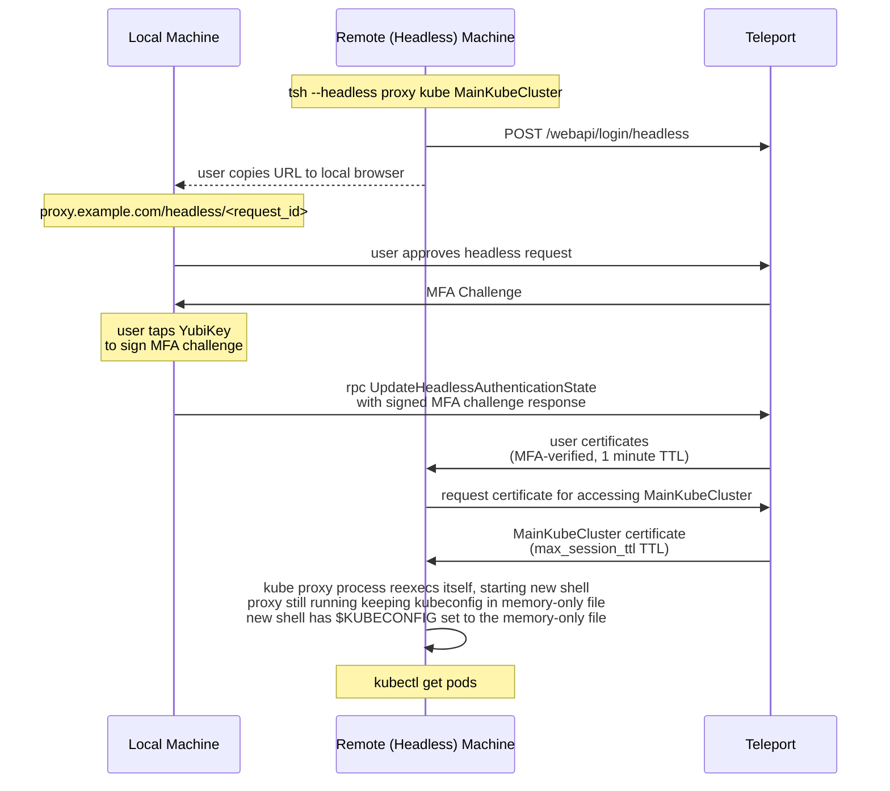

# RFD 0149 - Headless Kubernetes Access

## Required Approvals

* Engineering: @r0mant && @tigrato
* Product: @xinding33 || @klizhentas
* Security: @reedloden || @jentfoo

# What

Support headless authentication for Teleport Kubernetes access.
Headless authentication means that a user will be able to use their credentials and an MFA device on a local machine to authenticate
on a remote machine.

# Why

Some users have a workflow whereby they do a big part of their work on a remote Linux machine, to which they connect by SSH from their
local machine. If they access Teleport through SSO they encounter a problem - they don't have access to the browser in the terminal
on that remote machine, so they can't authenticate. Authentication on a remote machine using SSO/MFA device on the local machine
unlocks such workflows. This was already implemented for `tsh ssh` access, but is not yet available for Kubernetes access.

# Scope

The main goal of this proposal is to provide headless Kubernetes access for remote Linux machines, as it addresses the
majority of use cases requiring this feature. MacOS might be supported with a slightly different approach,
without using a memory-only kubeconfig file. We also want to make sure that other unprivileged user logins on a remote machine
are separated from each other, in case the remote machine is shared by multiple people.

# Details

To implement headless Kubernetes access, we'll build upon two recently implemented features -
headless authentication for `tsh ssh` ([RFD 105](https://github.com/gravitational/teleport/blob/master/rfd/0105-headless-authentication.md)) and Teleport Kubernetes
local proxy ([RFD 121](https://github.com/gravitational/teleport/blob/master/rfd/0121-kube-mfa-sessions.md)).

## Headless authentication

When headless authentication is initiated by the user on a remote machine, the client calls the `POST /webapi/login/headless`
endpoint on the Auth server. It creates a `HeadlessAuthentication` resource on the backend.
After that, the call is paused, and the user is provided with a link (or command line alternative) where they can approve
the newly created headless authentication request using their local machine with a logged-in Teleport and an MFA device. Once
the request is approved by the user, the authentication process is unpaused and the original call returns regular
user's Teleport login certificates created by the auth server. These certificates have a TTL of 1 minute.

## Headless Kubernetes proxy

We will add the flag `--headless` to the `tsh proxy kube` command.
The user will be able to start `tsh --headless proxy kube` in headless mode on a remote machine,
then authenticate on the local machine using the link provided by the started proxy (using the flow
described in the previous section).

After the user finishes the authentication process, the headless kube proxy will generate certificates for accessing
specified Kubernetes clusters. When the Auth server issues these certificates, it will recognize that
the certificate is being generated for the user kube proxy - certificate usage is `UsageKubeOnly` and
`RequesterName` is `TSH_KUBE_LOCAL_PROXY`. For this case, it will not limit the certificate TTL by the calling
identity TTL, which is 1 minute, since that's what was created during headless login. Instead, these certificates'
expiration will be limited by the `max_session_ttl` time, similar to how the regular `tsh proxy kube` works.
When the kube proxy receives certificates for accessing Kubernetes clusters, it will create an in-memory file and
will write kubeconfig to it. This kubeconfig is only needed for correct access from the kubectl to the local kube proxy;
it does not contain certificates information for accessing the Kubernetes cluster in teleport. To create the kubeconfig we
generate a new one-use local key every time the proxy starts. Next, the headless kube proxy will reexec itself, opening a new
shell for the user, while keep running in the background. The kube proxy will provide this new shell with the
access to the in-memory kubeconfig by the path `/proc/self/fd/3` and the proxy will point the `$KUBECONFIG`
environment variable to this file, allowing `kubectl` to access it.

On MacOS, we will write kubeconfig to a regular temporary file, restricted by the permissions to be available
only to the logged-in user.

After the kube proxy reexecs into a new shell, the user is ready to use `kubectl`. Even though the main user certificate received during
headless authentication will expire in 1 minute, the Kubernetes-only access certificates will continue to work up to the `max_session_ttl`,
allowing the user to effectively work with `kubectl`. After the `max_session_ttl` time passes, the kube proxy will print a request for a new
headless login and the user can repeat the process again. Reexecing is not needed for a repeated headless login, since the kube proxy
only needs to replace its internal certificates for accessing Teleport, not the local kubeconfig.

Once the user finishes and exits, or the kube proxy process is terminated for any reason, all security-sensitive information will be
cleaned up automatically since it was only held in memory and never saved to the disk.

## Reexecing kube proxy

Code for reexecing kube proxy can look like this:

```go
// memFile creates a file in memory and returns a file descriptor.
func memFile(name string, b []byte) (int, error) {
	// create the memfd
	fd, err := unix.MemfdCreate(name, 0)
	if err != nil {
		return 0, trace.Wrap(err, "memfd create")
	}
	// set the size of the file to the size of the byte slice
	err = unix.Ftruncate(fd, int64(len(b)))
	if err != nil {
		return 0, trace.Wrap(err, "ftruncate")
	}

	// map the file into memory
	data, err := unix.Mmap(fd, 0, len(b), unix.PROT_READ|unix.PROT_WRITE, unix.MAP_SHARED)
	if err != nil {
		return 0, trace.Wrap(err, "mmap memory")
	}
	copy(data, b)

	// unmap the file from memory
	err = unix.Munmap(data)
	if err != nil {
		return 0, trace.Wrap(err, "munmap memory")
	}

	return fd, nil
}

func reexec(data string) {
	fd, err := memFile("proxy-kubeconfig", []byte(data))
	if err != nil {
		panic(err)
	}

	// filepath to our newly created in-memory file descriptor
	fp := fmt.Sprintf("/proc/self/fd/%d", fd)

	// open the file
	f := os.NewFile(uintptr(fd), fp)
	defer f.Close()

	// prepare to re-exec shell
	command := "/bin/bash"
	if shell, ok := os.LookupEnv("$SHELL"); ok {
		command = shell
	}

	cmd := exec.Command(command)
	cmd.Stderr = os.Stderr
	cmd.Stdout = os.Stdout
	cmd.Stdin = os.Stdin
	
    // pass the file descriptor to the child process as an extra file
    // descriptor. It will be available as fd 3 in /proc/self/fd/3
    cmd.ExtraFiles = []*os.File{f}
	
	cmd.Env = os.Environ()
	// Point $KUBECONFIG to the in-memory file so kubectl is ready to use immediately.
    cmd.Env = append(cmd.Env, fmt.Sprintf("%s=%s", teleport.EnvKubeConfig, "/proc/self/fd/3"))

	if err := cmd.Start(); err != nil {
		return err
	}
	if err := cmd.Wait(); err != nil {
		return err
	}
	return nil
}
```

## Diagram

Headless kube proxy flow shown below:


## UX
User experience while using the headless Kubernetes access will look like this:

```console
$ tsh --headless proxy kube main_kube_cluster --proxy=tele.port --user=admin
Complete headless authentication in your local web browser:

https://tele.port:443/web/headless/b1d4215f-a481-5c02-8425-7716b840c62f

or execute this command in your local terminal:

tsh headless approve --user=admin --proxy=tele.port:443 b1d4215f-a481-5c02-8425-7716b840c62f

*** User approves headless request on the local machine ***

Preparing the following Teleport Kubernetes clusters:
Teleport Cluster Name Kube Cluster Name
--------------------- -----------------
tele.port             main_kube_cluster

Started local proxy for Kubernetes on 127.0.0.1:1234 in the background
and kubectl is set up to work with it. Try issuing a commnd, for example "kubectl get namespaces"

$ kubectl get pods
NAMESPACE        NAME                                READY   STATUS    RESTARTS      AGE
teleport-agent   teleport-agent-0                    1/1     Running   0             2d12h

$ exit
Local Kube proxy is closed.

$ tsh status
ERROR: Not logged in.
```

# Security

We will keep the same level of security already achieved by the headless login and Kubernetes local proxy.
All security-sensitive artifacts created by the local proxy on the remote machine will be kept in memory,
including private keys and certificates. Additionally, memory is locked from being swapped to the
disk [`unix.Mlockall`](https://pkg.go.dev/golang.org/x/sys/unix#Mlockall)
(it was added for the headless login).

We will not change any part of the headless login itself, only integrate the existing
flow into the `tsh proxy kube` command as an option. Certificates for accessing Kubernetes clusters in Teleport will be
limited by `max_session_ttl`, which is the same behavior when using the regular `tsh proxy kube`. 

Keeping everything in memory
and reexecing into a new shell provides a secure and convenient workflow for the user - once the process for the headless kube proxy
terminates, everything is automatically cleaned up; there are no residual security-sensitive files left on disk.
It also protects the kube proxy from being accessed by other unprivileged users logged in to the same machine, since they can't access
the kubeconfig - file location for the kubeconfig `/proce/self/fd/3` can only be read by the owner user, so if another user
will try to point `kubectl` to it, this wouldn't work. Clients logged in as the same Linux user on this machine will be able to read
each other's kubeconfig though, therefore if an organization is using a shared remote machine for multiple users, they should make sure
every person has their own dedicated Linux user login. 

Starting a new proxy or continuing access beyond the `max_session_ttl` time
requires a new full headless login procedure. Furthermore, security can be increased by using the IP pinning feature, which would
make the certificates usable only from the remote machine's IP.

# Audit events

Points of interest in scope of this RFD - creating certificates and approving/denying headless authentication -
are already covered by existing audit events, therefore no new audit events need to be
added. However we will add the additional information to the headless authentication audit event - we will include
requester source (kube proxy).

# Alternatives

We explored an option of adding capability of listening on unix-sockets for the user's local kube proxy. But `kubectl`
doesn't have a native way of connecting to the unix-sockets, it can only work with http(s) and socks5 endpoints. We could
solve this by adding `tsh kubectl` into the scheme, but since ultimately unix-sockets are controlled by Linux user permissions,
we would achieve same level of security as without them. So it would be just needlessly overcomplicating the workflow.