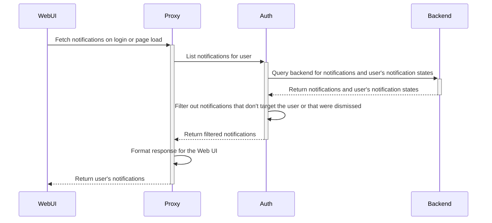

# RFD 0156 - Notifications

## Required Approvals

- Engineering: @zmb3
- Product: @roraback

## What

A notification system that can be used to notify users of various events, updates, and warnings in real time.

## Why

Users currently have no way to easily view or be notified of updates and events relevant to them. Our existing cluster alerts system is cumbersome and doesn't support many
desired use cases due to its non-dynamic nature. With the notification system, features in the application will be able to programmatically send notifications to specific user(s) to
notify them of relevant events. Cluster admins will also be able to manually send informational notifications to their cluster's users.

Examples of potential use cases include being able to notify users of:

- A new access request that needs their review.
- Their access request being approved/denied.
- Needing to complete their periodic access list review.
- An access monitoring alert.
- A failed payment.
- Approaching a usage limit.
- Needing to upgrade their Teleport version.
- New features added to Teleport.

## Details

Notifications will be stored in the backend and be of two types:

1. User-specific notifications: Targets a single specific user. An example is a notification to notify a user that their access request has been approved.
2. Global notifications: Targets multiple users. An example is a notification to notify users that there is a new access request needing review.
   They can be configured to target users based on one of the following matchers:
   1. Permissions: Targets all users with the specified RBAC permission(s).
   2. Role: Targets all users with the specified role(s).
   3. All: Targets all users.

Since user-specific notifications are stored by username, notifications for SSO users will persist between sessions.

Notifications will have a default TTL of 30 days, after which they will be automatically deleted. In some cases, notifications may also automatically be deleted prior to their TTL if configured to do so.

#### Backend

User-specific notifications will be stored in the backend under the key `/notifications/user/<the user's username>/<notification id>`.

Global notifications will be stored in the backend under the key `/notifications/global/<notification id>`.

There will be a maximum of number of notifications which can exist at any given time per key-space, the limit for any given user's user-specific notifications will be 500, and global notifications will be capped at 1000.
When these limits are exceeded, older notifications in the key-space will be periodically cleaned up asynchronously. In addition, there will be rate-limits to prevent large spikes in notifications being created.
The periodic cleanup will also check for expired notifications and delete them.

#### Types and Protos

###### Notification Item

If this is a user-specific notification, it will be stored as-is under `/notification/user/<username>/<notification id>`.

If this is a global notification, it will be nested in a [`GlobalNotification`](#global-notifications).

```protobuf
// Notification represents a notification item.
message Notification {
   // kind is the resource kind ("notification").
   string kind = 1;
   // sub_kind represents the unique kind of notification this is, eg. `access-request-approved`
   string sub_kind = 2;
   // version is the resource version.
   string version = 3;
   // metadata is the notification's metadata. This contains the notification's title, description, labels, and expiry.
    teleport.header.v1.Metadata metadata = 4;
   // spec is the notification specification.
   NotificationSpec spec = 5;
}

// NotificationSpec is the notification specification.
message NotificationSpec {
   // id is the UUID of the notification, in UUIDv7 format.
   string id = 1;
   // created is when the notification was created, in UNIX time.
   google.protobuf.Timestamp created = 2;
   // unscoped is whether the notification shouldn't be restricted to a specific audience. This is to prevent the potential future possibility that a user-specific notification contains information that the user should no longer be allowed to see. Default is true.
   bool unscoped = 3;
}
```

###### User Notification State Item

Each user will have a unique `NotificationState` item for every notification they have interacted with.

This will keep track of whether the user has clicked on (ie. interacted with) or dismissed the notification.

These will be stored per user per notification in the backend under `/notification/states/<username>/<notification id>`

Dismissed states are only going to be possible for global notifications. If a user dismisses a user-specific notification directed at them, instead of updating this state to `dismissed`, the notification will just be
deleted as well as its state item.

```protobuf
// UserNotificationState represents a notification's state for a user. This is to keep track
// of whether the user has clicked on or dismissed the notification.
message UserNotificationState {
   // kind is the resource kind ("user_notification_state").
   string kind = 1;
   // sub_kind is the optional resource subkind. This is unused.
   string sub_kind = 2;
   // version is the resource version.
   string version = 3;
   // metadata is the user notification state's metadata.
   teleport.header.v1.Metadata metadata = 4;
   // spec is the user notification state's specification.
   UserNotificationStateSpec spec = 5;
   // status is the status of this user notification state, it contains the notification state itself which will be dynamically modified.
   UserNotificationStateStatus status = 6;
}

// UserNotificationStateSpec is the user notification state's specification.
message UserNotificationStateSpec {
   // notification_id is the ID of the notification this state is for.
   string notification_id = 1;
}

// UserNotificationState is the state of a notification for a user. This can represent either "clicked" or "dismissed".
enum UserNotificationState {
   NOTIFICATION_STATE_UNSPECIFIED = 0
   // NOTIFICATION_STATE_CLICKED marks this notification as having been clicked on by the user.
   NOTIFICATION_STATE_CLICKED = 1;
   // NOTIFICATION_STATE_DISMISSED marks this notification as having been dismissed by the user.
   NOTIFICATION_STATE_DISMISSED = 2;
}

// UserNotificationStateStatus is the status of this user notification state, it contains the notification state itself which will be dynamically modified.
message UserNotificationStateStatus {
   // notification_state is the state of this notification for the user. This can represent either "clicked" or "dismissed".
   NotificationState notification_state = 1;
}
```

##### User Last Seen Notification Item

This keeps track of the timestamp of the latest notification the user has seen in their notifications list. This is used in order to determine whether
the user has any new notifications since then that they haven't seen yet. Note that "seeing" a notification merely refers to seeing it in the list, this is different from "viewing"
a notification which involves clicking on it.

This will be stored once per user in the backend under `/notifications/last_seen/<username>`.

```protobuf
// UserLastSeenNotification represents the timestamp of the last notification a user has seen.
message UserLastSeenNotification  {
   // kind is the resource kind ("user_last_seen_notification").
   string kind = 1;
   // sub_kind is the optional resource subkind. This is unused.
   string sub_kind = 2;
   // version is the resource version.
   string version = 3;
   // metadata is the user last seen notification object's metadata.
   teleport.header.v1.Metadata metadata = 4;
   // UserLastSeenNotificationSpec is the user last seen notification item's specification.
   UserLastSeenNotificationSpec spec = 5;
   // status is the status of this user's last seen notification, it contains the timestamp of the notification which will be dynamically modified.
   UserLastSeenNotificationStatus status = 6;
}

// UserLastSeenNotificationSpec is a user last seen notification specification.
message UserLastSeenNotificationSpec {}

// UserLastSeenNotificationStatus is the status of this user's last seen notification, it contains the timestamp of the notification which will be dynamically modified.
UserLastSeenNotificationStatus {
   // last_seen_time is the timestamp of the last notification that the user has seen.
   google.protobuf.Timestamp last_seen_time = 1;
}
```

###### Global Notification Item

These will be stored under `/notification/global/<notification id>`.

```protobuf
// GlobalNotification represents a global notification.
message GlobalNotification {
   // kind is the resource kind ("global_notification").
   string kind = 1;
   // sub_kind is the optional resource subkind. This is unused.
   string sub_kind = 2;
   // version is the resource version.
   string version = 3;
   // metadata is the user last seen notification object's metadata.
   teleport.header.v1.Metadata metadata = 4;
   // spec is the global notification's specification.
   GlobalNotificationSpec spec = 5;
}

// GlobalNotificationSpec is the global notification's specification.
message GlobalNotificationSpec {
   // Matcher for determining the target of this notification.
   oneof matcher {
      // by_permissions represents the RoleConditions needed for a user to receive this notification.
      // If multiple permissions are defined and `MatchAllConditions` is true, the user will need to have
      // all of them to receive this notification.
      ByPermissions by_permissions = 1;
      // by_roles represents the roles targeted by this notification.
      // If multiple roles are defined and `MatchAllConditions` is true, the user will need to have all
      // of them to receive this notification.
      ByRoles by_roles = 2;
      // all represents whether to target all users, regardless of roles or permissions.
      bool all = 3;
   }
   // match_all_conditions is whether or not all the conditions specified by the matcher must be met,
   // if false, only one of the conditions needs to be met.
   bool match_all_conditions = 4;
   // notification is the notification itself.
   Notification notification = 5;
}

// ByPermissions represents the RoleConditions needed for a user to receive this notification.
message ByPermissions {
   repeated RoleConditions role_conditions = 1;
}

// ByRoles represents the roles targeted by this notification.
message ByRoles {
   repeated string roles = 1;
}
```

##### RPC Service

```protobuf
service NotificationService {
   // CreateUserNotification creates a user-specific notification.
   rpc CreateUserNotification(CreateUserNotificationRequest) returns (Notification);
   // DeleteUserNotification deletes a user-specific notification.
   rpc DeleteUserNotification(DeleteUserNotificationRequest) returns (google.protobuf.Empty);
   // ListUserNotifications returns a page of user-specific notifications.
   rpc ListUserNotifications(ListUserNotificationsRequest) returns (ListUserNotificationsResponse);

   // CreateGlobalNotification creates a global notification.
   rpc CreateGlobalNotification(CreateGlobalNotification) returns (GlobalNotification);
   // DeleteGlobalNotification deletes a global notification.
   rpc DeleteGlobalNotification(DeleteGlobalNotificationRequest) returns (google.protobuf.Empty);
   // ListGlobalNotifications returns a page of global notifications.
   rpc ListGlobalNotifications(ListGlobalNotificationsRequest) returns (ListGlobalNotificationsResponse);

   // CreateUserNotificationState creates a user notification state.
   rpc CreateUserNotificationState(CreateUserNotificationStateRequest) returns (UserNotificationState);
   // UpdateUserNotificationState updates a user notification state.
   rpc UpdateUserNotificationState(UpdateUserNotificationStateRequest) returns (UserNotificationState);
   // DeleteUserNotificationState deltes a user notification state.
   rpc DeleteUserNotificationState(DeleteUserNotificationStateRequest) returns (google.protobuf.Empty);
   // ListUserNotificationStates returns a page of user notification states.
   rpc ListUserNotificationStates(ListUserNotificationStatesRequest) returns (ListUserNotificationStatesResponse);

   // GetUserLastSeenNotification returns a user's last seen notification item.
   rpc GetUserLastSeenNotification(GetUserLastSeenNotificationRequest) returns (UserLastSeenNotification);
   // CreateUserLastSeenNotification creates a user's last seen notification item.
   rpc CreateUserLastSeenNotification(CreateUserLastSeenNotificationRequest) returns (UserLastSeenNotification);
   // UpdateUserLastSeenNotification updates a user's last seen notification item.
   rpc UpdateUserLastSeenNotification(UpdateUserLastSeenNotificationRequest) returns (UserLastSeenNotification);
   // DeleteUserLastSeenNotification deletes a user's last seen notification item.
   rpc DeleteUserLastSeenNotification(DeleteUserLastSeenNotificationRequest) returns (google.protobuf.Empty);
}

message CreateUserNotificationRequest {
   // username is the username of the user the notification to create is for.
   string username = 1;
   // notification is the notification to create.
   Notification notification = 2;
}

message DeleteUserNotificationRequest {
   // username is the username of the user the notification to delete is for.
   string username = 1;
   // notification_id is the ID of the notification to delete.
   string notification_id = 2;
}

message ListUserNotificationsRequest {
   // username is the username of the user the notifications to list are for.
   string username = 1;
   // page_size is the size of the page to return.
   int32 page_size = 2;
   // page_token is the next_page_token value returned from a previous ListUserNotifications request, if any.
   string page_token = 3;
}

message ListUserNotificationsResponse {
   // notifications is the notifications returned.
   repeated Notification notifications = 1;
   // next_page_token is the token to retrieve the next page of results, this will be empty if there are no more results.
   string next_page_token = 2;
}

message CreateGlobalNotificationRequest {
   // global_notification is the global notification to create.
   GlobalNotification global_notification = 1;
}

message DeleteGlobalNotificationRequest {
   // notification_id is the ID of the notification to delete.
   string notification_id = 1;
}

message ListGlobalNotificationsRequest {
   // page_size is the size of the page to return.
   int32 page_size = 1;
   // page_token is the next_page_token value returned from a previous ListGlobalNotifications request, if any.
   string page_token = 2;
}

message ListGlobalNotificationsResponse {
   // global_notifications is the global notification items returned.
   repeated GlobalNotification global_notifications = 1;
   // next_page_token is the token to retrieve the next page of results, this will be empty if there are no more results.
   string next_page_token = 2;
}

message CreateUserNotificationStateRequest {
   // username is the username of the user.
   string username = 1;
   // user_notification_state is the user notification state to create.
   UserNotificationState user_notification_state = 2;
}

message UpdateUserNotificationStateRequest {
   // username is the username of the user.
   string username = 1;
   // user_notification_state is the updated user notification state.
   UserNotificationState user_notification_state = 2;
}

message DeleteUserNotificationStateRequest {
   // username is the username of the user.
   string username = 1;
   // notification_id is the ID of the notification the notifiation state to delete is for.
   string notification_id = 2;
}

message GetUserLastSeenNotificationRequest {
   // username is the username of the user.
   string username = 1;
}

message CreateUserLastSeenNotificationRequest {
   // username is the username of the user.
   string username = 1;
   // user_notification_state is the user last seen notification item to create.
   UserLastSeenNotification user_last_seen_notification = 2;
}

message UpdateUserLastSeenNotificationRequest {
   // username is the username of the user.
   string username = 1;
   // user_notification_state is the udpated user last seen notification item.
   UserLastSeenNotification user_last_seen_notification = 2;
}

message DeleteUserLastSeenNotificationRequest {
   // username is the username of the user.
   string username = 1;
}
```

#### Unique Notification SubKinds

Each notification will have a `subkind` identifying the type of notification it is. This is so that we can handle notifications in the UI
differently based on their type, such as determining what action is performed when interacting with it and which icon it should have.

###### Example notification subkinds

- `default-informational`: The default subkind for an informational notification.
- `default-warning`: The default subkind for a warning notification.
- `user-created-informational`: The subkind for informational notifications that were manually created by a user using `tctl`.
- `user-created-warning`: The subkind for warning notifications that were manually created by a user using `tctl`.
- `access-request-pending`: The subkind for a notification for an access request pending review. This is the notification received by a user when an access request needs their review.
- `access-request-approved`: The subkind for a notification for a user's access request being approved.
- `access-request-denied`: The subkind for a notification for a user's access request being denied.

For example, if a notification's subkind is `access-request-pending`, the UI will make the notification redirect to the page for reviewing the access request.

#### Usage

The notifications service will work primarily by adding, deleting, and fetching notifications from the backend.

These are some examples of methods the service will expose:

- `NotifyUser` - Sends a notification to a specific user based on the specified username.
- `NotifyUserByPermissions` - Sends a notification to all users with the specified permission(s).
- `NotifyUsersByRole` - Sends a notification to all users with the specific role(s).
- `NotifyAllUsers` - Sends a notification to all users.
- `ListNotificationsForUser` - Returns all the notifications for a user after filtering, with pagination.
- `UserMatchesGlobalNotification` - Checks if a user matches a global notification's matcher.
- `DeleteGlobalNotification` - Deletes a global notification.
- `SetUserLastSeenNotification` - Sets the timestamp of the last notification a user has seen.
- `MarkNotificationAsClicked` - Marks a notification as having been clicked on.
- `MarkNotificationAsDismissed` - Marks a notification as dismissed.

##### Example Usage:

```go

// Notifies all users with the permission to `create` and `update` integrations.

roleConditions := []types.RoleConditions{
   {
      Rules: []types.Rule{
         {
            Resources: []string{types.KindIntegration},
            Verbs:     []string{types.VerbCreate, types.VerbUpdate},
         },
      },
   },
}

notification := types.Notification{
   Type: notifications.IntegrationMisconfiguredType,
   Metadata: types.Metadata{
      Name: "Integration Misconfigured",
      Description: fmt.Sprintf("The integration [%s] was misconfigured.", integration.name),
      Labels:      map[string]string{"integration-id": integration.id},
   },
}

notifyUsersByPermissions(roleConditions, notification)
```

### Flow

#### Web UI

Upon logging in and on every page load, a request will be made to fetch all the user's notifications. This fetch will be performed asynchronously so that the login or page loading process is not slowed down by having to wait for the notifications response.
Only one request will be active at any given time, if the user navigates through pages quickly while a previous request is still being processed, new requests won't be made.
The notifications service will query the backend and return the list of the user's notifications after filtering out those not meant for them. In the case of global notifications, only notifications with matchers that match the user (ie. by role or
permissions) will be kept. Notifications that the user dismissed will also be filtered out.

This is a simplified diagram of the flow:



###### Stretch goal

In the future, we can implement the use of WebSockets alongside a database watcher in order to allow for real-time notifications, this would work by only performing one initial fetch on login for all notifications and storing them in `localStorage`,
then, any new notifications received during the user's session will be sent to the user's browser in real-time via a WebSocket connection.

We could also look into implementing the use of a service worker that can run and listen for notifications even if no tabs are open, this could also work with the [Push API](https://developer.mozilla.org/en-US/docs/Web/API/Push_API) and
[Notifications API](https://developer.mozilla.org/en-US/docs/Web/API/Notifications_API) to send push notifications from the browser. However, this would introduce some potential security-related issues and would require more consideration.

#### tsh

The first version will not include `tsh` support for notifications. This can be explored in the future, and would likely be limited to a `tsh notifications ls` command for listing notifications.

### UX

Most of the details regarding the UX are still being discussed and have yet to be finalized, they are being tracked in [this GitHub issue](https://github.com/gravitational/cloud/issues/6486). The details proposed below are subject to change.

#### Web UI

The Web UI will feature a notification icon on the top toolbar, if the user has any unread notifications, this icon will have a badge with the number of unread notifications. Clicking this
button will open the notifications pane which will list the user's notifications. After the notifications pane is opened, any previously unread notifications will be marked as read (this is done by making a request
which updates the user's last seen notification timestamp). Any notification that has not yet been clicked on will be highlighted to differentiate it from the rest.

Notifications with long descriptions beyond a certain length will be truncated and optionally expandable to show their full content. The user has the option to dismiss a notification which means
that they will never see it again. The interactivity of a notification in this list depends on its type which is identified by its [subkind](#unique-notification-types). Informational and warning notifications (such as those created manually via `tctl`)
will be clickable and open a modal with the full text content. Other notifications can be interactive and able to perform specific actions, for example in the case of a new access request notification, it can redirect the user to the page where they can
review the request (the action any given notification type performs will be manually configured in the Web UI code). Notifications may also have a "quick action" beyond just being clickable, for example, in the case of a notification for an approved access request,
there may be a quick action button to assume the new roles. Interacting with a notification will mark it as having been clicked on.

##### Stretch goal

Users will also have the ability to manage their notifications preferences in their settings. Particularly, the ability to mute certain types
of notifications, these will be stored in the user's user preferences. This may not be included in the first version.

#### CLI

##### tctl

Users with RBAC `write` permissions for the `notifications` resource will be able to manually create notifications to notify users in their cluster using:

```shell
$ tctl notifications create --title=<title> --description=<description> --type=<info | warning> (--all | --roles=<roles-to-target>) --ttl=<ttl>
```

- `--type` is the type of notification, either `info` or `warning`. All this does is determine which icon/colors will be used when showing the notification in the UI.
- `--all` means this notification will target all users.
- `--roles` are the role(s) that this notification should target (ie. `ByRoles`). If multiple roles are specified here, users will only need to have one of the roles to be targeted.
- `--ttl` is the notification's time to live, it will automatically expire and be deleted after this. The default is 30 days.

###### Example usage

```shell
$  tctl notifications create \
   --title="Enroll an MFA device" \
   --description="We will soon be enforcing MFA in this cluster, please enroll a device to avoid being locked out of your account." \
   --type=info \
   --all \
   --ttl=45d
```

Global notifications can also be deleted using:

```shell
$ tctl notifications delete <notification-id>
```

###### Stretch goal

Support a `--permissions` flag that accepts a predicate expression which will allow cluster admins to also be able to target users by permissions.

### Security

The proposed changes don't introduce any new potential vulnerabilities, though it should be noted that there is already a relevant minor issue affecting all WebSocket connections in the UI, which is
being tracked by [this ticket](https://github.com/gravitational/teleport-private/issues/637) and will be remediated with the implementation of [this RFD](https://github.com/gravitational/teleport.e/pull/1609).

Creating a notification using `tctl` is a protected action that requires `write` permissions for the `notifications` resource which users won't have by default. Creating notifications will also be
an [administrative action](https://github.com/gravitational/teleport/blob/master/rfd/0131-adminitrative-actions-mfa.md) and require an additional MFA re-authentication. This prevents an unauthorized bad actor from creating a malicious notification, such as to phish users. All user-determinable text content in a notification (title and description/content) will be correctly escaped in the Web UI, furthermore, control characters will be disallowed and
white space will be normalized. Titles will be limited to 70 characters in length and descriptions will have a limit of 500 characters.

Programmatically generated notifications will not store or expose any sensitive information, and the documentation for the `tctl` command should also recommend users to not create notifications containing any sensitive information. This prevents any
potential risks that would be introduced by storing notifications in the browser's persisting local storage.

### Backwards Compatibility and Leaf Clusters

##### Cluster Alerts

The notification system will replace the existing cluster alerts system. When this feature is released, creating new cluster alerts will no longer be supported.
To ease the UX transition, any existing cluster alerts created prior to this change will continue to be supported and behave the same way for two major releases; after which
all cluster alert functionality will be removed. During this time, attempts to run any cluster alert-related commands will be met with a message informing them that the feature is deprecated
and that they should use notifications, alongside a basic usage example.

##### Leaf Clusters`

Notifications will be unique to each cluster. However, similar to the behaviour of cluster alerts today, notifications in a leaf cluster will be accessible from the root cluster.
When a user in the Web UI switches to the leaf cluster, their notifications list will be listing those from the leaf cluster. We can possibly include some type of indicator in the notifications pane in the Web UI to make this clear.

### Audit Events

Audit events will be emitted upon the manual creation and deletion of global notifications via `tctl`, they will contain the name of the user who created the notification, as well as
the notification's content in the event's metadata.

- `TN001I`: `NotificationCreateCode` is emitted when a user manually creates a notification using `tctl`.
  - `User [joe] created a notification with title ["Enroll an MFA device"]`
- `TN002I`: `NotificationDeleteCode` is emitted when a user deletes a manually created notification using `tctl`.
  - `User [joe] deleted notification ["Enroll an MFA device"]`

### Test Plan

Under all the test plan sections for features that emit notifications, items will be added to verify that the notifications are emitted correctly. Cluster alert-related test plan items should be removed.

The `tctl notifications create` and `delete` commands should also be tested.
