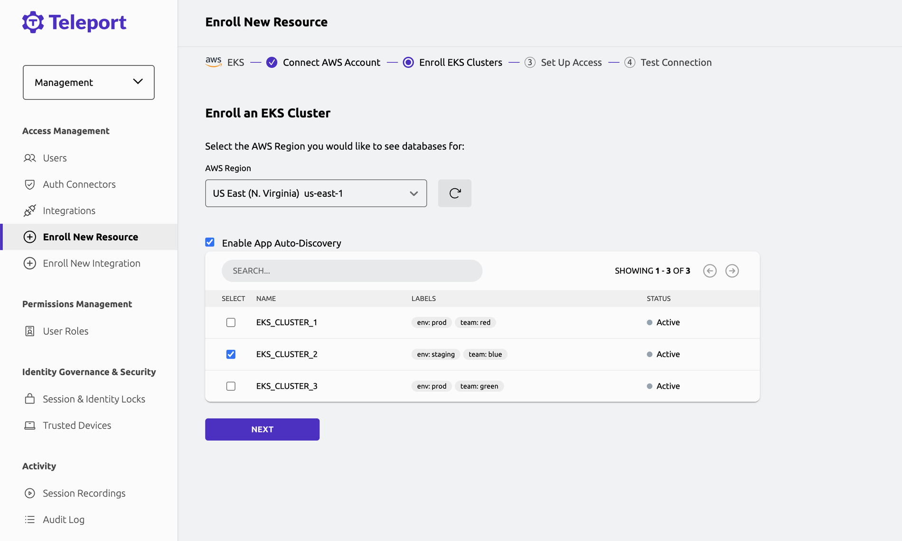

# RFD 0157 - AWS EKS Discover Integration

## Required Approvals

* Engineering: @r0mant && (@tigrato || @marcoandredinis)
* Product: @xinding33 || @klizhentas
* Security: @reedloden || @jentfoo

## What

Add a guided workflow to the Discover UI for enrolling AWS Elastic Kubernetes Service (EKS) clusters.

## Why

At present, the process for adding an EKS cluster to Teleport is somewhat technical. Users need to either manually install the Teleport agent on the cluster or manually set up and run discovery and kube services for EKS.
We aim to lower the friction of adding EKS clusters to Teleport by providing a seamless experience. Creating a guided UI workflow will help users onboard
their EKS clusters more quickly and with less effort.

## Scope

This RFD focuses on Amazon EKS clusters, specifically it applies to EKS clusters that use API_AND_CONFIG_MAP or API access mode. A similar approach can be taken later for other specialized Kubernetes providers, such as
Azure AKS and Google GKE.

## Details

### UX

We will build a workflow similar to the ones we already have for AWS RDS and EC2 enrollment.



General steps of the workflow:

1. AWS Integration setup
2. Clusters Enrollment
3. Setup access
4. Test connection

AWS Integration for EKS will require permissions to list/describe EKS clusters as well as permissions to list/create/delete access entries and 
associate access policies for an EKS cluster (details [below](#eks-access-entries)). AWS permissions config:

```json
{
    "Version": "2012-10-17",
    "Statement": [
        {
            "Effect": "Allow",
            "Action": [
                "eks:DescribeCluster",
                "eks:ListClusters",
                "eks:ListAccessEntries",
                "eks:CreateAccessEntry",
                "eks:DeleteAccessEntry",
                "eks:AssociateAccessPolicy",
                "eks:TagResource"
            ],
            "Resource": "*"
        }
    ]
}
```

We will reuse existing code for AWS Integration setup using these new permissions.

After setting up AWS integration, users will see a list of the EKS clusters in the next step.
There, they will be able to select the cluster they want to enroll.
We will determine which clusters are already enrolled and present in the Teleport inventory; those clusters
will be greyed out in the table.

Users will also have an option to enable Kubernetes App Discovery in the enrolled clusters, this option
will be enabled by default.

Users will have two main options for enrolling EKS clusters:
 - Enroll specific selected cluster from the list of available ones.
 - Set up automatic discovery and enrollment of the clusters.

Cluster enrollment will be done through the installation of the Teleport agent using the Helm chart
`teleport-kube-agent`.

### Enrolling Selected Clusters

For the enrollment of just the selected clusters, users will be further given two choices:
- Use EKS Access entries to enroll a cluster with just the API.
- As a backup option - manually run a Helm command that we generated for them.

For completely automated cluster enrollment through the API, the Helm Go SDK will be used -
allowing us to avoid the need for an additional step to run Helm itself elsewhere. It would require
running a job inside the target EKS cluster with a special image that has Helm on it, and this job
would install the Teleport kube agent. By using the Helm Go SDK, we can run the installation directly from the Teleport
process and don't need to maintain a new special image and EKS installation job.

We will be able to enroll automatically only EKS clusters that are accessible to Teleport, if a client will want to 
enroll private EKS cluster they will be able to use fallback manual instructions for installing Helm chart.

### Automatic Discovery and Enrollment

Users will also be able to set up automatic discovery and enrollment of EKS clusters in the Discover UI.
We will reuse the existing EKS discovery capability, although a new mode will be added to it - discovery through
the AWS integration. EKS discovery in that mode will rely on the AWS integration, selected in the Discovery UI,
to find clusters and then install the Helm chart on them. The algorithm will be as follows:
- List EKS clusters through the AWS integration.
- Cross-check to see which EKS clusters are already registered in the system, using labels we inject on Helm chart installation.
- Once a new EKS cluster is found, create EKS access entry for Teleport AWS Integration role and associate cluster admin policy.
- Using the created access entry, get access to the EKS cluster and install the kube agent through the Helm chart.
- Remove access entry from the EKS cluster.

Users will be able to filter EKS clusters for discovery by using labels.

A dynamic discovery configuration will be created as a result of users setting up automatic EKS discovery in the Discover UI (see [RFD 125](https://github.com/gravitational/teleport/blob/master/rfd/0125-dynamic-auto-discovery-config.md)).
This configuration can be picked up by any discovery service. In the Teleport cloud, the Discovery service will be available by default,
meaning users will not need to perform any additional actions.

### EKS Access Entries

AWS has recently introduced a new authentication method for EKS clusters - "access entries". 
These access entries can be created through the AWS API and give permissions to an IAM user or role.
Permissions can be granted in two ways: either directly through the access entry by specifying username/groups for the 
IAM role, or by associating one of the predefined access policies to the access entry.

Teleport will create an access entry for the role AWS integration is running with, and then will associate
cluster admin (arn:aws:eks::aws:cluster-access-policy/AmazonEKSClusterAdminPolicy) policy to this access entry. 
It will allow AWS integration to authenticate with the EKS cluster and perform operations required for the installation
of the kube agent chart. We need to use cluster admin policy to be able to create namespace and cluster role.

Only EKS clusters that have access mode set to API_AND_CONFIG_MAP or API are supported. All new EKS clusters will automatically
be supported, since default access mode now is API_AND_CONFIG_MAP. Clients with clusters that have an 
old mode CONFIG_MAP can easily migrate them to the API_AND_CONFIG_MAP mode, in which their old access patterns will still
keep working, but also access entries are supported. We will provide instructions in the documentation on how to migrate
access mode for an EKS cluster from CONFIG_MAP to a supported one.

### Plan of implementation

Implementation will be done in two main steps:

1. Introducing an UI flow for the enrollment of selected EKS cluster using API-only enrollment with EKS access entries.
2. Adding the capability to set up automatic discovery and enrollment of EKS clusters.

First step is functionally complete and allows building upon it to implement the next step.

## Product Usage

We will add a new PostHog event to track the usage of the Discover flow for EKS.

```protobuf
// UIDiscoverEKSClusterEnrollEvent is emitted when a user is finished with
// the step that asks user to select from a list of EKS clusters.
message UIDiscoverEKSClusterEnrollEvent {
  DiscoverMetadata metadata = 1;
  DiscoverResourceMetadata resource = 2;
  DiscoverStepStatus status = 3;
}
```

## Security

New permissions will be required for the AWS OIDC integration to perform the necessary tasks. It will need 
to be able to list EKS clusters as well as create access entries and associate access policies for those clusters.
Access entries with associated cluster admin policies will be only used during the EKS cluster enrollment process, so 
end users will never have direct access to the cluster admin role. It will be used only for the
initial installation of the `teleport-kube-agent` Helm chart. The agent itself will be configured with the standard 
service account permissions it requires.

After the Helm chart installation is finished, Teleport will no longer need to have an EKS access entry associated with the
integration role, therefore it will be deleted.

## Future considerations

In the future, we will allow users to select more than one cluster to enroll at a time. 
This will require some UI changes for testing connection steps.

Also, as an alternative to the simple Helm command for manual fallback, we could generate a script to run 
inside AWS CloudShell. Such a script might lessen the friction by preparing Helm access to the cluster, so
users don't need to do it themselves. It could also be used for enrolling more than one cluster at a time.

In this RFD, we propose the usage of the cluster admin policy that allows us to install 
the Helm chart onto the EKS cluster. This is a reliable way to enroll a cluster, since we know cluster admin policy
gives us enough permission to perform the required actions. However, some users might want to limit Teleport's scope of access
to the EKS cluster even during the cluster enrolment. As a possible improvement, we can offer users a way to configure 
what user/groups Teleport's access entry should have (for example, it could be done through the tags of the EKS cluster).

## Alternative

We could enroll clusters not by installing the kube agent through the Helm chart, but by proxying requests through the
Kube service running outside of the EKS cluster. However, this would require clients to run a dedicated Kube service
and would make permissions management more complicated due to the aforementioned issue with the EKS `aws-auth` config map.
We would also lose the capability of auto-discovering apps inside EKS clusters, since the current Kubernetes App Auto-Discovery
feature works only with the Teleport agent deployed inside the cluster.