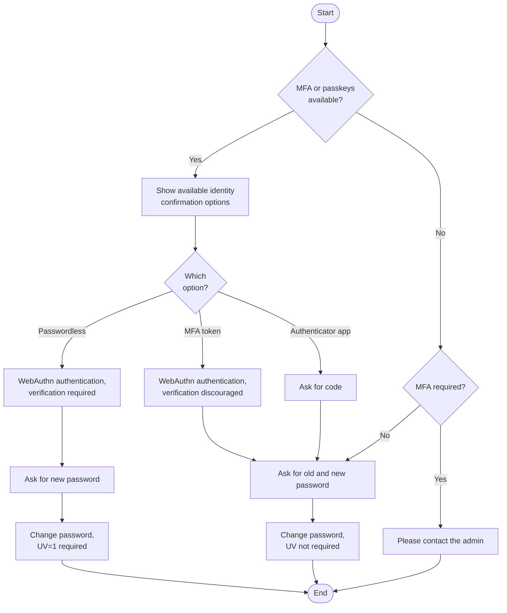
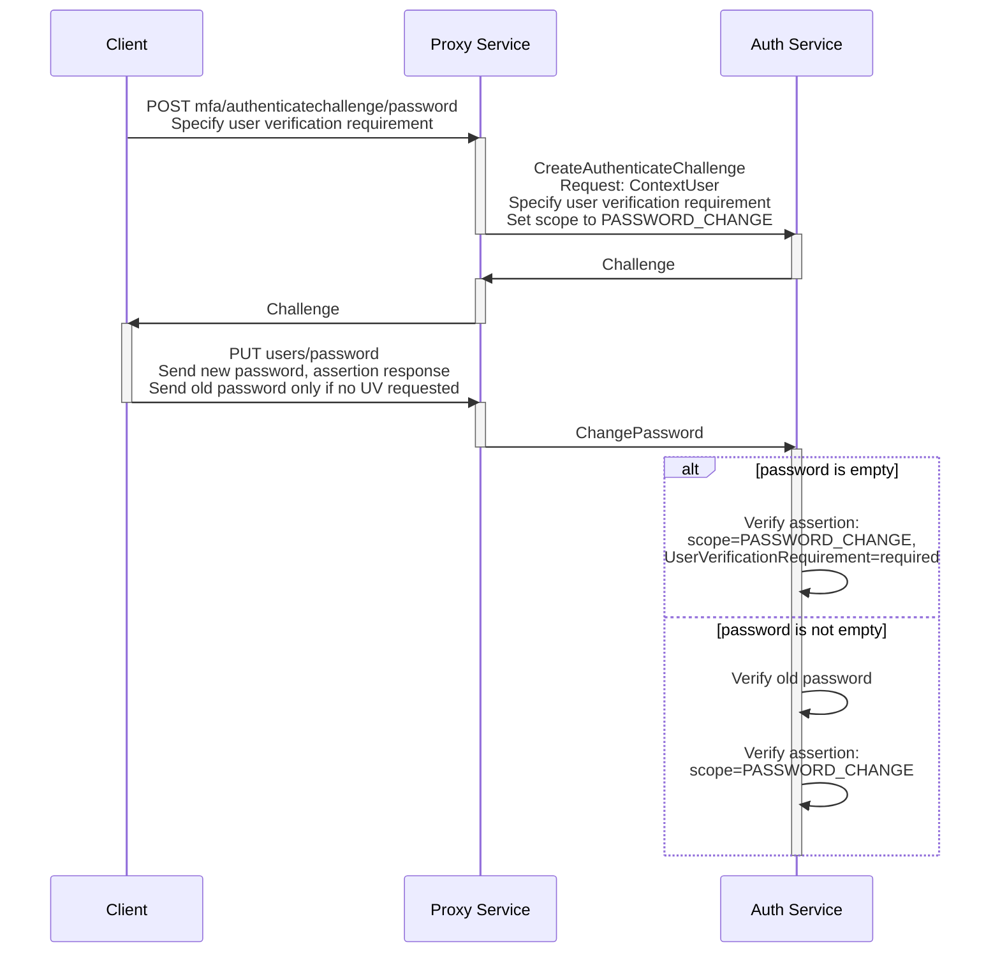

# RFD 0159 - Improving Password Management UX

## Required Approvers

- Engineering: (@zmb3 || @codingllama)
- Security: @jentfoo
- Product: @roraback

## What

We want to improve the UX of our flows related to changing passwords and management of authentication devices (both MFA and passwordless). The following new features must be supported:

- The user must be able to set password having only passwordless credentials configured.
- We should do our best to indicate which authentication methods a user has configured. Unfortunately, due to past design decisions, we will not be able to do it in every case; see the [Details](#details) section.

## Why

We are promoting passwordless authentication and would like to make it a default in our cloud environments. We need to decrease the UX friction and fill the missing gaps.

Related issues:

- [Design for defaulting to "Passwordless" authentication + updating view to clarify options](https://github.com/gravitational/cloud/issues/5757)
- [Remove local password authentication from teleport](https://github.com/gravitational/teleport/issues/19671)

## Details

For the purpose of this document, we define "passwordless key/token" as a resident WebAuthn key.

Currently, it's impossible to tell whether a user has a password configured. This is because the user always has _some_ password set. If they never set it up themselves, we just use a random 16-character password. As a consequence, when the user wants to set a password, we always ask them for the current one. It makes it impossible to add a password to account that already has a passwordless key configured and doesn't have any current password.

### Changes to the Password Change Flow

When the user wants to change their password, we need to first confirm their identity. Currently, we confirm the user's identity both by asking for the previous password, as well as performing a passkey/MFA token confirmation. To support adding a password where no password is configured, we propose to relax the confirmation conditions and allow setting password with _only_ passwordless token if such one has been used for confirming user's identity.

Rationale: as there is no reliable way to verify that the user actually has a password configured, we _have to_ allow setting a password without providing the current password for those whose password state is unknown (unspecified). We could potentially require current password for those users whose password state is _known_ (see [Recognizing Users Who Configured Their Passwords](#recognizing-users-who-configured-their-passwords)). This, however, is not necessary: if a potential attacker is able to prove their identity using a passwordless key (as opposed to an MFA key or an app token), they already are able to sign in and perform _any_ other action, including adding their own passwordless keys, as well as removing existing passwordless keys of the user under attack. 

The user will need to pick upfront whether they want to authenticate with a passwordless or an MFA device, even in case of hardware tokens. This is because in order to perform a WebAuthn authentication ceremony, we need to specify upfront whether we require [user verification](https://w3c.github.io/webauthn/#user-verification) or not using the [`PublicKeyCredentialRequestOptions.userVerification`](https://w3c.github.io/webauthn/#dom-publickeycredentialrequestoptions-userverification) field. The client (user agent) is not obliged to return an assertion that contains user verification if we didn't require it, and although the WebAuthn spec says it should do it ["if possible"](https://w3c.github.io/webauthn/#dom-userverificationrequirement-preferred), the exact details of what is considered "possible" are left to interpretation. The key question of whether we are guaranteed to receive user verification if a token capable of user verification has been used is left unanswered. Since user verification is required for changing password without giving the current one, we can't allow the user to perform it if the returned authenticator data contains flags with the [User Verified bit](https://w3c.github.io/webauthn/#authdata-flags-uv) set to 0. Thus, we need to specify user verification requirement when we create the authentication request.

The following diagram sums up the modified process:



For clarity, error cases (such as password mismatch or inability to confirm user identity) were omitted from the above diagram.

We are going to implement the following changes to the WebAuthn flow and APIs:

1. Move the responsibility for verifying the old password to the `ChangePassword` RPC call. This will allow us to decouple the verification from setting the new password in the UI (the old password will not be required when generating the challenge). This verification will be specific to the `ChangePassword` call and will not be a part of the generic [`LoginFlow`](https://github.com/gravitational/teleport/blob/47028caeaba99d33362a72edbb569749ff6b2f0d/lib/auth/webauthn/login_mfa.go#L89).
2. Add a possibility to request user verification through [`ChallengeExtensions`](https://github.com/gravitational/teleport/blob/47028caeaba99d33362a72edbb569749ff6b2f0d/api/proto/teleport/mfa/v1/mfa.proto#L27):
   ```proto
   message ChallengeExtensions {
     // ...
     string user_verification_requirement = 3; // "required", "discouraged", etc.
   }
   ```
   This will automatically become a parameter of the `CreateAuthenticateChallenge` RPC call through the `ChallengeExtensions` field.
3. Deprecate (and later delete) the `/v1/webapi/mfa/authenticatechallenge/password` endpoint in favor of the more general `/v1/webapi/mfa/authenticatechallenge` one. To make it possible to specify the user verification requirement from the client side, we will accept a corresponding `userVerificationRequirement` parameter to the [`createAuthenticateChallengeRequest`](https://github.com/gravitational/teleport/blob/47028caeaba99d33362a72edbb569749ff6b2f0d/lib/web/mfa.go#L134) structure.
4. As currently, the password-specific challenge endpoint logs the user out in case of a failed challenge, we will conditionally trigger this behavior in the generic endpoint as long as the `PASSWORD_CHANGE` scope is specified.
5. Create a dedicated [challenge scope](https://github.com/gravitational/teleport/blob/47028caeaba99d33362a72edbb569749ff6b2f0d/api/proto/teleport/mfa/v1/mfa.proto#L47) for the challenge that allows changing a password (`CHALLENGE_SCOPE_PASSWORD_CHANGE`). This is also related to [RFD 155](https://github.com/gravitational/teleport/blob/master/rfd/0155-scoped-webauthn-credentials.md).

Here is what the updated process is going to look like:



### Recognizing Users Who Configured Their Passwords

Ultimately, we would like to have information about password state for as many users as possible, for the following reasons:

1. To explicitly tell the user that they have a password configured — for example, on the account settings page.
2. To support any other future feature that might require knowing this information.

To do this, we will extend the [`UserV2`](https://github.com/gravitational/teleport/blob/47028caeaba99d33362a72edbb569749ff6b2f0d/api/proto/teleport/legacy/types/types.proto#L3253) message by adding a  `PasswordState` field. This field will be inside a `Status` structure (per best practices outlined in RFD 0153):

```proto
message UserV2 {
  // ...existing fields...

  UserStatusV2 Status = 6 [(gogoproto.jsontag) = "status,omitempty"]
}

message UserStatusV2 {
  PasswordState password_state = 1 [(gogoproto.jsontag) = "password_state,omitempty"];
}

enum PasswordState {
  // Unable to tell whether the password has been configured.
  PASSWORD_STATE_UNSPECIFIED = 0;
  // Password is known to be not configured.
  PASSWORD_STATE_UNSET = 1;
  // Password is known to be configured.
  PASSWORD_STATE_SET = 2;
}
```

The flag will be stored under the `/web/users/<username>/params` key, along with the rest of `UserV2` fields. Its main purpose is to describe the state of _existing_ password hashes.

`PASSWORD_STATE_UNSPECIFIED` is deliberately set to 0, since this is the default value when there's no information about the password state in the database.

The state changes to `PASSWORD_STATE_UNSET` whenever another user (or cluster onboarding flow) creates a password reset token for a given user. These are scenarios when the system becomes confident that the user has no password. As a consequence, users created after this change is made will never have their password in an unspecified state.

The state changes to `PASSWORD_STATE_SET` whenever user sets/resets their password or successfully signs in using a password. The last scenario, in particular, will allow us to gradually fill in information about existing users that have passwords.

> [!WARNING]
> The `PasswordState` flag should _not_ be used for authentication itself. Attempting to shortcut password verification may open a timing attack vulnerability.

### Returning Password State to the Account Settings UI

The old account settings page had separate paths for managing passwords and MFA devices, so there is no endpoint that would return information about all authentication methods specifically for this page. There is only an endpoint that returns a list of MFA devices.

Since we already return `authType` in `/v1/webapi/sites/<site>/context`, it makes sense to extend the returned data structure with the `PasswordState` flag, thus making it appear in the `UserContext` structure on the frontend. The flag itself will be fetched from the [`GetUser`](https://github.com/gravitational/teleport/blob/47028caeaba99d33362a72edbb569749ff6b2f0d/api/proto/teleport/users/v1/users_service.proto#L27) RPC call that is already performed by the endpoint. `GetUser` will return the flag in the `GetUserResponse.user.Status.PasswordState` field.

## Changes to the password reset flow

During password reset (which, incidentally, also happens when we are creating a new account), we are setting user's password to a random, 16-character password. We propose to simply not create a password hash in this scenario at all and delete the existing one if present.

The existing password validation code executed when user signs in is already prepared for a missing hash, although it recognizes it as a "missing user" scenario. The only change required here is changing a debug message; the behavior of the algorithm remains the same. Another place where it should be addressed is the [`ValidateLocalAuthSecrets`](https://github.com/gravitational/teleport/blob/47028caeaba99d33362a72edbb569749ff6b2f0d/lib/services/authentication.go#L36-L40) function, where we will need to prevent a timing attack by using a Cost operation on a fake hash. Note that it's unlikely for this part to be exploited, but it's a low-cost countermeasure that we can take.

The proposed change is only to clean up our architecture and increase the level of protection of new passwordless accounts; it's better to have them protected by the fact that a password hash doesn't exist rather than by a hash for a random 16-byte password.

Note that the password state flag is still relevant, as it helps us to understand the state of _existing_ password hashes.

## Alternatives Considered

### Querying the Audit Log

Theoretically, we could reach some degree of confidence about whether the user has a password configured by running a query of the audit events, looking for password authentication events, and mark users who have been authenticating with passwords as having these configured. This, however, has following downsides:

1. It's going to be costly. We don't have a good interface for querying for such events.
2. It's still not going to be 100% reliable. Since audit data is owned by the administrators, we can't be sure about data retention policy. Some log entries may be missing.

### Using a Boolean For the State Flag

We could have used a simple optional boolean value for the `LocalAuthSecrets.PasswordState` field, but it would open us to mistakes in interpreting this parameter, especially on the client side, where JS type coalescing would make it particularly easy to treat null values as false.

### Returning All Account Settings in One API Call

Since the new account UI presents all information on a single screen, we could create an endpoint that returns both MFA devices and the `PasswordState` flag in one response. However, the existing structure of the frontend code (separate hooks for managing MFA devices) makes it not necessarily worth it at the moment. We may consider this if we find ourselves in a need of fetching more data points to the account settings page.
