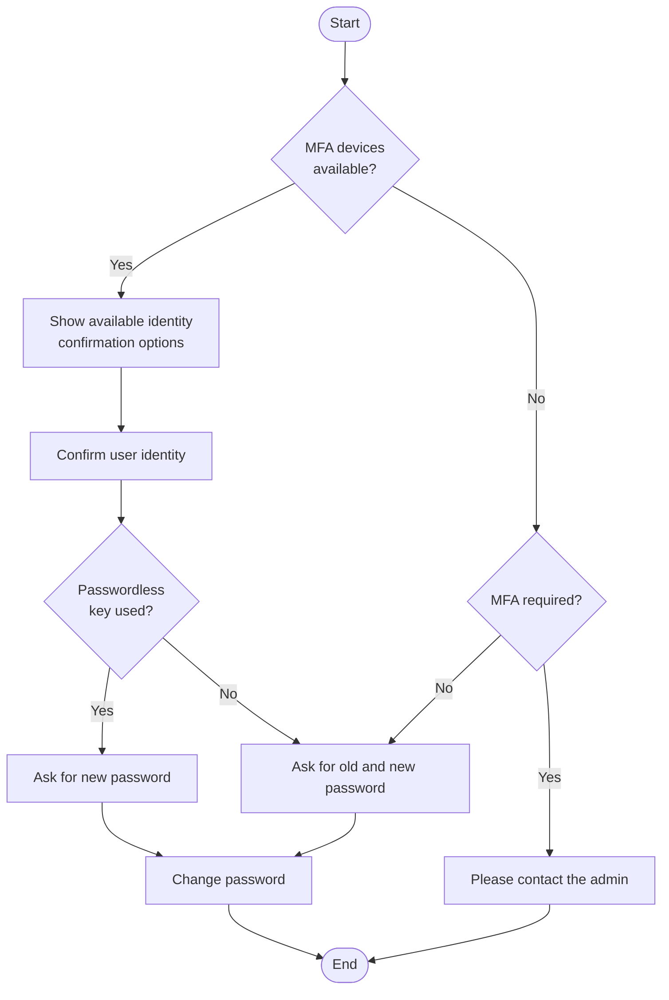

# RFD 0159 - Password Status

## Required Approvers

- Engineering: (@zmb3 || @codingllama)
- Security: @jentfoo
- Product: @roraback

## What

We want to improve the UX of our flows related to changing passwords and management of authentication devices (both MFA and passwordless). The following new features must be supported:

- The user must be able to set password having only passwordless credentials configured.
- We should do our best to indicate which authentication methods a user has configured. Unfortunately, due to past design decisions, we will not be able to do it in every case; see the [Details](#details) section.

## Why

We are [promoting passwordless authentication](https://github.com/gravitational/teleport/issues/19671) and would like to make it a default in our cloud environments. We need to decrease the UX friction and fill the missing gaps.

## Details

For the purpose of this document, we define "passwordless key/token" as a resident WebAuthn key.

Currently, it's impossible to tell whether a user has a password configured. This is because the user always has _some_ password set. If they never set it up themselves, we just use a random 16-character password. As a consequence, when the user wants to set a password, we always ask them for the current one. It makes it impossible to add a password to account that already has a passwordless key configured and doesn't have any current password.

### Changes to the Password Change Flow

When the user wants to change their password, we need to first confirm their identity. Currently, we confirm the user's identity both by asking for the previous password, as well as performing a passkey/MFA token confirmation. To support adding a password where no password is configured, we propose to relax the confirmation conditions and allow setting password with _only_ passwordless token if such one has been used for confirming user's identity.

Rationale: as there is no reliable way to verify that the user actually has a password configured, we _have to_ allow setting a password without providing the current password for those whose password status is unknown (unspecified). We could potentially require current password for those users whose password status is _known_ (see [Recognizing Users Who Configured Their Passwords](#recognizing-users-who-configured-their-passwords)). This, however, is not necessary: if a potential attacker is able to prove their identity using a passwordless key (as opposed to an MFA key or an app token), they already are able to sign in and perform _any_ other action, including adding their own passwordless keys, as well as removing existing passwordless keys of the user under attack. 

The following diagram sums up the modified process:



For clarity, error cases (such as password mismatch or inability to confirm user identity) were omitted from the above diagram.

### Recognizing Users Who Configured Their Passwords

Ultimately, we would like to have information about password status for as many users as possible, for the following reasons:

1. To explicitly tell the user that they have a password configured — for example, on the account settings page.
2. To support any other future feature that might require knowing this information.

To do this, we will extend the [`UserSpecV2`](https://github.com/gravitational/teleport/blob/6103a2b1eff2a6bece80ab138ebe68b4ba041a91/api/proto/teleport/legacy/types/types.proto#L3185) message by adding a `PasswordState` field:

```proto
message UserSpecV2 {
  // ...existing fields...

  PasswordState PasswordState = 11 [(gogoproto.jsontag) = "password_state,omitempty"];
}

enum PasswordState {
  // Unable to tell whether the password has been configured.
  PASSWORD_STATE_UNSPECIFIED = 0;
  // Password is known to be not configured.
  PASSWORD_STATE_UNSET = 1;
  // Password is known to be configured.
  PASSWORD_STATE_SET = 2;
}
```

The flag will be stored under the `/web/users/<username>/params` key, along with the rest of `UserSpecV2` fields.

`PASSWORD_STATE_UNSPECIFIED` is deliberately set to 0, since this is the default value when there's no information about the password state in the database.

The state changes to `PASSWORD_STATE_UNSET` whenever another user (or cluster onboarding flow) creates a password reset token for a given user. These are scenarios when the system becomes confident that the user has no password. As a consequence, users created after this change is made will never have their password in an unspecified state.

The state changes to `PASSWORD_STATE_SET` whenever user sets/resets their password or successfully signs in using a password. The last scenario, in particular, will allow us to gradually fill in information about existing users that have passwords.

> [!WARNING]
> The PasswordState flag should _not_ be used for authentication itself. Attempting to shortcut password verification may open a timing attack vulnerability.

### Returning Password State to the Account Settings UI

The old account settings page had separate paths for managing passwords and MFA devices, so there is no endpoint that would return information about all authentication methods specifically for this page. There is only an endpoint that returns a list of MFA devices.

Since we already return `authType` in `/v1/webapi/sites/<site>/context`, it makes sense to extend the returned data structure with the `PasswordStatus` flag, thus making it appear in the `UserContext` structure on the frontend.

## Alternatives Considered

### Querying the Audit Log

Theoretically, we could reach some degree of confidence about whether the user has a password configured by running a query of the audit events, looking for password authentication events, and mark users who have been authenticating with passwords as having these configured. This, however, has following downsides:

1. It's going to be costly. We don't have a good interface for querying for such events.
2. It's still not going to be 100% reliable. Since audit data is owned by the administrators, we can't be sure about data retention policy. Some log entries may be missing.

### Using a Boolean For the State Flag

We could have used a simple optional boolean value for the `LocalAuthSecrets.PasswordState` field, but it would open us to mistakes in interpreting this parameter, especially on the client side, where JS type coalescing would make it particularly easy to treat null values as false.

### Returning All Account Settings in One API Call

Since the new account UI presents all information on a single screen, we could create an endpoint that returns both MFA devices and the `PasswordStatus` flag in one response. However, the existing structure of the frontend code (separate hooks for managing MFA devices) makes it not necessarily worth it at the moment. We may consider this if we find ourselves in a need of fetching more data points to the account settings page.

### Refraining from Generating Random Passwords

This strategy may be tempting for simplifying the architecture of storing the password configuration flag; however, it may also create a timing-based side channel for detecting user's authentication methods. It's hard to predict how all supported database backends would react to the fact that the password record is simply missing. Since timing may be out of our control, it's better to avoid this possibility and use the same flow all the time.