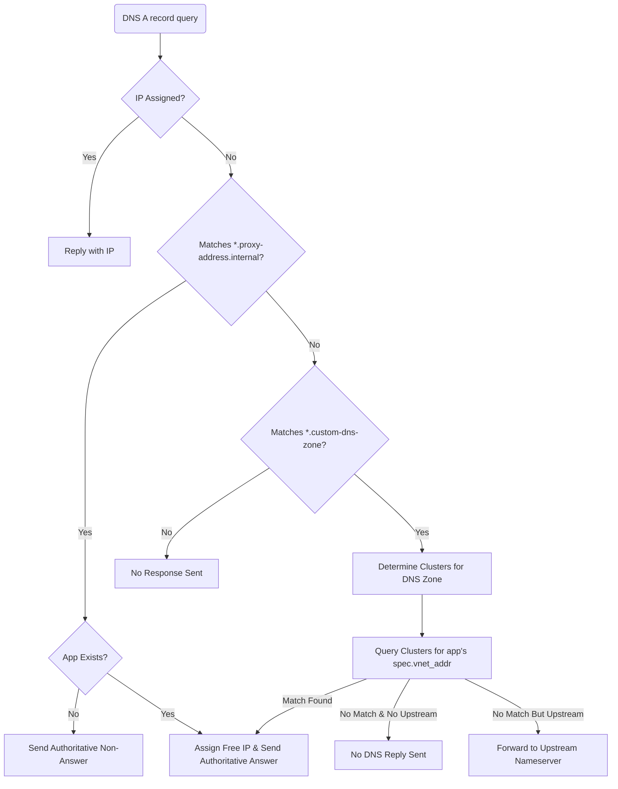
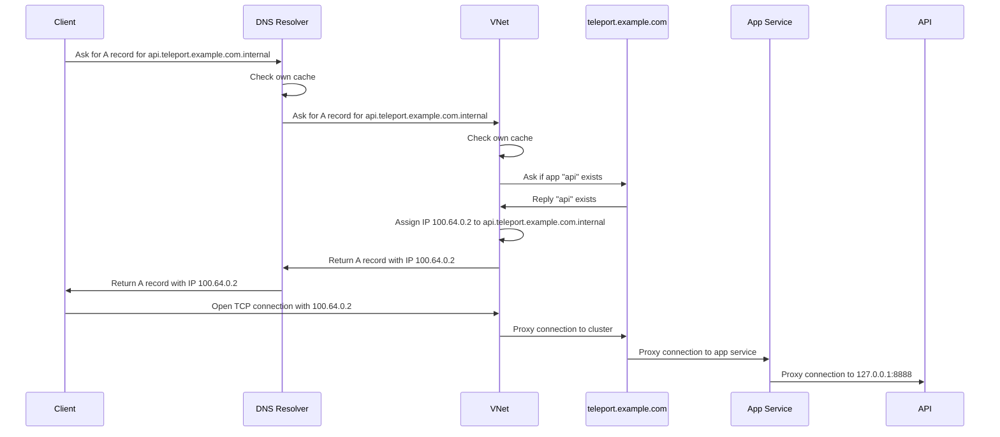

# RFD 163 - Teleport VNet

## What

Teleport VNet creates a virtual IP subnet with DNS that automatically proxies
TCP connections to Teleport apps over fully authenticated tunnels.
After logging in once, users will be able to connect to all of their Teleport
applications at a URL or IP address with zero extra steps.
Scripts and software applications will be able to connect to Teleport-protected
applications as if they were running on the local network without any extra
configuration or even having to know that Teleport is involved.

## Why

Teleport App Access has a pretty good UX for HTTP apps accessed through a web
browser, but the experience isn't up to par outside of the browser.

Today, Teleport users have two choices for accessing Teleport-protected apps and
APIs with non-browser clients:

1. Use a custom TLS certificate and private key with the client and connect to a
   subdomain of the Teleport proxy, e.g. `curl --cert /Users/nic/.tsh/keys/one.teletest.private/nic-app/one.teletest.private/dumper-x509.pem --key /Users/nic/.tsh/keys/one.teletest.private/nic`.
2. Proxy the app to a TCP listener on localhost, e.g. `tsh proxy app dumper --port 8888 & curl 127.0.0.1:8888`

Both of these methods are fairly cumbersome, inflexible, and they may not even
be possible with some clients, especially when needing to connect to many apps
or using custom scripts or software that expects to be able to find these apps
at a regular-old DNS address.
Teleport VNet removes the need for manual management of client certs or tunnels.

## Details

Teleport VNet will run in the background on end-user devices (laptops, workstations).
It will be integrated into Teleport Connect, and may also be available as a
`tsh` command (TBD).

It works by creating a TUN virtual network interface and configuring an IP route
to send all outgoing IP packets in the VNet range through that interface.
In the background, Teleport VNET will handle all incoming TCP connections to the
TUN interface and proxy them to Teleport apps over authenticated tunnels, in
much the same way that the `tsh proxy app` command works today.

The VNET will also host a local DNS service serving custom domain names for all
Teleport-protected apps, and directing the DNS queries for each app to an IP
address in the VNet's virtual IP range assigned to the app in question.

### Domain name assignment

The default VNet domain name for each app will be `<app>.<proxy-public-address>.internal`.
For an app named `api` in a Teleport cluster at `teleport.example.com` this
would look like `api.teleport.example.com.internal`.
Each app will always be accessible at this address.

To add an alternative address, a new `spec.vnet_addr` field will be added on app
resources.
For example, the following app in cluster `teleport.example.com` could be
accessed at both `api.example.com` and `api.teleport.example.com.internal`.

```
kind: app
version: v3
metadata:
  name: api
spec:
  uri: http://localhost:12345
  vnet_addr: api.example.com
```

Because we will use split DNS to configure VNet as a DNS server, if the
`vnet_addr` is NOT suffixed with `<proxy-public-address>.internal` the Teleport
admin will need to statically configure a custom DNS zone in the cluster, see
[custom DNS zones](#custom-dns-zones).

#### Leaf and parallel clusters

A user may be logged in to multiple Teleport Clusters at once, those may be leaf
clusters or completely separate clusters.
Each cluster may include apps with identical names, so including the full proxy
address avoids assigning domain names that will conflict under these conditions.

If the user is accessing an app in a leaf Teleport cluster via a root cluster
they have logged in to, the VNet domain name will use the address of the leaf
proxy.
For an app named `api` in a Teleport cluster at `leaf.example.com` this would
look like `api.leaf.example.com.internal`
This differs conceptually from non-VNet app access where both would use the same
domain name `api.teleport.example.com` because in VNet we cannot use a client
certificate or a cookie to differentiate whether the app is in the root or a
leaf cluster.

In the corner case where a user is logged in to the same cluster both as a leaf
and a root, VNet will prefer to proxy to apps in that cluster as a root.

#### Why `.internal`

Today, by default, apps are publicly reachable at `<app>.<proxy-domain-name>`,
e.g. `api.teleport.example.com`.
That is the URL you would go to in the browser to reach an HTTP app through
Teleport, and it is also usable for TCP app access.
The domain name is expected to resolve to the public address of the Teleport Proxy.
The app at this address is protected by TLS terminated at the Teleport Proxy,
which usually has a publicly trusted wildcard TLS certificate for
`*.teleport.example.com`.

Teleport VNet will avoid overriding or conflicting with this domain name for a
few reasons:

1. To avoid incidentally breaking the currently supported flow if something goes
   wrong with the VNet or it is just not running locally.
1. While the tunnels VNet creates in the background will be authenticated by
   mTLS, local clients will see it as an unauthenticated TCP endpoint.
   When users connect to this domain name in the browser we still want them to
   see that it is protected by TLS.
1. HTTP app domain names are sharable and they can be opened by anyone with an
   account in the same cluster, regardless if they are running VNet or not.

To break the conflict we can add a TLD/suffix to the domain name used in VNet.
ICANN has recently assigned the `.internal` TLD for internal or private use
applications so it seems like the appropriate choice.
https://itp.cdn.icann.org/en/files/root-system/identification-tld-private-use-24-01-2024-en.pdf

### Custom DNS zones

Some users may want to use custom domain names for their apps in VNet.
Maybe they currently access an app on their VPN at `api.example.com` and
they want to migrate off their VPN to Teleport without changing all their
software and scripts that currently reference that name.

To do this they can set the `spec.vnet_addr` field in the app resource to
`api.example.com`, but VNet will also need to know to configure itself as
the DNS server for `*.example.com`, and what to do with other DNS requests
matching `*.example.com` with no matching Teleport app.

To accomodate this the Teleport admin can configure a custom DNS zone
cluster-wide with a new `vnet` Teleport resource:

```yaml
version: v1
kind: vnet
metadata:
  name: vnet
spec:
  custom_dns_zones:
  - suffix: .example.com
    upstream_nameservers:
    - 1.2.3.4
    - 4.5.6.7
  - suffix: .test.com
```

In this example, whenever the user is logged in to the cluster where this `vnet`
configuration resource is present, VNet will install itself as the DNS
nameserver for `*.example.com` and `*.test.com`.
Because there are no configured upstream nameservers for `*.test.com`, the VNet
DNS server will not respond to DNS requests for any invalid teleport app.

### DNS queries and IP address assignment

This design tries to avoid making the VNet client maintain an up-to-date list of
all apps in all clusters with assigned IPs.
To that end, IPs will be dynamically assigned to apps the first time DNS is
queried for that app.

The VNet process will build a reverse mapping from each proxy public access and
custom DNS zone to the cluster they belong to.
This will be updated whenever the user logs in to a new cluster.
When any DNS query is received the process is as follows:

1. If an IP address is already assigned to the full queried name, an
   authoritative answer will be sent with that IP.
   These IP assigments will not expire, if the app no longer exists that error
   will be handled when the TCP request is made to that IP.
1. If the name matches any `<app-name>.<proxy-address>.internal` we will query
   the matching cluster to see if the app actually exists.
    1. If the app does not exist, the DNS server will respond with an
       authoritative non-answer to indicate this is not a valid name.
    1. If the app does exist, a free IP will be assigned to it and it will be
       returned in an authoritative answer.
1. If the name matches `*.<custom-dns-zone>`:
    1. VNet will determine which clusters the matching custom DNS zone is in
       from its local state.
    1. VNet will query each clusters apps to see if any have a `spec.vnet_addr`
       matching the full name.
       This will use a predicate expression to do the filtering server-side and
       avoid listing all apps.
       In the unlikely case that 2 or more clusters have identical custom DNS
       zones with identital `vnet_addr`s, one will be chosen arbitrarily.
    1. If a match is found a free IP will be assigned to that app and it will be
       returned in an authoritative DNS answer.
    1. If no match is found and the zone has no `upstream_nameservers` configured,
       no DNS reply will be sent.
    1. The full DNS query will be forwarded to one of the `upstream_nameservers`
       for the custom DNS zone, selected randomly from the list, and any
       upstream response will be returned to the client verbatim.
       We may implement caching of upstream responses, in some cases the
       downstream resolver will do its own caching, we'll experiment with this.
1. If the name did not match any `<proxy-address>.internal` or custom DNS zone,
   no response will be sent.

Here is a flow chart for the above sequence:



Here is a seqence diagram for an example VNet session:



### IP range

By default IPv4 addresses will be assigned from the carrier-grade NAT range
`100.64.0.0/10`.
There are 4 million IP addresses in this range so exhaustion won't be a concern.
Since VNet IPs will only be used locally on end user machines this range is
quite unlikely to conflict with any valid public or private IP addresses, unless
another VPN client is being used that happens to use the same range.
For example, tailscale also uses this range.
This range can be overriden with a cluster-wide configuration.

```yaml
version: v1
kind: vnet
metadata:
  name: vnet
spec:
  cidr_range: 100.64.0.0/10
```

We will support IPv6 as well.
TODO: decide how to assign IPv6 IPs.

#### IP access without DNS

If a client wishes to access a Teleport app over VNet but their client does not
accept a domain name and only an IP, there are two ways this can be handled.

The first option is the user can simply ping to domain name to cause VNet to
assign an IP to the app, and then they may use that IP.

```shell
$ ping api.teleport.example.com.internal
PING api.teleport.example.com.internal (100.64.0.4): 56 data bytes
$ curl 100.64.0.4
```

Another option would be to support static configuration of an IP that will
always be assigned to an app.
This may be desirable by some users used to accessing an app at a static IP, but
the implementation would have many corner cases and could be fragile so we would
prefer not to support this in the initial implementation.

### TCP ports

Local app proxies today each listen on a unique TCP port on `127.0.0.1`.
With VNet we will assign a unique IP address to each app with the full TCP port
range available.

The reason we need to assign an IP per app, instead of having many apps on the
same IP but different ports, is that DNS only assigns an IP to each domain name
with no port, so there would be no good way for the client to discover the port
we assigned to the app.

To keep configuration as simple as possible, and because we can, the default
behavior of VNet will be to proxy TCP connections from ANY port to the app
assigned to the IP.
This way clients can use the port they expect for the app protocol, or any port
they like, with no extra configuration or need to figure out exactly which port
to use.

The exception to this is if the configured `vnet_addr` for the app explicitly
includes a port then VNet will only handle connections on that port.
This will allow multiple Teleport apps to be configured on different ports at
the same address.
For example, the following configuration would make both ports 80 and 443
available for `app.example.com`.
VNet would assign the same IP address to both of these apps because they have
the same `vnet_addr` only differing by port.

```yaml
kind: app
metadata:
  name: https-app
spec:
  uri: tcp://127.0.0.1:443
  vnet_addr: app.example.com:443
---
kind: app
metadata:
  name: http-app
spec:
  uri: tcp://127.0.0.1:80
  vnet_addr: app.example.com:80
```

### Host configuration

Vnet will need to create a TUN interface, assign an IP to it, add a route to the
routing table, and configure VNet as a DNS nameserver.

To create the TUN interface we will import `golang.zx2c4.com/wireguard/tun`
which provides cross-platform methods for creating TUN interfaces and reading
from + writing to them.
It supports MacOS, Windows, and Linux.

The following applies to MacOS only, we will have other platform-specific
methods when we add support for Windows and Linux.

To assign an IP address to the interface, we will use `os/exec` to run the
`ifconfig` command:

```shell
ifconfig utun4 100.64.0.1 100.64.0.1 up
```

To assign an IP route to use the TUN interface, we will use `os/exec` to run the
`route` command:

```shell
route add -net 100.64.0.0/10 -interface utun4
```

To configure split DNS, we will add the VNet DNS server to files under
/etc/resolver:

```shell
$ # cluster with proxy at teleport.example.com and custom DNS zone example.com
$ ls /etc/resolver/
teleport.example.com.internal example.com
$ cat /etc/resolver/teleport.example.com.internal
nameserver 100.127.100.127
$ cat /etc/resolver/example.com
nameserver 100.127.100.127
```

All system configuration must run as a privileged user (root).
In the demo implementation we are using an Applescript wrapper to call a child
process as root, alternatives are considered under [lifecycle](#lifecycle).
The child admin process will still be the `tsh` binary, just called with
arguments to do the host setup.
See the UX section for more details on the admin process.

The first version of VNet will only support MacOS so this is written with that
in mind, but we can implement this in a similar way for Windows and Linux.

### Security

There are certainly security implications of effectively creating
pre-authenticated TCP listeners for every app in your Teleport cluster.
Any software running on the user's machine could freely access any app.

However, this is not much different that what we already support today with
`tsh proxy app`, anything can connect to that authenticated tunnel as well.
Not to mention that the user's private key is stored at `~/.tsh` and can be used
to access anything the user can access as well.

VNet is purely a client-side convenience the effectively automates what you can
already do by creating TCP proxies for all apps.
It is built on top of Teleport's security principals like short-lived
certificates, device trust, passwordless authentication, and MFA.

VNet does not add much extra attack surface unless the user's laptop is already
compromised.

### UX

VNet is available in both tsh and Teleport Connect. This section focuses mostly on VNet integration
in Teleport Connect, with a short subsection on VNet in tsh at the end.

Attempting to connect to a TCP app opens the VNet tab instead. When the VNet app is opened this way,
it gives the user an option to either start VNet or open a standard local proxy instead.

Web apps continue to launch through the proxy service. The three dot menu next to web apps gains a
new action called "Open through VNet". If VNet is running, it opens the app VNet address in the
browser. If VNet is not running, it opens the VNet tab saying "You can open dumper and other apps
through VNet". After VNet starts, the message becaumes "dumper is available at
dumper.teleport.private" with either a link or a button to open the address in the browser.

TODO: Dedicated button in top left with status indicator.

#### Lifecycle

The first version of VNet integration in Connect is going to behave similarly to Connect My
Computer. After the user starts VNet and until they explicitly stop it, VNet will start
automatically when launching the app. It will prompt for password for admin privileges through
osascript on each start. This requires the given system user to be an admin, disqualifying cases
where the user is just a standard macOS account.

Unfortunately, [Touch ID prompts are reserved for Apple
clients](https://forums.developer.apple.com/forums/thread/701118?answerId=705661022#705661022). We
assume that typically the user is going to start VNet and then just leave it running, somewhat
negating the downside of having to enter credentials on each start.

##### Considered alternatives

Tying the lifecycle of VNet to the lifecycle of Connect gets us past the problem of needing root
privileges to create a TUN device and lets us focus on validating VNet as a tool. However, there is
a couple of different approaches we could take which offer better UX at the cost of development
time.

###### Launch VNet on system start

Doing so would require some kind of persistent UI that is also launched on system start, think an
app in the Menu Bar. The UI would need to enable the user to manage the state of VNet and provide a
way to refresh expired certs. Connect could support headless mode where it does not open the main
window automatically and instead launches a separate frontend app which handles relogin.

###### Ask for admin privileges just once

The recommended way for an unprivileged app to use privileged APIs is to use
[`SMAppService`](https://developer.apple.com/documentation/servicemanagement/smappservice).
`SMAppService` allows the unprivileged app to add a privileged launch daemon to launchd. That daemon can be
launched on demand from the unprivileged, do its work and then shut down, without having to enter
credentials each time. The daemon lives in the app bundle and is automatically cleaned up when the
user removes `Teleport Connect.app`.

With `SMAppService`, there are two main problems to figure out:

* How to call this Swift API in the first place.
  * Do we need to build our own simple app just to register a daemon for the main app?
* How to securely communicate with the daemon.
  * Communication is typically done through XPC, as shown in [the example
    app](https://developer.apple.com/documentation/servicemanagement/updating-your-app-package-installer-to-use-the-new-service-management-api).
    How viable it is to use it from Go?
  * Secure communication can be achieved through [environment
    constraints](https://developer.apple.com/videos/play/wwdc2023/10266/) by enforcing that only
    programs signed by us can interact with the daemon.
  * Is gRPC a viable alternative here?

The main benefit of using `SMAppService` is the aforementioned single prompt for root privileges.
It's also possible that VNet could be made to work in an environment where the system user is just a
standard user by delegating daemon registration to an admin. `SMAppService` could be used from
within tsh as well, but the user would need to use the signed version of tsh.

Given that using `SMAppService` is much more complex than calling osascript, implementing
`SMAppService` is a good candidate for a future version of VNet.

#### tsh integration

TODO

### Proto Specification

TODO

### Backward Compatibility

We will not be changing or interfering with existing app access to backward
compatibility is not an issue.

### Audit Events

This is purely a client-side UX improvement so no audit events will be added.

### Observability

TODO

### Product Usage

TODO

### Test Plan

Manual testing of VNet with multiple clusters and custom DNS zones will be added
to the test plan.
