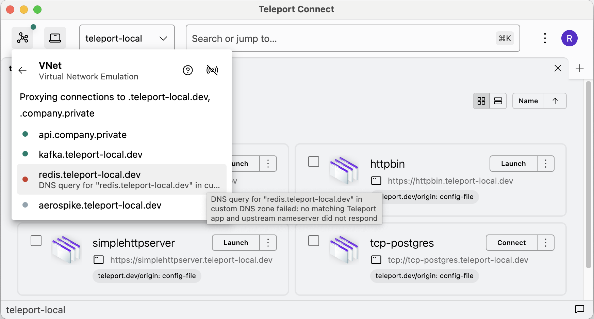

# RFD 163 - Teleport VNet

## Required Approvals

* Engineering: @zmb3 && @rosstimothy
* Product: @klizhentas
* Security: doyensec

## What

Teleport VNet creates a virtual IP subnet with DNS that automatically proxies
TCP connections to Teleport apps over fully authenticated tunnels.
After logging in once, users will be able to connect to Teleport applications at
their public domain name.
Scripts and software applications will be able to connect to Teleport-protected
applications as if they were connected to a VPN without any extra configuration
or even having to know that Teleport is involved.

## Why

Teleport App Access has a pretty good UX for HTTP apps accessed through a web
browser, but the experience isn't up to par outside of the browser.

Today, Teleport users have two choices for accessing Teleport-protected apps and
APIs with non-browser clients:

1. Use a custom TLS certificate and private key with the client and connect to a
   subdomain of the Teleport proxy, e.g. `curl --cert /Users/nic/.tsh/keys/one.private/nic-app/one.private/dumper-x509.pem --key /Users/nic/.tsh/keys/one.private/nic https://app.one.private`.
2. Port forward the app on a localhost TCP listener, e.g.
   `tsh proxy app dumper --port 8888 & curl 127.0.0.1:8888`

Both of these methods are fairly cumbersome, inflexible, and they may not even
be possible with some clients, especially when needing to connect to many apps
or using custom scripts or software that expects to be able to find these apps
at a regular-old DNS address.
Teleport VNet removes the need for manual management of client certs or tunnels.

## Details

Teleport VNet will run in the background on end-user devices (laptops).
It will be integrated into Teleport Connect, also be available as a `tsh`
command.

It works by creating a TUN virtual network interface and configuring an IP route
to send all outgoing IP packets in the VNet IP range through that interface.
In the background, Teleport VNET will handle all incoming and outgoing IP
packets for the TUN interface.

VNet will also host a local DNS service providing name resolution for all
Teleport-protected apps, assigning them IP addresses in the VNet range.

To implement TCP and UDP we will leverage the userspace networking stack from
gVisor "gvisor.dev/gvisor/pkg/tcpip/stack", which is a Go library available
under the Apache 2.0 license.

When VNet accepts a UDP message on an address assigned to its internal DNS
server, it will check if the domain name matches the `public_addr` of any TCP
app, and assign an IP address to that app.

When VNet accepts a TCP connection on an address assigned to an app, it will
proxy the connection to the app over an authenticated tunnel, in much the same
way that `tsh proxy app` works today.

### Protocols

VNet will initially support TCP application access.
TCP apps are any app with a `spec.uri` starting with `tcp://`.
VNet will proxy all TCP connections directly from clients to the application
unaltered.
If the destination app is a TLS server, the client may connect to it over TLS.
Any custom protocol over TCP is supported.

HTTP apps (any app with a `spec.uri` starting with `http://` or `https://`) will
not be made accessible through VNet without authentication.
They will continue to be accessible over HTTPS from the browser as they are
today, with a web login.
We can consider adding VNet support for HTTP app access in the future, but we
don't have a good solution for providing HTTPS access.

We could consider UDP support, but app access does not support UDP at all right
now, so UDP access will be out of scope for this RFD.
The UDP networking protocol will be supported for serving DNS requests only.

We can explore the possibility of supporting Kubernetes and Database access in
future versions, but these protocols come with additional challenges.
We would need different certs to access a single database depending on the db
username, database name, etc.
Would we expose each at a different domain name?
There may be similar challenges for kubernetes user and group impersonation.
Currently these parameters are accepted at the `tsh proxy` command but VNet
has no similar mechanism available.

### Domain name assignment

When resolving DNS queries, VNet will search for an app with `spec.public_addr`
exactly matching the name in the query.
If a matching TCP app is found, it will be assigned an IP address in the VNet IP
range and the DNS query will resolve to that address.

The default value for an app's `spec.public_addr` is `<app-name>.<proxy-public-address>`,
but that can be overridden with any value by a cluster admin.
For an app named `api` in a Teleport cluster at `teleport.example.com` this
would look like `api.teleport.example.com` by default.

Because we will use split DNS to configure VNet as a DNS server only for
specific subdomains, if an overridden `spec.public_addr` is NOT suffixed with
the proxy's public address an admin will need to configure a custom DNS zone in
the cluster, see [custom DNS zones](#custom-dns-zones).

### Custom DNS zones

Some users may want to use custom domain names for their apps.
Maybe they currently access an app on their VPN at `api.example.com` and
they want to migrate off their VPN to Teleport without changing all their
software and scripts that currently reference that name.
To do this they can set the `spec.public_addr` field in the app resource to
`api.example.com`.

We do not want the VNet DNS server to be resolving all DNS requests on the host
and searching all clusters for apps with a matching `public_addr` on every
request, this would introduce too much latency to unrelated DNS queries.
To avoid this we will add cluster-level configuration of custom DNS zones which
will be used to narrow the scope of:

1. The split DNS configuration on the host that determines which DNS queries
   will be sent to VNet.
2. Which Teleport clusters should be searched for matching apps when a DNS query
   is received.

When custom addresses are desired the Teleport admin can configure a custom DNS
zone with a new singleton `vnet_config` Teleport resource:

```yaml
version: v1
kind: vnet_config
metadata:
  name: vnet_config
spec:
  custom_dns_zones:
  - suffix: example.com
  - suffix: goteleport.com
```

In this example, whenever the user is logged in to the cluster where this `vnet_config`
configuration resource is present, VNet will install itself as the DNS
nameserver for subdomains of `example.com` and `goteleport.com`.
When the DNS server receives a query for any subdomain of those suffixes, it
will search the cluster for an app with a matching `public_addr`.

In the interest of being good citizens of the internet and to avoid hijacking
DNS resolution for domains which do not wish for us to do so, VNet will not
resolve requests for names under a custom DNS zone unless that zone contains a
specific DNS TXT record.
This TXT record must include the value `teleport-cluster=<proxy-address>`, e.g.
`teleport-cluster=teleport.example.com`.
If a single DNS zone is to be served by VNet in multiple Teleport clusters,
multiple TXT records can be configured on the domain, one for each cluster.
VNet will look up this TXT record with at the default nameservers configured in
the client OS, so the records should be public or available to all clients.

So if your Teleport proxy is hosted at `teleport.example.com` and you want
`api.example.com` to be resolvable within VNet, you need:

1. The app registered in Teleport must have `public_addr: api.example.com`.
2. The following `vnet_config` resource:
   ```
   version: v1
   kind: vnet_config
   metadata:
     name: vnet_config
   spec:
     custom_dns_zones:
     - suffix: example.com
   ```
3. The following DNS TXT record on `example.com`: `teleport-cluster=teleport.example.com`.

#### Leaf and parallel clusters

A user may be logged in to multiple Teleport Clusters at once, those may be leaf
clusters or completely separate clusters.

When resolving a DNS query, VNet will search all clusters where the proxy
address or any custom DNS zone in the cluster is a suffix of the queried name.

For apps in leaf clusters, VNet will still use the `public_addr` of the app even
if it is the default `public_addr` which includes the address of the leaf
cluster.
This differs conceptually from non-VNet app access where leaf apps would use the
name `<app-name>.<root-proxy-address>`.
This is convenient for the implementation and helps to avoid conflicts in cases
where an app with the same name exists in both a root and leaf cluster.
If both apps used `<app-name>.<root-proxy-address>` there would be no way to
resolve which to connect to like there is in the web where a TLS client
certificate or a session cookie can be used to differentiate the two.

To avoid conflicts between multiple clusters where the `spec.public_addr` of two
apps are identical, VNet will refuse to resolve names for any overlapping custom
DNS zones across clusters the user is currently logged in to.

In the corner case where a user is logged in to the same cluster both as a leaf
and a root, VNet will prefer to proxy to apps in that cluster as a root.

### DNS queries and IP address assignment

This design tries to avoid making the VNet client maintain an up-to-date list of
all apps in all clusters.
To that end, we will look up each app dynamically the first time DNS is queried
for its `public_addr`, and assign an IP to it at that time.
When handling a query for an A record, an IPv4 address will be assigned,
likewise for AAAA queries an IPv6 address will be assigned.
An app may have both an IPv4 and IPv6 address assigned to it.

The VNet process will build a reverse mapping from each proxy public access and
custom DNS zone to the Teleport cluster it belongs to.
This will be updated whenever the user logs in to a new cluster.
When any DNS query is received the process is as follows:

1. If an IP address is already assigned to the full queried name, an
   authoritative answer will be sent with that IP.
   These IP assigments will not expire for the lifetime of the VNet process.
   If the app no longer exists that error will be handled when a TCP request is
   made to that IP.
1. If the name matches `*.<proxy-address>` we will query
   the matching cluster to see if the app actually exists.
    1. If the app does exist, a free IP will be assigned to it and it will be
       returned in an authoritative answer.
    1. If the app does not exist, the full DNS query will be forwarded to the
       hosts' default nameservers, and any upstream response will be returned to
       the client.
1. If the name matches `*.<custom-dns-zone>`:
    1. VNet will determine which cluster the matching custom DNS zone is in from
       its local state.
    1. VNet will query the cluster to see if any apps have a `spec.public_addr`
       matching the full name.
       This will use a predicate expression to do the filtering server-side and
       avoid listing all apps.
    1. If a match is found a free IP will be assigned to that app and it will be
       returned in an authoritative DNS answer.
    1. If no match is found the full DNS query will be forwarded to the hosts'
       default nameservers, and any upstream response will be returned to the
       client.
1. If the name did not match any proxy address or custom DNS zone, the full DNS
   query will be forwarded to the hosts' default nameservers, and any upstream
   response will be returned to the client.

On MacOS we will find the hosts' default nameservers by parsing `/etc/resolv.conf`.

Here is a flow chart for the above sequence:


Here is a seqence diagram for an example VNet session:


### IP range

VNet will assign a unique IPv4 and IPv6 address to each Teleport TCP app the
first time DNS is queried for it.
These IPs are purely local to the client machine, and are not expected to match
between two different clients.

Assigning IPs at the cluster level would quickly get tricky, especially given
that the user can log in to multiple profiles or trusted clusters, and the only
state for many apps is a heartbeat written by an app server which can be
transient.

#### IPv4

VNet IP addresses are only ever used locally on a single device for applications
connecting to the virtual TUN interface.
Because these IPs do not need to be routable or advertised outside of the client
machine, this gives us with essentially two options:
1. Use a subset of one of the private IP ranges `10/8`, `172.16/12`, or `192.168/16`
   as defined in [RFC 1918](https://datatracker.ietf.org/doc/html/rfc1918).
2. Use the carrier-grade NAT shared address space `100.64/10` defined in
   [RFC 6598](https://datatracker.ietf.org/doc/html/rfc6598).

There is some prior art for using the carrier-grade NAT (CGNAT) shared address
space for our intended purpose, it is already in use by other VPN-replacement
apps such as [tailscale](https://tailscale.com/) and [Enclave](https://enclave.io/).

VNet will use the CGNAT range by default, but we will make it configurable at
the cluster level in case this conflicts with any customer's network.

The primary reason for using the CGNAT range is to avoid IP and route conflicts
with the RFC 1918 private address spaces that are very commonly used in
enterprises already.
There are 4 million IP addresses in this range so exhaustion won't be a concern.
This range can be overriden with a cluster-wide configuration.

One downside of using the CGNAT range is that the Chromium web browser does not
currently consider it a private address space for the purposes of CORS
protections against DNS rebinding attacks.
See [DNS rebinding](#dns-rebinding).

Configuring a custom IP range at the cluster level would look like:

```yaml
version: v1
kind: vnet
metadata:
  name: vnet
spec:
  cidr_range: "100.64.0.0/10"
```

#### IPv6

VNet will assign apps Unique Local IPv6 Unicast Addresses (ULA) as defined in
[RFC 4193](https://datatracker.ietf.org/doc/html/rfc4193).
They have the following format:

      | 7 bits |1|  40 bits   |  16 bits  |          64 bits           |
      +--------+-+------------+-----------+----------------------------+
      | Prefix |L| Global ID  | Subnet ID |        Interface ID        |
      +--------+-+------------+-----------+----------------------------+

The Prefix + L will always be the ULA prefix `fd`.

The Global ID will be randomly generated on VNet startup by pulling 40 bits from
`crypto/rand`.

The Subnet ID will be hardcoded to 0.

The 64-bit Interface ID will be the IPv4 address assigned to the app, prefixed
with zeros.

An example IPv6 VNet address with a Global ID of `0xec146c95f6` and a related
IPv4 address of `100.64.0.2` would look like `fdec:146c:95f6::6440:2`.
A route would be configured on the host for the `fdec:146c:95f6::/64` CIDR
range.
The CIDR range will not be configurable for IPv6.

#### IP access without DNS

If a client wishes to access a Teleport app over VNet but their client does not
accept a domain name and only an IP, there are two ways this can be handled.

The first option is the user can first ping the domain name to cause VNet to
assign an IP to the app, and then they may use that IP.

```shell
$ ping api.teleport.example.com
PING api.teleport.example.com (100.64.0.4): 56 data bytes
$ curl 100.64.0.4
```

Another option would be to support static configuration of an IP that will
always be assigned to an app.
This may be desirable by some users used to accessing an app at a static IP, but
the implementation would be more challenging and fragile so we'll prefer not to
support this in the initial implementation.
For example, it's not clear what to do when a new app is added with a static IP
address that has already been assigned to another app.
VNet would also need to handle incoming TCP connections on all addresses and
then search all clusters for an app with a static IP matching that address, or
else we would need to maintain an up to date set of all apps in all clusters.

### TCP ports

Local app proxies today each listen on a unique TCP port on `127.0.0.1`.
With VNet we will assign a unique IP address to each app with the full TCP port
range available.

The reason we need to assign an IP per app, instead of having many apps on the
same IP but different ports, is that DNS only assigns an IP to each domain name
with no port, so there would be no good way for the client to discover the port
we assigned to the app.

To keep configuration as simple as possible, and because we can, the default
behavior of VNet will be to proxy TCP connections received on ANY port to the app
assigned to the IP.
All outgoing TCP dials to the app from the app service will still be made to
the single port specified in the app's `spec.uri`, this is not exposing any
additional ports from the app, it just allows clients to dial any port and have
it reach the app.
This way clients can use the port they expect for the app protocol, or any port
they like, with no extra configuration or need to figure out exactly which port
to use.

### Host configuration

VNet will need to create a TUN interface, assign an IP to it, add a route to the
routing table, and configure VNet as a DNS nameserver.

To create the TUN interface we will import `golang.zx2c4.com/wireguard/tun`
which provides cross-platform methods for creating TUN interfaces and reading
from and writing to them.
It supports MacOS, Windows, and Linux.

The following applies to MacOS only, we will have other platform-specific
methods when we add support for Windows and Linux.

To assign an IP address to the interface, we will use `os/exec` to run the
`ifconfig` command:

```shell
ifconfig utun4 100.64.0.1 100.64.0.1 up
```

To assign a IP routes to use the TUN interface, we will use `os/exec` to run the
`route` command:

```shell
route add -net 100.64.0.0/10 -interface utun4
route add -inet6 fdec:146c:95f6::/64 -interface utun4
```

To configure split DNS, we will add the VNet DNS server to files under
`/etc/resolver` for each cluster the user is logged in to and each custom DNS
zone.
This will be updated each time the user logs in to a new cluster while VNet is
enabled.

```shell
$ # cluster with proxy at teleport.example.com and custom DNS zone example.com
$ ls /etc/resolver/
teleport.example.com example.com
$ cat /etc/resolver/teleport.example.com
nameserver 100.127.100.127
$ cat /etc/resolver/example.com
nameserver 100.127.100.127
```

The first version of VNet will only support MacOS so this is written with that
in mind, but we can implement this in a similar way for Windows and Linux.

#### Daemon

All system configuration must run as a privileged user (root). To achieve that, VNet starts a daemon
with `tsh vnet daemon` that runs as root, a Launch Daemon in macOS terms. The daemon handles
creating a TUN device (and passing back its [file descriptor over a gRPC
connection on Unix-like systems](https://pkg.go.dev/github.com/edwarnicke/grpcfd) or [GUID on
Windows](https://github.com/WireGuard/wireguard-go/blob/12269c2761734b15625017d8565745096325392f/tun/tun_windows.go#L66-L68))
as well as DNS configuration.

The main reason behind adding a daemon is that otherwise we'd be forced to prompt for a password
each time we need to carry out privileged operations.

On macOS, the daemon is added through [`SMAppService`](https://developer.apple.com/documentation/servicemanagement/smappservice?language=objc)
and a plist that lives inside the app bundle. This has two nice properties. First, the daemon and
the plist are signed by us, preventing 3rd parties from making any changes. Second, since the daemon
plist lives in the app bundle, it is automatically removed when the user removes tsh.app or Teleport
Connect.app.

`SMAppService` requires macOS 13.0+. Since it only works with signed packages, in development we can
substitute it with an osascript wrapper that runs the gRPC server as root and shuts down with the
parent process.

The daemon allows other processes to talk to it through a gRPC service available over a Unix socket
at `/var/run/teleport-vnet.socket`. Once the daemon establishes a listener on that socket, it chmods
the socket to 666 to allow unprivileged processes to use the gRPC service. Since [launch daemons on
macOS run in the system context](https://developer.apple.com/library/archive/documentation/MacOSX/Conceptual/BPSystemStartup/Chapters/DesigningDaemons.html#//apple_ref/doc/uid/10000172i-SW4-SW5)
and the daemon plist is going to be embedded within the app, we found no feasible way of restricting
access to the daemon only to the current logged in user before communication happens. As such, we
can restrict access to the daemon only after a user communicates with the daemon.

The daemon allows only one VNet TUN device to be active at a time. When a client connects to the
gRPC service and requests the creation of a TUN device, the daemon saves [pid and uid of the
client](https://pkg.go.dev/github.com/tailscale/peercred) (how to do this on Windows is outside of
the scope of this RFD). Until the client explicitly tells the daemon to stop or the client process
exits, no other client can create a TUN device.

The daemon allows changing the nameserver of an arbitrary DNS zone to that of VNet. This is needed
so that we can update the DNS config as user logs in and out of clusters.

The daemon will be registered on the first VNet launch, meaning it will get added to launch items
and the user will have to accept it as an admin. After that, the daemon automatically starts on each
system launch. It doesn't do anything by itself, other than setting up the gRPC server.

### VNet manager

VNet manager will be started either by tsh or Connect, depending on how the user starts VNet.

It will watch or poll the contents of the `TELEPORT_HOME` directory for currently active Teleport
profiles. The manager will create clients for all currently logged-in profiles and all of
their leaf clusters that the user can access.
For each cluster, it will fetch the `vnet_config` resource to discover all custom DNS zones and CIDR ranges.
It will then configure the host IP routes and split DNS accordingly through the daemon.

When the user logs out of a profile and it's deleted from `TELEPORT_HOME`, the
relevant DNS configuration and IP routes will be removed.
This will NOT happen when the user certs merely expire so that the non-admin
process can prompt the user to re-login.

The manager will clean up all configuration and exit when the parent
process exits.

### Security

There are certainly security implications of effectively creating
pre-authenticated TCP listeners for every TCP app in a Teleport cluster.
Any software running on the user's machine could freely access any app.
However, this is not much different that what we already support today with
`tsh proxy app`, anything can connect to that authenticated tunnel as well.

VNet is purely a client-side convenience that effectively automates what you can
already do by creating TCP proxies for all apps.
It is built on top of Teleport's security principals like short-lived
certificates, device trust, passwordless authentication, and MFA.

It will not be possible for external traffic to access the host over VNet.
The only IP packets that VNet will send to the host OS will be replies to
outgoing TCP connections that have been made to Teleport apps, and DNS answers.

#### Other OS users

If a user sets up VNet on a multi-user machine, any other OS user on the machine would be able to access
Teleport apps over VNet.

If we wanted to prevent this on linux we might be able to look up who owns the process initiating the TCP
connection by checking some info under `/proc`.
But we would need to be root and currently we are not planning to run the main VNet server process as root.

We will warn users that VNet should not be used on multi-user machines.

#### DNS rebinding

Because VNet will expose Teleport protected apps on the local machine without
any per-connection client authentication, we need to be careful that they cannot
be reached by untrusted code.

One source of untrusted code that often runs on a user's machine is Javascript
executed in the web browser.
Web browsers apply CORS protections to ensure that Javascript cannot access
arbitrary web addresses outside the domain that the JS code originated from.
However, CORS does not protect plain HTTP websites from DNS rebinding attacks,
where the attacker's website dynamically changes its IP address to the address
of a website it wishes to make illegitimate HTTP requests to.

Here's an example scenario:

- The TCP app `api.teleport.example.com` is listening for plain HTTP connections.
- VNet assigns the address `100.64.0.2` to the app.
- The user clicks a link to `hacker.example.com` which first resolves to a
  public IP address with a very short TTL.
- The web browser loads and executes the Javascript from `hacker.example.com`.
- `hacker.example.com` "rebinds" its DNS address to `100.64.0.2`.
- The Javascript for `hacker.example.com` makes a POST request to
  `http://hacker.example.com/path`.
- The browser will resolve the address of `hacker.example.com` to `100.64.0.2`
  and the POST request will actually be sent to the `api.teleport.example.com`
  app, authenticated as the user!

This attack vector will only be relevant to apps listening for plain,
unauthenticated HTTP connections that have been enrolled as TCP apps in the
Teleport cluster (with a `spec.uri` prefix of `tcp://`).
Hopefully this will be a very limited scenario.

Normally, apps listening for HTTP that are meant to be opened in a web browser
should be enrolled as web apps with a `spec.uri` prefix of `http://`, these
won't be affected because VNet will not expose them and they will only be
accessible over HTTPS.
However, it could be desirable to access REST APIs over VNet, in this case they
must be enrolled as a TCP app if they are to be accessed by non-browser clients.

In case a Teleport admin does choose to enroll a plain HTTP app in their cluster as
a TCP app, there are a few possible mitigations for this DNS rebinding attack
scenario.

1. Apply `Host` header allowlists for HTTP apps.
2. Make VNet the global DNS nameserver on the host and reject any forwarded
   queries that resolve to a VNet address or CNAME for a VNet name.
3. Use a private IP range for VNet IPv4 addresses.
4. Drop IPv4 and only support IPv6.

`Host` header allowlists can be implemented on the app side when HTTPS is not an
option, to only allow incoming requests where the `Host` header matches an
expected list of values.
Javascript loaded from `hacker.example.com` would have a mismatched `Host`
header and would not be allowed to make a request.
We can't handle do this in VNet directly unless we tried to parse every incoming
TCP connection as an HTTP request, which is generally not the case.
Instead, the onus would be on the app deployer to implement this.

Making VNet the global nameserver and rejecting any responses to forwarded
queries that resolve to VNet addresses or names could potentially be very
effective and I believe it's the only way we could get complete protection from
DNS rebinding attacks.
However, it would require VNet to handle every DNS query on the host and to
parse every recursively resolved DNS response, which is otherwise unecessary.
Checking if a CNAME answer is a match for a `spec.public_addr` in a custom DNS
zone may also require us to send a query to the Teleport Proxy to see if that
app exists.
This feels error-prone and would slow down all unrelated DNS queries on the
user's machine, I (nklaassen) don't think we should implement it (atleast in V1).

Using a "private" IP range could partially protect us against DNS rebinding
because Chromium already partially implements
[Private Network Access](https://wicg.github.io/private-network-access/#ip-address-space-heading)
protections.
This would prevent Javascript from the attacker's public IP address from making
any requests to a private IP address.
Actually, the draft spec already includes the CGNAT range as "private", but
unfortunately Chromium does not recognize this yet (I have tested this).
I have not tested other web browsers.
I (nklaassen) don't think we should switch to an RFC 1918 range by default because:
- protection for the CGNAT range appears to be already on its way according to the draft PNA spec
- it's likely that any RFC 1918 range we choose will conflict with existing customer networks, see [ip range](#ip-range).

The IPv6 ULA addresses VNet will be using are already partially protected due to
Chromium's current partial PNA implementation mentioned above (they are already
considered private).
Dropping IPv4 support could therefore give us more protection until CGNAT is
considered private as well.
However, there is a risk that some client software will not support IPv6.
I (nklaassen) don't think we should drop IPv4 support.

In conclusion, the chosen mitigations for DNS rebinding are:

1. Discourage users from registering plain HTTP apps as TCP apps that will be
   made accessible over VNet. HTTPs should be used instead where possible.
2. Encourage users to implement a `Host` header allowlist if they most expose a
   plain HTTP app through VNet.
3. Wait for browser Private Network Access mitigations to recognize the CGNAT
   range as a private IP space.

### UX

VNet is available in both tsh and Teleport Connect. This section focuses mostly on VNet integration
in Teleport Connect, with a short subsection on VNet in tsh at the end.

There are three goals that the VNet integration attempts to achieve.

1. VNet should stay out of the way.
1. VNet should serve as a complete replacement for app gateways that shipped with Connect v15.
1. The user should be naturally guided towards enabling VNet whenever they perform an action that
   needs VNet to be running.

#### Guiding the user towards VNet

Before VNet, the user would access TCP apps through the unified resources view in Connect:


Clicking "Connect" next to a TCP app would set up a local proxy for that app in a new tab. This
changes with the introduction of VNet. The "Connect" button starts VNet instead and an in-app
notification informs the user that the address of the app has been copied to the clipboard.

From the three dots menu, the user can select "Connect to local port" which starts a regular local
proxy. This is kept for users who might not be able to use VNet, either because they lack root
privileges or VNet would conflict with other software running on the computer.


When the user starts VNet for the first time, Connect adds a login item for the daemon and prompts
the user to enable it in the system settings, while continuously polling for the daemon status.
While the prompt is shown, the VNet panel is in the "starting" state, explaining what VNet is.

Selecting a TCP app from the search bar performs the same action as clicking the "Connect" button.

#### Managing VNet


VNet has a persistent place in the UI in the connection list in top left. From there, the user can
see VNet status and start or stop VNet, similar to how they can disconnect existing database, SSH,
and Kube connections.

Clicking on the VNet item opens a dedicated VNet panel within the connection list. The panel
displays the DNS zones that are currently being proxied. Any errors related to starting or stopping
VNet are displayed there as well.

The panel also shows recent connections made through VNet. A green dot means that a tunnel is
currently open. A gray dot means the tunnel was opened but has since been closed. An error dot means
that a connection for the given app could not be established.

Clicking on one of the connections copies the app address to the clipboard, along with the full
error message if any.



#### Lifecycle

The first version of VNet integration in Connect behaves similarly to Connect My Computer. After the
user starts VNet and until they explicitly stop it, VNet starts automatically when launching the
app.

When VNet is running and the user logs in to another cluster, the VNet manager detects the new
login and performs the necessary setup for the new root cluster.

##### Expired certs

As shown in the diagram in the [DNS queries and IP address
assignment](#dns-queries-and-ip-address-assignment) section, there are two calls made to the
cluster, one to get the details of an app and one to proxy a connection to the cluster. If any of
those calls fails due to expired certs, Connect prompts the user to log in again. It's similar to
how Connect prompts for relogin after the cert of a local db proxy expires.

##### Considered alternatives

###### Launch VNet on system start

This could be implemented by adding another daemon, this time a launch agent. Launch agents start
when the user logs in to a graphical session and stop when the user logs out. This would be the
perfect time to start and stop VNet.

Whenever the launch agent would need to show some UI, for example to refresh expired certs, it could
open a deep link to bring up Connect.

However, the main issue is that without any kind of UI, it's impossible for the user to tell whether
VNet is running or not until they try to access a resource. Even then, a failure to access a
resource might stem not only from VNet not running, but it also might be a problem with access or
simply a communication problem with the cluster. Without any UI, we have no way of communicating
that to the user.

It'd be good to have persistent UI, such as a Menu Bar app, to allow quick status lookup and
communicating errors.

Even without the UI, launching VNet on system start adds a considerable amount of work that we think
is not necessary for v1. It is certainly something we should consider implementing in the future.

#### tsh integration

`tsh vnet` sets up VNet for all logged-in (non-expired) profiles.
Only one instance of VNet can be active at a time, guarded by a lockfile in the
tsh directory.
To allow multiple VNet instances running at the same time, tsh processes would
need to coordinate which TUN device to use and how to set up DNS.

The initial output includes a list of proxied DNS zones.

<details>
<summary>tsh vnet output format</summary>

One cluster with no leaf clusters:

```
$ tsh vnet

Proxying connections made to the DNS zones listed below.

DNS Zone                Cluster
----------------------- ----------------------
.teleport.example.com   teleport.example.com
.example.com            teleport.example.com
```

One cluster with leafs:

```
$ tsh vnet

Proxying connections made to the DNS zones listed below.

DNS Zone                Cluster
----------------------- ----------------------
.teleport.example.com   teleport.example.com
.example.com            teleport.example.com
.leaf.example.com       leaf.example.com
.leaf-platform.com      leaf.example.com
.other-leaf.example.com other-leaf.example.com
```

Multiple root clusters. In this scenario we have to remember that the user may have access to
`leaf.example.com` both as a leaf cluster and a root cluster. We need to avoid listing it twice. The
DNS zones will be the same in both cases.

```
$ tsh vnet

Proxying connections made to the DNS zones listed below.

DNS Zone                         Cluster
----------------------- ----------------------
.teleport.example.com   teleport.example.com
.example.com            teleport.example.com
.leaf.example.com       leaf.example.com
.leaf-platform.com      leaf.example.com
.other-leaf.example.com other-leaf.example.com
.foo.teleport.sh        foo.teleport.sh
.infra.acme.com         foo.teleport.sh
```

</details>

New connection are logged to stdout, similar to the list of VNet connections in Connect. If a cert
expires, `tsh vnet` prompts for the password within the same shell session, similar to how `tsh
proxy db` does it.

```
✓ api.teleport.example.com
✗ old-api.example.com: DNS query for "old-api.example.com" in custom DNS zone failed: no matching
Teleport app and upstream nameserver did not respond

Enter password for Teleport user alice:

```

#### Running VNet outside of signed apps

Since we add the daemon through `SMAppService`, this requires a signed version of tsh or Connect.
Today, we allow users to download tsh in its unsigned form through the macOS .pkg installer. Some
people also use Homebrew which does not provide a signed version of tsh. During development, signing
tsh and Connect is somewhat cumbersome.

As such, in those cases we can fall back to running `tsh vnet daemon` through osascript with
administrator privileges. The user gets prompted for their password and then the root process gets
killed together with the unprivileged one which spawned it.

#### Alternatives to daemon

##### Network Extension

Ideally, we wouldn't even need to run a process with root privileges in the first place. This is
where Apple's [Network Extension](https://developer.apple.com/documentation/networkextension) comes
into play, specifically [Packet tunnel
provider](https://developer.apple.com/documentation/networkextension/packet_tunnel_provider). It
appears that its API provides some way of operating a TUN interface.

However, [there's little documentation about Packet tunnel provider
itself](https://forums.developer.apple.com/forums/thread/708310). What's more, shipping an app with
a Network Extension means that [both the app and the Network Extension need to run in the
sandbox](https://developer.apple.com/forums/thread/132406?answerId=417988022#417988022). [Migrating
an Electron app to an App
Sandbox](https://www.electronjs.org/docs/latest/tutorial/mac-app-store-submission-guide#enable-apples-app-sandbox)
is a sizeable undertaking on its own, having to account not just for VNet, but also for things like
[running tsh from within Teleport
Connect](https://developer.apple.com/documentation/xcode/embedding-a-helper-tool-in-a-sandboxed-app).

### Proto Specification

#### `vnet_config` resource

Cluster-wide VNet configuration will be exposed through a new singleton `vnet_config` resource
and API created according to RFD 153.

```proto
// VnetConfig is a resource that holds configuration parameters for Teleport VNet.
message VnetConfig {
  string kind = 1;
  string sub_kind = 2;
  string version = 3;
  teleport.header.v1.Metadata metadata = 4;

  VnetConfigSpec spec = 5;
}

// VnetConfigSpec defines configuration parameters for VNet.
message VnetConfigSpec {
  // Ipv4CidrRange defines the IPv4 CIDR range that all IPv4 addresses for VNet
  // apps in this cluster will be assigned from. The default is "100.64.0.0/10".
  string ipv4_cidr_range = 1;
  // CustomDnsZones defines a list of DNS zones that VNet should resolve requests for in addition to the
  // cluster's public proxy address.
  repeated CustomDNSZone custom_dns_zones = 2;
}

// CustomDNSZone defines parameters for custom DNS zones.
message CustomDNSZone {
  // Suffix is the hostname suffix that defines this zone.
  string suffix = 1;
}
```

```proto
// VnetConfigService provides an API to manage the singleton VnetConfig.
service VnetConfigService {
  // GetVnetConfig returns the specified VnetConfig resource.
  rpc GetVnetConfig(GetVnetConfigRequest) returns (VnetConfig);

  // CreateVnetConfig creates a new VnetConfig resource.
  rpc CreateVnetConfig(CreateVnetConfigRequest) returns (VnetConfig);

  // UpdateVnetConfig updates an existing VnetConfig resource.
  rpc UpdateVnetConfig(UpdateVnetConfigRequest) returns (VnetConfig);

  // UpsertVnetConfig creates a new VnetConfig or replaces an existing VnetConfig.
  rpc UpsertVnetConfig(UpsertVnetConfigRequest) returns (VnetConfig);

  // DeleteVnetConfig hard deletes the specified VnetConfig resource.
  rpc DeleteVnetConfig(DeleteVnetConfigRequest) returns (google.protobuf.Empty);
}

// Request for GetVnetConfig.
message GetVnetConfigRequest {}

// Request for CreateVnetConfig.
message CreateVnetConfigRequest {
  // The VnetConfig resource to create.
  VnetConfig vnet_config = 1;
}

// Request for UpdateVnetConfig.
message UpdateVnetConfigRequest {
  // The VnetConfig resource to create.
  VnetConfig vnet_config = 1;
}

// Request for UpsertVnetConfig.
message UpsertVnetConfigRequest {
  // The VnetConfig resource to create.
  VnetConfig vnet_config = 1;
}

// Request for DeleteVnetConfig.
message DeleteVnetConfigRequest {}
```

#### Daemon service

```proto
service VnetRootDaemon {
  // Start creates and configures a TUN device and configures DNS for all active profiles found in
  // teleport_home. It also saves pid and uid of the client. Until the client calls Stop or exits,
  // no other client can call Start or Stop.
  //
  // Start returns the fd of the TUN device so that the client can read and write from it. This is
  // done through the underlying socket connection, see https://pkg.go.dev/github.com/edwarnicke/grpcfd.
  rpc Start(StartRequest) returns (StartResponse);

  // RefreshDNSConfig re-fetches cluster information and updates the existing DNS configuration to
  // account for any changes. Typically called by the client after it detects that the user has
  // logged in or out of a cluster.
  rpc RefreshDNSConfig(RefreshDNSConfigRequest) returns (RefreshDNSConfigResponse);

  // Stop closes any active connections, closes the TUN device and cleans up DNS configuration.
  // This is also done automatically if the daemon detects that the client has exited without
  // explicitly calling Stop.
  rpc Stop(StopRequest) returns (StopResponse);
}

// Empty messages such as StopRequest have been omitted.

message StartRequest {
  // teleport_home is a path that points to the tsh home directory. VNet creates proxy clients for
  // active profiles in this directory and configures DNS for each cluster found.
  //
  // teleport_home must belong to the client, as verified by uid of net.Conn.
  string teleport_home = 1;
}
```

### Binary size

VNet adds new dependencies on `golang.zx2c4.com/wireguard` and
`gvisor.dev/gvisor`.
The demo implementation currently increases the size of local builds of the
`tsh` binary from 106M to 109M.

### Backward Compatibility

We will not be changing or interfering with existing app access to backward
compatibility is not an issue.

### Audit Events

VNet mostly a client-side feature so few audit events will be added, from the cluster perspective it will
appear just like a user running `tsh proxy app`.

We will add new audit events for Create/Update/Delete of the `vnet_config` resource.

### Observability

VNet is a client-side feature there will be no new logs, audit events, or
metrics server-side.
Usage will be observable via telemetry, see [Product Usage](#product-usage).

Client-side, connections and errors will be visible in the UI in the VNet tab,
see [Managing VNet](#managing-vnet).

### Product Usage

To track VNet usage, we want to compare how often users connect to apps using VNet vs local proxies.
As tsh tracks usage only indirectly through the auth server and VNet is mostly a client-side
feature, the only readily available option is to track this through Connect's telemetry.

Connect already tracks access to apps through [the `connect.protocol.use`
event](https://github.com/gravitational/teleport/blob/5688a13f71f1fb011fa0b884a304bedf325b7c1a/proto/prehog/v1alpha/connect.proto#L38-L47).
It counts each browser launch and each setup of a local proxy, along with the UI element in the app
that launched the resource (`protocol_origin`). This helps us track, for example, how often users
access resources through the search bar vs the resource list.

Connect can send one `connect.protocol.use` event per app per VNet lifespan. That is, no matter how
many tunnels VNet opens to a particular app and no matter how many connections a user makes to an
app, Connect sends just a single `connect.protocol.use` event for that app.

This mimics how local proxies send just one event when a proxy gets created. Doing so allows us to
compare VNet usage vs local proxies. As we expand the list of supported protocols with databases and
Kubernetes, we'll be able to keep using this event.

We add a new string field to the `connect.protocol.use` event called `access_through`. This field
differentiates accessing an app through VNet from launching an app in the browser or setting up a
local proxy. The events sent when accessing apps look like this:

- Launching an app in the browser from the search bar.
  - `"access_through": "proxy_service", "protocol_origin": "search_bar"`
- Setting up a local proxy for an app.
  - `"access_through": "local_proxy", "protocol_origin": "resource_table"`
- Connecting to an app through VNet.
  - `"access_through": "vnet", "protocol_origin": "vnet"`

In case of `"access_through": "vnet"`, `protocol_origin` is set to `vnet`. When breaking down
`connect.protocol.use` by `protocol_origin`, this signals that an app was opened through means other
than Connect UI itself. Either the user copied the address from Connect or they deduced the name
from seeing other VNet addresses, or perhaps the address is saved in some other app or source code.

### Test Plan

Manual testing of VNet with multiple clusters and custom DNS zones will be added
to the test plan.
