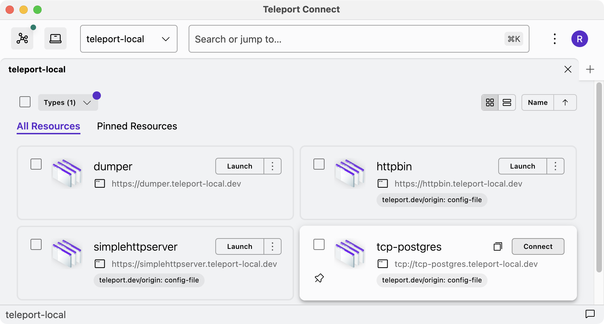
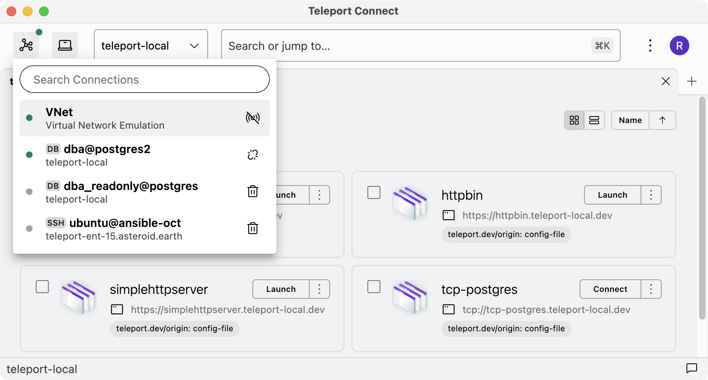

# RFD 163 - Teleport VNet

## What

Teleport VNet creates a virtual IP subnet with DNS that automatically proxies
TCP connections to Teleport apps over fully authenticated tunnels.
After logging in once, users will be able to connect to all of their Teleport
applications at their public domain name.
Scripts and software applications will be able to connect to Teleport-protected
applications as if they were connected to a VPN without any extra configuration
or even having to know that Teleport is involved.

## Why

Teleport App Access has a pretty good UX for HTTP apps accessed through a web
browser, but the experience isn't up to par outside of the browser.

Today, Teleport users have two choices for accessing Teleport-protected apps and
APIs with non-browser clients:

1. Use a custom TLS certificate and private key with the client and connect to a
   subdomain of the Teleport proxy, e.g. `curl --cert /Users/nic/.tsh/keys/one.teletest.private/nic-app/one.teletest.private/dumper-x509.pem --key /Users/nic/.tsh/keys/one.teletest.private/nic`.
2. Port forward the app on a localhost TCP listener, e.g.
   `tsh proxy app dumper --port 8888 & curl 127.0.0.1:8888`

Both of these methods are fairly cumbersome, inflexible, and they may not even
be possible with some clients, especially when needing to connect to many apps
or using custom scripts or software that expects to be able to find these apps
at a regular-old DNS address.
Teleport VNet removes the need for manual management of client certs or tunnels.

## Details

Teleport VNet will run in the background on end-user devices (laptops).
It will be integrated into Teleport Connect, also be available as a `tsh`
command.

It works by creating a TUN virtual network interface and configuring an IP route
to send all outgoing IP packets in the VNet IP range through that interface.
In the background, Teleport VNET will handle all incoming and outgoing IP
packets for the TUN interface.

VNet will also host a local DNS service providing name resolution for all
Teleport-protected apps, assigning them IP addresses in the VNet range.

To implement TCP and UDP we will leverage the userspace networking stack from
gVisor "gvisor.dev/gvisor/pkg/tcpip/stack", which is a Go library available
under the Apache 2.0 license.

When VNet accepts a TCP connection on an address assigned to an app, it will
proxy the connection to the app over an authenticated tunnel, in much the same
way that `tsh proxy app` works today.

### Protocols

VNet will initially support TCP and HTTP application access.
We could consider UDP support, but app access does not support UDP at all right
now so it will be out of scope for this RFD.

We can explore the possibility of supporting Kubernetes and Database access in
future versions, but these protocols come with additional challenges.
We would need different certs to access a single database depending on the db
username, database name, etc.
Would we expose each at a different domain name?
There may be similar challenges for kubernetes user and group impersonation.
Currently these parameters are accepted at the `tsh proxy` command but VNet
has no similar mechanism available.

### Domain name assignment

When resolving DNS queries, VNet will search for an app with `spec.public_addr`
exactly matching the name in the query.
If a matching app is found, it will be assigned an IP address in the VNet IP
range and the DNS query will resolve to that address.

The default value for an app's `spec.public_addr` is `<app-name>.<proxy-public-address>`,
but that can be overridden with any value by a cluster admin.
For an app named `api` in a Teleport cluster at `teleport.example.com` this
would look like `api.teleport.example.com` by default.
This is the same address that applications are already accessible at in the web
today.

Because we will use split DNS to configure VNet as a DNS server only for
specific subdomains, if an overridden `spec.public_addr` is NOT suffixed with
the proxy's public address an admin will need to configure a custom DNS zone in
the cluster, see [custom DNS zones](#custom-dns-zones).

### Custom DNS zones

Some users may want to use custom domain names for their apps.
Maybe they currently access an app on their VPN at `api.example.com` and
they want to migrate off their VPN to Teleport without changing all their
software and scripts that currently reference that name.
To do this they can set the `spec.public_addr` field in the app resource to
`api.example.com`.

We do not want the VNet DNS server to be resolving all DNS requests on the host
and searching all clusters for apps with a matching `public_addr` on every
request, this would introduce too much latency to unrelated DNS queries.
To avoid this we will add cluster-level configuration of custom DNS zones which
will be used to scope:

1. The split DNS configuration on the host that determines which DNS queries
   will be sent to VNet.
2. Which Teleport clusters that should be searched for matching apps when a DNS
   query is received.

When custom addresses are desired the Teleport admin can configure a custom DNS
zone with a new `vnet` Teleport configuration resource:

```yaml
version: v1
kind: vnet
metadata:
  name: vnet
spec:
  custom_dns_zones:
  - suffix: example.com
  - suffix: goteleport.com
```

In this example, whenever the user is logged in to the cluster where this `vnet`
configuration resource is present, VNet will install itself as the DNS
nameserver for subdomains of `example.com` and `goteleport.com`.
When the DNS server receives a query for any subdomain of those suffixes, it
will search the cluster for an app with that `public_addr`.

#### Leaf and parallel clusters

A user may be logged in to multiple Teleport Clusters at once, those may be leaf
clusters or completely separate clusters.

When resolving a DNS query, VNet will search all clusters where the proxy
address or any custom DNS zone in the cluster is a suffix of the queried name.

For apps in leaf clusters, VNet will still use the `public_addr` of the app even
if it is the default `public_addr` which includes the address of the leaf
cluster.
This differs conceptually from non-VNet app access where leaf apps would use the
name `<app-name>.<root-proxy-address>`.
This is convenient for the implementation and helps to avoid conflicts in cases
where an app with the same name exists in both a root and leaf cluster.
If both apps used `<app-name>.<root-proxy-address>` there would be no way to
resolve which to connect to like there is in the web where a TLS client
certificate or a session cookie can be used to differentiate the two.

To avoid conflicts between multiple clusters where the `spec.public_addr` of two
apps are identical, VNet will refuse to resolve names for any overlapping custom
DNS zones across clusters the user is currently logged in to.

In the corner case where a user is logged in to the same cluster both as a leaf
and a root, VNet will prefer to proxy to apps in that cluster as a root.

### DNS queries and IP address assignment

This design tries to avoid making the VNet client maintain an up-to-date list of
all apps in all clusters.
To that end, we will look up each app dynamically the first time DNS is queried
for its `public_addr`, and assign an IP to it at that time.
When handling a query for an A record, an IPv4 address will be assigned,
likewise for AAAA queries an IPv6 address will be assigned.
An app may have both an IPv4 and IPv6 address assigned to it.

The VNet process will build a reverse mapping from each proxy public access and
custom DNS zone to the Teleport cluster it belongs to.
This will be updated whenever the user logs in to a new cluster.
When any DNS query is received the process is as follows:

1. If an IP address is already assigned to the full queried name, an
   authoritative answer will be sent with that IP.
   These IP assigments will not expire for the lifetime of the VNet process.
   If the app no longer exists that error will be handled when a TCP request is
   made to that IP.
1. If the name matches `*.<proxy-address>` we will query
   the matching cluster to see if the app actually exists.
    1. If the app does not exist, the DNS server will respond with an
       authoritative non-answer to indicate this is not a valid name.
    1. If the app does exist, a free IP will be assigned to it and it will be
       returned in an authoritative answer.
1. If the name matches `*.<custom-dns-zone>`:
    1. VNet will determine which cluster the matching custom DNS zone is in from
       its local state.
    1. VNet will query the cluster to see if any apps have a `spec.public_addr`
       matching the full name.
       This will use a predicate expression to do the filtering server-side and
       avoid listing all apps.
    1. If a match is found a free IP will be assigned to that app and it will be
       returned in an authoritative DNS answer.
    1. If no match is found the full DNS query will be forwarded to the hosts'
       default nameservers, and any upstream response will be returned to the
       client.
1. If the name did not match any proxy address or custom DNS zone, the full DNS
   query will be forwarded to the hosts' default nameservers, and any upstream
   response will be returned to the client.

On MacOS we will find the hosts' default nameservers by parsing `/etc/resolv.conf`.

Here is a flow chart for the above sequence:


Here is a seqence diagram for an example VNet session:


### IP range

#### IPv4

By default IPv4 addresses will be assigned from the carrier-grade NAT range
`100.64.0.0/10`.
There are 4 million IP addresses in this range so exhaustion won't be a concern.
Since VNet IPs will only be used locally on end user machines this range is
quite unlikely to conflict with any valid public or private IP addresses, unless
another VPN client is being used that happens to use the same range.
For example, tailscale also uses this range.
This range can be overriden with a cluster-wide configuration.

```yaml
version: v1
kind: vnet
metadata:
  name: vnet
spec:
  cidr_range: 100.64.0.0/10
```

#### IPv6

IPv6 addresses will be assigned according to RFC 4193 "Unique Local IPv6 Unicast
Addresses".
In accordance with the RFC, VNet will randomly generate a 40-bit global ID on
startup which will be used as a prefix for all IPs assigned to apps and to
assign an IP route to the TUN interface.
The CIDR range will not be configurable for IPv6.

#### IP access without DNS

If a client wishes to access a Teleport app over VNet but their client does not
accept a domain name and only an IP, there are two ways this can be handled.

The first option is the user can first ping the domain name to cause VNet to
assign an IP to the app, and then they may use that IP.

```shell
$ ping api.teleport.example.com
PING api.teleport.example.com (100.64.0.4): 56 data bytes
$ curl 100.64.0.4
```

Another option would be to support static configuration of an IP that will
always be assigned to an app.
This may be desirable by some users used to accessing an app at a static IP, but
the implementation would be more challenging and fragile so we'll prefer not to
support this in the initial implementation.
For example, it's not clear what to do when a new app is added with a static IP
address that has already been assigned to another app.
VNet would also need to handle incoming TCP connections on all addresses and
then search all clusters for an app with a static IP matching that address, or
else we would need to maintain an up to date set of all apps in all clusters.

### TCP ports

Local app proxies today each listen on a unique TCP port on `127.0.0.1`.
With VNet we will assign a unique IP address to each app with the full TCP port
range available.

The reason we need to assign an IP per app, instead of having many apps on the
same IP but different ports, is that DNS only assigns an IP to each domain name
with no port, so there would be no good way for the client to discover the port
we assigned to the app.

To keep configuration as simple as possible, and because we can, the default
behavior of VNet will be to proxy TCP connections from ANY port to the app
assigned to the IP.
This way clients can use the port they expect for the app protocol, or any port
they like, with no extra configuration or need to figure out exactly which port
to use.

### Host configuration

Vnet will need to create a TUN interface, assign an IP to it, add a route to the
routing table, and configure VNet as a DNS nameserver.

To create the TUN interface we will import `golang.zx2c4.com/wireguard/tun`
which provides cross-platform methods for creating TUN interfaces and reading
from and writing to them.
It supports MacOS, Windows, and Linux.

The following applies to MacOS only, we will have other platform-specific
methods when we add support for Windows and Linux.

To assign an IP address to the interface, we will use `os/exec` to run the
`ifconfig` command:

```shell
ifconfig utun4 100.64.0.1 100.64.0.1 up
```

To assign an IP route to use the TUN interface, we will use `os/exec` to run the
`route` command:

```shell
route add -net 100.64.0.0/10 -interface utun4
```

To configure split DNS, we will add the VNet DNS server to files under
`/etc/resolver` for each cluster the user is logged in to and each custom DNS
zone.
This will be updated each time the user logs in to a new cluster while VNet is
enabled.

```shell
$ # cluster with proxy at teleport.example.com and custom DNS zone example.com
$ ls /etc/resolver/
teleport.example.com example.com
$ cat /etc/resolver/teleport.example.com
nameserver 100.127.100.127
$ cat /etc/resolver/example.com
nameserver 100.127.100.127
```

All system configuration must run as a privileged user (root).
In the demo implementation we are using an Applescript wrapper to call a child
process as root. Alternatives are considered under the [Alternatives to
osascript](#alternatives-to-osascript) section.
The child admin process will still be the `tsh` binary, just called with
arguments to do the host setup.
See the UX section for more details on the admin process.

The first version of VNet will only support MacOS so this is written with that
in mind, but we can implement this in a similar way for Windows and Linux.

### Security

There are certainly security implications of effectively creating
pre-authenticated TCP listeners for every app in your Teleport cluster.
Any software running on the user's machine could freely access any app.

However, this is not much different that what we already support today with
`tsh proxy app`, anything can connect to that authenticated tunnel as well.
Not to mention that the user's private key is stored at `~/.tsh` and can be used
to access anything the user can access as well.

VNet is purely a client-side convenience that effectively automates what you can
already do by creating TCP proxies for all apps.
It is built on top of Teleport's security principals like short-lived
certificates, device trust, passwordless authentication, and MFA.

VNet does not add much extra attack surface unless the user's laptop is already
compromised.

It will not be possible for external traffic to access the host over VNet.
The only IP packets that VNet will send to the host OS will be replies to
outgoing TCP connections that have been made to Teleport apps, and DNS answers.

### UX

VNet is available in both tsh and Teleport Connect. This section focuses mostly on VNet integration
in Teleport Connect, with a short subsection on VNet in tsh at the end.

There are three goals that the VNet integration attempts to achieve.

1. VNet should stay out of the way.
1. VNet should serve as a complete replacement for app gateways that shipped with Connect v15.
1. The user should be naturally guided towards enabling VNet whenever they perform an action that
   needs VNet to be running.

Before we show how the UI for VNet works, there's an important requirement we need to address.

#### Root privileges

As described in [Host configuration](#host-configuration), for VNet to work we need to create a TUN
interface and configure DNS for a particular cluster. Both actions require root privileges.

The first version of VNet uses osascript's `do shell script … with administrator privileges` to
call a tsh subcommand as root. This means that VNet doesn't work in environments where the user is a
standard macOS user and cannot elevate their privileges.

While [osascript is a CLI tool intended to be used by sysadmins and not as an
API](https://forums.developer.apple.com/forums/thread/701118?answerId=705661022#705661022), it gets
us past the problem of acquiring root privileges and lets us focus on validating VNet as a tool.
In the [Alternatives to osascript](#alternatives-to-osascript) section, we describe other approaches
which offer better UX at the cost of development time.

#### Guiding the user towards VNet

Before VNet, the user would access web and TCP apps through the unified resources view in Connect:



Clicking "Launch" next to a web app would launch this app in the browser through the `/web/launch`
URL of the proxy service. The user could also set up a local proxy for the specific app by clicking
on the three dots menu and choosing "Set up connection". For TCP apps, clicking "Connect" would set
up a local proxy for that app.

This changes with the introduction of VNet. Here's a screenshot from Teleport Connect in cluster
`teleport-local.dev` running VNet:


Web apps now have two actions available in the three dots menu: "Connect and copy VNet address" and
"Connect to local port". "Connect to local port" starts a regular local proxy. This is kept for
users who might not be able to use VNet, either because they lack root privileges or VNet would
conflict with other software running on the computer.

"Connect and copy VNet address" opens the VNet tab and shows the root privileges prompt. While the
prompt is shown, the VNet tab is in the "starting" state, explaining what VNet is.


Once VNet starts, the VNet address of the app is copied to clipboard. Afterwards the button becomes
just "Copy VNet address" when VNet is running. Copying the address copies `spec.public_addr`.

For TCP apps, the main "Connect" button is the equivalent of "Connect and copy VNet address". From
the three dots menu, the user can select the sole option "Connect to local port". The address
displayed on the card of a TCP app is the `spec.public_addr` of the app.

Selecting an app from the search bar performs the same action as clicking on the main button in the
app card.

#### Managing VNet



VNet has a persistent place in the UI in the connection list in top left. From there, the user can
see VNet status for the current root cluster and quickly stop VNet for all root clusters, similar to
how they can disconnect existing database, SSH and Kube connections.

Clicking on the VNet item opens a dedicated VNet tab. Data in this tab is scoped to the root cluster
of the current workspace. The user can see the status of VNet for the root cluster, along with an
error message if there was a problem with setting up VNet. The tab displays the DNS zones that are
currently being proxied and recent connections.

A green indicator means that a tunnel is currently open. The absence of an indicator means the
tunnel was opened but has since been closed due to inactivity. An error indicator means that a
connection for the given app could not be established. Clicking on the row with the error shows the
full error message.


#### Lifecycle

The first version of VNet integration in Connect behaves similarly to Connect My Computer. After the
user starts VNet and until they explicitly stop it, VNet starts automatically when launching the
app. It prompts for a password for root privileges through osascript on each start.

If VNet is running and the user logs in to another cluster, Connect prompts for credentials again
and configures VNet for that cluster. If this attempt fails, VNet continues to work but the
indicator on the connection list icon shows a red exclamation mark. Upon opening the VNet tab from
the connection list, the user can learn what the error was and either retry the attempt or ignore
the error.

Unfortunately, [Touch ID prompts are reserved for Apple
clients](https://forums.developer.apple.com/forums/thread/701118?answerId=705661022#705661022). We
assume that typically the user is going to start VNet and then just leave it running, somewhat
negating the downside of having to enter credentials on each start.

##### Manual start and stop

Starting VNet by clicking the item in the connection list in the top left starts VNet for all root
clusters and turns on autostart for all of them. Stopping VNet from the connection list stops it for
all root clusters and turns off autostart for all of them.

If VNet is not running, starting VNet from the VNet tab starts it only for the root cluster of the
current workspace. Likewise, stopping it from the VNet tab stops it only for the current root
cluster and turns off autostart just for this cluster.

This behavior aligns with a couple of ideas:

1) The connection list is a UI element that is not scoped to any workspace, unlike tabs which are
always scoped to a specific workspace.
2) The user can turn off VNet for a specific workspace if they do not wish to use it in that
workspace.

##### Expired certs

As shown in the diagram in the [DNS queries and IP address
assignment](#dns-queries-and-ip-address-assignment) section, there are two calls made to the
cluster, one to get the details of an app and one to proxy a connection to the cluster. If any of
those calls fails due to expired certs, Connect prompts the user to log in again. It's similar to
how Connect prompts for relogin after the cert of a local db proxy expires.

##### Considered alternatives

###### Launch VNet on system start

Doing so would require some kind of persistent UI that is also launched on system start, perhaps an
app in the Menu Bar. The UI would need to enable the user to manage the state of VNet and provide a
way to refresh expired certs. Perhaps Connect could support headless mode where it does not open the
main window automatically and instead launches a separate frontend app which handles relogin. Alas,
we don't have a Menu Bar app now and Connect is not prepared to launch in headless mode at the
moment.

###### Ask for root privileges just once

Any of the alternatives described in the [Alternatives to osascript](#alternatives-to-osascript)
section would allow us to ask for root privileges just once at the cost of development time.

#### tsh integration

`tsh vnet` prompts for a password and sets up VNet for the current profile. The `--all` (`-R`) flag
can be used to set up VNet for all non-expired profiles. Only one instance of VNet can be active
at a time, guarded by a lockfile in the tsh directory. To allow multiple VNet instances running at
the same time, tsh processes would need to coordinate which TUN device to use and how to set up DNS.

The initial output includes a list of proxied DNS zones. The format of the list depends on the
number of profiles VNet has been configured for and the number of leaf clusters.

<details>
<summary>Different tsh vnet output formats</summary>

One cluster with no leaf clusters:

```
$ tsh vnet

Proxying connections made to .teleport-local.dev, .company.private.
```

One cluster with leafs:

```
$ tsh vnet

Proxying connections made to the DNS zones listed below.

DNS Zone                         Cluster
-------------------------------- ----------------------
.teleport.example.com            teleport.example.com
.example.com                     teleport.example.com
.leaf.example.com                leaf.example.com
.leaf-platform.com               leaf.example.com
.other-leaf.example.com          other-leaf.example.com
```

Multiple root clusters. In this scenario we have to remember that the user may have access to
`leaf.example.com` both as a leaf cluster and a root cluster. We need to avoid listing it twice. The
DNS zones will be the same in both cases.

```
$ tsh vnet

Proxying connections made to the DNS zones listed below.

DNS Zone                         Cluster
-------------------------------- ----------------------
.teleport.example.com            teleport.example.com
.example.com                     teleport.example.com
.leaf.example.com                leaf.example.com
.leaf-platform.com               leaf.example.com
.other-leaf.example.com          other-leaf.example.com
.foo.teleport.sh                 foo.teleport.sh
.infra.acme.com                  foo.teleport.sh
```

</details>

New connection are logged to stdout, similar to the list of VNet connections in Connect. If a cert
expires, `tsh vnet` prompts for the password within the same shell session, similar to how `tsh
proxy db` does it.

```
✓ api.teleport.example.com
✗ old-api.example.com: DNS query for "old-api.example.com" in custom DNS zone failed: no matching
Teleport app and upstream nameserver did not respond

Enter password for Teleport user alice:

```

#### Alternatives to osascript

##### SMAppService

[`SMAppService`](https://developer.apple.com/documentation/servicemanagement/smappservice)
allows an unprivileged app to register a privileged launch daemon in launchd. That daemon is
launched on demand, does its work and then shuts down, without prompting for credentials each time.
The daemon lives in the app bundle and is automatically cleaned up when the user removes the app
bundle. Registering the daemon does not require an installer and can also be done on demand.

The main benefits of `SMAppService` are:

* A single prompt for credentials during the registration of the daemon.
* It should work for standard users, as long as an admin registers the relevant .plist from the app
  bundle in launchd.

The biggest downside is that calling both `SMAppService` and then the registered daemon most likely
requires some kind of a Swift wrapper we'd have to compile for this purpose. The other unresolved
issue is establishing secure communication with the daemon. [Launch
constraints](https://developer.apple.com/documentation/security/applying_launch_environment_and_library_constraints)
can restrict which apps can spawn the daemon. In Swift and Objective-C, [an XPC service can restrict
its peers through a code-signing
requirement](https://theevilbit.github.io/posts/launch_constraints_deep_dive/#global-xpc-daemon-attacks).
Further research is needed to determine if we can effectively use Go and gRPC as alternatives.

`SMAppService` requires macOS 13+, launch constraints require macOS 13.3+.

##### Network Extension

Ideally, we wouldn't even need to run a process with root privileges in the first place. This is
where Apple's [Network Extension](https://developer.apple.com/documentation/networkextension) comes
into play, specifically [Packet tunnel
provider](https://developer.apple.com/documentation/networkextension/packet_tunnel_provider). It
appears that its API provides some way of operating a TUN interface.

However, [there's little documentation about Packet tunnel provider
itself](https://forums.developer.apple.com/forums/thread/708310). What's more, shipping an app with
a Network Extension means that [both the app and the Network Extension need to run in the
sandbox](https://developer.apple.com/forums/thread/132406?answerId=417988022#417988022). [Migrating
an Electron app to an App
Sandbox](https://www.electronjs.org/docs/latest/tutorial/mac-app-store-submission-guide#enable-apples-app-sandbox)
is a sizeable undertaking on its own, having to account not just for VNet, but also for things like
[running tsh from within Teleport
Connect](https://developer.apple.com/documentation/xcode/embedding-a-helper-tool-in-a-sandboxed-app).

### Proto Specification

Cluster-wide VNet configuration will be exposed through a new `vnet` resource
and API created according to RFD 153.

```
// VNet is a resource that holds configuration parameters for Teleport VNet.
message VNet {
  string kind = 1;
  string sub_kind = 2;
  string version = 3;
  teleport.header.v1.Metadata metadata = 4;
  VNetSpec spec = 5;
  VNetStatus status = 6;
}

// VNetSpec holds VNet configuration parameters.
message VNetSpec {
  string cidr_range = 1;
  repeated CustomDNSZone custom_dns_zones = 2;
}

message CustomDNSZone {
  string suffix = 1;
}

// VNetStatus contains dynamic properties (currently unused).
message VNetStatus {}
```

```
// VNetService provides an API to manage VNets.
service VNetService {
  // GetVNet returns the specified VNet resource.
  rpc GetVNet(GetVNetRequest) returns (VNet);

  // CreateVNet creates a new VNet resource.
  rpc CreateVNet(CreateVNetRequest) returns (VNet);

  // UpdateVNet updates an existing VNet resource.
  rpc UpdateVNet(UpdateVNetRequest) returns (VNet);

  // DeleteVNet hard deletes the specified VNet resource.
  rpc DeleteVNet(DeleteVNetRequest) returns (google.protobuf.Empty);
}

// Request for GetVNet.
message GetVNetRequest {}

// Request for CreateVNet.
message CreateVNetRequest {
  // The VNet resource to create.
  VNet vnet = 1;
}

// Request for UpdateVNet.
message UpdateVNetRequest {
  // The VNet resource to create.
  VNet vnet = 1;

  // The update mask applied to a VNet.
  // Fields are masked according to their proto name.
  FieldMask update_mask = 2;
}

// Request for DeleteVNet.
message DeleteVNetRequest {}
```

### Binary size

VNet adds new dependencies on `golang.zx2c4.com/wireguard` and
`gvisor.dev/gvisor`.
The demo implementation currently increases the size of local builds of the
`tsh` binary from 106M to 109M.

### Backward Compatibility

We will not be changing or interfering with existing app access to backward
compatibility is not an issue.

### Audit Events

VNet is a client-side feature so no audit events will be added.

### Observability

VNet is a client-side feature there will be no new logs, audit events, or
metrics server-side.
Usage will be observable via telemetry, see [Product Usage](#product-usage).

Client-side, connections and errors will be visible in the UI in the VNet tab,
see [Managing VNet](#managing-vnet).


### Product Usage

To track VNet usage, we want to compare how often users connect to apps using VNet vs local proxies.
As tsh tracks usage only indirectly through the auth server and VNet is mostly a client-side
feature, the only readily available option is to track this through Connect's telemetry.

Connect already tracks access to apps through [the `connect.protocol.use`
event](https://github.com/gravitational/teleport/blob/5688a13f71f1fb011fa0b884a304bedf325b7c1a/proto/prehog/v1alpha/connect.proto#L38-L47).
It counts each browser launch and each setup of a local proxy, along with the UI element in the app
that launched the resource (`protocol_origin`). This helps us track, for example, how often users
access resources through the search bar vs the resource list.

Connect can send one `connect.protocol.use` event per app per VNet lifespan. That is, no matter how
many tunnels VNet opens to a particular app and no matter how many connections a user makes to an
app, Connect sends just a single `connect.protocol.use` event for that app.

This mimics how local proxies send just one event when a proxy gets created. Doing so allows us to
compare VNet usage vs local proxies. As we expand the list of supported protocols with databases and
Kubernetes, we'll be able to keep using this event.

We add a new string field to the `connect.protocol.use` event called `access_through`. This field
differentiates accessing an app through VNet from launching an app in the browser or setting up a
local proxy. The events sent when accessing apps look like this:

- Launching an app in the browser from the search bar.
  - `"access_through": "proxy_service", "protocol_origin": "search_bar"`
- Setting up a local proxy for an app.
  - `"access_through": "local_proxy", "protocol_origin": "resource_table"`
- Connecting to an app through VNet.
  - `"access_through": "vnet", "protocol_origin": "vnet"`

In case of `"access_through": "vnet"`, `protocol_origin` is set to `vnet`. When breaking down
`connect.protocol.use` by `protocol_origin`, this signals that an app was opened through means other
than Connect UI itself. Either the user copied the address from Connect or they deduced the name
from seeing other VNet addresses, or perhaps the address is saved in some other app or source code.

### Test Plan

Manual testing of VNet with multiple clusters and custom DNS zones will be added
to the test plan.
