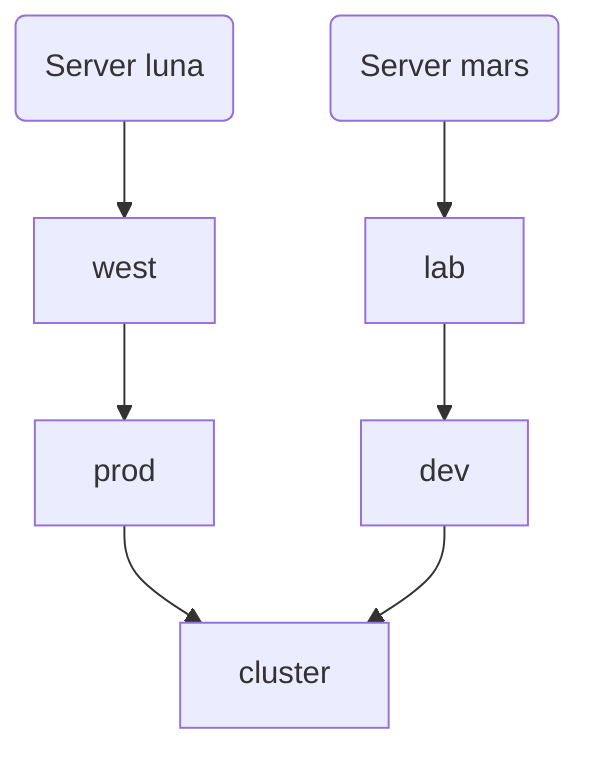

---
authors: @klizhentas (sasha@goteleport.com)
state: draft
---

# RFD 0163 - Scoped RBAC

## Required Approvers

* Engineering @r0mant && (@tigrato || @marcoandredinis)
* Security: (@reedloden || @jentfoo)
* Product: (@xinding33 || @klizhentas )

## What

This RFD introduces resource hierarchies and scopes to existing RBAC. 
Our goal is simplify and evolve access control in Teleport without drastic changes or new policy languages. 
Make it easier to integrate Teleport RBAC with cloud IAMs of AWS, GCP and Azure.
This RFD is closely modeled and inspired by Azure RBAC model, the most advanced out of 3 clouds. 

Read about it here https://learn.microsoft.com/en-us/azure/role-based-access-control/overview before diving into this RFD.

## Why

There are several structural issues with the current RBAC model in Teleport.

### Scalability issues 

Every role has to be distributed to every node or proxy that has to perform authorization. 
Current roles are brittle - to evaluate access, every single role has to be fetched and processed, 
because each role can have a deny rule that can block access to any allowed rule.

### Scoping issues

It is not possible to describe “delegated admins” in RBAC, when one user has administrative access over part of the cluster.
It is also not possible to specify that certain role options only apply in certain use-cases. 

For example, the setting `permit-agent-forward: false` will deny agent-forward to any matching resource with no exceptions, even if other roles allow it.

It is not possible to allow admins to grant roles to other users but with certain restrictions, as in the example of issue https://github.com/gravitational/teleport/issues/16914. 

### Complexity 

Roles today have both labels and label expressions, login rules to inject traits and claims and templates. 
This creates a complicated system that is hard to understand and reason about.
Role mapping is brittle and requires updating OIDC/SAML connector resources, which can break access.

### Security issues

Every role assignment and trait is encoded in certificate, and each time a user gets their roles updated, they have to get a new certificate. 
Old certificates can be re-used to get privileges that have been removed, 
creating “a new enemy problem” described in [Zanzibar Paper](https://research.google/pubs/zanzibar-googles-consistent-global-authorization-system/).

Many roles allow “role escapes”, as any person who gets assigned a role that can create other roles, 
would become an admin, see for example issue https://github.com/gravitational/teleport.e/issues/3111

### Goals

Our key goal is to evolve Teleport’s roles without asking users to rewrite their existing RBAC.
We also would like to better integrate Teleport RBAC with cloud provider’s IAM systems out of the box.
We would like to give Teleport’s users “batteries included” approach, when they can get 90% of the use-cases done without c
reating any new roles, or modifying existing ones.

### Non-Goals

We are not going to implement backwards-incompatible changes that require our customers rewrite their RBAC stack or adopt a completely new policy language. 

## Details
To understand the required changes, let’s first take a look at Teleport RBAC structure. 

### RBAC Primer

Let’s start with fundamental Teleport RBAC concepts and highlight some issues as we review them.

#### Roles

Each user or bot in Teleport is assigned one or several roles. 
For the full reference, take a look at the documentation at https://goteleport.com/docs/reference/resources/#role.

Here is a role structure:

```yaml
kind: role
version: v7
metadata:
  # role name is unique across the entire cluster
  name: example
spec:
  # options are a set of knobs that apply across the entire role set.
  # the most restrictive options wins
  options:
    # max_session_ttl defines the TTL (time to live) of certificates
    # issued to the users with this role.
    max_session_ttl: 8h
    # forward_agent controls whether SSH agent forwarding is allowed
    forward_agent: true
  # The allow section declares a list of resource/verb combinations that are
  # allowed for the users of this role. By default, nothing is allowed.
  #
  # Allow rules specify both actions that are allowed and match the resources
  # they are applying to.
  allow:
    # Some Allow fields specify target protocol
    #  login principals, like in this example, SSH logins
    logins: [root, '{{internal.logins}}']

    # In this example, the fields specify a set of windows desktop logins
    windows_desktop_logins: [Administrator, '{{internal.logins}}']

    # There are multiple types of labels and label expressions that 
    # match different computing resources.
    node_labels:
      # literal strings:
      'env': 'test'
    # regexp expressions
      'reg': '^us-west-1|eu-central-1$'

    # node_labels_expression has the same purpose as node_labels but
    # supports predicate expressions to configure custom logic.
    # A user with this role will be allowed to access nodes if they are in the
    # staging environment *or* if they belong to one of the user's own teams.
    node_labels_expression: |
      labels["env"] == "staging" ||
      contains(user.spec.traits["teams"] , labels["team"])
 
    # rules allow a user holding this role to modify other resources
    # matching the expressions below.
    # rules match both resources and specify what actions are allowed
    rules:
      - resources: [role]
        verbs: [list, create, read, update, delete]

  # The deny section uses the identical format as the 'allow' section.
  # The deny rules always override allow rules.
  deny: {}
```

We can spot several issues with this role design:

* There is no way to specify the scope that role applies to, all roles apply globally to all resources they match and all users they assign to all the time.
* There is no way to specify resource hierarchies, like computing environments (env vs prod), which makes it hard to partition the infrastructure and forces customers to specify labels.


#### Labels

Teleport RBAC’s advice to engineers to partition their resource is to first, label their computing resource or use AWS labels, and second, match the labels in RBAC.

Admins can set the tags on the resource configuration file statically, or, for some resources, use `server_info` to set the tags for each resource:

```yaml
# server_info.yaml
kind: server_info
metadata:
   name: si-<node-name>
spec:
   new_labels:
      "foo": "bar"
```

This creates several issues:

* It is not always secure to delegate labeling to owners of computing resources, as anyone with root access to the node config file can update its labels impacting everyone else.
* It is not scalable, as it’s not always useful to set and updates tags for each individual resource
* It’s hard or impossible to partition infrastructure with two-dimensional labels, although users can use `env: prod` to mark all resources in the production environment, there is no way to say that `env: lab` is a subset of `env: prod`.

#### Current Roles mapping

In Teleport there are multiple ways to map roles to users: static roles mapping to local users and bots, 
dynamic mapping to SSO via connectors and on-demand assignment via access lists and access requests.

Most users start with local static mapping and SSO mapping, later graduating to access requests and access lists.

https://goteleport.com/docs/access-controls/sso/#creating-an-authentication-connector

For SSO users, on login, Teleport checks SSO connector, and maps attributes of a user to a list of roles:

```yaml
# connector.yaml
kind: saml
version: v2
metadata:
  name: corporate
spec:
  attributes_to_roles:
    - {name: "groups", value: "okta-admin", roles: ["access"]}
     # regular expressions with capture are also supported. 
     # the next line instructs Teleport
     # to assign users to roles `admin-1` if his SAML "group" 
     # attribute equals 'ssh_admin_1':
     - { name: "group", value: "^ssh_admin_(.*)$", roles: ["admin-$1"] }
```

This creates several security and scalability issues:

* Every time administrators need to change roles assignment, they have to update the resource.
* Every time the Identity Provider changes user’s attributes, the users would have to relogin to get new roles. 

For local users, administrators have to specify roles and traits in the local resource:

```yaml
kind: user
version: v2
metadata:
  name: joe
spec:
  # roles is a list of roles assigned to this user
  roles:
  - admin
  # traits are key, list of values pairs assigned to a user resource.
  # Traits can be used in role templates as variables.
  traits:
    logins:
    - joe
    - root
```

This also creates some challenges, as administrators are forced to update local resources each time they have to assign a user new permission.

### Modifications

Let’s now introduce the missing pieces of the puzzle and review how new roles will simplify or deprecate legacy concepts.

#### Hierarchical Resource Groups

Resource groups are one such missing piece - in most cloud environments, resources are split into hierarchy, 
for example, host `luna` is a member of a resource group `lab`, in turn a member of environment `prod`, which is in turn a member of a Teleport cluster.

In Teleport, we will make cluster a default root of this hierarchy. Every computing resource by default will be a direct member of a cluster resource group.

We will also restrict a resource to be a member of only one resource group at a time.  
It’s tempting to have a resource to be assigned to multiple resource groups, but we push this out of the scope of this RFD for simplicity.

In our example, the cluster administrator would define lab resource group in the following way:

```yaml
kind: resource_group
metadata:
  name: lab
spec:
  parent: prod_env
```

Administrators can assign resources to resource groups:

```yaml
kind: resource_group
metadata:
  name: lab
spec:
   parent: prod_env
 match_kinds:
   - node
   - database
   - role
   - access_list
   - '.*'
 match_labels:  
   env: prod
```

In this case, any resource that matches `env:prod` label will be assigned to this resource group. 

This will let administrators to gradually migrate their existing flat infrastructure to resource groups one.

Such centralized assignment will also ensure that one resource can be only assigned to one resource group at a time.

In some cases it makes sense to specify parent resource group inline:

```yaml
kind: role
spec:
  parent_resource_group: /env/prod
```

Centralized assignment should take precedence over any resource based one, in case of a conflict. 
By default all resources are assigned to the root - a cluster.

Resource groups are hierarchical, and we can refer to the lab resource group by its full path as `/env/prod/lab`. 

Most Teleport resources, with some exceptions, like users, SSO connectors can be a member of a resource group. 

We will list those resources separately below.

#### Access Lists

Teleport has a concept of access lists, that lists an owner, members, and optionally a parent access list.
Access List in Teleport represents a group of users with a hierarchy. 

We will further assume that the root of this hierarchy is a cluster. 

Unlike in resource groups, a user can be an owner and a member of none, one or several access lists at once.

In addition to that, access list grants a role to a set of members, like in this example:

```yaml
kind: access_list
metadata:
  name: "lab-engineers"
spec:
  desc: "Access list for lab engineers"
  grants:
    roles: [access]
  members:
    - name: bob@example.com
```

We will return to access lists later, but let’s now recall that access lists contain a list of members, who are, in turn, granted one or several roles.

#### Scopes

By default, in Teleport a role is granted it applies to all resources in the Teleport cluster.

However, with this change, will be able to grant a set of roles that apply only to resources that belong to a specific resource group. 

In this case, we will say that the roles apply at the scope of the resource group.

Scopes define a set of resources roles apply to. 

We will introduce scopes in a couple of places, first, for access list:

```yaml
kind: access_list
metadata:
  name: "lab-engineers"
spec:
  desc: "Access list for lab engineers"
  # this grant applies only at the scope of the resource group `/env/prod/lab`
  scope: ‘/env/prod/lab`
  grants:
    roles: [access]
  members:
    - name: bob@example.com
```

By default, all existing access lists will grant roles at the cluster scope, cascading to all resources, just like before the migration. 

However, going forward, admins will be able to set scopes to more granular levels.

The second place where we introduce scopes is in the roles:

```yaml
kind: role
metadata:
 name: access
spec:
  grantable_scope: '/env/prod`
```

Grantable scope specifies maximum scope this role can be granted on. By default, all roles are granted on the highest level - cluster level.

To sum it up, any role is granted to a set of users present in the access list, to a set of resources specified in the resource group.

Grants are cascading, if a role is granted to a parent access list, it is also granted to members of any child access lists.

If a role is granted at a scope of an access list, and this role can in turn give ability to request roles or impersonate, the roles and resources 
and impersonation must be bound to the same scope or the scope smaller than the original one.

For example, let’s assume that the access list granted Alice the requester role described below at the scope of `/env/prod/lab`.  

In this case, Alice would get the ability to search and request resources with an access role, but only in the scope of `/env/prod/lab`.

```yaml
# requester.yaml
kind: role
version: v5
metadata:
  name: requester
spec:
  allow:
    request:
      search_as_roles:
        - access
```

The same applies to impersonation, if access list granted Alice the role `impersonator` below at scope `/env/prod/lab`, 
Alice would be able to impersonate role `jenkins`, but only at the scope `/env/prod/lab` or a more specific one, e.g. `/env/prod/lab/cabinet-west`.

```yaml
kind: role
version: v5
metadata:
  name: impersonator
spec:
  allow:
    impersonate:
      users: ['jenkins']
      roles: ['jenkins']
```

**Note:** While it’s tempting to support scope templates, we will push this out of the scope of this RFD.

#### Roles and Access Lists in resource groups

A special case is when a role or an access list is assigned to a certain resource group.  

Only roles that have `grantable_scope` matching the resource group can be assigned to the resource group.

The same applies to access lists, the scope of the access list grants should always match the scope of the roles it grants access to and 
should not exceed the scope of the access list itself.

In both of those cases, parent resource group must be specified both for access lists and roles and should equal or be more specific than the scope it was created in:

```yaml
kind: role
metadata:
  name: lab-admin
spec:
  grantable_scope: /env/prod/lab
  parent_resource_group: /env/prod/lab
```

```yaml
kind: access_list
metadata:
  name: lab-personnel
spec:
  grants_scope: /env/prod/lab
  parent_resource_group: /env/prod/lab
```

Roles created within a scope will have `grantable_scope` and `parent_resource_group` to be equal to scope, or more specific. 

For example, any role created within a scope `/env/prod/lab` must have the same `grantable_scope` and `parent_resource_group`  - `/env/prod/lab` or more specific one, 
for example `/env/prod/lab/west-wing`.

The roles and access lists created in the scope must grant access to scopes equal, or more specific than the scope they were created in to prevent lateral expansion or permissions.

These invariants will let us make sure that any role created within a scope, will only grant permissions in the same, or more specific scope. 

We will apply the same invariants to any other resources created within a scope. 

#### Scoped Join Tokens

Join tokens with a `parent_resource_group` will bind any resource using this join method to the resource group specified in `parent_resource_group` or a more specific one. 

```yaml
# token.yaml
kind: token
version: v2
metadata:
  name: my-token-name
spec:
  parent_resource_group: '/dev'
  roles: 
    - Node
    - App
```

Join tokens created by roles granted within a scope must have `parent_resource_group` equal to this scope `/dev` or a more specific scope, e.g. `/dev/lab`

#### Access Requests

Access requests are bound to the scope they are created within, when Alice requests access to environment `/dev/lab` with role access, 
the access request will capture the scope `/dev/lab` and create grant at this scope for Alice when approved.

#### Scoped Audit Log Events and Session Recordings

The audit events and session recordings generated by activity in some scope, will have a property that binds them to the same scope. 

This will let us filter and grant access to a subset of events and session recordings within a scope.

#### Resources that can’t be created at non-cluster scopes

Some resources don't have a clear cut behavior at certain scopes, like SSO connectors, or are difficult to define, like users. 

That’s why we will prohibit creating those resources by roles granted by any scope other than the root. 

Here is a list of resources that can’t be created at scopes:

* SSO connectors
* Users
* Clusters
* Login rules
* Devices
* UI Configs
* Cluster auth preference
* Join tokens for roles Proxy, Auth

### Features we will depreciate over time

All existing Teleport features will keep working with no changes, however, with this design we plan to deprecate:

* The mappings in connectors `attributes_to_roles` in favor of Access Lists integrated with SCIM and identity providers. Any grants of roles will be governed by access lists.
* Certificate extensions with roles and traits. A new access control system will no longer rely on certificate metadata to identify what roles have been assigned to users. The only data that new access control requires is information about user identity - username. Teleport will propagate grants via backend. This will lower Teleport’s resiliency to auth server failures, but this will be compensated with modern database backends like CockroachDB that provide multi-region resiliency and failover. 
* Label matchers and resource matchers in roles. We will have to support those for a long time, but those labels will always apply at the granted scope to resources in a resource group, and will become redundant, with later versions of Teleport relying on auto-discovery and assignment of resources to resource groups.
* Login rules. We will recommend replacing login rules with access lists that provide similar functionality.

## User stories

Let’s get back to the issues we outlined  in the start of this RFD and review how the new system will  help to resolve them.

### Gradual scoping

Most Teleport customers will start with all resources and roles in the cluster scope. 

We will let them introduce resource groups gradually. Let’s create two resource groups, `prod` and `dev` with resource groups `west` and `lab`.

Here is the resource groups hierarchy, where we will assume that mars and luna servers matched the assignments:



```yaml
kind: resource_group
metadata:
  name: prod
---
kind: resource_group
metadata:
  name: west
  parent_resource_group: prod
  # would be nice if we could match on AWS specific right away with match_aws
  match_aws:
    account_id: aws-account-id
    region: west
---
kind: resource_group
metadata:
  name: dev
---
kind: resource_group
metadata:
  name: lab
spec:
  parent_resource_group: dev
  # here we will just match on labels
  match_labels:
    kinds: [node]
    env: lab
```

This will let administrators create a resource hierarchy by  mapping computing resources using AWS metadata or labels.

We will use this setup in the following examples.

### SSH access to specific hosts

The most prominent use-case is our over-engineered access role. We can keep this role as is. Today, it grants blanket access to any computing resource of Teleport.

Alice, who is an administrator, would like to restrict access for a user bob@example.com to any server in the lab as root

```yaml
kind: access_list
metadata:
  name: access-to-lab
spec:
  grants: 
    roles: [access]
    traits:
      'internal.logins' : 'root'
  scope: '/dev/lab`
  members:
    - bob@example.com
```

Teleport will grant role access  and traits internal.logins: root to `bob@example.com`, but only when Bob would access servers in the resource group `/dev/lab`. 

This grant will not be valid out of the scope of `/dev/lab`, so Bob won’t be able to SSH as root to any other servers.

K8s access to specific clusters

Teleport can autodiscover clusters echo and bravo with namespaces default and prod, creating the following resource group hierarchy:

```
/k8s/namespaces/prod/bravo
/k8s/namespaces/prod/echo

/k8s/namespaces/default/bravo
/k8s/namespaces/default/echo
```

Note that here we have set namespaces, and not cluster names as the root of the resource hierarchy,
so we can group different cluster names by namespace.

We can then use this hierarchy to create access lists specifying access to default namespace in any cluster:

```yaml
kind: access_list
metadata:
  name: access-to-default
spec:
  grants: 
    roles: [access]
    traits:
      'internal.logins' : 'root'
  scope:  '/k8s/namespaces/default`
  members:
    - bob@example.com
```

### Scoped search-based access requests

Search-based access requests let users to search and request access to individual resources. Here is a standard requester role:

```yaml
# requester.yaml
kind: role
version: v5
metadata:
  name: requester
spec:
  allow:
    request:
      search_as_roles:
        - access
```

Here is a standard reviewer role:

```yaml
# reviewer.yaml
kind: role
version: v5
metadata:
  name: reviewer
spec:
  allow:
    review_requests:
      roles:
        - access
      preview_as_roles:
        - access
```

Without changing those roles, we can assign both requester and reviewer roles in a specific scope with access list:

```yaml
kind: access_list
metadata:
  name: access-to-default
spec:
  grants: 
    roles: [requester, reviewer]
  scope:  '/dev`
  members:
    - bob@example.com
 - alice@example.com
```

In this case, `bob@example.com` and `alice@example.com` will get an ability to search, request and review requests, but only in the scope of any resource in `/dev` resource group.

Customers frequently ask a question of how to scale this with multiple teams, 
with this approach, we’d have to create an access list for each individual team. 

Previously we’ve been recommending to use role templates. 
However, new access lists integration mirrors any group hierarchy in identity providers, 
so there is no need to use templates - Teleport will create access lists and keep members up to date.

The only thing we are missing is to let customers specify the scope when importing Okta groups or apps as access lists. 
For example, access list for Okta group `devs` can automatically have scope `/dev`

Additionally, one access list can be a member of another access list. Let’s review a case when we have a group devs that needs access to both staging and production.

Let’s create access list for Alice and Bob, this special access list does no grants and scopes, we are going to use it to keep list of our developers:

```yaml
kind: access_list
metadata:
  name: dev-team
spec:
  members:
    - bob@example.com
    - alice@example.com
---
kind: access_list
metadata:
  name: access-to-prod
spec:
  grants: 
    roles: [requester, reviewer]
  scope:  '/dev`
  member_lists:
    - dev-team
---
kind: access_list
metadata:
  name: access-to-stage
spec:
  grants: 
    roles: [requester, reviewer]
  scope:  '/prod`
  member_lists:
    - dev-team
```

**Note:** We have to make sure that the child access list is a strict subset of the roles, traits and scopes of it's parent or has no scopes or grants at all.

### Scoped Impersonation

To make sure Alice and Ketanji can impersonate Jenkins, but only when accessing dev infrastructure, we will grant impersonator role via access list with scope `/dev`

```yaml
kind: role
version: v5
metadata:
  name: impersonator
spec:
  allow:
    impersonate:
      users: ['jenkins']
      roles: ['jenkins']
---
kind: access_list
metadata:
  name: access-to-dev
spec:
  grants: 
    roles: [impersonator]
  scope:  '/dev`
  members:
    -  alice@example.com
    - ketanji@example.com
```

### Scoped admins

Large organizations would like to grant some users admin rights scoped for part of the infrastructure. 
Scoped admins can manage access to users and resources within the scopes of their access lists and resource groups.

Let’s review how we can create a scoped admin structure and even let delegated admins create new roles in the scopes of their environments.
Scoped admins can create new roles, and access lists, however only if those roles have `grantable_scopes` and access lists have `scope` equal or more specific 
than the scope of the granted roles of admins.

Let’s say Alice would like to delegate admin rights for the lab environment to Ketanji and Bob:

```yaml
kind: access_list
metadata:
  name: scoped-dev-admin-dev
spec:
  scope: '/dev/lab`
  grants: 
  roles: [editor, auditor]
  members:
    - bob@example.com
    - ketanji@example.com
```

Ketanji can now create roles, access lists and join tokens, but they all will have scopes set to /dev/lab

```yaml
kind: role
version: v5
metadata:
  name: impersonator
spec:
  grantable_scope: '/dev/lab'
  parent_resource_group: '/dev/lab' 
  allow:
    impersonate:
      users: ['jenkins']
      roles: ['jenkins']
---
kind: access_list
metadata:
  name: scoped-dev-admin-dev-access
spec:
  parent_resource_group: '/dev/lab'
  scope: '/dev/lab`
  grants: 
  roles: [access]
  members:
    - bob@example.com
    - ketanji@example.com
---
# token.yaml
kind: token
version: v2
metadata:
  name: my-token-name
spec:
  parent_resource_group: '/dev/lab'
  roles: 
    - Node
    - App
```

By propagating scope for any resource created by a user leveraging the roles the granted scope, 
we  make sure that our security invariant remains - Ketanji and Bob can’t expand the scope of their cluster access beyond /dev/lab.

### Allow agent forwarding for some hosts

Issue https://github.com/gravitational/teleport/issues/23790 is looking for a way to allow agent forwarding for specific hosts.

This can be done with access lists and scoped assignment:

```yaml
kind: access_list
metadata:
  name: access-to-default
spec:
  grants: 
    roles: [access-with-agent-forward]
  scope:  '/dev/lab`
  members:
    - bob@example.com
```

This will let bob to ssh with agent forwarding on into hosts in scope of /dev/lab only.

### Scalability

We have to make sure that resource group assignments scale with large-scale clusters. 

Also, each computing resource would only need to pull roles for its scope and above. With a properly built infrastructure hierarchy, this will significantly reduce the amount of roles that have to be distributed and evaluated for each computing resource.

### UX

We can start displaying resource groups as a special type of label in the existing UI, and represent it as a label: teleport.dev/resource_group:/env/prod/lab. 

Teleport Discover should integrate with scopes by importing AWS accounts, GCP, Azure resource groups and resources within Teleport’s Resource groups.

### Implementation
Access Lists grants will not result in roles and traits encoded in certificates. Instead, grants will be evaluated at each point of access.

### Security

Access Lists grants will not result in roles and traits encoded in certificates. Instead, grants will be evaluated at each point of access.


