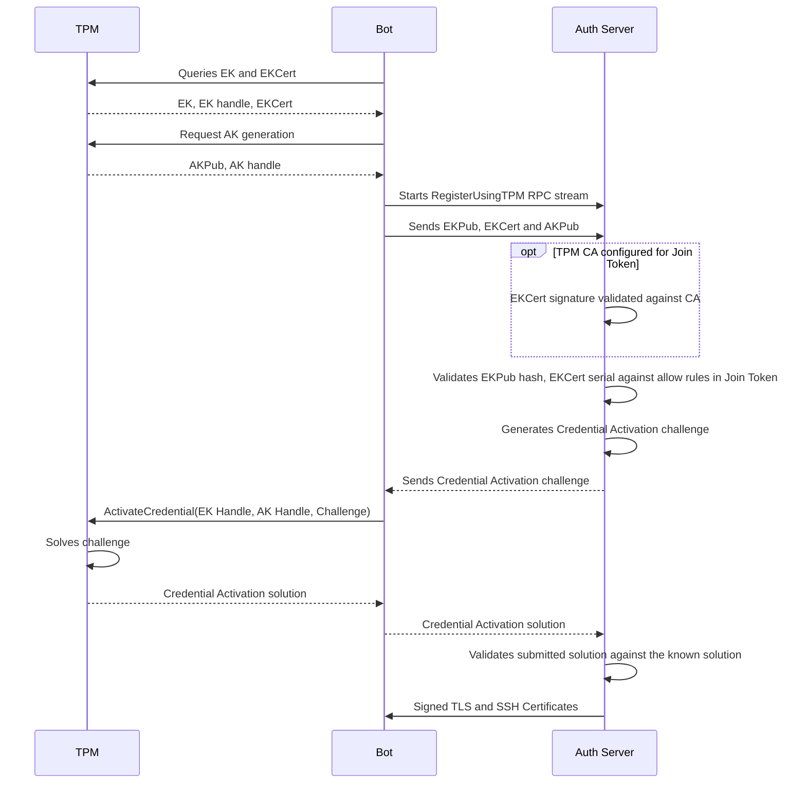

# RFD 0166 - TPM Joining

## Required Approvers
 
* Engineering: (@zmb33 || @codingllama)
* Security: (@reedloden || @jentfoo)
* Product: (@xinding33 || @klizhentas)

# What

Introduce a new join method that allows a Bot or Agent running on a host with a
TPM to securely join a Teleport cluster without using a shared secret.

# Why

Bootstrapping trust with a newly provisioned host in an on-premises environment
is challenging. In many environments, this is done by transferring an initial
shared secret to the host, which can then be used for authentication. However,
this is difficult to complete securely - especially at scale. This is due to the
risk of impersonation/interception, an attacker who has sufficiently compromised
the network can impersonate a newly provisioned host and receive access to this
secret. In addition, a shared secret on the host is liable to exfiltration.

A TPM provides a secure, unique and persistent initial identity ideal for
bootstrapping trust with a host. Even across reboots, or reconfigurations, the
TPM identity remains the same. The guarantees provided by a compliant TPM mean
that this identity cannot be exfiltrated. This makes it a strong candidate for
bootstrapping trust.

# Implementation

Reference materials:

- [TCG Credential Profile EK 2.0](https://trustedcomputinggroup.org/wp-content/uploads/TCG-EK-Credential-Profile-V-2.5-R2_published.pdf): For specification of the EK and EKCert.
- [TCG Trusted Platform Module Library](https://trustedcomputinggroup.org/resource/tpm-library-specification/): For specification of TPM commands and structures.
- [TPM 2.0 Keys for Device identity and Attestation](https://trustedcomputinggroup.org/wp-content/uploads/TPM-2p0-Keys-for-Device-Identity-and-Attestation_v1_r12_pub10082021.pdf): For the recommended TPM 2.0 flows for device identity and attestation.
- [RFD 0008e - Device Trust TPM Support](https://github.com/gravitational/teleport.e/blob/master/rfd/0008e-device-trust-tpm.md): For the existing TPM identity implementation in Teleport.

Existing code and logic from Device Trust TPM support will be reused where
appropriate for this feature.

## Overview of TPM functionality and terminology

- Trusted Platform Module (TPM): a hardware module that provides a secure root
  of trust for a host. It can securely generate and store keys and perform
  cryptographic operations for the host without exposing the keys.
- Endorsement Key (EK): A key pair that is "burned in" to the TPM at the time of
  manufacture. The endorsement key cannot be used to perform signing operations,
  cannot be exported from the TPM, but can be used to decrypt data.
- Public Endorsement Key (EKPub): The public part of the EK.
- Endorsement Key Certificate (EKCert): A certificate containing the EKPub,
  signed by the TPM manufacturer's CA, that is "burned in" to many TPMs. This 
  allows the authenticity of the TPM to be verified.
- Attestation Key (AK): A key pair created for the TPM which can be used to
  sign data.

A compliant TPM provides certain guarantees that will be relevant to TPM
joining:

- Certain keys cannot be "exported" from the TPM (e.g available to the host)
- Certain keys can only be used to perform certain operations (e.g the EK cannot
  be used to sign or decrypt arbitrary data)
- The Credential Activation ceremony can be used to prove that a key exists in
  the TPM with another key, and that the key is configured in a certain way
  (e.g cannot be exported).

It is important to note that these guarantees do not exist if the TPM is not
compliant or the host has been compromised in such a way that some malicious
software is intercepting commands intended for the TPM. This is mitigated by
validating the EKPub and EKCert against the manufacturer's CA in ceremonies
such as Credential Activation, proving that the TPM is legitimate and that you 
are talking directly to it.

## Join Process

### Pre-join Configuration

Before joining is possible, the user must configure the Auth Server with a join
token which allows that TPM to join. The Join Token will contain the EKPub
hashes and EKCert serials which are allowed to join.

To assist in this process, a new command will be added
`tbot tpm identify`/`teleport tpm identify`:

1. User runs `tbot tpm identify` on the host. This will query the EKPub and
  EKCert from the TPM attached to the host and output these values for the user.
2. User creates or modifies an existing `tpm` join token to include the EKPub
  or EkCert serial of the TPM within the allow list. See the API Changes section
  for the structure of this.

### Joining

The join process is roughly based on the TCG TPM 2.0 Keys for Device Identity
and Attestation recommended "Identity Provisioning" flow. As per this document,
the flow is designed to assure that:

- The TPM is authentic (by validating the EKCert)
- The specific TPM is authentic and is represented by the EKCert (by validating
  that the EK in the TPM corresponds to the key in the EKCert)
- The generated AK is authentic (resident in the same TPM as the EK)



At the core of this process is the Credential Activation ceremony. This proves
possession of the EK and AK to the Auth Server through decrypting an
encrypted challenge. As long as the TPM is authentic (e.g the EKCert is 
signed by a trusted manufacturer), this ceremony also proves that the EK and AK
are resident in the same TPM and cannot be exported.

### Renewal

As with all delegated join methods, the renewal will simply repeat the join
process.

## API Changes

### Join Token

A new JoinMethod will be added - `tpm`.

The existing `JoinToken` type will be extended to include additional fields for
TPM joining:

```protobuf
// ProvisionTokenSpecV2TPM contains the TPM-specific part of the
// ProvisionTokenSpecV2
message ProvisionTokenSpecV2TPM {
  message Rule {
    // Description is a human-readable hint for the rule. This does not impact
    // joining but can be used for associating a business name with an EKPub or
    // EKCert serial.
    // Example: "build-server-100"
    string Description = 1  [(gogoproto.jsontag) = "description,omitempty"];
    oneof Identifier {
      // EKPubHash is the SHA256 hash of the EKPub marshaled in PKIX format
      // and encoded in hexadecimal.
      // Example: d4b45864d9d6fabfc568d74f26c35ababde2105337d7af9a6605e1c56c891aa6
      string EKPubHash = 2 [(gogoproto.jsontag) = "ekpub_hash,omitempty"];
      // EKCertSerial is the serial number of the EKCert in hexadecimal with
      // colon separated nibbles.
      // Example: 73:df:dc:bd:af:ef:8a:d8:15:2e:96:71:7a:3e:7f:a4
      string EKCertSerial = 3 [(gogoproto.jsontag) = "ekcert_serial,omitempty"];
    }
  }
  // Allow is a list of TokenRules, nodes using this token must match one
  // allow rule to use this token.
  repeated Rule Allow = 1 [(gogoproto.jsontag) = "allow,omitempty"];
  // EKCertAllowCA is a EKCert CA in PEM format.
  // If present, only TPM devices that present an EKCert that is signed by the
  // CA specified here may join.
  //
  // If not present, then the CA of TPM EKCerts will not be checked during 
  // joining.
  bytes EKCertAllowedCA = 2 [(gogoproto.jsontag) = "ekcert_allowed_ca,omitempty"];
}
```

In YAML, this would look like:

```yaml
kind: token
version: v2
metadata:
  name: my-bot-token
spec:
  roles: ["Bot"]
  bot_name: my-bot
  join_method: tpm
  tpm:
    ekcert_allowed_ca: |
      -----BEGIN CERTIFICATE-----
      ... CA obtained from manufacturer ...
      -----END CERTIFICATE-----
    allow:
    - hint: "kansas-build-server-100"
      ekpub_hash: d4b45864d9d6fabfc568d74f26c35ababde2105337d7af9a6605e1c56c891aa6
    - hint: "london-build-server-42"
      ekcert_serial: 73:df:dc:bd:af:ef:8a:d8:15:2e:96:71:7a:3e:7f:a4
```

### `RegisterUsingTPMMethod` RPC

A new streaming RPC will be added to the existing `JoinService`:

```protobuf
service JoinService {
  // .. Existing Methods ..
  // RegisterUsingTPMMethod is used to register a Bot or Agent using a TPM.
  rpc RegisterUsingTPMMethod(stream RegisterUsingTPMMethodRequest) returns (stream RegisterUsingTPMMethodResponse);
}

// The enrollment challenge response containing the solution returned by
// calling the TPM2.0 `ActivateCredential` command on the client with the
// parameters provided in `RegisterUsingTPMMethodEnrollChallengeRequest`.
message RegisterUsingTPMMethodEnrollChallengeResponse {
  // The client's solution to `TPMEncryptedCredential` included in
  // `RegisterUsingTPMMethodEnrollChallengeRequest` using ActivateCredential.
  bytes solution = 1;
}

// The attestation key and the parameters necessary to remotely verify it as
// related to the endorsement key.
// See https://pkg.go.dev/github.com/google/go-attestation/attest#AttestationParameters.
// This message excludes the `UseTCSDActivationFormat` field from the link above
// as it is TMP 1.x specific and always false.
message TPMAttestationParameters {
  // The encoded TPMT_PUBLIC structure containing the attestation public key
  // and signing parameters.
  bytes public = 1;
  // The properties of the attestation key, encoded as a TPMS_CREATION_DATA
  // structure.
  bytes create_data = 2;
  // An assertion as to the details of the key, encoded as a TPMS_ATTEST
  // structure.
  bytes create_attestation = 3;
  // A signature of create_attestation, encoded as a TPMT_SIGNATURE structure.
  bytes create_signature = 4;
}

// The initial information sent from the client to the server.
message RegisterUsingTPMMethodInitialRequest {
  // Holds the registration parameters shared by all join methods.
  types.RegisterUsingTokenRequest join_request = 1;
  oneof ek {
    // The device's endorsement certificate in X509, ASN.1 DER form. This
    // certificate contains the public key of the endorsement key. This is
    // preferred to ek_key.
    bytes ek_cert = 2;
    // The device's public endorsement key in PKIX, ASN.1 DER form. This is
    // used when a TPM does not contain any endorsement certificates.
    bytes ek_key = 3;
  }
  // The attestation key and the parameters necessary to remotely verify it as
  // related to the endorsement key.
  TPMAttestationParameters attestation_params = 4;
}

message RegisterUsingTPMMethodRequest {
  oneof payload {
    // Initial information sent from the client to the server.
    RegisterUsingTPMMethodInitialRequest init = 1;
    // The challenge response required to complete the TPM join process. This is
    // sent in response to the servers challenge.
    RegisterUsingTPMMethodEnrollChallengeResponse challenge_response = 2;
  }
}

// These values are used by the TPM2.0 `ActivateCredential` command to produce
// the solution which proves possession of the EK and AK.
//
// For a more in-depth description see:
// - https://pkg.go.dev/github.com/google/go-attestation/attest#EncryptedCredential
// - https://trustedcomputinggroup.org/wp-content/uploads/TCG_TPM2_r1p59_Part3_Commands_code_pub.pdf (Heading 12.5.1 "TPM2_ActivateCredential" "General Description")
// - https://github.com/google/go-attestation/blob/v0.4.3/attest/activation.go#L199
// - https://github.com/google/go-tpm/blob/v0.3.3/tpm2/credactivation/credential_activation.go#L61
message RegisterUsingTPMMethodEnrollChallengeRequest {
  // The `credential_blob` parameter to be used with the `ActivateCredential`
  // command. This is used with the decrypted value of `secret` in a
  // cryptographic process to decrypt the solution.
  bytes credential_blob = 1;
  // The `secret` parameter to be used with `ActivateCredential`. This is a
  // seed which can be decrypted with the EK. The decrypted seed is then used
  // when decrypting `credential_blob`.
  bytes secret = 2;
}

message RegisterUsingTPMMethodResponse {
  oneof payload {
    // The challenge required to complete the TPM join process. This is sent to
    // the client in response to the initial request.
    RegisterUsingTPMMethodEnrollChallengeRequest challenge_request = 1;
    // The signed certificates resulting from the join process.
    Certs certs = 2;
  }
}
```

### vTPMs

vTPM (virtual TPM) refers to software which emulates the functionality of a TPM,
without necessarily being backed by a physical TPM.

These come in multiple forms:

- A software TPM running on the host intended for use in development and testing
- A TPM offered to a VM by the hypervisor, which may or may not be backed by a 
  physical TPM. Some implementations use a physical TPM available to the
  hypervisor to secure the vTPMs available to the VMs.
- A TPM offered to containers running on a host, which may or may not be backed 
  by a physical TPM. Some implementations use a physical TPM available to the
  host to secure the vTPMs available to the VMs.

vTPMs expose the same interface as a physical TPM and for our purposes are
effectively indistinguishable. It may be possible to identify a vTPM by the
lack of an EKCert or an EKCert signed by a CA that is not a TPM manufacturer's.
This difficulty ultimately means it would be fruitless to attempt to do so.

vTPMs may not offer the same guarantees as a physical TPM, this varies depending
on the implementation. For example, a simulator TPM intended for use in testing
is likely to offer none of the guarantees. On the other hand, a vTPM offered
by a hypervisor may offer the same guarantees as a physical TPM, unless the
hypervisor has been compromised. Operators must fully understand the limitations
of their chosen implementation.

Regardless, for the purposes of TPM joining, we do not need to distinguish or
change behaviour based on the "realness" of the TPM. It is ultimately the
responsibility of the operator to ensure that their TPM implementation meets
their security requirements.

## Product Considerations

### Licensing

The TPM join method will be restricted to Enterprise/Cloud licensed clusters.

This should be enforced by the Auth Server at join time.

### Improvement: Platform Attestation

Eventually, we can use the TPM to perform a platform attestation to inspect
the PCR values and event log during the join process. These values can
be logged and rules can be put in place to block joins where a host's state
sufficiently deviates from the known-good and expected state.

This work is deferred for now as platform attestation is a complex topic and
greatly increases the complexity of the implementation and also the complexity
of using the feature. This can be revisited once there is a clearly defined
use-case and demonstrated demand.

### Improvement: Storing Bot private key material in the TPM

In addition to using the TPM for the join process, we can also use this to
generate and store the Bot's private key material. As the TPM can be used to
perform cryptographic operations without exposing the keys, this would provide
a strong guarantee that the private key material cannot be exfiltrated.

See https://github.com/gravitational/teleport/issues/21555 for tracking of this
improvement.

## Security Considerations

### Manufacturer CA Compromise

If the TPM manufacturer's CA is compromised, we can no longer trust that the
TPM we are talking to is authentic during the enrolment process. These CAs
are typically well protected, making this a complex attack.

In addition, merely compromising the CA is not all that useful alone. The
attacker would also need to either:

- Compromise the host and intercept the TPM commands and responses.
- Compromise the hardware supply chain and install malicious TPMs.

In the case a compromise is noticed, the manufacturer can revoke the CA and
distribute new EKCerts for effected TPMs. Users would need to update the
configured EKCert CAs within their Teleport configuration and at this point the
attacker would lose the ability to impersonate TPMs.

### TPM Compromise

If the TPM design itself is compromised, the guarantees provided by the TPM
are lost. An attacker with access to the host would be able to extract the 
sensitive materials from the TPM and impersonate it at will.

Realistically, this is an extremely complex attack. TPMs are designed, reviewed
and tested to reduce the risk of this happening. In addition, the attacker would
still need to compromise the host in order to extract the sensitive materials.

However, it's worth recognizing that this is not impossible. In 2023, 
CVE-2023-1017 and CVE-2023-1018 were published, which describe a vulnerability
in a version reference implementation code provided by the TCG for TPM vendors.
A firmware patch was released for the affected TPMs.

Using other Teleport features, such as access monitoring and IP pinning, can
help mitigate this risk. Allowing compromise to be detected or the difficulty
of the attack to be increased.

### Certificate Exfiltration

Once joined, the signed Bot certificates and private keys are stored on disk or
in memory. Here, they can be exfiltrated by an attacker with sufficient access 
to the host.

This risk is reduced by using a short TTL for the certificates. This limits the
amount of time an exfiltrated certificate can be used. In addition, preferring
the in-memory storage further reduces the risk as higher privileges are
typically required to read the memory of a process.

To mitigate this entirely, we should implement "Storing Bot private key material
in the TPM" as described in the "Future Improvements" section.

### FIPS 140 Compliance

See https://trustedcomputinggroup.org/wp-content/uploads/TCG_FIPS_140_Guidance_for_TPM2_0_v1r1_20170202.pdf
for the official guidance on the compatibility of TPM 2.0 with FIPS 140.

The initial implementation of TPM joining will not be FIPS 140 compatible and
we should ensure the documentation is clear on this.

To make TPM joining FIPS 140 compatible, the following must be completed:

- The operator must ensure that the TPM is FIPS 140 compliant.
- Teleport must implement parameter encryption for the Critical Security 
  Parameters (CSPs) listed in the above document. This will be backwards
  compatible and we should also enable this mechanism for non-FIPS environments.
- Teleport should audit the Go libraries used for TPM joining to ensure a FIPS
  compliant implementation (e.g boringcrypto) is used for any cryptographic
  operations.

Due to non-compliance, we will reject TPM joining when the Auth Server is
configured in FIPS mode.

### Operator Responsibility

One common theme across this RFD is the extent to which the operator is
responsible for:

- Ensuring their operating system is uncompromised prior to initial joining.
  Once enrolled, the TPM provides strong guarantees but prior to this, a
  malicious actor with sufficient access to the host can impersonate a TPM.
  EKCert CA validation mitigates this, but it is the responsibility of the
  operator to configure this.
- A TPM's guarantees are only as strong as the TPM itself. If the operator
  chooses substandard TPMs, these guarantees are lost when the TPM is
  compromised. In particular, if using vTPMs, the operator must understand the
  threat models of their chosen implementation, e.g if the hypervisor is
  compromised then so are the guarantees of the vTPM.

We should ensure that documentation is clear on these two points as a
pre-requisite of using the vTPM in a production environment.

### Audit Logs

Whether the join was successful or not, the Auth Server should omit the
`bot.join` audit event for the join attempt. This should include, in addition
to the already standard fields, the following:

- The EKPub hash
- The EKCert serial
- The TPM manufacturer, part number and firmware version if encoded in the
  EKCert SAN as per TCG EK Credential Profile 2.0.
