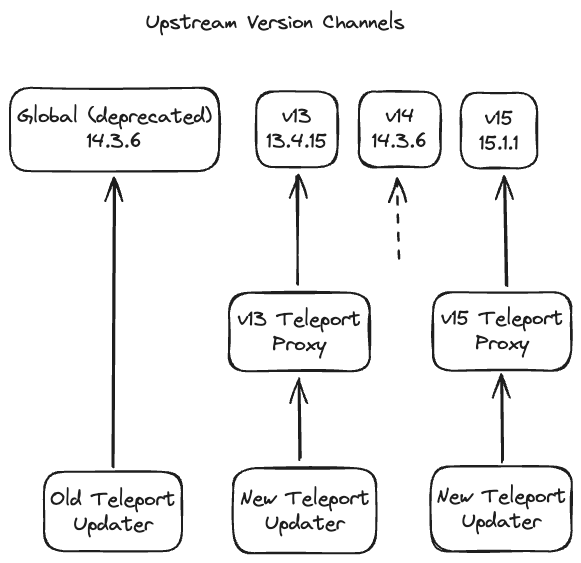
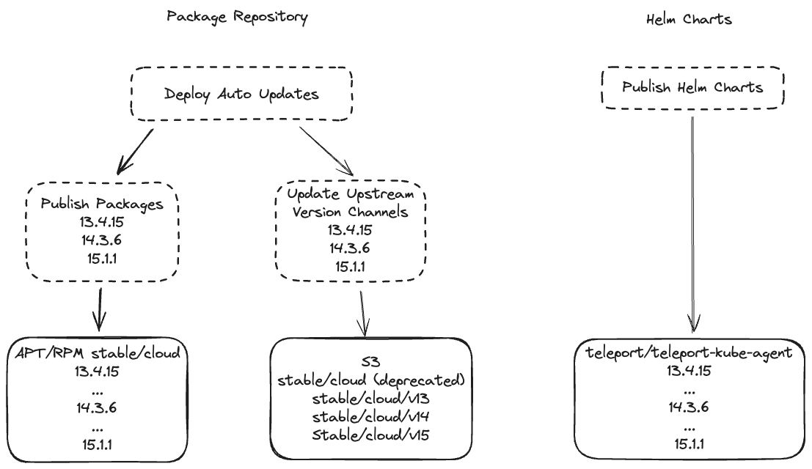
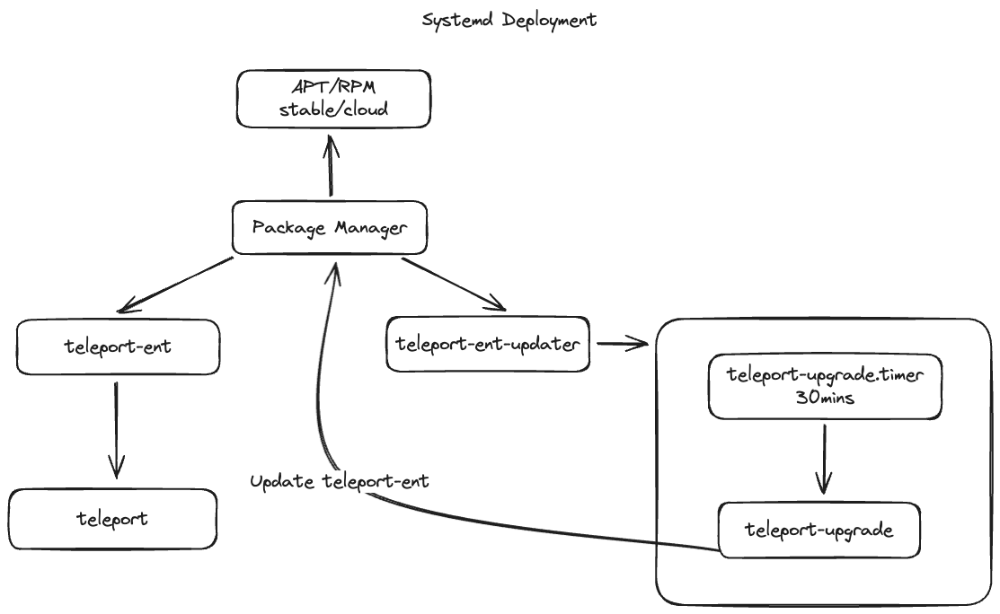
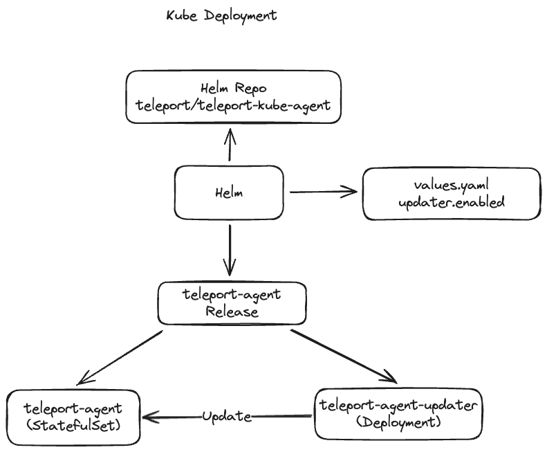

# RFD 0167 - Automatic Updates Change Proposal

## Required Approvers

* Engineering
* Security:
* Product:

## What
This RFD proposes some major design changes to the automatic updates architecture.

## Why
There were two assumptions that drove the initial design of the automatic updates feature.
1. All Teleport Cloud tenants will be forced on to the same version of Teleport.
2. The Teleport updater will be stable, and it will not require major changes.

Teleport Cloud started rolling out the automatic updates feature starting Teleport 13. Since then, it has become clear that the assumptions that were made do not hold up, and that there are some major limitations that prevent the initial design from supporting the needs of Teleport Cloud.

## Change Overview
Here is the initial [RFD](https://github.com/gravitational/teleport/blob/master/rfd/0109-cloud-agent-upgrades.md) for the automatic updates feature. To address the most urgent issues, the automatic updates architecture has already diverged from the initial design. Here is a summary of changes.

### Version Channels
Teleport Cloud now maintains per major version channels. Currently, Teleport Cloud supports v13, v14, and v15 major version channels. The global version channel is still being maintained, but it is now deprecated.

```
# Global version channel (deprecated)
https://updates.releases.teleport.dev/v1/stable/cloud/version -> v14.3.6

# Major version channels
https://updates.releases.teleport.dev/v1/stable/cloud/v13/version -> v13.4.15
https://updates.releases.teleport.dev/v1/stable/cloud/v14/version -> v14.3.6
https://updates.releases.teleport.dev/v1/stable/cloud/v15/version -> v15.1.1
```

### Proxy Version Server
The Teleport proxies now support a version endpoint and serve the latest compatible agent version. The Teleport Cloud proxies are configured to forward version requests to the appropriate upstream major version channel.
```
# Forwards to https://updates.releases.teleport.dev/v1/stable/cloud/v14/version
https://platform.teleport.sh:443/v1/webapi/automaticupgrades/channel/default/version -> v14.3.6
```

### Teleport Updater Version Endpoint
The Teleport updater is now configured to request an agent version from the proxy instead of the global version server.

## Overview
With the above changes, this is now what the automatic updates architecture looks like.

### Version Channels
Teleport Cloud maintains major version channels along with the deprecated global major version channel. Teleport proxies support a version endpoint that serves the latest compatible version of Teleport. The proxies request the latest available version from the appropriate upstream version channel. New Teleport updaters (v14.3.1+), request the target update version from the Teleport proxy. Old Teleport updaters (<v14.3.1) continue to request the target update version from the global version channel.



### Publishing
Teleport maintains a stable/cloud channel for APT and RPM packages. After updating Teleport Cloud tenants to vX.X.X, Teleport Cloud deploys a GitHub workflow to publish the necessary packages. The workflow publishes vX.X.X teleport-ent and teleport-ent-updater packages to the stable/cloud repositories, and then updates the version channels.

Teleport also maintains a Helm repository. The teleport/teleport-kube-agent Helm chart is published regularly with the OSS release of Teleport.



### Systemd Deployments
The documentation for deploying Teleport on a Linux server instruct users to install two packages: teleport-ent and teleport-ent-updater. The teleport-ent-updater package installs the teleport-upgrade tool and starts a teleport-upgrade.timer/service to periodically check for available updates. The teleport-upgrade tool invokes the package manager to handle teleport-ent package updates.



### Kubernetes Deployments
Kubernetes deployments of Teleport are installed using Helm. The teleport/teleport-kube-agent Helm release deploys the teleport-agent resource and a separate teleport-agent-updater resource at the same version. The teleport-agent-updater periodically checks for available updates and updates the teleport-agent resource image version.



## Current Limitations

### Version Channels*
The initial design of auto updates relied on a single version channel. All Teleport updaters request the target update version from this endpoint. This limitation has been mostly addressed. Teleport Cloud now supports per tenant version servers.

Issue: However, there are still a number of Teleport agents using the deprecated version of the Teleport updater. Until all Teleport updaters are updated, Teleport Cloud needs to continue to maintain the global version channel. The global version has to stay at the minimum version of all tenants using the deprecated version of the Teleport updater.

### Packages
The initial design assumed that Teleport Cloud would be able to get all tenants enrolled in automatic updates and updated to the latest version of Teleport. This would allow Teleport Cloud to publish vX.X.X to the stable/cloud channel package repository when version v.X.X.X is compatible with the control plane of all Teleport Cloud users. With this assumption, it was communicated that it should always be safe to pull the latest version of teleport-ent from the stable/cloud package repository.

This did not end up being the case. Teleport Cloud was unable to get all tenants enrolled in automatic updates and updated to the latest version of Teleport. It has become clear that Teleport Cloud will need to support tenants on multiple major versions for an extended period of time.

Because this assumption ended up being false, it is not the case that the latest version of Teleport from the stable/cloud package repository is compatible with all Teleport Cloud tenants, and it is not safe for all Teleport Cloud users to pull the latest version of teleport-ent from the stable/cloud package repository. These limitations have caused a number of issues for Teleport Cloud users.

Issue: Some users will attempt to install the latest available teleport-ent package from the stable/cloud repository. This results in a failed installation if the Teleport client is incompatible with the Teleport control plane.

Issue: Some users will attempt to manually update the teleport-ent package to the latest available version in the stable/cloud repository. This results in a failed update if the Teleport client is incompatible with the Teleport control plane.

### Helm Charts
The teleport/teleport-kube-agent Helm release manages the deployment of both the teleport-agent and the teleport-agent-updater. This may be an issue for some users become the teleport-agent-updater updates the image of the teleport-agent. This results in the version of the teleport-agent diverging from the version specific in the Helm chart.

Issue: There are a number of users unable to enroll in automatic updates because it is incompatible with their ArgoCD deployments. ArgoCD generates the template from the Helm chart and manages the resources itself. It monitors the teleport-agent resource and when it detects that the resource has diverged from the initial spec, it will reconcile the resource.

### Test Coverage
Because it was assumed that the Teleport updater would be stable, the Teleport updater logic is written in bash and it lacks sufficient testing. There is some automated testing. There are unit tests in place to verify the functionality of the Teleport updater, and there are tests to verify that the Teleport updater can be installed from the stable/cloud repository.

Issue: For such a critical piece of the Teleport architecture, it seems like an insufficient amount of test coverage. Developers are uncomfortable making changes to the Teleport updater.

## Change proposals
These proposals contain minimal implementation details. If the proposals are approved, an execution plan will be written up for each item with more implementation details.

Here are the goals that these changes should accomplish:
1. The Teleport updater must be able to update it's own update logic in some compacity. If these change proposals are accepted, the changes will require multiple steps to implement. Teleport Cloud users should not be expected to update their updater multiple times to receive the incoming patches. This should be among one of the first goals to prioritize so that users can update once, and not have to worry about keeping up with new patches to the Teleport updater.
2. The Teleport updater must preserve the ability to rollback an update. The Teleport updater must be able to identify if it's entered a broken state, it must then be able to rollback to a previously working state.
3. Teleport Cloud must have fine grain control of the version of all Teleport agents. The Teleport updater must manage the version of the Teleport agent at installation, and all future version updates. The version of the Teleport agent must be locked otherwise, and it should not be overridable by regular system maintenance.
4. Teleport Cloud must provide the necessary tools for a user to build their own automation to keep Teleport client software up to date. This should include a stable API that users can rely on to request the latest version of Teleport that is compatible with their Teleport control plane.

### Deprecate the stable/cloud teleport-ent package
Currently, the teleport-ent-updater package requires the teleport-ent package as a dependency. This means that the user must install the latest version of the teleport-ent package which may or may not be compatible with their Teleport control plane, or they must first specify a compatible version of teleport-ent to install. This puts unnecessary burden on the user, and complicates the installation process.

Step 1: To remove this burden from the user and simplify the installation process, the Teleport updater will support an install command. The install command accepts the necessary configuration and then installs the latest compatible version of the teleport-ent package for the user.

An example of what this new installation process might look like:
```sh
$ apt-get install teleport-ent-updater
$ teleport-upgrade install --proxy=example.teleport.sh
```

This step does not ensure major version compatibility. If a user manually updates the teleport-ent package to the latest available version, they may still get an incompatible major version of Teleport.

Step 2: The Teleport package repository supports major version channels (stable/vXX). Users were instructed to use these channels prior to the stable/cloud channel. In order to ensure the teleport-ent package does not get updated to an incompatible major version. The Teleport updater will now maintain the channel of the Teleport package repository. Whenever the Teleport cluster is updated to a new major version, the Teleport updater will also update the Teleport package repository channel. This will allow the stable/cloud teleport-ent package to be deprecated.

This step does not ensure minor version compatibility. If a user manually updates the teleport-ent package to the latest available version, they may still get an incompatible minor version of Teleport.

Step 2 (Alternative): Instead of relying on the stable/vXX channels. There is also the option of preventing updates of the teleport-ent package except by the Teleport updater. This would not require the stable/cloud channel to be deprecated. However, this would require a different solution for each supported package manager, which could get complicated.

Apt supports an apt-mark hold command that can be used to hold back a package from being updated. The Teleport updater can be modified to lock the teleport-ent package after an update, and unlock when it is performing an update.

Yum has a similar feature that can exclude packages from a system update. This can be done by specifying teleport-ent to be excluded in the /etc/yum.conf file.

Step 3: The Teleport installation process should no longer rely on the package manager to download teleport-ent packages. Instead, the Teleport proxy will now serve the latest compatible version of the teleport-ent package. The Teleport updater will then be responsible for downloading and installing the teleport-ent packages from the Teleport proxy.

This step will ensure version compatibility for the teleport-ent packages downloaded from the proxy. This step also removes version compatibility concerns from the Teleport updater, and the version servers can be deprecated.

Step 4: The Teleport documentation should be updated to include a new section with instructions about how a user can build their own update automation.

### Reduce installation paths
Teleport supports different scripts and methods of installation. This creates an increased maintenance and testing burden on developers. It also leads to confusion for the Teleport user, as it is unclear which installation method fits their needs. This has already lead to several incidents, and if these change proposals are accepted there is concern for more issues to emerge.

Step 1: Reduce to a single installation script. The installation script should be able to install the installation for OSS, Cloud, and Enterprise. The script should require minimal arguments for installation. Ideally, it should only require the Teleport proxy address.

Step 2: Choose a source of truth for download/installation documentation. Teleport currently provides instructions on how to download and install Teleport in multiple different pages.
- https://goteleport.com/docs/installation/ - This page provides the most detailed set of instructions about how to install Teleport using multiple different methods.
- https://goteleport.com/download/ - This page provides download instructions for OSS Teleport.
- https://goteleport.com/docs/choose-an-edition/teleport-cloud/downloads/ - This page provides download instructions for Teleport Cloud.

The /download page should now recommend users to install Teleport using the script from step 1. The script should be able to handle installation for OSS, Cloud, and Enterprise Teleport. This will enable the /download page to now be the source of truth for all Teleport download instructions.

The /docs/installation page should continue to be maintained. This page should only be recommended to users who do not wish to install Teleport using the provided installation script.

Step 3: Extend the capabilities of the installation script to replace the installation scripts used for node joining, teleport auto discovery, and any other installation scripts currently available.

Step 4: After reducing cardinality, it should be more manageable to implement more extensive testing for the single installation script. There should be automated testing in place to verify installation and updates. Teleport supports the 3 latest major versions. So tests should be run against all the supported major versions.

### Give ownership of the teleport-agent to the teleport-agent-updater
The teleport/teleport-kube-agent Helm chart with the updater enabled is not currently compatible with ArgoCD.

Step 1: As a short term workaround, ArgoCD supports an [ignoreDifferences](https://argo-cd.readthedocs.io/en/stable/user-guide/diffing/#application-level-configuration) feature. This feature can be used to ignore differences for a specific resource and field. This step would just require some additional documentation and communication with users.

Step 2: As a longer term solution, ownership of the teleport-agent should be given to the teleport-agent-updater. The teleport-agent-updater should own the teleport-agent resource and be responsible for creating and updating the resource.

## Communications
There have been many user upset and confused about the changes that have been made to the Teleport automatic updates feature. Along with documentation changes, there should be more official communication to inform users of the changes being made.

## Out of Scope

### Relax Teleport Version Requirements
Something to consider is relaxing the Teleport client/server version requirements. Teleport supports the 3 latest major versions, but it only supports compatibility with clients up to one major version behind and does not support clients that are on a newer version.
