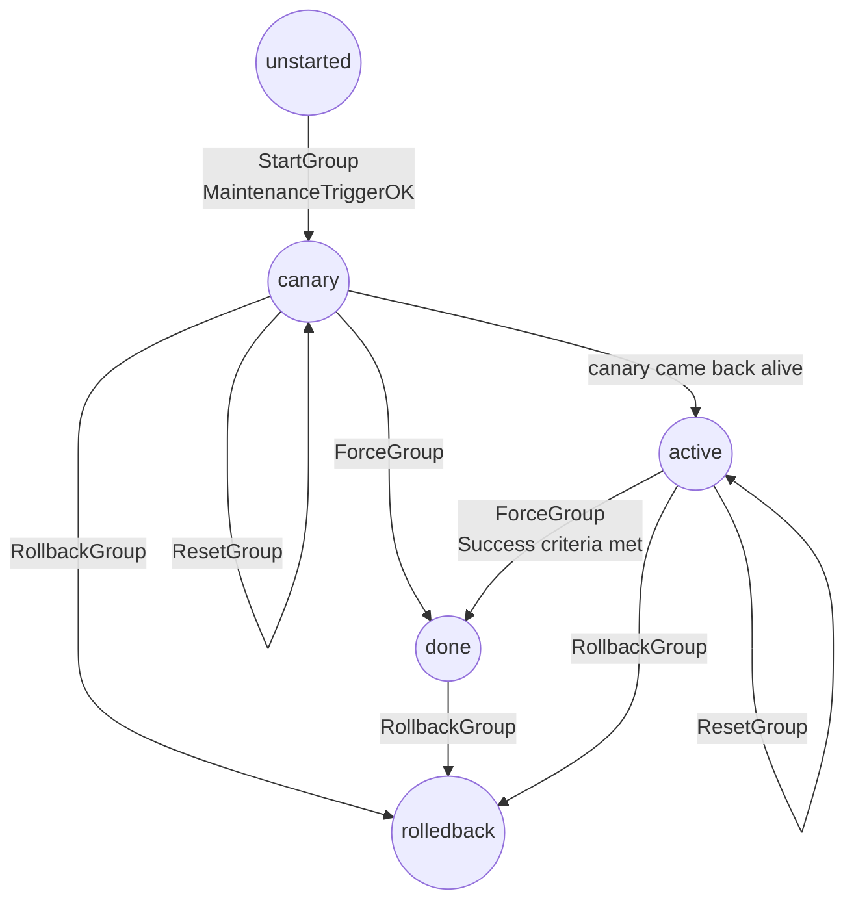

# RFD 0169 - Automatic Updates for Agents

## Required Approvers

* Engineering: @russjones
* Product: @klizhentas || @xinding33 
* Security: Doyensec

## What

This RFD proposes a new mechanism for scheduled, automatic updates of Teleport agents.

Users of Teleport will be able to use the tctl CLI to specify desired versions, update schedules, and rollout speed.

Agents will be updated by a new `teleport-update` binary, built from `tools/teleport-update` in the Teleport repository.

All agent installations are in-scope for this proposal, including agents installed on Linux servers and Kubernetes.

The following anti-goals are out-of-scope for this proposal, but will be addressed in future RFDs:
- Signing of agent artifacts (e.g., via TUF)
- Teleport Cloud APIs for updating agents
- Improvements to the local functionality of the Kubernetes agent for better compatibility with FluxCD and ArgoCD
- Support for progressive rollouts of tbot, when not installed on the same system as a Teleport agent

This RFD proposes a specific implementation of several sections in https://github.com/gravitational/teleport/pull/39217.

Additionally, this RFD parallels the auto-update functionality for client tools proposed in https://github.com/gravitational/teleport/pull/39805.

## Why

The existing mechanism for automatic agent updates does not provide a hands-off experience for all Teleport users.

1. The use of system package management leads to interactions with `apt upgrade`, `yum upgrade`, etc. that can result in unintentional upgrades.
2. The use of system package management requires logic that varies significantly by target distribution.
3. The installation mechanism requires 4-5 commands, includes manually installing multiple packages, and varies depending on your version and edition of Teleport.
4. The use of bash to implement the updater makes long-term maintenance difficult.
5. The existing auto-updater has limited automated testing.
6. The use of GPG keys in system package managers has key management implications that we would prefer to solve with TUF in the future.
7. The desired agent version cannot be set via Teleport's operator-targeted CLI (tctl).
8. The rollout plan for new agent versions is not fully-configurable using tctl.
9. Agent installation logic is spread between the auto-updater script, install script, auto-discovery script, and documentation.
10. Teleport contains logic that is specific to Teleport Cloud upgrade workflows.
11. The existing auto-updater is not self-updating.
12. It is difficult and undocumented to automate agent upgrades with custom automation (e.g., with JamF). 
13. There is no phased rollout mechanism for updates.
14. There is no way to automatically detect and halt failed updates.

We must provide a seamless, hands-off experience for auto-updates of Teleport Agents that is easy to maintain and safer for production use.

## UX

[Hugo to add]

### Teleport Resources

#### Scheduling

```yaml
kind: autoupdate_config
spec:
  # agent_autoupdate allows turning agent updates on or off at the
  # cluster level. Only turn agent automatic updates off if self-managed
  # agent updates are in place. Setting this to pause will temporarily halt the rollout.
  agent_autoupdate_mode: disable|enable|pause

  # agent_schedules specifies version rollout schedules for agents.
  # The schedule used is determined by the schedule associated
  # with the version in the autoupdate_agent_plan resource.
  # For now, only the "regular" schedule is configurable.
  agent_schedules:
    # rollout schedule must be "regular" for now
    regular:
        # name of the group. Must only contain valid backend / resource name characters.
      - name: staging
        # days specifies the days of the week when the group may be updated.
        #  default: ["*"] (all days)
        days: [ “Sun”, “Mon”, ... | "*" ]
        # start_hour specifies the hour when the group may start upgrading.
        #  default: 0
        start_hour: 0-23
        # wait_days specifies how many days to wait after the previous group finished before starting.
        #  default: 0
        wait_days: 0-1
        # jitter_seconds specifies a maximum jitter duration after the start hour.
        # The agent updater client will pick a random time within this duration to wait to update.
        #  default: 5
        jitter_seconds: 0-60
        # canary_count specifies the desired number of canaries to update before any other agents
        # are updated.
        #  default: 5
        canary_count: 0-10
        # max_in_flight specifies the maximum number of agents that may be updated at the same time.
        # Only valid for the backpressure strategy.
        #  default: 20%
        max_in_flight: 10-100%
        # alert_after specifies the duration after which a cluster alert will be set if the rollout has
        # not completed.
        #  default: 4
        alert_after_hours: 1-8

  # ...
```

Default resource:
```yaml
kind: autoupdate_config
spec:
  agent_autoupdate_mode: enable
  agent_schedules:
    regular:
    - name: default
      days: ["*"]
      start_hour: 0
      jitter_seconds: 5
      canary_count: 5
      max_in_flight: 20%
      alert_after: 4h
```

Dependency cycles are rejected.
Dependency chains longer than a week will be rejected.
Otherwise, updates could take up to 7 weeks to propagate.

The update proceeds from the first group to the last group, ensuring that each group successfully updates before allowing the next group to proceed.

The updater will receive `agent_autoupdate: true` from the time is it designated for update until the `target_version` in `autoupdate_agent_plan` (below) changes.
Changing the `target_version` resets the schedule immediately, clearing all progress.

Changing the `start_version` in `autoupdate_agent_plan` changes the advertised `start_version` for all unfinished groups.

Changing `agent_schedules` will preserve the `state` of groups that have the same name before and after the change.
However, any changes to `agent_schedules` that occur while a group is active will be rejected.

Releasing new agent versions multiple times a week has the potential to starve dependent groups from updates.

Note that the `default` schedule applies to agents that do not specify a group name.

```shell
# configuration
$ tctl autoupdate update --set-agent-auto-update=off
Automatic updates configuration has been updated.
$ tctl autoupdate update --group staging --set-start-hour=3
Automatic updates configuration has been updated.
$ tctl autoupdate update --group staging --set-jitter-seconds=60
Automatic updates configuration has been updated.
$ tctl autoupdate update --group default --set-jitter-seconds=60
Automatic updates configuration has been updated.
$ tctl autoupdate reset
Automatic updates configuration has been reset to defaults.

# status
$ tctl autoupdate status
Status: disabled
Version: v1.2.4
Schedule: regular

Groups:
staging: succeeded at 2024-01-03 23:43:22 UTC
prod: scheduled for 2024-01-03 23:43:22 UTC (depends on prod)
other: failed at 2024-01-05 22:53:22 UTC

$ tctl autoupdate status --group staging
Status: succeeded
Date: 2024-01-03 23:43:22 UTC
Requires: (none)

Updated: 230 (95%)
Unchanged: 10 (2%)
Failed: 15 (3%)
Timed-out: 0

# re-running failed group
$ tctl autoupdate run --group staging
Executing auto-update for group 'staging' immediately.
```

Notes:
- `autoupdate_agent_plan` is separate from `autoupdate_config` so that Cloud customers can be restricted from updating `autoupdate_agent_plan`, while maintaining control over the rollout.

#### Rollout

```yaml
kind: autoupdate_agent_plan
spec:
  # start_version is the desired version for agents before their window.
  start_version: A.B.C
  # target_version is the desired version for agents after their window.
  target_version: X.Y.Z
  # schedule to use for the rollout
  schedule: regular|immediate
  # strategy to use for the rollout
  # default: backpressure
  strategy: backpressure|grouped
  # paused specifies whether the rollout is paused
  # default: enabled
  autoupdate_mode: enabled|disabled|paused
status:
  groups:
    # name of group
  - name: staging
    # start_time is the time the upgrade will start
    start_time: 2020-12-09T16:09:53+00:00
    # initial_count is the number of connected agents at the start of the window
    initial_count: 432
    # missing_count is the number of agents disconnected since the start of the rollout
    present_count: 53
    # failed_count is the number of agents rolled-back since the start of the rollout
    failed_count: 23
    # canaries is a list of updater UUIDs used for canary deployments
    canaries: ["abc123-..."]
    # progress is the current progress through the rollout
    progress: 0.532
    # state is the current state of the rollout (unstarted, active, done, rollback)
    state: active
    # last_update_time is the time of the previous update for the group
    last_update_time: 2020-12-09T16:09:53+00:00
    # last_update_reason is the trigger for the last update
    last_update_reason: rollback
```

```shell
$ tctl autoupdate update --set-agent-version=15.1.1
Automatic updates configuration has been updated.
$ tctl autoupdate update --set-agent-version=15.1.2 --critical
Automatic updates configuration has been updated.
```

## Details - Teleport API

Teleport proxies will be updated to serve the desired agent version and edition from `/v1/webapi/find`.
The version and edition served from that endpoint will be configured using new `autoupdate_agent_plan` resource.

Whether the Teleport updater querying the endpoint is instructed to upgrade (via the `agent_autoupdate` field) is dependent on:
- The `host=[uuid]` parameter sent to `/v1/webapi/find`
- The `group=[name]` parameter sent to `/v1/webapi/find`
- The schedule defined in the new `autoupdate_config` resource
- The status of past agent upgrades for the given version

To ensure that the updater is always able to retrieve the desired version, instructions to the updater are delivered via unauthenticated requests to `/v1/webapi/find`.
Teleport auth servers use their access to the instance inventory data to drive the rollout, while Teleport proxies modulate the `/v1/webapi/find` response given the host UUID and group name.

Rollouts are specified as interdependent groups of hosts, selected by upgrade group identifier specified in the agent's `/var/lib/teleport/versions/update.yaml` file, which is written via `teleport-update enable`:
```shell
$ teleport-update enable --proxy teleport.example.com --group staging
```

At the start of a group rollout, the Teleport auth servers record the initial number connected agents.
The number of updated and non-updated agents is tracked by the auth servers.

If backpressure is enabled, a fixed number of connected agents (`max_in_flight % x total`) are instructed to upgrade at the same time via `/v1/webapi/find`.
Additional agents are instructed to update as earlier updates complete, never exceeding `max_in_flight`.

If canaries are enabled, a user-specified number of agents are updated first.
These agents must all update successfully for the rollout to proceed to the remaining agents.

Rollouts may be paused with `tctl autoupdate pause` or manually triggered with `tctl autoupdate run`.

### Group states

Let `v1` be the current version and `v2` the target version.

A group can be in 5 state:
- unstarted: the group update has not been started yet. 
- canary: a few canaries are getting updated. New agents should run `v1`. Existing agents should not attempt to update and keep their existing version.
- active: the group is actively getting updated. New agents should run `v2`, existing agents are instructed to update to `v2`.
- done: the group has been updated. New agents should run `v2`.
- rolledback: the group has been rolledback. New agents should run `v1`, existing agents should update to `v1`.

The finite state machine is the following:


### Agent auto update modes

The agent auto update mode is specified by both Cloud (via `autoupdate_agent_plan`)
and by the customer (via `autoupdate_config`).

The agent update mode can take 3 values:

1. disabled: teleport should not manage agent updates
2. paused: the updates are temporarily suspended, we honour the existing rollout state
3. enabled: teleport can update agents

The cluster agent rollout mode is computed by taking the lowest value.
For example:

- cloud says `enabled` and the customer says `enabled` -> the updates are `enabled`
- cloud says `enabled` and the customer says `suspended` -> the updates are `suspended`
- cloud says `disabled` and the customer says `suspended` -> the updates are `disabled`
- cloud says `disabled` and the customer says `enabled` -> the updates are `disabled`

### Proxy answer

The proxy response contains two parts related to automatic updates:
- the target version of the requested group
- if the agent should be updated

#### Rollout status: disabled

| Group state | Version | Should update |
|-------------|---------|---------------|
| *           | v2      | false         |

#### Rollout status: paused

| Group state | Version | Should update |
|-------------|---------|---------------|
| unstarted   | v1      | false         |
| canary      | v1      | false         |
| active      | v2      | false         |
| done        | v2      | false         |
| rolledback  | v1      | false         |

#### Rollout status: enabled

| Group state | Version | Should update              |
|-------------|---------|----------------------------|
| unstarted   | v1      | false                      |
| canary      | v1      | false, except for canaries |
| active      | v2      | true if UUID <= progress   |
| done        | v2      | true                       |
| rolledback  | v1      | true                       |

### Rollout

Instance heartbeats will be extended to incorporate and send data that is written to `/var/lib/teleport/versions/update.yaml` by the `teleport-update` binary.

The following data related to the rollout are stored in each instance heartbeat:
- `agent_update_start_time`: timestamp of individual agent's upgrade time
- `agent_update_start_version`: current agent version
- `agent_update_rollback`: whether the agent was rolled-back automatically
- `agent_update_uuid`: Auto-update UUID
- `agent_update_group`: Auto-update group name

Auth servers use their local instance inventory to calculate rollout statistics and write them to `/autoupdate/[group]/[auth ID]` (e.g., `/autoupdate/staging/58526ba2-c12d-4a49-b5a4-1b694b82bf56`).

Every minute, auth servers persist the version counts:
- `agent_data[group].stats[version]`
  - `count`: number of currently connected agents at `version` in `group`
  - `failed_count`: number of currently connected agents at `version` in `group` that experienced a rollback or inability to upgrade
  - `lowest_uuid`: lowest UUID of all currently connected agents at `version` in `group`
  - `count`: number of connected agents at `version` in `group` at start of window
- `agent_data[group]`
  - `canaries`: list of updater UUIDs to use for canary deployments

Expiration time of the persisted key is 1 hour.

To progress the rollout, auth servers will range-read keys from `/autoupdate/[group]/*`, sum the counts, and write back to the `autoupdate_agent_plan` status on a one-minute interval.
- To calculate the initial number of agents connected at the start of the window, each auth server will write the summed count of agents to `autoupdate_agent_plan` status, if not already written.
- To calculate the canaries, each auth server will write a random selection of all canaries to `autoupdate_agent_plan` status, if not already written.
- To determine the progress through the rollout, auth servers will write the calculated progress to the `autoupdate_agent_plan` status using the formulas, declining to write if the current written progress is further ahead.

If `/autoupdate/[group]/[auth ID]` is older than 1 minute, we do not consider its contents.
This prevents double-counting agents when auth servers are killed.

#### Progress Formulas

Given:
```
initial_count[group] = sum(agent_data[group].stats[*]).count
```

Each auth server will calculate the progress as `( max_in_flight * initial_count[group] + agent_data[group].stats[target_version].count ) / initial_count[group]` and write the progress to `autoupdate_agent_plan` status.
This formula determines the progress percentage by adding a `max_in_flight` percentage-window above the number of currently updated agents in the group.

However, if `as_numeral(agent_data[group].stats[not(target_version)].lowest_uuid) / as_numeral(max_uuid)` is above the calculated progress, that progress value will be used instead.
This protects against a statistical deadlock, where no UUIDs fall within the next `max_in_flight` window of UUID space, by always permitting the next non-updated agent to update.

To ensure that the rollout is halted if more than `max_in_flight` un-updated agents drop off, an addition restriction must be imposed for the rollout to proceed:
`agent_data[group].stats[*].count > initial_count[group] - max_in_flight * initial_count[group]`

To prevent double-counting of agents when considering all counts across all auth servers, only agents connected for one minute will be considered in these formulas.

#### Proxies

When the updater queries the proxy via `/v1/webapi/find?host=[uuid]&group=[name]`, the proxies query the `autoupdate_agent_plan` status to determine the value of `agent_autoupdate: true`.
The boolean is returned as `true` in the case that the provided `host` contains a UUID that is under the progress percentage for the `group`:
`as_numeral(host_uuid) / as_numeral(max_uuid) < progress`

### REST Endpoints

`/v1/webapi/find?host=[uuid]&group=[name]`
```json
{
  "server_edition": "enterprise",
  "agent_version": "15.1.1",
  "agent_autoupdate": true,
  "agent_update_jitter_seconds": 10
}
```
Notes:
- Agents will only update if `agent_autoupdate` is `true`, but new installations will use `agent_version` regardless of the value in `agent_autoupdate`.
- The edition served is the cluster edition (enterprise, enterprise-fips, or oss), and cannot be configured.
- The group name is read from `/var/lib/teleport/versions/update.yaml` by the updater.
- The UUID is read from `/tmp/teleport_update_uuid`, which `teleport-update` regenerates when missing.

## Details - Linux Agents

We will ship a new auto-updater package for Linux servers written in Go that does not interface with the system package manager.
It will be distributed as a separate package from Teleport, and manage the installation of the correct Teleport agent version manually.
It will read the unauthenticated `/v1/webapi/find` endpoint from the Teleport proxy, parse new fields on that endpoint, and install the specified agent version according to the specified update plan.
It will download the correct version of Teleport as a tarball, unpack it in `/var/lib/teleport`, and ensure it is symlinked from `/usr/local/bin`.

Source code for the updater will live in the main Teleport repository, with the updater binary built from `tools/teleport-update`.

### Installation

```shell
$ apt-get install teleport
$ teleport-update enable --proxy example.teleport.sh

# if not enabled already, configure teleport and:
$ systemctl enable teleport
```

For grouped updates, a group identifier may be configured:
```shell
$ teleport-update enable --proxy example.teleport.sh --group staging
```

For air-gapped Teleport installs, the agent may be configured with a custom tarball path template:
```shell
$ teleport-update enable --proxy example.teleport.sh --template 'https://example.com/teleport-{{ .Edition }}-{{ .Version }}-{{ .Arch }}.tgz'
```
(Checksum will use template path + `.sha256`)

### Filesystem

```
$ tree /var/lib/teleport
/var/lib/teleport
└── versions
   ├── 15.0.0
   │  ├── bin
   │  │  ├── tsh
   │  │  ├── tbot
   │  │  ├── ... # other binaries
   │  │  ├── teleport-update
   │  │  └── teleport
   │  ├── etc
   │  │  └── systemd
   │  │     └── teleport.service
   │  └── backup
   │     ├── sqlite.db
   │     └── backup.yaml
   ├── 15.1.1
   │  ├── bin
   │  │  ├── tsh
   │  │  ├── tbot
   │  │  ├── ... # other binaries
   │  │  ├── teleport-update
   │  │  └── teleport
   │  └── etc
   │     └── systemd
   │        └── teleport.service
   ├── system # if installed via OS package
   │  ├── bin
   │  │  ├── tsh
   │  │  ├── tbot
   │  │  ├── ... # other binaries
   │  │  ├── teleport-update
   │  │  └── teleport
   │  └── etc
   │     └── systemd
   │        └── teleport.service
   └── update.yaml
$ ls -l /usr/local/bin/tsh
/usr/local/bin/tsh -> /var/lib/teleport/versions/15.0.0/bin/tsh
$ ls -l /usr/local/bin/tbot
/usr/local/bin/tbot -> /var/lib/teleport/versions/15.0.0/bin/tbot
$ ls -l /usr/local/bin/teleport
/usr/local/bin/teleport -> /var/lib/teleport/versions/15.0.0/bin/teleport
$ ls -l /usr/local/bin/teleport-update
/usr/local/bin/teleport-update -> /var/lib/teleport/versions/15.0.0/bin/teleport-update
$ ls -l /usr/local/lib/systemd/system/teleport.service
/usr/local/lib/systemd/system/teleport.service -> /var/lib/teleport/versions/15.0.0/etc/systemd/teleport.service
```

#### update.yaml

This file stores configuration for `teleport-update`.

All updates are applied atomically using renameio.

```
version: v1
kind: update_config
spec:
  # proxy specifies the Teleport proxy address to retrieve the agent version and update configuration from.
  proxy: mytenant.teleport.sh
  # group specifies the update group
  group: staging
  # url_template specifies a custom URL template for downloading Teleport.
  # url_template: ""
  # enabled specifies whether auto-updates are enabled, i.e., whether teleport-update update is allowed to update the agent.
  enabled: true
status:
  # start_time specifies the start time of the most recent update.
  start_time: 2020-12-09T16:09:53+00:00
  # active_version specifies the active (symlinked) deployment of the teleport agent.
  active_version: 15.1.1
  # version_history specifies the previous deployed versions, in order by recency.
  version_history: ["15.1.3", "15.0.4"]
  # rollback specifies whether the most recent version was deployed by an automated rollback.
  rollback: true
  # error specifies the last error encounted
  error: "" 
```

#### backup.yaml

This file stores metadata about an individual backup of the Teleport agent's sqlite DB.

```
version: v1
kind: db_backup
spec:
  # proxy address from the backup
  proxy: mytenant.teleport.sh
  # version from the backup
  version: 15.1.0
  # time the backup was created
  creation_time: 2020-12-09T16:09:53+00:00
```

### Runtime

The `teleport-update` binary will run as a periodically executing systemd service which runs every 10 minutes.
The systemd service will run:
```shell
$ teleport-update update
```

After it is installed, the `update` subcommand will no-op when executed until configured with the `teleport-update` command:
```shell
$ teleport-update enable --proxy mytenant.teleport.sh --group staging
```

If the proxy address is not provided with `--proxy`, the current proxy address from `teleport.yaml` is used, if present.

The `enable` subcommand will change the behavior of `teleport-update update` to update teleport and restart the existing agent, if running.
It will also run update teleport immediately, to ensure that subsequent executions succeed.

Both `update` and `enable` will maintain a shared lock file preventing any re-entrant executions.

The `enable` subcommand will:
1. If an updater-incompatible version of the Teleport package is installed, fail immediately.
2. Query the `/v1/webapi/find` endpoint.
3. If the current updater-managed version of Teleport is the latest, jump to (14).
4. Ensure there is enough free disk space to update Teleport via `unix.Statfs()` and `content-length` header from `HEAD` request.
5. Download the desired Teleport tarball specified by `agent_version` and `server_edition`.
6. Download and verify the checksum (tarball URL suffixed with `.sha256`).
7. Extract the tarball to `/var/lib/teleport/versions/VERSION` and write the SHA to `/var/lib/teleport/versions/VERSION/sha256`.
8. Replace any existing binaries or symlinks with symlinks to the current version.
9. Backup `/var/lib/teleport/proc/sqlite.db` into `/var/lib/teleport/versions/OLD-VERSION/backup/sqlite.db` and create `backup.yaml`.
10. Restart the agent if the systemd service is already enabled.
11. Set `active_version` in `update.yaml` if successful or not enabled.
12. Replace the symlinks/binaries and `/var/lib/teleport/proc/sqlite.db` and quit (exit 1) if unsuccessful.
13. Remove all stored versions of the agent except the current version and last working version.
14. Configure `update.yaml` with the current proxy address and group, and set `enabled` to true.

The `disable` subcommand will:
1. Configure `update.yaml` to set `enabled` to false.

When `update` subcommand is otherwise executed, it will:
1. Check `update.yaml`, and quit (exit 0) if `enabled` is false, or quit (exit 1) if `enabled` is true and no proxy address is set.
2. Query the `/v1/webapi/find` endpoint.
3. Check that `agent_autoupdates` is true, quit otherwise.
4. If the current version of Teleport is the latest, quit.
5. Wait `random(0, agent_update_jitter_seconds)` seconds.
6. Ensure there is enough free disk space to update Teleport via `unix.Statfs()` and `content-length` header from `HEAD` request.
7. Download the desired Teleport tarball specified by `agent_version` and `server_edition`.
8. Download and verify the checksum (tarball URL suffixed with `.sha256`).
9. Extract the tarball to `/var/lib/teleport/versions/VERSION` and write the SHA to `/var/lib/teleport/versions/VERSION/sha256`.
10. Update symlinks to point at the new version.
11. Backup `/var/lib/teleport/proc/sqlite.db` into `/var/lib/teleport/versions/OLD-VERSION/backup/sqlite.db` and create `backup.yaml`.
12. Restart the agent if the systemd service is already enabled.
13. Set `active_version` in `update.yaml` if successful or not enabled.
14. Replace the old symlinks/binaries and `/var/lib/teleport/proc/sqlite.db` and quit (exit 1) if unsuccessful.
15. Remove all stored versions of the agent except the current version and last working version.

To guarantee auto-updates of the updater itself, all commands will first check for an `active_version`, and reexec using the `teleport-update` at that version if present and different.
The `/usr/local/bin/teleport-update` symlink will take precedence to avoid reexec in most scenarios.

To ensure that SELinux permissions do not prevent the `teleport-update` binary from installing/removing Teleport versions, the updater package will configure SELinux contexts to allow changes to all required paths.

To ensure that backups are consistent, the updater will use the [SQLite backup API](https://www.sqlite.org/backup.html) to perform the backup.

The `teleport` apt and yum packages contain a system installation of Teleport in `/var/lib/teleport/versions/system`.
Post package installation, the `link` subcommand is executed automatically to link the system installation when no auto-updater-managed version of Teleport is linked:
```
/usr/local/bin/teleport -> /var/lib/teleport/versions/system/bin/teleport
/usr/local/bin/teleport-updater -> /var/lib/teleport/versions/system/bin/teleport-updater
...
```

#### Failure Conditions

If the new version of Teleport fails to start, the installation of Teleport is reverted as described above.

If `teleport-update` itself fails with an error, and an older version of `teleport-update` is available, the update will retry with the older version.

If the agent losses its connection to the proxy, `teleport-update` updates the agent to the group's current desired version immediately.

Known failure conditions caused by intentional configuration (e.g., updates disabled) will not trigger retry logic.

#### Status

To retrieve known information about agent updates, the `status` subcommand will return the following:
```json
{
  "agent_version_installed": "15.1.1",
  "agent_version_desired": "15.1.2",
  "agent_version_previous": "15.1.0",
  "agent_update_time_last": "2020-12-10T16:00:00+00:00",
  "agent_update_time_jitter": 600,
  "agent_updates_enabled": true
}
```

### Downgrades

Downgrades may be necessary in cases where we have rolled out a bug or security vulnerability with critical impact.
To initiate a downgrade, `agent_version` is set to an older version than it was previously set to.

Downgrades are challenging, because `sqlite.db` used by newer version of Teleport may not be valid for older versions of Teleport.

When Teleport is downgraded to a previous version that has a backup of `sqlite.db` present in `/var/lib/teleport/versions/OLD-VERSION/backup/`:
1. `/var/lib/teleport/versions/OLD-VERSION/backup/backup.yaml` is validated to determine if the backup is usable (proxy and version must match, age must be less than cert lifetime, etc.)
2. If the backup is valid, Teleport is fully stopped, the backup is restored along with symlinks, and the downgraded version of Teleport is started.
3. If the backup is invalid, we refuse to downgrade.

Downgrades are applied with `teleport-update update`, just like upgrades.
The above steps modulate the standard workflow in the section above.
If the downgraded version is already present, the uncompressed version is used to ensure fast recovery of the exact state before the failed upgrade.
To ensure that the target version is was not corrupted by incomplete extraction, the downgrade checks for the existence of `/var/lib/teleport/versions/TARGET-VERSION/sha256` before downgrading.
To ensure that the DB backup was not corrupted by incomplete copying, the downgrade checks for the existence of `/var/lib/teleport/versions/TARGET-VERSION/backup/backup.yaml` before restoring.

Teleport must be fully-stopped to safely replace `sqlite.db`.
When restarting the agent during an upgrade, `SIGHUP` is used.
When restarting the agent during a downgrade, `systemd stop/start` are used before/after the downgrade.

Teleport CA certificate rotations will break rollbacks.
In the future, this could be addressed with additional validation of the agent's client certificate issuer fingerprints.
For now, rolling forward will allow recovery from a broken rollback.

Given that rollbacks may fail, we must maintain the following invariants:
1. Broken rollbacks can always be reverted by reversing the rollback exactly.
2. Broken versions can always be reverted by rolling back and then skipping the broken version.

When rolling forward, the backup of the newer version's `sqlite.db` is only restored if that exact version is the roll-forward version.
Otherwise, the older, rollback version of `sqlite.db` is preserved (i.e., the newer version's backup is not used).
This ensures that a version update which broke the database can be recovered with a rollback and a new patch.
It also ensures that a broken rollback is always recoverable by reversing the rollback.

Example: Given v1, v2, v3 versions of Teleport, where v2 is broken:
1. v1 -> v2 -> v1 -> v3 => DB from v1 is migrated directly to v3, avoiding v2 breakage.
2. v1 -> v2 -> v1 -> v2 -> v3 => DB from v2 is recovered, in case v1 database no longer has a valid certificate.

### Manual Workflow

For use cases that fall outside of the functionality provided by `teleport-update`, we provide an alternative manual workflow using the `/v1/webapi/find` endpoint.
This workflow supports customers that cannot use the auto-update mechanism provided by `teleport-update` because they use their own automation for updates (e.g., JamF or Ansible).

Cluster administrators that want to self-manage agent updates may manually query the `/v1/webapi/find` endpoint using the host UUID, and implement auto-updates with their own automation.

Cluster administrators that choose this path may use the `teleport` package without auto-updates enabled locally.

### Installers

The following install scripts will be updated to install the latest updater and run `teleport-update enable` with the proxy address:
- [/api/types/installers/agentless-installer.sh.tmpl](https://github.com/gravitational/teleport/blob/d0a68fd82412b48cb54f664ae8500f625fb91e48/api/types/installers/agentless-installer.sh.tmpl)
- [/api/types/installers/installer.sh.tmpl](https://github.com/gravitational/teleport/blob/d0a68fd82412b48cb54f664ae8500f625fb91e48/api/types/installers/installer.sh.tmpl)
- [/lib/web/scripts/oneoff/oneoff.sh](https://github.com/gravitational/teleport/blob/d0a68fd82412b48cb54f664ae8500f625fb91e48/lib/web/scripts/oneoff/oneoff.sh)
- [/lib/web/scripts/node-join/install.sh](https://github.com/gravitational/teleport/blob/d0a68fd82412b48cb54f664ae8500f625fb91e48/lib/web/scripts/node-join/install.sh)
- [/assets/aws/files/install-hardened.sh](https://github.com/gravitational/teleport/blob/d0a68fd82412b48cb54f664ae8500f625fb91e48/assets/aws/files/install-hardened.sh)

Eventually, additional logic from the scripts could be added to `teleport-update`, such that `teleport-update` can configure teleport.

Moving additional logic into the updater is out-of-scope for this proposal.

To create pre-baked VM or container images that reduce the complexity of the cluster joining operation, two workflows are permitted:
- Install the `teleport` package and defer `teleport-update enable`, Teleport configuration, and `systemctl enable teleport` to cloud-init scripts.
  This allows both the proxy address and token to be injected at VM initialization. The VM image may be used with any Teleport cluster.
  Installers scripts will continue to function, as the package install operation will no-op.
- Install the `teleport` package and run `teleport-update enable` before the image is baked, but defer final Teleport configuration and `systemctl enable teleport` to cloud-init scripts.
  This allows the proxy address to be pre-set in the image. `teleport.yaml` can be partially configured during image creation. At minimum, the token must be injected via cloud-init scripts.
  Installers scripts would be skipped in favor of the `teleport configure` command.

It is possible for a VM or container image to be created with a baked-in join token.
We should recommend against this workflow for security reasons, since a long-lived token improperly stored in an image could be leaked.

Alternatively, users may prefer to skip pre-baked agent configuration, and run one of the script-based installers to join VMs to the cluster after the VM is started.

Documentation should be created covering the above workflows.

### Documentation

The following documentation will need to be updated to cover the new updater workflow:
- https://goteleport.com/docs/choose-an-edition/teleport-cloud/downloads
- https://goteleport.com/docs/installation
- https://goteleport.com/docs/upgrading/self-hosted-linux
- https://goteleport.com/docs/upgrading/self-hosted-automatic-agent-updates

Additionally, the Cloud dashboard tenants downloads tab will need to be updated to reference the new instructions.

## Details - Kubernetes Agents

The Kubernetes agent updater will be updated for compatibility with the new scheduling system.

This means that it will stop reading update windows using the authenticated connection to the proxy, and instead update when indicated by the `/v1/webapi/find` endpoint.

Rollbacks for the Kubernetes updater, as well as packaging changes to improve UX and compatibility, will be covered in a future RFD.

## Migration

The existing update system will remain in-place until the old auto-updater is fully deprecated.

Both update systems can co-exist on the same machine.
The old auto-updater will update the system package, which will not affect the `teleport-update`-managed installation. 

Eventually, the `cluster_maintenance_config` resource and `teleport-ent-upgrader` package will be deprecated.

## Security

The initial version of automatic updates will rely on TLS to establish
connection authenticity to the Teleport download server. The authenticity of
assets served from the download server is out of scope for this RFD. Cluster
administrators concerned with the authenticity of assets served from the
download server can use self-managed updates with system package managers which
are signed.

The Update Framework (TUF) will be used to implement secure updates in the future.

Anyone who possesses a updater UUID can determine when that host is scheduled to update by repeatedly querying the public `/v1/webapi/find` endpoint.
It is not possible to discover the current version of that host, only the designated update window.

## Logging

All installation steps will be logged locally, such that they are viewable with `journalctl`.
Care will be taken to ensure that updater logs are sharable with Teleport Support for debugging and auditing purposes.

When TUF is added, that events related to supply chain security may be sent to the Teleport cluster via the Teleport Agent.

## Protobuf API Changes

Note: all updates use revisions to prevent data loss in case of concurrent access.

### autoupdate/v1

```protobuf
syntax = "proto3";

package teleport.autoupdate.v1;

option go_package = "github.com/gravitational/teleport/api/gen/proto/go/teleport/autoupdate/v1;autoupdatev1";

// AutoUpdateService serves agent and client automatic version updates.
service AutoUpdateService {
  // GetAutoUpdateConfig updates the autoupdate config.
  rpc GetAutoUpdateConfig(GetAutoUpdateConfigRequest) returns (AutoUpdateConfig);
  // CreateAutoUpdateConfig creates the autoupdate config.
  rpc CreateAutoUpdateConfig(CreateAutoUpdateConfigRequest) returns (AutoUpdateConfig);
  // UpdateAutoUpdateConfig updates the autoupdate config.
  rpc UpdateAutoUpdateConfig(UpdateAutoUpdateConfigRequest) returns (AutoUpdateConfig);
  // UpsertAutoUpdateConfig overwrites the autoupdate config.
  rpc UpsertAutoUpdateConfig(UpsertAutoUpdateConfigRequest) returns (AutoUpdateConfig);
  // ResetAutoUpdateConfig restores the autoupdate config to default values.
  rpc ResetAutoUpdateConfig(ResetAutoUpdateConfigRequest) returns (AutoUpdateConfig);

  // GetAutoUpdateAgentPlan returns the autoupdate plan for agents.
  rpc GetAutoUpdateAgentPlan(GetAutoUpdateAgentPlanRequest) returns (AutoUpdateAgentPlan);
  // CreateAutoUpdateAgentPlan creates the autoupdate plan for agents.
  rpc CreateAutoUpdateAgentPlan(CreateAutoUpdateAgentPlanRequest) returns (AutoUpdateAgentPlan);
  // UpdateAutoUpdateAgentPlan updates the autoupdate plan for agents.
  rpc UpdateAutoUpdateAgentPlan(UpdateAutoUpdateAgentPlanRequest) returns (AutoUpdateAgentPlan);
  // UpsertAutoUpdateAgentPlan overwrites the autoupdate plan for agents.
  rpc UpsertAutoUpdateAgentPlan(UpsertAutoUpdateAgentPlanRequest) returns (AutoUpdateAgentPlan);
}

// GetAutoUpdateConfigRequest requests the contents of the AutoUpdateConfig.
message GetAutoUpdateConfigRequest {}

// CreateAutoUpdateConfigRequest requests creation of the the AutoUpdateConfig.
message CreateAutoUpdateConfigRequest {
  AutoUpdateConfig autoupdate_config = 1;
}

// UpdateAutoUpdateConfigRequest requests an update of the the AutoUpdateConfig.
message UpdateAutoUpdateConfigRequest {
  AutoUpdateConfig autoupdate_config = 1;
}

// UpsertAutoUpdateConfigRequest requests an upsert of the the AutoUpdateConfig.
message UpsertAutoUpdateConfigRequest {
  AutoUpdateConfig autoupdate_config = 1;
}

// ResetAutoUpdateConfigRequest requests a reset of the the AutoUpdateConfig to default values.
message ResetAutoUpdateConfigRequest {}

// AutoUpdateConfig holds dynamic configuration settings for automatic updates.
message AutoUpdateConfig {
  // kind is the kind of the resource.
  string kind = 1;
  // sub_kind is the sub kind of the resource.
  string sub_kind = 2;
  // version is the version of the resource.
  string version = 3;
  // metadata is the metadata of the resource.
  teleport.header.v1.Metadata metadata = 4;
  // spec is the spec of the resource.
  AutoUpdateConfigSpec spec = 7;
}

// AutoUpdateConfigSpec is the spec for the autoupdate config.
message AutoUpdateConfigSpec {
  // agent_autoupdate_mode specifies whether agent autoupdates are enabled, disabled, or paused.
  Mode agent_autoupdate_mode = 1;
  // agent_schedules specifies schedules for updates of grouped agents.
  AgentAutoUpdateSchedules agent_schedules = 3;
}

// AgentAutoUpdateSchedules specifies update scheduled for grouped agents.
message AgentAutoUpdateSchedules {
  // regular schedules for non-critical versions.
  repeated AgentAutoUpdateGroup regular = 1;
}

// AgentAutoUpdateGroup specifies the update schedule for a group of agents.
message AgentAutoUpdateGroup {
  // name of the group
  string name = 1;
  // days to run update
  repeated Day days = 2;
  // start_hour to initiate update
  int32 start_hour = 3;
  // wait_days after last group succeeds before this group can run
  int64 wait_days = 4;
  // alert_after_hours specifies the number of hours to wait before alerting that the rollout is not complete.
  int64 alert_after_hours = 5;
  // jitter_seconds to introduce before update as rand([0, jitter_seconds])
  int64 jitter_seconds = 6;
  // canary_count of agents to use in the canary deployment.
  int64 canary_count = 7;
  // max_in_flight specifies agents that can be updated at the same time, by percent.
  string max_in_flight = 8;
}

// Day of the week
enum Day {
  DAY_UNSPECIFIED = 0;
  DAY_ALL = 1;
  DAY_SUNDAY = 2;
  DAY_MONDAY = 3;
  DAY_TUESDAY = 4;
  DAY_WEDNESDAY = 5;
  DAY_THURSDAY = 6;
  DAY_FRIDAY = 7;
  DAY_SATURDAY = 8;
}

// Mode of operation
enum Mode {
  // UNSPECIFIED update mode
  MODE_UNSPECIFIED = 0;
  // DISABLE updates
  MODE_DISABLE = 1;
  // ENABLE updates
  MODE_ENABLE = 2;
  // PAUSE updates
  MODE_PAUSE = 3;
}

// GetAutoUpdateAgentPlanRequest requests the autoupdate_agent_plan singleton resource.
message GetAutoUpdateAgentPlanRequest {}

// GetAutoUpdateAgentPlanRequest requests creation of the autoupdate_agent_plan singleton resource.
message CreateAutoUpdateAgentPlanRequest {
  // autoupdate_agent_plan resource contents
  AutoUpdateAgentPlan autoupdate_agent_plan = 1;
}

// GetAutoUpdateAgentPlanRequest requests an update of the autoupdate_agent_plan singleton resource.
message UpdateAutoUpdateAgentPlanRequest {
  // autoupdate_agent_plan resource contents
  AutoUpdateAgentPlan autoupdate_agent_plan = 1;
}

// GetAutoUpdateAgentPlanRequest requests an upsert of the autoupdate_agent_plan singleton resource.
message UpsertAutoUpdateAgentPlanRequest {
  // autoupdate_agent_plan resource contents
  AutoUpdateAgentPlan autoupdate_agent_plan = 1;
}

// AutoUpdateAgentPlan holds dynamic configuration settings for agent autoupdates.
message AutoUpdateAgentPlan {
  // kind is the kind of the resource.
  string kind = 1;
  // sub_kind is the sub kind of the resource.
  string sub_kind = 2;
  // version is the version of the resource.
  string version = 3;
  // metadata is the metadata of the resource.
  teleport.header.v1.Metadata metadata = 4;
  // spec is the spec of the resource.
  AutoUpdateAgentPlanSpec spec = 5;
  // status is the status of the resource.
  AutoUpdateAgentPlanStatus status = 6;
}

// AutoUpdateAgentPlanSpec is the spec for the autoupdate version.
message AutoUpdateAgentPlanSpec {
  // start_version is the version to update from.
  string start_version = 1;
  // target_version is the version to update to.
  string target_version = 2;
  // schedule to use for the rollout
  Schedule schedule = 3;
  // strategy to use for the rollout
  Strategy strategy = 4;
  // autoupdate_mode to use for the rollout
  Mode autoupdate_mode = 5;
}

// Schedule type for the rollout
enum Schedule {
  // UNSPECIFIED update schedule
  SCHEDULE_UNSPECIFIED = 0;
  // REGULAR update schedule
  SCHEDULE_REGULAR = 1;
  // IMMEDIATE update schedule for updating all agents immediately
  SCHEDULE_IMMEDIATE = 2;
}

// Strategy type for the rollout
enum Strategy {
  // UNSPECIFIED update strategy
  STRATEGY_UNSPECIFIED = 0;
  // GROUPED update schedule, with no backpressure
  STRATEGY_GROUPED = 1;
  // BACKPRESSURE update schedule
  STRATEGY_BACKPRESSURE = 2;
}

// AutoUpdateAgentPlanStatus is the status for the AutoUpdateAgentPlan.
message AutoUpdateAgentPlanStatus {
  // name of the group
  string name = 0;
  // start_time of the rollout
  google.protobuf.Timestamp start_time = 1;
  // initial_count is the number of connected agents at the start of the window.
  int64 initial_count = 2;
  // present_count is the current number of connected agents.
  int64 present_count = 3;
  // failed_count specifies the number of failed agents.
  int64 failed_count = 4;
  // canaries is a list of canary agents.
  repeated Canary canaries = 5;
  // progress is the current progress through the rollout.
  float progress = 6;
  // state is the current state of the rollout.
  State state = 7;
  // last_update_time is the time of the previous update for this group.
  google.protobuf.Timestamp last_update_time = 8;
  // last_update_reason is the trigger for the last update
  string last_update_reason = 9;
}

// Canary agent
message Canary {
  // update_uuid of the canary agent
  string update_uuid = 0;
  // host_uuid of the canary agent
  string host_uuid = 1;
  // hostname of the canary agent
  string hostname = 2;
  // success state of the canary agent
  bool success = 3;
}

// State of the rollout
enum State {
  // UNSPECIFIED state
  STATE_UNSPECIFIED = 0;
  // UNSTARTED state
  STATE_UNSTARTED = 1;
  // CANARY state
  STATE_CANARY = 2;
  // ACTIVE state
  STATE_ACTIVE = 3;
  // DONE state
  STATE_DONE = 4;
  // ROLLEDBACK state
  STATE_ROLLEDBACK = 5;
}

```

## Alternatives

### `teleport update` Subcommand

`teleport-update` is intended to be a minimal binary, with few dependencies, that is used to bootstrap initial Teleport agent installations.
It may be baked into AMIs or containers.

If the entirely `teleport` binary were used instead, security scanners would match vulnerabilities all Teleport dependencies, so customers would have to handle rebuilding artifacts (e.g., AMIs) more often.
Deploying these updates is often more disruptive than a soft restart of the agent triggered by the auto-updater.

`teleport-update` will also handle `tbot` updates in the future, and it would be undesirable to distribute `teleport` with `tbot` just to enable automated updates.

Finally, `teleport-update`'s API contract with the cluster must remain stable to ensure that outdated agent installations can always be recovered.
The first version of `teleport-update` will need to work with Teleport v14 and all future versions of Teleport.
This contract may be easier to manage with a separate artifact.

### Mutually-Authenticated RPC for Update Boolean

Agents will not always have a mutually-authenticated connection to auth to receive update instructions.
For example, the agent may be in a failed state due to a botched upgrade, may be temporarily stopped, or may be newly installed.
In the future, `tbot`-only installations may have expired certificates.

Making the update boolean instruction available via the `/webapi/find` TLS endpoint reduces complexity as well as the risk of unrecoverable outages.

## Execution Plan

1. Implement Teleport APIs for new scheduling system (without backpressure strategy, canaries, or completion tracking)
2. Implement new Linux server auto-updater in Go, including systemd-based rollbacks.
3. Implement changes to Kubernetes auto-updater.
4. Test extensively on all supported Linux distributions.
5. Prep documentation changes.
6. Release via `teleport` package and script for packageless install.
7. Release documentation changes.
8. Communicate to users that they should update to the new system.
9. Begin deprecation of old auto-updater resources, packages, and endpoints.
10. Add healthcheck endpoint to Teleport agents and incorporate into rollback logic.
10. Add progress and completion checking.
10. Add canary functionality.
10. Add backpressure functionality if necessary.
11. Add DB backups if necessary.
