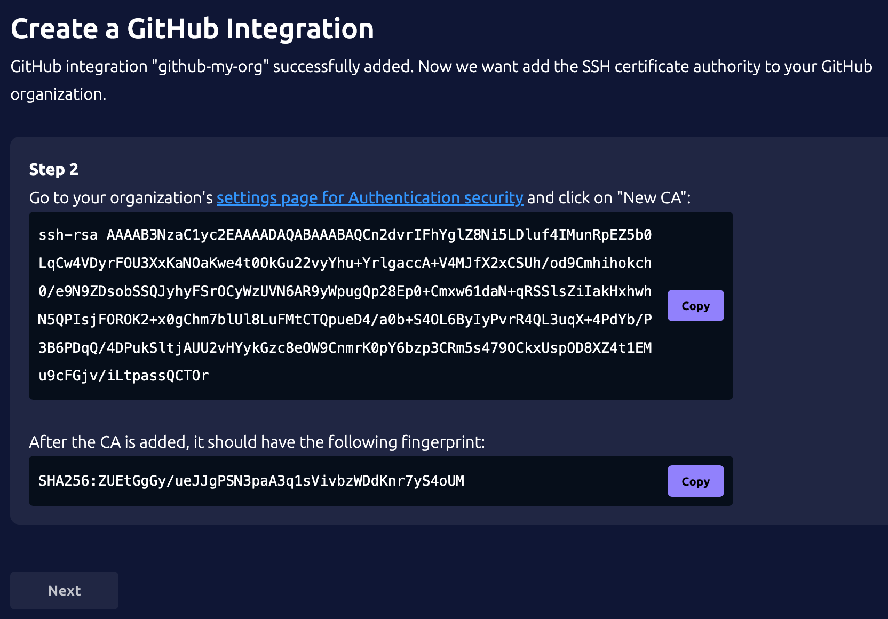
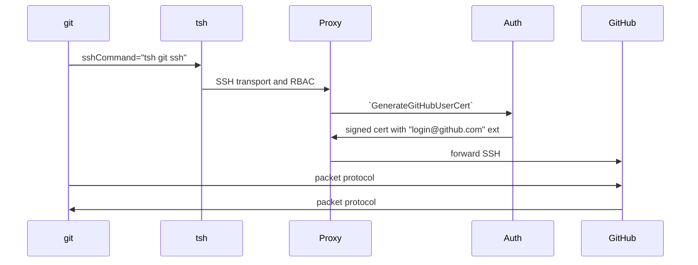

# RFD 178 - GitHub Proxy

## Required Approvers

- Engineering: @r0mant && @smallinsky
- Product: @klizhentas || @xinding33

## What

This RFD proposes design and implementation of proxying the Git SSH protocol
for GitHub repositories.

## Why

GitHub Enterprise provides a security feature to bring your own SSH certificate
authorities (CA). Once a CA is added, your organization can sign short-lived
client SSH certificates to access organization resources on GitHub. You can
also require your memebers to use these SSH certificates, which disables Git
access using personal tokens.

The concept of short-lived SSH certificates to access organization resources
aligns well with Teleport, where a Teleport user begins their day with a 'tsh'
session, accessing only what their roleset permits. Teleport can also easily
provide the capability to issue of short-lived client SSH certificates for
GitHub organzations so Teleport customers do not need to implement a separate
system for issuing these certificates. 

Teleport also offers other GitHub-related features, such as [GitHub IAM
integration](https://github.com/gravitational/teleport.e/blob/master/rfd/0021e-github-iam-integration.md)
and GitHub SSO, where this functionality can integrate nicely. Additionally,
proxying GitHub SSH through Teleport provides features like per-session MFA,
audit logging.

Teleport today offers a similar GitHub integration using
[`cert_extensions`](https://github.com/gravitational/teleport/blob/branch/v16/docs/pages/admin-guides/management/guides/ssh-key-extensions.mdx)
in the role options. This proposed GitHub proxy is considered an upgrade to the
existing feature and should replace it.

## Details

### UX - User stories

#### Alice configures GitHub proxy via UI

Alice is a system administrator and she would like to setup the GitHub SSH CA
integration with Teleport.

Alice logs into Teleport via Web UI, and searches "github" on the "Enroll New
Integration" page. Alice selects a "guided" GitHub integration experience:

1. Alice inputs the GitHub organization "my-org", and the UI defaults (but
   editable) to the integration name to "github-my-org".

 

2. On the next page, the SSH CA and fingerprint are displayed with a link to
   the organization's security setting page and instructions to add the CA to
   GitHub.



3. Next step, to setup access, Alice inputs her GitHub username.


4. Lastly, Alice is presented instructions on how to use `tsh` to setup the Git
   repos:
   - Use `tsh git clone` for cloning a new repository
   - Use `tsh git config update` for configuring an existing repository
   - Use `git` as normal once the repository is cloned/configured


After the enrollment is completed, Alice can see the organization in the list
of integrations. In addition, the Git proxy server can be found in the unified
resources view:


Clicking on "Connect" will open a dialog that provides the same instructions to
on how to use the feature with `tsh`.

#### Alice configures GitHub proxy via CLI

Alice is a system administrator and she would like to setup the GitHub SSH CA
integration with CLI. An official guide is provided on
`https://goteleport.com/docs/` to set this up with the following steps.

First, she creates a GitHub integration using `tctl create`:
```yaml
kind: integration
sub_kind: github
version: v1
metadata:
  name: github-my-org
spec:
  github:
    organization: my-org
```

Then she exports the SSH CA and imports it to her GitHub organization:
```shell
$ tctl auth export --integration github-my-org --type github
ssh-rsa <cert-pem...>

Go to https://github.com/organizations/my-org/settings/security and click "New
CA" in the "SSH certificate authorities" section.

Copy-paste the above certificate there and click "Add CA". The CA should have
the following sha256 fingerprint:
<fingerprint...>
```

Next, she creates a GitHub proxy server for Teleport users to access, using
`tctl create`:
```yaml
kind: git_server
sub_kind: github
spec:
  github:
    integration: github-my-org
    organization: my-org
version: v2
```

To provide access, Alice needs to set some user traits referenced by the
default `access` role:
```yaml
kind: role
metadata:
  name: github-my-org-access
spec:
  allow:
    github_permissions:
    - orgs:
      - '{{internal.github_orgs}}'
 ...
version: v7
```

To set `github_orgs` and `github_username` for local users, Alice runs:
```shell
tctl users update alice --set-github-orgs my-org --set-github-username my-git-username
```

#### Bob clones a new Git repository

Bob, a Teleport user that's granted access to the GitHub organization, wants to
clone a repo.

He logins the `tsh`, and run `tsh git ls` to see what access he has:
```shell
$ tsh git ls
Type   Organization Username        URL                                     
------ ------------ --------------- -------------------------
GitHub my-org       my-git-username https://github.com/my-org

hint: use 'tsh git clone <git-clone-ssh-url>' to clone a new repository
      use 'tsh git config update' to configure an existing repository to use Teleport
      once the repository is cloned or configured, use 'git' as normal
```

He goes on `github.com` and finds the SSH clone url for the repository he wants
to clone. Then he runs the `tsh git clone` command with copied url:
```shell
$ tsh git clone git@github.com:my-org/my-repo.git
```

Once the repo is cloned, Bob can `cd` into the directory and perform regular
`git` commands naturally, without using `tsh`.

On the second day (as the `tsh` session expiress), when Bob tries to `git
fetch` from the repo, the command prompts to login into Teleport. The command
proceeds as usual once Teleport login is successful.

#### Bob configures an existing Git repository

Bob, a Teleport user that's granted access to the GitHub organization, wants to
use Teleport for an existing repo he has cloned before:
```shell
$ cd my-repo
$ tsh git config update
The current git dir is now configured with Teleport for GitHub organization "my-org".

Your GitHub username is "my-git-username".

You can use `git` commands as normal.
```

If one day Bob needs to revert Teleport settings in the Git repo:
```shell
$ tsh git config reset
The Teleport configuration for the current git dir is removed.
```

#### Alice wants to require Bob to use MFA for every `git` command.

Alice, a system administrator, wants to ensure that every single git command
executed by a Teleport user requires MFA, in case their on-disk Teleport
certificates are compromised.

Alice can enable per-session MFA in their Teleport role:
```diff
kind: role
metadata:
  name: github-my-org-access
spec:
  allow:
    github_permissions:
    - orgs:
      - my-org
+   require_session_mfa: true
version: v7
```

Now, when Bob (a Teleport user) runs `git` commands, the command also prompt
for MFA. The `git` command proceeds as usual once MFA challenge is succeeded.

#### Charlie wants to audit GitHub access

Charlie is an auditor and is able to see the audit events from Web UI:


He wants to generate a report that lists every user that has accessed the repos
of their organization and their IP addresses on a monthly basis.

Charlie can use SQL queres to search GitHub events using [Access
Monitoring](https://goteleport.com/docs/admin-guides/access-controls/access-monitoring):
```sql
SELECT
    user,
    remote_ip,
    COUNT(*) AS event_count
FROM
    git_command,
WHERE
    date_format(event_time, '%Y-%m') = '2024-07'
GROUP BY
    user,
    remote_ip
```

#### Alice wants to understand the available break glass options

Alice, a system administrator, manages the Teleport cluster by checking
Terrafrom scripts and values into various GitHub repos. CI/CD then picks the
changes and apply to the Teleport cluster.

A change to the Terraform script may break the Teleport cluster and the GitHub
proxy will not be usable.

Alice has selected the option to disallow personal access tokens and SSH keys
at the organization level and does not want to allow it for security purpose.

Alice still has a few options to access the organization repos when the GitHub
proxy is unavailable:
- Alice can still logs into GitHub through a browser and make chnages there if
   necessary.
- Alice can manually sign an user certificate according to [GitHub
  spec](https://docs.github.com/en/enterprise-cloud@latest/organizations/managing-git-access-to-your-organizations-repositories/about-ssh-certificate-authorities#issuing-certificates).
  The CA used to generate the user certificate could be a backup of Teleport's
  CA that is exported to a 3rd party secret store. Or, Alice can generate a
  self-signed CA on the spot and import it to the Organization settings
  temporarily.

In addition, trusted GitHub environments like GitHub actions are not affected
by the option to disallow personal access tokens. GitHub allows these services
to continue use existing authentication methods so these services do not need
to go through Teleport.

### Implementation

#### Overview


#### Licensing

The proxy functionality is available for OSS. For Enterprise license feature
flag, it will share the same as the [GitHub IAM
integration](https://github.com/gravitational/teleport.e/blob/master/rfd/0021e-github-iam-integration.md).

#### GitHub Integration resource

The GitHub integration resource is be a subkind (`github`) of `types.Integration`
and is shared with [GitHub IAM
integration](https://github.com/gravitational/teleport.e/blob/master/rfd/0021e-github-iam-integration.md)
feature.

In addition to Organization and settings used for IAM, the integration now
contains proxy-related settings:
```yaml
kind: integration
sub_kind: github
version: v1
metadata:
  name: github-my-org
spec:
  github:
    organization: my-org
    proxy:
      cert_authority:
      - public_key: <public_key> 
        private_key: <private_key> 
```


`cert_authority`, which contains the SSH key pairs for CA, is populated by Auth
when creating the resource.

#### GitHub proxy server resource

A new resource kind `git_server` is introduced. On the backend, it uses
`gitServers` as prefix and `types.ServerV2` as the object definition:
```yaml
kind: git_server
sub_kind: github
version: v2
metadata:
  labels:
    teleport.hidden/github_organization: my-org
  name: <uuid>
  revision: <rev-id>
spec:
  github:
    integration: github-my-org
    organization: my-org
  hostname: my-org.github-organization
version: v2
```

Some notable details on the `git_server` object:
- The hostname will always be hardcoded to `<org>.github-organization` for
  routing purpose (explained in the section below).
- The corresponding `integration` must present in the spec.
- A hidden label referencing the `<org>` is automatically added for access
  check purpose.

Corresponding CRUD operations on `git_server` will be added similar to other
presence types like nodes, app servers, etc.

Even though GitHub proxy servers could be singletons (per organization) that
are only served by Proxies, the keepalive capability for `git_server` is
reserved for future expansions like GitLab where an agent may be necessary for
network access.

#### RBAC on GitHub proxy server

Access to GitHub organizations are granted through `github_permissions.orgs`:

```yaml
kind: role
metadata:
  name: github-my-org-access
spec:
  allow:
    github_permissions:
    - orgs:
      - my-org
version: v7
```

Wildcard `*` can be used for `orgs` by admins and certain built-in roles.

Note that the role spec for GitHub does not follow the
common-resources-label-matching approach like `app_labels`, but shares the same
format for the GitHub IAM integration.

Internally, the access checker converts the `orgs` to labels that can be
matched against the hidden label from the `git_server` resources.

#### SSH transport

Existing [SSH
transprt](https://github.com/gravitational/teleport/blob/master/rfd/0100-proxy-ssh-grpc.md)
is used for proxying Git commands. 

No change is necessary on the client side or on the GRPC protocol to support
`git_server`.

Routing is achieved by parsing hostnames in format of
`<my-org>.github-organization` when Proxy receives the dial request. If
multiple `git_server` exist for the same organization, a random server is
selected.

Then the request is forwarded directly to GitHub without going through an
agent, similar to existing OpenSSH node flows. The differences being:
- The target address is **always** `github.com:22`
- The login is **always** retrieved from user's trait `github_username`
- The user cert is generated by an Auth call. (And the user cert is cached by
  Proxy for a short period for better performance.)

#### Authentication with GitHub

The Proxy service makes an API call to Auth service to generate a GitHub user
certificate:
```protobuf
// IntegrationService provides methods to manage Integrations with 3rd party APIs.
service IntegrationService {
...
  // GenerateGitHubUserCert signs a SSH certificate for GitHub integration.
  rpc GenerateGitHubUserCert(GenerateGitHubUserCertRequest) returns (GenerateGitHubUserCertResponse);
}

// GenerateGitHubUserCertRequest is a request to sign a client certificate used by
// GitHub integration to authenticate with GitHub enterprise.
message GenerateGitHubUserCertRequest {
  // Integration is the name of the integration;
  string integration = 1;
  // PublicKey is the public key to be signed.
  bytes public_key = 2;
  // Login is the GitHub username.
  string login = 3;
  // KeyId is the certficate ID, usually the Teleport username.
  string key_id = 4;
  // Ttl is the duration the certificate will be valid for.
  google.protobuf.Duration ttl = 5;
}

// GenerateGitHubUserCertResponse contains a signed certificate.
message GenerateGitHubUserCertResponse {
  // AuthorizedKey is the signed certificate.
  bytes authorized_key = 1;
}
```

The Auth service generates the certificate according to [GitHub
spec](https://docs.github.com/en/enterprise-cloud@latest/organizations/managing-git-access-to-your-organizations-repositories/about-ssh-certificate-authorities#issuing-certificates):
- `login@github.com` extension with the GitHub username as the value.
- `ValidBefore` with a short TTL (10 minutes).
- Teleport username as key identity.

#### `tsh git ls` command

The `tsh git ls` provides general information for what organizations an user
can access and provides some instructions on the usage:
```shell
$ tsh git ls
Type   Organization Username        URL                                     
------ ------------ --------------- -------------------------
GitHub my-org       my-git-username https://github.com/my-org

hint: use 'tsh git clone <git-clone-ssh-url>' to clone a new repository
      use 'tsh git config update' to configure an existing repository to use Teleport
      once the repository is cloned or configured, use 'git' as normal
```

#### `tsh git ssh` command

To forward SSH traffic from `git` to Teleport, the Git repo will be configured
with
[`core.sshCommand`](https://git-scm.com/docs/git-config#Documentation/git-config.txt-coresshCommand)
set to `tsh git ssh --githb-org <my-org>`. The `core.sshCommand` makes `git` to
call this command instead of `ssh`.

`tsh git ssh` is a hidden command that basically does `tsh ssh
<my-git-username>@<my-org>.github_organization
<git-upload-or-receive-pack-command>`, discarding the original `git@github.com`
target that `git` uses.

#### `tsh git clone` and `tsh git config` commands

In addition, `tsh` provides two helper commands to automatically configures
`core.sshCommand`.

`tsh git clone <git-url>` calls `git clone -c core.sshcommand=... <git-url>` to
make a clone. Before cloning, the GitHub organization is parsed from the
`<git-url>`, and a GitHub proxy server with its logins is retrieved matching
the GitHub organization. If more than one GitHub logins are available, users
can expliclitly specify one using `--username` when running `tsh git clone`.

`tsh git config` checks Teleport-related configurations in the current Git dir
by running `git config --local --default "" --get core.sshCommand`.

`tsh git config update` performs `git config --local --replace-all
core.sshCommand ...` in the current dir to update `core.sshCommand`. Before
updating, the GitHub organization is retrieved from `git ls-remote --get-url`.

`tsh git config reset` restores the Git config in the current dir by removing
`core.sshCommand` with command `git config --local --unset-all core.sshCommand`.

#### Recordings and audit events

Regular SSH recordings and session events for the GitHub proxy server will be
disabled. "Git Command" events will be emitted instead:

```protobuf
// GitCommand is emitted when a user performance a Git fetch or push command.
message GitCommand {
  // Metadata is a common event metadata
  Metadata Metadata = 1 [ (gogoproto.nullable) = false, (gogoproto.embed) = true, (gogoproto.jsontag) = "" ];

  // User is a common user event metadata
  UserMetadata User = 2 [ (gogoproto.nullable) = false, (gogoproto.embed) = true, (gogoproto.jsontag) = "" ];

  // ConnectionMetadata holds information about the connection
  ConnectionMetadata Connection = 3 [ (gogoproto.nullable) = false, (gogoproto.embed) = true, (gogoproto.jsontag) = "" ];

  // SessionMetadata is a common event session metadata
  SessionMetadata Session = 4 [ (gogoproto.nullable) = false, (gogoproto.embed) = true, (gogoproto.jsontag) = "" ];

  // ServerMetadata is a common server metadata
  ServerMetadata Server = 5 [ (gogoproto.nullable) = false, (gogoproto.embed) = true, (gogoproto.jsontag) = "" ];

  // CommandMetadata is a common command metadata
  CommandMetadata Command = 6 [ (gogoproto.nullable) = false, (gogoproto.embed) = true, (gogoproto.jsontag) = "" ];

  // CommandServiceType is the type of the git request like git-upload-pack or
  // git-receive-pack.
  string command_service_type = 8 [(gogoproto.jsontag) = "command_service_type"];
  // Path is the Git repo path, usually <org>/<repo>.
  string path = 9 [(gogoproto.jsontag) = "path"];

  // Actions defines details for a Git push.
  repeated GitCommandAction actions = 10 [(gogoproto.jsontag) = "actions,omitempty"];
}

// GitCommandAction defines details for a Git push.
message GitCommandAction {
  // Action type like create or update.
  string Action = 1 [(gogoproto.jsontag) = "action,omitempty"];
  // Reference name like ref/main/my_branch.
  string Reference = 2 [(gogoproto.jsontag) = "reference,omitempty"];
  // Old is the old hash.
  string Old = 3 [(gogoproto.jsontag) = "old,omitempty"];
  // New is the new hash.
  string New = 4 [(gogoproto.jsontag) = "new,omitempty"];
```

#### Usage reporting

There is no heartbeats for `git_server` with subkind `github`.

Exising `SessionStartEvent` will be expanded to include git metadata with
`session_type` of `git`:
```grpc
// SessionStartGitMetadata contains additional information about git commands.         
message SessionStartGitMetadata {                                                                  
  // git server subkind ("github").
  string git_type = 1;             
  // command service type ("git-upload-pack" or "git-receive-pack").
  string command_service_type = 2;                                                        
}
```
### Security

#### Client <-> Proxy transport

As mentioned above, existing SSH transport is used so nothing new here.

#### Proxy <-> GitHub transport

Teleport authenticates GitHub using certificates signed by the SSH CA
configured for the GitHub organization.

Teleport always use `github.com:22` as the target node port when connecting. In
addition, Teleport verifies the server using the publicly known keys or
fingerprints. They can be hard-coded as constants in the Teleport binary.
However, the server will also try fetching them from
`https://api.github.com/meta` first before using the constants.

#### Generating SSH CA for GitHub

The new CA will be generated using the existing key store. For instance, if the
Auth service stores private keys in AWS KMS, the new CA will also follow this
setup.

GitHub accepts `ssh-rsa`, `ecdsa-sha2-nistp256`, `ecdsa-sha2-nistp384`,
`ecdsa-sha2-nistp521`, or `ssh-ed25519` for the CA (at the moment of writing
this RFD). The same key type for `user CA` will be used for generating the SSH
CA. Details on the key types for each suite can be found in [rfd
0136](https://github.com/gravitational/teleport/blob/master/rfd/0136-modern-signature-algorithms.md).

#### RBAC on integration resources

By default, private keys are not retrieved when listing or getting the
integration type. A `--with-secrets` flag (for `tctl` commands) must be used to
retrive the private keys.

Besides admin users that can see the private keys, only Auth service is allowed
to get the private keys.

## Future work

### CA rotation

There is no built-in CA rotation functionality for the MVP. A `tctl auth rotate
--integration` or `tctl integration rotate` command can be implemented in the
future.

One can still perform a CA rotation with the MVP with these **manual** steps:
1. Create a new integration for the same organization and import the CA to GitHub.
2. Point the GitHub proxy server to the new integration.
3. Clean up.

### Git protocol v2

The proposed MVP (using `tsh git ssh`) does not support
`GIT_PROTOCOL=version=2`. Since v2 claims to be 30~50% faster, we can
investigate to support this in the future for performance improvement.

### `git` with OpenSSH

An alternative to using `core.sshCommand` is to let `git` use OpenSSH where the
OpenSSH config uses `tsh git ssh` as proxy commands. Then the git repo can be
potentially configured using
[`url.<base>.insteadOf`](https://git-scm.com/docs/git-config#Documentation/git-config.txt-urlltbasegtinsteadOf):
```
[url "ssh://<my-git-username>@<my-org>.github-organization.<proxy-address>/<my-org>/"]
  insteadOf = <original-login>@github.com:<my-org>/
``` 

This is out of scope of the initial MVP but can be potentially implemented with
an `--openssh` flag for `tsh git clone/config` commands.

Benefits of using OpenSSH on the client side includes ControlMaster support,
Git Protocol V2, etc. However, `tsh proxy ssh` (called by OpenSSH) currently
does not support per-session MFA. Technically, using OpenSSH is also an extra
dependency but we do expect clients already have it installed.

### HSM support

PKCS#11 HSM, or any keystore that requires each Auth to have its own key (e.g.
KMS cross regions) is not supported for MVP. This can be supported in the
future by allowing Auth services to watch GitHub integrations and add their own
keys.

One can still achieve HSM support **manually** with the MVP by creating a new
integration on each Auth service and combines all the keys.

### Machine ID

Support for Git servers should be implemented similar to how SSH is supported
today for Machine ID.

As mentinoned earlier, since services like GitHub actions are not affected by
this feature (by not using Teleport), Machine ID supported can be added after
the MVP.

### Access Request

Git proxy servers will NOT support access requests the same way as SSH servers.
The access request/access list controls will be implemented for GitHub IAM
integration instead.
