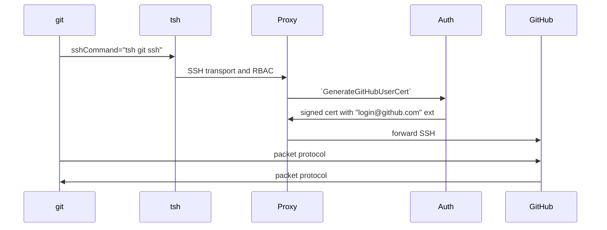

# RFD 178 - GitHub Proxy

## Required Approvers

- Engineering: @r0mant && @smallinsky
- Product: @klizhentas || @xinding33

## What

This RFD proposes design and implementation of proxying the Git SSH protocol
for GitHub repositories.

## Why

GitHub Enterprise provides a security feature to bring your own SSH certificate
authorities (CA). Once a CA is added, your organization can sign short-lived
client SSH certificates to access organization resources on GitHub. You can
also require your memebers to use these SSH certificates, which disables Git
access using personal tokens.

The concept of short-lived SSH certificates to access organization resources
aligns well with Teleport, where a Teleport user begins their day with a 'tsh'
session, accessing only what their roleset permits. Teleport can also easily
provide the capability to issue of short-lived client SSH certificates for
GitHub organzations so Teleport customers do not need to implement a separate
system for issuing these certificates. 

Teleport also offers other GitHub-related features, such as [GitHub IAM
integration](https://github.com/gravitational/teleport.e/blob/master/rfd/0021e-github-iam-integration.md)
and GitHub SSO, where this functionality can integrate nicely. Additionally,
proxying GitHub SSH through Teleport provides features like per-session MFA,
audit logging.

Teleport today offers a similar GitHub integration using
[`cert_extensions`](https://github.com/gravitational/teleport/blob/branch/v16/docs/pages/admin-guides/management/guides/ssh-key-extensions.mdx)
in the role options. This proposed GitHub proxy is considered an upgrade to the
existing feature and should replace it.

## Details

### UX - User stories

#### Alice configures GitHub proxy via UI

Alice is a system administrator and she would like to setup the GitHub SSH CA
integration with Teleport.

Alice logs into Teleport via Web UI, and searches "github" on the
"Enroll New Resource" page. Alice selects a "guided" GitHub integration
experience:
1. Alice inputs the GitHub organization "my-org", and the UI defaults (but
   editable) to the integration name to "github-my-org".
2. On the next page, the SSH CA and fingerprint are displayed with a link to
   the organization's security setting page and instructions to add the CA to
   GitHub.
3. Next step, to setup access, Alice inputs her GitHub username.
4. Lastly, Alice is presented instructions on how to use `tsh` to setup the Git
   repos.

#### Alice configures GitHub proxy via CLI

Alice is a system administrator and she would like to setup the GitHub SSH CA
integration with CLI.

First, she creates a GitHub integration using `tctl create`:
```yaml
kind: integration
sub_kind: github
version: v1
metadata:
  name: github-my-org
spec:
  github:
    organization: my-org
```

Then she exports the SSH CA and imports it to her GitHub organization:
```shell
$ tctl auth export --integration github-my-org --type github
ssh-rsa ...
```

Next, she creates a GitHub proxy server for Teleport users to access, using
`tctl create`:
```yaml
kind: node
sub_kind: openssh-github
version: v2
metadata:
  labels:
    "github-organization": "my-org"
spec:
  hostname: github-my-org
  github:
    integration: github-my-org
    organization: my-org
```

To provide access to this server, Alice creates a role using `tctl create`:
```yaml
kind: role
metadata:
  name: github-my-org-access
spec:
  allow:
    logins:
    - {{external.github_usernames}}
    node_labels:
      "github-organization": "my-org"
  deny: {}
version: v7
```

Last but not least, Alice verifies the external trait is mapped to the user and
has the right GitHub username.

#### Bob clones a new Git repository

Bob, a Teleport user that's granted access to the GitHub proxy, wants to clone
a repo. He first goes on github.com and finds the clone url. Then he logins
`tsh` and uses `tsh git clone` command and pastes the url:
```shell
$ tsh git clone git@github.com:my-org/my-repo.git
```

Once the repo is cloned, Bob can `cd` into the directory and perform regular
`git` commands naturally, without using `tsh`.

On the second day (as the `tsh` session expiress), when Bob tries to `git
fetch` from the repo, the command prompts to login into Teleport. The command
proceeds as usual once Teleport login is successful.

#### Alice wants to require Bob to use MFA for every `git` command.

Alice, a system administrator, wants to ensure that every single git command
executed by a Teleport user requires MFA, in case their on-disk Teleport
certificates are compromised.

Alice can enable per-session MFA in their Teleport role:
```diff
kind: role
metadata:
  name: github-my-org-access
spec:
  allow:
    logins:
    - {{external.github_usernames}}
    node_labels:
      "github-organization": "my-org"
  options:
+   require_session_mfa: true
version: v7
```

Now, when Bob (a Teleport user) runs `git` commands, the command also prompt
for MFA. The `git` command proceeds as usual once MFA challenge is succeeded.

#### Bob configures an existing Git repository

Bob, a Teleport user that's granted access to the GitHub proxy, wants to use
Teleport for an existing repo he has cloned before:
```shell
$ cd my-repo
$ tsh git config --update
```

If one day Bob needs to revert Teleport settings in the Git repo:
```shell
$ tsh git config --remove
```

#### Charlie wants to generate a report on GitHub access

Charlie is an auditor and wants to generate a report that lists every user that
has accessed the repos of their organization and their IP addresses on a
monthly basis.

Charlie can use SQL queres to search GitHub events using [Access
Monitoring](https://goteleport.com/docs/admin-guides/access-controls/access-monitoring):
```sql
SELECT
    user,
    remote_ip,
    COUNT(*) AS event_count
FROM
    github_command,
WHERE
    date_format(event_time, '%Y-%m') = '2024-07'
GROUP BY
    user,
    remote_ip
```

### Implementation

#### Overview


#### GitHub Integration resource

The GitHub integration resource is be a subkind (`github`) of `types.Integration`
and is shared with [GitHub IAM
integration](https://github.com/gravitational/teleport.e/blob/master/rfd/0021e-github-iam-integration.md)
feature.

In addition to Organization and settings used for IAM, the integration now
contains proxy-related settings:
```yaml
kind: integration
sub_kind: github
version: v1
metadata:
  name: github-my-org
spec:
  github:
    organization: my-org
    proxy:
      cert_authority:
      - public_key: <public_key> 
        private_key: <private_key> 
```

When the resource is created by Auth service, Auth generates the SSH key pair
and stores it in `cert_authority`.

#### GitHub proxy server resource

`github.com:22` is technically an OpenSSH server. A GitHub proxy server
resource represents `github.com:22` but on a per organization basis. The server
is a subkind (`openssh-github`) of a SSH node (which is a `types.Server`):
```yaml
kind: node
sub_kind: openssh-github
version: v2
metadata:
  labels:
    "github-organization": "my-org"
spec:
  addr: github.com:22
  hostname: github-my-org
  github:
    integration: github-my-org
    organization: my-org
```

The `addr` is hard-coded to `github.com:22`. The hostname can technically be
anything but by default should match the integration name for readibility.

Most importantly, the resource contains the name of the associated GitHub
integration.

#### `tsh git ssh` command

To forward SSH traffic from `git` to Teleport, the Git repo will be configured
with
[`core.sshCommand`](https://git-scm.com/docs/git-config#Documentation/git-config.txt-coresshCommand)
set to `tsh git ssh --username <username> --node <github-server>`. The
`core.sshCommand` makes `git` to call this command instead of `ssh`.

`tsh git ssh` is a hidden command that internally just calls `tsh ssh
<username>@<github-server> <git-upload-or-receive-pack-command>`, discarding
the original `git@github.com` target that `git` uses.

#### `tsh git clone` and `tsh git config` commands

In addition, `tsh` provides two helper commands to automatically configures
`core.sshCommand`.

`tsh git clone <git-url>` calls `git clone -c core.sshcommand=... <git-url>` to
make a clone. Before cloning, the GitHub organization is parsed from the
`<git-url>`, and a GitHub proxy server with its logins is retrieved matching
the GitHub organization. If more than one GitHub logins are available, users
can expliclitly specify one using `--username` when running `tsh git clone`.

`tsh git config` checks Teleport-related configurations in the current Git dir
by running `git config --local --list` and prints out relavent status:
```shell
$ tsh git config
Your Git repository is configured to use Teleport as a proxy.

GitHub username: <my-git-username>
GitHub organization: <my-org>
GitHub proxy server: <github-my-org>
```
Or when fails:
```shell
$ tsh git config
Your Git repository is not configured to use Teleport. To setup, run:
  tsh git config --update
```

`tsh git config --update` performs `git config --local --replace-all ...` in
the current dir to update `core.sshCommand`. Before updating, the GitHub
organization is retrieved from `git remote -v` and used to find a GitHub proxy
server.

`tsh git config --remove` restores the Git config in the current dir by
removing `core.sshCommand`, when the user wish to bypass Teleport.

#### SSH transport

To forward SSH traffic from Teleport Proxy, existing SSH transport is used,
since the GitHub proxy server is basically a SSH node.

The GitHub proxy server is considered as an OpenSSH node so Proxy will forward
the traffic directly to `github.com:22`.

#### Authentication with GitHub

The Proxy service makes an API call to Auth service to generate a GitHub user
certificate:
```protobuf
// IntegrationService provides methods to manage Integrations with 3rd party APIs.
service IntegrationService {
...
  // GenerateGitHubUserCert signs a SSH certificate for GitHub integration.
  rpc GenerateGitHubUserCert(GenerateGitHubUserCertRequest) returns (GenerateGitHubUserCertResponse);
}

// GenerateGitHubUserCertRequest is a request to sign a client certificate used by
// GitHub integration to authenticate with GitHub enterprise.
message GenerateGitHubUserCertRequest {
  // Integration is the name of the integration;
  string integration = 1;
  // PublicKey is the public key to be signed.
  bytes public_key = 2;
  // Login is the GitHub username.
  string login = 3;
  // KeyId is the certficate ID, usually the Teleport username.
  string key_id = 4;
  // Ttl is the duration the certificate will be valid for.
  google.protobuf.Duration ttl = 5;
}

// GenerateGitHubUserCertResponse contains a signed certificate.
message GenerateGitHubUserCertResponse {
  // AuthorizedKey is the signed certificate.
  bytes authorized_key = 1;
}
```

The Auth service generates the certificate according to [GitHub
spec](https://docs.github.com/en/enterprise-cloud@latest/organizations/managing-git-access-to-your-organizations-repositories/about-ssh-certificate-authorities#issuing-certificates):
- `login@github.com` extension with the GitHub username as the value.
- `ValidBefore` with a short TTL (10 minutes).
- Teleport username as key identity.

#### Recordings and events

Regular SSH recordings for the GitHub proxy server will be disabled. "Git
Command" events will replace the "Command Executation" events:
```protobuf

// GitCommand is emitted when a user performance a Git fetch or push command.
message GitCommand {
    // Metadata is a common event metadata
    Metadata `protobuf:"bytes,1,opt,name=Metadata,proto3,embedded=Metadata" json:""`
    // User is a common user event metadata
    UserMetadata `protobuf:"bytes,2,opt,name=User,proto3,embedded=User" json:""`
    // ConnectionMetadata holds information about the connection
    ConnectionMetadata `protobuf:"bytes,3,opt,name=Connection,proto3,embedded=Connection" json:""`
    // SessionMetadata is a common event session metadata
    SessionMetadata `protobuf:"bytes,4,opt,name=Session,proto3,embedded=Session" json:""`
    // ServerMetadata is a common server metadata
    ServerMetadata `protobuf:"bytes,5,opt,name=Server,proto3,embedded=Server" json:""`
    // CommandMetadata is a common command metadata. The command can be used to
    determine a fetch vs a push.
    CommandMetadata `protobuf:"bytes,6,opt,name=Command,proto3,embedded=Command" json:""`

    // Path is the Git repo path, usually <org>/<repo>.
    string path = 7 [(gogoproto.jsontag) = "path"];

    // Actions defines details for a Git push.
    repeated GitCommandAction actions = 8 [(gogoproto.jsontag) = "commands,omitempty"];
}

// GitCommandAction defines details for a Git push.
message GitCommandAction {
  // Action type like create or update.
  string Action = 1 [(gogoproto.jsontag) = "action,omitempty"];
  // Reference name like ref/main/my_branch.
  string Reference = 2 [(gogoproto.jsontag) = "reference,omitempty"];
  // Old is the old hash.
  string Old = 3 [(gogoproto.jsontag) = "old,omitempty"];
  // New is the new hash.
  string New = 4 [(gogoproto.jsontag) = "new,omitempty"];
}
```

Web UI can summarize push details based on `CommandMetadata` and
`GitCommandAction`.

In addition, a new view `git_command` should be added to Access Monitoring.

#### Other UX considerations

Users created by [GitHub
Connector](https://goteleport.com/docs/admin-guides/access-controls/sso/github-sso/)
will have the `github_usernames` trait populated automatically with their names.

SSH node "Connect" functions on Teleport Web UI or Teleport Connected will be
disabled for GitHub proxy server. Instead, clicking on the "Connect" button
will open a dialog that shows instructions to use `tsh git clone` and `tsh git
config`.

Once the SSH CA is imported to GitHub, you cannot view it again. Only
fingerprints are listed in the GitHub settings. Teleport should provide
convenient ways to show the fingerprint while exporting the CA.

### Security

#### RBAC on GitHub proxy server

Existing RBAC for a SSH node is used. Teleport users that require the GitHub
proxy should be granted through existing `node_labels` (or
`node_labels_expression`) that match the GitHub proxy server. And GitHub
usernames are specified in existing `logins`.

#### Client <-> Proxy transport

As mentioned above, existing SSH transport is used so nothing new here.

#### Proxy <-> GitHub transport

Teleport authenticates GitHub using certificates signed by the SSH CA
configured for the GitHub organization.

Teleport always use `github.com:22` as the target node port when connecting. In
addition, Teleport verifies the server using the publicly known keys or
fingerprints. They can be hard-coded as constants in the Teleport binary.
However, the server will also try fetching them from
`https://api.github.com/meta` first before using the constants.

#### Generating SSH CA for GitHub

The new CA will be generated using the existing key store. For instance, if the
Auth service stores private keys in AWS KMS, the new CA will also follow this
setup.

GitHub accepts `ssh-rsa`, `ecdsa-sha2-nistp256`, `ecdsa-sha2-nistp384`,
`ecdsa-sha2-nistp521`, or `ssh-ed25519` for the CA (at the moment of writing
this RFD). The same key type for `user CA` will be used for generating the SSH
CA. Details on the key types for each suite can be found in [rfd
0136](https://github.com/gravitational/teleport/blob/master/rfd/0136-modern-signature-algorithms.md).

#### RBAC on integration resources

By default, private keys are not retrieved when listing or getting the
integration type. A `--with-secrets` flag (for `tctl` commands) will be used to
retrive the private keys.

Besides admin users that can get the private keys, only Auth service is allowed
to get the private keys.

## Future work

### CA rotation

There is no built-in CA rotation functionality for the MVP. A `tctl auth rotate
--integration` or `tctl integration rotate` command can be implemented in the
future.

One can still perform a graceful CA rotation with the MVP with these **manual**
steps:
1. Create a new integration for the same organization and import the CA to GitHub.
2. Test through a new GitHub proxy server that everything works.
3. Either switch the old GitHub proxy server to the new integration, or copy
   the new CA to the old integration.
4. Clean up.

### Git protocol v2

The proposed MVP (using `tsh git ssh`) does not support
`GIT_PROTOCOL=version=2`. Since v2 claims to be 30~50% faster, we can
investigate to support this in the future for performance improvement.

### `git` with OpenSSH

An alternative to using `core.sshCommand` is to let `git` use OpenSSH where
the OpenSSH config is updated with the output from `tsh config`. Then the git
repo can be configured using
[`url.<base>.insteadOf`](https://git-scm.com/docs/git-config#Documentation/git-config.txt-urlltbasegtinsteadOf):
```
[url "ssh://<my-git-username>@<git-proxy-server>.<proxy-address>/<my-org>/"]
  insteadOf = <original-login>@github.com:<my-org>/
``` 

Benefits of using OpenSSH on the client side includes ControlMaster support,
Git Protocol V2, etc. However, `tsh proxy ssh` (called by OpenSSH) currently
does not support per-session MFA. Technically, using OpenSSH is also an extra
dependency but we do expect clients already have it installed.

One can still manually configure their git repo and OpenSSH config to achieve
the above. A `--openssh` flag can be added to `tsh git clone` and `tsh git
config` in the future.

### HSM support

PKCS#11 HSM, or any keystore that requires each Auth to have its own key (e.g.
KMS cross regions) is not supported for MVP. This can be supported in the
future by allowing Auth services to watch GitHub integrations and add their own
keys.

One can still achieve HSM support **manually** with the MVP by creating a new
integration on each Auth service and combines all the keys.
