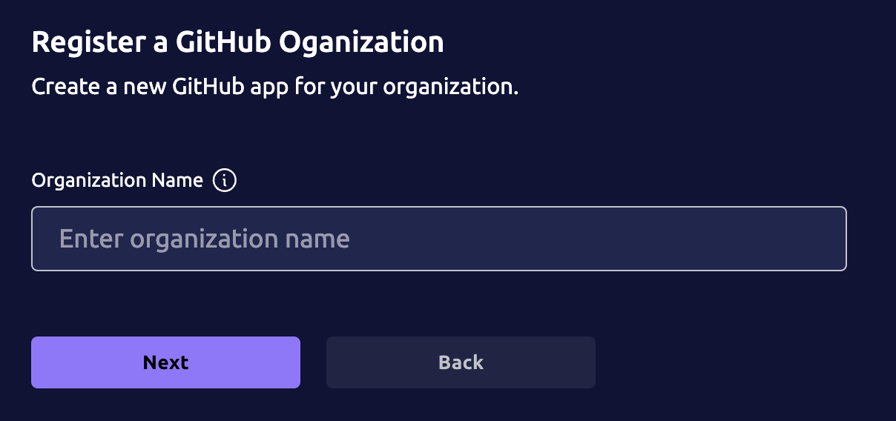
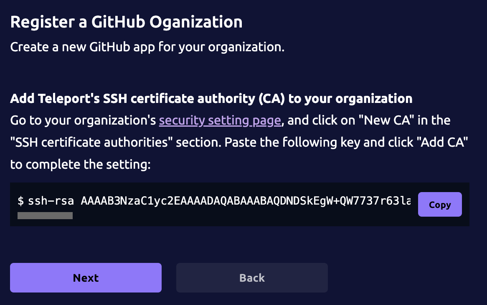

# RFD 178 - GitHub Proxy

## Required Approvers

- Engineering: @r0mant && @smallinsky
- Product: @klizhentas || @xinding33

## What

This RFD proposes design and implementation of proxying the Git SSH protocol
for GitHub applications.

## Why

GitHub Enterprise provides a security feature to bring your own SSH certificate
authorities (CA). Once a CA is added, your organization can sign short-lived
client SSH certificates to access organization resources on GitHub. You can
also require your memebers to use these SSH certificates, which disables Git
access using personal tokens.

The concept of short-lived SSH certificates to access organization resources
aligns well with Teleport, where a Teleport user begins their day with a 'tsh'
session, accessing only what their roleset permits. Teleport can also easily
provide the capability to issue of short-lived client SSH certificates for
GitHub organzations so Teleport customers do not need to implement a separate
system for issuing these certificates. 

Teleport also offers other GitHub-related features, such as [GitHub IAM
integration](https://github.com/gravitational/teleport.e/blob/master/rfd/0021e-github-iam-integration.md)
and GitHub SSO, where this functionality can integrate nicely.

## Details

### UX - User stories

#### Alice configures GitHub app via UI

Alice is a system administrator and she would like to setup the GitHub SSH CA
integration with Teleport.

Alice logs into Teleport via Web UI, and searches "github" on the
"Enroll New Resource" page. Alice selects a "guided" GitHub application
experience.

Alice puts in the GitHub organization name and clicks Next.

Alice copies the Teleport's CA then clicks on the link to the organization's security page, clicks
"New CA" button. and paste Teleport's CA.

Back to Teleport's Web UI, the last step is to "Set Up Access". Alice puts in
the GitHub username she uses for this organization.

Note that the GitHub application is separate from GitHub IAM integration.
However, when setting up GitHub IAM integration, the corresponding GitHub
application should be automatically set up so this user story is not
neccessary. (However, the GitHub IAM integration flow should present the part
for exporting Teleport's CA.)

#### Alice configures GitHub app via CLI

Alice is a system administrator and she would like to setup the GitHub SSH CA
integration with CLI.

TODO

#### Bob clones a new repository

TODO

`tsh git clone --app my-org git@github.com:my-org/my-repo.git`

#### Bob configures an existing resposity

TODO

`tsh git configure --app my-org git@github.com:my-org/my-repo.git`

### Implementation
### Security
## Future work
