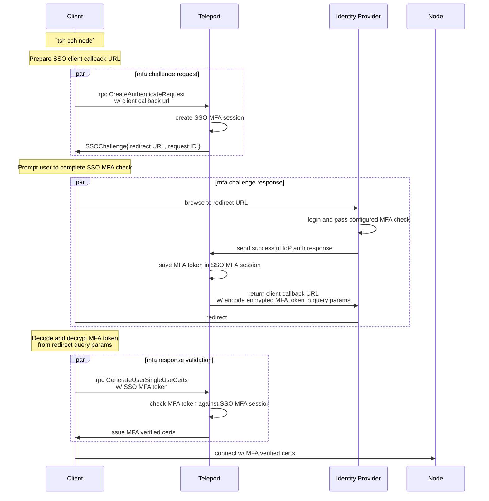

# RFD 180 - SSO MFA

## Required Approvers

* Engineering: @rosstimothy || @codingllama
* Product: @xinding33 || @klizhentas

## What

Provide the ability to satisfy Teleport MFA checks via a 3rd party identity
provider with SSO.

Per-session MFA must be supported for all Teleport clients, while additional
features will be included as a stretch goal, such as MFA for admin actions and
moderated sessions. Ideally we will support SSO as a first class MFA method.

## Why

Delegating MFA checks to a registered IdP has several potential benefits:
- Administrators gain the ability to configure and monitor all authentication
directly through an IdP.
- Teleport can integrate with custom MFA mechanisms and devices registered
setup through an IdP.
- Improves UX for new SSO users by providing an MFA flow without requiring the
user to manually register a new device.
- Improve UX for existing users by providing multiple paths during MFA checks,
such as when they don't have their WebAuthn device plugged in.
- Improve security of new SSO users by requiring an SSO MFA check to add their
first MFA device.

## Details

### UX

This feature will provide users with additional paths towards passing MFA
checks. In some cases, such as when the user has no MFA device registered,
this will improve UX.

Adding an SSO MFA option also comes with potential downsides:
- Providing too many options without clarity (OTP, Webauthn, and SSO).
- Locking users into SSO MFA in cases where WebAuthn may be preferred.
- Automatically opening browser windows when WebAuthn may be preferred.

These concerns will be addressed in the sections below.

#### Devices

When an auth connector has MFA enabled, Teleport will treat it as if any user
originating from that auth connector has a corresponding SSO MFA device
registered. This way, users can view their true MFA options.

```console
> tsh mfa ls
Name     Type     Added at Last used                     
-------- -------- -------- ---------
yubi     WebAuthn ...      ...
okta     SAML     ...      ...
```

Note: Teleport does not actually store a MFA device backend resource for each
user. This means that interaction, e.g. `tsh mfa add/rm`, will not work and should
result in a readable error message. If we want to support `tsh mfa add/rm`, we
can implement the functionality behind the scenes with a new user preferences
field, e.g. `use_sso_mfa`. I'm leaving this out of scope for now.

#### Modes

Auth connectors with MFA enabled will be configured with one of the following
modes:
- `optional`: SSO MFA is available to the user, but WebAuthn is preferred when
  applicable.
- `preferred`: SSO MFA is preferred over WebAuthn, but Webauthn is still
  available to the user.
- `required`: SSO MFA is the only available MFA method.

Each mode has UX implications that will be explored in more detail below.

Note: Like WebAuthn, SSO will always be preferred over OTP, unless OTP is
requested with `tsh --mfa-mode=otp`.

#### `tsh`

When SSO MFA is enabled, there are three possible MFA prompts. The prompt depends
on whether SSO MFA is optional, preferred, or required, and whether the user has
any Webauthn devices registered *and* available.

1. SSO is the only available MFA method, is required, or user passed the
`--mfa-mode=sso` flag.
```console
Complete an auth check in your local web browser:
If browser window does not open automatically, open it by clicking on the link:
 http://127.0.0.1:60433/f5858c78-75e1-4f3f-b2c5-69e8e76c0ff9
```

2. SSO is available, but Webauthn is preferred.
```console
Complete an auth check in your local web browser. Open it by clicking on the link:
 http://127.0.0.1:60433/f5858c78-75e1-4f3f-b2c5-69e8e76c0ff9

Or tap any security key
```

3. Webauthn is available, but SSO is preferred.
```console
Complete an auth check in your local web browser:
If browser window does not open automatically, open it by clicking on the link:
 http://127.0.0.1:60433/f5858c78-75e1-4f3f-b2c5-69e8e76c0ff9

Or tap any security key
```

Here's the same information in chart form:

| Mode      | WebAuthn available | Type | Browser   | Prompt |
|-----------|--------------------|------|-----------|--------|
| *         | no                 | SSO  | Launch    | 1      |
| optional  | yes                | Both | Clickable | 2      |
| preferred | yes                | Both | Launch    | 3      |
| required  | yes                | SSO  | Launch    | 1      |

Note: It should be simple to detect whether the user has an MFA device plugged
in using the `libfido2` or touchID libraries for MacOS and Linux. Window's
`webauthn.dll` should support the same functionality, but that is TBD during
the implementation. Worst case we will fall back to prompting for both.

See [User Stories](#user-stories) for more specific examples.

#### Teleport Connect

The Teleport connect flow will be identical to `tsh`.

TODO: POC THIS

#### WebUI

In the WebUI, we will add a `SSO` button the existing MFA modal when SSO MFA is
enabled.

The UI will change depending on the [SSO MFA Mode](#sso-mfa-modes):
| Mode      | WebAuthn button   | SSO button        |
|-----------|-------------------|-------------------|
| optional  | colored, selected | gray              |
| preferred | gray              | colored, selected |
| required  | removed           | colored, selected |

When the user clicks the SSO button, the SSO redirect URL will be opened in a
new browser window. Once the SSO authentication is complete, the window will
close, and the WebUI will proceed with the resulting MFA response.

TODO: POC THIS

Note: If possible, it would be best to open the SSO redirect URL in a pop up
window rather than opening a new tab. I'm leaving this as an implementation
decision.

### User stories

#### First time SSO user

> I am a new Teleport user logging in to the cluster for the first time
> I want to connect to a resource protected by per-session MFA
> I have not registered through Teleport, my company uses an IdP provider for login

##### Old behavior

When the user logs in with SSO for the first time, their Teleport user is created
without any MFA devices registered. In order to access resources protected by
per-session MFA, they would need to add an MFA device through `tsh mfa add` or
the settings tab in the WebUI.

Attempting to connect to the cluster without an MFA device currently results in
an error telling the user to add their first MFA device.

```console
> tsh ssh server01
ERROR: MFA is required to access this resource but user has no MFA devices; use 'tsh mfa add' to register MFA devices
```

##### SSO MFA prompt

With SSO as an MFA method, this first time user will instead be prompted to
re-authenticate through their SSO provider for a more seamless experience.

```console
> tsh ssh server01
MFA is required to access Node "server01"
Complete an auth check in your local web browser:
If browser window does not open automatically, open it by clicking on the link:
 http://127.0.0.1:60433/f5858c78-75e1-4f3f-b2c5-69e8e76c0ff9
```

##### Adding first MFA Device

Usually, a new SSO user without a registered MFA device can add their first
device without an additional authentication check. With SSO MFA, we can include
an MFA check even for the first device.

TODO:: show tsh add and delete

#### Existing SSO user with registered MFA method

> I have logged into this cluster before with SSO
> I have registered one or more MFA devices
> I want to connect to a resource protected by per-session MFA

##### SSO MFA prompt

The user will be given the option to pass MFA checks with a registered device
or with SSO, depending on the MFA mode of the user's auth connector.

```console
> tsh ssh server01
MFA is required to access Node "server01"
Complete an auth check in your local web browser. Open it by clicking on the link:
 http://127.0.0.1:60433/f5858c78-75e1-4f3f-b2c5-69e8e76c0ff9
 
Or tap any security key
```

Note that the exact prompt may differ depending on which [config scenario](#tsh)
we are in.

##### Deleting last MFA device

Similar to how we can add an SSO MFA check for a [user adding their first device](#adding-first-mfa-device),
we can use an SSO MFA check for users removing their last device, which is
usually forbidden. This may be useful if the user wants to makes SSO their
default MFA method for UX purposes.

### Configuration

#### Enable SSO connector as MFA method.

Auth connectors will have a new `mfa` settings field that can be set to allow
an auth connector to handle MFA checks in addition to login requests. These
MFA settings will apply to all users registered through the Auth connector.

```yaml
kind: saml
version: v2
metadata:
  name: okta
spec:
  display: Okta
  acs: https://root.example.com:3080/v1/webapi/saml/acs/okta
  entity_descriptor_url: AAA
  entity_descriptor: BBB
  attributes_to_roles:
    - {name: groups, value: okta-dev, roles: [dev]}
  # new mfa settings field. Defaults to null.
  mfa:
    # enabled specifies whether this auth connector supports MFA checks.
    enabled: yes
    # mode can be set to determine how Teleport decides to prioritize SSO MFA
    # over other MFA options for users tied to this auth connector. Supported
    # values are optional (default), preferred, and required.
    mode: optional
    # set entity_descriptor_url or entity_descriptor to use a different IdP configured
    # app to handle MFA checks. This is useful when configuring a separate MFA flow
    # tied to a separate app. Defaults to the entity_descriptor_url and entity_descriptor above.
    entity_descriptor_url: XXX
    entity_descriptor: YYY
    # force_reauth determines whether existing login sessions are accepted or if
    # re-authentication is always required. Defaults to "yes".
    force_reauth: yes
---
kind: oidc
version: v2
metadata:
  name: auth0
spec:
  display: Auth0
  client_id: AAA
  client_secret: BBB
  issuer_url: https://gravitational.auth0.com/
  redirect_url: https://root.example.com:3080/v1/webapi/oidc/callback
  claims_to_roles:
    - {claim: email, value: bjoerger@goteleport.com, roles: [dev]}
  # new mfa settings field. Defaults to null.
  mfa:
    # enabled specifies whether this auth connector supports MFA checks.
    enabled: yes
    # mode can be set to determine how Teleport decides to prioritize SSO MFA
    # over other MFA options for users tied to this auth connector. Supported
    # values are optional (default), preferred, and required.
    mode: optional
    # set client_id and client_secret to use a different IdP configured app to
    # handle MFA checks. This is useful when configuring a separate MFA flow
    # tied to a separate app. Defaults to the client_id and client_secret above.
    client_id: XXX
    client_secret: YYY
    # prompt can be set to request a specific prompt flow from the IdP. Supported
    # values depend on the IdP.
    prompt: null
    # acr_values can be optionally set to request a specific acr from the IdP
    # for MFA checks. Supported values depend on the IdP.
    acr_values: []
    # max_age determines when an existing IdP session should be considered
    # expired. Defaults to "0" to force re-authentication on MFA checks.
    max_age: 0
---
kind: github
metadata:
  name: github
spec:
  client_id: AAA
  client_secret: BBB
  display: GitHub
  redirect_url: https://root.example.com:3080/v1/webapi/github/callback
  teams_to_roles:
    - { organization: org-name, team: github-team, roles: [dev], }
  # new mfa settings field. Defaults to null.
  mfa:
    # enabled specifies whether users originating from this auth connector
    # can use the auth connector for MFA flows.
    enabled: yes
    # mode can be set to determine how Teleport decides to prioritize SSO MFA
    # over other MFA options for users tied to this auth connector. Supported
    # values are optional (default), preferred, and required.
    mode: optional
    # set client_id and client_secret to use a different IdP configured app to
    # handle MFA checks. This is useful when configuring a separate MFA flow
    # tied to a separate app. Defaults to the client_id and client_secret above.
    client_id: XXX
    client_secret: YYY
    # max_age determines when an existing IdP session should be considered
    # expired. Defaults to "0" to force re-authentication on MFA checks.
    max_age: 0
```

Most of the MFA setting options are inherited from the parent auth connector,
but let's cover some of the new ones in more detail.

##### `mfa.mode`

See [SSO MFA Modes](#sso-mfa-modes).

##### `mfa.force_reauth` (saml)

For SAML, forced re-authentication can be achieved by adding the `ForceAuth`
attribute to the SAML request. This field will be added to both the parent
and MFA auth connector settings.

##### `mfa.max_age` (github) 

The github connector does not currently support `max_age`, so it will be
added to both the parent and MFA auth connector settings to match the
generic OIDC auth connector resource.

### Security

Teleport uses MFA checks for some of its most security focused features, including
per-session MFA, moderated sessions, and MFA for admin actions. Using SSO as an
MFA method opens up the possibility of poorly configured auth connectors being
vulnerable to attacks ranging from internal users avoiding safe MFA checks to
attackers with a compromised IdP gaining keys to the castle.

#### Strict Guidelines

SSO as an MFA method will be opt-in. Administrators will be instructed through
the docs to only enable MFA for an auth connector if the IdP provider has strict
checks itself (e.g. Administered Webauthn devices, Trusted devices).

Teleport has no way to confirm whether a registered IdP connector follows the
guidelines, but it will display a warning to admins who attempt to enable it.

```console
> tctl edit connector/okta
### sets `spec.mfa.enabled=yes`

Warning: Allowing this IdP provider to be used as an MFA method may reduce the
security of enforced MFA checks for critical security features. This option
should not be enabled unless the IdP provider has strict MFA and/or Device trust
enforcement itself. Continue? (y/N):
```

Additionally, forced re-authentication will be the default setting. Even if a
connector is enabled for MFA without actual strict IdP MFA checks, the user will
still be required to re-authenticate through the SSO provider. In practice,
this means that a stolen SSO session is not enough for an attacker to bypass
MFA checks, they'd need to steal the user's SSO identity (password, MFA).

#### IdP Compromise

In the case of a full-scale IdP compromise, an attacker may have the ability
to auto-provision users with arbitrary permissions.

When device trust is required, newly auto-provisioned SSO users are required
to add their first MFA device from a trusted device. When combined with MFA
security features, such as MFA for Admin actions and per-session MFA, the blast
radius of an IdP compromise is largely contained. The attacker would be
prevented from accessing any critical infrastructure or making any changes
to the cluster's security configuration.

Allowing SSO as an MFA method would bypass the device trust check, opening the
cluster back up to attacks in the case of an IdP compromise. To maintain this
invariant, device trust must be enforced within the SSO MFA check.

### Implementation

#### SSO MFA flow



Caveat: this flow will be slightly different for the WebUI, where we use a CSRF
token instead of a secret key, and save the MFA token as a web cookie to avoid
redirecting the user in the browser.

#### SSO MFA session

When a user requests an SSO MFA challenge, an SSO MFA session data object will
be created in the backend. Once the user completes the SSO MFA flow, the client
and session data will gain a matching MFA token, which can be used by the client
to verify itself as the owner of the session.

Note: challenge extensions are included, so scopes and reuse are both available.
See RFD 155 for details.

```go
// SSOMFASessionData SSO MFA Session data.
type SSOMFASessionData struct {
  // RequestID is the ID of the corresponding SSO Auth request, which is used to
  // identity this session.
  RequestID string `json:"request_id,omitempty"`
  // Username is the Teleport username.
  Username string `json:"username,omitempty"`
  // MFAToken is a secret token set when the SSO flow is completed and returned to
  // the user. The user can then use this token to prove they own the MFA session.
  MFAToken string `json:"token,omitempty"`
  // ConnectorID is id of the corresponding Auth connector.
  ConnectorID string `json:"connector_id,omitempty"`
  // ConnectorType is SSO type of the corresponding Auth connector (SAML, OIDC, or Github).
  ConnectorType string `json:"connector_type,omitempty"`
  // ChallengeExtensions are challenge extensions that apply to this SSO MFA session.
  ChallengeExtensions *mfav1.ChallengeExtensions `json:"challenge_extensions,omitempty"`
}
```

#### MFA device

Teleport will treat any user that originated from an mfa-enabled auth connector
as if they have an SSO MFA device registered. This device is not stored in the
backend. Instead, it is retrieved by checking the user's `CreatedBy` field,
fetching the corresponding auth connector, checking if it has MFA enabled, and
then filling out an SSO MFA device from the auth connector's details.

### Proto

**CreateAuthenticateChallengeRequest**

```diff
message CreateAuthenticateChallengeRequest {
  ...
+ // SSOClientRedirectURL should be supplied If the client supports SSO MFA checks.
+ // If unset, the server will only return non-SSO challenges, or an error if SSO
+ // challenges are required.
+ string SSOClientRedirectURL = 7 [(gogoproto.jsontag) = "sso_client_redirect_url,omitempty"];
}
```

**SSOChallenge**

```proto
// SSOChallenge contains SSO auth request details to perform an SSO MFA check.
message SSOChallenge {
  // RequestId is the ID of an SSO auth request.
  string request_id = 1;
  // RedirectUrl is an IdP redirect URL to initate the SSO MFA flow.
  string redirect_url = 2;
}
```

```diff
message MFAAuthenticateResponse {
  oneof Response {
    TOTPResponse TOTP = 2;
    webauthn.CredentialAssertionResponse Webauthn = 3;
+   SSOResponse SSO = 4;
  }
}
```

**SSOResponse**

```proto
// SSOResponse is a response to SSOChallenge.
message SSOResponse {
  // RequestId is the ID of an SSO auth request.
  string request_id = 1;
  // MFAToken is a secret token used to verify the user's SSO MFA session.
  string mfa_token = 2;
}
```

```diff
message MFAAuthenticateChallenge {
  ...
+ // SSO Challenge is an sso MFA challenge. If set, the client can go to the
+ // IdP redirect URL to perform an MFA check in the IdP and obtain an MFA
+ // token. This token and sso request pair can then be used as MFA verification.
+ SSOChallenge SSOChallenge = 5;
}
```

**SSOMFADevice**

```proto
// SSOMFADevice contains details of an SSO MFA method.
message SSOMFADevice {
  // connector_id is the ID of the SSO connector.
  string connector_id = 1;
  // connector_type is the type of the SSO connector.
  string connector_type = 2;
}
```

```diff
message MFADevice {
  ...
  oneof device {
    TOTPDevice totp = 8;
    U2FDevice u2f = 9;
    WebauthnDevice webauthn = 10;
+   SSOMFADevice sso = 11;
  }
}
```

**AuthConnectorMFAMode**

```proto
// AuthConnectorMFAMode specified the MFA mode of an Auth Connector.
enum AuthConnectorMFAMode {
  // UNSPECIFIED is treated as OPTIONAL.
  AUTH_CONNECTOR_MFA_MODE_UNSPECIFIED = 0;
  // OPTIONAL mfa through this auth connector is optional and other MFA methods are preferred.
  AUTH_CONNECTOR_MFA_MODE_OPTIONAL = 1;
  // PREFERRED mfa through this auth connector is preferred and other MFA methods are optional.
  AUTH_CONNECTOR_MFA_MODE_PREFERRED = 2;
  // REQUIRED mfa through this auth connector is required and other MFA methods are disabled.
  AUTH_CONNECTOR_MFA_MODE_REQUIRED = 3;
}
```

**SAMLConnectorMFASettings**

```proto
message SAMLConnectorMFASettings {
  // Enabled specified whether this SAML connector supports MFA checks. Defaults to false.
  bool enabled = 1;
  // MFAMode specifies what MFA mode this auth connector will operate with. Defaults to "optional".
  AuthConnectorMFAMode mfa_mode = 2;
  // EntityDescriptor is XML with descriptor. It can be used to supply configuration
  // parameters in one XML file rather than supplying them in the individual elements.
  // If unset, the parent SAML connector's EntityDescriptor will be used.
  string entity_descriptor = 3;
  // EntityDescriptorUrl is a URL that supplies a configuration XML. If unset, 
  // the parent SAML connector's EntityDescriptor will be used.
  string entity_descriptor_url = 4;
  // ForceReauth specified whether re-authentication should be forced for MFA checks. UNSPECIFIED is 
+ // treated as YES. to always re-authentication for MFA checks. This should only be set to YES if the
  // IdP is setup to perform MFA checks on top of active user sessions. 
  SAMLForceReauth ForceReauth = 5;
}

// SAMLForceReauth specified whether existing SAML sessions should be accepted or re-authentication
// should be forced.
enum SAMLForceReauth {
  // UNSPECIFIED is treated as the default value for the context; NO for login, YES for MFA checks.
  FORCE_REAUTH_UNSPECIFIED = 0;
  // YES re-authentication should be forced for existing SAML sessions..
  FORCE_REAUTH_YES = 1;
  // NO re-authentication should not be forced for existing SAML sessions.
  FORCE_REAUTH_NO = 2;
}
```

```diff
message SAMLConnectorSpecV2 {
  ...
+ // MFASettings contains settings to enabled SSO MFA checks through this auth connector.
+ SAMLConnectorMFASettings MFASettings = 17 [(gogoproto.jsontag) = "mfa_settings,omitempty"];
+ // ForceReauth specified whether re-authentication should be forced on login. UNSPECIFIED
+ // is treated as NO.
+ SAMLForceReauth ForceReauth = 18 [(gogoproto.jsontag) = "force_reauth,omitempty"];
}
```

**OIDCConnectorMFASettings**

```proto
message OIDCConnectorMFASettings {
  // Enabled specified whether this SAML connector supports MFA checks. Defaults to false.
  bool enabled = 1;
  // MFAMode specifies what MFA mode this auth connector will operate with. Defaults to "optional".
  AuthConnectorMFAMode mfa_mode = 2;
  // ClientID is the id of the authentication client (Teleport Auth server). If unset, 
  // the parent OIDC connector's ClientID will be used.
  string client_id = 3;
  // ClientSecret is used to authenticate the client. If unset, the parent OIDC connector's
  // ClientSecret will be used.
  string client_secret = 4;
  // AcrValues are Authentication Context Class Reference values. The meaning of the ACR
  // value is context-specific and varies for identity providers. Some identity providers
  // support MFA specific contexts, such Okta with its "phr" (phishing-resistant) ACR.
  string acr_values = 5;
  // Prompt is an optional OIDC prompt. An empty string omits prompt.
  // If not specified, it defaults to select_account for backwards compatibility.
  string prompt = 6;
  // MaxAge is the amount of time that an IdP session is valid for. Defaults to 0 to always
  // force re-authentication for MFA checks. This should only be set to a non-zero value if
  // the IdP is setup to perform MFA checks on top of active user sessions.
  google.protobuf.Duration max_age = 67;
}
```

```diff
message OIDCConnectorSpecV3 {
  ...
+ // MFASettings contains settings to enabled SSO MFA checks through this auth connector.
+ OIDCConnectorMFASettings MFASettings = 19 [(gogoproto.jsontag) = "mfa_settings,omitempty"];
}
```

**GithubConnectorMFASettings**

```proto
message GithubConnectorMFASettings {
  // Enabled specified whether this SAML connector supports MFA checks. Defaults to false.
  bool enabled = 1;
  // MFAMode specifies what MFA mode this auth connector will operate with. Defaults to "optional".
  AuthConnectorMFAMode mfa_mode = 2;
  // ClientID is the id of the authentication client (Teleport Auth server). If unset, the parent 
  // Github connector's ClientID will be used.
  string client_id = 3;
  // ClientSecret is used to authenticate the client. If unset, the parent Github connector's
  // ClientSecret will be used.
  string client_secret = 4;
  // MaxAge is the amount of time that an IdP session is valid for. Defaults to 0 to always
  // force re-authentication for MFA checks. This should only be set to a non-zero value if
  // the IdP is setup to perform MFA checks on top of active user sessions.
  google.protobuf.Duration max_age = 5;
}
```

```diff
message GithubConnectorSpecV3 {
  ...
+ // MFASettings contains settings to enabled SSO MFA checks through this auth connector.
+ GithubConnectorMFASettings MFASettings = 10 [(gogoproto.jsontag) = "mfa_settings,omitempty"];
}
```

### Backward Compatibility

The SSO MFA flow is mostly backwards compatible; If SSO MFA is not supported,
both the client and server will fallback to classic MFA methods.

In the case that the client expects SSO MFA, but the Auth server doesn't return
an SSO MFA challenge, the client will return an error indicating that SSO MFA
is not supported for the user. This would occur if the client supplies
`--mfa-mode=sso` despite SSO MFA not being supported for them, whether its
because the Auth connector have MFA enabled or the Auth server is simply out
of date and doesn't support SSO MFA

In the case that the SSO MFA is required for a user, but the client doesn't
provide a sso client callback URL in an authenticate challenge request, the
server will return an error indicating that SSO MFA is required and the client
must provide a client callback URL. Since this will only happen in out of date
client, the error message will indicate that the user must upgrade to v17+.

If the Proxy server is out of date, the MFA token will be lost at the end of
the flow due to the SSO callback endpoints not knowing about the MFA token
field. The client will catch when the MFA token field is missing and return an
error indicating that the proxy server does not support SSO MFA, and to contact
cluster administrators to update to v17+ if this is unexpected.

### Audit Events

SSO MFA checks will be tracked through the existing audit events that contain
`MFADeviceMetadata`, using the [SSO MFA device](#mfa-device) tied to the SSO
MFA session.

In practice, the metadata will be filled out like this:
- `DeviceName` - Name of the auth connector
- `DeviceID` - UUID of the auth connector
- `DeviceType` - SSO type (`OIDC`, `SAML`, or `Github`)

```proto
message MFADeviceMetadata {
  // Name is the user-specified name of the MFA device.
  string DeviceName = 1 [(gogoproto.jsontag) = "mfa_device_name"];
  // ID is the UUID of the MFA device generated by Teleport.
  string DeviceID = 2 [(gogoproto.jsontag) = "mfa_device_uuid"];
  // Type is the type of this MFA device.
  string DeviceType = 3 [(gogoproto.jsontag) = "mfa_device_type"];
}
```

### Additional considerations

#### OIDC ACR Values

ACR values can be provided to an OIDC provider in an auth request to specify a
specific type of authentication to perform. This can be useful for Teleport to
specify to the IdP that MFA authentication is required.

However, there are no common ACR values supported by all OIDC providers. Each
provider will support its own arbitrary list of ACR values, if any at all.

For example, Okta supports a phishing resistant (phr) acr value that would
require Fido2/WebAuthn authentication to satisfy the requirement.

Since this will vary between providers and configurations, Teleport will not
use any ACR values by default, though we will document how to set `acr_values`
in the OIDC connector in cases where it is useful.

#### SAML RequestedAuthnContext

A SAML client can provide `RequestedAuthnContext` to request a specific type of
authentication. Similar to ACR values, the supported values vary between
providers and configurations, so Teleport cannot make direct use of them.

Once we find a SAML provider with a supported `RequestedAuthnContext` similar to
Okta's phr ACR value, we may add a `requested_authn_context` field to the SAML
connector resource to support it in certain configurations.

Note: When using ADFS or JumpCloud as a SAML IdP, Teleport requires password
auth by setting `PasswordProtectedTransport` as a minimum `RequestedAuthnContext`.
This minimum will be skipped when the SAML connector is enabled for MFA only.