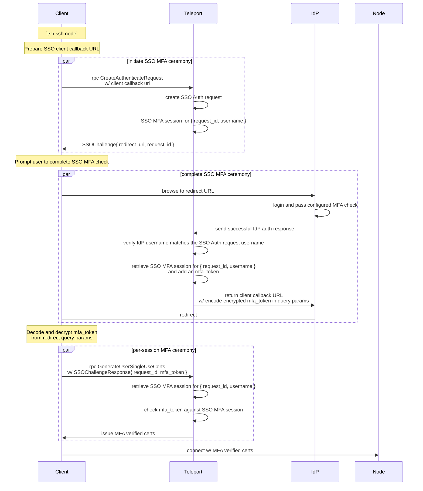
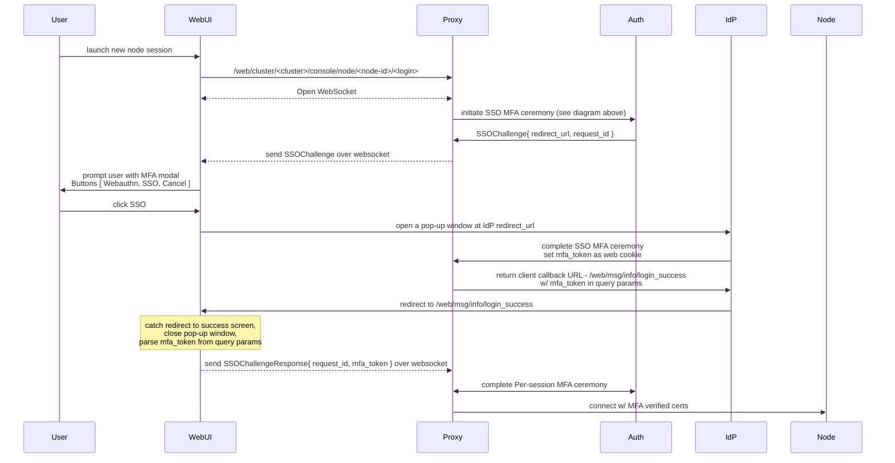

# RFD 180 - SSO MFA

## Required Approvers

* Engineering: @rosstimothy || @codingllama
* Product: @xinding33 || @klizhentas

## What

Provide the ability to satisfy Teleport MFA checks via a 3rd party identity
provider with SSO.

Per-session MFA must be supported for all Teleport clients, while additional
features will be included as a stretch goal, such as MFA for admin actions and
moderated sessions. Ideally we will support SSO as a first class MFA method.

## Why

Delegating MFA checks to a registered IdP has several potential benefits:
- Administrators gain the ability to configure and monitor all authentication
directly through an IdP.
- Teleport can integrate with custom MFA mechanisms and devices registered
setup through an IdP.
- Improves UX for new SSO users by providing an MFA flow without requiring the
user to manually register a new device.
- Improve UX for existing users by providing multiple paths during MFA checks,
such as when they don't have their WebAuthn device plugged in.
- Improve security of new SSO users by requiring an SSO MFA check to add their
first MFA device.

## Details

### UX

This feature will provide users with additional paths towards passing MFA
checks. In some cases, such as when the user has no MFA device registered,
this will improve UX.

Adding an SSO MFA option also comes with potential downsides:
- Providing too many options without clarity (OTP, Webauthn, and SSO).
- Locking users into SSO MFA in cases where WebAuthn may be preferred.
- Automatically opening browser windows when WebAuthn may be preferred.

These concerns will be addressed in the sections below.

#### Devices

When an auth connector has MFA enabled, Teleport will treat it as if any user
originating from that auth connector has a corresponding SSO MFA device
registered. This way, users can view their true MFA options.

```console
> tsh mfa ls
Name     Type     Added at Last used                     
-------- -------- -------- ---------
yubi     WebAuthn <date>   <date>
okta     SAML     -        -
```

Note: Teleport does not actually store a MFA device backend resource for each
user. This means that interaction, e.g. `tsh mfa add/rm`, will not work and should
result in a readable error message. If we want to support `tsh mfa add/rm`, we
can implement the functionality behind the scenes with a new user preferences
field, e.g. `use_sso_mfa`. I'm leaving this out of scope for now.

#### Preferred MFA Method

The MFA method preference order (descending) will be:

1. Webauthn
2. SSO
3. OTP

This means that when given the option between 2 or 3 possible MFA methods,
Teleport clients will default to the most preferred option. Additional MFA
options should be displayed as well to give users a path to use them instead.

Note: The only time we prompt with two MFA options is during login for users
with Webauthn and OTP devices available. This will be unchanged.

#### `tsh`

When a user is prompted for MFA, they will automatically be prompted for the
preferred MFA method available to that user. The user will also be notified
of the preferred MFA method with instructions on how to use a different
available method.

```console
Available MFA methods [WEBAUTHN, SSO, OTP]. Continuing with WEBAUTHN.
If you wish to perform MFA with another method, specify with --mfa-mode=<sso,webauthn,otp> flag. 

Tap any security key to continue
```

When SSO MFA is the preferred MFA method, the user will be prompted to complete
the SSO MFA flow instead of tapping a security key:

```console
Available MFA methods [SSO, OTP]. Continuing with SSO.
If you wish to perform MFA with another method, specify with --mfa-mode=<sso,webauthn,otp> flag. 

To continue, complete an auth check in your local web browser:
If browser window does not open automatically, open it by clicking on the link:
 http://127.0.0.1:60433/f5858c78-75e1-4f3f-b2c5-69e8e76c0ff9
```

SSO MFA is the preferred method when:

1. `--mfa-mode=sso` flag is provided
2. User has no WebAuthn device registered or connected

Note: On MacOS, Linux, and Window's we can detect whether the user has an MFA
device plugged in using the `libfido2` and touchID libraries.

See [User Stories](#user-stories) for more specific examples.

#### WebUI and Teleport Connect

We will add an `SSO` button to the existing MFA modal when SSO MFA is enabled.
The `Continue` button will be changed to say `WebAuthn`.

Each button will be gray, colored, or removed depending on which methods are
available.

| Webauthn | SSO | WebAuthn button | SSO button |
|----------|-----|-----------------|------------|
| yes      | yes | colored         | gray       |
| yes      | no  | colored         | removed    |
| no       | yes | removed         | colored    |

When the user clicks the SSO button, the SSO redirect URL will be opened in a
pop up browser window. Once the SSO authentication is complete, the window will
close, and the WebUI will proceed with the resulting MFA response.

#### Teleport Connect

In some cases, Teleport Connect uses the WebUI or `tsh` implementation to
handle MFA prompts (Per-session MFA for Server and App access).

In other cases Teleport Connect's `tshd` prompts webauthn (blinking key) and
displays a modal to notify the user that WebAuthn must be provided to continue.

`tshd`'s MFA prompt will be updated to display a modal with a `WebAuthn` and
`SSO` button just like the WebUI modal described above.

If the WebAuthn button is clicked, the user's WebAuthn key should start blinking
and the current WebAuthn modal will be displayed until the user taps their key.

If the SSO button is clicked, a browser window will open automatically. A new
SSO modal will be displayed to allow the user to cancel the SSO login, or to
go to the displayed (clickable) link in case the browser failed to open
automatically.

### User stories

#### First time SSO user

> I am a new Teleport user logging in to the cluster for the first time
> I want to connect to a resource protected by per-session MFA
> I have not registered through Teleport, my company uses an IdP provider for login

##### Old behavior

When the user logs in with SSO for the first time, their Teleport user is created
without any MFA devices registered. In order to access resources protected by
per-session MFA, they would need to add an MFA device through `tsh mfa add` or
the settings tab in the WebUI.

Attempting to connect to the cluster without an MFA device currently results in
an error telling the user to add their first MFA device.

```console
> tsh ssh server01
ERROR: MFA is required to access this resource but user has no MFA devices; use 'tsh mfa add' to register MFA devices
```

##### SSO MFA prompt

With SSO as an MFA method, this first time user will instead be prompted to
re-authenticate through their SSO provider for a more seamless experience.

```console
> tsh ssh server01
MFA is required to access Node "server01"

To continue, complete an auth check in your local web browser:
If browser window does not open automatically, open it by clicking on the link:
 http://127.0.0.1:60433/f5858c78-75e1-4f3f-b2c5-69e8e76c0ff9
```

##### Adding first MFA Device

Usually, a new SSO user without a registered MFA device can add their first
device without an additional authentication check. With SSO MFA, we can include
an MFA check even for the first device.

```console
> tsh mfa add
Choose device type [TOTP, WEBAUTHN]: WEBAUTHN
Enter device name: yubi
Allow passwordless logins [YES, NO]: NO

To continue, complete an auth check in your local web browser:
If browser window does not open automatically, open it by clicking on the link:
 http://127.0.0.1:53129/65ddd8d8-0616-4b61-b442-595871838247

### complete registration
Tap your *new* security key
...
```

#### Existing SSO user with registered MFA method

> I have logged into this cluster before with SSO
> I have registered one or more WebAuthn devices
> I want to connect to a resource protected by per-session MFA

##### SSO MFA prompt

The user will be given the option to pass MFA checks with a registered device
or with SSO, depending on the what methods are available..

```console
### WebAuthn and SSO available
> tsh ssh server01
MFA is required to access Node "server01"
Available MFA methods [WEBAUTHN, SSO]. Continuing with WEBAUTHN.
If you wish to perform MFA with another method, specify with --mfa-mode=<sso,webauthn,otp> flag. 

Tap any security key to continue
```

```console
### Only SSO available
> tsh ssh server01
MFA is required to access Node "server01"

To continue, complete an auth check in your local web browser:
If browser window does not open automatically, open it by clicking on the link:
 http://127.0.0.1:60433/f5858c78-75e1-4f3f-b2c5-69e8e76c0ff9
```

##### Deleting last MFA device

Similar to how we can add an SSO MFA check for a [user adding their first device](#adding-first-mfa-device),
we can use an SSO MFA check for users removing their last device, which is
usually forbidden. This may be useful if the user wants to makes SSO their
default MFA method for UX purposes.

Note: SSO users do not rely on their MFA methods to login, meaning they will
not be locked out when they have no second factors, even if second factor is
set to required in the cluster auth preference. SSO users are just required to
register an MFA device before using any features that require MFA.

Note: Passwordless devices are treated separately from MFA devices. Usually we
prevent users from deleting passwordless devices to prevent them from being
locked out, but SSO users without a passwordless device can still perform SSO
login. Since the SSO MFA device is not a passwordless device, the change above
will not apply to deleting your last passwordless device. Instead we should
provide a special case to SSO users to delete their last passwordless device if
they have any other MFA device. This change is not in direct scope of this RFD,
but will likely be done beside it.

### Configuration

SSO MFA requires both Cluster Auth Preference and Auth Connector configuration
to function.

#### Cluster Auth Preference

Whether SSO MFA can be used for a given user depends on whether that user is an
SSO user and whether that user's Auth Connector is configured for MFA (below).
Therefore, it does not make sense to add `second_factor: sso` and require SSO
MFA for every user in the cluster.

| second_factor | otp | webauthn       | sso | mfa mode |
|---------------|-----|----------------|-----|----------|
| off           | no  | no             | ?   | off      |
| optional      | yes | yes            | ?   | optional |
| on            | yes | yes            | ?   | required |
| otp           | yes | no             | ?   | required |
| webauthn      | no  | yes (must set) | ?   | required |
| sso           | ?   | ?              | yes | required |

Instead, we will change the way `second_factor` is configured from a single
value to multiple permitted `second_factors`. This way, admins have more
control and less ambiguity over which second factors are permitted.

| second_factors | description                                                         |
|----------------|---------------------------------------------------------------------|
| otp            | otp MFA is enabled                                                  |
| webauthn       | webauthn is enabled, `webauthn` settings must be set                |
| sso            | sso MFA is enabled for sso-users with an MFA-enabled auth connector |


Note: as of v16, `second_factor` can no longer be disabled, so we do not need
to support the `off` or `optional` values with an extra config option.

Example config:

```yaml
kind: cluster_auth_preference
version: v2
metadata:
  name: cluster-auth-preference
spec:
  type: oidc
  connector_name: auth0
  require_session_mfa: yes
  second_factors: [ sso, webauthn ]
```

The old `second_factor` field will be deprecated, but will be supported
indefinitely. `second_factors` will be filled in from `second_factor` based on
the tables above. A deprecation warning will be printed when an admin tries to
set the deprecated `second_factor` field.

#### Auth Connector

Auth connectors will have a new `mfa` settings field that can be set to allow
an auth connector to handle MFA checks in addition to login requests. These
MFA settings will apply to all users registered through the Auth connector.

```yaml
kind: saml
version: v2
metadata:
  name: okta
spec:
  display: Okta
  acs: https://root.example.com:3080/v1/webapi/saml/acs/okta
  entity_descriptor_url: AAA
  entity_descriptor: BBB
  attributes_to_roles:
    - {name: groups, value: okta-dev, roles: [dev]}
  # new mfa settings field. Defaults to null.
  mfa:
    # enabled specifies whether this auth connector supports MFA checks.
    enabled: yes
    # entity_descriptor_url or entity_descriptor should point to an IdP configured
    # app configured to handle MFA checks.
    entity_descriptor_url: XXX
    entity_descriptor: YYY
    # force_reauth determines whether existing login sessions are accepted or if
    # re-authentication is always required. Defaults to "yes".
    force_reauth: yes
---
kind: oidc
version: v2
metadata:
  name: auth0
spec:
  display: Auth0
  client_id: AAA
  client_secret: BBB
  issuer_url: https://gravitational.auth0.com/
  redirect_url: https://root.example.com:3080/v1/webapi/oidc/callback
  claims_to_roles:
    - {claim: email, value: bjoerger@goteleport.com, roles: [dev]}
  # new mfa settings field. Defaults to null.
  mfa:
    # enabled specifies whether this auth connector supports MFA checks.
    enabled: yes
    # client_id and client_secret should point to an IdP configured
    # app configured to handle MFA checks.
    client_id: XXX
    client_secret: YYY
    # prompt can be set to request a specific prompt flow from the IdP. Supported
    # values depend on the IdP.
    prompt: null
    # acr_values can be optionally set to request a specific acr from the IdP
    # for MFA checks. Supported values depend on the IdP.
    acr_values: []
    # max_age determines when an existing IdP session should be considered
    # expired. Defaults to "0" to force re-authentication on MFA checks.
    max_age: 0
```

Most of the MFA setting options are inherited from the parent auth connector,
but let's cover some of the new ones in more detail.

##### `mfa.force_reauth` (saml)

For SAML, forced re-authentication can be achieved by adding the `ForceAuth`
attribute to the SAML request. This field will be added to both the parent
and MFA auth connector settings.

### Security

Teleport uses MFA checks for some of its most security focused features, including
per-session MFA, moderated sessions, and MFA for admin actions. Using SSO as an
MFA method opens up the possibility of poorly configured auth connectors being
vulnerable to attacks ranging from internal users avoiding safe MFA checks to
attackers with a compromised IdP gaining keys to the castle.

#### IdP Configuration assumptions

The security of SSO as an MFA method depends on Teleport and the IdP being
properly configured for MFA checks. The exact technical details of these MFA
checks depend on the IdP being used and how it handles MFA. It's also possible
that an Admin could configure the IdP to offload the MFA checks to an external
service provider. Therefore Teleport will not make any specific assumptions
about how MFA is being handled by the IdP. It is up to the IdP admins to 
guarantee the security of the IdP-side MFA flow.

##### Strict Guidelines

SSO as an MFA method will be opt-in. Administrators will be instructed through
the docs to only enable MFA for an auth connector if the IdP provider has strict
checks itself (e.g. Administered Webauthn devices, Trusted devices).

Additionally, forced re-authentication will be the default setting. Even if a
connector is enabled for MFA without actual strict IdP MFA checks, the user will
still be required to re-authenticate through the SSO provider. In practice,
this means that a stolen SSO session is not enough for an attacker to bypass
MFA checks, they'd need to steal the user's SSO identity (password, MFA).

#### IdP Compromise

In the case of a full-scale IdP compromise, an attacker may have the ability
to auto-provision users with arbitrary permissions.

When device trust is required, newly auto-provisioned SSO users are required
to add their first MFA device from a trusted device. When combined with MFA
security features, such as MFA for Admin actions and per-session MFA, the blast
radius of an IdP compromise is largely contained. The attacker would be
prevented from accessing any critical infrastructure or making any changes
to the cluster's security configuration.

Allowing SSO as an MFA method would bypass the device trust check, opening the
cluster back up to attacks in the case of an IdP compromise. To maintain this
invariant, device trust must be enforced within the SSO MFA check.

#### Challenge Scopes and Reuse

SSO MFA challenges will adhere to [RFD 155](https://github.com/gravitational/teleport/blob/master/rfd/0155-scoped-webauthn-credentials.md)
by supporting MFA challenge scopes and optionally allowing reuse for specific
scopes (Admin MFA).

##### Replay Prevention

When reuse is not requested/allowed, the SSO MFA token will be validated once
and then discarded immediately to prevent replay attacks.

#### Phishing Prevention

Just as SSO login can be prone to phishing attacks, so can the SSO MFA flow.
Therefore it is important that IdP administrators adhere to the [strict guidelines](#strict-guidelines)
to configure phishing-resistant MFA checks IdP-side. 

This depends on the IdP in use. For example, Okta supports a phishing resistant
(phr) oidc acr value that would require Fido2/WebAuthn authentication to
satisfy the requirement.

### Implementation

#### SSO MFA flow



The WebUI flow is a little bit different:



Note that we don't encrypt the mfa token in the Web SSO MFA flow with a 
client-held secret key. However, the mfa token alone is useless without the
request id, which is kept secret by the client anyways.

#### SSO MFA session

When a user requests an SSO MFA challenge, an SSO MFA session data object will
be created in the backend. Once the user completes the SSO MFA flow, the client
and session data will gain a matching MFA token, which can be used by the client
to verify itself as the owner of the session.

```go
// SSOMFASessionData SSO MFA Session data.
type SSOMFASessionData struct {
  // RequestID is the ID of the corresponding SSO Auth request, which is used to
  // identity this session.
  RequestID string `json:"request_id,omitempty"`
  // Username is the Teleport username.
  Username string `json:"username,omitempty"`
  // MFAToken is a secret token set when the SSO flow is completed and returned to
  // the user. The user can then use this token to prove they own the MFA session.
  MFAToken string `json:"token,omitempty"`
  // ConnectorID is id of the corresponding Auth connector.
  ConnectorID string `json:"connector_id,omitempty"`
  // ConnectorType is SSO type of the corresponding Auth connector.
  ConnectorType string `json:"connector_type,omitempty"`
  // ChallengeExtensions are challenge extensions that apply to this SSO MFA session.
  ChallengeExtensions *mfav1.ChallengeExtensions `json:"challenge_extensions,omitempty"`
}
```

#### MFA device

Teleport will treat any user that originated from an mfa-enabled auth connector
as if they have an SSO MFA device registered. This device is not stored in the
backend. Instead, it is retrieved by checking the user's `CreatedBy` field,
fetching the corresponding auth connector, checking if it has MFA enabled, and
then filling out an SSO MFA device from the auth connector's details.

### Proto

**CreateAuthenticateChallengeRequest**

```diff
message CreateAuthenticateChallengeRequest {
  ...
+ // SSOClientRedirectURL should be supplied If the client supports SSO MFA checks.
+ // If unset, the server will only return non-SSO challenges, or an error if SSO
+ // challenges are required.
+ string SSOClientRedirectURL = 7 [(gogoproto.jsontag) = "sso_client_redirect_url,omitempty"];
}
```

**SSOChallenge**

```proto
// SSOChallenge contains SSO auth request details to perform an SSO MFA check.
message SSOChallenge {
  // RequestId is the ID of an SSO auth request.
  string request_id = 1;
  // RedirectUrl is an IdP redirect URL to initiate the SSO MFA flow.
  string redirect_url = 2;
}
```

```diff
message MFAAuthenticateChallenge {
  ...
+ // SSO Challenge is an sso MFA challenge. If set, the client can go to the
+ // IdP redirect URL to perform an MFA check in the IdP and obtain an MFA
+ // token. This token and sso request pair can then be used as MFA verification.
+ SSOChallenge SSOChallenge = 5;
}
```

**SSOChallengeResponse**

```proto
// SSOChallengeResponse is a response to SSOChallenge.
message SSOChallengeResponse {
  // RequestId is the ID of an SSO auth request.
  string request_id = 1;
  // MFAToken is a secret token used to verify the user's SSO MFA session.
  string mfa_token = 2;
}
```

```diff
message MFAAuthenticateResponse {
  oneof Response {
    TOTPResponse TOTP = 2;
    webauthn.CredentialAssertionResponse Webauthn = 3;
+   SSOChallengeResponse SSO = 4;
  }
}
```

**SSOMFADevice**

```proto
// SSOMFADevice contains details of an SSO MFA method.
message SSOMFADevice {
  // connector_id is the ID of the SSO connector.
  string connector_id = 1;
  // connector_type is the type of the SSO connector.
  string connector_type = 2;
}
```

```diff
message MFADevice {
  ...
  oneof device {
    TOTPDevice totp = 8;
    U2FDevice u2f = 9;
    WebauthnDevice webauthn = 10;
+   SSOMFADevice sso = 11;
  }
}
```

**SAMLConnectorMFASettings**

```proto
message SAMLConnectorMFASettings {
  // Enabled specified whether this SAML connector supports MFA checks. Defaults to false.
  bool enabled = 1;
  // EntityDescriptor is XML with descriptor. It can be used to supply configuration
  // parameters in one XML file rather than supplying them in the individual elements.
  // If unset, the parent SAML connector's EntityDescriptor will be used.
  string entity_descriptor = 2;
  // EntityDescriptorUrl is a URL that supplies a configuration XML. If unset, 
  // the parent SAML connector's EntityDescriptor will be used.
  string entity_descriptor_url = 3;
  // ForceReauth specified whether re-authentication should be forced for MFA checks. UNSPECIFIED is 
+ // treated as YES. to always re-authentication for MFA checks. This should only be set to YES if the
  // IdP is setup to perform MFA checks on top of active user sessions. 
  SAMLForceReauth ForceReauth = 4;
}

// SAMLForceReauth specified whether existing SAML sessions should be accepted or re-authentication
// should be forced.
enum SAMLForceReauth {
  // UNSPECIFIED is treated as the default value for the context; NO for login, YES for MFA checks.
  FORCE_REAUTH_UNSPECIFIED = 0;
  // YES re-authentication should be forced for existing SAML sessions..
  FORCE_REAUTH_YES = 1;
  // NO re-authentication should not be forced for existing SAML sessions.
  FORCE_REAUTH_NO = 2;
}
```

```diff
message SAMLConnectorSpecV2 {
  ...
+ // MFASettings contains settings to enabled SSO MFA checks through this auth connector.
+ SAMLConnectorMFASettings MFASettings = 17 [(gogoproto.jsontag) = "mfa_settings,omitempty"];
+ // ForceReauth specified whether re-authentication should be forced on login. UNSPECIFIED
+ // is treated as NO.
+ SAMLForceReauth ForceReauth = 18 [(gogoproto.jsontag) = "force_reauth,omitempty"];
}
```

**OIDCConnectorMFASettings**

```proto
message OIDCConnectorMFASettings {
  // Enabled specified whether this SAML connector supports MFA checks. Defaults to false.
  bool enabled = 1;
  // ClientID is the id of the authentication client (Teleport Auth server). If unset, 
  // the parent OIDC connector's ClientID will be used.
  string client_id = 2;
  // ClientSecret is used to authenticate the client. If unset, the parent OIDC connector's
  // ClientSecret will be used.
  string client_secret = 3;
  // AcrValues are Authentication Context Class Reference values. The meaning of the ACR
  // value is context-specific and varies for identity providers. Some identity providers
  // support MFA specific contexts, such Okta with its "phr" (phishing-resistant) ACR.
  string acr_values = 4;
  // Prompt is an optional OIDC prompt. An empty string omits prompt.
  // If not specified, it defaults to select_account for backwards compatibility.
  string prompt = 5;
  // MaxAge is the amount of time that an IdP session is valid for. Defaults to 0 to always
  // force re-authentication for MFA checks. This should only be set to a non-zero value if
  // the IdP is setup to perform MFA checks on top of active user sessions.
  google.protobuf.Duration max_age = 6;
}
```

```diff
message OIDCConnectorSpecV3 {
  ...
+ // MFASettings contains settings to enabled SSO MFA checks through this auth connector.
+ OIDCConnectorMFASettings MFASettings = 19 [(gogoproto.jsontag) = "mfa_settings,omitempty"];
}
```

**SSOAuthRequests**

```diff
message SAMLAuthRequest {
  ...
+ // Username is the Teleport username for the auth request. This must be set for MFA requests.
+ string Username = 19 [(gogoproto.jsontag) = "username,omitempty"];
}

message OIDCAuthRequest {
  ...
+ // Username is the Teleport username for the auth request. This must be set for MFA requests.
+ string Username = 20 [(gogoproto.jsontag) = "username,omitempty"];
}
```

### Backward Compatibility

The SSO MFA flow is mostly backwards compatible; If SSO MFA is not supported,
both the client and server will fallback to classic MFA methods.

In the case that the client expects SSO MFA, but the Auth server doesn't return
an SSO MFA challenge, the client will return an error indicating that SSO MFA
is not supported for the user. This would occur if the client supplies
`--mfa-mode=sso` despite SSO MFA not being supported for them, whether its
because the Auth connector have MFA enabled or the Auth server is simply out
of date and doesn't support SSO MFA

In the case that the SSO MFA is required for a user, but the client doesn't
provide a sso client callback URL in an authenticate challenge request, the
server will return an error indicating that SSO MFA is required and the client
must provide a client callback URL. Since this will only happen in out of date
client, the error message will indicate that the user must upgrade to v17+.

If the Proxy server is out of date, the MFA token will be lost at the end of
the flow due to the SSO callback endpoints not knowing about the MFA token
field. The client will catch when the MFA token field is missing and return an
error indicating that the proxy server does not support SSO MFA, and to contact
cluster administrators to update to v17+ if this is unexpected.

### Audit Events

SSO MFA checks will be tracked through the existing audit events that contain
`MFADeviceMetadata`, using the [SSO MFA device](#mfa-device) tied to the SSO
MFA session.

In practice, the metadata will be filled out like this:
- `DeviceName` - Name of the auth connector
- `DeviceID` - UUID of the auth connector
- `DeviceType` - SSO type (`OIDC`, `SAML`)

```proto
message MFADeviceMetadata {
  // Name is the user-specified name of the MFA device.
  string DeviceName = 1 [(gogoproto.jsontag) = "mfa_device_name"];
  // ID is the UUID of the MFA device generated by Teleport.
  string DeviceID = 2 [(gogoproto.jsontag) = "mfa_device_uuid"];
  // Type is the type of this MFA device.
  string DeviceType = 3 [(gogoproto.jsontag) = "mfa_device_type"];
}
```

### Additional considerations

#### OIDC ACR Values

ACR values can be provided to an OIDC provider in an auth request to specify a
specific type of authentication to perform. This can be useful for Teleport to
specify to the IdP that MFA authentication is required.

However, there are no common ACR values supported by all OIDC providers. Each
provider will support its own arbitrary list of ACR values, if any at all.

For example, Okta supports a phishing resistant (phr) acr value that would
require Fido2/WebAuthn authentication to satisfy the requirement.

Since this will vary between providers and configurations, Teleport will not
use any ACR values by default, though we will document how to set `acr_values`
in the OIDC connector in cases where it is useful.

#### SAML RequestedAuthnContext

A SAML client can provide `RequestedAuthnContext` to request a specific type of
authentication. Similar to ACR values, the supported values vary between
providers and configurations, so Teleport cannot make direct use of them.

Once we find a SAML provider with a supported `RequestedAuthnContext` similar to
Okta's phr ACR value, we may add a `requested_authn_context` field to the SAML
connector resource to support it in certain configurations.

Note: When using ADFS or JumpCloud as a SAML IdP, Teleport requires password
auth by setting `PasswordProtectedTransport` as a minimum `RequestedAuthnContext`.
This minimum will be skipped when the SAML connector is enabled for MFA only.

#### SSO MFA device locking

SSO MFA device locking will be left out of scope.

Since we do not create a [SSO MFA device](#mfa-device) for each user in the
backend, there is no simple way to lock an SSO MFA method for a specific user
with the current MFA device locking implementation. 

Additionally it is unclear to me under what circumstance an admin would want to
lock a user's SSO MFA device and not their entire SSO user. Or in the case of
an Auth Connector misconfiguration for MFA update/delete the auth connector.

An IdP admin could also remove the user from the IdP service app configured for
SSO MFA to lock out specific users from using SSO MFA.

Note: The SSO MFA flow has an auth connector check built into both sides of the
challenge/response cycle, so a change to the auth connector configuration to
disable MFA would act the same as a lock on the SSO MFA device directly.

#### `tctl sso configure`

We could update `tctl sso configure` to walk users through setting up an Auth
connector for MFA checks in addition to login. This seems to me like a large
undertaking, and would be best if we implemented different simplified flow for
different IdPs. I am going to leave this out of scope, though it would be a
welcome improvement.

#### Github Connector

Github's OIDC provider does not provide any sophisticated MFA configuration.
From what I can tell from the [documentation](https://docs.github.com/en/apps/oauth-apps/building-oauth-apps/authorizing-oauth-apps),
you can only do the basic github 2fa login flow. There is no support for MFA
acr values like okta, or customized web flows with MFA like Auth0. Therefore
Github connectors will be left out of the initial implementation.
