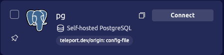
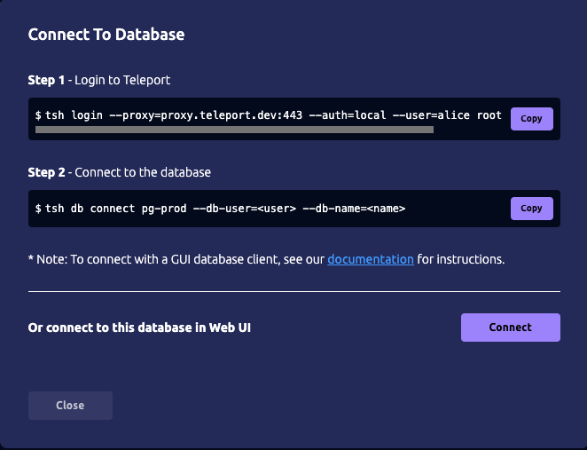
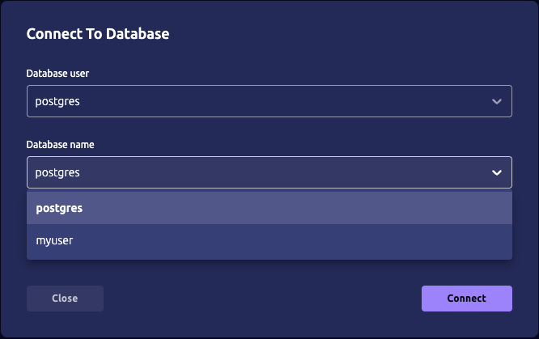
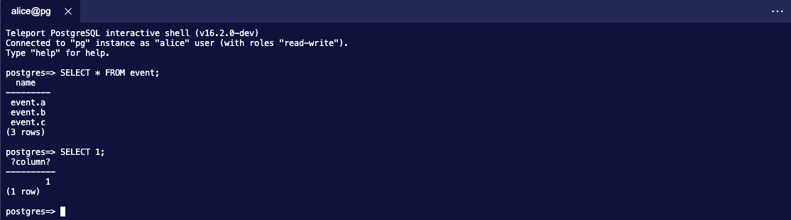
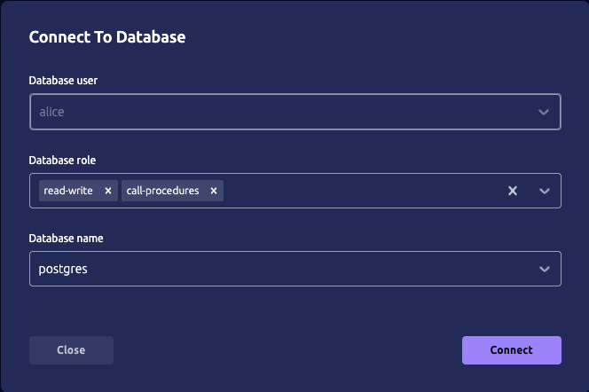

# RFD 0181 - PostgreSQL database access through Web UI

## Required Approvals

Engineering: (@r0mant || @smallinsky) && @greedy52

Product: @klizhentas || @xinding33

## What

This RFD proposes a feature that allows users to access PostgreSQL databases
through the Web UI as an alternative to using the CLI. The feature includes an
interactive shell for simplified query execution and database management.

## Why

While other protocols, such as SSH and Kubernetes Pod exec, already offer Web
UI access alongside CLI options, PostgreSQL users have been restricted to
terminal-based management. Providing a way to access databases through Web UI
will bring an alternative to CLI usage and cover scenarios where users don't
have access to a terminal or don't want to swap from Web UI to the terminal.

## Details

### UX

#### User story: Alice access database using Teleport for the first time.

Alice is new to Teleport, but she's experienced with PostgreSQL and has spent
a considerable time using `psql`, the PostgreSQL CLI.

Before her access, a system administrator had already enrolled a PostgreSQL
instance and created a set of users the Teleport users could use. Those
database users and the existent databases of the instance are listed on the
role assigned to Alice.

She first logs into Teleport's Web UI and then searches for the desired database
on the resources list. After locating it, she clicks on the "Connect" button.



After clicking, she is presented with a connect modal with options to connect
using Teleport's CLI or through Web UI.



After clicking the "Connect" button on the modal, a new tab opens with a form
containing connection information. In that modal, she needs to select which
database and database user she'll be using. Teleport already fills this
information based on her permissions, so she doesn't need to find this
information somewhere else or ask someone. Also, this will prevent her from
inputting the information incorrectly and being unable to connect.



After selecting the required information and clicking on the "Connect" button,
the modal closes, and the terminal is focused with an interactive shell, similar
to `psql`, where she can type her queries.



After interacting with the database, she closes the tab, and her database
session ends.

##### Auto-user provisioning enabled

This is the same scenario, but the PostgreSQL instance was configured with user
provisioning enabled. This change implies which information Alice sees on the
connection information modal. She doesn't need to select the database user, as
it will default to her username. The select is then disabled, and a new now
select will be presented where she can select database roles attached to their
user.



#### User story: Bob access database with per-session MFA enabled.

Bob is familiar with Teleport web UI and is experienced with PostgreSQL,
spending considerable time using `psql`, the PostgreSQL CLI.

The system administrators configured this Teleport cluster to use MFA per
session (`require_session_mfa: true`). They also have granted Bob permission to
connect to multiple PostgreSQL databases. The role he'll be using has a short
session TTL.

He logs into Teleport web UI, searches for the desired database, and clicks
"Connect". He's presented with a connect modal with options to connect using
Teleport's CLI or Web UI. After clicking on the "Connect" button, a new tab
opens with the connection information form with the information: database name,
database roles, and database user pre-filled. He confirms the values and clicks
"Connect" to start a new session.

The modal closes, and he's prompted with the MFA modal (the same as SSH
sessions). After completing the authentication, he starts performing multiple
queries using the interactive shell, but after some time, he exceeds his session
TTL, the connection is dropped, and he is redirected to the login page. His
database session is terminated.

#### PostgreSQL interactive terminal

##### Banner

At the beginning of each session, we'll include an informative banner that will consist of the following:
- Information about the interactive shell name and its version.
- Connected PostgreSQL version (this mimics the `psql`).
- Parameters used to connect to the instance, like the database and username.
- Short text describing how to get the supported commands and information through the help command (more details in the next section).

```shell
Teleport PostgreSQL interactive shell (v16.2.0-dev)
Connected to "pg" instance as "alice" user.
Type "help" or \? for help.
```

##### Supported commands

In addition to executing queries, the interactive shell will implement some
backlash (\\) commands from `psql`. Users can fetch the list of supported
commands by calling the help command (`\?` or `help`):

```shell
postgres=> \?
General:
  \q          Terminate the session.
  \teleport   Show Teleport interactive shell information, such as execution limitations.

Informational:
  \d              List tables, views, and sequences.

Connection/Session:
  \session   Display information about the current session, like user, roles, and database instance.
```

Supported list of commands and output examples:

* `\q`: No output. Terminates the session.

* `\teleport`: Presents the shell information.
  ```
  postgres=> \teleport
  Teleport PostgreSQL interactive shell (v16.2.0-dev)
  ```

* `\d`: Describes the tables, views and sequences.
  ```
  Schema Name             Type     Owner    
  ------ ---------------- -------- -------- 
  public employees        table    alice    
  public employees_id_seq sequence alice    
  public event            table    postgres 
  public events           table    postgres 
  ```

* `\session`: Presents session information.
  ```
  Connected to "pg" instance as "alice" user.
  ```


##### Limitations/Unsupported commands

Teleport PostgreSQL interactive shell will not be a complete feature pair with
`psql`. Those limitations will be due to security measures or the shell's
simplicity. Given those limitations, messages will be shown to the users,
displaying a description and direction on executing the desired command
(if applicable).

Unsupported backslash (\\) commands from psql will only display a failure
message:

```shell
postgres=> \set a "hello"
Invalid command \set.
Try "help" or "\?" for the list of supported commands.

postgres=>
```

Other limitations, such as query size limit, will display a more complete message:

```shell
postgres=> INSERT INTO ... # Long query.
ERROR: Unable to execute query. Max query size limit (2048 characters) exceeded.
For long queries, execute it using `tsh db` commands.

postgres=>
```

### Product usage

To track PostgreSQL databases access through Web UI, we need to differentiate
them from direct sessions. To do so, we'll add a new field to the
[`SessionStartDatabaseMetadata`](https://github.com/gravitational/teleport/blob/5e921b33b9173ccde8fe321d35534b04ebbd5d93/proto/prehog/v1alpha/teleport.proto#L223)
event to include this information:

```diff
// SessionStartDatabaseMetadata contains additional information about database session.
message SessionStartDatabaseMetadata {
  // database type.
  string db_type = 1;
  // database protocol.
  string db_protocol = 2;
  // database origin source.
  string db_origin = 3;
+ // access_through describes whether the database was accessed by speaking to
+ // the proxy service or using Web UI interactive shell.
+ string access_through = 4;
}
```

Initially, the supported values for this field with be:
- `proxy_service`: Database was accessed directly on the proxy services. This is
  the current behavior for databases.
- `webui`: Databases was accessed using the Web UI interactive shell.

Older events without this new field should be considered the same as
`proxy_service`.

### Implementation

#### Web UI

Note: UI changes won't affect Teleport Connect.

All the new interactions will be done on the Web UI. First, the database
resource returned by the API will include new fields:

```go
// Defined at lib/web/ui/server.go
type Database struct {
  // omitted

  // DatabaseRoles is the list of allowed database roles that the user can
  // select.
  DatabaseRoles []string `json:"database_roles"`
  // SupportsWebUISession is a flag to indicate the database supports Web UI
  // sessions.
  SupportsWebUISession bool `json:"support_webui_session"`
}
```

These new fields are used to:
- Change the "Connect" button behavior to change the the connect modal when
  Web UI is supported.
- Fill the connect dialog options.
- Present the available database roles when applicable.

The connection options will be retrieved as the following (from Access checker):
- `DatabaseRoles`: `CheckDatabaseRoles`.
- `DatabaseNames`: `EnumerateDatabaseNames`.
- `DatabaseUsers`: `EnumerateDatabaseUsers`.

Note that the `DatabaseNames` and `DatabaseUsers` fields are currently filled
with different functions. The main difference is that the enumerate functions
consider auto-provisioning options instead of just relying on the roles.

In addition, a new page will be added to handle the database session
console/terminal (`/web/cluster/:clusterId/console/db/:sid`). This page will be
very similar to the SSH session console, except for the file transfer/upload
icons bar, which will be removed.

#### Proxy

A new web handler will be added to handle the interactive session socket
connection: `/webapi/sites/:site/databases/term`. We cannot provide the session
parameters since web socket connections are started as GET requests. Instead,
when the web socket connection is established, the front end will forward a
message containing the session parameters. This is the same flow used by
Kubernetes exec sessions.

The following struct represents the session request:

```go
// DatabaseSessionRequest describes a request to create a web-based terminal
// database session.
type DatabaseSessionRequest struct {
  // DatabaseResourceID is the database resource ID the user will be connected.
  DatabaseResourceID string `json:"db_resource_id"`
  // DatabaseName is the database name the session will use.
  DatabaseName string `json:"db_name"`
  // DatabaseUser is the database user used on the session.
  DatabaseUser string `json:"db_user"`
  // DatabaseRoles are database roles that will be attached to the user when connecting to the database.
  DatabaseRoles []string `json:"db_roles"`
}
```

After the connection is established and the first message is received, the proxy
will generate a user certificate containing `RouteToDatabase` using one of
`PerformMFACeremony` or `GenerateUserCerts`.

Note: The MFA flows will follow the existing functions (used by Kubernetes
execs, desktops, and SSH sessions).

Once the certificates are generated, the proxy will connect to the target
database server. This flow resembles what the database proxy does: Choose a
database server among a list of available servers to forward the connection.
After the connection is established, a new instances of the Teleport's
PostgreSQL REPL is created, and the session starts.

#### PostgreSQL REPL

The proxy will include a PostgreSQL Read-Eval-Print Loop (REPL) that interacts
with the databases served by database servers. The REPL will read the user input
per line and decide whether or not to execute the command (as the REPL will
support multi-line commands). The rule follows:
- If the line starts with a backslash command, execute it.
- Send the line to the target database if it terminates in a semicolon (`;`).

If the line read doesn't meet the above criteria, it is added to an internal
buffer and is accumulated until it is ready to be executed.

The REPL will interact with the WebSocket connection using the existent
`terminal` (`lib/web/terminal/terminal.go`) structs.

A few other cases to consider:
- Multiple semicolons on a single line: Multiple queries on a single line are
  not supported. If this is provided, the REPL will return an error with the
  appropriate error message.
- Query mixed with backslash command (e.g., `SELECT \d 1;`). This execution
  invalid SQL syntax errors (validate by the PostgreSQL instance).

##### Backslash commands

Backslash commands are executed at the proxy, and results are forwarded to the
client's websocket. Depending on the command executed, there is no interaction
with the database server, and the command won't be included in the session
recording.

There are two categories of backslash commands: those that don't require
database interaction (for example, printing the help menu) and those that expand
into SQL queries forwarded into the database.

For the latter, we'll keep a list of pre-written queries based on the queries
used at `psql`.

##### Command/Queries execution

To execute commands and queries into the target PostgreSQL, the REPL will use a
`pgconn.PgConn` instead of manually generating PostgreSQL protocol messages.
This will simplify the protocol interaction and cover most use cases.

The `pgconn.PgConn` will be started during the REPL initialization process.

Query cancellation won't be covered in the initial version. The executions will
use the session context, meaning that if the session is closed, the queries will
get canceled.

##### Result formatting

Once the query is executed, the interactive shell will parse command tag results
and decide how to render it:
- For `SELECT` commands: Generate an ASCII table using the query results with
  the same format as `psql`. The field information (table head) will be fetched
  using the result field descriptors.
- For other commands: Display the command tag as it is received.

We'll rely on the existent ASCII table package (`lib/asciitable`) to generate
the tables. This reduces the amount of code necessary and avoids additional
dependencies.

```shell
postgres=# SELECT * FROM events;

id   name        salary   
--   ----------- -------- 
1    John Doe    50000.00 
2    Jane Smith  60000.00 
3    Bob Johnson 55000.00 
4    Alice Brown 65000.00 
5    Mike Davis  58000.00 
(5 rows affected)

postgres=# INSERT INTO events (name) VALUES ('end');
INSERT 0 1
```

Errors will be shown with `ERROR:` prefix.

```shell
postgres=> SELECT err;
ERROR: column "err" does not exist

```

### Security

#### Resource exhaustion attacks

Users could intentionally send large, complex queries to consume excessive
memory or processing power, potentially leading to service degradation or
outages.

The interactive shell will limit the command/query size regarding character
count. It includes the shell internal buffer (used for multi-line commands) and
the line reader.

In addition, the command results might include large sets. `pgconn` will handle
this when reading a query's results. The interactive shell will iterate over
each row, avoiding loading all at once in memory.

#### Obfuscating malicious activities

Regarding users trying to bypass Teleport's audit system, the same risks and
solutions from CLI access will apply to the newly introduced Web UI access.

This is because the database server still handles all the auditing capabilities,
and the Web UI interactive shell acts as a regular database client.

### Future work

#### Moderated sessions

Given that the database connection and user's input is handled by the proxy,
multiple users could connect using the same REPL instance. This would require
proxy-peering to be enabled given that users might not be using the same proxy
server.

#### Advanced REPL features

Depending on the REPL usage, we can introduce advanced features to enhance the
user's experience. Here is a non-extensive list of what can be implemented
using the current solution:
- Auto-completion: This would require implementing queries to discover the
  database schema and relying on a shell-like auto-completion system.
- Cross-session history: Currently, REPL history is bounded only to the session.
  Another feature would be to keep a user’s command history consistent across
  different sessions (similar to what `psql` does).

#### Usage for discover database enrollment flows

Some discovered databases require additional setup within the database before
the users can connect using Teleport. Given that the REPL is not specific to
Teleport and internally uses a regular PostgreSQL connection, it is able to
connect directly to databases. We could extend the REPL connection parameters
to include the database address and credentials so that it can initialize the
connection.
