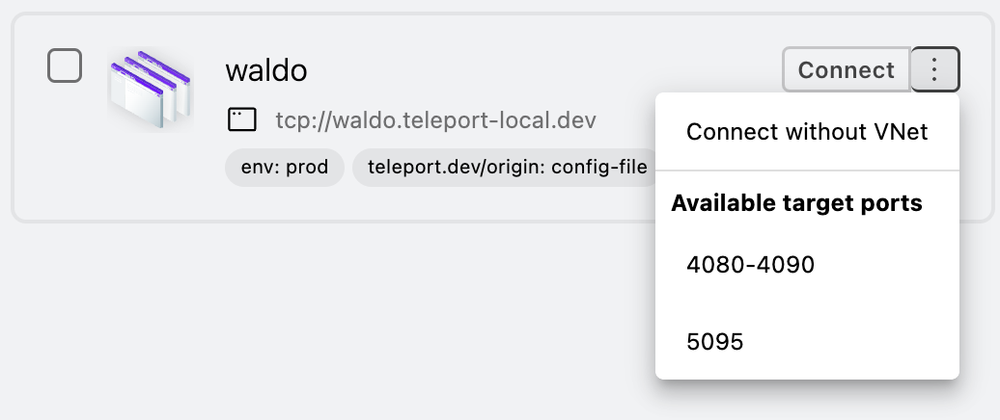
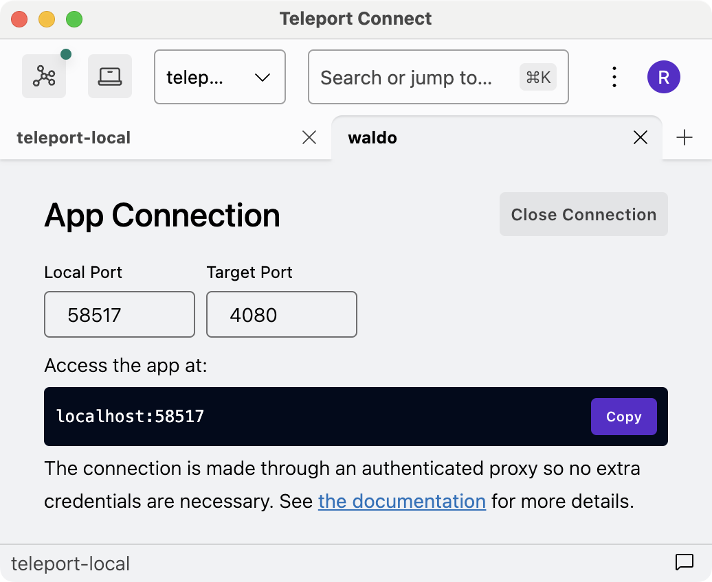

# RFD 182 - Multi-port TCP app access

## Required Approvers

* Engineering: @zmb3 && @nklaassen && (@espadolini || @smallinsky)

## What

Multi-port TCP app access enables cluster administrators to set up TCP apps that expose more than
just one port to the cluster.

## Why

In the past, many customers expressed interest in specifying a port range for an app
([#5669](https://github.com/gravitational/teleport/issues/5669), [#10412](https://github.com/gravitational/teleport/issues/10412)).
Two customers asked about multi-port support immediately after seeing a demo of VNet. Some customers
have environments where a single logical app is spread across several ports.

Before VNet ([RFD 163](https://github.com/gravitational/teleport/blob/master/rfd/0163-vnet.md)),
introducing multi-port support was limited by the fact that the end user would need to manually
start and manage a local proxy per each port. With VNet, this restriction is gone. We can extend
VNet and TCP app access in such a way that the end user can connect to
`tcp-app.teleport.example.com:1234` and the connection will be forwarded to the same port number on
the hostname specified in the app spec.

## Details

### UX

#### Setup

There's an app called waldo which accepts connections on multiple ports. Alice wants to make the app
available in the teleport.example.com cluster. She creates a new app and includes a new field called
`ports` in the app definition. She leaves the port number out of the `uri` field.

```yaml
apps:
- name: "waldo"
  uri: "tcp://localhost"
  ports: [4080-4090, 5095]
  labels:
    env: prod
```

#### Usage

##### Happy path

###### Regular usage

Bob wants to connect from his device to waldo using a CLI client called waldo-client. Bob sees in
Teleport Connect that the app waldo.teleport.example.com supports ports 4080 and 4081, which are the
default ports over which waldo-client connects. Bob starts VNet, opens his terminal of choice and
points waldo-client at the app in the cluster.

```
waldo-client waldo.teleport.example.com
```

###### Local proxy

Charlie needs to connect to waldo's debug service. Its API is typically available over the port
5095. Charlie uses Linux, where VNet is not yet available. Through `tsh apps ls` they see that the
waldo app supports the port 5095, so they start a local proxy that targets that port:

```
tsh proxy app waldo --target-port 5095 --port 5095
waldo-debug localhost # In a separate shell session.
```

##### Error path

###### Incorrect port

Dave wants to connect to the debug port through VNet, but he makes a typo and provides a port
number that's not in the app spec.

```
waldo-debug waldo.teleport.example.com:5096
```

The connection reaches the app service which closes the connection because of an unknown port.
waldo-debug observes the connection being unexpectedly closed. Dave doesn't see any immediate
information about an incorrect port – the app service has no way of passing this information as it
does not know about the protocol used by waldo. Dave has to ask Alice to look into the logs of the
app agent. She notices that around the time when the connection was made, the app service logged a
warning saying that port 5096 is not defined in the app spec.

```
2024-08-23T16:47:02+02:00 WARN [APP:SERVI] Failed to handle client connection. error:[
ERROR REPORT:
Original Error: *trace.BadParameterError port 5096 not found in ports of the app "waldo"
Stack Trace: …
```

###### Invalid app spec

Alice wants to extend the app spec with another port, 6060, but she makes a mistake and forgets a
comma:

```yaml
apps:
- name: "waldo"
  uri: "tcp://localhost"
  ports: [4080-4090, 50956060]
  labels:
    env: prod
```

The relevant UI (`teleport start`, `tctl edit`, etc.) returns an error about an incorrect port
in the app spec and prevents Alice from saving such app spec.

### Passing the port number from the client to the app agent

In order to pass the port number from the client to the app service, the underlying local proxy is
going to include the port number as a part of a special subdomain in the SNI, e.g.
`app-teleport-proxy-target-port-1337.teleport.cluster.local`. The ALPN proxy is then able to extract
the port number out of the SNI and pass it to the app service through a new field in
`sshutils.DialReq`.

When the port makes its way to the app service, the app service checks the port against ports
defined in the app spec before deciding whether to proxy the connection or not. The app service
[already has access to the app spec](https://github.com/gravitational/teleport/blob/5012036ad28a25d54858e454364828803f558e0b/lib/srv/app/connections_handler.go#L726).

At this point we don't plan to introduce RBAC for port numbers, but this is something we can
consider in the future. Port numbers on an individual app are akin to database names within a single
database server. Customers might want to treat them as such, by e.g. limiting access to different
ports.

#### Advantages

* A single cert per app.
* With per-session MFA enabled, the user needs to tap an MFA device only once per app.
* Old clients that don't send info about target port can still be routed to the first port found in
  the `ports` field.
* Backward-compatible with existing UIs (tsh, tctl, Web UI, Connect). Requires minimal effort to add
  support for multi-port to those UIs.

#### Disadvantages

* It's another instance of misusing ALPN to pass some metadata about the connection.
* It's not a solution that can be extended to work for HTTP apps in the future. For starters,
  browsers don't let you send arbitrary SNIs.
* It breaks compatibility – if an older app service gets a multi-port TCP app from the auth server
  through dynamic registration, it cannot proxy connections to that app because it doesn't know
  which port to proxy the connections to. See [Backward Compatibility](#backward-compatibility) for
  more details.

#### Alternative approaches

##### Embedding the port within an app cert (`RouteToApp`)

The easiest way to implement multi-port app access would be to extend `RouteToApp` to include the
port number. The main drawback here is that the client would need to request a cert for each port.
With per-session MFA in use, every connection over a separate port would require a separate tap of
an MFA device.

##### Embedding the port within an ALPN protocol

We already have [`ProtocolAuth`](https://github.com/gravitational/teleport/blob/8495398fa164aaa70236f6d7abd55238b2925cb2/lib/srv/alpnproxy/common/protocols.go#L99-L100)
in the form of `"teleport-auth@"` that's used to [pass the cluster name](https://github.com/gravitational/teleport/blob/8495398fa164aaa70236f6d7abd55238b2925cb2/lib/srv/alpnproxy/auth/auth_proxy.go#L96-L97)
when dialing the auth server.

In a similar fashion, we could introduce `"teleport-tcp@"` which includes the port number after `@`.
It'd be yet another method of abusing ALPN to pass additional data.

The `"teleport-tcp"` protocol is currently used by the ALPN proxy to select an appropriate ALPN
handler. Since the handler for multi-port apps and non-multi-port apps would be pretty much the
same, it seems that passing the port number through the SNI is a slightly better choice.

##### Implementing a custom protocol

Instead of abusing ALPN, we could actually make use of it by implementing a custom protocol, say
`teleport-tcp-multi-port`. A client speaking this protocol (a local proxy) would be expected to send
the port number in the first few bytes of the connection and then proxy the rest of the downstream
connection (of whatever client that wants to connect to a TCP app over a local proxy).

A server speaking the custom protocol on the other end of the connection, an app agent, would read
the port number and proxy the rest of the connection to the app itself on the given port.

This all seems fine until we consider how we could support both multi-port apps and regular
single-port apps. The ALPN proxy, after recognizing that the client wants to use
`teleport-tcp-multi-port`, would need to forward the connection to an app agent through the reverse
tunnel. For both types of TCP apps, the code that handles the connection would be pretty much the
same, with the exception of reading the port first. Unless we changed the setup so that two kinds of
app services register themselves in the reverse tunnel, the ALPN proxy would need to pass the
information about the multi-port protocol out of band to the app service. This seems to defeat the
purpose of using a custom protocol. The SNI and ALPN protocol solutions already pass the port number
out of band, without the overhead of a custom protocol.

##### Multiple apps with the same URI but different ports

Instead of including port numbers in the definition of a single app, the admin could add multiple
apps to the same app agent where the main difference between the apps would be a different port in
the URI. Then VNet could somehow wrap those apps so that from the perspective of the user, they
wouldn't need to connect to something like `app-1337.teleport.example.com` but rather just
`app.teleport.example.com:1337`.

While this could technically also work for web apps in the future, implementing this means adjusting
every single user-facing tool to support multi-port apps (the Web UI, Connect, tsh, tctl, …). Old
clients that do not support multi-port would see an almost identical app repeated once for every
port. Supporting wide port ranges would also be significantly harder, as each port would require its
own app resource. Per-session MFA would require creating a separate cert for each port.

### Passing the port number from VNet to the client

Since VNet creates a single local proxy per app, `alpnproxy.LocalProxy` needs to support dynamically
changing the SNI per connection.

VNet already uses the [`alpnproxy.LocalProxy.HandleTCPConnector`](https://github.com/gravitational/teleport/blob/3fd79ce5c557cdfa5603b0d691dc8bab199afce2/lib/srv/alpnproxy/local_proxy.go#L249)
method which was added specifically for VNet. Technically, we could read the port number [in
`vnet.NetworkStack.handleTCP`](https://github.com/gravitational/teleport/blob/b5df678e22d26776aa87f9dd493b3c443e013fa4/lib/vnet/vnet.go#L377)
(`req.ID().LocalPort`), but we don't even need to do that. The port number can be read directly
[from `downstreamConn` inside
`alpnproxy.LocalProxy.HandleTCPConnector`](https://github.com/gravitational/teleport/blob/3fd79ce5c557cdfa5603b0d691dc8bab199afce2/lib/srv/alpnproxy/local_proxy.go#L267).

Since `alpnproxy.LocalProxy.HandleTCPConnector` is VNet-specific, we can modify it so that the
config it passes to `dialALPNMaybePing` has a different SNI depending on which local port was used.

### Configuration

The ports are set through the `ports` field. The user is expected to not include a port number in
the `uri` field. `tctl edit`, `tctl create` and other means of adding apps should be updated to
prevent the user from including the port number in `uri` if the `ports` field is present. Apps
without the `ports` field and with no port number in the `uri` field should be allowed to exist in
order to not introduce a breaking change in behavior – those are technically allowed as of v16.2.
E.g., Teleport v16.2 lets you define an app with `"tcp://localhost"` as the URI and will only error
during an actual connection attempt.

In order to keep the implementation simple, the user is allowed to duplicate port numbers and
ranges. For example, these are all valid `ports` values: `[4080-4090, 4080-4090]`, `[4080-4090,
4081-4087, 4082]`. The only validation in place is going to be that any given port number and port
range start and end must be within 1–65535 and that the start of a port range must be less than the
end, rendering the following not valid: `4090-4080`, `1234-1234`.

#### Limitations

Since a single app spec is supposed to specify available ports, it will not be possible to
distribute different ports of the same logical Teleport TCP app across different app services. For
example, had we chosen to go with [collapsing multiple app specs](#multiple-apps-with-the-same-uri-but-different-ports)
with the same URI but a different port into a single app, it'd have been possible to put each of
those app specs on a separate app service. This is something customers with an extensive HA setup
could want Teleport to support.

```
- name: "foo"
  uri: "tcp://localhost:3000"
  labels:
    env: prod
```

```
- name: "foo"
  uri: "tcp://localhost:3001"
  labels:
    env: prod
```

### Security

SNI is sent over plain text, so information about the port is both visible and can be rewritten by a
malicious agent (in security terms, not Teleport terms) between the device and the proxy service.

By using wide ranges of allowed ports, cluster admins can mistakenly grant access to ports that
shouldn't be accessible within Teleport. As there's no RBAC for ports, a user with a valid cert for
an app can access any of the ports specified in the app spec.

### Privacy

As stated above, the port is sent in plain text in SNI. Other than that, the feature described here
does not warrant any extra privacy considerations.

### UI

`tsh apps ls` and `tsh apps ls -R` include a column called Target Ports if any of the returned apps
supports multiple target ports. If a TCP app has only a single port, its port is not shown in Target
Ports – VNet always routes connections from any port to the same single target port.

```
$ tsh apps ls
Application      Description Type Public Address                      Target Ports    Labels
---------------- ----------- ---- ----------------------------------- --------------- --------
dumper                       HTTP dumper.teleport-local.dev
example1         Example app HTTP example1.teleport-local.dev                         env=test
simplehttpserver             HTTP simplehttpserver.teleport-local.dev
tcp-postgres                 TCP  tcp-postgres.teleport-local.dev
waldo                        TCP  waldo.teleport-local.dev            4080-4090, 5095 env=prod
```

The Web UI and Connect show a list of available target ports through a three dots button next to the
main button in the resource card. Ports are clickable and result in the hostname + port being copied
to the clipboard. Port ranges are clickable too and result in the hostname + port range being
copied.

In Connect, clicking on a port starts VNet if it's not already running and shows a notification
about the text being copied to the clipboard, similar to how clicking "Connect" next to a TCP app
works today.



The user can also select "Connect without VNet" which starts a regular local proxy. From there, the
user is still able to select the target port. This field is not shown if the app doesn't support
multiple ports. The default port is the first port found in the `ports` field. There will be a basic
validation to make sure that the user does not set the target port to one that the app doesn't
support.



### Backward Compatibility

#### Server-client compatibility

Old clients that do not support multi-port apps don't show the URI anywhere, with the exception of
`tsh apps ls -v` and `tctl get`. A client connecting to a TCP app is not expected to present the
port from the URI. This means we are able to provide partial backward compatibility for older
clients in the form of connecting them to the first port found in the app spec. This is true for all
cases except a specific scenario with dynamic app registration described below.

In Teleport v16.2 and before, it's completely valid to define an app with no port number in the URI.
In that case, the app service returns an error when attempting to connect to such an app because
[`dialer.DialContext` fails](https://github.com/gravitational/teleport/blob/02237c56cde38bb4d6caca4b566f6e6e0192fc3e/lib/srv/app/tcpserver.go#L55-L58)
with an error about a missing port number.

In the examples below, version N is the first version of Teleport that supports multi-port TCP
access, N - 1 is a version before that.

##### Services on version N, a client on version N - 1

Since the client doesn't know about available ports, it's not going to send a port number through
the SNI.

In this case, we can support old clients by defaulting to the first port from the `ports` field if
no port was sent in the SNI.

##### Auth and proxy services on version N, app service on version N - 1

An app service on version N - 1 cannot statically define a multi-port TCP app.

However, it's possible that the app service is fed a multi-port app from the auth service through
dynamic registration. There's no way for the app service to continue, so it returns an error, just
like a v16.2 app service when a TCP app doesn't specify the port in the URI. This is a price we are
willing to pay for reduced implementation and UX complexity.

##### Alternative approaches

###### Port in `uri` and `extra_ports` field

Instead of having a `ports` field, we could support an app spec which uses both `uri` and a new
field to determine available ports:

```yaml
apps:
- name: "waldo"
  uri: "tcp://localhost:4080"
  extra_ports: [4081-4090, 5095]
  labels:
    env: prod
```

This way even an app service that doesn't support multi-port could provide partial access to a
multi-port app by reading the port from the `uri` field. But does it count as backward
compatibility? Imagine an N client connecting to an N proxy service wanting to be forwarded to port
number 4085, only for an N - 1 app agent to disregard the port number and forward the connection to
4080.

Both options have their pros and cons, but we decided to pick `ports` because it has a slightly
better long-term UX. It lets us drop the "extra" suffix from the field name. If the user wants to
set a single range _a-b_, it avoids forcing them to split the range into _a, (a+1)-b_ like in the
example above.

###### New app resource version

If the only scenario where the `ports` field breaks backward compatibility is dynamic app
registration, we could introduce a new version of the app resource. The intent would be to let the
old app service drop the unrecognized version of an app resource.

However, this is not how the app service operates today. When an app service populates its cache
with dynamically registered apps, it interprets all apps as V3 apps, meaning we can't add a V4 app
and have it ignored by an app service that doesn't support V4 apps.

Even if this was possible, it would still not solve a situation where a version N client connects to
a version N proxy and wants to connect to a multi-port app through a version N - 1 app agent.
Presumably, the client would see that a multi-port app is available, but if the app service that's
supposed to handle this app doesn't handle V4 apps, then the app service would not be able to
forward the connection.

#### VNet with single-port apps

Before multi-port was available, VNet would let you connect to an arbitrary port on the public
address of an app. The connection would ultimately be forwarded to the port number from the `uri`
field of the app spec. This behavior is kept for single-port apps for backward compatibility. The
port number is not sent over SNI in this case.

### Audit Events

The way audit events work for local proxies with single-port TCP apps is as follows. When the app
service agent proxies a connection to the actual URI of an app, the agent creates an
`app.session.start` event. Each new connection made through the proxy creates another
`app.session.start` event. Each of those events shares the same session ID (`sid`), because [session
ID comes from the cert](https://github.com/gravitational/teleport/blob/d1c7f26e70544879c04f184d88b9fbc07626be6b/lib/srv/app/common/audit.go#L94)
and the cert is the same for all connections coming from a single local proxy.

The only thing that changes for multi-port apps is that `app_uri` includes the actual port to which
the connection was forwarded to. The session ID stays the same no matter which target port was
chosen. This means that two connections on two different ports for the same app are going to
generate two `app.session.start` events which are identical, with the exception of `app_uri`,
`time`, and `uid` fields.

### Observability

Whether the target port makes it all the way from the client to the app service can be observed by
the `app.session.start` audit event. It should include the correct port in the `app_uri` field.

We don't expect the implementation to impact performance. The port number is transmitted between the
client and the proxy service through SNI which is already sent. The proxy service is going to pass
it to the app agent through `sshutils.DialReq`. That struct is serialized to JSON with empty fields
completely skipped, so only connections to TCP apps are going to pay the price for an extra field.

The app service already has access to the app spec to verify whether the target port is valid, so it
doesn't need to perform any additional network calls.

### Product Usage

The telemetry already tracks TCP app sessions through the `tp.session.start.v2` event where
`tp.session_type` is set to `app_tcp`. We're going to extend this event with a new boolean property
called `tp.app.is_multi_port`.

To do this, we need to add a new boolean field to `AppMetadata` in `apievents.AppSessionStart`
called `AppIsMultiPort`.

### Proto Specification

Changes in `api/proto/teleport/legacy/types/types.proto`:

```diff
message AppSpecV3 {
…
   // Only applicable to AWS App Access.
   // If present, the Application must use the Integration's credentials instead of ambient credentials to access Cloud APIs.
   string Integration = 9 [(gogoproto.jsontag) = "integration,omitempty"];
+  // Ports is a list of ports and port ranges that an app agent can forward connections to.
+  // Only applicable to TCP App Access.
+  // If this field is not empty, URI is expected to contain no port number and start with the tcp
+  // protocol.
+  // If a value within this field is a port range, the start of the range must be less than the end
+  // of the range. Any individual port cannot fall outside of the 1-65535 range.
+  repeated PortRange Ports = 10 [(gogoproto.jsontag) = "ports,omitempty"];
+}
+
+// PortRange describes a port range used for in TCP apps. It can be used to describe a single port
+// in which case the Start field is the port and the End field is 0.
+message PortRange {
+  // Start describes the start of the range. It must be between 1-65535.
+  uint32 Start = 1 [(gogoproto.jsontag) = "start"];
+  // End describes the end of the range, inclusive. It must be between 2-65535 and be greater than
+  // Start when describing a port range. When describing a single port, it must be set to 0.
+  uint32 End = 2 [(gogoproto.jsontag) = "end,omitempty"];
 }
```

Changes in `api/proto/teleport/legacy/types/events/events.proto`:

```diff
message AppMetadata {
…
   // AppName is the configured application name.
   string AppName = 4 [(gogoproto.jsontag) = "app_name,omitempty"];
+  // AppIsMultiPort describes whether the app defines its ports through the Ports field of the app
+  // spec. Relevant only for TCP apps.
+  bool AppIsMultiPort = 5 [(gogoproto.jsontag) = "app_is_multi_port"];
 }
```

### Test Plan

The Application Access section of the test plan needs to be extended with these items:

- [ ] Verify Audit Records
  - [ ] For multi-port TCP apps, `app.session.start` includes the chosen target port in the `app_uri`
    field and `app_is_multi_port` is set to `true`.
- [ ] Verify multi-port TCP access with `tsh proxy app --target-port` (link to docs).
  - [ ] Can create a TCP app with multiple ports and port ranges.
  - [ ] Cannot access ports not listed in the app spec.
  - [ ] `tctl edit`, `tctl create` and `teleport start` return an error if the app spec includes a
    port number outside of the 1-65535 range.

The VNet section of Teleport Connect test plan needs to be extended with these items:

- [ ] Verify that VNet works with multi-port TCP apps. Connecting to an app from a VNet-enabled
  device over a certain port should forward the connection to the same port on the host specified by
  the URI field in the app spec.
