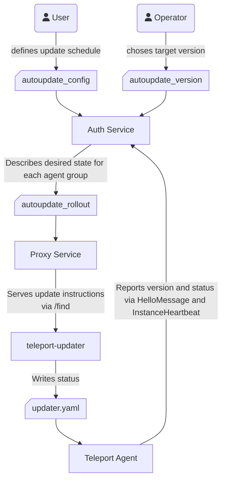
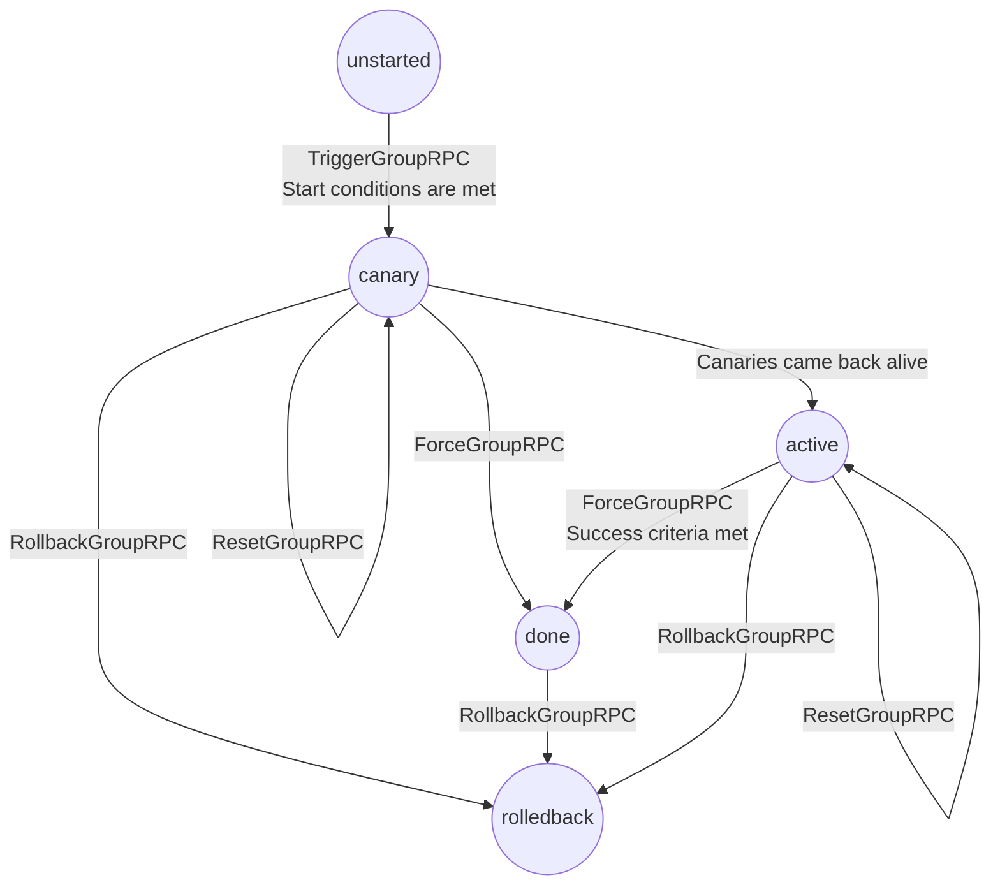
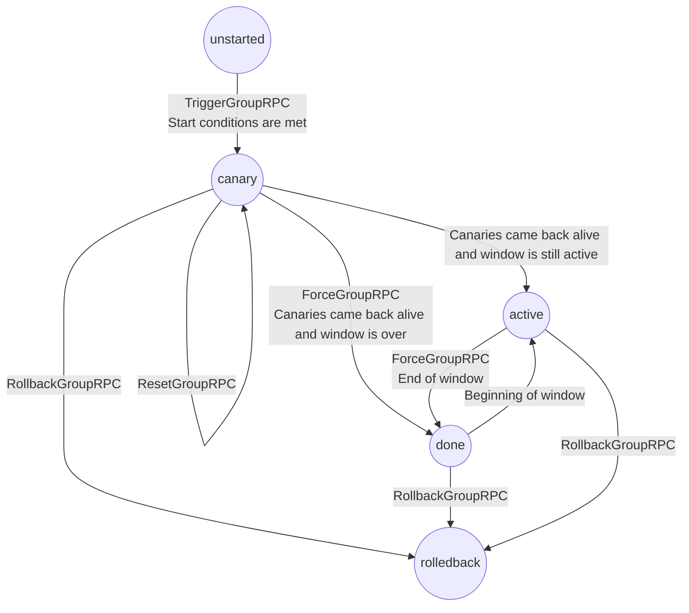

# RFD 0184 - Agent Automatic Updates

## Required Approvers

* Engineering: @russjones
* Product: @klizhentas || @xinding33 
* Security: Doyensec

## What

This RFD proposes a new mechanism for scheduled, automatic updates of Teleport agents.

Users of Teleport will be able to use the tctl CLI to specify desired versions, update schedules, and a rollout strategy.

Agents will be updated by a new `teleport-update` binary, built from `tools/teleport-update` in the Teleport repository.

All agent installations are in-scope for this proposal, including agents installed on Linux servers and Kubernetes.

The following anti-goals are out-of-scope for this proposal, but will be addressed in future RFDs:
- Signing of agent artifacts (e.g., via TUF)
- Teleport Cloud APIs for updating agents
- Improvements to the local functionality of the Kubernetes agent for better compatibility with FluxCD and ArgoCD
- Support for progressive rollouts of tbot, when not installed on the same system as a Teleport agent

This RFD proposes a specific implementation of several sections in https://github.com/gravitational/teleport/pull/39217.

Additionally, this RFD parallels the auto-update functionality for client tools proposed in https://github.com/gravitational/teleport/pull/39805.

## Why

1. We want customers to run the latest release of Teleport so that they are secure and have access to the latest
   features.
2. We do not want customers to deal with the pain of updating agents installed on their own infrastructure.
3. We want to reduce the operational cost of customers running old agents.
   For Cloud customers, this will allow us to support fewer simultaneous cluster versions and reduce support load.
   For self-hosted customers, this will reduce support load associated with debugging old versions of Teleport.
4. Providing 99.99% availability for customers requires us to maintain high availability at the agent-level
   as well as the cluster-level.

The current systemd updater does not meet those requirements:
- The use of package managers (apt and yum) to apply updates leads users to accidentally upgrade Teleport.
- The installation process is complex, and users often end up installing the wrong version of Teleport.
- The update process does not provide sufficient safeties to protect against broken agent updates.
- Customers decline to adopt the existing updater because they want more control over when updates occur.
- We do not offer a nice user experience for self-hosted users. This results in a marginal automatic updates
  adoption and does not reduce the support cost associated with upgrading self-hosted clusters.

## How

The new agent automatic updates system will rely on a separate `teleport-update` binary controlling which Teleport version is
installed. Automatic updates will be implemented incrementally:

- Phase 1: Introduce a new, self-updating updater binary which does not rely on package managers. Allow tctl to roll out updates to all agents.
- Phase 2: Add the ability for the agent updater to immediately revert a faulty update.
- Phase 3: Introduce the concept of agent update groups and make users chose the order in which groups are updated.
- Phase 4: Add a feedback mechanism for the Teleport inventory to track the agents of each group and their update status.
- Phase 5: Add the canary deployment strategy: a few agents are updated first, if they don't die, the whole group is updated.
- Phase 6: Add the ability to perform slow and incremental version rollouts within an agent update group.
- Phase 7: If needed, backup local agent DB and restore during agent rollbacks.

The updater will be usable after phase 1 and will gain new capabilities after each phase.
After phase 2, the new updater will have feature-parity with the existing updater script.
The existing auto-updates mechanism will remain unchanged and fully-functional throughout the process.
It will be deprecated in the future.

Future phases might change as we are working on the implementation and collecting real-world feedback and experience.

We will introduce two user-facing resources:

1. The `autoupdate_config` resource, owned by the Teleport user. This resource allows Teleport users to configure:
   - Whether automatic updates are enabled, disabled, or temporarily suspended
   - The order in which agents should be updated (`dev` before `staging` before `prod`)
   - Days and hours when agent updates should start
   - Configuration for client auto-updates (e.g., `tsh` and `tctl`), which are out-of-scope for this RFD
   
   The resource will look like:
   ```yaml
   kind: autoupdate_config
   spec:
     # existing field, deprecated
     tools_autoupdate: true/false
     # new fields
     tools:
       mode: enabled/disabled
     agents:
       mode: enabled/disabled/suspended
       schedules:
         regular:
         - name: dev
           days: ["Mon", "Tue", "Wed", "Thu"]
           start_hour: 0
           alert_after: 4h
           canary_count: 5 # added in phase 5
           max_in_flight: 20% # added in phase 6
         - name: prod
           days: ["Mon", "Tue", "Wed", "Thu"]
           start_hour: 0
           wait_days: 1 # update this group at least 1 day after the previous one
           alert_after: 4h
           canary_count: 5 # added in phase 5
           max_in_flight: 20% # added in phase 6
   ```

2. The `autoupdate_version` resource, with `spec` owned by the Teleport cluster administrator (e.g. Teleport Cloud operators).
   ```yaml
   kind: autoupdate_version
   spec:
     tools:
       target_version: vX
     agents:
       start_version: v1
       target_version: v2
       schedule: regular
       strategy: halt-on-failure
       mode: enabled
   ```

We will also introduce an internal resource, tracking the agent rollout status. This resource is
owned by Teleport. Users and cluster operators can read its content but cannot create/update/upsert/delete it.
This resource is editable via select RPCs (e.g. start or rollback a group).

The system will look like:



You can find more details about each resource field [in the dedicated resource section](#teleport-resources).

## Details

This section contains the proposed implementation details and is mainly relevant for Teleport developers and curious
users who want to know the motivations behind this specific design.

### Product requirements

The following product requirements were defined by our leadership team:

1. Phased rollout for Cloud tenants. We should be able to control the agent version per-tenant.

2. Bucketed rollout that customers have control over.
   - Control the bucket update day
   - Control the bucket update hour
   - Ability to pause a rollout

3. Customers should be able to run "apt-get upgrade" without updating Teleport.

   Installation from a package manager should be possible, but the version should still be controlled by Teleport.

4. Self-managed updates should be a first class citizen. Teleport must advertise the desired agent and client version.

5. Self-hosted customers should be supported, for example, customers whose own internal customer is running a Teleport agent.

6. Upgrading leaf clusters is out-of-scope.

7. Rolling back after a broken update should be supported. Roll forward gets you 99.9%, we need rollback for 99.99%.

8. We should have high quality metrics that report the version they are running and if they are running automatic
   updates. For both users and us.

9. Best effort should be made so automatic updates should be applied in a way that sessions are not terminated. (Currently only supported for SSH)

10. All backends should be supported.

11. Teleport Discover installation (curl one-liner) should be supported.

12. We need to support Docker image repository mirrors and Teleport artifact mirrors.

13. I should be able to install an auto-updating deployment of Teleport via whatever mechanism I want to, including OS packages such as apt and yum.

14. If new instances join a bucket outside the upgrade window, and you are within your compatibility window, wait until your next group update start.
    If you are not within your compatibility window, attempt to upgrade right away.

15. If an agent comes back online after some period of time, and it is still compatible with
    control plane, it should wait until the next upgrade window to be upgraded.

16. Regular agent updates for Cloud tenants should complete in less than a week.
    (Select tenants may support longer schedules, at the Cloud team's discretion.)

17. A Cloud customer should be able to pause, resume, and rollback and existing rollout schedule.
    A Cloud customer should not be able to create new rollout schedules.

    Teleport can create as many rollout schedules as it wants.

18. A user logged-in to the agent host should be able to disable agent auto-updates and pin a version for that particular host.

### User Stories

#### As a Teleport Cloud operator I want to be able to update customers agents to a newer Teleport version

<details>
<summary>Before</summary>

```shell
tctl autoupdate agent status
# Rollout plan created the YYYY-MM-DD
# Previous version: v1
# New version: v2
# Status: enabled
# 
# Group Name   Status              Update Start Time   Connected Agents   Up-to-date agents   failed updates
# ----------   -----------------   -----------------   ----------------   -----------------   --------------
# dev          complete            YYYY-MM-DD HHh      120                115                 2
# staging      complete            YYYY-MM-D2 HHh      20                 20                  0
# prod         not started                             234                0                   0
```
</details>

I run
```bash
tctl autoupdate agent-plan new-target v3
# created new rollout from v2 to v3
```

<details>
<summary>After</summary>

```shell
tctl autoupdate agent status
# Rollout plan created the YYYY-MM-DD
# Previous version: v2
# New version: v3
# Status: enabled
# 
# Group Name   Status              Update Start Time   Connected Agents   Up-to-date agents   failed updates
# ----------   -----------------   -----------------   ----------------   -----------------   --------------
# dev          not started                             120                0                   0
# staging      not started                             20                 0                   0
# prod         not started                             234                0                   0
```

</details>

Now, new agents will install v2 by default, and v3 after the maintenance.

> [!NOTE]
> If the previous maintenance was not finished, I will install v2 on new prod agents while the rest of prod is still running v1.
> This is expected as we don't want to keep track of an infinite number of versions.
> 
> If this is an issue I can create a v1 -> v3 rollout instead.
> 
> ```bash
> tctl autoupdate agent-plan new-target v3 --previous-version v1
> # created new update plan from v1 to v3
> ```

#### As a Teleport Cloud operator I want to minimize damage caused by broken versions to ensure we maintain 99.99% availability

##### Failure mode 1(a): the new version crashes

I create a new deployment with a broken version. The version is deployed to a few instances picked randomly.
Those instances are called the canaries. As the new version has an issue, one or many of those canary instances can't run the
new version and their updater has to revert to the previous one. The agents connect back online and
advertise they have failed to update. The maintenance is stuck until every instance that got selected to test the new version
is back online, and running the new version.

<details>
<summary>Autoupdate agent rollout</summary>

```yaml
kind: autoupdate_agent_rollout
spec:
  version_config:
    start_version: v1
    target_version: v2
    schedule: regular
    strategy: halt-on-failure
    mode: enabled
status:
  groups:
    - name: dev
      start_time: 2020-12-09T16:09:53+00:00
      initial_count: 100
      present_count: 100
      failed_count: 0
      progress: 0
      state: canaries
      canaries:
      - updater_uuid: abc
        host_uuid: def
        hostname: foo.example.com
        success: false
      last_update_time: 2020-12-10T16:09:53+00:00
      last_update_reason: canaryTesting
    - name: staging
      start_time: 0000-00-00
      initial_count: 0
      present_count: 0
      failed_count: 0
      progress: 0
      state: unstarted
      last_update_time: 2020-12-10T16:09:53+00:00
      last_update_reason: newAgentPlan
```
</details>

I and the customer get an alert if the test instances are not running the expected version after an hour.
Teleport cloud operators and the customer can look up the hostname and host UUID of the test instances
to identify which one(s) failed to update and go troubleshoot.

Customers receive cluster alerts, while Cloud receives alerts driven by Teleport metrics.

The rollout resumes.

If the issue is related to a specific instance and not the new Teleport version (e.g. VM out of disk space),
the user can instruct teleport to pick 5 new canary instances.

##### Failure mode 1(b): the new version crashes, but not on the canaries

This scenario is the same as the previous one but the Teleport agent bug only manifests on select agents.
For example: [the agent fails to read cloud-provider specific metadata and crashes](https://github.com/gravitational/teleport/issues/42312).
This can also be caused by a specific Teleport service crashing. For example, the discovery service is crashing but
all other services are OK. As most instances are running ssh_service, the discovery_service instances are less likely
to get picked.

The version is deployed to a few instances picked randomly but none of them runs on the affected cloud provider.
The canary instances can update properly and the update is sent to every instance of the group.

All agents are updated, and all agents hosted on the cloud provider affected by the bug crash.
The updaters of the affected agents will attempt to self-heal by reverting to the previous version.

Once the previous Teleport version is running, the agents from the affected cloud platform will advertise the update
failed, and they had to rollback.

If too many agents failed, this will block the group from transitioning from `active` to `done`, protecting the future
groups from the faulty updates.

##### Failure mode 2(a): the new version crashes, and the old version cannot start

I create a new deployment with a broken version. The version is deployed to a few instances picked randomly.
Those instances are called the canaries. As the new version has an issue, one or many of those canary instances can't
run the new version. Their updater also fails to revert to the previous version.

The group update is stuck until the canary comes back online and runs the latest version.

The customer and Teleport cloud receive an alert. Both customer and Teleport cloud can retrieve the
host id and hostname of the faulty canary instances. With this information they can go troubleshoot the failed agents.

##### Failure mode 2(b): the new version crashes, and the old version cannot start, but not on the canaries

This scenario is the same as the previous one but the Teleport agent bug only manifests on select agents.
For example: a clock drift blocks agents from re-connecting to Teleport.

The canaries might not select one of the affected agent and allow the update to proceed.
All agents are updated, and all agents hosted on the cloud provider affected by the bug crash.
The updater fails to self-heal as the old version does not start anymore.

If too many agents fail, this will block the group from transitioning from `active` to `done`, protecting the future
groups from the faulty updates.

In this case, it's hard to identify which agent dropped.

##### Failure mode 3: shadow failure

Teleport cloud deploys a new version. Agents from the first group get updated.
The agents are seemingly running properly, but some functions are impaired.
For example, host user creation is failing.

Some user tries to access a resource served by the agent, it fails and the user
notices the disruption.

The customer can observe the agent update status and see that a recent update
might have caused this:

```shell
tctl autoupdate agent status
# Rollout plan created the YYYY-MM-DD
# Previous version: v2
# New version: v3
# Status: enabled
# 
# Group Name   Status              Update Start Time   Connected Agents   Up-to-date agents   failed updates
# ----------   -----------------   -----------------   ----------------   -----------------   --------------
# dev          complete            YYYY-MM-DD HHh      120                115                 2
# staging      in progress (53%)   YYYY-MM-D2 HHh      20                 10                  0
# prod         not started                             234                0                   0
```

Then, the customer or Teleport Cloud team can suspend the rollout:

```shell
tctl autoupdate agent suspend
# Automatic updates suspended
# No existing agent will get updated. New agents might install the new version
# depending on their group.
```

At this point, no new agent is updated to reduce the service disruption.
The customer can investigate, and get help from Teleport's support via a support ticket.
If the update is really the cause of the issue, the customer or Teleport cloud can perform a rollback:

```shell
tctl autoupdate agent rollback
# Rolledback groups: [dev, staging]
# Warning: the automatic agent updates are suspended.
# Agents will not rollback until you run:
# $> tctl autoupdate agent resume
```

> [!NOTE]
> By default, all groups not in the "unstarted" state are rolledback.
> It is also possible to rollback only specific groups.

<details>
<summary>After:</summary>

```shell
tctl autoupdate agent status
# Rollout plan created the YYYY-MM-DD
# Previous version: v2
# New version: v3
# Status: suspended 
#
# Group Name   Status              Update Start Time   Connected Agents   Up-to-date agents   failed updates
# ----------   -----------------   -----------------   ----------------   -----------------   --------------
# dev          rolledback          YYYY-MM-DD HHh      120                115                 2
# staging      rolledback          YYYY-MM-D2 HHh      20                 10                  0
# prod         not started                             234                0                   0
```
</details>

Finally, when the user is happy with the new plan, they can resume the updates.
This will trigger the rollback.

```shell
tctl autoupdate agent resume
```

#### As a Teleport user and a Teleport on-call responder, I want to be able to pin a specific Teleport version of an agent to understand if a specific behaviour is caused by a specific Teleport version

I connect to the server and lookup its status:
```shell
teleport-update status
# Running version v16.2.5
# Automatic updates enabled.
# Proxy: example.teleport.sh
# Group: staging
```

I try to set a specific version:
```shell
teleport-update use-version v16.2.3
# Error: the instance is enrolled into automatic updates.
# You must specify --disable-automatic-updates to opt this agent out of automatic updates and manually control the version.
```

I acknowledge that I am leaving automatic updates:
```shell
teleport-update use-version v16.2.3 --disable-automatic-updates
# Disabling automatic updates. You can re-enable them by running `teleport-update enable`
# Downloading version 16.2.3
# Restarting teleport
# Cleaning up old binaries
```

When the issue is fixed, I can enroll back into automatic updates:

```shell
teleport-update enable
# Enabling automatic updates
# Proxy: example.teleport.sh
# Group: staging
```

#### As a Teleport user I want to fast-track a group update

I have a new rollout, completely unstarted, and my current maintenance schedule updates over several days.
However, the new version contains something that I need as soon as possible (e.g., a fix for a bug that affects me).

<details>
<summary>Before:</summary>

```shell
tctl autoupdate agent status
# Rollout plan created the YYYY-MM-DD
# Previous version: v2
# New version: v3
# Status: enabled
# 
# Group Name   Status              Update Start Time   Connected Agents   Up-to-date agents   failed updates
# ----------   -----------------   -----------------   ----------------   -----------------   --------------
# dev          not started                             120                0                   0
# staging      not started                             20                 0                   0
# prod         not started                             234                0                   0
```
</details>

I can trigger the dev group immediately using the command:

```shell
tctl autoupdate agent start-update dev [--force]
# Dev group update triggered.
```

The `--force` flag allows the user to skip progressive deployment mechanism such as canaries or backpressure.

Alternatively
```shell
tctl autoupdate agent mark-done dev
```

<details>
<summary>After:</summary>

```shell
tctl autoupdate agent status
# Rollout plan created the YYYY-MM-DD
# Previous version: v2
# New version: v3
# Status: enabled
# 
# Group Name   Status              Update Start Time   Connected Agents   Up-to-date agents   failed updates
# ----------   -----------------   -----------------   ----------------   -----------------   --------------
# dev          not started                             120                0                   0
# staging      not started                             20                 0                   0
# prod         not started                             234                0                   0
```
</details>

#### As a Teleport user, I want to install a new agent automatically updated

The manual way:

```bash
wget https://cdn.teleport.dev/teleport-update-<os>-<arch>
chmod +x teleport-update
./teleport-update enable --proxy example.teleport.sh --group production
# Detecting the Teleport version and edition used by cluster "example.teleport.sh"
# Installing the following teleport version:
#   Version: 16.2.1
#   Edition: Enterprise
#   OS: Linux
#   Architecture: x86
# Teleport installed
# Enabling automatic updates, the agent is part of the "production" update group.
# You can now configure the teleport agent with `teleport configure` or by writing your own `teleport.yaml`.
# When the configuration is done, enable and start teleport by running:
# `systemctl start teleport && systemctl enable teleport`
```

The one-liner:

```
curl https://cdn.teleport.dev/auto-install | bash -s example.teleport.sh
# Downloading the teleport updater
# Detecting the Teleport version and edition used by cluster "example.teleport.sh"
# Installing the following teleport version:
#   Version: 16.2.1
#   Edition: Enterprise
#   OS: Linux
#   Architecture: x86
# Teleport installed
# Enabling automatic updates, the agent is part of the "default" update group.
# You can now configure the teleport agent with `teleport configure` or by writing your own `teleport.yaml`.
# When the configuration is finished, enable and start teleport by running:
# `systemctl start teleport && systemctl enable teleport`
```

I can also install teleport using the package manager, then enroll the agent into AUs. See the section below:

#### As a Teleport user I want to enroll my existing agent into AUs

I have an agent, installed from a package manager or by manually unpacking the tarball.
This agent might or might not be enrolled in the previous automatic update mechanism (apt/yum-based).
I have the teleport updater installed and available in my path.
I run:

```shell
teleport-update enable --group production
# Detecting the Teleport version and edition used by cluster "example.teleport.sh"
# Installing the following teleport version:
#   Version: 16.2.1
#   Edition: Enterprise
#   OS: Linux
#   Architecture: x86
# Teleport installed, reloading the service.
# Enabling automatic updates, the agent is part of the "production" update group.
```

> [!NOTE]
> The updater saw the teleport unit running and the existing teleport configuration.
> It used the configuration to pick the right proxy address. As teleport is already running, the teleport service is
> reloaded to use the new binary.

If the agent was previously enrolled into AUs with the old teleport updater package, the `enable` command will also
remove the old package.

### Teleport Resources

#### Autoupdate Config

This resource is owned by the Teleport cluster user.
This is how Teleport customers can specify their automatic update preferences.

```yaml
kind: autoupdate_config
spec:
  # existing field, deprecated
  tools_autoupdate: true
  tools:
    mode: enabled/disabled
  agents:
    # agent_auto_update allows turning agent updates on or off at the
    # cluster level. Only turn agent automatic updates off if self-managed
    # agent updates are in place. Setting this to pause will temporarily halt the rollout.
    mode: enabled/disabled/suspended
    # strategy to use for the rollout
    # Supported values are:
    # - time-based
    # - halt-on-failure
    # - halt-on-failure-with-backpressure
    # defaults to halt-on-failure, might default to halt-on-failure-with-backpressure after phase 6.
    strategy: halt-on-failure
    # agent_schedules specifies version rollout schedules for agents.
    # The schedule used is determined by the schedule associated
    # with the version in the autoupdate_version resource.
    # For now, only the "regular" schedule is configurable.
    schedules:
      regular:
        # name of the group. Must only contain valid backend / resource name characters.
      - name: staging
        # days specifies the days of the week when the group may be updated.
        #  mandatory value for most Cloud customers: ["Mon", "Tue", "Wed", "Thu"]
        #  default: ["*"] (all days)
        days: [ “Sun”, “Mon”, ... | "*" ]
        # start_hour specifies the hour when the group may start upgrading.
        #  default: 0
        start_hour: 0-23
        # wait_days specifies how many days to wait after the previous group finished before starting.
        # This must be 0 when using the `time-based` strategy.
        #  default: 0
        wait_days: 0-1
        # canary_count specifies the desired number of canaries to update before any other agents
        # are updated.
        #  default: 5
        canary_count: 0-10
        # max_in_flight specifies the maximum number of agents that may be updated at the same time.
        # Only valid for the backpressure strategy.
        #  default: 20%
        max_in_flight: 10-100%
        # alert_after specifies the duration after which a cluster alert will be set if the group update has
        # not completed.
        #  default: 4
        alert_after_hours: 1-8
  # ...
```

Default resource:
```yaml
kind: autoupdate_config
spec:
  tools:
    mode: enabled
  agents:
    mode: enabled
    strategy: halt-on-failure
    alert_after: 4h
    schedules:
      regular:
      - name: default
        days: ["Mon", "Tue", "Wed", "Thu"]
        start_hour: 0
        canary_count: 5
        max_in_flight: 20%
```

#### Autoupdate version

The `autoupdate_version` spec is owned by the Teleport cluster administrator.
In Teleport Cloud, this is the Cloud operations team. For self-hosted setups this is the user with access to the local
admin socket (tctl on local machine).

> [!NOTE]
> This is currently an anti-pattern as we are trying to remove the use of the local administrator in Teleport.
> However, Teleport does not provide any role/permission that we can use for Teleport Cloud operations and cannot be
> granted to users. To part with local admin rights, we need a way to have Cloud or admin-only operations.
> This would also improve Cloud team operations by interacting with Teleport API rather than executing local tctl.
>
> Solving this problem is out of the scope of this RFD.

```yaml
kind: autoupdate_version
spec:
  tools:
    target_version: vX
  agents:
    # start_version is the desired version for agents before their window.
    start_version: v1
    # target_version is the desired version for agents after their window.
    target_version: v2
    # schedule to use for the rollout
    schedule: regular
    # paused specifies whether the rollout is paused
    # default: enabled
    mode: enabled|disabled|suspended
```

#### Autoupdate agent rollout

The `autoupdate_agent_rollout` resource is owned by Teleport. This resource can be read by users but not directly applied.
To create and reconcile this resource, the Auth service looks up bot `autoupdate_config` and `autoupdate_version` to know the desired mode, versions, and schedule.
Once the agent rollout is created, the auth uses its status to track the progress of the rollout through the different groups.

```yaml
kind: autoupdate_agent_rollout
spec:
  # content copied from the `autoupdate_version.spec.agents`
  version_config:
    start_version: v1
    target_version: v2
    schedule: regular
    strategy: halt-on-failure
    mode: enabled
status:
  groups:
    # name of group
    - name: staging
      # start_time is the time the upgrade will start
      start_time: 2020-12-09T16:09:53+00:00
      # initial_count is the number of connected agents at the start of the window
      initial_count: 432
      # missing_count is the number of agents disconnected since the start of the rollout
      present_count: 53
      # failed_count is the number of agents rolled-back since the start of the rollout
      failed_count: 23
      # canaries is a list of agents used for canary deployments
      canaries: # part of phase 5
        # updater_uuid is the updater UUID
        - updater_uuid: abc123-...
          # host_uuid is the agent host UUID
          host_uuid: def534-...
          # hostname of the agent
          hostname: foo.example.com
          # success status
          success: false
      # progress is the current progress through the rollout
      progress: 0.532
      # state is the current state of the rollout (unstarted, active, done, rollback)
      state: active
      # last_update_time is the time of the previous update for the group
      last_update_time: 2020-12-09T16:09:53+00:00
      # last_update_reason is the trigger for the last update
      last_update_reason: rollback
```

#### Protobuf

```protobuf
syntax = "proto3";

package teleport.autoupdate.v1;

import "teleport/header/v1/metadata.proto";
import "google/protobuf/empty.proto";
import "google/protobuf/timestamp.proto";

option go_package = "github.com/gravitational/teleport/api/gen/proto/go/teleport/autoupdate/v1;autoupdate";

// CONFIG

// AutoUpdateConfig is a config singleton used to configure cluster
// autoupdate settings.
message AutoUpdateConfig {
  string kind = 1;
  string sub_kind = 2;
  string version = 3;
  teleport.header.v1.Metadata metadata = 4;

  AutoUpdateConfigSpec spec = 5;
}

// AutoUpdateConfigSpec encodes the parameters of the autoupdate config object.
message AutoUpdateConfigSpec {
  reserved 1;
  AutoUpdateConfigSpecTools tools = 2;
  AutoUpdateConfigSpecAgents agents = 3;
}

// AutoUpdateConfigSpecTools encodes the parameters of automatic tools update.
message AutoUpdateConfigSpecTools {
  // Mode encodes the feature flag to enable/disable tools autoupdates.
  Mode mode = 1;
}

// AutoUpdateConfigSpecTools encodes the parameters of automatic tools update.
message AutoUpdateConfigSpecAgents {
  // mode specifies whether agent autoupdates are enabled, disabled, or paused.
  Mode agent_auto_update_mode = 1;
  // strategy to use for updating the agents.
  Strategy strategy = 2;
  // maintenance_window_minutes is the maintenance window duration in minutes. This can only be set if `strategy` is "time-based".
  int64 maintenance_window_minutes = 3;
  // alert_after_hours specifies the number of hours to wait before alerting that the rollout is not complete.
  // This can only be set if `strategy` is "halt-on-failure".
  int64 alert_after_hours = 5;
  // agent_schedules specifies schedules for updates of grouped agents.
  AgentAutoUpdateSchedules agent_schedules = 6;
}

// Strategy type for the rollout
enum Strategy {
  // UNSPECIFIED update strategy
  STRATEGY_UNSPECIFIED = 0;
  // PREVIOUS_MUST_SUCCEED update strategy with no backpressure
  STRATEGY_HALT_ON_FAILURE = 1;
  // TIME_BASED update strategy.
  STRATEGY_TIME_BASED = 2;
}

// AgentAutoUpdateSchedules specifies update scheduled for grouped agents.
message AgentAutoUpdateSchedules {
  // regular schedules for non-critical versions.
  repeated AgentAutoUpdateGroup regular = 1;
}

// AgentAutoUpdateGroup specifies the update schedule for a group of agents.
message AgentAutoUpdateGroup {
  // name of the group
  string name = 1;
  // days to run update
  repeated Day days = 2;
  // start_hour to initiate update
  int32 start_hour = 3;
  // wait_days after last group succeeds before this group can run. This can only be used when the strategy is "halt-on-failure".
  int64 wait_days = 4;
  // canary_count of agents to use in the canary deployment.
  int64 canary_count = 5;
  // max_in_flight specifies agents that can be updated at the same time, by percent.
  string max_in_flight = 6;
}

// Day of the week
enum Day {
  DAY_UNSPECIFIED = 0;
  DAY_ALL = 1;
  DAY_SUNDAY = 2;
  DAY_MONDAY = 3;
  DAY_TUESDAY = 4;
  DAY_WEDNESDAY = 5;
  DAY_THURSDAY = 6;
  DAY_FRIDAY = 7;
  DAY_SATURDAY = 8;
}

// Mode of operation
enum Mode {
  // UNSPECIFIED update mode
  MODE_UNSPECIFIED = 0;
  // DISABLE updates
  MODE_DISABLE = 1;
  // ENABLE updates
  MODE_ENABLE = 2;
  // PAUSE updates
  MODE_PAUSE = 3;
}

// Schedule type for the rollout
enum Schedule {
  // UNSPECIFIED update schedule
  SCHEDULE_UNSPECIFIED = 0;
  // REGULAR update schedule
  SCHEDULE_REGULAR = 1;
  // IMMEDIATE update schedule for updating all agents immediately
  SCHEDULE_IMMEDIATE = 2;
}

// VERSION

// AutoUpdateVersion is a resource singleton with version required for
// tools autoupdate.
message AutoUpdateVersion {
  string kind = 1;
  string sub_kind = 2;
  string version = 3;
  teleport.header.v1.Metadata metadata = 4;

  AutoUpdateVersionSpec spec = 5;
}

// AutoUpdateVersionSpec encodes the parameters of the autoupdate versions.
message AutoUpdateVersionSpec {
  // ToolsVersion is the semantic version required for tools autoupdates.
  reserved 1;
  AutoUpdateVersionSpecTools tools = 2;
  AutoUpdateVersionSpecAgents agents = 3;
}

// AutoUpdateVersionSpecTools is the spec for the autoupdate version.
message AutoUpdateVersionSpecTools {
  // target_version is the target tools version.
  string target_version = 1;
}

// AutoUpdateVersionSpecAgents is the spec for the autoupdate version.
message AutoUpdateVersionSpecAgents {
  // start_version is the version to update from.
  string start_version = 1;
  // target_version is the version to update to.
  string target_version = 2;
  // schedule to use for the rollout
  Schedule schedule = 3;
  // autoupdate_mode to use for the rollout
  Mode autoupdate_mode = 4;
}

// AGENT ROLLOUT

message AutoUpdateAgentRollout {
  string kind = 1;
  string sub_kind = 2;
  string version = 3;
  teleport.header.v1.Metadata metadata = 4;
  AutoUpdateAgentRolloutSpec spec = 5;
  AutoUpdateAgentRolloutStatus status = 6;
}

message AutoUpdateAgentRolloutSpec {
  // start_version is the version to update from.
  string start_version = 1;
  // target_version is the version to update to.
  string target_version = 2;
  // schedule to use for the rollout
  Schedule schedule = 3;
  // autoupdate_mode to use for the rollout
  Mode autoupdate_mode = 4;
  // strategy to use for updating the agents.
  Strategy strategy = 5;
}

message AutoUpdateAgentRolloutStatus {
  repeated AutoUpdateAgentRolloutStatusGroup groups = 1;
}

message AutoUpdateAgentRolloutStatusGroup {
  // name of the group
  string name = 1;
  // start_time of the rollout
  google.protobuf.Timestamp start_time = 2;
  // initial_count is the number of connected agents at the start of the window.
  int64 initial_count = 3;
  // present_count is the current number of connected agents.
  int64 present_count = 4;
  // failed_count specifies the number of failed agents.
  int64 failed_count = 5;
  // canaries is a list of canary agents.
  repeated Canary canaries = 6;
  // progress is the current progress through the rollout.
  float progress = 7;
  // state is the current state of the rollout.
  State state = 8;
  // last_update_time is the time of the previous update for this group.
  google.protobuf.Timestamp last_update_time = 9;
  // last_update_reason is the trigger for the last update
  string last_update_reason = 10;
}

// Canary agent
message Canary {
  // update_uuid of the canary agent
  string update_uuid = 1;
  // host_uuid of the canary agent
  string host_uuid = 2;
  // hostname of the canary agent
  string hostname = 3;
  // success state of the canary agent
  bool success = 4;
}

// State of the rollout
enum State {
  // UNSPECIFIED state
  STATE_UNSPECIFIED = 0;
  // UNSTARTED state
  STATE_UNSTARTED = 1;
  // CANARY state
  STATE_CANARY = 2;
  // ACTIVE state
  STATE_ACTIVE = 3;
  // DONE state
  STATE_DONE = 4;
  // ROLLEDBACK state
  STATE_ROLLEDBACK = 5;
}

// AutoUpdateService provides an API to manage autoupdates.
service AutoUpdateService {
  // GetAutoUpdateConfig gets the current autoupdate config singleton.
  rpc GetAutoUpdateConfig(GetAutoUpdateConfigRequest) returns (AutoUpdateConfig);

  // CreateAutoUpdateConfig creates a new AutoUpdateConfig.
  rpc CreateAutoUpdateConfig(CreateAutoUpdateConfigRequest) returns (AutoUpdateConfig);

  // CreateAutoUpdateConfig updates AutoUpdateConfig singleton.
  rpc UpdateAutoUpdateConfig(UpdateAutoUpdateConfigRequest) returns (AutoUpdateConfig);

  // UpsertAutoUpdateConfig creates a new AutoUpdateConfig or replaces an existing AutoUpdateConfig.
  rpc UpsertAutoUpdateConfig(UpsertAutoUpdateConfigRequest) returns (AutoUpdateConfig);

  // DeleteAutoUpdateConfig hard deletes the specified AutoUpdateConfig.
  rpc DeleteAutoUpdateConfig(DeleteAutoUpdateConfigRequest) returns (google.protobuf.Empty);

  // GetAutoUpdateVersion gets the current autoupdate version singleton.
  rpc GetAutoUpdateVersion(GetAutoUpdateVersionRequest) returns (AutoUpdateVersion);

  // CreateAutoUpdateVersion creates a new AutoUpdateVersion.
  rpc CreateAutoUpdateVersion(CreateAutoUpdateVersionRequest) returns (AutoUpdateVersion);

  // UpdateAutoUpdateVersion updates AutoUpdateVersion singleton.
  rpc UpdateAutoUpdateVersion(UpdateAutoUpdateVersionRequest) returns (AutoUpdateVersion);

  // UpsertAutoUpdateVersion creates a new AutoUpdateVersion or replaces an existing AutoUpdateVersion.
  rpc UpsertAutoUpdateVersion(UpsertAutoUpdateVersionRequest) returns (AutoUpdateVersion);

  // DeleteAutoUpdateVersion hard deletes the specified AutoUpdateVersionRequest.
  rpc DeleteAutoUpdateVersion(DeleteAutoUpdateVersionRequest) returns (google.protobuf.Empty);

  // GetAutoUpdateAgentRollout gets the current autoupdate version singleton.
  rpc GetAutoUpdateAgentRollout(GetAutoUpdateAgentRolloutRequest) returns (AutoUpdateAgentRollout);

  // CreateAutoUpdateAgentRollout creates a new AutoUpdateAgentRollout.
  rpc CreateAutoUpdateAgentRollout(CreateAutoUpdateAgentRolloutRequest) returns (AutoUpdateAgentRollout);

  // UpdateAutoUpdateAgentRollout updates AutoUpdateAgentRollout singleton.
  rpc UpdateAutoUpdateAgentRollout(UpdateAutoUpdateAgentRolloutRequest) returns (AutoUpdateAgentRollout);

  // UpsertAutoUpdateAgentRollout creates a new AutoUpdateAgentRollout or replaces an existing AutoUpdateAgentRollout.
  rpc UpsertAutoUpdateAgentRollout(UpsertAutoUpdateAgentRolloutRequest) returns (AutoUpdateAgentRollout);

  // DeleteAutoUpdateAgentRollout hard deletes the specified AutoUpdateAgentRolloutRequest.
  rpc DeleteAutoUpdateAgentRollout(DeleteAutoUpdateAgentRolloutRequest) returns (google.protobuf.Empty);

  // TriggerAgentGroup changes the state of an agent group from `unstarted` to `active` or `canary`.
  rpc TriggerAgentGroup(TriggerAgentGroupRequest) returns (AutoUpdateAgentRollout);
  // ForceAgentGroup changes the state of an agent group from `unstarted`, `canary`, or `active` to the `done` state.
  rpc ForceAgentGroup(ForceAgentGroupRequest) returns (AutoUpdateAgentRollout);
  // ResetAgentGroup resets the state of an agent group.
  // For `canary`, this means new canaries are picked
  // For `active`, this means the initial instance count is computed again.
  rpc ResetAgentGroup(ResetAgentGroupRequest) returns (AutoUpdateAgentRollout);
  // RollbackAgentGroup changes the state of an agent group to `rolledback`.
  rpc RollbackAgentGroup(RollbackAgentGroupRequest) returns (AutoUpdateAgentRollout);
}

// Request for GetAutoUpdateConfig.
message GetAutoUpdateConfigRequest {}

// Request for CreateAutoUpdateConfig.
message CreateAutoUpdateConfigRequest {
  AutoUpdateConfig config = 1;
}

// Request for UpdateAutoUpdateConfig.
message UpdateAutoUpdateConfigRequest {
  AutoUpdateConfig config = 1;
}

// Request for UpsertAutoUpdateConfig.
message UpsertAutoUpdateConfigRequest {
  AutoUpdateConfig config = 1;
}

// Request for DeleteAutoUpdateConfig.
message DeleteAutoUpdateConfigRequest {}

// Request for GetAutoUpdateVersion.
message GetAutoUpdateVersionRequest {}

// Request for CreateAutoUpdateVersion.
message CreateAutoUpdateVersionRequest {
  AutoUpdateVersion version = 1;
}

// Request for UpdateAutoUpdateConfig.
message UpdateAutoUpdateVersionRequest {
  AutoUpdateVersion version = 1;
}

// Request for UpsertAutoUpdateVersion.
message UpsertAutoUpdateVersionRequest {
  AutoUpdateVersion version = 1;
}

// Request for DeleteAutoUpdateVersion.
message DeleteAutoUpdateVersionRequest {}

// Request for GetAutoUpdateAgentRollout.
message GetAutoUpdateAgentRolloutRequest {}

// Request for CreateAutoUpdateAgentRollout.
message CreateAutoUpdateAgentRolloutRequest {
  AutoUpdateAgentRollout plan = 1;
}

// Request for UpdateAutoUpdateConfig.
message UpdateAutoUpdateAgentRolloutRequest {
  AutoUpdateAgentRollout plan = 1;
}

// Request for UpsertAutoUpdateAgentRollout.
message UpsertAutoUpdateAgentRolloutRequest {
  AutoUpdateAgentRollout plan = 1;
}

// Request for DeleteAutoUpdateAgentRollout.
message DeleteAutoUpdateAgentRolloutRequest {}

message TriggerAgentGroupRequest {
  // group is the agent update group name whose maintenance should be triggered.
  string group = 1;
  // desired_state describes the desired start state.
  // Supported values are STATE_UNSPECIFIED, STATE_CANARY, and STATE_ACTIVE.
  // When left empty, defaults to canary if they are supported.
  State desired_state = 2;
}

message ForceAgentGroupRequest {
  // group is the agent update group name whose state should be forced to `done`.
  string group = 1;
}

message ResetAgentGroupRequest {
  // group is the agent update group name whose state should be reset.
  string group = 1;
}

message RollbackAgentGroupRequest {
  // group is the agent update group name whose state should change to `rolledback`.
  string group = 1;
}
```

### Backend logic to progress the rollout

#### Rollout strategies

We support two rollout strategies, for two distinct use-cases:

- `halt-on-failure` for damage reduction of a faulty update
- `time-based` for time-constrained maintenances

In `halt-on-failure`, the update proceeds from the first group to the last group, ensuring that each group
successfully updates before allowing the next group to proceed. By default, only 5 agent groups are allowed. This
mitigates very long rollout plans. This is the strategy that offers the best availability. A group finishes its update
once most of its agents are running the correct version. Agents that missed the group update will try to catch
back as soon as possible.

In `time-based` maintenances, agents update as soon as their maintenance window starts. There is no dependency
between groups. This strategy allows Teleport users to setup reliable follow-the-sun updates and enforce the
maintenance window more strictly. A group finishes its update at the end of the maintenance window, regardless
of the new version adoption rate. Agents that missed the maintenance window will not attempt to
update until the next maintenance window.

After phase 6, a third strategy, `backpressure` will be added. This strategy will behave the same way `halt-on-failure`
does, except the agents will be progressively rolled-out within a group.

#### Agent update mode

The agent auto update mode is specified by both Cloud (via `autoupdate_version`)
and by the customer (via `autoupdate_config`). The agent update mode controls whether
the cluster in enrolled into automatic agent updates.

The agent update mode can take 3 values:

1. disabled: teleport should not manage agent updates
2. paused: the updates are temporarily suspended, we honour the existing rollout state
3. enabled: teleport can update agents

The cluster agent rollout mode is computed by taking the lowest value.
For example:

- Cloud says `enabled` and the customer says `enabled` -> the updates are `enabled`
- Cloud says `enabled` and the customer says `suspended` -> the updates are `suspended`
- Cloud says `disabled` and the customer says `suspended` -> the updates are `disabled`
- Cloud says `disabled` and the customer says `enabled` -> the updates are `disabled`

The Teleport cluster only progresses the rollout if the mode is `enabled`.

#### Group States

Let `v1` be the previous version and `v2` the target version.

A group can be in 5 states:
- `unstarted`: the group update has not been started yet.
- `canary`: a few canaries are getting updated. New agents should run `v1`. Existing agents should not attempt to update
  and keep their existing version.
- `active`: the group is actively getting updated. New agents should run `v2`, existing agents are instructed to update
  to `v2`.
- `done`: the group has been updated. New agents should run `v2`.
- `rolledback`: the group has been rolledback. New agents should run `v1`, existing agents should update to `v1`.

The finite state machine for the `halt-on-failure` is the following:



The finite state machine for the `time-based` is the following:



> [!NOTE]
> Once we have a proper feedback mechanism (phase 5) we might introduce a new `unfinished` state, similar to done, but
> which indicates that not all agents got updated when using the `time-based` strategy. This does not change the update
> logic but might be clearer for the end user.

#### Starting a group

A group can be started if the following criteria are met
- for the `halt-on-failure` strategy:
  - all of its previous group are in the `done` state
  - it has been at least `wait_days` since the previous group update started
  - the current week day is in the `days` list
  - the current hour equals the `hour` field
- for the `time-based` strategy:
    - the current week day is in the `days` list
    - the current hour equals the `hour` field

When all those criteria are met, the auth will transition the group into a new state.
If `canary_count` is not null, the group transitions to the `canary` state.
Else it transitions to the `active` state.

In phase 4, at the start of a group rollout, the Teleport auth servers record the initial number connected agents.
The number of updated and non-updated agents is tracked by the auth servers. This will be used later to evaluate the
update success criteria.

#### Canary testing (phase 5)

A group in `canary` state will be randomly assigned `canary_count` canary agents.
Auth servers will select those canaries by reading them from the auth instance inventory and writing them to the `canaries` list in `agent_rollout_plan` status.
The proxies will instruct those canaries to update immediately.
During each reconciliation loop, the auth will lookup the instance heartbeat of each canary in the backend and update `agent_rollout_plan` status if needed.

Once all canaries have a heartbeat containing the new version (the heartbeat must not be older than 20 minutes),
they successfully came back online and the group can transition to the `active` state.

If canaries never update, report rollback, or disappear, the group will stay stuck in `canary` state.
An alert will eventually fire, warning the user about the stuck update.

> [!NOTE]
> In the first version, canary selection will happen randomly. As most instances are running the ssh_service and not
> the other ones, we are less likely to catch an issue in a less common service.
> An optimization would be to try to pick canaries maximizing the service coverage.
> This would make the test more robust and provide better availability guarantees.

#### Updating a group

A group in `active` mode is currently being updated. The conditions to leave `active` mode and transition to the
`done` mode will vary based on the phase and rollout strategy.

- for the `halt-on-failure` strategy:
  - Phase 3: we don't have any information about agents. The group transitions to `done` 60 minutes after its start.
  - Phase 4: we know about the connected agent count and the connected agent versions. The group transitions to `done` if:
    - at least `(100 - max_in_flight)%` of the agents are still connected 
    - at least `(100 - max_in_flight)%` of the agents are running the new version
  - Phase 6: we incrementally update the progress, this adds a new criteria: the group progress is at 100%
- for the `time-based` strategy:
  - the group transitions to the `done` state `maintenance_window_minutes` minutes after the `active` transition.
    The rollout's `start_time` must be used to do this transition, not the schedule's `start_hour`.
    This will allow the user to trigger manual out-of-maintenance updates if needed.

The phase 6 backpressure calculations are covered in the Backpressure Calculations section below..

### Manually interacting with the rollout

For user:
```shell
tctl autoupdate agent suspend/resume
tctl autoupdate agent enable/disable

tctl autoupdate agent status
tctl autoupdate agent status <group>

tctl autoupdate agent start <group> [--no-canary]
tctl autoupdate agent force <group>
tctl autoupdate agent reset <group>

tctl autoupdate agent rollback [<group>|--all]
```

For admin
```shell
tctl autoupdate agent-plan target <v3> [--previous-version <v1>]
tctl autoupdate agent-plan enable/disable
tctl autoupdate agent-plan suspend/resume
```

### Editing the plan

The updater will receive `agent_auto_update: true` from the time is it designated for update until the `target_version` in `autoupdate_version` (below) changes.
Changing the `target_version` resets the schedule immediately, clearing all progress.

[TODO: What is the use-case for this? can we do like with target_version and reset all instead of trying to merge the state]
Changing the `start_version` in `autoupdate_version` changes the advertised `start_version` for all unfinished groups.

Changing `agent_schedules` will preserve the `state` of groups that have the same name before and after the change.
However, any changes to `agent_schedules` that occur while a group is active will be rejected.

Releasing new agent versions multiple times a week has the potential to starve dependent groups from updates.

Note that the `default` group applies to agents that do not specify a group name.
If a `default` group is not present, the last group is treated as the default.

### Updater APIs

#### Update requests

Teleport proxies will be updated to serve the desired agent version and edition from `/v1/webapi/find`.
The version served from that endpoint will be configured using new `autoupdate_version` resource.

Whether the Teleport updater querying the endpoint is instructed to upgrade (via the `agent_auto_update` field) is
dependent on:
- The `host=[uuid]` parameter sent to `/v1/webapi/find`
- The `group=[name]` parameter sent to `/v1/webapi/find`
- The group state from the `autoupdate_agent_rollout` status (this also contains the version from `autoupdate_version`)

To ensure that the updater is always able to retrieve the desired version, instructions to the updater are delivered via
unauthenticated requests to `/v1/webapi/find`. Teleport proxies modulate the `/v1/webapi/find` response given the host
UUID and group name.

When the updater queries the proxy via `/v1/webapi/find?host=[uuid]&group=[name]`, the proxies query the
`autoupdate_agent_rollout` to determine the value of `agent_auto_update: true`.
The boolean is returned as `true` in the case that the provided `host` contains a UUID that is under the progress
percentage for the `group`:
`as_numeral(host_uuid) / as_numeral(max_uuid) < progress`

The returned JSON looks like:

`/v1/webapi/find?host=[uuid]&group=[name]`
```json
{
  "server_edition": "enterprise",
  "auto_update": {
    "agent_version": "15.1.1",
    "agent_auto_update": true,
    "agent_update_jitter_seconds": 10
  },
  // ...
}
```

Notes:

- Agents will only update if `agent_auto_update` is `true`, but new installations will use `agent_version` regardless of
  the value in `agent_auto_update`.
- The edition served is the cluster edition (enterprise, enterprise-fips, or oss) and cannot be configured.
- The group name is read from `/var/lib/teleport/versions/update.yaml` by the updater.
- The UUID is read from `/tmp/teleport_update_uuid`, which `teleport-update` regenerates when missing.
- the jitter is served by the teleport cluster and depends on the rollout strategy (60s by default, 10s when using
  the backpressure strategy).

Let `v1` be the previous version and `v2` the target version, the response matrix is the following:

##### Rollout status: disabled

| Group state | Version | Should update |
|-------------|---------|---------------|
| *           | v2      | false         |

##### Rollout status: paused

| Group state | Version | Should update |
|-------------|---------|---------------|
| unstarted   | v1      | false         |
| canary      | v1      | false         |
| active      | v2      | false         |
| done        | v2      | false         |
| rolledback  | v1      | false         |

##### Rollout status: enabled

| Group state | Version | Should update                                    |
|-------------|---------|--------------------------------------------------|
| unstarted   | v1      | false                                            |
| canary      | v1      | false, except for canaries                       |
| active      | v2      | true if UUID <= progress                         |
| done        | v2      | true if `halt-on-failure`, false if `time-based` |
| rolledback  | v1      | true                                             |

#### Updater status reporting

The updater reports status through the agent. The agent has two ways of reporting the update information:
- via instance heartbeats
- via the hello message, when registering against an auth server

Instance heartbeat happen infrequently, based on the cluster size they can take up to 17 minutes to happen.
However, they are exposed to the user via existing `tctl inventory` method and will allow users to query which instance
is running which version and belongs to which group.

Hello messages are sent on connection and are used to build the serve's local inventory.
This information is available almost instantaneously after the connection and can be cheaply queried by the auth (
everything is in memory). The inventory is then used to count the local instances and drive the rollout.

Both instance heartbeats and Hello messages will be extended to incorporate and send data that is written to
`/var/lib/teleport/versions/update.yaml` and `/tmp/teleport_update_uuid` by the `teleport-update` binary.

The following data related to the update is sent by the agent:
- `agent_update_start_time`: timestamp of individual agent's upgrade time
- `agent_update_start_version`: current agent version
- `agent_update_rollback`: whether the agent was rolled-back automatically
- `agent_update_uuid`: Auto-update UUID
- `agent_update_group`: Auto-update group name

Auth servers use their local instance inventory to calculate rollout statistics and write them to `/autoupdate/[group]/[auth ID]` (e.g., `/autoupdate/staging/58526ba2-c12d-4a49-b5a4-1b694b82bf56`).

Every minute, auth servers persist the version counts:
- `agent_data[group].stats[version]`
  - `count`: number of currently connected agents at `version` in `group`
  - `failed_count`: number of currently connected agents at `version` in `group` that experienced a rollback or inability to upgrade
  - `lowest_uuid`: lowest UUID of all currently connected agents at `version` in `group`
  - `count`: number of connected agents at `version` in `group` at start of window
- `agent_data[group]`
  - `canaries`: list of updater UUIDs to use for canary deployments

Expiration time of the persisted key is 1 hour.

To progress the rollout, auth servers will range-read keys from `/autoupdate/[group]/*`, sum the counts, and write back to the `autoupdate_agent_rollout` status on a one-minute interval.
- To calculate the initial number of agents connected at the start of the window, each auth server will write the summed count of agents to `autoupdate_agent_rollout` status, if not already written.
- To calculate the canaries, each auth server will write a random selection of all canaries to `autoupdate_agent_rollout` status, if not already written.
- To determine the progress through the rollout, auth servers will write the calculated progress to the `autoupdate_agent_rollout` status using the formulas, declining to write if the current written progress is further ahead.

If `/autoupdate/[group]/[auth ID]` is older than 1 minute, we do not consider its contents.
This prevents double-counting agents when auth servers are killed.

#### Backpressure Calculations

Given:
```
initial_count[group] = sum(agent_data[group].stats[*]).count
```

Each auth server will calculate the progress as
`( max_in_flight * initial_count[group] + agent_data[group].stats[target_version].count ) / initial_count[group]` and
write the progress to `autoupdate_agent_rollout` status. This formula determines the progress percentage by adding a
`max_in_flight` percentage-window above the number of currently updated agents in the group.

However, if `as_numeral(agent_data[group].stats[not(target_version)].lowest_uuid) / as_numeral(max_uuid)` is above the
calculated progress, that progress value will be used instead. This protects against a statistical deadlock, where no
UUIDs fall within the next `max_in_flight` window of UUID space, by always permitting the next non-updated agent to
update.

To ensure that the rollout is halted if more than `max_in_flight` un-updated agents drop off, an addition restriction
must be imposed for the rollout to proceed:
`agent_data[group].stats[*].count > initial_count[group] - max_in_flight * initial_count[group]`

To prevent double-counting of agents when considering all counts across all auth servers, only agents connected for one
minute will be considered in these formulas.

### Linux Agents

We will ship a new auto-updater binary for Linux servers written in Go that does not interface with the system package manager.
It will be distributed within the existing `teleport` packages, and additionally, in a dedicated `teleport-update-vX.Y.Z.tgz` tarball. 
It will manage the installation of the correct Teleport agent version manually.

It will read the unauthenticated `/v1/webapi/find` endpoint from the Teleport proxy, parse new fields on that endpoint, and install the specified agent version according to the specified update plan.
It will download the correct version of Teleport as a tarball, unpack it in `/var/lib/teleport`, and ensure it is symlinked from `/usr/local/bin`.

Source code for the updater will live in the main Teleport repository, with the updater binary built from `tools/teleport-update`.

#### Installation

Package-initiated install:
```shell
$ apt-get install teleport
$ teleport-update enable --proxy example.teleport.sh

# if not enabled already, configure teleport and:
$ systemctl enable teleport
```

Packageless install:
```shell
$ curl https://cdn.teleport.dev/teleport-update.tgz | tar xzf
$ ./teleport-update enable --proxy example.teleport.sh

# if not enabled already, configure teleport and:
$ systemctl enable teleport
```

For grouped updates, a group identifier may be configured:
```shell
$ teleport-update enable --proxy example.teleport.sh --group staging
```

For air-gapped Teleport installs, the agent may be configured with a custom tarball path template:
```shell
$ teleport-update enable --proxy example.teleport.sh --template 'https://example.com/teleport-{{ .Edition }}-{{ .Version }}-{{ .Arch }}.tgz'
```
(Checksum will use template path + `.sha256`)

For Teleport installs with custom data directories, the data directory must be specified on each binary invocation:
```shell
$ teleport-update enable --proxy example.teleport.sh --data-dir /var/lib/teleport
```

For managing multiple Teleport installs, the install suffix must be specified on each binary invocation:
```shell
$ teleport-update enable --proxy example.teleport.sh  --install-suffix clusterA
```
This will create suffixed directories for binaries (`/usr/local/teleport/clusterA/bin`) and systemd units (`teleport-clusterA`).


#### Filesystem

For a default install, without --install-suffix:
```
$ tree /var/lib/teleport
/var/lib/teleport
└── versions
   ├── 15.0.0
   │  ├── bin
   │  │  ├── tsh
   │  │  ├── tbot
   │  │  ├── ... # other binaries
   │  │  ├── teleport-update
   │  │  └── teleport
   │  ├── etc
   │  │  └── systemd
   │  │     └── teleport.service
   │  └── backup
   │     ├── sqlite.db
   │     └── backup.yaml
   ├── 15.1.1
   │  ├── bin
   │  │  ├── tsh
   │  │  ├── tbot
   │  │  ├── ... # other binaries
   │  │  ├── teleport-update
   │  │  └── teleport
   │  └── etc
   │     └── systemd
   │        └── teleport.service
   └── update.yaml

$ ls -l /usr/local/bin/tsh
/usr/local/bin/tsh -> /var/lib/teleport/versions/15.0.0/bin/tsh
$ ls -l /usr/local/bin/tbot
/usr/local/bin/tbot -> /var/lib/teleport/versions/15.0.0/bin/tbot
$ ls -l /usr/local/bin/teleport
/usr/local/bin/teleport -> /var/lib/teleport/versions/15.0.0/bin/teleport
$ ls -l /usr/local/bin/teleport-update
/usr/local/bin/teleport-update -> /var/lib/teleport/versions/15.0.0/bin/teleport-update
$ ls -l /usr/local/lib/systemd/system/teleport.service
/usr/local/lib/systemd/system/teleport.service -> /var/lib/teleport/versions/15.0.0/etc/systemd/teleport.service
```

With --install-suffix clusterA:
```
$ tree /var/lib/teleport/install/clusterA
/var/lib/teleport/install/clusterA
└── versions
   ├── 15.0.0
   │  ├── bin
   │  │  ├── tsh
   │  │  ├── tbot
   │  │  ├── ... # other binaries
   │  │  ├── teleport-update
   │  │  └── teleport
   │  ├── etc
   │  │  └── systemd
   │  │     └── teleport.service
   │  └── backup
   │     ├── sqlite.db
   │     └── backup.yaml
   ├── 15.1.1
   │  ├── bin
   │  │  ├── tsh
   │  │  ├── tbot
   │  │  ├── ... # other binaries
   │  │  ├── teleport-update
   │  │  └── teleport
   │  └── etc
   │     └── systemd
   │        └── teleport.service
   └── update.yaml

/var/lib/teleport
└── versions
   ├── system # if installed via OS package
      ├── bin
      │  ├── tsh
      │  ├── tbot
      │  ├── ... # other binaries
      │  ├── teleport-update
      │  └── teleport
      └── etc
         └── systemd
            └── teleport.service

$ ls -l /usr/local/bin/tsh
/usr/local/teleport/clusterA/bin/tsh -> /var/lib/teleport/install/clusterA/versions/15.0.0/bin/tsh
$ ls -l /usr/local/bin/tbot
/usr/local/teleport/clusterA/bin/tbot -> /var/lib/teleport/install/clusterA/versions/15.0.0/bin/tbot
$ ls -l /usr/local/bin/teleport
/usr/local/teleport/clusterA/bin/teleport -> /var/lib/teleport/install/clusterA/versions/15.0.0/bin/teleport
$ ls -l /usr/local/bin/teleport-update
/usr/local/teleport/clusterA/bin/teleport-update -> /var/lib/teleport/install/clusterA/versions/15.0.0/bin/teleport-update
$ ls -l /usr/local/lib/systemd/system/teleport-clusterA.service
/usr/local/lib/systemd/system/teleport-clusterA.service -> /var/lib/teleport/install/clusterA/versions/15.0.0/etc/systemd/teleport.service
```

##### update.yaml

This file stores configuration for `teleport-update`.

All updates are applied atomically using renameio.

```
version: v1
kind: update_config
spec:
  # proxy specifies the Teleport proxy address to retrieve the agent version and update configuration from.
  proxy: mytenant.teleport.sh
  # group specifies the update group
  group: staging
  # url_template specifies a custom URL template for downloading Teleport.
  # url_template: ""
  # enabled specifies whether auto-updates are enabled, i.e., whether teleport-update update is allowed to update the agent.
  enabled: true
status:
  # start_time specifies the start time of the most recent update.
  start_time: 2020-12-09T16:09:53+00:00
  # active_version specifies the active (symlinked) deployment of the teleport agent.
  active_version: 15.1.1
  # version_history specifies the previous deployed versions, in order by recency.
  version_history: ["15.1.3", "15.0.4"]
  # rollback specifies whether the most recent version was deployed by an automated rollback.
  rollback: true
  # error specifies the last error encountered
  error: "" 
```

##### backup.yaml

This file stores metadata about an individual backup of the Teleport agent's sqlite DB.

```
version: v1
kind: db_backup
spec:
  # proxy address from the backup
  proxy: mytenant.teleport.sh
  # version from the backup
  version: 15.1.0
  # time the backup was created
  creation_time: 2020-12-09T16:09:53+00:00
```

#### Runtime

The `teleport-update` binary will run as a periodically executing systemd service which runs every 10 minutes.
The systemd service will run:
```shell
$ teleport-update update
```

After it is installed, the `update` subcommand will no-op when executed until configured with the `teleport-update` command:
```shell
$ teleport-update enable --proxy mytenant.teleport.sh --group staging
```

If the proxy address is not provided with `--proxy`, the current proxy address from `teleport.yaml` is used, if present.

The `enable` subcommand will change the behavior of `teleport-update update` to update teleport and restart the existing agent, if running.
It will also run update teleport immediately, to ensure that subsequent executions succeed.

Both `update` and `enable` will maintain a shared lock file preventing any re-entrant executions.

The `enable` subcommand will:
1. If an updater-incompatible version of the Teleport package is installed, fail immediately.
2. Query the `/v1/webapi/find` endpoint.
3. If the current updater-managed version of Teleport is the latest, jump to (15).
4. Ensure there is enough free disk space to update Teleport via `unix.Statfs()` and `content-length` header from `HEAD` request.
5. Download the desired Teleport tarball specified by `agent_version` and `server_edition`.
6. Download and verify the checksum (tarball URL suffixed with `.sha256`).
7. Extract the tarball to `/var/lib/teleport/versions/VERSION` and write the SHA to `/var/lib/teleport/versions/VERSION/sha256`.
8. Verify that the downloaded binaries are valid executables on the host.
9. Replace any existing binaries or symlinks with symlinks to the current version.
10. Backup `/var/lib/teleport/proc/sqlite.db` into `/var/lib/teleport/versions/OLD-VERSION/backup/sqlite.db` and create `backup.yaml`.
11. Restart the agent if the systemd service is already enabled.
12. Set `active_version` in `update.yaml` if successful or not enabled.
13. Replace the symlinks/binaries and `/var/lib/teleport/proc/sqlite.db` and quit (exit 1) if unsuccessful.
14. Remove all stored versions of the agent except the current version and last working version.
15. Configure `update.yaml` with the current proxy address and group, and set `enabled` to true.

The `disable` subcommand will:
1. Configure `update.yaml` to set `enabled` to false.

When `update` subcommand is otherwise executed, it will:
1. Check `update.yaml`, and quit (exit 0) if `enabled` is false, or quit (exit 1) if `enabled` is true and no proxy address is set.
2. Query the `/v1/webapi/find` endpoint.
3. Check that `agent_auto_updates` is true, quit otherwise.
4. If the current version of Teleport is the latest, quit.
5. Wait `random(0, agent_update_jitter_seconds)` seconds.
6. Ensure there is enough free disk space to update Teleport via `unix.Statfs()` and `content-length` header from `HEAD` request.
7. Download the desired Teleport tarball specified by `agent_version` and `server_edition`.
8. Download and verify the checksum (tarball URL suffixed with `.sha256`).
9. Extract the tarball to `/var/lib/teleport/versions/VERSION` and write the SHA to `/var/lib/teleport/versions/VERSION/sha256`.
10. Verify that the downloaded binaries are valid executables on the host.
11. Update symlinks to point at the new version.
12. Backup `/var/lib/teleport/proc/sqlite.db` into `/var/lib/teleport/versions/OLD-VERSION/backup/sqlite.db` and create `backup.yaml`.
13. Restart the agent if the systemd service is already enabled.
14. Set `active_version` in `update.yaml` if successful or not enabled.
15. Replace the old symlinks/binaries and `/var/lib/teleport/proc/sqlite.db` and quit (exit 1) if unsuccessful.
16. Remove all stored versions of the agent except the current version and last working version.

To guarantee auto-updates of the updater itself, all commands will first check for an `active_version`, and reexec using the `teleport-update` at that version if present and different.
The `/usr/local/bin/teleport-update` symlink will take precedence to avoid reexec in most scenarios.

To ensure that SELinux permissions do not prevent the `teleport-update` binary from installing/removing Teleport versions, the updater package will configure SELinux contexts to allow changes to all required paths.

To ensure that backups are consistent, the updater will use the [SQLite backup API](https://www.sqlite.org/backup.html) to perform the backup.

The `teleport` apt and yum packages will contain a system installation of Teleport in `/usr/local/teleport-system/`.
Post package installation, the `link` subcommand is executed automatically to link the system installation when no auto-updater-managed version of Teleport is linked:
```
/usr/local/bin/teleport -> /usr/local/teleport-system/bin/teleport
/usr/local/bin/teleport-update -> /usr/local/teleport-system/bin/teleport-update
...
```

#### Failure Conditions

If the new version of Teleport fails to start, the installation of Teleport is reverted as described above.

If `teleport-update` itself fails with an error, and an older version of `teleport-update` is available, the update will retry with the older version.

If the agent losses its connection to the proxy, `teleport-update` updates the agent to the group's current desired version immediately.

Known failure conditions caused by intentional configuration (e.g., updates disabled) will not trigger retry logic.

#### Status

To retrieve known information about agent updates, the `status` subcommand will return the following:
```json
{
  "agent_version_installed": "15.1.1",
  "agent_version_desired": "15.1.2",
  "agent_version_previous": "15.1.0",
  "agent_update_time_last": "2020-12-10T16:00:00+00:00",
  "agent_update_time_jitter": 600,
  "agent_updates_enabled": true
}
```

### Downgrades

Downgrades may be necessary in cases where we have rolled out a bug or security vulnerability with critical impact.
To initiate a downgrade, `agent_version` is set to an older version than it was previously set to.

Downgrades are challenging, because `sqlite.db` used by newer version of Teleport may not be valid for older versions of Teleport.

When Teleport is downgraded to a previous version that has a backup of `sqlite.db` present in `/var/lib/teleport/versions/OLD-VERSION/backup/`:
1. `/var/lib/teleport/versions/OLD-VERSION/backup/backup.yaml` is validated to determine if the backup is usable (proxy and version must match, age must be less than cert lifetime, etc.)
2. If the backup is valid, Teleport is fully stopped, the backup is restored along with symlinks, and the downgraded version of Teleport is started.
3. If the backup is invalid, we refuse to downgrade.

Downgrades are applied with `teleport-update update`, just like upgrades.
The above steps modulate the standard workflow in the section above.
If the downgraded version is already present, the uncompressed version is used to ensure fast recovery of the exact state before the failed upgrade.
To ensure that the target version is was not corrupted by incomplete extraction, the downgrade checks for the existence of `/var/lib/teleport/versions/TARGET-VERSION/sha256` before downgrading.
To ensure that the DB backup was not corrupted by incomplete copying, the downgrade checks for the existence of `/var/lib/teleport/versions/TARGET-VERSION/backup/backup.yaml` before restoring.

Teleport must be fully-stopped to safely replace `sqlite.db`.
When restarting the agent during an upgrade, `SIGHUP` is used.
When restarting the agent during a downgrade, `systemd stop/start` are used before/after the downgrade.

Teleport CA certificate rotations will break rollbacks.
In the future, this could be addressed with additional validation of the agent's client certificate issuer fingerprints.
For now, rolling forward will allow recovery from a broken rollback.

Given that rollbacks may fail, we must maintain the following invariants:
1. Broken rollbacks can always be reverted by reversing the rollback exactly.
2. Broken versions can always be reverted by rolling back and then skipping the broken version.

When rolling forward, the backup of the newer version's `sqlite.db` is only restored if that exact version is the roll-forward version.
Otherwise, the older, rollback version of `sqlite.db` is preserved (i.e., the newer version's backup is not used).
This ensures that a version update which broke the database can be recovered with a rollback and a new patch.
It also ensures that a broken rollback is always recoverable by reversing the rollback.

Example: Given v1, v2, v3 versions of Teleport, where v2 is broken:
1. v1 -> v2 -> v1 -> v3 => DB from v1 is migrated directly to v3, avoiding v2 breakage.
2. v1 -> v2 -> v1 -> v2 -> v3 => DB from v2 is recovered, in case v1 database no longer has a valid certificate.

### Manual Workflow

For use cases that fall outside of the functionality provided by `teleport-update`, we provide an alternative manual workflow using the `/v1/webapi/find` endpoint.
This workflow supports customers that cannot use the auto-update mechanism provided by `teleport-update` because they use their own automation for updates (e.g., JamF or Ansible).

Cluster administrators that want to self-manage agent updates may manually query the `/v1/webapi/find` endpoint using the host UUID, and implement auto-updates with their own automation.

Cluster administrators that choose this path may use the `teleport` package without auto-updates enabled locally.

### Installers

The following install scripts will be updated to install the latest updater and run `teleport-update enable` with the proxy address:
- [/api/types/installers/agentless-installer.sh.tmpl](https://github.com/gravitational/teleport/blob/d0a68fd82412b48cb54f664ae8500f625fb91e48/api/types/installers/agentless-installer.sh.tmpl)
- [/api/types/installers/installer.sh.tmpl](https://github.com/gravitational/teleport/blob/d0a68fd82412b48cb54f664ae8500f625fb91e48/api/types/installers/installer.sh.tmpl)
- [/lib/web/scripts/oneoff/oneoff.sh](https://github.com/gravitational/teleport/blob/d0a68fd82412b48cb54f664ae8500f625fb91e48/lib/web/scripts/oneoff/oneoff.sh)
- [/lib/web/scripts/node-join/install.sh](https://github.com/gravitational/teleport/blob/d0a68fd82412b48cb54f664ae8500f625fb91e48/lib/web/scripts/node-join/install.sh)
- [/assets/aws/files/install-hardened.sh](https://github.com/gravitational/teleport/blob/d0a68fd82412b48cb54f664ae8500f625fb91e48/assets/aws/files/install-hardened.sh)

Eventually, additional logic from the scripts could be added to `teleport-update`, such that `teleport-update` can configure teleport.

Moving additional logic into the updater is out-of-scope for this proposal.

To create pre-baked VM or container images that reduce the complexity of the cluster joining operation, two workflows are permitted:
- Install the `teleport` package and defer `teleport-update enable`, Teleport configuration, and `systemctl enable teleport` to cloud-init scripts.
  This allows both the proxy address and token to be injected at VM initialization. The VM image may be used with any Teleport cluster.
  Installers scripts will continue to function, as the package install operation will no-op.
- Install the `teleport` package and run `teleport-update enable` before the image is baked, but defer final Teleport configuration and `systemctl enable teleport` to cloud-init scripts.
  This allows the proxy address to be pre-set in the image. `teleport.yaml` can be partially configured during image creation. At minimum, the token must be injected via cloud-init scripts.
  Installers scripts would be skipped in favor of the `teleport configure` command.

It is possible for a VM or container image to be created with a baked-in join token.
We should recommend against this workflow for security reasons, since a long-lived token improperly stored in an image could be leaked.

Alternatively, users may prefer to skip pre-baked agent configuration, and run one of the script-based installers to join VMs to the cluster after the VM is started.

Documentation should be created covering the above workflows.

### Documentation

The following documentation will need to be updated to cover the new updater workflow:
- https://goteleport.com/docs/choose-an-edition/teleport-cloud/downloads
- https://goteleport.com/docs/installation
- https://goteleport.com/docs/upgrading/self-hosted-linux
- https://goteleport.com/docs/upgrading/self-hosted-automatic-agent-updates

Additionally, the Cloud dashboard tenants downloads tab will need to be updated to reference the new instructions.

### Details - Kubernetes Agents

The Kubernetes agent updater will be updated for compatibility with the new scheduling system.

This means that it will stop reading update windows using the authenticated connection to the proxy, and instead update when indicated by the `/v1/webapi/find` endpoint.

Rollbacks for the Kubernetes updater, as well as packaging changes to improve UX and compatibility, will be covered in a future RFD.

## Migration

The existing update system will remain in-place until the old auto-updater is fully deprecated.

Both update systems can co-exist on the same machine.
The old auto-updater will update the system package, which will not affect the `teleport-update`-managed installation. 

Eventually, the `cluster_maintenance_config` resource and `teleport-ent-upgrader` package will be deprecated.

## Security

The initial version of automatic updates will rely on TLS to establish
connection authenticity to the Teleport download server. The authenticity of
assets served from the download server is out of scope for this RFD. Cluster
administrators concerned with the authenticity of assets served from the
download server can use self-managed updates with system package managers which
are signed.

The Update Framework (TUF) will be used to implement secure updates in the future.

Anyone who possesses an updater UUID can determine when that host is scheduled to update by repeatedly querying the public `/v1/webapi/find` endpoint.
It is not possible to discover the current version of that host, only the designated update window.

## Logging

All installation steps will be logged locally, such that they are viewable with `journalctl`.
Care will be taken to ensure that updater logs are sharable with Teleport Support for debugging and auditing purposes.

When TUF is added, that events related to supply chain security may be sent to the Teleport cluster via the Teleport Agent.

## Alternatives

### `teleport update` Subcommand

`teleport-update` is intended to be a minimal binary, with few dependencies, that is used to bootstrap initial Teleport agent installations.
It may be baked into AMIs or containers.

If the entire `teleport` binary were used instead, security scanners would match vulnerabilities all Teleport dependencies, so customers would have to handle rebuilding artifacts (e.g., AMIs) more often.
Deploying these updates is often more disruptive than a soft restart of the agent triggered by the auto-updater.

`teleport-update` will also handle `tbot` updates in the future, and it would be undesirable to distribute `teleport` with `tbot` just to enable automated updates.

Finally, `teleport-update`'s API contract with the cluster must remain stable to ensure that outdated agent installations can always be recovered.
The first version of `teleport-update` will need to work with Teleport v14 and all future versions of Teleport.
This contract may be easier to manage with a separate artifact.

### Mutually-Authenticated RPC for Update Boolean

Agents will not always have a mutually-authenticated connection to auth to receive update instructions.
For example, the agent may be in a failed state due to a botched upgrade, may be temporarily stopped, or may be newly installed.
In the future, `tbot`-only installations may have expired certificates.

Making the update boolean instruction available via the `/webapi/find` TLS endpoint reduces complexity as well as the risk of unrecoverable outages.

## Execution Plan

1. Implement Teleport APIs for new scheduling system (without backpressure strategy, canaries, or completion tracking)
2. Implement new Linux server auto-updater in Go, including systemd-based rollbacks.
3. Implement changes to Kubernetes auto-updater.
4. Test extensively on all supported Linux distributions.
5. Prep documentation changes.
6. Release via `teleport` package and script for package-less installation.
7. Release documentation changes.
8. Communicate to users that they should update to the new system.
9. Begin deprecation of old auto-updater resources, packages, and endpoints.
10. Add healthcheck endpoint to Teleport agents and incorporate into rollback logic.
11. Add progress and completion checking.
12. Add canary functionality.
13. Add backpressure functionality if necessary.
14. Add DB backups if necessary.
