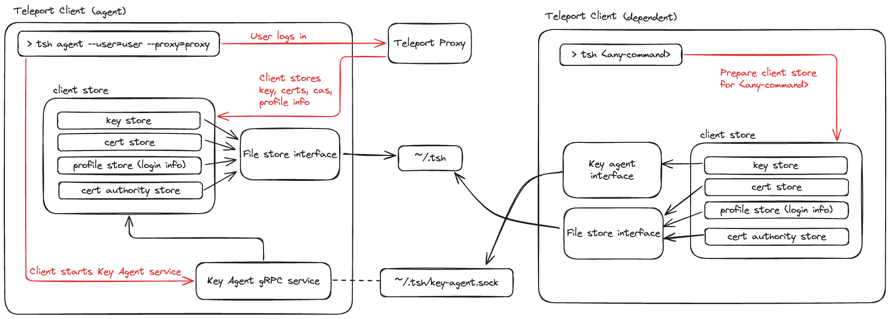

# RFD 199 - Teleport Key Agent

## Required Approvers

* Engineering: @rosstimothy && @ravicious
* Product: @xinding33 || @klizhentas

## What

Teleport Key Agent is a local agent that provides an alternative key storage
interface for Teleport Clients.

## Why

Currently, Teleport clients share a login session through file storage (~/.tsh).
While this works for most use cases, it prevents Teleport Clients from sharing
more sophisticated, programmatic session states.

Teleport Key Agent bridges that gap by providing an API for a user's key, the
basis of their login session.

This RFD will cover an MVP version of Teleport Key Agent necessary to support
the use case of hardware key PIN caching across local Teleport clients.

In the future, the key agent can be extended for the user's certs and other
login state data to support additional [future use cases](#future-work).

## Glossary

* "agent client" - any client running Teleport Key Agent
* "dependent client" - any client interfacing with Teleport Key Agent
* "login session" - a user's private key, certificates, profile (cluster) info,
and trusted certificate authorities, indexed by proxyhost, then username, and
finally cluster. Traditionally this is all stored on disk (`~/.tsh`), and or in
[memory for some niche use cases](#memory-key-storage).

## Details

### Teleport Key Agent

In its MVP form, Teleport Key Agent will provide two functionalities:

1. Fetching the public TLS or SSH key for a specific login session
1. Signing with one of the TLS or SSH keys for a specific login session

```go
// Pseudo-code

// loginSessionKeyRef uniquely identifies a login session key
type loginSessionKeyRef struct {
  ProxyHost   string
  Username    string
  ClusterName string
  Usage       enum // TLS or SSH
}

type keyAgentService interface {
  PublicKey(ref loginSessionKeyRef) crypto.PublicKey
  Sign(ref loginSessionKeyRef, digest []byte, opts SignerOpts) (signature []byte, err error)
}
```

This is the base functionality needed for dependent clients to interface with
the key agent like a `crypto.Signer` for both TLS and SSH handshakes:

```go
// Pseudo-code

// Implements [crypto.Signer].
type agentSigner struct {
  keyRef   loginSessionKeyRef
  agent    keyAgentService
}

func (as *agentSigner) Public() crypto.PublicKey {
  return as.agent.PublicKey(as.keyRef)
}

func (as *agentSigner) Sign(_ io.Reader, digest []byte, opts crypto.SignerOpts) ([]byte, error) {
  return as.agent.Sign(as.KeyRef, digest, opts)
}
```

The agent client will implement `keyAgentService` using its own key store, and
serve it as a [gRPC service](#keyagentservice) on a unix domain socket at
`$TELEPORT_HOME/key-agent.sock`.

```go
// Pseudo-code
type agentService struct {
  store client.KeyStore
}

func (as *agentService) Public() crypto.PublicKey {
  return  as.getKey(ref).Public()
}

func (as *agentService) Sign(ref keyRef, digest []byte, opts crypto.SignerOpts) ([]byte, error) {
  return as.getKey(ref).Sign(rand.Reader, digest, opts)
}

func (as *agentService) getKey(ref keyRef) (keys.PrivateKey) {
  index := keyRingIndexFromRef(ref)
  keyRing := as.store.GetKeyRing(index)
  switch ref.usage {
    case tls:
      return keyRing.TLSPrivateKey
    case ssh:
      return keyRing.SSHPrivateKey
  }
}
```

Implementation note: splitting the client store between different storage
interfaces is something we already do. Some commands, like `tsh --add-keys-to-agent=only`,
split login state storage between disk (profile, cas) and [in-memory](#memory-key-storage)
(private key, certs). Adding an agent key storage option does not require a
large departure from the current client store architecture, though it may
require splitting off `CertStore` from `KeyStore`.

#### Diagram



### UX

#### Agent clients

A user can start the Teleport Key Agent with Teleport Connect or `tsh`. The
chosen Teleport client will be responsible for serving it's keystore as
depicted [above](#diagram).

The client will handle the Teleport Key Agent in a goroutine in a similar
fashion to VNet or Headless polling. It will not affect the standard operation
of the client; it is purely an add-on service.

##### Teleport Connect

Teleport Connect is an ideal runner for the key agent since it:

1. Is a long-lived process
2. Provides a UI for login state (login status, current cluster, etc.)
3. Provides a UI for touch/PIN prompts (Hardware Key Support)
4. Has the ability to foreground itself for prompts (relogin, touch/PIN prompts)

We will add a new tab in Teleport Connect to manage the Teleport Key Agent
on demand. This tab will appear in the same drop down list as "Connect My Computer"
and will take the user to a "Teleport Key Agent" page. This page will describe
what the agent does and how it can be useful, similar to the "Connect My Computer"
page.

```text
Teleport Key Agent

Set up a local key agent so that other Teleport clients, like `tsh`, can share
your Teleport Connect credentials.

<<<Start Agent>>>
```

Once the the user starts the agent, there will instead be a button to stop
the agent. It will also provide a base command to use the agent with `tsh`:

```text
Teleport Key Agent

Setup a local key agent so that other Teleport clients, like `tsh`, can share
your Teleport Connect login state.

<<<Stop Agent>>>

The agent is currently running. To use it with `tsh`, use Teleport Connect's
Teleport home directory:

> TELEPORT_HOME=/Electron/tsh/home/path tsh 
```

Note: the Teleport Key Agent is started and stopped through the `tshd`
[gRPC service](#teleport-connect-terminalservice). The Teleport Key Agent
itself is a gRPC server, served by a goroutine in the main `tshd` process.

We will also introduce two new config options to change Teleport Connect's home
directory or launch the agent automatically.

| Property | Default | Description |
|----------|---------|-------------|
| `teleport.home` | `~/Library/Application\ Support/Teleport\ Connect/tsh` | Sets home directory for login data |
| `teleport.agent` | `false` | Starts the Teleport Key Agent automatically |

Caveat: The Teleport Connect developers have tested with linking login storage
with a [symlink](https://github.com/gravitational/teleport/issues/25806), which is
essentially the same as changing Connect's Teleport home directory. Without any
additional changes, this testing resulted in some state drift and related errors.
Addressing these issues fully is out of scope for this RFD, but is covered in
the [login session extension](#login-session-extension) section. Once these
issues are addressed, we may consider setting `teleport.home` to `~/.tsh` and
`teleport.agent` to `true` by default to get better interoperability with `tsh`
out of the box.

##### `tsh agent`

`tsh agent` will be made available as a hidden command, primarily for
development. If in the future we get requests to fully support this command,
we may make it a public command and make any necessary improvements.

For now, we will not put exorbitant effort into providing a good UX with this command
(e.g. stealing focus for hardware key prompts, re-login on cert expiration),
but it should be fully functional. Therefore, the rest of this RFD will refer
to Teleport Connect alone for features not intended for `tsh agent`.

##### Agent already running

If there is already a key agent running at `~/.tsh/key-agent.sock`, a newly
started agent client would fail to open a new listener on that same socket.
Instead of failing, the new client will ping the running agent to check if
it's active.

If the ping request fails, the socket will be treated as abandoned and
automatically replaced by the new agent.

If the ping request succeeds, an error will be returned:

```console
> tsh agent
Error: another instance of Teleport Key Agent is already running. To start a new
agent, stop your existing agent.
```

Note: with Teleport Connect, this error would be displayed when it attempts
to start the agent, but Teleport Connect would not fail to start. The error
would be displayed in the UI and the user could go into the "Teleport Key Agent"
management page to try to start it again.

#### Dependent clients

Dependent clients should interact with the key agent seamlessly so that there
is limited UX degradation when compared to a client solely using file storage.

##### Agent stops running

If the agent stops unexpectedly during a dependent client's operation, it may
lead to an error for the dependent client. The following error will be returned
in this case:

```console
> tsh proxy app
Error: Teleport Key Agent stopped working unexpectedly.
```

Alternative: we could catch this error and either:

1. fall back to file storage, triggering re-login if necessary.
1. output a message to start a new agent to continue.

However, this adds a decent amount of unneeded complexity for a rare edge
case, so we will just return the error for now.

#### Hardware Key prompts

The agent client is responsible for any prompts that occur within the key
storage and signing interface. Currently, this is limited to Hardware Key
PIN/touch prompts.

As a result, when the agent client prompts for for hardware key PIN/touch, the
dependent client will hang until the user handles the prompt. Teleport
Connect will foreground itself for these to maintain seamless UX.

Note: touch is cached for 15 seconds on the hardware key itself and PIN is
optionally cached when [Hardware Key pin caching](#hardware-key-pin-caching)
is enabled. Like any normal Teleport client, the agent client will only prompt
for PIN/touch when needed.

### Hardware key PIN caching

When enabled at the cluster-level, Teleport clients will cache the user's
hardware key PIN in memory for a specified duration of time. When the PIN is
cached, Teleport clients can provide the PIN to the hardware key without
prompting the user every 5 seconds.

Since the agent client is responsible for hardware key prompts,
it is likewise responsible for caching the hardware key PIN. This doesn't
require any changes to the agent client itself, it comes out naturally from
the implementation of the key storage interfaces.

#### Cluster Auth Preference

To enable PIN caching for Teleport clients, set `cap.hardware_key.pin_cache_timeout`
to the desired timeout duration:

```yaml
kind: cluster_auth_preference
version: v2
metadata:
  name: cluster-auth-preference
spec:
  ...
  hardware_key:
    # pin_cache_timeout is the amount of time that Teleport clients will cache
    # the user's PIV PIN. The timeout countdown is started when the PIN is
    # stored and is not extended by subsequent accesses. This timeout can not
    # exceed 1 hour. When empty or 0, the pin will not be cached.
    pin_cache_timeout: 15m
```

Teleport clients will retrieve this setting through `/webapi/ping`, which is
cached by the client alongside other cluster settings.

#### Problems with built-in PIV PIN caching

Currently, we use the built-in PIN caching mechanism detailed in the PIV
standard and implemented by Yubico. Unfortunately, this mechanism is quite
limited, inconsistent, and in some cases outright [bugged](https://github.com/gravitational/teleport/pull/36427).

In short, the PIN is not cached directly on the hardware key for a set duration
of time like touch is. Instead, it is cached within the PC/SC (Personal Computer/Smart
Card) transaction and wiped once the transaction is closed. This leaves room for
inconsistencies between different PIV implementations or versions.

For example, the developers and collaborators of the piv-go library found that
[depending on the YubiKey firmware version](https://github.com/go-piv/piv-go/issues/47#issuecomment-1368247984),
the PIN may or may not be cached across PC/SC (Personal Computer/Smart Card)
transactions and even different processes. In my own testing, I found that the
PC/SC transaction has a few seconds of grace period before it releases its
resources, allowing for any process to claim that transaction before it is released,
with the PIN cache still intact.

Lastly, the PIN is only cached so long as the PC/SC transaction is exclusive,
meaning long running Teleport clients like `tsh proxy` commands or Teleport
Connect can't hold open the PC/SC transaction to keep the PIN cached without
locking out all other Teleport/PIV clients in the meantime.

Suffice it to say, the inconsistencies of this PIN caching mechanism make it
poorly suited for Teleport clients. The resulting UX from this approach has
been _workable_ at best and unusable at worst.

### Security

#### Local key agent

For the intended use case of using Teleport Key Agent as a local key agent,
there is not much of concern to consider:

* The Teleport Key Agent acts as a proxy for normal file storage, and as such
is protected through file permissions on the unix socket it's served on:
`$TELEPORT_HOME/key-agent.sock`.
* The agent never exposes the underlying private key material, only an interface
to sign with.

Additionally, the Teleport Key Agent will use TLS with a new self signed cert.
This cert will be saved in file storage next to the agent socket at
`$TELEPORT_HOME/key-agent.pem`. Note that mTLS does not provide any benefit
over TLS here since the client key and cert would need to be stored on disk.

#### Key agent forwarding

We must also consider the unintended use case of forwarding the agent over ssh
with unix domain socket forwarding. Like ssh agent forwarding, this is an
insecure use case which will be strongly advised against. However, it cannot
be entirely avoided, the same way that we can not stop a user from running
`tsh scp $HOME/.tsh server01:`.

Alternative: since it is likely impossible to completely remove the possibility
of key agent forwarding, it may be better to [support it directly](#support-teleport-key-agent-forwarding)
with some mitigation strategies in place.

### Proto

#### `KeyAgentService`

```proto
// KeyAgentService provides a Teleport key agent service, allowing multiple Teleport client
// processes to share a single instance of a Teleport key. This is useful for PIV keys which
// can only be accessed by one process at a time.
service KeyAgentService {
  // GetPublicKey fetches a specific public key held by the agent, if it exists.
  rpc GetPublicKey(KeyRef) returns (PublicKey) {}
  // Sign signs the given digest with the private key corresponding to the given
  // key index and type. If a hash or salt was used to produce the digest, HashName
  // and SaltLength must be provided as well.
  //
  // This rpc can be used to implement Go's [crypto.Signer] interface.
  rpc Sign(SignRequest) returns (SignResponse) {}
}

message PublicKey {
  // PublicKey is a public key encoded in PKIX, ASN.1 DER form.
  bytes public_key_der = 1;
}

// SignRequest is a request to perform a signature with a specific agent key
// with the provided signing parameters.
message SignRequest {
  // KeyRef refers to a specific key held by the agent.
  KeyRef key_ref = 1;
  // Digest is a hashed message to sign.
  bytes digest = 2;
  // HashName is the name of the hash used to generate the digest.
  HashName hash_name = 3;
  // SaltLength controls the length of the salt to be used in a PSS signature.
  // Only required for PSS signatures.
  SaltLength salt_length = 4;
}

// Signature is a private key signature.
message Signature {
  // For an RSA key, signature should be either a PKCS #1 v1.5 or PSS signature,
  // depending on the hash and salt chosen. For an (EC)DSA key, it should be a
  // DER-serialised, ASN.1 signature structure.
  bytes signature = 1;
}

// KeyRef refers to a specific key.
message KeyRef {
  // ProxyHost is the root proxy hostname that a key is associated with.
  string proxy_host = 1;
  // Username is the username that a key is associated with.
  string username = 2;
  // KeyUsage is the key's usage.
  KeyUsage key_usage = 3;
}

// KeyUsage specifies a key's usage.
enum KeyUsage {
  // Key type not specified.
  KEY_TYPE_UNSPECIFIED = 0;
  // Key type ssh.
  KEY_TYPE_SSH = 1;
  // Key type tls.
  KEY_TYPE_TLS = 2;
}

// HashName is the name of a specific hashing algorithm.
// These values match the Go [crypto] standard library.
enum HashName {
  HASH_NAME_UNSPECIFIED = 0;
  HASH_NAME_MD4 = 1;
  HASH_NAME_MD5 = 2;
  HASH_NAME_SHA1 = 3;
  HASH_NAME_SHA224 = 4;
  HASH_NAME_SHA256 = 5;
  HASH_NAME_SHA384 = 6;
  HASH_NAME_SHA512 = 7;
  HASH_NAME_MD5SHA1 = 8;
  HASH_NAME_RIPEMD160 = 9;
  HASH_NAME_SHA3_224 = 10;
  HASH_NAME_SHA3_256 = 11;
  HASH_NAME_SHA3_384 = 12;
  HASH_NAME_SHA3_512 = 13;
  HASH_NAME_SHA512_224 = 14;
  HASH_NAME_SHA512_256 = 15;
  HASH_NAME_BLAKE2s_256 = 16;
  HASH_NAME_BLAKE2b_256 = 17;
  HASH_NAME_BLAKE2b_384 = 18;
  HASH_NAME_BLAKE2b_512 = 19;
}

enum SaltLength {
  SALT_LENGTH_UNSPECIFIED = 0;
  // Use the maximum length salt for a given hash function and public key.
  SALT_LENGTH_MAX = 1;
  // Use a salt equal in length to the chosen hash used.
  SALT_LENGTH_HASH_LENGTH = 2;
}
```

#### Teleport Connect `TerminalService`

```diff
### teleterm/v1/service.proto
service TerminalService {
  ...
+  // StartKeyAgent starts the Teleport Key Agent.
+  rpc StartKeyAgent(google.protobuf.Empty) returns (google.protobuf.Empty);
+  // StopKeyAgent stops the Teleport Key Agent.
+  rpc StopKeyAgent(google.protobuf.Empty) returns (google.protobuf.Empty);
}
```

#### `PinCacheTimeoutNanoseconds`

```diff
### types.proto
message HardwareKey {
  ...
+  // PinCacheTimeoutNanoseconds is the amount of time in nanoseconds that Teleport
+  // clients will cache a user's PIV PIN when hardware key PIN policy is enabled.
+  // This timeout can not exceed 1 hour. When empty or 0, the pin will not be cached.
+  int64 PinCacheTimeoutNanoseconds = 3 [
+    (gogoproto.jsontag) = "pin_cache_timeout_nano_seconds,omitempty",
+    (gogoproto.casttype) = "Duration"
+  ];
}
```

### Backward Compatibility

Teleport Key Agent is purely a client-side feature with no backwards
compatibility concerns. However, there may be some compatibility concerns
between different implementations of the Teleport Key Agent API in the
future as new versions are released.

### Audit Events

N/A

## Future work

Teleport Key Agent is a powerful login state service with the potential to
solve several more client-side use cases, some of which is described in
detail below for future reference.

### Login session extension

Teleport Key Agent's API can be extended to support sharing additional login
session data rather than just a key signing interface. This would include:

* Session certs (SSH cert, TLS cert)
* Protocol-specific certs (database, app, kube, etc.)
* Known cert authorities (SSH and TLS)
* Profiles (active profiles, current profile)

With this, individual dependent clients would not need to interface with file
storage at all, only the key agent. As long as the Teleport Key Agent is
running, there won't be any risk of racing in file storage; all changes to the
login session would be made by the key agent client according to the requests
from dependent clients.

Below are two feature ideas tied to this extension.

#### Teleport Connect login session manager

There is a long standing [feature request](https://github.com/gravitational/teleport/issues/25806)
to have Teleport Connect and `tsh` share the same home directory. It is
currently possible to force them to use the same home directory, with a symlink
or `TELEPORT_HOME` env variable, but this approach has some issues.

Since Teleport Connect is a stateful application, it needs to be informed of
any changes to the login session. If the user does `tsh logout` or `tsh login leaf`
outside of the app, Teleport Connect needs to adjust to the new login state and
reflect it in the UI.

One option is to have Teleport Connect watch the home directory directly. When
the directory is modified, it can try to figure out what changed exactly and
adjust. This solution could become quite complicated and hard to perfect, and
is not as efficient as a programmatic solution.

We can extend the Teleport Key Agent to handle all login session management
rather than just the keys. Extensions to the API would include some or all of
the following:

* Add or remove keys (login/logout)
* Add or remove certs (login/logout)
* Add or remove profile info (login/logout)
* Add or remove protocol specific certs (e.g. `tsh app login`)
  * Note that this would include some 1-minute TTL per-session MFA certs, if
  those certs are traditionally held on disk (e.g. `tsh app login`). Proxy
  commands would continue to hold the per-session MFA certs in memory.
* Update the current profile (change user or cluster)

Using this updated API, dependent clients could carry out any normal command
as if it was interfacing with file storage. Meanwhile, Teleport Connect would
be receiving these requests and interfacing with file storage itself.

The real benefit to this approach is that the agent client knows exactly what
actions were performed, and it can share these state changes to any dependent
clients with reason to listen, especially the Teleport Connect Electron app
(UI). When a user performs a `tsh` command that affects the login state, the
app could instantly be notified of exactly what change occurred and efficiently
adjust to the new state.

#### Support Teleport Key Agent forwarding

Using Teleport Key Agent with the login extension, users could forward their
login session to a remote host with a command like `tsh ssh --forward-teleport-agent`.
On the remote host, users could continue to use their login session in a similar
fashion to a local key agent.

This would serve as an alternative to Headless login as it provides some shared
login state rather than requiring the user to re-login for every single command.

For context, we have considered this type of key agent forwarding with `ssh-agent`
[in the past](https://github.com/gravitational/teleport/pull/19421) and decided
it was too insecure. However, I believe that the primary concerns with that
proposal can be addressed utilizing the following phish-proof security mechanisms:

* Per-session MFA or Hardware Key Support (touch)
  * In order to get MFA verified certs on the remote host, the remote client
  would either need to perform headless login, or request MFA verified certs
  with a new API endpoint in the key agent.
  * Note that Hardware Key support with pin requirement alone is not sufficient
  for guaranteeing presence, so it would not be sufficient for this use case.
* MFA for admin actions
  * Effectively prevents users from performing admin actions on the remote host
  as they cannot perform an MFA ceremony from the remote host.
* local confirmation layer
  * [custom prompt](#confirmation-layer)
  * Hardware Key Support (PIN/touch)

This would be an opt-in feature available only to clusters with the following
features enabled:

* Per-session MFA or Hardware Key Support
* MFA for Admin Actions

Note: Teleport Key Agent forwarding would also unlock some remote use cases
which are not handled by `tsh --headless`, like `ProxyCommand "tsh proxy ssh"`
[with Ansible](https://github.com/gravitational/teleport/issues/33303).

Note: the confirmation layer is very similar to headless. In both cases, the user's
local client is used to approve a remote connection. The main differences are:

* The user's local agent client is responsible for issuing the confirmation
request rather than the Teleport Auth and Proxy servers
* The user's local agent client decides the confirmation mechanism (e.g. temporary
registered local mfa) rather than Auth registered MFA

### Memory Key Storage

Currently, Teleport clients use memory key storage in a few niche scenarios:

* `tsh --add-keys-to-agent=only`
* `tsh --headless`
* `tsh -i <identity-file> --proxy=<proxy>`
* `tsh login --out=<identity-file>`

In each case, the resulting login session is not entirely stateful, meaning
some or all of the login state is missing after the command.

Teleport Key Agent introduces an interesting new way to handle in-memory key
storage while still being stateful. When combined with the [login extension](#login-session-extension),
the key agent could manage the user's entire login session in memory, never
once touching disk.

For anyone using `tsh --add-keys-to-agent=only`, this feature would provide a
huge UX benefit. `tsh --add-keys-to-agent=only` actually requires the user to
re-login for every command since we can't add the user's TLS key to their
ssh-agent, so an agent containing the full login state would be a welcome
addition.

For the record, Hardware Key Support is a much more secure, and enforceable,
alternative to in-memory key storage, so this idea may be purely theoretical.

### Confirmation layer

We can add a confirmation layer to the key agent API. In order to utilize the
agent for specific actions (key signature), the user would need to confirm the
signature request directly in the agent client. The confirmation may consist of:

* basic y/n confirmation similar to what we use for headless
* password prompt
  * like with ssh-agent, this would be a temporary password provided on agent
  startup
  * the prompt would appear in the agent client (like the hardware key prompts)
* MFA prompt
  * The agent could create a temporary local MFA server, and register a local
  MFA device

Rather than prompting the user on every signature, it could opt to prompt just
once every so often, providing a similar UX to [hardware key pin caching](#hardware-key-pin-caching).
This would not apply if the key agent is forwarded since the confirmation layer
is crucial to its security.

Note: when hardware key PIN/touch is already required, this confirmation layer
would not be necessary.

## Additional Considerations

### Why not utilize `ssh-agent` or `gpg-agent`

Early on in researching this feature, I worried I may be reinventing the wheel
when similar tools like `ssh-agent` and `gpg-agent` exist. Here's what I
determined:

* `ssh-agent` does not support generic signing, it uses a different signing
algorithm specific to SSH. In order to use `ssh-agent`, we would need to add
several extensions. It would be better to make our own feature-rich custom gRPC
agent designed with our own purposes in mind.
* `gpg-agent` is reportedly an old school, bloated agent which does all things
related to encryption. However, it does not ship with any popular OS's out of
the box and has been largely abandoned by users in search of more modern and
potentially more secure tools.

#### `ssh-askpass` with `tsh agent`

Teleport Connect provides the best UX for this feature. However, we could
improve the UX of `tsh agent` as well by integrating something like `ssh-askpass`
for any agent prompts, allowing the user to run the agent in the background or
even as a systemd process.

Since `ssh-askpass` does not ship with most OS's, it seems better to me to skip
this complication and rely on Teleport Connect since it would provide better UX
regardless. This is something we may want to consider in the future if there is
any demand for it.

#### Prompt notification

We could make the agent smarter when it needs to [prompt](#hardware-key-prompts)
for user action. Rather than just outputting a prompt and waiting until it's
completed, it can send a notification back to the dependent client about the
prompt.

In the case of hardware key touch/PIN prompts, the dependent client can mirror
the agent's prompt, rather than bringing the agent (Teleport Connect) to the
foreground:

```console
> tsh ssh server01
### sign through agent
### agent notifies client of touch prompt requirement
Tap your YubiKey
### agent notifies client of PIN prompt
Enter your YubiKey PIV PIN:
### client sends the entered PIN to the agent over the TLS encrypted connection
```

However, these hardware key prompts are already easy to miss in `tsh`,
especially when running something like `tsh proxy` and getting prompted multiple
times. Teleport Connect's ability to foreground itself, as well as its clear
prompt UI, makes it a more consistent option for hardware key prompts.

#### Why not extend `tsh daemon`

Rather than adding Teleport Key Agent, we could enable `tsh` to utilize `tshd`
directly to perform any actions. `tsh` would play a similar role to the Teleport
Connect Electron app in this case, just handling prompts if needed, but otherwise
leaving the heavy lifting to `tshd`.

At a high level, here are two issues that make this infeasible, at least in the
short term:

1. `tshd` has grown to be very Connect focused, meaning some of
the existing implementation, including how it is start, would need significant
reworking. For example, the Electron App that runs `tsh daemon start` provides
mTLS keys for it to use, which in turn prevents `tshd` from being usable to
other local clients like `tsh`.
2. `tsh` would need to have the capability to perform any command through `tshd`
in addition to performing it directly. While this may turn out to be easy for
many of the features supported in Teleport Connect, it still requires a major
restructuring to the `tsh` binary to handle a branching path from command start,
rather than just a branch in how client keys are stored.
