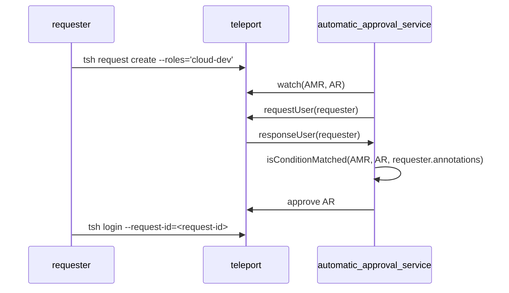

# RFD 0201 - Native Auto Approval

## Required Approvers
* Engineering: @r0mant && @fheinecke
* Product: @klizhentas && @roraback

## What
This document describes how Teleport will support native automatic approvals for
access requests.

## Why
Currently, Teleport supports automatic approvals of access requests, but support
is limited. Automatic approvals requires a separate plugin, and only a subset of
the plugins support automatic approvals. Requesting users do not wish to
integrate with a separate service just to utilize this feature. Teleport does
also enable users to build their own access request plugins, but users do not
want the responsibility of building and maintaining a separate piece of
software. They believe this should be a supported use case built-in to Teleport.
In order to support a wider range of use cases, Teleport should support
automatic approvals natively.

The initial use case for automatic approvals was to support on-call engineers.
Automatic approvals can be configured to allow on-call engineers to troubleshoot
production issues when access request approvers are not available.

Automatic approvals also enables teams to enforce zero standing privileges,
while allowing users to get access to their pre approved resources for a limited
period of time. Access lists could be used to achieve similar behavior, but some
users prefer the just-in-time access request flow.

This feature has also been requested for internal use at Teleport. The Tools
team enforces gated access to certain pipeline activity. The team would like the
dev environment to closely mimic the production environment and would like to
enforce the same gated access, but it would reduce a lot of friction if access
requests can be automatically approved in the dev environment.

## Goals
1. Native support for automatic approvals. Integration with external service is
not required.
2. Automatic approvals can be configured to allow users with certain traits to
be automatically approved. For example, all `L1` engineers on team `Cloud` in
location `Seattle` are pre-approved for the access request.
3. Automatic approvals can be configured to approve access to select resources.
For example, the requesting user is pre-approved to access all resources in the
`dev` environment.
4. Automatic approvals can be configured using Access Monitoring Rules.
5. Automatic approvals can be configured using the Teleport Web UI.
6. Automatic approval rules are easily reviewable through the Teleport Web UI.
7. User experience is the focus. The feature should be easy to use and configure.
8. Implementation should be compatible with future plugin interface refactoring.
9. Support configuration of automatic approvals using the Terraform provider.
10. Support automatic approval of access requests created by a Machine ID bot
user.

Note: Access monitoring rules do not currently support access requests by
resources, in any capacity. It will require more than just extending the access
monitoring rule predicate language to support this use case. Goal [3] will be
left out of scope for this RFD. It probably deserves its own separate RFD. As a
workaround to support this use case, auto approval rules can be configured to
approve a role that only has the permission to access resources in a specific
environment. Resources can be mapped to an environment using a label, and
roles can be allowed access to specific resources with a label selector.

Note: Development is in progress to refactor the access plugins and implement a
unified set of interfaces. This will help achieve feature parity across access
plugins. Auto approval support for other plugins is out of scope for this RFD,
but it is something to consider while we decide how to implement native auto
approvals. This is why [8] is included in the goals list. See
https://github.com/gravitational/teleport/issues/47150 for more details.

Note: Regarding goal [10], if access requests are compatible with bot users,
then automatic approvals will be compatible with bot users. However, access
requests are not quite compatible with bot users right now. The Teleport access
request validation logic uses only the user's "statically assigned" roles to
check if the user is permitted to create an access request.

Deciding how to address this issue is out of scope for this RFD, but some
options that can be considered:
- Grant the bot user "statically assigned" permissions to create access requests.
- Modify the access request validation logic to permit users to create access
requests based on impersonated/dynamically assigned roles.

## User Stories
Some example use cases that should be supported.
- "As a Teleport administrator, I want to be able to grant my team zero standing
access by default, but allow them to get access to low-risk resources whenever
they need. This access flow is needed for compliance reasons."
- "As a Teleport administrator, I want my super-users that have role "superuser"
to get their access requests approved automatically".
- "As an on-call engineer, I want to be able to troubleshoot a production server
on a weekend when approvers are not available."
- "As a Teleport administrator, I want to be able to grant my team zero standing
access by default, but allow them to get access to resources based on the user's
traits, and based on the resource's labels.

## Web UI Access Monitoring Rules
The Teleport Web UI now provides a more user friendly approach to configuring
auto approvals. Users are now able to navigate to the **Access Requests**
page and configure auto approvals, similarly to how notification routing is
configured.

The `Create a New Access Monitoring Rule` form can now be used to configure
both notification routing rules, as well as automatic approval rules. The
`Match Condition` provides an additional `Requester Traits` input that are used
to match a requesting user's Teleport traits. The `Auto Approvals` input is used
to select which plugin is responsible for handling the automatic approvals for
matching access requests.


The submitted form will be converted into an access monitoring rule that would
look like the following yaml. More details about the access monitoring rule
changes will be provided in following sections.

Note that the converted conditions use AND logic across traits, and OR
logic within a trait. The user must match at least one of the values among each
configured trait. For example, given the following converted AMR, a user is
pre-approved if they are any level "L1" or "L2" and they are on the "Cloud" team
and they are located in "Seattle". If the user is level "L1" and located in
"Seattle", but they are on the "Tools" team, they would not be pre-approved. If
the user requires more control over the condition matching, they will need to
edit the access monitoring rule yaml directly.

```yaml
kind: access_monitoring_rule
version: v1
metadata:
  name: cloud-dev-pre-approved
spec:
  subjects:
    - access_request
  states:
    - approved
  condition: >
    contains_any(access_request.spec.roles, set("cloud-dev")) &&
    contains_any(user.traits["level"], set("L1", "L2")) &&
    contains_any(user.traits["team"], set("Cloud")) &&
    contains_any(user.traits["location"], set("Seattle"))
  notification:
    name: slack
    recipients: ["#dev-cloud"]
  automatic_approval:
    name: teleport
```

The `Access Monitoring Rules` overview page will be modified to display both
notification rules, as well as automatic approval rules. This page will allow
user to see a quick overview of the automatic approvals currently enabled. The
overview simply displays the access monitoring rule name, plugin/integration
name, and the roles that are automatically approved. Users will need to click
on the **View** button to see the actual conditions for auto approval.


## Details
This feature will be supported by a new internal Teleport service. This
automatic approval service will function similarly to existing access plugins.
It will be running as part of the Teleport Auth Service by default.

The automatic approval service relies on a similar workflow that supports access
request notification routing with access monitoring rules. The service watches
for Access Monitoring (AMR) events and Access Request (AR) events. If an
incoming AR matches an existing AMR condition, then the service will attempt to
automatically approve the request.

### Access Monitoring Rule
The AMR now supports a configurable `automatic_approval.name` spec. This field
specifies the plugin/service responsible for handling automatic approvals for
matching ARs. For the initial implementation, the only acceptable value will be
"teleport", indicating that the internal Teleport service will handle the
request. This field will eventually accept values for all the available access
plugins that support automatic approvals.

The AMR conditions now also support a `user.traits` variable.  This variable
maps a trait name to a set of values. This allows users to specify arbitrary
user traits, such as, "level", "team", "location", etc...  These traits can then
be used to identity whether a user is on-call, or if the user is pre-approved
for the access request.

Additionally, the `spec.states` field will now be utilized to support an
`approved` state. If the AMR contains `spec.states.approved`, this indicates
that the AR should be automatically approved.

```yaml
# This AMR would allow users with traits "level"="L1" and "team"="Cloud" and
# "location"="Seattle" to be pre-approved for the "cloud-dev" role.
kind: access_monitoring_rule
version: v1
metadata:
  name: cloud-dev-pre-approved
spec:
  subjects:
    - access_request
  # states.approved indicates that matching access requests should be automatically approved.
  states:
    - approved
  condition: >
    contains_any(access_request.spec.roles, set("cloud-dev")) &&
    contains_any(user.traits["level"], set("L1")) &&
    contains_any(user.traits["team"], set("Cloud")) &&
    contains_any(user.traits["location"], set("Seattle"))
  notification:
    name: slack
    recipients: ["#dev-cloud"]
  automatic_approval:
    name: teleport
```

### Internal automatic approval service
The automatic approval service implements the same functionality as the other
access request plugins. When a new AR is observed, the automatic approval
service will check if the AR matches any AMR conditions and then attempt to
automatically approve the AR. Before checking if the AR matches any AMRs, the
automatic approval service makes a request to Teleport, requesting additional
information about the AR user. This info should contain the user traits.

The auto approval flow will look like this:

1. The automatic approval serivce is initialized and watches for ARs from Teleport.
2. When a user creates an AR, and after the automatic approval service observes
the event, the automatic approval service requests additional information about
the user.
3. The automatic approval service then checks to see if the AR matches any
existing AMRs. The automatic approval service provides the additional user
traits received from Teleport before the AMR condition is evaluated.
4. If the AR matches the AMR, the plugin submits an approval request for the AR.

## Security & Auditability
Automatic approvals is already a supported feature, although it is currently
only supported when integrated with an external incident management system. The
same security concerns apply with built-in auto approvals, as they apply to auto
approvals with an external plugin.

Automatic approvals are submitted using the system user `@teleport-access-approval-bot`.
Audit log events `access_request.review` are created whenever an access request
is reviewed, including automatically reviewed requests. The event contains the
same information as regular access request reviews.
```json
{
  "cluster_name": "example.teleport.sh",
  "code": "T5002I",
  "ei": 0,
  "event": "access_request.review",
  "expires": "2025-02-08T04:04:28.653838697Z",
  "id": "0193083a-77c8-73e1-9f6b-8e337215c5d1",
  "max_duration": "2025-02-08T04:04:28.653838697Z",
  "proposed_state": "APPROVED",
  "reason": "Access request has been automatically approved by 'teleport' plugin because user 'user@goteleport.com' satisfies the 'cloud-dev-pre-approved' access monitoring rule condition.",
  "reviewer": "@teleport-access-approval-bot",
  "state": "APPROVED",
  "time": "2025-02-07T20:04:31.196Z",
  "uid": "a5c9adb1-2a12-47d4-a626-f81a21e22f69"
}
```

## Observability
Anonymized metrics will be collected for access requests. These metrics will
allow us track automatic approval usage, and with which plugin it is being used.
- `access_request.create`: Specifies an access request create event.
  - `cluster_name`: Specifies the anonymized cluster name.
  - `requester_name`: Specifies the anonymized requesting user name.
  - `kind`: Is one of `role`, `resource`.

- `access_request.review`: specifies an access request review event.
  - `cluster_name`: Specifies the anonymized cluster name.
  - `reviewer_name`: Specifies the anonymized reviewer user name.
  - `is_auto_approved`: Is true if request was automatically reviewed.
  - `plugin`: Specifies the plugin/service that submitted the automatic approval request.

## Implementation Plan
1. Extend the Access Monitoring Rule to support the `automatic_approvals` field
and the `user.traits` variable.
2. Implement the automatic approvals service.
3. Deploy the automatic approvals service as part of Teleport initialization.
4. Update WebUI to allow users to create and view automatic approvals.
5. Update the Terraform resource schema to allow configuration of automatic
approvals with the Terraform provider.
6. Enable metrics for access requests.
7. Release guide on how to configure automatic approvals using Access
Monitoring Rules.
