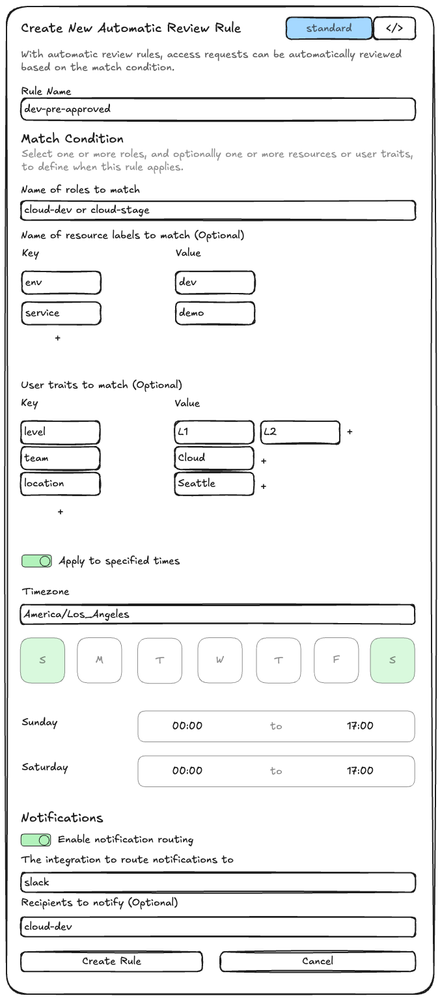

# RFD 0201 - Native Auto Approval

## Required Approvers
* Engineering: @r0mant && @fheinecke
* Product: @klizhentas && @roraback

## What
This document describes how Teleport will support native automatic approvals for
access requests.

## Why
Currently, Teleport supports automatic approvals of access requests, but support
is limited. Automatic approvals requires a separate plugin, and only a subset of
the plugins support automatic approvals. Requesting users do not wish to
integrate with a separate service just to utilize this feature. Teleport does
also enable users to build their own access request plugins, but users do not
want the responsibility of building and maintaining a separate piece of
software. They believe this should be a supported use case built-in to Teleport.
In order to support a wider range of use cases, Teleport should support
automatic approvals natively.

The initial use case for automatic approvals was to support on-call engineers.
Automatic approvals can be configured to allow on-call engineers to troubleshoot
production issues when access request approvers are not available.

Automatic approvals also enables teams to enforce zero standing privileges,
while allowing users to get access to their pre approved resources for a limited
period of time. Access lists could be used to achieve similar behavior, but some
users prefer the just-in-time access request flow.

This feature has also been requested for internal use at Teleport. The Tools
team enforces gated access to certain pipeline activity. The team would like the
dev environment to closely mimic the production environment and would like to
enforce the same gated access, but it would reduce a lot of friction if access
requests can be automatically approved in the dev environment.

## Goals
1. Native support for automatic approvals. Integration with external service is
not required.
2. Automatic approvals can be configured to allow users with certain traits to
be automatically approved. For example, all `L1` engineers on team `Cloud` in
location `Seattle` are pre-approved for the access request.
3. Automatic approvals can be configured to approve access to select resources.
For example, the requesting user is pre-approved to access all resources in the
`dev` environment.
4. Automatic approvals can be configured using Access Monitoring Rules.
5. Automatic approvals can be configured using the Teleport Web UI.
6. Automatic approval rules are easily reviewable through the Teleport Web UI.
7. User experience is the focus. The feature should be easy to use and configure.
8. Implementation should be compatible with future plugin interface refactoring.
9. Support configuration of automatic approvals using the Terraform provider.
10. Support automatic approval of access requests created by a Machine ID bot
user.

Note: Access monitoring rules do not currently support access requests by
resources, in any capacity. It will require more than just extending the access
monitoring rule predicate language to support this use case. Goal [3] will be
left out of scope for this RFD. It probably deserves its own separate RFD. As a
workaround to support this use case, auto approval rules can be configured to
approve a role that only has the permission to access resources in a specific
environment. Resources can be mapped to an environment using a label, and
roles can be allowed access to specific resources with a label selector.

Note: Development is in progress to refactor the access plugins and implement a
unified set of interfaces. This will help achieve feature parity across access
plugins. Auto approval support for other plugins is out of scope for this RFD,
but it is something to consider while we decide how to implement native auto
approvals. This is why [8] is included in the goals list. See
https://github.com/gravitational/teleport/issues/47150 for more details.

Note: Regarding goal [10], if access requests are compatible with bot users,
then automatic approvals will be compatible with bot users. However, access
requests are not quite compatible with bot users right now. The Teleport access
request validation logic uses only the user's "statically assigned" roles to
check if the user is permitted to create an access request.

Deciding how to address this issue is out of scope for this RFD, but some
options that can be considered:
- Grant the bot user "statically assigned" permissions to create access requests.
- Modify the access request validation logic to permit users to create access
requests based on impersonated/dynamically assigned roles.

## User Stories
Some example use cases that should be supported.
- "As a Teleport administrator, I want to be able to grant my team zero standing
access by default, but allow them to get access to low-risk resources whenever
they need. This access flow is needed for compliance reasons."
- "As a Teleport administrator, I want my super-users that have role "superuser"
to get their access requests approved automatically".
- "As an on-call engineer, I want to be able to troubleshoot a production server
on a weekend when approvers are not available."
- "As a Teleport administrator, I want to be able to grant my team zero standing
access by default, but allow them to get access to resources based on the user's
traits, and based on the resource's labels.

## Web UI Access Monitoring Rules
The Teleport Web UI will provide a more user friendly approach to configuring
auto approvals. Users will now be able to navigate to the **Access Requests**
page and configure auto approvals, similarly to how notification routing is
configured.

The `Create a New Access Monitoring Rule` form will now be used to configure
both notification routing rules, as well as automatic approval rules. The
available configuration input for automatic approvals will be toggled depending
on the selected plugin name/type.



The submitted form will be converted into an AMR that would look like:

```yaml
kind: access_monitoring_rule
version: v1
metadata:
  name: cloud-dev-pre-approved
spec:
  notification:
    name: slack-default
    recipients: ["#dev-cloud"]
  automatic_approval:
    name: access-native
    native:
       level: ["L1"]
       team: ["Cloud"]
       location: ["Seattle"]
  condition: |
    contains_any(access_request.spec.roles, set("cloud-dev"))
  subjects:
    - access_request
```

The Access Monitoring Rules overview page will be modified to display both
notification rules, as well as automatic approval rules. This page will allow
user to see a quick overview of the automatic approvals currently enabled. The
overview simply displays the access monitoring rule name, plugin/integration
name, and the roles that are automatically approved. Users will need to click
on the **View** button to see the actual conditions for auto approval.


## Details
This feature will be supported by a new `access-native` plugin. This native
plugin will implement the same interface as already existing access plugins.
The plugin will be running as a part of the Teleport Auth Service by default.

The native plugin will rely on a similar workflow that supports access request
notification routing with access monitoring rules. The plugin watches for Access
Monitoring Rules (AMR) events and Access Requests (AR) events. If an incoming AR
matches an existing AMR condition, then the plugin will attempt to automatically
approve the request.

Note: I've outlined two different approaches below, describing how we could
modify the access monitoring rules to support auto approvals. Approach (A1) is
more user friendly for configuring auto approval rules. Approach (A2) is less
user friendly, but it is more easily extensible to support future use cases.
Approach (A1) is probably the better approach to complete our goals for this
RFD, but open to exploring other ideas that could be more compatible with both
goals.

### Access Monitoring Rule (A1)
The access monitoring rule now supports a configurable `automatic_approval` spec.
This spec will contain a specified plugin `name` along with optional conditions
that are specific to each plugin. Separate conditions are required because each
plugin relies on different conditions to determine if a user is pre-approved for
the request. For example, the PagerDuty plugin relies on PagerDuty Services to
determine if a user is on-call, while this native plugin might rely on the
user's level, team, and location traits.

To support automatic approvals based on specific user traits, the AMR will be
extended to support these additional fields:
- **automatic_approval.name**: This field specifies the plugin that this AMR
applies for handling auto approvals.
- **automatic_approval.teleport**: This field contains auto approval conditions
specific to the native plugin. It maps arbitrary user traits to a list of string
values. For example, automatic approvals can be configured based on level, team,
and location with the following fields.
  - **automatic_approval.teleport.level**: This field specifies the requesting
  user's level.
  - **automatic_approval.teleport.team**: This field specifies the requesting
  user's team.
  - **automatic_approval.teleport.location**: This field specifies the
  requesting user's location.

```yaml
# This example AMR matches ARs that request the "cloud-dev" role. The plugin is
# then responsible for sending notifications to the "#dev-cloud" Slack channel.
# The plugin then has access to read the automatic_approval spec to check if the
# requesting user is pre-approved for the request.
kind: access_monitoring_rule
version: v1
metadata:
  name: cloud-dev-pre-approved
spec:
  notification:
    name: teleport-slack
    recipients: ["#dev-cloud"]
  automatic_approval:
    name: teleport-native
    teleport:
       level: ["L1"]
       team: ["Cloud"]
       location: ["Seattle"]
  condition: |
    contains_any(access_request.spec.roles, set("cloud-dev"))
  subjects:
    - access_request
```

The auto approval flow will look like this:

1. The access-native plugin is initialized and watches for ARs from Teleport.
2. When a user creates an AR, the plugin checks to see if the AR matches any
existing AMRs.
3. If the AR matches the AMR, the plugin sends another request to Teleport
requesting additional information about the user.
4. The plugin then checks to see if the user matches the auto approval
conditions specified in the matching AMR. In this case, the plugin checks to see
if the user satisfies the conditions {Level: L1, Team: Cloud, Location: Seattle}.
5. If the user satisfies the auto approval conditions, the plugin submits an
approval request for the AR.

Pros (A1):
- AMR configuration is more intuitive and user friendly.
- Plugin does not need to request additional user information until after a
matching AMR is found.

Cons (A1):
- AMR is less extensible. The AMR will need to be extended with additional spec
to support each plugin for goal [8].

### Access Monitoring Rule (A2)
AMR conditions are now aware of the plugin context/environment. The condition
predicate language will be extended to support plugin specific variables.
- **plugin.spec.name**: Specifies the name of the plugin the rule applies to.
- **plugin.spec.annotations**: Specifies an arbitrary map of annotations that
can be dynamically provided by the plugin.

The `plugin.spec.name` will replace the `spec.notification.name`. This is more
of a UX change. We can deprecate the `spec.notification.name` but continue to
support it. With native auto approvals, we'd like to support auto approvals
without notifications. It would be a bit confusing to have to use the
`spec.notification.name` in this scenario.

The `plugin.spec.annotations` can be used to provide arbitrary annotations, such
as, "teleport.dev/level", "teleport.dev/team", "teleport.dev/location", etc...
These annotations can be used to identify whether a user is on-call or
pre-approved for the AR.

Additionally, the `spec.states` field will now be utilized to support an
`approved` state. If the AMR contains `spec.states.approved`, this indicates
that the AR should be automatically approved.

```yaml
# This AMR would allow users with annotations: { level: L1, team: Cloud, location: Seattle }
# to be pre-approved for the "cloud-dev" role.
kind: access_monitoring_rule
version: v1
metadata:
  name: cloud-dev-pre-approved
spec:
  condition: >
    plugin.spec.name == "teleport-native" &&
    contains_any(plugin.spec.annotations["teleport.dev/level"], set("L1")) &&
    contains_any(plugin.spec.annotations["teleport.dev/team"], set("Cloud")) &&
    contains_any(plugin.spec.annotations["teleport.dev/location"], set("Seattle")) &&
    contains_any(access_request.spec.roles, set("cloud-dev"))
  subjects:
    - access_request
  # states.approved indicates that matching access requests should be automatically approved.
  states:
    - approved
```

The auto approval flow will look like this:

1. The access-native plugin is initialized and watches for ARs from Teleport.
2. When a user creates an AR, the plugin sends a request to Teleport requesting
additional information about the user.
3. The plugin then checks to see if the AR matches any existing AMRs. The plugin
provides the additional user traits received from Teleport before the AMR
condition is evaluated.
4. If the AR matches the AMR, the plugin submits an approval request for the AR.

Pros (A2):
- AMR configuration is more flexible and helps support goal [8]. Other plugins
would be supported without additional changes to the AMR spec.

Cons (A2):
- AMR configuration is less user friendly. Predicate language is not very
intuitive. The lack of expression validation makes it easy to write impossible
conditions.
- The plugin must request additional user information for all AR before matching
AMR.
- The lack of AMR structure will make it difficult to display the set of
enforced automatic approvals rules in the Web UI.

### Native Plugin
The previous section gives an overview of how the native plugin will operate,
but I'll provide some more details. The native plugin implements the same
interfaces as the other access request plugins. When a new AR is observed, the
plugin first attempts to send out notifications to the configured recipients,
then it attempts to auto approve the request if the auto approval conditions are
met.

Note that notifications are not supported by the native plugin. If this is a
feature that the native plugin should support, it will be out of scope for this
RFD. The native plugin implements a no-op handler for requests to send
notifications.

When attempting to approve the AR, the pre-approved validation process happens
in two steps. First, 1) the plugin checks to see if the AR meets the AMR
conditions. If the AMR conditions are met, then 2) the plugin makes a request to
Teleport, requesting additional information about the AR user, including user
traits. If the user traits received satisfy the AMR provided auto approval
conditions, the plugin then submits a request to approve the AR.

The supported traits for this initial implementation are `level`, `team`, and
`location`. The set of supported traits and conditions can always be extended
in the future.

Also note that the condition matching will use AND logic across traits, and OR
logic within a trait. The user must match at least one of the values among each
configured trait. For example, given the following AMR, a user is pre-approved
if they are any level "L1" or "L2" or "L3" and they are on the "Cloud" team and
they are located in "Seattle". If the user is level "L1" and located in
"Seattle", but they are on the "Tools" team, they would not be pre-approved.

```yaml
kind: access_monitoring_rule
version: v1
metadata:
  name: cloud-dev-pre-approved
spec:
  notification:
    name: teleport-slack
    recipients: ["#dev-cloud"]
  automatic_approval:
    name: teleport-native
    teleport:
       level: ["L1", "L2", "L3"]
       team: ["Cloud"]
       location: ["Seattle"]
  condition: |
    contains_any(access_request.spec.roles, set("cloud-dev"))
  subjects:
    - access_request
```

### Native Plugin Deployment
The native plugin is deployed just like all the other access request plugins. It
will be hosted by Teleport, but will not be self-hostable. Teleport will start
the native plugin instance during initialization. The native plugin will not
support any user configuration options.

## Security & Auditability
Automatic approvals is already a supported feature, although it is currently
only supported when integrated with an external incident management system. The
same security concerns apply with built-in auto approvals, as they apply to auto
approvals with an external plugin.

Automatic approvals are submitted using the system user `@teleport-access-approval-bot`.
Audit log events `access_request.review` are created whenever an access request
is reviewed, including automatically reviewed requests. The event contains the
same information as regular access request reviews.
```json
{
  "cluster_name": "example.teleport.sh",
  "code": "T5002I",
  "ei": 0,
  "event": "access_request.review",
  "expires": "2025-02-08T04:04:28.653838697Z",
  "id": "0193083a-77c8-73e1-9f6b-8e337215c5d1",
  "max_duration": "2025-02-08T04:04:28.653838697Z",
  "proposed_state": "APPROVED",
  "reason": "Access request has been automatically approved by 'teleport' plugin because user 'user@goteleport.com' satisfies the 'cloud-dev-pre-approved' access monitoring rule.",
  "reviewer": "@teleport-access-approval-bot",
  "state": "APPROVED",
  "time": "2025-02-07T20:04:31.196Z",
  "uid": "a5c9adb1-2a12-47d4-a626-f81a21e22f69"
}
```

## Observability
Anonymized metrics will be collected for access requests.
- `access_request.create`: Specifies an access request create event.
  - `cluster_name`: Specifies the anonymized cluster name.
  - `requester_name`: Specifies the anonymized requesting user name.
  - `kind`: Is one of `role`, `resource`.

- `access_request.review`: specifies an access request review event.
  - `cluster_name`: Specifies the anonymized cluster name.
  - `reviewer_name`: Specifies the anonymized reviewer user name.
  - `is_auto_approved`: Is true if request was automatically reviewed.
  - `plugin`: Specifies the plugin that submitted the automatic approval request.

## Implementation Plan
1. Extend the Access Monitoring Rule to support the `automatic_approvals` field.
2. Implement the `access-native` plugin.
3. Deploy `access-native` plugin as part of Teleport initialization.
4. Update WebUI to allow users to create and view automatic approvals.
5. Update the Terraform resource schema to allow configuration of automatic
approvals with the Terraform provider.
6. Enable metrics for access requests.
7. Release guide on how to configure automatic approvals using Access
Monitoring Rules.
