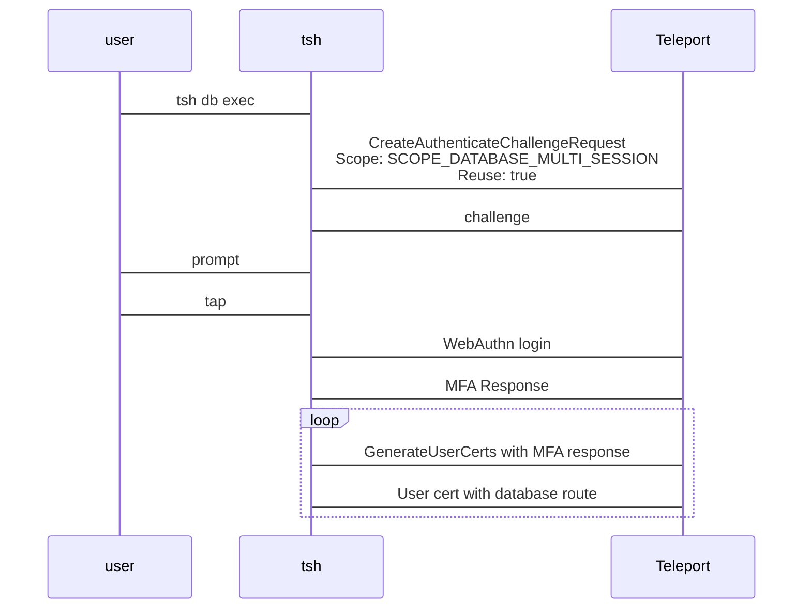

RFD 202 - Database Multi-session MFA

Required Approvers:
- Engineering: @r0mant && @codingllama

## What

Allows executing multiple database connections with a single MFA tap.

## Why

Teleport today supports per-session MFA for enhanced security. However, when a
user needs to run queries on multiple database hosts simultaneously, they have
to perform a tap for every connection.

A relaxed mode of per-session MFA will be introduced so that an MFA challenge is
still required for connecting to target databases but the MFA response can be
reused for a short period of time without the need to prompt the user again in
that period.

In addition to expanding MFA functionalities, a new `tsh` command will be
introduced to assist executing multiple database connections in a single command.

## Details

### UX
I would like to relax existing per-session MFA requirement and allow
multi-session MFA. The Teleport role that grants database access can be updated
as below:
```diff
kind: role
version: v7
metadata:
  name: example-role-with-mfa
spec:
  options:
    require_session_mfa: true
+    # Defaults to 'per-session'. Valid values are:
+    # - 'per-session': MFA is required for every session.
+    # - 'multi-session': Allows reuse of a MFA for multiple sessions. Currently only
+    #    supported for `tsh db exec` command with WebAuthn as the second factor.
+    requie_session_mfa_mode: "multi-session"
  allow:
    db_labels:
      'env': 'dev'
    db_users: ["mysql"]
```

I would like to execute a query on multiple databases:
```bash
$ tsh db exec --db-user mysql --exec-query "select @@hostname" mysql-db1 mysql-db2
MFA is required to execute database sessions
Tap any security key
Detected security key tap

Executing command for 'mysql-db1':
@@hostname
mysql-db1-hostname

Executing command for 'mysql-db2':
@@hostname
mysql-db2-hostname
```

I would like to search databases by labels and run the sql scripts in parallel:
```bash
$ tsh db exec --search-by-labels env=dev --db-user mysql --exec-query "source my_script.sql" --log-dir exec-logs --max-connections 3
Found 5 databases:

Name      Protocol Description Labels
--------- -------- ----------- -------
mysql-db1 mysql    instance 1  env=dev
mysql-db2 mysql    instance 2  env=dev
mysql-db3 mysql    instance 3  env=dev
mysql-db4 mysql    instance 4  env=dev
mysql-db5 mysql    instance 5  env=dev

Tip: use --skip-confirm to skip this confirmation.
Do you want to continue? (Press any key to proceed or Ctrl+C to exit): <enter>

MFA is required to execute database sessions
Tap any security key
Detected security key tap

Executing command for 'mysql-db1'. Outputs will be saved at 'exec-logs/mysql-db1.log'.
Executing command for 'mysql-db2'. Outputs will be saved at 'exec-logs/mysql-db2.log'.
Executing command for 'mysql-db3'. Outputs will be saved at 'exec-logs/mysql-db3.log'.
Executing command for 'mysql-db4'. Outputs will be saved at 'exec-logs/mysql-db4.log'.
Executing command for 'mysql-db5'. Outputs will be saved at 'exec-logs/mysql-db5.log'.
```
(where you can expect the first 3 connections happen right away, and the other 2
connections happen after the previous ones finish.)

### Multi-session MFA

Overview:


A new role option is added to decide the mode for session MFA:
```diff
kind: role
version: v7
spec:
  options:
    require_session_mfa: true
+    # Defaults to 'per-session'. Valid values are:
+    # - 'per-session': MFA is required for every session.
+    # - 'multi-session': Allows reuse of a MFA for multiple sessions. Currently only
+    #    supported for `tsh db exec` command with WebAuthn as the second factor.
+    requie_session_mfa_mode: "multi-session"
```

Mode defaults to `per-session` if not set. If a resource matches a role set with
some roles on `per-session` but others on `multi-session`, the stricter mode
`per-session` should be applied.

The multi-session MFA extends [RFD 155 Scoped Webauthn
Credentials](https://github.com/gravitational/teleport/blob/master/rfd/0155-scoped-webauthn-credentials.md)
with a new scope for executing database sessions:
```diff
// webauthn.proto
enum ChallengeScope {
...
    // Used for 'tsh db exec' and allows reuse. 
    SCOPE_DATABASE_MULTI_SESSION = 8;
}
```

Similar to `SCOPE_ADMIN_ACTION`, the new scope `SCOPE_DATABASE_MULTI_SESSION`
will allow reuse of the MFA session data until it expires (5 minutes for
WebAuthn).

The MFA response will be checked upon auth call of `GenerateUserCerts` where
user requests a TLS user cert with database route. New logic is added to
`GenerateUserCerts` where the new scope with reuse is allowed only if the role
set matching the requested database has `roleset.option.requie_session_mfa_mode`
option set to `multi-session`.

The new scope cannot be used for `GenerateUserCerts` for non-database targets.
And if the MFA response is validated with existing non-reusable `SCOPE_SESSION`,
the action should be allowed regardless of
`roleset.option.requie_session_mfa_mode`.

Here is a quick matrix:

| `session_mfa_mode` | MFA response scope             | Requested Target | Access |
|--------------------|--------------------------------|------------------|--------|
| `multi-session`    | `SCOPE_SESSION`                | Database         | Allow  |
| `multi-session`    | `SCOPE_DATABASE_MULTI_SESSION` | Database         | Allow  |
| `multi-session`    | `SCOPE_DATABASE_MULTI_SESSION` | Non-Database     | Denied |
| `per-session`      | `SCOPE_SESSION`                | Database         | Allow  |
| `per-session`      | `SCOPE_DATABASE_MULTI_SESSION` | Database         | Denied |
| `per-session`      | `SCOPE_DATABASE_MULTI_SESSION` | Non-Database     | Denied |

### The `tsh db exec` command

General flow of the command:
- Fetch databases (either specified directly or through search).
- Fetch roles and use access checker to determine MFA requirement.
- For each database:
  - Prompt MFA if necessary.
  - Starts a local proxy in tunnel mode for this database (regardless of cluster
    proxy listener mode).
  - Craft a command for `os.exec`. The command is not interactive (e.g. does not
    take in `stdin` for input). Outputs are printed to `stdout` unless `--log-dir`
    is specified.
  - Execute the command.
 
The command supports searching database by specifying one the following flags:
- `--search`: List of comma separated search keywords or phrases enclosed in
  quotations, e.g. `--search=foo,bar`.
- `--search-by-labels`: List of comma separated labels to filter by labels, e.g.
  `key1=value1,key2=value2`.
- `--search-by-query`: Query by predicate language enclosed in single quotes.

The command presents the search results then asks user to confirm before
proceeding. `--skip-confirm` can be used to skip the confirmation.

Some other details:
- If the multi-session MFA response is expired, the command should ask for MFA
  again.
- For MVP implementation, only PostgreSQL and MySQL databases will be supported.
  And a warning will be printed if the target databases have different protocols
  (e.g. `postgres` vs `mysql`).
- For databases that require per-session MFA, a prompt will still be presented
  per database.
 
#### Possible enhancements for `tsh db exec`
- `tsh db exec --exec-config` to support a config file which allows specifying
  different flags like `--db-user`, `--db-name`, `--exec-query` per target
  database or per search.
- `tsh db exec --exec-command` to support custom command template like `$ tsh
  db exec --exec-command "bash -c './myscript {{.DB_SERVICE}} {{.DB_USER}}
  {{.DB_NAME}} {{.DB_LOCAL_PORT}}'"`. An env var `TSH_UNSTABLE_DB_EXEC_COMMAND`
  can be supported for the initial MVP.

### Security

There is no change regarding security for existing users, unless their Teleport
admins set the `multi-session` mode in the role option.

Since the mode is configured at the role level, the mode will only be applied to
the resources that matches the role (e.g. `role.allow.db_labels`). And if
another role matching the resource has the stricter mode `per-session`, the
stricter mode will be applied.

The negative implications of the `multi-session` is the same as outlined in [RFD
155 Scoped Webauthn
Credentials](https://github.com/gravitational/teleport/blob/master/rfd/0155-scoped-webauthn-credentials.md):

1. The webauthn credential's scope is provided by the client
2. Reuse is requested by the client
3. Reuse is permitted for the action - server enforced
4. The expiration of the credentials - server enforced (5 minutes)

However, the new scope `SCOPE_DATABASE_MULTI_SESSION` will be limited to only
database sessions.