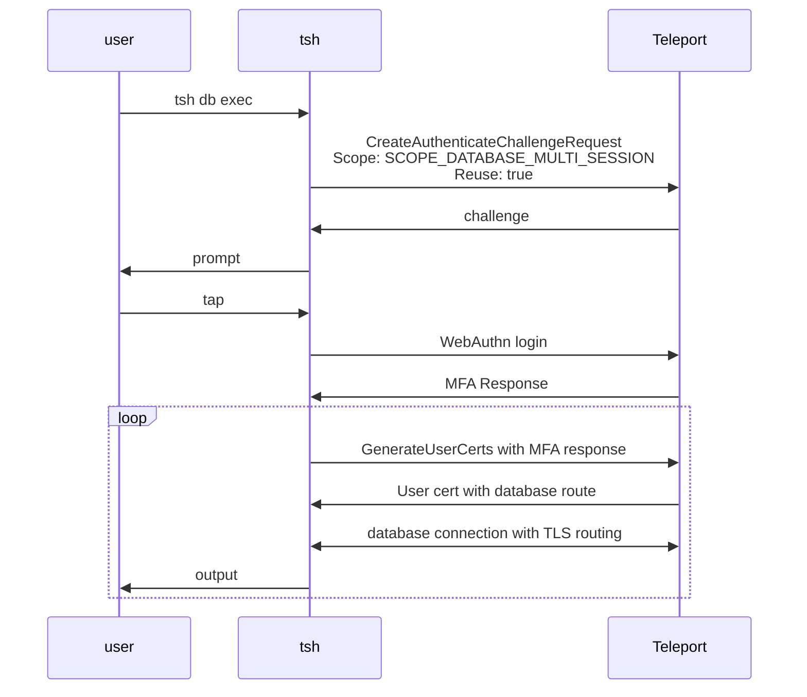

RFD 202 - Database Multi-session MFA

Required Approvers:
- Engineering: @r0mant && @codingllama

## What

Allows executing multiple database connections with a single MFA tap.

## Why

Teleport today supports per-session MFA for enhanced security. However, when a
user needs to run queries on multiple database hosts simultaneously, they have
to perform a tap for every connection.

A relaxed mode of per-session MFA will be introduced so that an MFA challenge is
still required for connecting to target databases but the MFA response can be
reused for a short period of time without the need to prompt the user again in
that period.

In addition to expanding MFA functionalities, a new `tsh` command will be
introduced to assist executing queries on multiple database servers using a
single CLI command.

## Details

### UX

I want to execute a database query on multiple database services without being
prompted by MFA for every database service. The Teleport role that grants
database access can be updated as below:
```diff
kind: role
version: v7
metadata:
  name: example-role-with-mfa
spec:
  options:
-   require_session_mfa: true
+   # "multi-session" allows reuse of the MFA response where applicable (e.g.
+   # a single WebAuthn prompt for `tsh db exec` on multiple databases), and
+   # fallbacks to per-session MFA in other places where multi-session is not
+   # supported.
+   require_session_mfa: "multi-session"
  allow:
    db_labels:
      'env': 'dev'
    db_users: ["mysql"]
```

To execute the same query on multiple databases:
```bash
$ tsh db exec "select @@hostname" --db-user mysql --dbs mysql-db1,mysql-db2
MFA is required to execute database sessions
Tap any security key
Detected security key tap

Executing command for 'mysql-db1':
@@hostname
mysql-db1-hostname

Executing command for 'mysql-db2':
@@hostname
mysql-db2-hostname
```

I would like to search databases by labels, and run the sql script in parallel:
```bash
$ tsh db exec "source my_script.sql" --labels env=dev --db-user mysql --log-dir exec-logs --max-connections 3
Found 5 databases:

Name      Protocol Description Labels
--------- -------- ----------- -------
mysql-db1 mysql    instance 1  env=dev
mysql-db2 mysql    instance 2  env=dev
mysql-db3 mysql    instance 3  env=dev
mysql-db4 mysql    instance 4  env=dev
mysql-db5 mysql    instance 5  env=dev

Do you want to continue?  [y/N]: y

MFA is required to execute database sessions
Tap any security key
Detected security key tap

Executing command for 'mysql-db1'. Logs will be saved at 'exec-logs/mysql-db1.log'.
Executing command for 'mysql-db2'. Logs will be saved at 'exec-logs/mysql-db2.log'.
Executing command for 'mysql-db3'. Logs will be saved at 'exec-logs/mysql-db3.log'.
Executing command for 'mysql-db4'. Logs will be saved at 'exec-logs/mysql-db4.log'.
Executing command for 'mysql-db5'. Logs will be saved at 'exec-logs/mysql-db5.log'.
```
(where you can expect the first 3 connections happen right away, and the other 2
connections happen after the previous ones finish.)

### Multi-session MFA

Overview:


A new MFA type is added to decide the mode for session MFA:
```diff
kind: role
version: v7
spec:
  options:
-   require_session_mfa: true
+   require_session_mfa: "multi-session"
```

Mode defaults to per-session if not set. If a resource matches a role set with
per-session but others on `multi-session`, the stricter mode should be applied.

The multi-session MFA extends [RFD 155 Scoped Webauthn
Credentials](https://github.com/gravitational/teleport/blob/master/rfd/0155-scoped-webauthn-credentials.md)
with a new scope for executing database sessions:
```diff
// webauthn.proto
enum ChallengeScope {
...
+    // Used for 'tsh db exec' and allows reuse. 
+    SCOPE_DATABASE_MULTI_SESSION = 8;
}
```

Similar to `SCOPE_ADMIN_ACTION`, the new scope `SCOPE_DATABASE_MULTI_SESSION`
will allow reuse of the MFA session data until it expires (5 minutes for
WebAuthn). Clients must go through MFA ceremony again if it expires.

The MFA response will be checked upon auth call of `GenerateUserCerts` where
user requests a TLS user cert with database route. New logic is added to
`GenerateUserCerts` where the new scope with reuse is allowed only if the role
set matching the requested database has `roleset.option.require_session_mfa`
option set to `multi-session`.

The new scope cannot be used for `GenerateUserCerts` for non-database targets.
And if the MFA response is validated with existing non-reusable `SCOPE_SESSION`,
the action should always be allowed.

Here is a quick matrix:

| `require_session_mfa` mode | MFA response scope             | Requested Target | Access |
|----------------------------|--------------------------------|------------------|--------|
| `multi-session`            | `SCOPE_SESSION`                | Database         | Allow  |
| `multi-session`            | `SCOPE_DATABASE_MULTI_SESSION` | Database         | Allow  |
| `multi-session`            | `SCOPE_DATABASE_MULTI_SESSION` | Non-Database     | Denied |
| `session`                  | `SCOPE_SESSION`                | Database         | Allow  |
| `session`                  | `SCOPE_DATABASE_MULTI_SESSION` | Database         | Denied |
| `session`                  | `SCOPE_DATABASE_MULTI_SESSION` | Non-Database     | Denied |

MFA requirement check is also updated to indicate whether the client can get
away with reusing the MFA response.
```diff
// MFARequired indicates if MFA is required to access a
// resource.
enum MFARequired {
  // Indicates the client/server are either old and don't support
  // checking if MFA is required during the ceremony or that there
  // was a catastrophic error checking RBAC to determine if completing
  // an MFA ceremony will grant access to a resource.
  MFA_REQUIRED_UNSPECIFIED = 0;
  // Completing an MFA ceremony will grant access to a resource.
  MFA_REQUIRED_YES = 1;
  // Completing an MFA ceremony will not grant access to a resource.
  MFA_REQUIRED_NO = 2;
+ // Completing an MFA ceremony or reusing the MFA response of the required
+ // scope will grant access to a resource.
+ MFA_REQUIRED_YES_ALLOW_REUSE = 3;
}
```

#### Compatibility

First, it is assumed the new feature will only be enabled once the control plane
has been upgraded to the new version.

To maintain backwards compatibility, Auth will downgrade responses for calls to
get `types.Role` and `types.IsMFARequiredResponse` for older clients:
- `RequireMFAType` in role options will be downgraded from `MULTI_SESSION` to
  `SESSION` to enforce the stricter per-session MFA.
- `MFARequired` for MFA requirement check will be downgraded from
  `MFA_REQUIRED_YES_ALLOW_REUSE` to `MFA_REQUIRED_YES` to enforce the stricter
  per-session MFA.
- The downgrade will be lifted in next major release version.

Newer clients will not be able to set the new role option or request the new
scope. They will continue use per-session MFA with older servers.

### The `tsh db exec` command

General flow of the command:
- Fetch databases (either specified directly or through search).
- For each database:
  - Prompt MFA:
    - If `per-session` MFA is required.
    - Or, if first time requesting MFA for `multi-session` or shared `multi-session`
      response is expired.
    - No MFA if not required.
  - Starts a local proxy in tunnel mode for this database (regardless of cluster
    proxy listener mode).
  - Craft a command for `os.exec`. Outputs are printed to `stdout` unless
    `--log-dir` is specified.
  - Execute the command.
 
The command supports searching database by specifying one the following flags:
- `--search`: List of comma separated search keywords or phrases enclosed in
  quotations, e.g. `--search=foo,bar`.
- `--labels`: List of comma separated labels to filter by labels, e.g.
  `key1=value1,key2=value2`.
- `--query` will NOT be supported for this command as it is harder to use than
  the other options and the name `--query` may be confused with the database
  query that needs to be executed.
The command presents the search results then asks user to confirm before
proceeding. `--skip-confirm` can be used to skip the confirmation.

If no search parameters are used, a list of database names can be specified
through `--dbs db1,db2,...`.

For the MVP implementation, only PostgreSQL and MySQL databases will be
supported. And a warning will be printed if the target databases have different
protocols (e.g. `postgres` vs `mysql`).

For databases that require per-session MFA, a prompt will still be presented
per database.
 
#### Possible future enhancements for `tsh db exec`
- `tsh db exec --exec-config` to support a config file which allows specifying
  different flags like `--db-user`, `--db-name`, `--exec-query` per target
  database or per search.
- `tsh db exec --command-template` to support custom command template like `tsh
  db exec --exec-command "bash -c './my_script.sh {{.DB_SERVICE}} {{.DB_USER}}
  {{.DB_NAME}} {{.DB_LOCAL_PORT}}'"`. An env var `TSH_UNSTABLE_DB_EXEC_COMMAND`
  can be supported for the initial MVP.

### Max connections

The new `tsh db exec` command with the `--max-connections` flag makes it easier
to for the client to flood the backend.

A new role option is added to set a maximum number of in-flight connections:
```diff
kind: role
version: v7
spec:
  options:
    # limit number of concurrent Kubernetes sessions per user
    max_kubernetes_connections: 1
+   # limit number of concurrent database sessions per user
+   max_db_connections: 5
```

The limit is enforced by Proxy using semaphore resources.

`tsh db exec` will also ensure that value passed to `--max-connections` is
smaller than the role option. If no value in the role set is specified, an
arbitrary chosen value of 10 will be used as the max of the `--max-connections`
flag.

### Security

There is no change regarding security for existing users, unless their Teleport
admins set the `multi-session` mode in the role option.

Since the mode is configured at the role level, the mode will only be applied to
the resources that matches the role (e.g. `role.allow.db_labels`). And if
another role matching the resource has the stricter mode `session`, the
stricter mode will be applied.

The negative implications of the `multi-session` is the same as outlined in [RFD
155 Scoped Webauthn
Credentials](https://github.com/gravitational/teleport/blob/master/rfd/0155-scoped-webauthn-credentials.md):

1. The webauthn credential's scope is provided by the client
2. Reuse is requested by the client
3. Reuse is permitted for the action - server enforced
4. The expiration of the credentials - server enforced (5 minutes)

However, the new scope `SCOPE_DATABASE_MULTI_SESSION` will be limited to only
database sessions.

In addition, `role.options.max_db_connections` is introduced to limit max
in-flight database sessions.