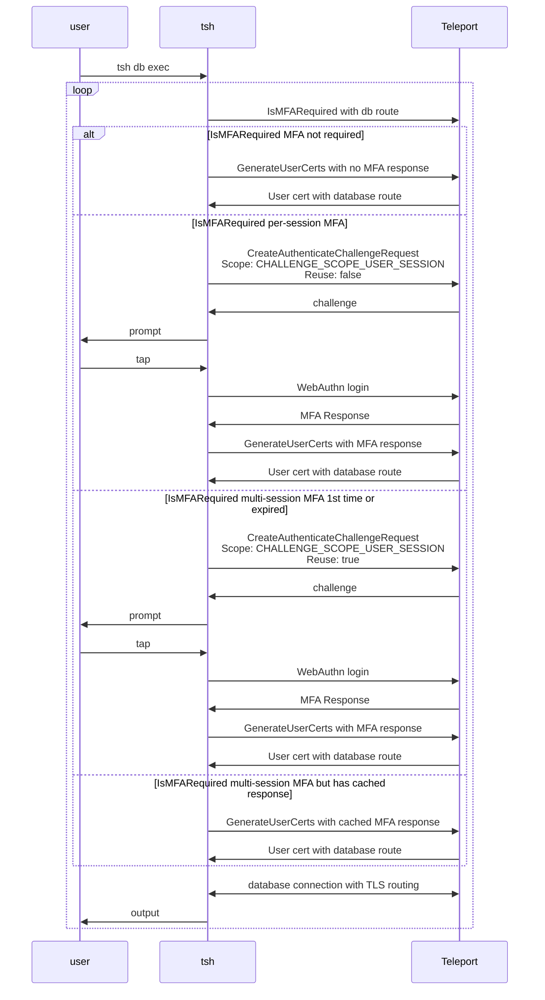

RFD 202 - Database Multi-session MFA

Required Approvers:
- Engineering: @r0mant && @codingllama

## What

Allows executing multiple database connections with a single MFA tap.

## Why

Teleport today supports per-session MFA for enhanced security. However, when a
user needs to run queries on multiple database hosts simultaneously, they have
to perform a tap for every connection.

A relaxed mode of per-session MFA will be introduced so that an MFA challenge is
still required for connecting to target databases but the MFA response can be
reused for a short period of time without the need to prompt the user again in
that period.

In addition to expanding MFA functionalities, a new `tsh` command will be
introduced to assist executing queries on multiple database servers using a
single CLI command.

## Details

### UX

#### UX - role option

I want to execute a database query on multiple database services without being
prompted by MFA for every database service. The Teleport role that grants
database access can be updated as below:
```diff
kind: role
version: v7
metadata:
  name: example-role-with-mfa
spec:
  options:
    require_session_mfa: true
+
+   # Specifies the MFA response retention policy when session MFA is required.
+   # Defaults to "per_session". Possible values are:
+   #
+   # "per_session": per-session MFA requires multi-factor authentication for
+   # every session.
+   #
+   # "multi_session": allows reuse of the MFA response where applicable and
+   # fallbacks to per-session MFA where multi-session MFA is not supported.
+   # Currently multi-session MFA is supported by WebAuthn as second-factor
+   # authentication, and here is a list of supported sessions:
+   # - "tsh db exec" for database sessions
+   #
+   session_mfa_retention_policy: "multi_session"
  allow:
    db_labels:
      'env': 'dev'
    db_users: ["mysql"]
```

#### UX - basic "tsh db exec"

To execute the same query on multiple databases:
```bash
$ tsh db exec "select @@hostname" --db-user mysql --dbs mysql-db1,mysql-db2
MFA is required to execute database sessions
Tap any security key
Detected security key tap

Executing command for 'mysql-db1':
@@hostname
mysql-db1-hostname

Executing command for 'mysql-db2':
@@hostname
mysql-db2-hostname
```

The cached MFA response does not persist through the command and so you can
expect a new MFA challenge when running another `tsh db exec` command.

#### UX - concurrent connections with "tsh db exec"

I would like to search databases by labels, and run the sql script in parallel:
```bash
$ tsh db exec "source my_script.sql" --labels env=dev --db-user mysql --log-dir exec-logs --max-connections 3
Found 5 databases:

Name      Protocol Description Labels
--------- -------- ----------- -------
mysql-db1 mysql    instance 1  env=dev
mysql-db2 mysql    instance 2  env=dev
mysql-db3 mysql    instance 3  env=dev
mysql-db4 mysql    instance 4  env=dev
mysql-db5 mysql    instance 5  env=dev

Do you want to continue?  [y/N]: y

MFA is required to execute database sessions
Tap any security key
Detected security key tap

Executing command for 'mysql-db1'. Logs will be saved at 'exec-logs/mysql-db1.log'.
Executing command for 'mysql-db2'. Logs will be saved at 'exec-logs/mysql-db2.log'.
Executing command for 'mysql-db3'. Logs will be saved at 'exec-logs/mysql-db3.log'.
Executing command for 'mysql-db4'. Logs will be saved at 'exec-logs/mysql-db4.log'.
Executing command for 'mysql-db5'. Logs will be saved at 'exec-logs/mysql-db5.log'.
```
Where you can expect the first 3 connections happen right away, and the other 2
connections happen after the previous ones finish.

#### UX - mixed MFA retention policy

Some of my databases require per-session MFA while others require multi-session
MFA or have no MFA requirements:

```bash
$ tsh db exec "source my_script.sql" --search mysql --db-user mysql --log-dir exec-logs
Found 5 databases:
...

Executing command for 'mysql-no-mfa-1'. Logs will be saved at 'exec-logs/mysql-no-mfa-1.log'.
Executing command for 'mysql-no-mfa-2'. Logs will be saved at 'exec-logs/mysql-no-mfa-2.log'.

MFA is required to access Database "mysql-per-session-mfa-1"
Tap any security key
Detected security key tap

Executing command for 'mysql-per-session-mfa-1'. Logs will be saved at 'exec-logs/mysql-per-session-mfa-1.log'.

MFA is required to execute database sessions
Tap any security key
Detected security key tap

Executing command for 'mysql-multi-session-mfa-1'. Logs will be saved at 'exec-logs/mysql-multi-session-mfa-1.log'.
Executing command for 'mysql-multi-session-mfa-2'. Logs will be saved at 'exec-logs/mysql-multi-session-mfa-2.log'.
```
Where databases with no MFA requirement are executed without MFA prompt,
databases with per-session MFA are prompted per database, and databases with
multi-session MFA share a single MFA prompt.

#### UX - long sessions with multi-session MFA

I need to execute a query on a large number databases and total sessions can
last longer than 5 minutes (the validity period of the cached WebAuthn
response):

```bash
$ tsh db exec "source my_script.sql" --labels env=staging --db-user mysql --log-dir exec-logs
Found 9 databases:
...

MFA is required to execute database sessions
Tap any security key
Detected security key tap

Executing command for 'mysql-db1'. Logs will be saved at 'exec-logs/mysql-db1.log'.
Executing command for 'mysql-db2'. Logs will be saved at 'exec-logs/mysql-db2.log'.
Executing command for 'mysql-db3'. Logs will be saved at 'exec-logs/mysql-db3.log'.
Executing command for 'mysql-db4'. Logs will be saved at 'exec-logs/mysql-db4.log'.
Executing command for 'mysql-db5'. Logs will be saved at 'exec-logs/mysql-db5.log'.

Your MFA session has expired. Start a new MFA session to execute database sessions
Tap any security key
Detected security key tap

Executing command for 'mysql-db6'. Logs will be saved at 'exec-logs/mysql-db6.log'.
Executing command for 'mysql-db7'. Logs will be saved at 'exec-logs/mysql-db7.log'.
Executing command for 'mysql-db8'. Logs will be saved at 'exec-logs/mysql-db8.log'.
Executing command for 'mysql-db9'. Logs will be saved at 'exec-logs/mysql-db9.log'.
```
Where a new MFA prompt will be required when the cached MFA response is expired.

### Multi-session MFA

Overview:


A new MFA toggle is added to decide the retention policy for session MFA:
```diff
kind: cluster_auth_preference
version: v2
spec:
    require_session_mfa: true
+
+   # Specifies the MFA response retention policy when session MFA is required.
+   # Defaults to "per_session". Possible values are:
+   #
+   # "per_session": per-session MFA requires multi-factor authentication for
+   # every session.
+   #
+   # "multi_session": allows reuse of the MFA response where applicable and
+   # fallbacks to per-session MFA where multi-session MFA is not supported.
+   # Currently multi-session MFA is supported by WebAuthn as second-factor
+   # authentication, and here is a list of supported sessions:
+   # - "tsh db exec" for database sessions
+   #
+   session_mfa_retention_policy: "multi_session"

kind: role
version: v7
spec:
  options:
    require_session_mfa: true
+   session_mfa_retention_policy: "multi_session"
```

Defaults to per-session MFA if not set. If a resource matches a role set with
per-session but others on multi-session, or when the role option conflicts with
cluster-level settings, the stricter mode should always be applied.

The multi-session MFA extends [RFD 155 Scoped Webauthn
Credentials](https://github.com/gravitational/teleport/blob/master/rfd/0155-scoped-webauthn-credentials.md)
to allow reuse for `CHALLENGE_SCOPE_USER_SESSION`:
```diff
// mfa.proto
enum ChallengeScope {
...
- // Used for per-session MFA and moderated session presence checks.
+ // Used for user sessions and moderated session presence checks. Can be
+ // requested with reuse when retention policy is "multi_session".
  CHALLENGE_SCOPE_USER_SESSION = 6;
}
```

Similar to `SCOPE_ADMIN_ACTION`, `CHALLENGE_SCOPE_USER_SESSION` will allow reuse
of the MFA session data until it expires, for multi-session MFA. Clients must go
through MFA ceremony again if it expires. Currently, reuse of the session data
is allowed within 5 minutes. This duration is hard-coded and controlled on the
server side. We could introduce a new option to override the period but leaving
it out of scope for this RFD for now.

The MFA response will be checked upon auth call of `GenerateUserCerts` where
user requests a TLS user cert with database route. New logic is added to
`GenerateUserCerts` where the new scope with reuse is allowed only if the role
set matching the requested database has retention policy set to `multi_session`.

For now, reuse for `CHALLENGE_SCOPE_USER_SESSION` will only be allowed for
database targets when calling  `GenerateUserCerts`.

Here is a quick matrix:

| Retention policy | Reuse requested for scope | Requested Target | Access |
|------------------|---------------------------|------------------|--------|
| `multi_session`  | Non-reusable              | Database         | Allow  |
| `multi_session`  | Non-reusable              | Non-Database     | Allow  |
| `multi_session`  | Reusable                  | Database         | Allow  |
| `multi_session`  | Reusable                  | Non-Database     | Denied |
| `per_session`    | Non-reusable              | Database         | Allow  |
| `per_session`    | Non-reusable              | Non-Database     | Allow  |
| `per_session`    | Reusable                  | Database         | Denied |
| `per_session`    | Reusable                  | Non-Database     | Denied |

MFA requirement check is also updated to indicate whether the client can get
away with reusing the MFA response.
```diff
// authservice.proto

// IsMFARequiredResponse is a response for MFA requirement check.
message IsMFARequiredResponse {
  // Required is a simplified view over [MFARequired].
  bool Required = 1;
  // MFARequired informs whether MFA is required to access the corresponding
  // resource.
  MFARequired MFARequired = 2;
+ // AllowReuse determines if reusing the MFA response of a MFA challenge
+ // requested with AllowReuse is permitted. Only applies when MFARequired is
+ // MFA_REQUIRED_YES.
+ MFAAllowReuse allow_reuse = 3;
 }

+// MFAAllowReuse determines whether an MFA challenge response can be used
+// to authenticate the user more than once until the challenge expires.
+enum MFAAllowReuse {
+  // Reuse unspecified, treated as CHALLENGE_ALLOW_REUSE_NO.
+  MFA_ALLOW_REUSE_UNSPECIFIED = 0;
+  // Reuse is permitted.
+  MFA_ALLOW_REUSE_YES = 1;
+  // Reuse is not permitted.
+  MFA_ALLOW_REUSE_NO = 2;
+}
```

#### Compatibility

No special handling is necessary for backwards compatability. The feature will
be functional when the control plane and tsh are upgraded. The control plane
will assume existing behavior (e.g.`per_session`) when retention policy is not
set. Older agents and clients will not interpret the new fields and will assume
existing MFA requirement without reuse.

### The `tsh db exec` command

General flow of the command:
- Fetch databases (either specified directly or through search).
- For each database:
  - Check MFA requirement:
    - No MFA prompt if not required.
    - MFA prompt if `per_session` MFA is required.
    - MFA prompt if first time requesting MFA for `multi_session` or cached
      `multi_session` response has expired.
  - Starts a local proxy in tunnel mode for this database (regardless of cluster
    proxy listener mode).
  - Craft a command for `os.exec`.
    - Outputs are printed to `stdout` unless `--log-dir` is specified
    - Outputs to `stdout` are prefixed with `[db-service-name] ` when
      `--max-connections` is greater than 1. The prefix behavior can be overridden
      with `--output-prefix/--no-output-prefix`.
  - Execute the command.
 
The command supports searching database by specifying one the following flags:
- `--search`: List of comma separated search keywords or phrases enclosed in
  quotations, e.g. `--search=foo,bar`.
- `--labels`: List of comma separated labels to filter by labels, e.g.
  `key1=value1,key2=value2`.
- `--query` will NOT be supported for this command as it is harder to use than
  the other options and the name `--query` may be confused with the database
  query that needs to be executed.

The command presents the search results then asks user to confirm before
proceeding. `--skip-confirm` can be used to skip the confirmation.

If no search parameters are used, a list of database names can be specified
through `--dbs db1,db2,...`.

For the MVP implementation, only PostgreSQL and MySQL databases will be
supported. And a warning will be printed if the target databases have different
protocols (e.g. `postgres` vs `mysql`).

Concurrent database connections can be run with `--max-connections` flag.
`--max-connections` defaults to 1, and must be <= 10 to avoid DDoSing the
backend.
 
#### Possible future enhancements for `tsh db exec`
- `tsh db exec --exec-config` to support a config file which allows specifying
  different flags like `--db-user`, `--db-name`, `--exec-query` per target
  database or per search.
- `tsh db exec --command-template` to support custom command template like `tsh
  db exec --exec-command "bash -c './my_script.sh {{.DB_SERVICE}} {{.DB_USER}}
  {{.DB_NAME}} {{.DB_LOCAL_PORT}}'"`. An env var
  `TELEPORT_UNSTABLE_DB_EXEC_COMMAND` can be supported for the initial MVP.

### Security

There is no change regarding security for existing users, unless their Teleport
admins enables `multi_session` for the retention policy.

When role options and cluster-level auth preference has conflict, the stricter
mode (e.g. `per_session`) will always be applied.

The negative implications of the `multi_session` is the same as outlined in [RFD
155 Scoped Webauthn
Credentials](https://github.com/gravitational/teleport/blob/master/rfd/0155-scoped-webauthn-credentials.md):

1. The webauthn credential's scope is provided by the client
2. Reuse is requested by the client
3. Reuse is permitted for the action - server enforced
4. The expiration of the credentials - server enforced (5 minutes)


The `--max-connections` flag from `tsh db exec` has a max limit of 10, but it
will not prevent bad actors who attempts to flood the backend. However, this is
a general problem that applies outside of this RFD as well. A
`role.options.max_db_connections` will introduced separately to limit max
in-flight database sessions per user.