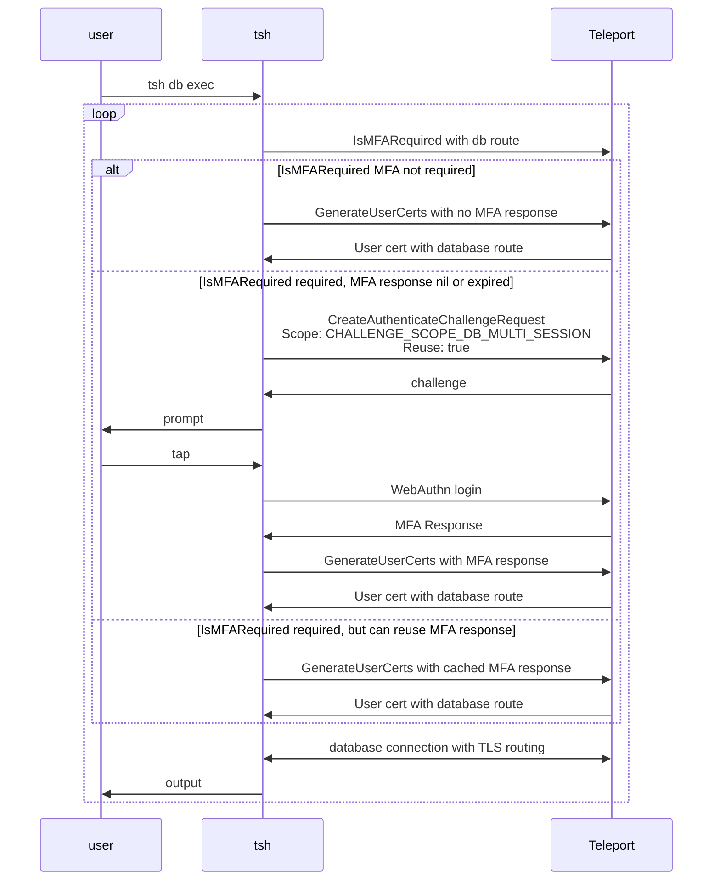

RFD 202 - Database Multi-session MFA

Required Approvers:
- Engineering: @r0mant && (@codingllama || @Joerger)

## What

Allows executing multiple database connections with a single MFA tap.

## Why

Teleport today supports per-session MFA for enhanced security. However, when a
user needs to run queries on multiple database hosts simultaneously, they have
to perform a tap for every connection.

A relaxed mode of per-session MFA will be introduced so that an MFA challenge is
still required for connecting to target databases but the MFA response can be
reused for a short period of time without the need to prompt the user again in
that period.

In addition to expanding MFA functionalities, a new `tsh` command will be
introduced to assist executing queries on multiple database servers using a
single CLI command.

## Details

#### UX - basic "tsh db exec"

I want to execute a database query on multiple database services without being
prompted by MFA for every database service:
```bash
$ tsh db exec "select @@hostname" --db-user mysql --dbs mysql-db1,mysql-db2
MFA is required to execute database sessions
Tap any security key
Detected security key tap

Executing command for 'mysql-db1':
@@hostname
mysql-db1-hostname

Executing command for 'mysql-db2':
@@hostname
mysql-db2-hostname
```

The query is executed sequentially and the outputs are printed sequentially.

The cached MFA response does not persist through the command so 
a new MFA challenge is expected when running another `tsh db exec` command.

#### UX - concurrent connections with "tsh db exec"

I would like to search databases by labels, and run the sql script in parallel:
```bash
$ tsh db exec "source my_script.sql" --labels env=dev --db-user mysql --output-dir exec-logs --max-connections 3
Found 5 databases:

Name      Protocol Description Labels
--------- -------- ----------- -------
mysql-db1 mysql    instance 1  env=dev
mysql-db2 mysql    instance 2  env=dev
mysql-db3 mysql    instance 3  env=dev
mysql-db4 mysql    instance 4  env=dev
mysql-db5 mysql    instance 5  env=dev

Do you want to continue?  [y/N]: y

MFA is required to execute database sessions
Tap any security key
Detected security key tap

Executing command for 'mysql-db1'. Logs will be saved at 'exec-logs/mysql-db1.log'.
Executing command for 'mysql-db2'. Logs will be saved at 'exec-logs/mysql-db2.log'.
Executing command for 'mysql-db3'. Logs will be saved at 'exec-logs/mysql-db3.log'.
Executing command for 'mysql-db4'. Logs will be saved at 'exec-logs/mysql-db4.log'.
Executing command for 'mysql-db5'. Logs will be saved at 'exec-logs/mysql-db5.log'.
```
Where you can expect the first 3 connections happen right away, and the other 2
connections happen after the previous ones finish.

#### UX - long sessions with multi-session MFA

I need to execute a query on a large number databases and total sessions can
last longer than 5 minutes (the validity period of the cached WebAuthn
response):

```bash
$ tsh db exec "source my_script.sql" --labels env=staging --db-user mysql --output-dir exec-logs
Found 9 databases:
...

MFA is required to execute database sessions
Tap any security key
Detected security key tap

Executing command for 'mysql-db1'. Logs will be saved at 'exec-logs/mysql-db1.log'.
Executing command for 'mysql-db2'. Logs will be saved at 'exec-logs/mysql-db2.log'.
Executing command for 'mysql-db3'. Logs will be saved at 'exec-logs/mysql-db3.log'.
Executing command for 'mysql-db4'. Logs will be saved at 'exec-logs/mysql-db4.log'.
Executing command for 'mysql-db5'. Logs will be saved at 'exec-logs/mysql-db5.log'.

Your MFA session has expired. Start a new MFA session to execute database sessions
Tap any security key
Detected security key tap

Executing command for 'mysql-db6'. Logs will be saved at 'exec-logs/mysql-db6.log'.
Executing command for 'mysql-db7'. Logs will be saved at 'exec-logs/mysql-db7.log'.
Executing command for 'mysql-db8'. Logs will be saved at 'exec-logs/mysql-db8.log'.
Executing command for 'mysql-db9'. Logs will be saved at 'exec-logs/mysql-db9.log'.
```
Where a new MFA prompt will be required when the cached MFA response is expired.

### Multi-session MFA

Overview:


In favor of better UX, no new role option is introduced for multi-session MFA.
The multi-session MFA extends [RFD 155 Scoped Webauthn
Credentials](https://github.com/gravitational/teleport/blob/master/rfd/0155-scoped-webauthn-credentials.md)
by allowing reuse for `ChallengeScope_CHALLENGE_SCOPE_USER_SESSION`.

Similar to `SCOPE_ADMIN_ACTION`, `ChallengeScope_CHALLENGE_SCOPE_USER_SESSION`
now can be requested with `CHALLENGE_ALLOW_REUSE_YES`. The responded session data
will be reusable until it expires. Clients must go through MFA ceremony again if
it expires. Currently, reuse of the session data is allowed within 5 minutes.
This duration is hard-coded and controlled on the server side. We could
introduce a new option to override the period but leaving it out of scope for
this RFD for now.

The reusable MFA response will be checked upon auth call of `GenerateUserCerts`
where user requests a TLS user cert with database route. New logic is added to
`GenerateUserCerts` when the request is identified from `tsh db exec` sessions:

```diff
// Requester is the name of the service that sent the request.
 enum Requester {
...
    // TSH_APP_LOCAL_PROXY is set when the request was sent by a tsh app local proxy.
    TSH_APP_LOCAL_PROXY = 4;
+   // TSH_DB_EXEC is set when the request was sent by "tsh db exec".
+   TSH_DB_EXEC = 5;
}
```

And here goes the logic for handling `TSH_DB_EXEC`:
- The purpose must be single use and TTL is constrained to single use TTL of one
  minute.
- The request must be for a database route and not for any other resources.
- `CHALLENGE_ALLOW_REUSE_YES` when validating the MFA response.

Here is a matrix of different modes that `tsh` can request for user certs when
session MFA is required:

| Command          | Reusable  | Cert TTL                                                        |
|------------------|-----------|-----------------------------------------------------------------|
| `tsh db connect` | no        | 1 minute                                                        |
| `tsh proxy db`   | no        | min(identity.expires, `role.options.mfa_verification_interval`) |
| `tsh db exec`    | 5 minutes | 1 minute                                                        |


### The `tsh db exec` command

General flow of the command:
- Create auth client which should be reused for all API calls.
- Fetch databases (either specified directly or through search).
- For each database:
  - Check MFA requirement:
    - No MFA prompt if not required.
    - MFA prompt if `per_session` MFA is required.
    - MFA prompt if first time requesting MFA for `multi_session` or cached
      `multi_session` response has expired.
  - Starts a local proxy in tunnel mode for this database (regardless of cluster
    proxy listener mode).
  - Craft a command for `os.exec`.
    - Outputs are printed to `stdout` unless `--output-dir` is specified
    - Outputs to `stdout` are prefixed with `[db-service-name] ` when
      `--max-connections` is greater than 1. The prefix behavior can be overridden
      with `--output-prefix/--no-output-prefix`.
  - Execute the command.
 
The command supports searching database by specifying one the following flags:
- `--search`: List of comma separated search keywords or phrases enclosed in
  quotations, e.g. `--search=foo,bar`.
- `--labels`: List of comma separated labels to filter by labels, e.g.
  `key1=value1,key2=value2`.
- `--query` will NOT be supported for this command as it is harder to use than
  the other options and the name `--query` may be confused with the database
  query that needs to be executed.

The command presents the search results then asks user to confirm before
proceeding. `--skip-confirm` can be used to skip the confirmation.

If no search parameters are used, a list of database names can be specified
through `--dbs db1,db2,...`.

For the MVP implementation, only PostgreSQL and MySQL databases will be
supported. And a warning will be printed if the target databases have different
protocols (e.g. `postgres` vs `mysql`).

Concurrent database connections can be run with `--max-connections` flag.
`--max-connections` defaults to 1, and must be <= 10 to avoid DDoSing the
backend.
 
#### Possible future enhancements for `tsh db exec`
- `tsh db exec --exec-config` to support a config file which allows specifying
  different flags like `--db-user`, `--db-name`, `--exec-query` per target
  database or per search.
- `tsh db exec --command-template` to support custom command template like `tsh
  db exec --exec-command "bash -c './my_script.sh {{.DB_SERVICE}} {{.DB_USER}}
  {{.DB_NAME}} {{.DB_LOCAL_PORT}}'"`. An env var
  `TELEPORT_UNSTABLE_DB_EXEC_COMMAND` can be supported for the initial MVP.

### Security

Negative implications of the reusable scope is the same as outlined in [RFD 155
Scoped Webauthn
Credentials](https://github.com/gravitational/teleport/blob/master/rfd/0155-scoped-webauthn-credentials.md):

1. The webauthn credential's scope is provided by the client
2. Reuse is requested by the client
3. Reuse is permitted for the action - server enforced
4. The expiration of the credentials - server enforced (5 minutes)

To limit this impact, the reusable MFA response will be only allowed when
requester is `TSH_DB_EXEC` and certs TTLs will be limited to 1 minute.
The logic for existing flows like `tsh db connect` or `tsh proxy db` [RFD
090](https://github.com/gravitational/teleport/blob/master/rfd/0090-db-mfa-sessions.md)
will stay the same where only non-reusable response is allowed when calling
`GenerateUserCerts`.

The `--max-connections` flag from `tsh db exec` has a max limit of 10, but it
will not prevent bad actors who attempt to flood the backend. However, this is
a general problem that applies outside of this RFD as well. A
`role.options.max_db_connections` will introduced separately to limit max
in-flight database sessions per user.