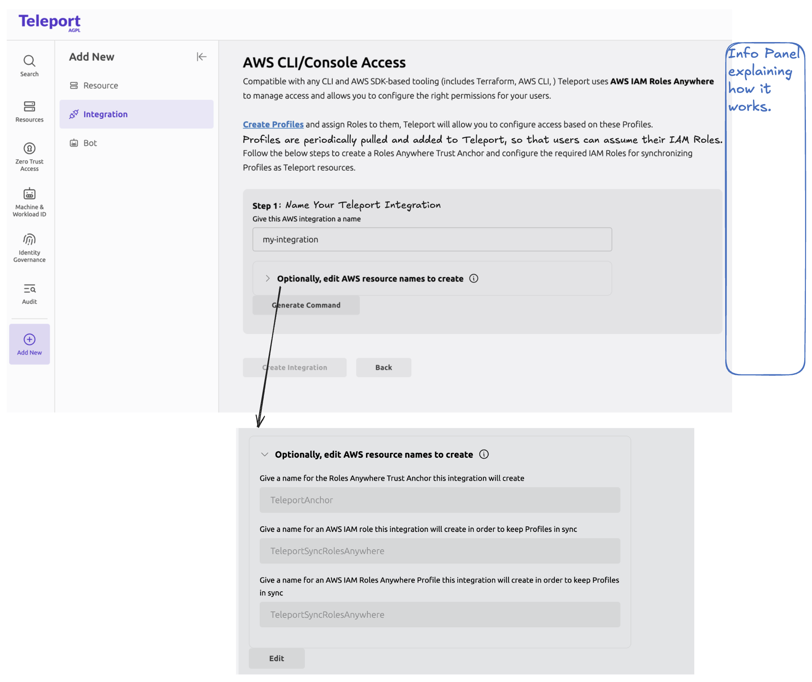
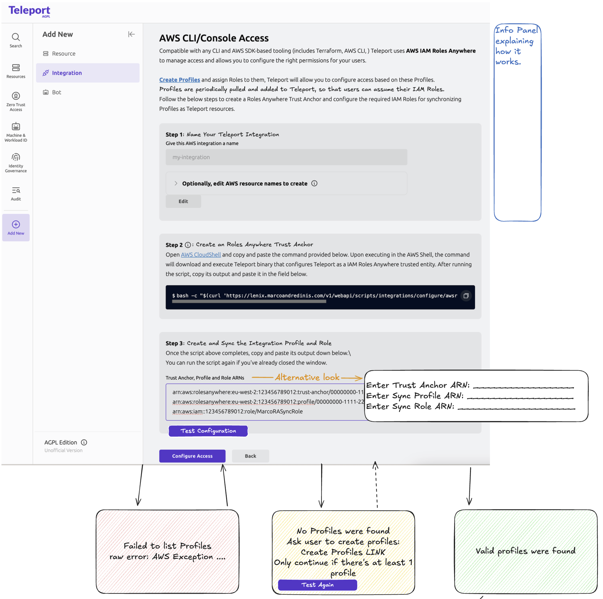
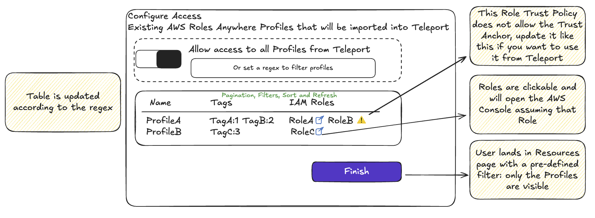

# RFD 0204 - AWS CLI Access with IAM Roles Anywhere

## Required approvers

- Engineering: @r0mant
- Product: @klizhentas

## What

Provide access to AWS using IAM Roles Anywhere.

## Why

You can manage and access AWS by running [Teleport App Service with access to AWS credentials](https://goteleport.com/docs/enroll-resources/application-access/cloud-apis/aws-console/) or using AWS OIDC credentials.

This makes it possible to provide different levels of AWS access with RBAC and leveraging features like Access Requests, Access Lists and identity locking.

Existing methods require Teleport to proxy requests between the end user and AWS.
This has the advantage of auditing those requests, however it has some disadvantages:

**API requests go through Teleport**

All data to those APIs must go through Teleport, increasing resource consumption of the cluster which might create a poor experience because of increased latency, stricter limits imposed by Teleport and/or slower network paths.
Example: [#12922](https://gravitational.zendesk.com/agent/tickets/12922).

**Non-compliant with standard AWS tooling**

Some AWS and 3rd party tools expect specific environment variables (eg. `AWS_ACCESS_KEY`) or configuration files (eg. `~/.aws/config`) to be set.

That is not the case with current implementation by Teleport.
Some example of issues reporting AWS access problems:
- [Some AWS tools don't work with Teleport](https://github.com/gravitational/teleport/issues/10441)
- [Aqua Tool Manager fails when using Teleport for AWS access](https://github.com/gravitational/teleport/issues/42341)
- [Unable to initialize a terraform module from an S3 location](https://github.com/gravitational/teleport/issues/28025)
- [Access to EKS Clusters using `kubectl` doesn't work](https://github.com/gravitational/teleport/issues/24608)
- [Access to EKS Clusters using `aws eks` doesn't work](https://github.com/gravitational/teleport/issues/33583)

Workarounds for those exist, but require manual steps to accommodate the way Teleport works.

There's even some features that are implemented with workarounds because of teleport's incompatibility:
- [DynamoCB database access](https://github.com/gravitational/teleport/issues/17842)
- [Forwarding assumed-role-sessions to agent (to work terraform that assume other roles)](https://github.com/gravitational/teleport/pull/20568)
- [Athena ODBC, JDBC support](https://github.com/gravitational/teleport/issues/8281)
- [Fix `aws ssm` calls when KMS encryption is enabled](https://github.com/gravitational/teleport/pull/50402)

**Complex setup when using an App Service/agent** which must be installed and managed in an EC2 instance with a proper IAM Profile.

**Requires publicly accessible proxy when using AWS OIDC Integration** because AWS must consume the public keys exposed in Teleport Proxy.

**Using IAM Roles Anywhere**, Teleport acts solely as a X.509 certificate issuer, ensuring a transparent and seamless experience by not depending on any Teleport resources or network paths for access.
It will be compatible with all AWS tooling by providing a [configuration profile](https://docs.aws.amazon.com/cli/latest/userguide/cli-configure-files.html) in `~/.aws/config`.

## Non goals

**Revoking certificates** is supported by IAM Roles Anywhere by using [`rolesanywhere.ImportCrl`](https://docs.aws.amazon.com/rolesanywhere/latest/APIReference/API_ImportCrl.html) API), but it is not feature we are considering for this RFD.
See related issue: [#51178](https://github.com/gravitational/teleport/issues/51178).

**Auditing** API calls to AWS is not considered, only new sessions are audited.
This is because API calls will not go through Teleport.
This can be improved later on by pulling logs from AWS CloudTrail.

**AWS resources discovery (EC2, EKS, RDS, ...)** using AWS Roles Anywhere is not currently being considered.

**AWS Identity Center and AWS External Audit Storage** could use the Roles Anywhere integration (instead of OIDC IdP), however that is currently not being considered.

**AWS IAM Resource-based policies** are [not supported](https://docs.aws.amazon.com/rolesanywhere/latest/userguide/security_iam_service-with-iam.html) by IAM Roles Anywhere.

## User stories

### End-user user stories

**As a Teleport end user, I want to list S3 buckets**

For new users, they need to login into teleport with `tsh login`.

They now need to fetch the credentials for accessing AWS, this is done using the following:
`tsh apps login --aws-role RoleRO-S3 my-awsra-integration`.

The user now runs `aws s3 ls` and they receive a list of buckets.

**As a Teleport end user, I have access to listing S3 buckets, but I want to elevate my permissions to be able to upload files**

To get access to another AWS IAM Role, user must be added to the Access List that allows assuming the target IAM Role.

After assuming the new access, they are able to send files using:
`aws s3 cp my-large-file.bin s3://bucket/my-large-file.bin`.

**As a Teleport end user, I want to use terraform to load a module from an S3 bucket**

After logging in with `tsh login`, the user requests local credentials for their AWS Role with:
`tsh apps login --aws-role RoleRO-S3 my-awsra-integration`.

They have the following terraform file
```terraform
module "module" {
  source = "https://bucket.s3.eu-west-2.amazonaws.com/myobject"
}
```

Running `terraform init` works as expected.

**As a Teleport Administrator, I want to add access to another AWS IAM Role**

AWS Admin must create another IAM Roles Anywhere Profile, and associate the AWS IAM Roles they wish to provide access to.

Those IAM Roles must have their Trust Relationship accept the Teleport Trust Anchor.

After adding them, a new Application appears in Teleport which can be given access to users, using existing RBAC system.

**As a Teleport Administrator, I want to provide access to my users using Teleport, but I've never configured Roles Anywhere**

When setting up access to AWS using Teleport, the Administrator is informed that Teleport uses Roles Anywhere Profiles as resources.

Given they haven't used Roles Anywhere before, they are asked to go to AWS Web Console and create the Profiles.
This is a pre-requirement to proceed with the integration set up.

When creating the Profiles, they will add the existing IAM Roles.
As a pre-requirement for adding the IAM Roles into Profiles, they must change the Trust Policy of each IAM Role so that it can be used by Roles Anywhere.

After doing this, they get back to Teleport and are allowed to complete the set up.

**As a Teleport Administrator, I want to give users of team "Dev" read-only access to AWS Account, and ability to request read-write access to it**

There are two Profiles, each with only one IAM Role:
- ReadOnlyAccess Profile with ReadOnlyAccess IAM Role
- and ReadWriteAccess Profile with ReadWriteAccess IAM Role

After setting up AWS Access, Teleport creates an Access List for each Profile, which only allows access to a single Profile (using `app_labels` for RBAC checks on the application, and `aws_role_arn` rule for AWS IAM Roles allowed to assume).

Users are added to the ReadOnlyAccess Profile, which ensures they get access to the ReadOnlyAccess IAM Role.

Administrator also creates a Teleport Role which allows access to the ReadWriteAccess Profile (using `app_labels` and `aws_role_arns`),
as well as another Role (RequestReadWriteAccess) which allows users to request access to role.

For longstanding access, users must be added to the Access List.

For temporary access, users must request access to the Teleport Role.

This way, "Dev" members can now access the ReadOnlyAccess but can also request access to the ReadWriteAccess using the permissions inherited by the RequestReadWriteAccess role.

**As a user, I want to be able to see what AWS roles are available to me and request access to a role I don't have long standing access to**

There is one Roles Anywhere Profile with one IAM Role: ReadWriteAccess.

After setting up the integration, a new Access List is created which allows for long standing access to members of that Access List.

The administrator creates two roles: one to give access to the user and another one to allow for the users to request access to the role.

When the user is assigned to the requester role, they can see that they can request access to ReadWriteAccess role.

After requesting access and being granted access, they can no start using the IAM Role for the duration.

## User experience

### Flow for: Enroll New Resource / AWS Access
We have the following AWS Integrations in Enroll New Integration screen:
- AWS External Audit Storage
- AWS Identity Center
- AWS OIDC Identity Provider

Adding another tile for "AWS Roles Anywhere" would create too many integrations and lead to users not knowing which one to chose.

Instead, the AWS OIDC Identity Provider should be removed, and only accessible from the Enroll New Resource tiles.

The Enroll New Resource/ AWS CLI/Web Console tile will lead the user to creating a new AWS Roles Anywhere integration (no integration selection will happen).

Other AWS related tiles (eg EC2 Auto Enrollment with SSM) will only be accessible using AWS OIDC integrations.


In the future we might add support for AWS Roles Anywhere for the remaining AWS related flows.

After clicking on adding a new AWS CLI/Web Console access, users can create a new AWS Roles Anywhere Integration.

#### Create new Roles Anywhere Integration screen

Setting up this integration consists on configuring AWS to trust Teleport.

Administrator goes into "Enroll new resource" page and selects the "AWS CLI/Web Console Access" tile.

A [summary of what IAM Roles Anywhere is](https://docs.aws.amazon.com/rolesanywhere/latest/userguide/introduction.html#first-time-user) and how Teleport uses it is displayed.



```
  Sync process                                                          
 ┌────────────────────────────────────────────┐ ┌────────────────┐      
 │ AWS                                        │ │ Teleport       │      
 │ ┌────────────────────────────────────────┐ │ │                │      
 │ │ AWS Account                            │ │ │ ┌────────────┐ │      
 │ │ ┌─────────────────┐ ┌────────────────┐ │ │ │ │App Service │ │      
 │ │ │ Region          │ │  IAM Roles     │ │ │ │ │ RA Profile1│ │      
 │ │ │┌─────────────┐  │ │ ┌───────────┐  │ │ │ │ │            │ │      
 │ │ ││ RA Profile1 ┼─┬┼─┼─►   Role1   │  │ │ │ │ │            │ │      
 │ │ │└─────────────┘ ││ │ └───────────┘  │ │ │ │ │            │ │      
 │ │ │                ││ │ ┌───────────┐  │ │ │ │ └────────────┘ │      
 │ │ │                └┼─┼─►   Role2   │  │ │ │ │ ┌────────────┐ │      
 │ │ │                 │ │ └───────────┘  │ │ │ │ │App Service │ │      
 │ │ │┌──────────────┐ │ │ ┌───────────┐  │ │ │ │ │ RA Profile2│ │      
 │ │ ││ RA Profile2  ┼─┼─┼─►   Role3   │  │ │ │ │ │            │ │      
 │ │ │└──────────────┘ │ │ └───────────┘  │ │ │ │ │            │ │      
 │ │ └─────────────────┘ └────────────────┘ │ │ │ └────────────┘ │      
 │ └────────────────────────────────────────┘ │ │                │      
 └────────────────────────────────────────────┘ └────────────────┘      
                                                                        
 Access flow                                                            
       ┌──────────────────────────┐             ┌────────────────┐      
       │ Teleport                 │             │  User          │      
       │                          │  App Login  │ ┌─────┐        │      
       │┌──────────┐Issues┌─────┐ ◄─────────────┼─┤ tsh │        │      
       ││ AWSRA-CA ┼──────►X.509│ │ Credentials │ │     │        │      
       │└────────▲─┘      └─────┘ ├─────────────┼─►     │        │      
       │         │                │             │ │     │        │      
       └─────────┼────────────────┘             │ └─▲──┬┘        │      
                 │                              │   │  │         │      
                 │                              │ ┌─┴──▼───────┐ │      
                 │                              │ │   aws cli  │ │      
                 │                              │ └──────┬─────┘ │      
                 │Trusts                        └────────┼───────┘      
                 │                                       │              
┌────────────────┼─────────────────────────────────┐     │              
│ AWS            │                                 │     │              
│ ┌──────────────┼───────────────────────────────┐ │     │Calls AWS APIs
│ │ AWS Account  │                               │ │     │              
│ │ ┌────────────┼──────────┐ ┌────────────────┐ │ │     │              
│ │ │ Region     │          │ │  IAM Roles     │ │ │     │              
│ │ │ ┌──────────┴───────┐  │ │                │ │ │     │              
│ │ │ │ RA Trust Anchor  │  │ │                │ │ ◄─────┘              
│ │ │ └──────────────────┘  │ │  ┌───────────┐ │ │ │                    
│ │ │                   ┌───┼─┼──►   Role1   │ │ │ │                    
│ │ │                   │   │ │  └───────────┘ │ │ │                    
│ │ │ ┌──────────────┐  │   │ │  ┌───────────┐ │ │ │                    
│ │ │ │ RA Profile1  ├──┴───┼─┼──►   Role2   │ │ │ │                    
│ │ │ └──────────────┘      │ │  └───────────┘ │ │ │                    
│ │ │                       │ │                │ │ │                    
│ │ │ ┌──────────────┐      │ │  ┌───────────┐ │ │ │                    
│ │ │ │ RA Profile2  ├──────┼─┼──►   Role3   │ │ │ │                    
│ │ │ └──────────────┘      │ │  └───────────┘ │ │ │                    
│ │ └───────────────────────┘ └────────────────┘ │ │                    
│ └──────────────────────────────────────────────┘ │                    
└──────────────────────────────────────────────────┘                    
```

##### How IAM Roles Anywhere work with Teleport

Teleport periodically syncs IAM Roles Anywhere Profiles as an Application resource into Teleport, which allows you to define RBAC policies on them.

##### RBAC
Re-using the Teleport Application resources gets us the following features out of the box:
- support for just-in-time Access Requests
- support for Access Lists

AWS Applications are created from a Profile, and the Profile Tags are mapped into Application Labels.
To grant access to a Profile, users must be allowed to access the Application using `app_labels`.

When accessing AWS using a Profile/Application, users must also have access to the IAM Role they want to assume.
AWS validates that only Profile's allowed Roles are accessible and Teleport validates that only `aws_role_arn` (either in traits or explicit in Teleport Roles) can assume that IAM Role.

In order to assume a given Role, it must be present on both:
- Profile's allowed IAM Roles
- Teleport's `aws_role_arn` list for the User.

As an example, assuming the following IAM Roles Anywhere Profile:
```yaml
name: ProfileA
tags:
  - Team: ABC
  - Env: Prod
roles:
  - MyRoleA
  - MyRoleB
```

A Teleport Application will be created with the following metadata:
```yaml
kind: app_server
metadata:
  labels:
    teleport.dev/aws-roles-anywhere-arn: arn:aws:rolesanywhere:eu-west-2:123456789012:profile/ac1f655b-aaaa-aaaa-aaaa-aaaaaaaaaaaa
    Team: ABC
    Env: Prod
  name: ProfileA
spec:
  app:
    kind: app
    metadata:
      labels:
          teleport.dev/aws-roles-anywhere-arn: arn:aws:rolesanywhere:eu-west-2:123456789012:profile/ac1f655b-aaaa-aaaa-aaaa-aaaaaaaaaaaa
          Team: ABC
          Env: Prod
      name: ProfileA
    spec:
      aws:
        roles_anywhere:
          profile_arn: arn:aws:rolesanywhere:eu-west-2:123456789012:profile/ac1f655b-aaaa-aaaa-aaaa-aaaaaaaaaaaa
          accept_role_session_name: true
      cloud: AWS
      integration: raa
      uri: https://console.aws.amazon.com
    version: v3
version: v3
```

##### New Resources
The following IAM resources must be be created in your AWS account.

**IAM Roles Anywhere Trust Anchor** that trusts Teleport's AWS Roles Anywhere Certificate Authority.
This ensures that IAM trusts Teleport as a Roles Anywhere certificate issues.\
This certificate can be found at `curl https://<proxy-url>/v1/webapi/auth/export?type=awsra` or `tctl auth export --type awsra`.

A new **IAM Role** which allows Teleport to query existing IAM Roles Anywhere Profiles, in order to sync them into Teleport.
This Role has a custom Trust Policy, as described in [AWS documentation](https://docs.aws.amazon.com/rolesanywhere/latest/userguide/).

The following policy is required:
- `rolesanywhere:ListProfiles` - used to fetch existing IAM Roles Anywhere Profiles
- `rolesanywhere:ListTagsForResource` - used to fetch the Profile tags
- `rolesanywhere:ImportCrl` - to be used in the future to revoke sessions
- `iam:GetRole` - used to create UserTasks when a given IAM Role's trust policy does not accept the Trust Anchor

A new **IAM Roles Anywhere Profile** is created, containing the IAM Role above.

They are presented with default values for IAM Role, IAM Roles Anywhere Trust Anchor and Profile names to be used, which they can customize.

After accepting the names, they are asked to run a set up script in CloudShell.
```
> bash $(curl https://tenant.teleport.sh/scripts/integration-setup-awsra.sh)
```



Users must now copy the resources ARN into teleport and test the connection (ie is teleport able to list profiles?).

A first poll is issued and the user can only proceed if they have at least one valid profile with at least one IAM Role assigned.

After this point, Teleport is able to sync IAM Roles Anywhere Profiles as Teleport AWS Application Access resources.

#### Configure Access screen

In this screen users are shown a list of Roles Anywhere Profiles, with a list of name, tags and IAM Roles.



If the IAM Role is not compatible with the teleport's trust anchor, then a warning icon appears and the user is informed how they can fix the issue.

This can happen, for example, when the IAM Role's Trust Policy has a condition statement that only accepts other Trust Anchor ARN.

Users can also decide whether they want to allow access to all Profiles from Teleport, or use a regular expression matcher against the Profile name.
By default, all Profiles are imported.

### Integration Dashboard
Teleport has a status page for viewing the AWS OIDC Integration status.

The dashboard must also support this new Integration.

The stats page will report the number of synced IAM Profiles.

Opening the details of the stats, will allow the user to access the Configure Access screen as described above.

User Tasks might also be created by the sync process and the following issue types will be reported:
- IAM Roles Anywhere Trust Anchor was removed
- Sync process has an invalid Roles Anywhere Profile and/or Role
- IAM Role used for the sync process does not have the valid permissions
- IAM Role associated with a profile does not accept the Trust Anchor ARN defined in the integration
- IAM Roles Anywhere Profile's Custom Role Session Name is disabled. In this scenario, the AWS Session Name will be the X.509 certificate serial number.

## Implementation

### AWS Roles Anywhere Integration

#### Set up
For setting up the integration, a script must be created that creates the AWS resources.

Here's a snippet of what it should look like.

```go
createTAResp, err := raClient.CreateTrustAnchor(ctx, &rolesanywhere.CreateTrustAnchorInput{
  Name: aws.String(fmt.Sprintf("Trust anchor for %s", clusterName)),
  Source: &rolesanywheretypes.Source{
    SourceData: &rolesanywheretypes.SourceDataMemberX509CertificateData{
      Value: "<AWSRA-CA>",
    },
    SourceType: rolesanywheretypes.TrustAnchorTypeCertificateBundle,
  },
})

trustPolicyJSON := trustPolicyForRolesAnywhereTrustAnchor(createTAResp)
_, err = iamClient.CreateRole(ctx, &iam.CreateRoleInput{
  RoleName:                 &roleName,
  AssumeRolePolicyDocument: &trustPolicyJSON,
})
// Call iam.PutRolePolicy allowing the following actions:
// - rolesanywhere:ListProfiles
// - rolesanywhere:ListTagsForResource
// - rolesanywhere:ImportCrl
// - iam:GetRole

_, err = raClient.CreateProfile(ctx, &rolesanywhere.CreateProfileInput{})
raClient.CreateProfile(ctx, &rolesanywhere.CreateProfileInput{
  Name:     aws.String(fmt.Sprintf("Sync Profiles to Teleport %s", clusterName)),
  RoleArns: []string{roleName},
})
```

#### Integration
A new integration sub-kind - `aws-ra` - must be created, which specifies the Trust Anchor ARN, which trusts Teleport CA, and a synchronization section that contains:
- IAM Roles Anywhere Profile ARN and IAM Role ARN used to fetch existing AWS Roles Anywhere Profiles
- profile filters selectively sync profiles (defaults to sync everything)

Format for the new integration subkind:
```yaml
kind: integration
sub_kind: aws-ra
version: v1
metadata:
  name: <integration-name>
spec:
  aws_ra:
    trust_anchor_arn: <trust anchor arn>
    sync:
      enabled: <true|false>
      profile_arn: <profile arn>
      role_arn: <role arn>
      profile_filter:
        regex_name: <regex for the name>          
status:
  aws_ra:
    sync:
      state: <running | error | disabled>
      last_sync: <timestamp>
      profiles_synced: <number of profiles synced into teleport>
      error_message: <error message when state is error>
```

An example of the full resource:
```yaml
kind: integration
sub_kind: aws-ra
version: v1
metadata:
  name: my-awsra-integration
spec:
  aws_ra:
    trust_anchor_arn: arn:aws:rolesanywhere:eu-west-2:123456789012:trust-anchor/edffbaaa-6900-4524-b043-17c9b869f84d
    sync:
      enabled: true
      profile_arn: arn:aws:rolesanywhere:eu-west-2:123456789012:profile/6778b17c-bb31-4c06-8c77-b773496094a3
      role_arn: arn:aws:iam::123456789012:role/role-for-rolesanywhere-listprofiles
      profile_filter:
        regex_name: ^TeleportProfiles.*$
status:
  aws_ra:
    sync:
      state: running
      last_sync: "2025-02-25T00:00:00Z"
      profiles_synced: 3
      error_message: null
```

#### Sync
The sync process fetches AWS IAM Roles Anywhere Profiles and converts them into Application Servers.
Example of an App Server:
```yaml
kind: app_server
metadata:
  name: awsra-my-profile
  labels:
    env: prod
spec:
  app:
    kind: app
    metadata:
      name: awsra-my-profile
      labels:
        env: prod
        teleport.dev/aws-roles-anywhere-arn: arn:aws:rolesanywhere:eu-west-2:123456789012:profile/6778b17c-bb31-4c06-8c77-b773496094a3
    spec:
      cloud: AWS
      integration: awsra-my-integration
      aws:
        roles_anywhere:
          profile_arn: arn:aws:rolesanywhere:eu-west-2:123456789012:profile/6778b17c-bb31-4c06-8c77-b773496094a3
          accept_role_session_name: true
```

Teleport must check if the Profile Roles are compatible with the Integration's Trust Anchor.
This is done using the `iam:GetRole` and checking its trust policy property:
```json
        "Condition": {
          "ArnEquals": {
            "aws:SourceArn": [
              "<TrustAnchorARN>"
            ]
          }
        }
```

### AWS Roles Anywhere Certificate Authority

AWS IAM Roles Anywhere requires a Trust Anchor, which is a certificate authority capable of issuing X.509 certificates.

#### Use an existing CA vs creating a new one
We have 3 options for which CA to use:
- re-use the SPIFFE CA
- re-use the AWS OIDC Integration CA
- create a new CA

**SPIFFE CA**

Using the SPIFFE CA has the UX advantage of requiring a single Trust Anchor for users that use AWS Access and Machine and Workload Identity.

However it requires exposer to non-human access primitives (ie, `workload_identity` resource) which is unnecessary context for someone only interested in AWS Access.

Another issue is that it requires more specific IAM Role Trust Policies.

Users can generate X.509 certificates for Workload Identity, but then use them to generate valid AWS Credentials by exchanging the certificate using `rolesanywhere.CreateSession`.

This allows them to circumvent RBAC policies defined for AWS App Access.

The fix for this would be to define a more specific IAM Role Trust Policy, one that would only allow a specific SPIFFE prefix path:
- Workload Identity SPIFFE paths (eg. `spiffe://<cluster-name>/svc/my-service`) are not allowed to start with `spiffe://<cluster-name>/_/` when being generated in the context of Workload Identity
- each IAM Role must include the following path prefix when generating the certificates for the AWS Access: `spiffe://<cluster-name>/_/aws-access/user/<user-name>`

The trust policy on the assumed roles must include this as a condition:
```json
{
    "Version": "2012-10-17",
    "Statement": [
      {
        "Effect": "Allow",
        "Principal": {
          "Service": "rolesanywhere.amazonaws.com"
        },
        "Action": [
          "sts:AssumeRole",
          "sts:TagSession",
          "sts:SetSourceIdentity"
        ],
        "Condition": {
          "ArnEquals": {
            "aws:SourceArn": [
              "arn:aws:rolesanywhere:<region>:<account>:trust-anchor/<trust-anchor-id>"
            ]
          },
          "StringLike": {
            "aws:PrincipalTag/x509SAN/URI": "spiffe://example.teleport.sh/_/aws-access/user/*"
          }
        }
      }
    ]
  }
```

This is an extra configuration that users must do, and it also exposes them to Machine and Workload Identity concepts: `spiffe` protocol/path.

**AWS OIDC Integration CA**

AWS OIDC Integration (see RFD 0119) already has a CA for providing AWS Access.

Its name is `oidc_idp` which can be confusing if we decide to use it as part of the Roles Anywhere access, because this is not an OIDC Identity Provider.

It's also not a true Certificate Authority, but instead a JWT signer.

An alias can be created and the `cert_authority` can be changed to have both the JWT signer and the TLS/X.509 certificate/keys.

**Create a new CA**

A new Certificate Authority will be created in Teleport to issue X.509 certificates, consumed by IAM Roles Anywhere.

This new CA is backed by a ECDSA key, according to our current recommended crypto suites (see RFD0136).

A single CA will be created per Teleport cluster.

**We decided to proceed with a new CA, given the trade-offs described above.**

#### CA certificate
When setting the trust anchor in AWS IAM Roles Anywhere, we'll add the new CA certificate.

This certificate must comply with the following:
- must be a X.509v3 certificate
- Basic Constraints must include `CA: true`
- the signing algorithm must include SHA256 or stronger
- key usage must include Certificate Sign, CRL Sign and Digital Signature

Including the CRL Sign is not required at this point, but this allows us to implement certificate revocation later on without the need to change the Trust Anchor.

[See more](https://docs.aws.amazon.com/rolesanywhere/latest/userguide/trust-model.html#signature-verification)

#### End entity certificates - X.509
When issuing X.509 certificates for users to access AWS, they must comply with the following:
- must be a X.509v3 certificate
- Basic Constraints must not include `CA` or its value must be false
- the signing algorithm must include SHA256 or stronger
- key usage must include Digital Signature

[See more](https://docs.aws.amazon.com/rolesanywhere/latest/userguide/trust-model.html#signature-verification)

Sessions generated from IAM Roles Anywhere certificates have their [Source Identity](https://docs.aws.amazon.com/IAM/latest/UserGuide/id_credentials_temp_control-access_monitor.html) set to the common name (CN) of the certificate's Subject.
Given its importance for auditing, this should contain the Teleport User name that requested the certificate.

During IAM policy evaluation, the following certificate fields are exposed and can be used to allow or deny the request:
- Subject fields as `PrincipalTag: aws:PrincipalTag/x509Subject/<field>` (eg CN maps to `PrincipalTag: aws:PrincipalTag/x509Subject/CN`)
- Issuer fields as `PrincipalTag: aws:PrincipalTag/x509Issuer/<field>`
- Subject Alternative Name (SAN) as `PrincipalTag: aws:PrincipalTag/x509SAN/<field>`

Of the above, only some of them will be set by Teleport:
- Subject Common Name: Teleport user that requested the access
- Issuer Common Name: Teleport cluster name
- Not After: this will be set based on the user's current session expiration

```
      Certificate:
      Data:
          Version: 3 (0x2)
          Serial Number:
              1f:71:c5:11:4a:11:9f:c0:cc:5a:5a:52:fb:37:20:ad
      Signature Algorithm: sha256WithRSAEncryption
          Issuer: CN=<TeleportClusterName>
          Validity
              Not Before: Apr 11 10:00:00 2025 GMT
              Not After : Apr 11 22:00:00 2025 GMT
          Subject: CN=<TeleportUsername>
```

### AWS Session creation
When a client tool (Web UI or `tsh`) asks for a new AWS Session, Teleport Auth Service will generate the certificate, call `rolesanywhere.CreateSession` and exchange the certificate for AWS credentials.

The call to [`rolesanywhere.CreateSession`](https://docs.aws.amazon.com/rolesanywhere/latest/userguide/authentication-create-session.html) is not explicit, but handled by the [rolesanywhere-credential-helper](https://github.com/aws/rolesanywhere-credential-helper) tool from AWS.

#### Session Duration
The `rolesanywhere.CreateSession` call accepts a `durationSeconds` which indicates for how long the AWS Session will be valid.
This duration, per AWS documentation, cannot be higher than 12 hours, nor less than 15 minutes.

When the Teleport User session is between 15 minutes and 12 hours, the AWS Session will have the same expiration.

When the Teleport User session is lower than 15 minutes, the user will receive an error and is asked to login again.
This is already the behavior on existing AWS Access flows. See [#46551](https://github.com/gravitational/teleport/issues/46551).

When the Teleport User session is higher than 12 hours, the AWS Session will be at most 12 hours.

#### Session name
In order to keep track of API calls in AWS CloudTrail, Roles Anywhere service sets the AWS Session Name when generating the credentials.

This identifier can be one of the following:
- X.509 serial number
- value of `roleSessionName` when calling `rolesanywhere.CreateSession`

While the latter is much more customizable and valuable, it requires that the IAM Roles Anywhere Profile's "Custom role session name" is enabled.
If this property is disabled, sending `roleSessionName` will return an `Access Denied` error.

During the Profile to AppServer sync process, this property (`accept_role_session_name`) will be stored to be used later on, when creating a session.

**Role Session Name**

This value will be the identity's username.

If the value is too long, it will be hashed (see `maybeHashRoleSessionName` method).

**X.509 serial number**

If using the serial number, a random value will be set.
In this scenario, in order to keep track of the user, the serial number must be part of the Teleport Audit event emitted when generating the certificate.

### AWS Roles requirements for usage with IAM Roles Anywhere
AWS IAM Roles must be accessible from Roles Anywhere service principal, which requires a [custom Trust Policy](https://docs.aws.amazon.com/rolesanywhere/latest/userguide/trust-model.html#trust-policy).

For IAM Roles to be accessible from IAM Roles Anywhere, they must have the following trust policy:
```json
{
    "Version": "2012-10-17",
    "Statement": [
      {
        "Effect": "Allow",
        "Principal": {
          "Service": "rolesanywhere.amazonaws.com"
        },
        "Action": [
          "sts:AssumeRole",
          "sts:TagSession",
          "sts:SetSourceIdentity"
        ],
        "Condition": {
          "ArnEquals": {
            "aws:SourceArn": [
              "arn:aws:rolesanywhere:<region>:<account>:trust-anchor/<trust-anchor-id>"
            ]
          }
        }
      }
    ]
  }
```

Note: The `Condition` section is optional, and will ensure only the referenced Trust Anchor can use this IAM Role.

### Integration with end user tools
Users will login using `tsh apps login --aws-role <Role ARN> <App Name>`.
This command does two things:
- fetches and stores the credentials into the application certificate stored under `~/.tsh/`
- modifies the `~/.aws/config` file to create/update the AWS configuration profile

The  [`~/.aws/config`](https://docs.aws.amazon.com/cli/latest/userguide/cli-configure-files.html) contains instructions on how to access AWS credentials locally, and is used by every aws cli and other aws-sdk-based tools.

If `AWS_CONFIG_FILE` is set, that's the file which `tsh` will modify.

The following entry is added (if it does not exist yet):
```conf
[profile <App Name>]
# Do not change. Managed by tsh.
credential_process = tsh apps config <App Name> --format aws-credential-process
```

Using `tsh` as the [`credential_process`](https://docs.aws.amazon.com/cli/latest/userguide/cli-configure-sourcing-external.html) ensures AWS API calls will call `tsh` for getting the credentials.

`tsh` must return a json document containing the credentials.
Its format should match the following specification:
```json
{
  "Version": 1,
  "AccessKeyId": "an AWS access key",
  "SecretAccessKey": "your AWS secret access key",
  "SessionToken": "the AWS session token for temporary credentials", 
  "Expiration": "ISO8601 timestamp when the credentials expire"
}
```

When the user logs out using `tsh logout`, all the profiles that use `credential_process = tsh apps config ...` will be removed from `~/.aws/config`.

#### AWS configuration profiles
Users are required to pass `--profile <profile>` or set the `AWS_PROFILE` environment variable to access AWS, which can be tedious.

Instead, users can set a default profile either editing the `~/.aws/config` or by passing the `--set-as-default-profile` when doing `tsh apps login`:
```conf
[default]
# Do not change. Managed by tsh.
credential_process = tsh apps config <App Name> --format aws-credential-process
```

Doing this, users no longer need to set the profile and will always use this AWS IAM Role and Roles Anywhere Profile protected by Teleport.

#### Credentials expiration
When local credentials to access Teleport expire, `tsh` will try to re-login the user.
However, `credential_process` will not output anything while the process is still running, making this re-login process stuck on asking for user input (ie, password).

In this case, `tsh` must immediately exit with a clear error message asking the user to re-login.

See more information about [`credential_process`](https://docs.aws.amazon.com/cli/latest/userguide/cli-configure-sourcing-external.html).

#### Per-session MFA
For set ups using per-session MFA, only the `tsh apps login` will require another authentication factor (eg, a yubikey tap).

All AWS API calls will happen without any interaction with the teleport cluster.

### Proto Specification
#### Generate AWS credentials
AWS Credentials will be returned to the user after they log in into an App (same flow as exists today), embedded in the certificate.
The following field will be added to the certificate:

```proto
// RouteToApp contains parameters for application access certificate requests.
message RouteToApp {
  // Name is the application name certificate is being requested for.
  string Name = 1 [(gogoproto.jsontag) = "name"];
  // AWSRoleARN is the AWS role to assume when accessing AWS API.
  string AWSRoleARN = 5 [(gogoproto.jsontag) = "aws_role_arn,omitempty"];
  // ...

  // AWSCredentialProcessCredentials contains the credentials to access AWS APIs.
  // This is a JSON string that conforms with credential_process format.
  string AWSCredentialProcessCredentials = 10 [(gogoproto.jsontag) = "aws_credentialprocess_credentials,omitempty"];
}
```

#### Changes to `App` resource
```proto
// AppSpecV3 is the AppV3 resource spec.
message AppSpecV3 {
  // AWS contains additional options for AWS applications.
  AppAWS AWS = 6;
  // ...
}

// AppAWS contains additional options for AWS applications.
message AppAWS {
  // ExternalID is the AWS External ID used when assuming roles in this app.
  string ExternalID = 1;

  // RolesAnywhere contains the IAM Roles Anywhere fields associated with this Application.
  AppAWSRolesAnywhere RolesAnywhere = 2;
}

// AppAWSRolesAnywhere contains the fields that represent an AWS Roles Anywhere Profile.
message AppAWSRolesAnywhere {
  // ProfileARN is the IAM Roles Anywhere Profile ARN that originated this AWS App.
  string ProfileARN = 1;

  // Whether this Roles Anywhere Profile accepts a custom role session name.
  // When not supported, the AWS Session Name will be the X.509 certificate's serial number.
  // When supported, the AWS Session Name will be the identity's username.
  bool AcceptsRoleSessionName = 2;
}
```

#### Changes to `Integration` resource
```proto
// IntegrationSpecV1 contains properties of all the supported integrations.
message IntegrationSpecV1 {
  oneof SubKindSpec {
    // AWSRA contains the specific fields to handle the AWS Roles Anywhere Integration subkind
    AWSRAIntegrationSpecV1 AWSRA = 1;
  }
}

// AWSRAIntegrationSpecV1 contains the spec properties for the AWS Roles Anywhere Integration subkind.
message AWSRAIntegrationSpecV1 {
  // TrustAnchorARN contains the AWS Roles Anywhere Trust Anchor ARN used to set up the Integration.
  string TrustAnchorARN = 1;

  // Sync is the configuration for syncing Roles Anywhere Profiles to Applications.
  AWSRASyncConfiguration Sync = 2;
}

// AWSRASyncConfiguration contains the configuration used to sync AWS Roles Anywhere Profiles as Applications.
message AWSRASyncConfiguration {
  // Enabled indicates whether the synchronization is enabled.
  bool Enabled = 1;

  // ProfileARN is the AWS Roles Anywhere Profile to be used to access AWS APIs.
  string ProfileARN = 2;

  // RoleARN is the AWS IAM Role to be used to access AWS APIs.
  string RoleARN = 3;

  // ProfileFilter contains filters to be applied to Profiles.
  // Only matching Profiles will be synced.
  // Logical OR is applied when multiple filters are present.
  // Empty list of filters ensures all Profiles are synchronized.
  AWSRAProfileFilter ProfileFilter = 4;
}

message AWSRAProfileFilter {
  // NameRegex indicates that the resource should be included when its name matches
  // the supplied regex.
  string name_regex = 1;
}
```

### Audit Events
The following events must be created:
- emit event when the sync process runs
- emit event when issuing a X.509 certificate

## Product Usage
The following metrics should be collected:
- number of integrations created
- number of successful/failed syncs
- number of X.509 certificates issued grouped by integration
- number of API calls
