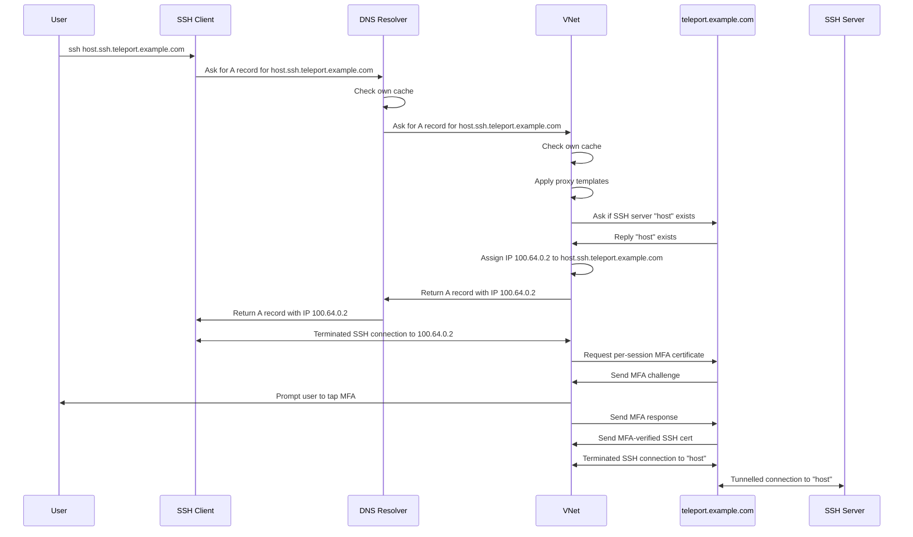

# RFD 207 - VNet SSH

## Required Approvers

* Engineering: @ravicious && (@zmb3 || @rosstimothy)
* Security: doyensec

## What

This document outlines the addition of native SSH support for [VNet](0163-vnet.md).
When VNet SSH is active, users will be able to use any third-party SSH client
to connect to Teleport hosts the same way they are used to connecting to hosts
on a local network by simply providing a username and hostname e.g.
`ssh user@hostname`.
VNet will resolve the DNS query to a local address on the virtual interface,
handle the incoming SSH connection, and forward it to the target Teleport node.
Advanced Teleport features like per-session MFA and hardware keys will be fully
supported.

Here's a demo with a proof-of-concept of the feature in action:
https://goteleport.zoom.us/clips/share/3xSvI4taSD6YgM1C0l12nQ

## Why

Users often prefer to use third-party SSH clients to connect to Teleport hosts.
These clients may be built into tools like VSCode or PuTTY or WinSCP.
Teleport currently offers partial support for third-party SSH clients with the
`tsh config` command which outputs an OpenSSH configuration file.
However, third-party SSH clients do not support advanced features including
per-session MFA or user hardware keys.

[Per-session MFA](https://goteleport.com/docs/admin-guides/access-controls/guides/per-session-mfa/)
requires the client to request and use a new SSH certificate for
each session, and the OpenSSH client does not know to request and use this
session certificate.
Even though the generated OpenSSH config uses a ProxyCommand that calls `tsh` to
dial the target SSH host, `tsh` can't handle per-session MFA here because the
third-party SSH client is still ultimately responsible for authenticating to the
host with the local SSH certificate from disk.

Third-party SSH clients are unable to use
[hardware keys](https://goteleport.com/docs/admin-guides/access-controls/guides/hardware-key-support/)
because `tsh` uses a custom file format to reference these keys, which
third-party clients won't recognize and won't be able to use for signatures.

VNet SSH will simplify access for third-party SSH clients by avoiding the need
for custom OpenSSH configuration.
The third-party clients will not need to use any SSH certificate, they will
connect directly to the local VNet process without any user authentication
required from the SSH client.
The VNet process will "terminate" the incoming SSH connection from the
third-party client, and dial an outbound SSH connection to the target SSH host,
then proxy the connection between the two.
VNet is able to authenticate the user out-of-band from the SSH connection by
prompting the user from Teleport Connect for any hardware key interactions or
re-logins necessary.
Because VNet will own the full SSH connection to the remote host, it can fully
support per-session MFA and hardware keys.

## Details

### UX

When VNet SSH is active, third-party SSH clients such as OpenSSH will be able
to connect to teleport SSH hosts at a URI matching
`<username>@<hostname>.ssh.<proxy-address>`.
For example, `ssh alice@node.ssh.teleport.example.com` will work to connect as
the SSH user `alice` to a host named `node` in the cluster
`teleport.example.com`.
If per-session MFA is required, Connect will prompt the user to tap their
hardware key.

VNet SSH will be enabled by default whenever the user runs VNet on their local
workstation.
The user will be able to start VNet the same way they do today, by enabling it
in Connect or running `tsh vnet`.

#### User story - VSCode remote development

Alice is a software engineer with an underpowered laptop and she wants to
compile and test her application on a more powerful machine.
She starts a large EC2 instance in her company AWS account for development.
Her company has an AMI that automatically joins the instance to their company
Teleport cluster, `teleport.example.com`.
The machine has the hostname `devbox`.

Alice opens Teleport Connect and sees `devbox` as an SSH server on the main
resources page.
Next to the usual "Connect" button on the SSH server card, she sees a new VNet
button.
She clicks the VNet button and two things happen:

1. Because Alice has not started VNet before, the VNet dropdown in the top left
   opens and displays the text:
   "Proxying connections to TCP apps and SSH servers in teleport.example.com"
2. A toast pops up in the bottom right and displays the text:
   "Connect with any SSH client to devbox.ssh.teleport.example.com (copied to clipboard)."

Alice has not tried VNet before so she goes to her terminal and tries
`ssh alice@devbox.ssh.teleport.example.com` and the connection works!
She has a shell on `devbox`, she can run all her normal commands, and all
Teleport features like session recording are working.

Alice prefers to develop and run her application in Visual Studio Code and she
knows it supports remote development so she decides to try connecting to
`devbox` in VSCode from her laptop.
She has Microsoft's official "Remote - SSH" extension installed in VSCode so she
goes to the command palette and selects "Remote-SSH: Connect to Host..." and
types in `ssh alice@devbox.ssh.teleport.example.com`.
VSCode successfully connects to the host and Alice is able to use all the normal
development workflows she is used to.

#### User story - Per-session MFA

Later, Alice's company enables per-session MFA for SSH connections in the
cluster.
The next time Alice tries to connect to `devbox` in VSCode, Connect steals focus
and prompts her to tap her security key to allow access to the server.
After she taps the security key, the connection succeeds.

VNet caches the MFA-verified SSH certificate for 1 minute so that VSCode can
start multiple connections to the host without additional prompts.
Alice doesn't get another MFA prompt until her Teleport session expires or she
closes and reopens the remote connection in VSCode.

#### User story - Failed authentication

Alice tries to connect to `devbox` with the SSH username `root` by running
`ssh root@devbox.ssh.teleport.example.com`.
However, her Teleport roles do not allow her to SSH as `root`.
She gets an error message from `ssh` on the CLI reading
`ERROR: access denied to root connecting to devbox`.

### Implementation

The purpose of VNet SSH is to simplify Teleport SSH connections with third-party
SSH clients as much as possible.
The goal is zero manual configuration steps for the user.
In order to support per-session MFA in this scenario, the third-party SSH
client cannot be required to use the Teleport user SSH certificate to terminate
the SSH connection with the target SSH server, because it simply does not have a
way to get the MFA-verified session certificate.

This means that the VNet process must be responsible for dialing the target SSH
server with the Teleport user certificate.
This is similar to the way VNet already handles TCP app access, it:

1. terminates the incoming TCP connection
1. gets a user certificate for the target app
1. TLS dials to the proxy address with the TLS client certificate
1. forwards the TCP stream between the incoming local connection and the dialed
   connection to the target app

For VNet SSH we will:

1. terminate the incoming SSH connection
1. use the user's SSH certificate or get a per-session MFA certificate if
   necessary
1. SSH dial to the target SSH server with the user SSH certificate
1. forward the full SSH connection between the incoming local connection and the
   dialed connection to the target SSH server

Forwarding a full SSH connection is slightly more complicated than forwarding a
simple TCP connection, we have to handle all SSH channels, global requests,
channel requests, etc.
Luckily golang.org/x/crypto/ssh provides all the necessary tools to do this, and
we already have an SSH forwarding server implemented in `lib/srv/forward/sshserver.go`.

#### DNS names

We have a lot of options in what we could potentially support for DNS
resolution of SSH hosts.
Things to consider are:

1. we want to keep queries for apps and SSH hosts fast
1. we don't want to have to handle all DNS queries on the local host, it's
   better to use scoped DNS "zones" so that we can continue to use split DNS
   configurations on the host so VNet doesn't have to handle non-Teleport
   queries
1. we'd prefer to avoid conflicting DNS names for SSH servers and apps and, in
   the future, other protocols like databases

We already support app access at subdomains of the proxy public address or any
custom DNS zone configured in the `vnet_config` resource.
I propose we support the same DNS zones for SSH access, but include a subdomain
of `ssh` before the zone suffix. For example, we will support:

- `<hostname>.ssh.<proxy public addr>`
- `<hostname>.ssh.<custom dns zone>`

Including the `ssh` subdomain has two benefits:

1. If the `ssh` subdomain is present in an incoming DNS query, we only have to
   search for SSH servers with that hostname, we don't have to search for apps.
1. DNS names for SSH servers will not conflict with DNS names for apps with a
   matching name.

#### Trusted host key

For VNet to terminate the incoming SSH connection from the SSH client it needs
to use an SSH host certificate, and that host cert needs to be trusted by the client.

When VNet is started it will generate an Ed25519 keypair to use as a certificate
authority (CA).
The CA key will be used only for the lifetime of the current VNet process, every
time VNet starts a brand new CA key will be used.
This is to avoid the need to persist the private key anywhere.
The private key will remain in memory and never be written to disk, so that it
cannot be found and used by another process.

For each new connection to a unique hostname, the CA will be used to sign a new
host certificate matching the hostname.
The host certificate and key will be used to terminate the incoming SSH
connection.

In order for third-party SSH clients to trust this CA, VNet will add an
entry to ~/.ssh/known-hosts with its own CA public key.
The entry will be valid for all DNS zones that VNet is serving, this includes
`*.ssh.<proxy public addr>` and `*.ssh.<custom dns zone>` for all clusters the
user is currently logged-in to, see [DNS names](#dns-names).
For a user logged in to `teleport.example.com` and `teleport2.example.com` with
custom DNS zone `example.internal`, the entry would look like:

```
@cert-authority *.ssh.teleport.example.com,*.ssh.teleport2.example.com,*.ssh.example.internal ssh-ed25519 AAAAC3NzaC1lZDI1NTE5AAAAIHK1sKZTW6njOZXK7mhpS7h6Hre/uKmE/UfLD1mQGTiR type=host # Teleport VNet
```

Because the user may log in or out of clusters and new DNS zones may be added,
this line may need to be updated during the lifetime of the VNet process.
To handle this, VNet will check for this entry each time it successfully
resolves a DNS query for an SSH server.
If it is missing or does not contain an entry that matches the current query, it
will update the entry.

The trailing comment `# Teleport VNet` is used so that VNet can reference and
update a single line in the `known_hosts` file.
Before shutdown, VNet will delete the entry.
If the process is killed without being able to delete the entry, it will be
overwritten the next time VNet starts, this should not cause any problems.

#### Search domains

One possibility to shorten the DNS names for SSH hosts, e.g. so the user
could type `ssh <user>@<hostname>` instead of `<user>@<hostname>.ssh.<proxy address>`,
would be to configure a DNS [search domain](https://en.wikipedia.org/wiki/Search_domain)
in the host OS.
For example, if your proxy address is `teleport.example.com` you could configure
a search domain for `ssh.teleport.example.com.`.
The OS DNS resolver will then reference that search domain whenever it receives
a query for a DNS name that is not fully-qualified (does not end with a `.`).
So if the user types `ssh user@hostname`, the OS DNS resolver would
fully-qualify that to `hostname.ssh.teleport.example.com`, which is the query
that would be sent to the VNet DNS nameserver, and everything should work.

This is something we could potentially configure automatically for the user, but
I think it might be likely to conflict with many corporate internal network
search domains, so I don't plan to implement this in VNet.
Another downside to this approach is that VNet would probably receive queries
for almost all DNS queries on the host, because users usually don't fully-qualify their
domain names.
E.g. if the user tries to look up `google.com` VNet would get a DNS query for
`google.com.ssh.teleport.example.com.`.
When the VNet name lookup fails the OS resolver should properly handle the
lookup for `google.com.`, but it may slow things down and add unnecessary load to
the VNet process which may also generate queries to the cluster.

#### DNS resolution

When the VNet process receives a DNS query for `<hostname>.ssh.<namespace>`,
this is how it will be resolved:

1. If it has already resolved this name and assigned a VNet IP address for the
   host, it will return the assigned IP address.
1. If the name matches `*.ssh.<proxy-address>` or `*.ssh.<custom-dns-zone>`:
   1. VNet will determine which clusters the proxy address or custom DNS zone
      matches. If none, the DNS request is forwarded upstream.
   1. VNet will apply any matching proxy templates found in the user's
      `TELEPORT_HOME`.
   1. VNet will query each matching cluster to see if any SSH servers have a
      matching SSH server using the `ResolveSSHTarget` rpc.
   1. If a match is found a free IP will be assigned to that SSH server and it
      will be returned in an authoritative DNS answer.
   1. If no matching server is found VNet will respond with `NXDOMAIN`.

#### Connection forwarding

Here is a sequence diagram for an example VNet SSH session with per-session MFA:



### Security

The point of VNet is to allow applications running on the local host to connect
to Teleport resources transparently, without needing to configure a Teleport
user certificate.
It has a similar security model to a VPN, once the user securely logs in to
Teleport on their host, all applications on the host can connect to their
Teleport resources.
Where Teleport improves upon the VPN security model here is with per-session
MFA.
When per-session MFA is enabled for SSH access in the cluster, the user will
have to tap their MFA device every time they start a new SSH session to a
server.

#### Authentication

VNet will effectively run an in-process SSH server to terminate incoming SSH
connections and forward them to the target host.
This SSH server will *not* require any client authentication, as mentioned above
the point of VNet is to allow transparent access to Teleport resources by any
application running on the local host where the user has logged in.

The VNet in-process SSH server will set
[`ssh.ServerConfig.NoClientAuth`](https://pkg.go.dev/golang.org/x/crypto/ssh#ServerConfig)
to `true` to disable client authentication.
However, it will also set `ssh.ServerConfig.NoClientAuthCallback`.
In this callback is where it will attempt to dial the target server with the
requested username, and complete the per-session MFA ceremony if necessary.
By doing this in the callback we can return an authentication error to the user
if they fail to authenticate to the target server.

### Privacy

VNet is a purely client-side feature and there are not any new privacy concerns
introduced here.
Outside of the user's machine, VNet connections will appear identical to
`tsh ssh` connections.

### Proto Specification

TODO: add protos necessary for Windows where VNet communicates with Connect over
gRPC.

### Backward Compatibility

As a brand new feature, there are not many backward compatibility concerns.
If a user happens to have a TCP app named `ssh`, connections will still work.
Only queries for `*.ssh` will be used for SSH access.

### Audit Events

There will be no new audit events, the existing session events and session
recordings will be supported.

### Observability

Usage will be observable via telemetry, see [Product Usage](#product-usage).

### Product Usage

Connect reports `connect.protocol.use` events and VNet already reports these for
app access, we will do the same for SSH access.
Each new connection to an SSH server through VNet will be reported.

### Test Plan

The test plan will be updated to cover SSH connections via VNet with:

1. node recording mode
1. proxy recording mode
1. proxy templates
1. trusted clusters

We should test that SSH connections work and that sessions are properly
recorded.
