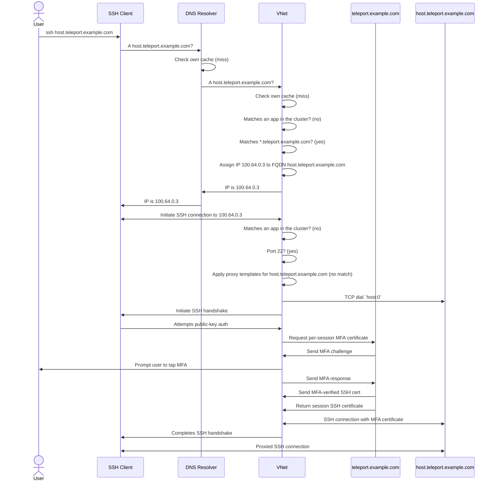

# RFD 207 - VNet SSH

## Required Approvers

* Engineering: @espadolini && @rosstimothy
* Security: doyensec
* Product: @klizhentas

## What

This document outlines the addition of native SSH support for [VNet](0163-vnet.md).
When VNet SSH is active, users will be able to use third-party SSH clients
to connect to Teleport hosts the same way they are used to connecting to hosts
on a local network by simply providing a username and hostname e.g.
`ssh user@hostname`.
VNet will resolve the DNS query to a local address on the virtual interface,
handle the incoming SSH connection, and forward it to the target Teleport node.
Advanced Teleport features like per-session MFA and hardware keys will be fully
supported.

Here's a demo with a proof-of-concept of the feature in action:
https://goteleport.zoom.us/clips/share/3xSvI4taSD6YgM1C0l12nQ

## Why

Users often prefer to use third-party SSH clients to connect to Teleport hosts.
These clients may be built into or called by tools like VSCode or ansible.
Teleport currently offers partial support for third-party SSH clients with the
`tsh config` command which outputs an OpenSSH configuration file.
However, third-party SSH clients do not support advanced features including
per-session MFA or user hardware keys.

[Per-session MFA](https://goteleport.com/docs/admin-guides/access-controls/guides/per-session-mfa/)
requires the client to request and use a new SSH certificate for
each session, and the OpenSSH client does not know to request and use this
session certificate.
Even though the generated OpenSSH config uses a ProxyCommand that calls `tsh` to
dial the target SSH host, `tsh` can't handle per-session MFA here because the
third-party SSH client is still ultimately responsible for authenticating to the
host with the local SSH certificate from disk.

Third-party SSH clients are unable to use
[hardware keys](https://goteleport.com/docs/admin-guides/access-controls/guides/hardware-key-support/)
because `tsh` uses a custom file format to reference these keys, which
third-party clients won't recognize and won't be able to use for signatures.

VNet SSH will automate all configuration steps to make SSH connections to
Teleport servers simple and transparent while supporting advanced Teleport
features that our users are accustomed to.

## Details

### UX

When VNet SSH is active, third-party SSH clients such as OpenSSH will be able
to connect to Teleport SSH hosts at a URI matching
`<username>@<hostname>.<cluster name>`.
For example, `ssh alice@node.teleport.example.com` will work to connect as
the SSH user `alice` to a host named `node` in the cluster `teleport.example.com`.
If per-session MFA is required, Connect will prompt the user to tap their
hardware key.

#### User story - VSCode remote development

Alice is a software engineer with an underpowered laptop and she wants to
compile and test her application on a more powerful machine.
She starts a large EC2 instance in her company AWS account for development.
Her company has an AMI that automatically joins the instance to their company
Teleport cluster, `teleport.example.com`.
The machine has the hostname `devbox`.

Alice opens Teleport Connect and sees `devbox` as an SSH server on the main
resources page.
Next to the usual "Connect" dropdown on the SSH server card, she sees a new
three-dots menu button.
She clicks the menu button and there is a single option "Connect with VNet".
She clicks the "Connect with VNet" button and a few things happen:

1. Because Alice has not started VNet before, VNet starts for the first time.
1. The VNet panel in the top left opens and displays:
   > 🟢 Proxying TCP connections to teleport.example.com<br>
   > 🔴 VNet SSH is not configured<br>
   > Open Status Page
1. A toast pops up in the bottom right and displays:
   "VNet SSH is not configured, click here (link) to enable VNet SSH"

Clicking either the "Open Status Page" button in the VNet panel or the link
in the toast both open a new VNet Status tab in Connect.
This tab will include the existing VNet diagnostic report, and a new section at
the top on the status of VNet SSH.

The SSH section in the VNet Status page will display:

> VNet SSH lets any SSH client connect to Teleport SSH servers.<br>
> To enable VNet SSH, Connect can automatically add an include directive
> to `~/.ssh/config`.
>
> Configure VNet SSH (button)

Alice clicks the "Configure VNet SSH" button and the VNet Status page refreshes to
display:

> VNet SSH lets any SSH client connect to Teleport SSH servers.<br>
> VNet SSH is enabled, configuration options are present in `~/.ssh/config`.

Alice closes the VNet Status page to return to the Resources page.
She finds her `devbox` server and clicks the menu button and then the
"Connect with VNet" button again.
This time, a toast pops up in the bottom right and displays:

> Connect with any SSH client to `devbox.teleport.example.com` (copied to clipboard)

Alice has not tried VNet before so she goes to her terminal and tries
`ssh alice@devbox.teleport.example.com` and the connection works!
She has a shell on `devbox`, she can run all her normal commands, and all
Teleport features like session recording are working.

Alice prefers to develop and run her application in Visual Studio Code and she
knows it supports remote development so she decides to try connecting to
`devbox` in VSCode from her laptop.
She has Microsoft's official "Remote - SSH" extension installed in VSCode so she
goes to the command palette and selects "Remote-SSH: Connect to Host..." and
types in `ssh alice@devbox.teleport.example.com`.
VSCode successfully connects to the host and Alice is able to use all the normal
development workflows she is used to.

#### User story - Per-session MFA

Later, Alice's company enables per-session MFA for SSH connections in the
cluster.
The next time Alice tries to connect to `devbox` in VSCode, Connect steals focus
and prompts her to tap her security key to allow access to the server.
After she taps the security key, the connection succeeds.

VNet caches the MFA-verified SSH certificate for 1 minute so that VSCode can
start multiple connections to the host without additional prompts.
Alice doesn't get another MFA prompt until her Teleport session expires or she
closes and reopens the remote connection in VSCode.

#### User story - Failed authentication

Alice tries to connect to `devbox` with the SSH username `root` by running
`ssh root@devbox.teleport.example.com`.
However, her Teleport roles do not allow her to SSH as `root`.
She gets an error message from `ssh` on the CLI reading

```
ERROR: access denied to root connecting to devbox
root@devbox: Permission denied (publickey).
```

In this example the first line of the error will be sent as an SSH banner sent
by VNet which should be displayed by CLI clients, the second line is OpenSSH's
default error message when authentication fails.

### Implementation

The purpose of VNet SSH is to simplify Teleport SSH connections with third-party
SSH clients as much as possible.
In order to support per-session MFA in this scenario, the third-party SSH
client cannot be required to use the Teleport user SSH certificate to terminate
the SSH connection with the target SSH server, because it simply does not have a
way to get the MFA-verified session certificate.

This means that the VNet process must be responsible for dialing the target SSH
server with the Teleport user certificate.
This is similar to the way VNet already handles TCP app access, it:

1. terminates the incoming TCP connection
1. gets a user certificate for the target app
1. TLS dials to the proxy address with the TLS client certificate
1. forwards the TCP stream between the incoming local connection and the dialed
   connection to the target app

For VNet SSH we will:

1. terminate the incoming SSH connection
1. use the user's SSH certificate or get a per-session MFA certificate if
   necessary
1. SSH dial to the target SSH server with the user SSH certificate
1. forward the full SSH connection between the incoming local connection and the
   dialed connection to the target SSH server

Forwarding a full SSH connection is slightly more complicated than forwarding a
simple TCP connection, we have to handle all SSH channels, global requests,
channel requests, etc.
Luckily golang.org/x/crypto/ssh provides all the necessary tools to do this, and
we already have an SSH forwarding server implemented in `lib/srv/forward/sshserver.go`.

#### DNS names

VNet SSH will support SSH connections to DNS names matching any of the following:

- `<hostname>.<cluster name>`
- `<hostname>.<leaf cluster name>.<root cluster name>`
- `<host ID>.<cluster name>`
- `<host ID>.<leaf cluster name>.<root cluster name>`

These are the same patterns supported by our existing OpenSSH client
integration, which will offer a seamless transition for users switching to VNet SSH
https://goteleport.com/docs/enroll-resources/server-access/openssh/openssh-agentless/#step-23-generate-an-ssh-client-configuration

If users prefer to use a shorter name to connect to SSH hosts, they can add
a `CanonicalDomains` option to their `~/.ssh/config` file, e.g.

```
CanonicalizeHostname yes
CanonicalDomains teleport.example.com
CanonicalizeMaxDots 0
```

This would cause SSH client calls like `ssh user@host` to be canonicalized to
`ssh user@host.teleport.example.com`, and VNet would get a DNS query for
`host.teleport.example.com.` which it could handle and resolve to the correct
cluster.

#### SSH client configuration

When the user opts to enable VNet SSH in Connect, VNet will add a single
`Include` directive to `~/.ssh/config`:

```
Include "/Users/nic/Library/Application Support/tsh/vnet_ssh_config"
```

The actual path here will be set to `$TELEPORT_HOME/vnet_ssh_config`, it will
differ on other platforms.
If the user runs `tsh vnet` instead of Connect, we won't add anything to
`~/.ssh/config` but the user can add the include directive on their own.

`vnet_ssh_config` will include the following:

```
Host *.teleport.example.com *.leaf.teleport.example.com
    IdentityFile "/Users/nic/Library/Application Support/tsh/id_vnet"
    GlobalKnownHostsFile "/Users/nic/Library/Application Support/tsh/vnet_known_hosts"
    UserKnownHostsFile /dev/null
    StrictHostKeyChecking yes
    IdentitiesOnly yes
```

This configures a custom identity and known hosts file for all Teleport SSH hosts.
It will use wildcards to match Teleport cluster names of all root and leaf clusters
in all profiles found in `$TELEPORT_HOME`.
VNet will update the file at a regular interval if the set of clusters changes.
The default interval VNet will check if the set of clusters has changed will be
30 seconds, but it may be updated early if Connect can signal VNet that the user
has logged into or out of a new profile.

`id_vnet` will be an Ed25519 private key that the client will use to make
connections to VNet.
VNet will generate this key if it does not exist.
VNet will trust the corresponding public key `id_vnet.pub` for incoming SSH
connections.

`vnet_known_hosts` will contain a single `cert-authority` entry
with a wildcard match.
Each time VNet SSH starts it will generate a new Ed25519 key to use as this host
CA and write the public key to this file.
The corresponding private key will remain in memory and never be written to disk.
The SSH client will trust this CA for all connections it makes to VNet.
The contents will look like:

```
@cert-authority * ssh-ed25519 AAAAC3NzaC1lZDI1NTE5AAAAIHK1sKZTW6njOZXK7mhpS7h6Hre/uKmE/UfLD1mQGTiR type=host
```

For VNet to terminate the incoming SSH connection from the SSH client it will
present an SSH host certificate generated on the fly signed by the VNet SSH CA.

This configuration should be compatible with OpenSSH clients, any clients or
integrations that call out to the OpenSSH client, and any other clients that
parse `~/.ssh/config`.
It is intentionally as simple as possible, the only required settings are
`IdentityFile` and `GlobalKnownHostsFile`, to maximize the probability that
other SSH client tools will be able to handle it.
It will not support PuTTY or WinSCP, or other clients that do not read
`~/.ssh/config`.
We can consider adding native support for PuTTY in a future release by
implementing something similar to `tsh puttyconfig`.

Note: we use `GlobalKnownHostsFile` instead of `UserKnownHostsFile` so that
openssh will not automatically add entries to it.

#### DNS resolution

When the VNet process receives a DNS query this is how it will be resolved:

1. If it has already resolved this name and assigned a VNet IP address, it will
   return the cached IP address.
1. An app lookup will run first
   1. If the FQDN matches a TCP app an IP will be assigned for that app and
      returned (as it works today).
   1. If it matches a web app the DNS request will be forwarded to upstream DNS
      servers (this is also as it implicitly works today, now we'll do it
      explicitly to skip assigning a VNet IP for web apps).
1. If the name does not match `*.<cluster name>` or
   `*.<leaf cluster name>.<root cluster name>` for any profile, the request will
   be forwarded to upstream DNS servers.
1. VNet will assign a free IP address to the FQDN, but at this point it will not
   know if this IP will later resolve to an SSH host or an app or neither.
1. VNet will return the IP address in an authoritative DNS answer.

#### Connection forwarding

When the VNet process receives a TCP connection at an address that has been
assigned to an FQDN but does not yet know if there is a matching app or SSH host:
1. An app lookup will run first in case an app has been added since the DNS
   query that assigned this IP.
   If the queried FQDN matches a TCP app then the IP will be permanently
   assigned to that app and regular TCP app forwarding will take over. This
   matches the current VNet behavior where TCP app matches are permanent.
1. If the dialed port matches the proxy web port this may be an attempt to
   access a web app. The handler will proxy the connection directly to the
   web proxy address so that web app access works.
1. If the dialed port is not `22` this will not be treated as an SSH connection
   attempt and the TCP connection will be rejected.
1. The initial dial target for an FQDN matching `<hostname>.<cluster>` will be
   set to `<hostname>:0`.
1. VNet will apply any proxy templates found in the user's `TELEPORT_HOME` to
   the FQDN.
   1. If the proxy template matched and `query` or `search` parameters were
      set, VNet will search for matching hosts in the cluster. If a single match
      is found, the SSH dial target will be set to the UUID of the node.
      Else, an error will be reported to the user.
   1. If the proxy template set an alternate `host:port`, the dial target will
      be set to that.
   1. Dial targets modified by proxy templates will be cached for 1 minute.
1. VNet will attempt to dial the target host and get a TCP connection using
   [client.DialHost](https://github.com/gravitational/teleport/blob/9c520834d8c952c484d9e654149d89a5d4fdaa8b/api/client/proxy/client.go#L430).
   If this fails the incoming TCP connection will be rejected.
1. At this point the TCP dial to the host succeeded, we know there is a matching
   SSH host, VNet will permanently skip expensive app queries at this IP address and
   attempt SSH connections only, until it restarts.
1. VNet will now accept the incoming TCP connection and initiate an SSH
   handshake with the client.
1. VNet will set `ssh.ServerConfig.PublicKeyCallback` to a function that:
   1. Validates that the user public key matches `id_vnet.pub` mentioned in [SSH client configuration](#ssh-client-configuration)
   1. Attempts an SSH connection to the target with and without session MFA. If
      both fail, we send an auth banner message to the client with an error
      message and return an error to x/crypto/ssh. This is done in `PublicKeyCallback`
      so that authentication failures to the target are returned as
      authentication failures to the client rather than completing the SSH
      handshake from the client successfully and then closing it.
1. If both SSH handshakes succeed we now have a connection to the client and to
   the target, VNet will now proxy all SSH requests and channels between the two
   connections until either side closes the connection or there is a fatal error.

Here is a sequence diagram for an example VNet SSH session with per-session MFA:



### Security

VNet SSH will be implemented purely client-side, so all existing Teleport
security measures will apply to VNet SSH connections.
The security model is effectively equivalent to our existing OpenSSH client
support, but now allows the cluster to require hardware keys and/or per-session
MFA.

### Privacy

VNet is a purely client-side feature and there are not any new privacy concerns
introduced here.
Outside of the user's machine, VNet connections will appear identical to
`tsh ssh` connections.

### Proto Specification

There will be new protos for the VNet service -> client application (tshd)
service, details TBD.

### Backward Compatibility

If the user's `~/.ssh/config` file has existing Teleport configuration blocks,
VNet will not overwrite them without explicit confirmation from the user.

### Audit Events

There will be no new audit events, the existing session events and session
recordings will be supported.

### Observability

Usage will be observable via telemetry, see [Product Usage](#product-usage).

### Product Usage

Connect reports `connect.protocol.use` events and VNet already reports these for
app access, we will do the same for SSH access.
Each new connection to an SSH server through VNet will be reported.

### Test Plan

The test plan will be updated to cover SSH connections via VNet with:

1. node recording mode
1. proxy recording mode
1. proxy templates
1. trusted clusters
1. hardware keys
1. TCP port forwarding
1. X11 forwarding
1. Access requests

We should test that SSH connections work and that sessions are properly
recorded.
