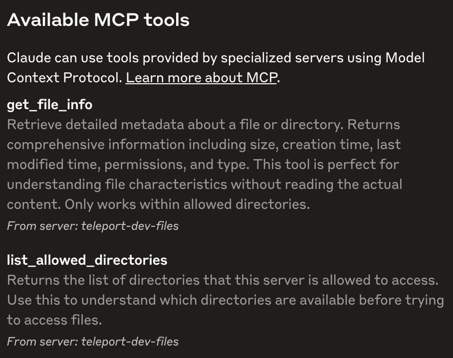
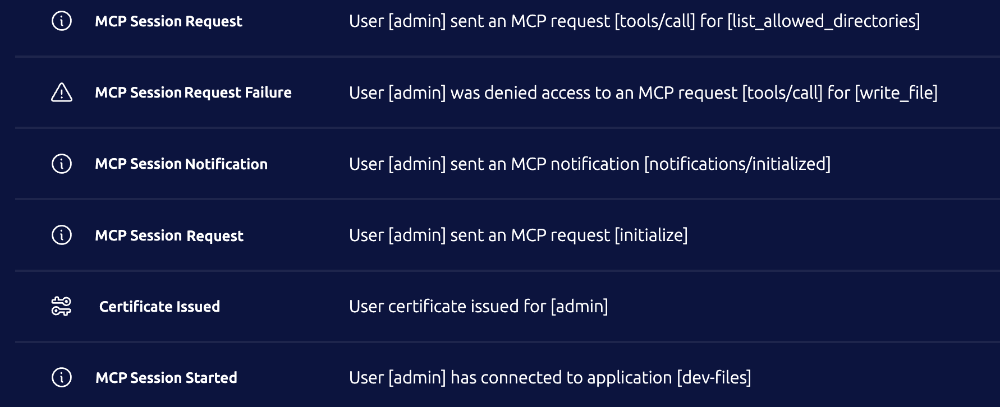
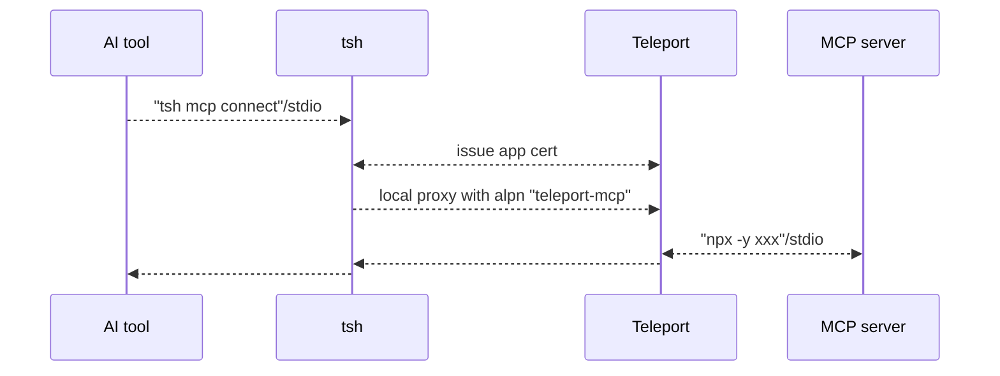
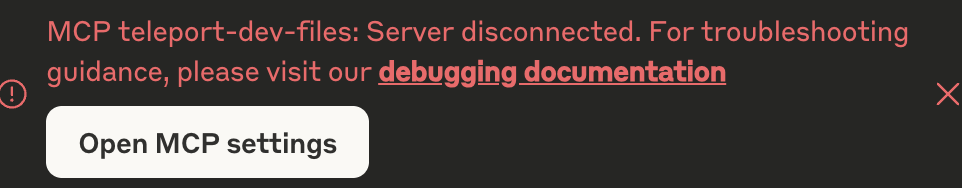

# RFD 0209 - MCP Access

## Required Approvers

* Engineering: @r0mant
* Product: @klizhentas

## What

Support zero-trust access for MCP servers.

## Why

Introduced in late 2024, Anthropic’s [Model Context Protocol
(MCP)](https://modelcontextprotocol.io/introduction) is a widely adopted,
open-source standard that enables language models to seamlessly interact with
external tools and data, enhancing their contextual capabilities.

However, MCP servers today are mostly operated locally without secure transport
or authorization. OAuth authorization was recently added to the specification,
but as of the time of writing, it is still new and not widely adopted.

With Teleport's support for MCP servers, users can:
- Access MCP servers on remote machines where transport is secured with TLS
- Control access to specific MCP servers and specific tools defined by Teleport roles
- Track activity through Teleport's audit log

## Scope

Teleport will support stdio-based MCP servers in the initial implementation,
with [streamable
HTTP](https://modelcontextprotocol.io/specification/2025-03-26/basic/transports#streamable-http))
and
[OAuth](https://modelcontextprotocol.io/specification/2025-03-26/basic/authorization)
support planned for future iterations (see the "Future development" section for
details).

## Details

To expedite the initial rollout, the first iteration will focus on adding MCP
protocol support for Application Access, similar to existing HTTP and TCP
applications.

### UX

#### editor - configure a filesystem MCP server and define RBAC
To configure a [filesystem MCP
server](https://github.com/modelcontextprotocol/servers/tree/main/src/filesystem)
with `npx` and a [Slack API MCP
server](https://github.com/modelcontextprotocol/servers/tree/main/src/slack)
with `docker` via Teleport App service:
```yaml
app_service:
  enabled: true
  apps:
  - name: "dev-files"
    description: "Shared files for developers"
    labels:
      env: "dev"
    mcp:
      # Command and arguments to launch a stdio-based MCP server per client connection
      # on the Teleport service host.
      command: "npx"
      args: ["-y", "@modelcontextprotocol/server-filesystem", "/home/dev/files"]
      # Specifies the local user account under which the command will be executed.
      # Required for stdio-based MCP servers.
      run_as_local_user: "dev"
      # (Optional) Specifies the OS signal to send for gracefully stopping the
      # process. Defaults to 0x2 (SIGINT) as it is a common signal for stopping
      # programs listening on stdin. Signal 0x9 (SIGKILL) is sent automatically after
      # 10 seconds if the process has not exited.
      stop_signal: 0x2

  - name: "dev-slack-api"
    description: "Slack API to dev channels"
    labels:
      env: "dev"
    mcp:
      # Recommend containers for launching stdio-based MCP servers. Use an env file
      # for passing secrets.
      command: "docker"
      args: ["run", "--rm", "--env-file", "/etc/teleport/dev_slack_api_env.list", "-i", "mcp/slack"]
      run_as_local_user: "docker"
```

To create a Teleport role for developers that can access only dev MCP servers,
have read-only filesystem access, and no permission to post Slack messages:
```yaml
kind: role
version: v8
metadata:
  name: dev
spec:
  allow:
    # Labels of the MCP servers to allow access to.
    app_labels:
      "env": "dev"
    mcp:
      # The name of the MCP tools to allow access to.
      # The wildcard character '*' matches any sequence of characters.
      # If the value begins with '^' and ends with '$', it is treated as a regular expression.
      # This value field also supports variable interpolation.
      # No tools are allowed if not specified.
      tools:
      - search_files
      - ^(read|list|get)_.*$
      - slack_*
      - "{{internal.mcp_tools}}"
      - "{{external.mcp_tools}}"

  deny:
    mcp:
      # The name of the MCP tools to deny access to.
      # No tools are denied if not specified.
      # The deny rules always override allow rules.
      tools:
      - slack_post_message
```

To create a role for admins that have full access to MCP servers and tools:
```yaml
kind: role
version: v8
metadata:
  name: admin
spec:
  allow:
    app_labels:
      "*": "*"
    mcp:
      tools: ["*"]
```

#### access - configure Claude Desktop to use the MCP server via Teleport

First, to retrieve a list of allowed MCP servers:
```bash
$ tsh login ...
...

$ tsh mcp ls
Name          Description                 Type  Labels
------------- --------------------------- ----- -------
dev-files     Shared files for developers stdio env=dev
dev-slack-api Slack API to dev channels   stdio env=dev
```

To configure Claude Desktop:
```bash
$ tsh mcp login --all --format claude
Logged into Teleport MCP servers:
- dev-files
- dev-slack-api

Found Claude Desktop configuration at:
/Users/alice/Library/Application\ Support/Claude/claude_desktop_config.json

Claude Desktop configuration will be updated automatically. Logged in Teleport
MCP servers will be prefixed with "teleport-" in this configuration.

Run "tsh mcp logout" to remove the configuration from Claude Desktop.

You may need to restart Claude Desktop to reload these new configurations. If
you encounter a "disconnected" error when tsh session expires, you may also need
to restart Claude Desktop after logging in a new tsh session.
```

After restarting Claude Desktop, Claude Desktop now shows a list of tools that
are from server "teleport-dev-files" and "teleport-dev-slack-api".



Note that only tools allowed by their Teleport roles will show up.

Now start chatting with Claude to use these tools. For example, "can you
retrieve me the content of file xxxx?", "can you search files related to xxxx?".

#### auditor - track MCP server usage

There are a few audit events related to MCP server sessions:
- `mcp.session.start`/`mcp.session.end`: A start event and an end event is
  expected per session from the client.
- `mcp.session.notification`: Notifications that clients send to the server,
  like `notifications/initialized`.
- `mcp.session.request`: Requests that clients send to the server, like
  `initialize`, `tools/call`. Frequent/basic discovery calls like `tools/list`,
  `resources/list` are not recorded. `tools/call` that are access denied will also
  have related errors recorded in the event.



### Implementation details



#### Implementation - transport

Per MCP protocol spec,
[`stdio`](https://modelcontextprotocol.io/specification/2025-03-26/basic/transports)
is the primary transport that MCP uses:
- the client launches the MCP server as a subprocess.
- stdin for client-to-server messages.
- stdout for server-to-client messages.
- stderr for any information or errors that the MCP server wants to log outside
  of communication with the client.

For this initial implementation, `stdio` will be used between the AI tool and
`tsh`'s local proxy, and between the App service and the MCP server getting
launched on that host.

`tsh` will use a local proxy and starts a TLS routing tunnel with the Proxy,
using a new ALPN value `teleport-mcp`. Technically, the initial implementation
can reuse ALPN `teleport-tcp` as TCP and MCP apps share the same app handler
entrypoint. However, a new ALPN is introduced in case this entry point changes
for MCP servers in the future.

The duplex channel of the tunnelled TLS-routing connection to the Proxy will
forward stdin and stdout respectively.

#### Implementation - auth

Since MCP servers are registered as apps, existing role option `app_labels` is
used to control which MCP servers a role can access based on the labels of the
MCP server apps.

A new role option `mcp.tools` is introduced to apply fine-grained control on
which tools from the MCP server should be allowed. Similar to
`kubernetes_resources.name`, entries in `mcp.tools` also support glob and regex
representations to make whitelisting or blacklisting easier. If `mcp.tools` is not
specified for a role, all tools are allowed by default. This new option
`mcp.tools` will be enforced per JSON-RPC `tools/list` and `tools/call`, which
will be detailed in the next section.

The procedure to access an MCP server from `tsh` is the same as any other app --
a user has to obtain a user certificate with `route_to_app` for the TLS routing
handshake, and the backend validates the identity then routes to the appropriate
app service based on this certificate.

#### Implementation - MCP server handler with JSON-RPC

MCP server handler will be placed in App service's connection handler. The MCP
server handler will receive a raw connection once the connection is authorized
and confirmed to be an MCP app. It is expected [the MCP protocol in JSON-RPC
format](https://modelcontextprotocol.io/specification/2025-03-26) will be
transferred within this connection.

Since using `stdio`, a `exec.Command` defined by the app definition is executed
to start an MCP server, for each authorized incoming client connection. The
execution will be run via the local user specified in `run_as_local_user`. Then
stdin and stdout are proxied between the client connection and the launched MCP
server. Stderr from the launched MCP server will be logged at TRACE level in
Teleport logs.

Incoming bytes from the client do get the following treatments before they are
forwarded to the launched MCP server:
- Parsed into MCP/JSON-RPC messages. 
- If the message is a `tools/call` request, use the access-checker to confirm
  whether the identity has access to the requested tool.
  - If the `tools/call` is access denied, make a text result detailing this
    error and send it back to the client connection. Do not forward the request to
    the launched MCP server in this case.
- Record audit events for eligible messages.
- Track the message type by the message ID.

Incoming bytes from the server are processed as below:
- Parsed into MCP/JSON-RPC messages.
- Look up the message type by the message ID. If the message is a response for a
  `tools/list` call, use the access-checker to filter out the tools not allowed
  for this identity.

The launched MCP server should be stopped once the connection ends. A stop
signal (default SIGINT) is first sent to the launched process for a graceful
termination. SIGKILL is sent automatically after 10 seconds if the process has
not exited.

#### Implementation - "tsh mcp" commands

A suite of `tsh mcp` commands are added on the client side.

Command `tsh mcp ls` lists MCP server apps:
- Have slightly different columns from `tsh app ls`: `Name`, `Description`,
  `Type`, and `Labels`.
- Only supported `Type` is `stdio` for now. `HTTP` may come in the future.
- `--verbose` flag enables outputting more columns like `Command`, `Args`,
  `Allowed Tools`.
- `--format json/yaml` is supported similar to other list commands.

Command `tsh mcp login` deals with client configurations in addition to
getting the app certificate:
- Intake a list of MCP app names or `--all` to select all MCP servers.
- If `--format json` is specified, print the common [`mcpServers` JSON
  object](https://modelcontextprotocol.io/quickstart/user#mac-os-linux) that
  includes the MCP servers getting logged it.
- If `--format claude` is specified, detect if Claude Desktop is installed and
  update the configuration automatically. If Claude Desktop configuration is not
  found, treat it as `--format json`.
- If `--format` is not specified, auto-detect which AI tools are installed (just
  Claude Desktop for now) then prompt to update the config automatically.
- Per selected MCP app, add an MCP server with name `teleport-<mcp-app-name>`
  and with command `tsh mcp connect <mcp-app-name>` to the configuration.

Command `tsh mcp logout` removes Teleport MCP servers from client configurations
in addition to removing the app certificates:
- Intake a list of MCP app names or `--all` to select all MCP servers.
- `--format claude` for Claude Desktop, which is also the default if `--format`
  is not set.

Command  `tsh mcp connect` is called by the AI tool to launch an MCP server
through Teleport:
- User cert with `route_to_app` is automatically obtained if the app hasn't been
  logged in yet.
- stdin and stdout of this process are proxied to Teleport backend.
- Any local tsh logs are sent to stderr.

Command `tsh mcp db` is called by the AI tool to launch a local MCP server that
provides a database query tool through Teleport Database access. This feature is
outside this RFD but shares the same `tsh mcp` root.

#### Compatibility with App access

Since the MCP servers run as apps, here’s a list of some existing app
functionalities and how they align with it:
- Web UI: MCP servers will be listed as Application resources. Similar to TCP
  apps, MCP servers cannot be "launched" through Web UI, and clicking "Connect"
  button opens a dialog with `tsh` instructions.
- VNet: not supported.
- Per-session MFA: not supported. (Dependency on Tray app or MCP access support
  in Teleport Connect)
- Access Request: supported.
- Dynamic registration: supported but requires new role option rules on new
  resource kind `mcp_server`.
- Audit events: will generate `cert.create` event when cert is requested, but no
  `app.session.start` event.
- `tsh`:
  - `tsh app ls`: will be listed with `MCP (stdio)` as the type.
  - `tsh app login`: internally calls `tsh mcp login`.
  - `tsh app logout`: internally calls `tsh mcp logout`
  - `tsh app config`: not supported.
  - `tsh proxy app`: not supported.

#### Usage reporting

`mcp.session.start` events will be reported for existing session start events
(`tp.session.start.v2`), with `mcp` as the session type. MCP sessions will be
counted as regular `app_sessions` for user activity temporarily until new
`mcp_sessions` is added on the cloud side.

### Security

Transport and auth wise, this feature is mostly the same with existing TCP
access with the addition of the new role option `mcp.tools`.

One potential concern is that the App service executes an arbitrary 3rd party
command for each MCP session. To mitigate this, `run_as_local_user` is required
when launching stdio-based MCP servers, allowing administrators to restrict the
permissions and scope of the designated local user. Administrators can also run
Docker commands to launch MCP servers within isolated containers. This is done
today by configuring `docker` command, but in the future we could provide a
dedicated docker section in the definition and use Docker APIs to launch the
containers. Alternatively, once support for HTTP-based MCP servers is added, we
can move away from stdio-based MCP servers.

With `tools/list` filtering, AI clients are only provided with the tools they
are explicitly allowed to call. They will typically only be able to invoke tools
that appear in this list. However, nothing prevents a malicious AI client (or a
dev tool) to call a tool that is not present in `tools/list`. Therefore, the
implementation explicitly checks `tools/call` and denies them when necessary, in
addition to `tools/list` filtering.

## Future Development

One key improvement that can be done is to move MCP servers to a standalone
service, instead of relying on the App service, to support potential future
expansion.

Additional enhancements have been organized into two categories: "Phase 2", which
includes near-term improvements planned immediately after the initial iteration,
and "Other Improvements" which capture longer-term or lower-priority ideas.

### Phase 2 - HTTP-based MCP servers

[Streamable HTTP
transport](https://modelcontextprotocol.io/specification/2025-03-26/basic/transports#streamable-http)
is introduced in spec 2025-03-26 replacing the "HTTP with SSE" transport. Many
MCP servers has added streamable HTTP transport support like the [Everything MCP
server](https://github.com/modelcontextprotocol/servers/blob/main/src/everything/README.md).
Stdio-based MCP servers can also be easily converted to use streamable HTTP
transport with help of converters like
[mcp-proxy](https://github.com/sparfenyuk/mcp-proxy).

Teleport should add support for MCP servers with streamable HTTP transport and
favor it over stdio:
- HTTP-based servers operate as a single persistent service instead of requiring
  a new subprocess for each client session.
- HTTP-based servers can be hosted and secured independently of the Teleport
  process, allowing use of containers, secret stores, and other security
  measures.

Here is a sample config that connects to an HTTP-based MCP server:
```yaml
app_service:
  enabled: true
  apps:
    - name: "everything"
      uri: "mcp+http://localhost:3001/mcp"
```

`tsh mcp connect` by default serves stdio transport to the AI client tool but
translates stdio to streamable HTTP before sending it to Teleport backend.

The MCP server handler on the App service will run an in-memory HTTP server that
handles the MCP protocol before forwarding the requests to the URI specified in
the App definition.

### Phase 2 - expired tsh session handling

MCP server errors are permanent in Claude Desktop. When `tsh` session expires,
the user has to run `tsh login` then restart Claude Desktop.



To properly handle this, a mini JSON-RPC server should be served locally that
ensures a good connection with Claude Desktop. When `tsh` session expires, the
local JSON-RPC should instruct the user to perform a `tsh login` while
re-establish the connection with Proxy when possible. Note that the local
JSON-RPC server does NOT need to understand/implement the full MCP protocol as
it only forwards the protocol to backend when things are good and rejects the
request with hint when `tsh` session expires.

### Other improvements - RBAC on resources and prompts

Currently, MCP protocol supports three primitives: resources, tools, and
prompts. We can extend `role.allow.mcp` for primitives other than tools:

```yaml
allow:
  mcp:
    tools:
    - "*"
    resources:
    - "file:///var/log/*"
    prompts:
    - "code_review"
```

Note that both resources and prompts support
[Completion](https://modelcontextprotocol.io/specification/2025-03-26/server/utilities/completion),
which might also need some handling.

### Other improvements - OAuth support

There are several ways for Teleport to make use of [OAuth
authorization](https://modelcontextprotocol.io/specification/2025-03-26/basic/authorization) for MCP servers.

1. Teleport Agent --> MCP servers: Teleport agent can use the "Client
   Credentials" grant type to authorize MCP servers. Client ID and secrets can
   potentially be saved as integration credentials.
1. Teleport as IDP --> 3rd party MCP servers: Teleport can act as an OAuth
   provider for AI clients, allowing them to authorize third-party MCP servers
   they connect to directly.
1. Teleport as IDP --> Teleport-protected MCP servers: Teleport can act as an OAuth
   provider for AI clients, allowing them to connect through Teleport Proxy to MCP
   servers hosted on Teleport agents.

### Other Improvements - more AI tools support

`tsh mcp login` currently only supports Claude Desktop. We should add support
for other AI tools like VS Code Copilot, Cursor, Zed, etc.

### Other Improvements - Machine ID integration

Many AI agent SDKs like
[OpenAI](https://openai.github.io/openai-agents-python/mcp/) have MCP support,
so it would be great to have native `tbot` support to connect MCP servers
through Teleport.

### Other Improvements - Better runtime support

Support for launching stdio-based MCP servers in containers via Docker or
Kubernetes APIs is desirable. While the current implementation allows setting
docker as the command with the necessary arguments, relying on `os/exec` is
suboptimal. A more robust and secure approach would involve integrating directly
with container runtimes or orchestration APIs without spawning subprocesses via
`os/exec`.

Another potential enhancement is to support variable interpolation in various
process launch parameters, in the app or role definition. For example:
```yaml
spec:
  allow:
    app_labels:
      "mcp-type": "filesystem"
    mcp:
      tools: ["*"]
      run_as: "{{email.local(external.email)}}"
```

### Other Improvements - Teleport Connect

Add MCP access support in Teleport Connect to provide a more user-friendly GUI
experience compared to CLI/tsh.

### Other Improvements - environment variable support

Many MCP servers require extra environment variables to run. For example, the
[Slack](https://github.com/modelcontextprotocol/servers/tree/main/src/slack) MCP
server requires `SLACK_BOT_TOKEN` and a few other environment variables.

The initial implementation will not support specifying environment variables in
the app definition as it might become a security concern when secrets like
`SLACK_BOT_TOKEN` are saved in the app definition.

One workaround today is to launch the MCP server using Docker and specify the
environment variables through an env file. Alternatively, users can set these
environment variables when starting the Teleport process, since the MCP server
inherits the Teleport process’s environment by default.