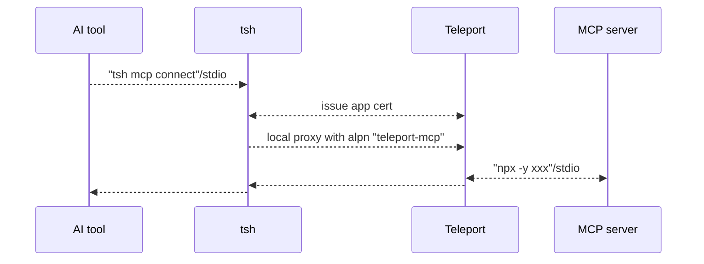

# RFD 0209 - MCP Access

## Required Approvers

* Engineering: @r0mant
* Product: @klizhentas

## What

Support zero-trust access for MCP servers.

## Why

Introduced in late 2024, Anthropic’s [Model Context Protocol
(MCP)](https://modelcontextprotocol.io/introduction) is a widely adopted,
open-source standard that enables language models to seamlessly interact with
external tools and data, enhancing their contextual capabilities.

However, MCP servers today are mostly operated locally without secure transport
or authorization. OAuth authorization was recently added to the specification,
but as of the time of writing, it is still new and not widely adopted.

With Teleport's support for MCP servers, users can:
- Host MCP servers on remote machines where transport is secured with TLS
- Control access to specific MCP servers and specific tools defined by Teleport roles
- Track activity through Teleport's audit log

## Details

To expedite the initial rollout, the first iteration of MCP server support will
be implemented through App access.

### UX

#### editor - configure a filesystem MCP server and define RBAC
To configure a [filesystem MCP
server](https://github.com/modelcontextprotocol/servers/tree/main/src/filesystem)
via Teleport app service:
```yaml
app_service:
  enabled: true
  apps:
  - name: "dev-files"
    description: "Shared files for developers"
    labels:
      env: "dev"
    mcp:
      command: "npx"
      args: ["-y", "@modelcontextprotocol/server-filesystem", "/home/dev/files"]
```

To create a role for admins that have full access to MCP servers:
```yaml
kind: role
version: v7
metadata:
  name: admin
spec:
  allow:
    app_labels:
      "*": "*"
```

To create a role for devs that can only access `dev` MCP servers and only have
read-only access to the filesystem:
```yaml
kind: role
version: v7
metadata:
  name: admin
spec:
  allow:
    app_labels:
      "env": "dev"
    # The name of the MCP tools to allow access to.
    # The wildcard character '*' matches any sequence of characters.
    # If the value begins with '^' and ends with '$', it is treated as a regular expression.
    mcp_tools:
    - search_files
    - get_*
    - ^(read|list)_.*$
```

#### access - configure Claude Desktop to use the MCP server via Teleport

First, to retrieve a list of allowed MCP servers:
```bash
$ tsh login ...
...

$ tsh mcp ls
Name      Description                 Command Args
--------- --------------------------- ------- ------------------------------------------------
dev-files Shared files for developers npx     [-y @modelcontextprotocol/server-filesystem ...]
```

To show configuration information:
```bash
$ tsh mcp config dev-files
Use the following command to connect the "dev-files" MCP server:
tsh mcp connect dev-files

For example, to install it on Claude Desktop, add the following entry to
"mcpServers" in "claude_desktop_config.json", then restart Claude Desktop:
{
  "mcpServers": {
    "teleport-dev-files": {
      "command": "tsh",
      "args": [ "mcp", "connect", "dev-files" ]
    }
  }
}

Note that when tsh session expires, you may need to restart Claude Desktop after
logging in a new tsh session.
```

After following the instruction, Claude Desktop now shows a list of filesystem
tools that are from server "teleport-dev-files".


Now start chatting with Claude to use these tools. For example, "can you
retrieve me the content of file xxxx?", "can you search files related to xxxx?".

If Claude is asked to perform a write operation, the tool invocation receives an
access-denied error, and Claude understands the operation is denied by Teleport
based on the context provided in the error.

#### auditor - track MCP server usage

There are a few audit events related to MCP server sessions:
- `mcp.session.start`/`mcp.session.end`: A start event and an end event is
  expected per session from client.
- `mcp.session.notification`: Notifications that clients send to the server,
  like `notifications/initialized`.
- `mcp.session.request`: Requests that clients send to the server, like
  `initialize`, `tools/call`. Frequent/basic discovery calls like `tools/list`,
  `resources/list` are not recorded. `tools/call` that are access denied will also
  have related errors recorded in the event.


### Implementation details



#### Implementation - transport

[`stdio`](https://modelcontextprotocol.io/specification/2025-03-26/basic/transports)
is the primary transport that MCP uses:
- the client launches the MCP server as a subprocess.
- stdin for client to server messages.
- stdout for server to client messages.
- stderr for any information or errors that the MCP server wants to log outside
  of communication with the client.

`stdio` will be used between the AI tool and `tsh`'s local proxy, and between
the app service and the MCP server getting launched on that host.

`tsh` will use a local proxy and starts a TLS routing tunnel with the Proxy,
using a new ALPN value `teleport-mcp`. Technically, the initial implementation
can reuse ALPN `teleport-tcp` as they share the same app handler entrypoint.
However, a new ALPN is introduced in case this entry point changes for MCP
servers in the future.

The duplex channel of the tunnelled TLS-routing connection to the proxy will
forward stdin and stdout respectively.

#### Implementation - auth

Since MCP servers are registered as apps, existing role option `app_labels` is
used to control which MCP servers a role can access based on the labels of the
MCP server apps.

A new role option `mcp_tools` is introduced to apply fine-grained control on
which tools from the MCP server should be allowed. Similar to
`kubernetes_resources.name`, entries in `mcp_tools` also support glob and regex
representations to make whitelist/blacklist easier. If `mcp_tools` is not
specified for a role, all tools are allowed by default.

The process to access the MCP server from `tsh` is the same as any other app,
where user has to obtain a user certificate with `route_to_app` for the TLS
routing handshake, and the backend validates the identity then routes to
appropriate app service based on this certificate.

Role option `mcp_tools` will be enforced per JSON-RPC `tool/call` call, which
will be detailed in the next section.

#### Implementation - MCP server handler with JSON-RPC

MCP server handler will be placed in App service's connection handler. The MCP
server handler will receive a raw connection once the connection is authorized
and confirmed to be an MCP app. It is expected [the MCP protocol in JSON-RPC
format](https://modelcontextprotocol.io/specification/2025-03-26) will be
transferred within this connection.

Since `stdio` is used, a new `exec.Command` defined by the app definition is
executed to start an MCP server, for each authorized incoming client connection.
Then stdin and stdout are proxied between the client connection and the launched
MCP server. Stderr from the launched MCP server will be logged in TRACE level in
Teleport logs.

Incoming bytes from client do get the following treatment before they are
forwarded to the launched MCP server:
- Parse into JSON-RPC messages. 
- If the message is a `tools/call` request, use access checker to confirm
  whether the identity has access to the requested tool.
  - If the `tools/call` is access denied, make a text result detailing this
    error and send it back to the client connection. Do not forward the request to
    the launched MCP server in this case.
- Record audit events for eligible messages.

The launched MCP server should be stopped once the connection ends.

#### Implementation - "tsh mcp" commands

A suite of `tsh mcp` commands are added on the client side:
- `tsh mcp ls`: lists MCP server apps.
- `tsh mcp connect`: command to be called by the AI tool to launch an MCP server
  through Teleport.
- `tsh mcp config`: shows a sample JSON configuration that launches the MCP
  server with `tsh mcp connect` for Claude Desktop. (Most AI tools uses the same
  JSON format though)
- `tsh mcp db`: command to be called by the AI tool to launch a local MCP server
  that provides a database query tool through Teleport Database access. This
  feature is outside this RFD but shares the same `tsh mcp` root.

#### Compatability with App access

Since the MCP servers run as apps, here’s a list of some existing app
functionalities and how they align with it:
- Web UI: MCP servers will be listed as Application resources. Similar to TCP
  apps, MCP servers cannot be "launched" through Web UI, and clicking "Connect"
  button opens a dialog with `tsh` instructions.
- VNet: not supported.
- Per-session MFA: not supported.
- Access Request: yes.
- Dynamic registration: yes.
- Audit events: will generate `cert.create` event when cert is requested, but no
  `app.session.start` event.
- `tsh`:
  - `tsh app ls`: will be listed with `MCP` as the type.
  - `tsh app login`: yes, but `tsh mcp connect` automatically does this too.
  - `tsh app logout`: yes.
  - `tsh app config`: no, redirect user to `tsh mcp config`.
  - `tsh proxy app`: no.

#### Usage reporting

`mcp.session.start` events will be reported for prehog session start events,
with `mcp` as the session type.

### Security

Transport and auth wise, this feature is mostly the same with existing TCP
access with the addition of the new role option `mcp_tools`.

One potential concern is that the App service executes an arbitrary 3rd party
command for each MCP session. However, since only Teleport administrators can
configure these commands, we assume they will be safe and valid MCP server
commands. This pattern isn't new though: `dynamic_labels` also demands the
Teleport service to run arbitrary commands.

### Future improvements

One key improvement can be done is to move MCP servers to a standalone service,
instead of relying on the App service, to support future expansion. Additional
enhancements, listed below in no particular order, were not included in the
initial implementation.

#### Improvement - environment variable support

Many MCP servers require extra environment variables to run. For example, the
[Slack](https://github.com/modelcontextprotocol/servers/tree/main/src/slack) MCP
server requires `SLACK_BOT_TOKEN` and a few other environment variables.

The initial implementation will not support specifying environment variables in
the app definition as it might become a security concern when secrets like
`SLACK_BOT_TOKEN` are saved in the app definition.

Users can still work around this limitation by setting these environment
variables when running the Teleport process, since launching the MCP server will
inherit the Teleport process's environment by default.

#### Improvement - "tools/list" filtering

The initial implementation can deny access to specific tools through
"tools/call". However, users can still see all available tools from the MCP
server, including the ones they don't have access to.

Ideally, the response of "tools/list" should be filtered so only allowed tools
are present. However, supporting this filter requires a more complex server
implementation and a lot driver refactoring. Special handling on
"notifications/tools/list_changed" may also be necessary.

#### Improvement - AI tool config handling

`tsh mcp config` currently only shows a sample config for Claude Desktop. A
better UX would be providing flags/sub commands to automatically detect and
update the config directly, even prompting for restart of the Claude Desktop.

In addition, other AI tools like Cursor, Zed, etc. can also be added for
support.

#### Improvement - expired tsh session handling

MCP server errors are permanent in Claude Desktop. When `tsh` session expires,
the user has to run `tsh login` then restart Claude Desktop.


To properly handle this, a mini JSON-RPC server should be served locally that
ensures a good connection with Claude Desktop. When `tsh` session expires, the
local JSON-RPC should instruct the user to perform a `tsh login` while
re-establish the connection with Proxy when possible. Note that the local
JSON-RPC server does NOT need to understand/implement the full MCP protocol as
it only forwards the protocol to backend when things are good and rejects the
request with hint when `tsh` session expires.

#### Improvement - non-stdio transports

Besides stdio as the transport of choice, MCP spec also outlines [streamable
HTTP
transport](https://modelcontextprotocol.io/specification/2025-03-26/basic/transports#streamable-http)
and possibility of custom transports. Support to non-stdio transports can be
added to Teleport when they are more widely used, (or when they make more sense
than stdio which requires launching a new subprocess).